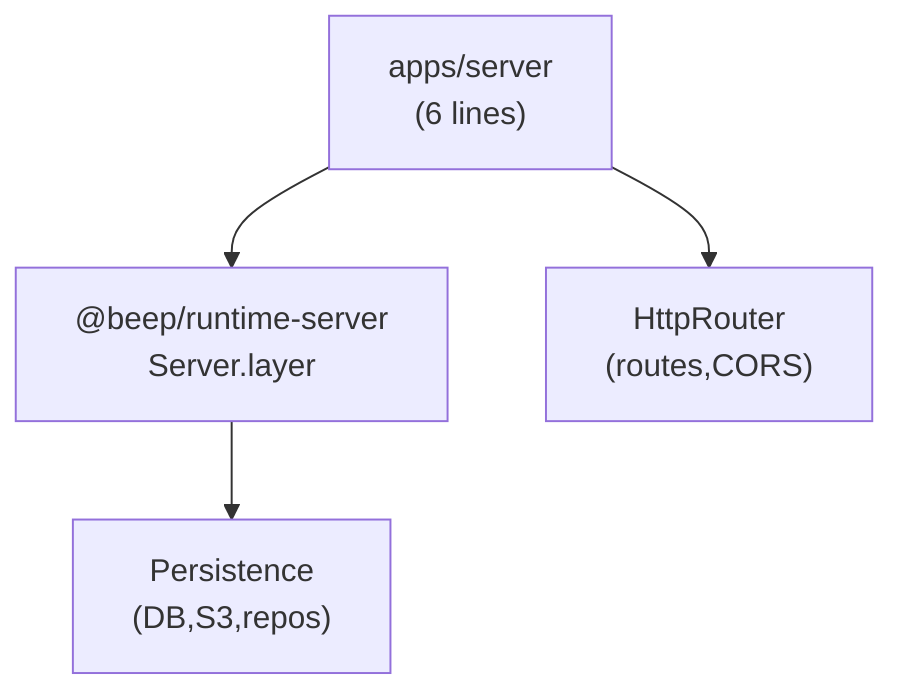

# @beep/server

Minimal Bun entry point that launches the complete Effect backend from `@beep/runtime-server`. All functionality is delegated - this package rarely needs modification.

## Architecture



## Core Modules

| Module | Purpose |
|--------|---------|
| `src/server.ts` | Entry point: `Layer.launch(Server.layer)` |
| `@beep/runtime-server` | Complete server layer composition |

## Usage Patterns

### Entry Point (Rarely Modified)

```typescript
import { Server } from "@beep/runtime-server";
import * as BunRuntime from "@effect/platform-bun/BunRuntime";
import * as Layer from "effect/Layer";

Layer.launch(Server.layer).pipe(BunRuntime.runMain);
```

### Adding Endpoints (In @beep/runtime-server)

```typescript
// packages/runtime/server/src/HttpRouter.layer.ts
const CustomRoute = HttpLayerRouter.use((router) =>
  router.add("GET", "/v1/custom", Effect.gen(function* () {
    return yield* Effect.succeed({ status: "ok" });
  }))
);
```

## Design Decisions

| Decision | Rationale |
|----------|-----------|
| Thin wrapper pattern | Functionality in @beep/runtime-server for reuse |
| Layer.launch entry | Effect-native lifecycle management |
| No direct process.env | Environment via @beep/shared-env/ServerEnv |
| BunRuntime.runMain | Platform-specific entry with proper signals |

## Dependencies

**Internal**: `@beep/runtime-server` (all server functionality)

**External**: `effect`, `@effect/platform-bun`, `better-auth`, `drizzle-orm`, OpenTelemetry exporters

## Related

- **AGENTS.md** - Detailed contributor guidance
- **packages/runtime/server/** - Where to add functionality
- **@beep/shared-env** - Environment configuration
