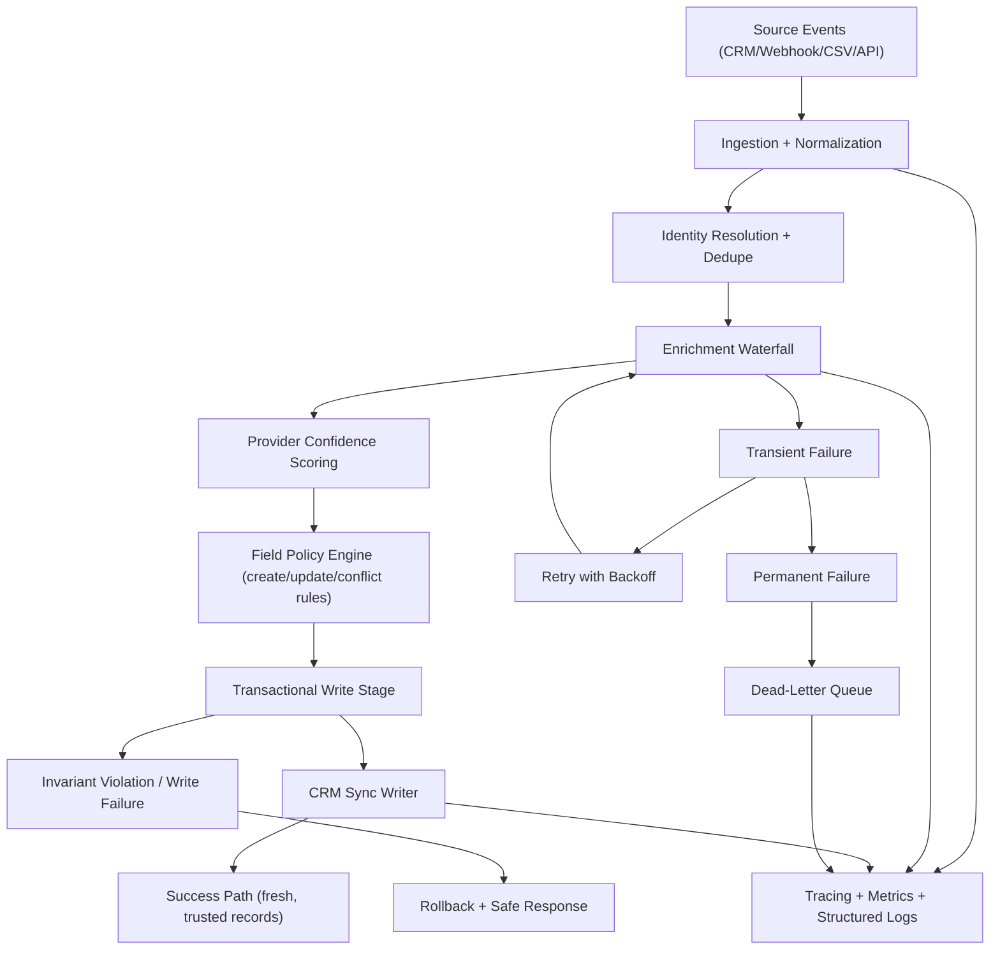
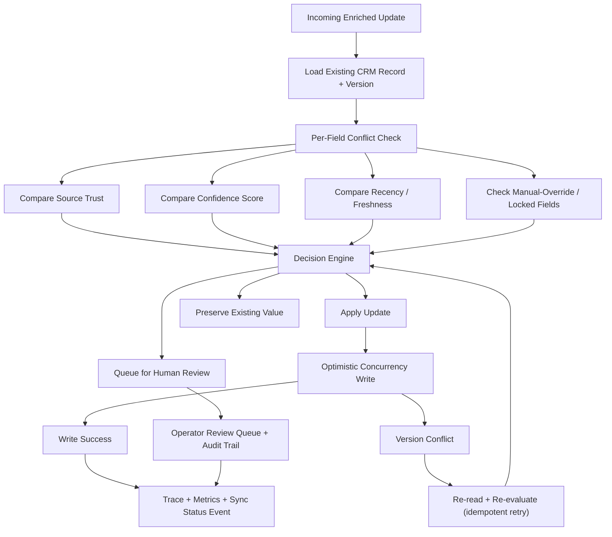
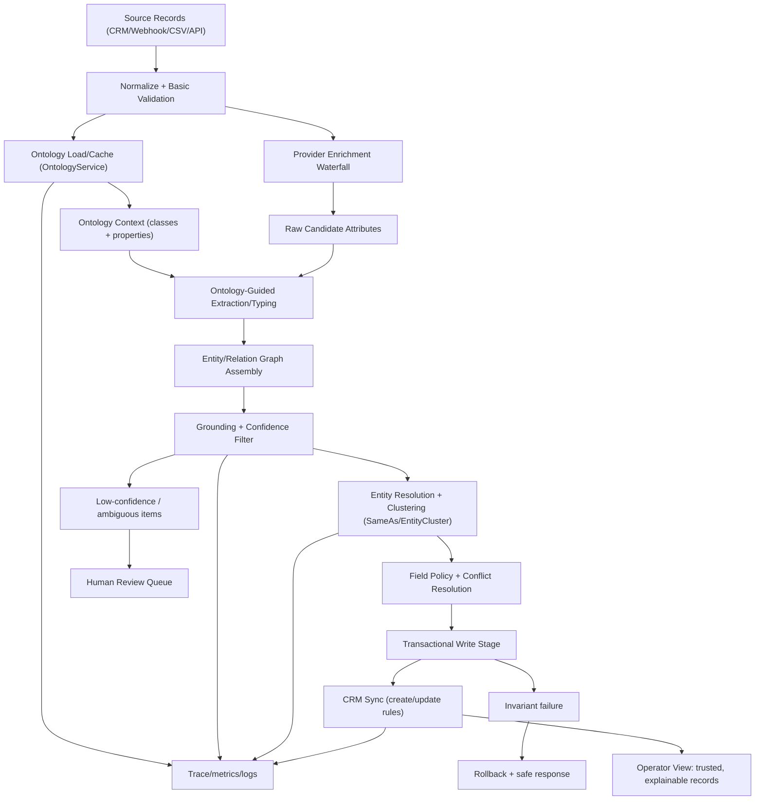

# Freckle Software Engineer Interview Prep (2026-02-16)

## 1. Fast Read (What matters most)

If you optimize for one thing in this interview, optimize for this:

- Freckle is clearly positioning itself as "powerful data enrichment without the Clay complexity tax".
- Their language is repeatedly "built for operators", "workflows that work in practice", and "fast + predictable sync".
- The strongest signal you can send is: you build reliable systems that hide complexity from users while preserving correctness at scale.

Your referrer tip is directionally correct: keep answers simple, and keep tying technical choices back to user outcomes (speed to value, clean CRM data, fewer broken workflows, fewer manual fixes).

Counter-assumption to keep in mind:

- Even if they avoid LeetCode-style interviews, they may still ask for structured problem solving on data models, sync logic, or pseudocode. Keep one compact technical walkthrough ready.

---

## 2. Freckle Snapshot (high-confidence, current)

### Product positioning

- Freckle describes itself as a modern AI CRM enrichment platform for HubSpot and Salesforce.
- Core promise: enrich company/contact data from the web plus many providers using natural language.
- Strong public positioning against Clay complexity: easier for non-technical users, faster to start.

### Customer/use-case signals

- They emphasize operators, RevOps, GTM teams, and CRM cleanliness over raw "AI magic".
- Messaging repeatedly highlights:
  - continuous enrichment
  - predictable sync behavior
  - fewer workarounds
  - real-time-ish workflow speed
- Public case-study claims (Bolt.new) center on measurable pipeline impact and speed to action.

### Growth/trajectory signals

- Public posts indicate:
  - 2024 pre-seed: $1.9M
  - 2025 seed: $4M led by Gradient and 1984 Ventures
- Public site and posts also mention customer traction and heavy workflow usage.

### Security/compliance signals

- Pricing FAQ publicly states SOC 2 Type I certified and Type II in progress (expected by March 2026).
- Terms + Privacy + DPA contain mature language around processor/service-provider roles, incident notifications, transfers (SCCs), subprocessors, and AI data handling.
- Public legal pages state customer personal data is not used to train Freckle AI models.

### Hiring/process signal relevant to your interview style

- Public Ashby board currently shows Customer Solutions Engineer (posted 2026-02-13), not Software Engineer.
- That posting still gives useful culture signal: practical workflow design, edge-case handling, customer-centric problem solving, and clear tradeoffs.

Implication:
- Even in a software engineering interview, expect questions around practical architecture and operational outcomes, not algorithm puzzles.

---

## 3. Domain Context You Should Speak Fluently

Use these terms naturally in answers:

- CRM enrichment
- RevOps
- GTM data operations
- data quality and coverage
- enrichment waterfall
- identity resolution / record matching
- sync semantics (new vs existing record behavior)
- conflict-safe updates (avoid clobbering trusted fields)
- time-to-value for non-technical operators
- reliability under messy inputs (partial emails, incomplete records)

Useful phrase patterns (matches Freckle language):

- "fast path to trustworthy CRM records"
- "reduce operator toil"
- "continuous, predictable enrichment"
- "design for messy real-world data"
- "optimize for user confidence, not feature surface area"

---

## 4. Your Best Positioning (based on your resumes + this repo)

### What is strongest

1. You have shipped AI-enabled systems in production with measurable impact.
2. You show strong Effect architecture depth, not just TypeScript familiarity.
3. You clearly care about operational correctness (transactions, typed errors, observability, multi-tenant boundaries).
4. You can bridge high-level architecture and implementation detail.

### What to tune for this interview

- Keep humor and adversarial tone from resume drafts turned down.
- Replace "over-engineering" framing with "intentional engineering for reliability + operator speed".
- If asked about architectural sophistication, always close with user-facing impact.

A good framing sentence:

- "My default is to absorb complexity in the platform so operators can run workflows safely without becoming platform experts."

---

## 5. Repo Sections to Highlight (best fit for Freckle)

### A) Durable workflow orchestration and idempotency

Why it fits Freckle:
- Enrichment and sync workflows must survive retries, failures, and restarts.

Show:
- `tooling/cli/src/commands/docgen/agents/workflow.ts`
  - `Workflow.make(...)` with explicit `idempotencyKey`.
  - durable sleeps/rate limiting with `DurableClock.sleep(...)`.
  - step-by-step orchestration with typed success/error contracts.

Interview talking point:
- "I design workflow boundaries around idempotency and replay safety first, then optimize throughput."

### B) Workflow runtime mode design (memory vs durable SQL-backed)

Why it fits Freckle:
- They are scaling workflow-heavy systems. Runtime strategy matters.

Show:
- `packages/knowledge/server/src/Runtime/WorkflowRuntime.ts`
  - mode switch between `WorkflowEngine.layerMemory` and `ClusterWorkflowEngine` + `SingleRunner` SQL runner.
  - explicit config-driven selection for operational control.

Interview talking point:
- "I keep runtime mode explicit so teams can choose lower-latency dev modes or durable production modes without hidden behavior."

### C) Transactional invariants and graceful fallback on failure

Why it fits Freckle:
- Enrichment systems cannot leave partial writes or orphan references.

Show:
- `packages/knowledge/server/src/entities/MeetingPrep/rpc/generate.ts`
  - atomic write using `sql.withTransaction(...)` for bullet + citation invariant.
  - deterministic fallback on DB/SQL errors (`catchTags` returning safe empty response).

Interview talking point:
- "I protect invariants with transactions and never let recoverable failures crash user-critical flows."

### D) Multi-tenant context safety

Why it fits Freckle:
- CRM tooling is tenant-sensitive and high-risk if data crosses boundaries.

Show:
- `packages/shared/server/src/TenantContext/TenantContext.ts`
  - explicit tenant session context strategy.
  - comments that explain connection-pool tradeoffs (`SET` vs `SET LOCAL`).
  - defensive SQL escaping at trust boundaries.

Interview talking point:
- "I make tenant isolation explicit and operationally testable, not implicit."

### E) Layer hygiene and compile-time dependency discipline

Why it fits Freckle:
- Startup velocity breaks systems when dependency graphs drift silently.

Show:
- `tooling/cli/src/commands/verify/layers/handler.ts`
  - automated checks for explicit layer and `serviceEffect` typing.
  - catches missing dependency declarations before runtime failures.

Interview talking point:
- "I use cheap static checks to prevent expensive production debugging."

### F) Observability by default

Why it fits Freckle:
- Data workflows need fast diagnosis when quality/sync issues appear.

Show:
- `packages/runtime/server/src/Tracer.layer.ts`
  - OTLP trace/log/metric exporters.
- `packages/runtime/server/src/Runtime.ts`
  - runtime helper wrappers that enforce `Effect.withSpan(...)`.

Interview talking point:
- "If users say data is stale or wrong, observability should tell us where the workflow failed within minutes."

### G) Effect cluster entity model pattern

Why it fits Freckle:
- Signals fluency in distributed/stateful design primitives likely aligned with their internal stack.

Show:
- `packages/iam/domain/src/entities/Member/Member.entity.ts`
  - `ClusterEntity.fromRpcGroup(...).annotateRpcs(ClusterSchema.Persisted, true)`.

Interview talking point:
- "I model stateful entity operations as typed RPC groups with explicit persistence semantics."

---

## 6. Architecture Questions You Are Likely to Get (and how to answer)

### Q1: "How would you design a reliable enrichment pipeline for CRM records?"

Answer skeleton:
1. Define user outcome first (fresh, trustworthy, activation-ready records).
2. Ingestion paths (CRM native, webhook, CSV/API).
3. Identity resolution and dedupe strategy.
4. Enrichment waterfall with provider confidence scoring.
5. Idempotent writes and conflict-safe merge policy.
6. Transaction boundaries for multi-table invariants.
7. Retry/dead-letter strategy + observability.
8. Operator controls (run conditions, preview, backfill, rollback).

Close with:
- "The goal is not just data completeness. It is operator confidence that syncs are safe and predictable."

### Q2: "How do you balance configurability vs usability?"

Answer skeleton:
1. Start with opinionated defaults for common workflows.
2. Add advanced controls progressively, not upfront.
3. Guardrails over raw power (validation, dry-runs, conflict policy).
4. Instrument where users get stuck; simplify highest-friction points first.

Close with:
- "I treat complexity budget as finite. If a feature increases cognitive load, it must pay for itself in user outcomes."

### Q3: "How would you debug data drift between Freckle and Salesforce/HubSpot?"

Answer skeleton:
1. Define expected sync contract and freshness SLO.
2. Trace one record end-to-end (ingest -> enrich -> write-back).
3. Check id mapping, dedupe, and overwrite policy.
4. Verify retries and queue lag.
5. Add targeted instrumentation where ambiguity remains.
6. Provide temporary operator mitigation path while permanent fix ships.

Close with:
- "Debugging is product work: we fix root cause and improve operator visibility so the same failure is obvious next time."

### Q4: "How do you decide what to build first in an early-stage platform?"

Answer skeleton:
1. Map friction to user impact frequency x severity.
2. Prioritize workflows that shorten time-to-first-value.
3. Prefer reliability/quality fixes over net-new surface area if trust is at risk.
4. Keep solution reversible and measurable.

Close with:
- "At this stage, trust and speed compound more than feature count."

---

## 7. Suggested Personal Narrative (tight version)

### 45-second intro

"I am a full-stack Effect-first engineer focused on building reliable workflow systems for real operators. In my current work I have shipped AI-enabled production systems with measurable operational impact and strict security constraints. In this repo, I focus on durable workflows, typed service boundaries, transactional invariants, and observability, because those are the pieces that make complex systems feel simple and trustworthy for end users."

### 2-minute "why Freckle" angle

"What stands out to me about Freckle is the focus on operators over complexity theater. Your public messaging is clear: make enrichment reliable, usable, and fast inside existing CRM workflows. That maps directly to how I build. I like systems where the hard part is hidden inside robust architecture so users can move quickly without risky workarounds."

---

## 8. Keywords and Phrases to Weave In

Use these naturally, not all at once:

- operator-first
- predictable sync
- trustworthy data
- workflow reliability
- idempotent execution
- conflict-safe updates
- continuous enrichment
- graceful degradation
- transactional invariants
- measurable GTM impact
- reduce manual data toil

---

## 9. Smart Questions to Ask Interviewers

### Product + users

1. "Which operator persona are you optimizing hardest for right now: RevOps, sales ops, growth, or another segment?"
2. "Where do users currently lose trust in the workflow: matching, enrichment quality, or sync behavior?"
3. "What does success look like 30 days after onboarding for your best customers?"

### Architecture + reliability

1. "How do you currently model idempotency and replay safety across enrichment + sync flows?"
2. "Where do you see the highest operational risk today: provider variability, CRM write-back conflicts, or volume spikes?"
3. "How do you define and monitor freshness/quality SLAs for enriched records?"

### Team + execution

1. "How do product and engineering prioritize between reliability work and net-new features?"
2. "What kinds of engineering decisions most improve customer outcomes in the first 90 days here?"

---

## 10. Mistakes to Avoid

- Do not lead with framework enthusiasm; lead with user outcomes and reliability.
- Do not imply "more complexity = better architecture".
- Do not overuse combative/hyperbolic humor from application drafts.
- Do not assume public hiring pages fully reflect internal/open referral hiring.
- Do not cite specific subprocessor names unless you verify live from trust center.

---

## 11. Same-Day Interview Checklist

### Before interview

- Prepare 3 stories:
  - durable workflow design
  - data integrity under failure
  - cross-functional delivery with measurable user impact
- Memorize 2 metrics you can defend (for example, production impact and reliability outcomes).
- Prepare 2 architecture whiteboard flows:
  - enrichment pipeline
  - sync conflict resolution

### During interview

- Use this answer pattern repeatedly:
  - user problem -> design choice -> tradeoff -> reliability guardrail -> outcome
- Keep jargon light unless interviewer pulls deeper.
- Ask at least one concrete question about user pain and one about reliability priorities.

### After interview

- Send concise follow-up with:
  - one architecture point you enjoyed discussing
  - one user problem you are excited to solve
  - one concrete way your experience maps to their next 6-12 months

---

## 12. Source Links (research)

### Freckle core

- Website: https://www.freckle.io/
- Pricing: https://www.freckle.io/pricing
- Blog index: https://www.freckle.io/blog
- Trust Center: https://trust.freckle.io/
- Subprocessors page: https://trust.freckle.io/subprocessors
- Privacy Policy: https://www.freckle.io/privacy-policy
- DPA: https://www.freckle.io/dpa
- Terms: https://www.freckle.io/terms-of-service

### Freckle blog pages used

- Seed: https://www.freckle.io/blog/freckle-seed-2025
- Pre-seed: https://www.freckle.io/blog/freckle-pre-seed-2024
- Salesforce integration: https://www.freckle.io/blog/salesforce-integration-announcement
- People Search (Apollo): https://www.freckle.io/blog/people-search-powered-by-apollo
- Bolt case study: https://www.freckle.io/blog/bolt
- Product update: https://www.freckle.io/blog/product-update-12-02-2026

### Careers pages used

- Jobs board: https://jobs.ashbyhq.com/freckle
- Public posting (used for process/culture signal): https://jobs.ashbyhq.com/freckle/7a029c84-dc45-4a4b-80a0-da77ef812189

---

## 13. Notes on Certainty and Gaps

- High confidence: product positioning, funding posts, FAQ positioning, pricing/security claims, and legal-policy language above.
- Medium confidence: some trust-center page details are JS-rendered and not easily extractable in this environment; use trust center directly if you need exact current subprocessor entries.
- Important timing note: this prep is based on pages fetched on 2026-02-16.

---

## 14. Concept Deep Dives (Interview-Ready)

Use this section to explain the architecture terms in plain language and tie them back to user outcomes.

### Freshness SLO

What it is:
- An SLO (Service Level Objective) for freshness defines how quickly data should be updated after a source change.
- Example: \"95% of new signups should be enriched and synced to CRM within 5 minutes.\"

Why it matters:
- Operators lose trust quickly when data looks stale.
- Sales and GTM actions are time-sensitive; old data means missed pipeline.

How to say it in interview:
- \"I define freshness targets up front so the team can measure whether enrichment is fast enough to support same-day action.\"

Common failure mode:
- Teams track uptime but not freshness; system is \"up\" while data is effectively unusable.

### Enrichment Waterfall

What it is:
- A staged sequence of enrichment providers/strategies.
- You try higher-quality/cheaper/faster sources first, then fall back if needed.

Why it matters:
- No single provider is complete or always accurate.
- Waterfalls improve coverage while controlling cost and latency.

How to say it in interview:
- \"I treat enrichment as a waterfall with explicit stop conditions and quality checks, not a blind fan-out to every provider.\"

Common failure mode:
- Running every provider every time drives cost up and may create conflicting values.

### Identity Resolution / Record Matching

What it is:
- Determining whether two records refer to the same real-world entity (person/company).
- Uses keys/signals like domain, email, LinkedIn URL, normalized company name, phone, etc.

Why it matters:
- Bad matching creates duplicate CRM records, routing errors, and bad analytics.

How to say it in interview:
- \"I treat matching as a confidence-based decision with conservative defaults to avoid false merges.\"

Common failure mode:
- Over-aggressive matching that merges unrelated records and pollutes CRM history.

### Sync Semantics (New vs Existing Record Behavior)

What it is:
- Clear rules for how sync handles record creation vs updates.
- New record: create or skip?
- Existing record: overwrite, append, merge, or preserve source-of-truth fields?

Why it matters:
- Unclear semantics cause accidental data clobbering and operator distrust.

How to say it in interview:
- \"I make sync behavior explicit per field: create policy, update policy, and conflict policy.\"

Common failure mode:
- Treating all fields the same; low-confidence enrichment overwrites trusted CRM-entered values.

### Connection-Pool Tradeoffs (`SET` vs `SET LOCAL`)

What it is:
- `SET` changes a session variable for a DB connection.
- `SET LOCAL` applies only inside the current transaction.

Why it matters:
- With connection pooling, requests may hop connections.
- `SET LOCAL` is safer for transaction-scoped context, but only if all relevant queries are guaranteed to run in that transaction/connection.
- Session-level `SET` can leak context if not carefully cleared.

How to say it in interview:
- \"Pool behavior changes context guarantees, so I choose between session-level and transaction-level settings based on query lifecycle, then enforce cleanup rigorously.\"

Common failure mode:
- Assuming tenant/session context follows request boundaries automatically in pooled environments.

### Defensive SQL Escaping at Trust Boundaries

What it is:
- Sanitizing untrusted input before using it in SQL.
- Best default: parameterized queries.
- If SQL feature does not support parameters (e.g., certain `SET` patterns), apply strict escaping/allow-listing.

Why it matters:
- Prevents injection and context-corruption attacks.

How to say it in interview:
- \"At trust boundaries, I assume input is hostile and use parameterization first; if impossible, I use constrained escaping and validation.\"

Common failure mode:
- One unsafe path in a helper utility bypasses otherwise safe query code.

### Provider Confidence Scoring

What it is:
- Assigning a confidence score to each enriched attribute/value based on evidence quality.
- Inputs can include: provider reliability, recency, consistency across sources, extraction method confidence, verification status.

Why it matters:
- Lets you decide when to auto-write, when to queue for review, and when to keep existing CRM values.

How to say it in interview:
- \"Confidence scores let us automate aggressively where evidence is strong and stay conservative where uncertainty is high.\"

Common failure mode:
- Treating all provider outputs as equally trustworthy.

### Retry/Dead-Letter Strategy + Observability

What it is:
- Retry strategy: handle transient failures with bounded retries and backoff.
- Dead-letter queue (DLQ): captures items that keep failing so they do not block the pipeline.
- Observability: traces/logs/metrics show where and why failures occur.

Why it matters:
- Without DLQ, poison messages can stall throughput.
- Without observability, you cannot distinguish provider outage vs schema bug vs bad input.

How to say it in interview:
- \"I separate transient from permanent failures, retry the former with backoff, send persistent failures to DLQ, and instrument all stages so operators can see status quickly.\"

Common failure mode:
- Infinite retries with no cap or no alerting.

### Transaction Boundaries for Multi-Table Invariants

What it is:
- Wrapping related writes in one transaction when they must succeed/fail together.
- Example invariant: a generated bullet must always have at least one citation row.

Why it matters:
- Prevents partial writes and orphan records.
- Protects user trust and downstream workflow correctness.

How to say it in interview:
- \"I define invariants first, then enforce them with transaction boundaries so the system cannot persist invalid intermediate state.\"

Common failure mode:
- Multi-step writes across tables without a transaction, causing inconsistent state after mid-flight failure.

### Time-to-First-Value (TTFV)

What it is:
- How long from first user action (or signup/integration) until meaningful product value is delivered.
- For Freckle-like workflows: first accurate enrichment + successful sync visible in CRM.

Why it matters:
- Early-stage products win by proving value fast.
- Faster TTFV drives adoption and retention.

How to say it in interview:
- \"I optimize architecture for short TTFV: opinionated defaults, reliable first workflow, and immediate visibility into outcomes.\"

Common failure mode:
- Shipping powerful configuration without a fast success path.

---

## 15. Bottom-of-Doc Interview Cheat Sheet

Use these as short, plain-English definitions if asked directly.

### Freshness SLO
- Definition: A target for how quickly source changes appear as updated CRM data.
- Interview line: \"Freshness SLOs make data timeliness measurable, not subjective.\"

### Enrichment Waterfall
- Definition: Ordered provider fallback logic to maximize coverage while controlling cost/quality.
- Interview line: \"I run the best source first, then controlled fallbacks with stop conditions.\"

### Identity Resolution / Record Matching
- Definition: Determining whether records from different sources represent the same real entity.
- Interview line: \"I prefer conservative matching to avoid false merges that pollute CRM.\"

### Sync Semantics (New vs Existing)
- Definition: Explicit create/update/conflict behavior rules per record and field.
- Interview line: \"I define write policies per field so enrichment can’t clobber trusted data.\"

### Connection-Pool Tradeoffs (`SET` vs `SET LOCAL`)
- Definition: `SET` is session-scoped; `SET LOCAL` is transaction-scoped. Pooling changes guarantees.
- Interview line: \"I align context scope to connection lifecycle, then enforce cleanup and transaction discipline.\"

### Defensive SQL Escaping at Trust Boundaries
- Definition: Parameterize inputs by default; strictly validate/escape where parameterization is unavailable.
- Interview line: \"At trust boundaries, I assume hostile input and harden query paths.\"

### Provider Confidence Scoring
- Definition: Confidence score per enriched value based on source quality, recency, and evidence agreement.
- Interview line: \"Confidence drives whether we auto-write, review, or preserve existing values.\"

### Retry + DLQ + Observability
- Definition: Retry transient failures with backoff, route persistent failures to dead-letter queue, instrument every stage.
- Interview line: \"Retries keep throughput high; DLQ prevents poison items from stalling the system.\"

### Transaction Boundaries for Multi-Table Invariants
- Definition: Group related writes in one transaction when data must remain consistent as a unit.
- Interview line: \"If an invariant spans tables, I enforce it transactionally.\"

### Time-to-First-Value (TTFV)
- Definition: Time from setup to first meaningful customer-visible result.
- Interview line: \"I optimize onboarding and defaults to produce value fast.\"

### Idempotent Execution
- Definition: Re-running the same operation produces the same logical outcome without duplicate side effects.
- Interview line: \"I design workflows so retries are safe and don’t duplicate writes or actions.\"

### Conflict-Safe Updates
- Definition: Update strategy that resolves field/version/source conflicts without destroying trusted data.
- Interview line: \"I use precedence and confidence rules so lower-trust updates can’t overwrite higher-trust values.\"

### Continuous Enrichment
- Definition: Ongoing enrichment as data changes, not one-time batch backfills only.
- Interview line: \"I treat enrichment as a continuous pipeline so CRM quality stays high over time.\"

### Graceful Degradation
- Definition: System still returns safe, useful behavior when dependencies fail (instead of hard crashes).
- Interview line: \"When providers fail, we fail soft: partial results, clear status, and retry paths.\"

### Operator-First
- Definition: Product and architecture decisions prioritize workflow clarity, speed, and trust for day-to-day users.
- Interview line: \"I hide platform complexity so operators can execute reliably without becoming experts in the internals.\"

---

## 16. Story Pack (Ready to Use)

Use these as your default 60-90 second answers.

### Story 1: Durable Workflow Design

Headline:
- \"I design workflows to be retry-safe and crash-resilient before optimizing throughput.\"

Situation:
- I needed to orchestrate multi-step, tool-driven automation where retries and interruptions were expected.

Task:
- Make execution reliable across failures without duplicate side effects.

Action:
- Defined a workflow with explicit payload, typed success/error contracts, and deterministic `idempotencyKey` logic.
- Added durable timing/rate limits and serialized critical steps to control external API behavior.
- Kept runtime modes explicit (`memory` vs durable SQL-backed engine) so dev/prod behavior is predictable and auditable.

Result:
- Retry behavior stayed safe (no duplicate logical outcomes) and recovery paths were explicit.
- Reduced operator uncertainty because execution state and failure points were traceable.

Freckle tie-in:
- \"For enrichment/sync pipelines, durable + idempotent execution is what keeps retries from turning into duplicate writes or noisy CRM state.\"

### Story 2: Data Integrity Under Failure

Headline:
- \"I protect invariants with transactions and fail soft when dependencies fail.\"

Situation:
- I had a multi-table write path where records must remain consistent as a unit.

Task:
- Prevent partial writes/orphans when DB or upstream steps fail.

Action:
- Wrapped dependent writes in a single SQL transaction for atomicity.
- Added typed boundary error handling to return deterministic safe responses for recoverable DB/SQL failures.
- Instrumented error paths to preserve diagnosability without exposing sensitive data.

Result:
- Invariant was preserved even under failure scenarios.
- Users got predictable outcomes instead of crashes or corrupted intermediate state.

Freckle tie-in:
- \"In CRM enrichment, partial updates are worse than no update. Atomic writes + graceful degradation maintain trust.\"

### Story 3: Cross-Functional Delivery with Measurable User Impact

Headline:
- \"I ship operator-facing systems with measurable outcomes, not just architecture diagrams.\"

Situation:
- At Rocket Inventory, warehouse operators needed faster execution and lower complexity in day-to-day workflows.

Task:
- Deliver real operational gains while coordinating product, engineering, and frontline user needs.

Action:
- Built AI-assisted workflow capabilities (including route optimization + voice-guided support).
- Led and mentored a team of junior engineers to ship reliably on a modern TypeScript/Effect stack.
- Focused design choices on usability for non-specialist operators, not just configurability for power users.

Result (metrics from your resume):
- Up to **40% reduction in picking travel time** via route optimization.
- Security posture validated externally at **Mozilla Observatory A+ (115/100)** for `app.rocketinventory.com`.

Freckle tie-in:
- \"I’m aligned with operator-first execution: remove friction, keep workflows trustworthy, and prove impact with measurable outcomes.\"

---

## 17. Two Metrics to Memorize (and Defend)

### Metric 1: Up to 40% reduction in picking travel time

What to say:
- \"We reduced picking travel time by up to 40% through AI-driven route optimization and dynamic rerouting.\"

Why it is defensible:
- It maps to a concrete operational KPI (travel time/path efficiency).
- It directly affects throughput and labor efficiency.
- It came from production workflow usage, not synthetic benchmarking.

If challenged:
- \"The exact lift varies by workflow maturity and facility constraints, so I frame it as 'up to 40%' rather than a universal average.\"

### Metric 2: Mozilla Observatory A+ (115/100) for app.rocketinventory.com

What to say:
- \"We achieved A+ with a 115/100 Observatory score, reflecting strong practical web hardening.\"

Why it is defensible:
- External third-party benchmark.
- Reproducible scan methodology.
- Ties directly to trust and enterprise readiness.

If challenged:
- \"I treat this as one trust signal, not a complete security claim. It complements architecture controls and operational security practices.\"

---

## 18. Whiteboard Flow 1: Enrichment Pipeline

Use this when asked how you would design a robust enrichment system.

Talking points:
- Start with user outcome: fast, trustworthy CRM records.
- Emphasize idempotency, confidence-based write policy, and atomic writes.
- Show operational control via retries, DLQ, and observability.

---

## 19. Whiteboard Flow 2: Sync Conflict Resolution

Use this when asked \"How do you avoid overwriting good CRM data?\"

Talking points:
- Conflicts are resolved by explicit policy, not hidden overwrite behavior.
- Human review path exists for ambiguous updates.
- Concurrency/version conflicts are handled safely with re-read + idempotent re-evaluation.

---

## 20. How to Deliver These Live (Simple Script)

- Open with user problem in one sentence.
- Draw the flow left-to-right in 5-7 boxes.
- Call out three guardrails: idempotency, transactional invariants, observability.
- End with one measurable outcome and one tradeoff.

Example close:
- \"This design optimizes operator trust and time-to-first-value; the tradeoff is more policy definition work up front, but it prevents downstream CRM drift and support burden.\"

---

## 21. Ontology-Driven Upgrade to the Enrichment Pipeline (Your Knowledge Slice Angle)

This is the strongest way to explain how your knowledge slice can improve Freckle-style enrichment.

### Core idea

- Use ontology definitions as the semantic contract for enrichment fields and relationships.
- Instead of treating enrichment as \"flat attribute fill,\" treat it as \"ontology-constrained graph construction + scoring + sync.\"

### Why this improves pipeline quality

1. Better field precision:
- Class/property definitions constrain what values are valid for a given concept.
- Reduces wrong-field or wrong-type enrichment writes.

2. Better matching and dedupe:
- Entity resolution + clustering (`EntityCluster`) improves identity consistency before CRM write-back.
- Reduces duplicate contacts/accounts and merge mistakes.

3. Better confidence decisions:
- Grounding/confidence filters remove weak entities/relations before sync.
- Improves signal quality and lowers bad auto-overwrites.

4. Better explainability for operators:
- You can expose \"why this value exists\" through provenance/citation traces.
- Helps operators trust and audit enrichment outcomes.

### Repo-backed talking points to cite

- Ontology parsing/caching and context loading:
  - `packages/knowledge/server/src/Ontology/OntologyService.ts`
- Ontology-guided extraction pipeline:
  - `packages/knowledge/server/src/Extraction/ExtractionPipeline.ts`
- Confidence filtering and orphan removal:
  - `packages/knowledge/server/src/Grounding/ConfidenceFilter.ts`
- Entity resolution and clustering:
  - `packages/knowledge/server/src/EntityResolution/EntityResolutionService.ts`
- Ontology domain entities:
  - `packages/knowledge/domain/src/entities/Ontology/Ontology.entity.ts`
  - `packages/knowledge/domain/src/entities/ClassDefinition/ClassDefinition.entity.ts`
  - `packages/knowledge/domain/src/entities/PropertyDefinition/PropertyDefinition.entity.ts`
  - `packages/knowledge/domain/src/entities/EntityCluster/EntityCluster.entity.ts`

### Interview phrasing

- \"I’d use our ontology slice as a semantic quality layer on top of enrichment providers, so sync decisions are schema-aware, confidence-aware, and explainable.\"
- \"This turns enrichment from value scraping into governed knowledge operations with safer CRM outcomes.\"

### Mermaid: Ontology-Augmented Enrichment Workflow

### What to emphasize when drawing this live

- Ontology is not \"extra complexity\"; it is a quality and trust multiplier.
- Confidence + clustering happen before write-back, so bad data is filtered earlier.
- Operators get both cleaner CRM data and better explainability.

---

## 22. Diagram Component Walkthroughs (Box-by-Box)

Use this section if they ask you to go deeper on any node in the Mermaid flows.

### A) Enrichment Pipeline Components (`Section 18`)

#### `Source Events (CRM/Webhook/CSV/API)`
- Purpose: entry point for all inbound data changes.
- Input: raw records from CRM syncs, webhooks, uploads, or APIs.
- Output: event envelope with source metadata and payload.
- Risk to mention: duplicate events and out-of-order delivery.

#### `Ingestion + Normalization`
- Purpose: convert heterogeneous input into a canonical internal shape.
- Input: source event envelope.
- Output: normalized record with typed fields, source id, and ingest timestamp.
- Risk to mention: schema drift from external systems.

#### `Identity Resolution + Dedupe`
- Purpose: map incoming records to existing entities and prevent duplicates.
- Input: normalized record + existing identifiers.
- Output: entity key decision (`match`, `new`, or `ambiguous`).
- Risk to mention: false merges are more damaging than conservative misses.

#### `Enrichment Waterfall`
- Purpose: resolve missing fields using prioritized providers.
- Input: canonical record + required field set.
- Output: candidate enriched attributes with provider provenance.
- Risk to mention: provider inconsistency or rate-limit spikes.

#### `Provider Confidence Scoring`
- Purpose: estimate trustworthiness per attribute.
- Input: candidate attributes + provider metadata + recency/consistency signals.
- Output: scored attributes and confidence bands.
- Risk to mention: static scoring drifts without feedback loops.

#### `Field Policy Engine (create/update/conflict rules)`
- Purpose: apply write policy per field before any persistence.
- Input: scored attributes + existing CRM state + policy config.
- Output: deterministic write plan (`apply`, `preserve`, `review`).
- Risk to mention: global policy is usually too coarse; use field-level rules.

#### `Transactional Write Stage`
- Purpose: persist multi-entity changes atomically.
- Input: write plan + related entities.
- Output: committed state or full rollback.
- Risk to mention: partial writes if transaction boundaries are too narrow.

#### `CRM Sync Writer`
- Purpose: push approved updates to CRM with idempotent semantics.
- Input: committed update payloads.
- Output: CRM upsert result + sync status event.
- Risk to mention: external API partial failures require replay-safe retry logic.

#### `Success Path (fresh, trusted records)`
- Purpose: operator-visible completed outcome.
- Input: successful sync.
- Output: up-to-date CRM state and downstream-ready data.
- Risk to mention: success must include freshness SLO, not just 200 responses.

#### `Transient Failure -> Retry with Backoff`
- Purpose: recover automatically from temporary errors.
- Input: timeout/rate-limit/temporary upstream issues.
- Output: bounded retry attempts with jitter/backoff.
- Risk to mention: retries without idempotency create duplicate side effects.

#### `Permanent Failure -> Dead-Letter Queue`
- Purpose: isolate poison items from hot-path throughput.
- Input: non-recoverable errors after retry budget.
- Output: triage queue with full failure context.
- Risk to mention: DLQ without ownership becomes silent data loss.

#### `Invariant Violation / Write Failure -> Rollback + Safe Response`
- Purpose: preserve correctness even when persistence fails.
- Input: failed transactional checks or DB errors.
- Output: no partial commit + deterministic failure response.
- Risk to mention: crash-only behavior erodes operator trust quickly.

#### `Tracing + Metrics + Structured Logs`
- Purpose: diagnose quality and reliability issues quickly.
- Input: stage-level events and spans.
- Output: observability trail for latency, failures, and data quality.
- Risk to mention: missing correlation ids makes incident response slow.

### B) Sync Conflict Resolution Components (`Section 19`)

#### `Incoming Enriched Update`
- Purpose: candidate update arriving for an existing CRM record.
- Input: enriched fields + source/provenance data.
- Output: update request with correlation id.
- Risk to mention: stale updates arriving after fresher writes.

#### `Load Existing CRM Record + Version`
- Purpose: fetch current source-of-truth state and concurrency token.
- Input: record id.
- Output: current record snapshot + version/etag.
- Risk to mention: decisions made without current version lead to clobbers.

#### `Per-Field Conflict Check`
- Purpose: evaluate conflicts at field granularity.
- Input: incoming value + existing value + field policy.
- Output: field-level conflict set.
- Risk to mention: record-level pass/fail is too blunt for real CRM data.

#### `Compare Source Trust`
- Purpose: rank source reliability for competing values.
- Input: source type/provider priority.
- Output: source precedence decision.
- Risk to mention: hardcoded precedence needs periodic calibration.

#### `Compare Confidence Score`
- Purpose: choose stronger evidence when values disagree.
- Input: attribute confidence values.
- Output: confidence winner or tie.
- Risk to mention: confidence without provenance is hard to audit.

#### `Compare Recency / Freshness`
- Purpose: avoid overwriting newer values with old updates.
- Input: event time, observed-at timestamp.
- Output: recency decision.
- Risk to mention: clock skew across systems can mislead recency checks.

#### `Check Manual-Override / Locked Fields`
- Purpose: preserve human-curated or protected data.
- Input: field lock flags / manual override markers.
- Output: protected-field exclusion list.
- Risk to mention: missing lock metadata causes accidental overwrite of curated fields.

#### `Decision Engine`
- Purpose: combine trust/confidence/recency/locks into final action.
- Input: all conflict dimensions.
- Output: `apply`, `preserve`, or `queue for review`.
- Risk to mention: opaque decisioning hurts operator confidence.

#### `Apply Update` / `Preserve Existing Value` / `Queue for Human Review`
- Purpose: execute the chosen path per field.
- Input: decision output.
- Output: final field outcomes.
- Risk to mention: no human-review lane forces unsafe automation.

#### `Optimistic Concurrency Write`
- Purpose: commit only if record version is unchanged.
- Input: write set + expected version.
- Output: success or version conflict.
- Risk to mention: missing optimistic checks introduces lost updates.

#### `Version Conflict -> Re-read + Re-evaluate (idempotent retry)`
- Purpose: safely resolve concurrent modifications.
- Input: conflict response.
- Output: recomputed decision on latest state.
- Risk to mention: retry loops need cap and telemetry.

#### `Operator Review Queue + Audit Trail`
- Purpose: support human adjudication for ambiguous updates.
- Input: queued conflicts + evidence.
- Output: reviewed resolution and logged rationale.
- Risk to mention: review queue must have SLA/ownership.

#### `Trace + Metrics + Sync Status Event`
- Purpose: operational visibility and downstream notification.
- Input: final sync outcomes.
- Output: alerting, dashboards, and event-driven consumers.
- Risk to mention: if status events are lossy, operators see inconsistent state.

### C) Ontology-Augmented Enrichment Components (`Section 21`)

#### `Source Records (CRM/Webhook/CSV/API)`
- Purpose: capture all inbound change surfaces.
- Input: raw business records.
- Output: normalized candidate entities for semantic processing.
- Risk to mention: source heterogeneity requires strict normalization.

#### `Normalize + Basic Validation`
- Purpose: enforce required shape and baseline quality before semantic steps.
- Input: raw records.
- Output: typed baseline record.
- Risk to mention: invalid records should fail fast with clear reason.

#### `Ontology Load/Cache (OntologyService)`
- Purpose: load ontology context efficiently with cache reuse.
- Input: ontology key/content.
- Output: parsed ontology context (classes/properties).
- Risk to mention: stale ontology cache can silently degrade classification quality.

#### `Ontology Context (classes + properties)`
- Purpose: define allowed types, predicates, and semantic boundaries.
- Input: parsed ontology artifacts.
- Output: semantic rules available to extraction/mapping stages.
- Risk to mention: weak ontology governance yields inconsistent mappings.

#### `Provider Enrichment Waterfall`
- Purpose: gather candidate values from external providers.
- Input: normalized record.
- Output: raw candidate attributes with source evidence.
- Risk to mention: provider outputs may conflict semantically.

#### `Raw Candidate Attributes`
- Purpose: staging area before semantic typing.
- Input: provider responses.
- Output: attribute candidates not yet ontology-validated.
- Risk to mention: direct sync from this stage is high risk.

#### `Ontology-Guided Extraction/Typing`
- Purpose: map candidates to ontology-aligned classes/properties.
- Input: ontology context + raw candidates.
- Output: semantically typed facts.
- Risk to mention: ambiguous mappings should branch to review, not forced classification.

#### `Entity/Relation Graph Assembly`
- Purpose: construct graph-level representation of typed facts.
- Input: typed facts.
- Output: assembled entities/relations with graph stats.
- Risk to mention: graph assembly errors propagate widely if not isolated.

#### `Grounding + Confidence Filter`
- Purpose: remove weak/noisy facts and enforce confidence thresholds.
- Input: assembled graph.
- Output: filtered graph with higher trust signal.
- Risk to mention: over-filtering can reduce recall; tune thresholds by use case.

#### `Entity Resolution + Clustering (SameAs/EntityCluster)`
- Purpose: merge duplicate references and select canonical entities.
- Input: filtered graph.
- Output: clustered/canonicalized entity set.
- Risk to mention: aggressive clustering can over-merge distinct entities.

#### `Field Policy + Conflict Resolution`
- Purpose: convert semantic graph output into CRM-safe update decisions.
- Input: canonical graph facts + CRM current state.
- Output: conflict-safe write plan.
- Risk to mention: policy must align with operator expectations per field.

#### `Transactional Write Stage`
- Purpose: atomically persist all invariant-dependent updates.
- Input: write plan.
- Output: committed consistent state or rollback.
- Risk to mention: transaction scope must include all invariant-coupled tables.

#### `CRM Sync (create/update rules)`
- Purpose: push final approved changes into CRM systems.
- Input: committed change set + sync semantics.
- Output: CRM upsert + status telemetry.
- Risk to mention: API response success does not guarantee freshness at user-facing layer.

#### `Operator View: trusted, explainable records`
- Purpose: user-facing endpoint of trust.
- Input: successful sync + provenance/citation metadata.
- Output: records operators can act on confidently.
- Risk to mention: without explainability, users will distrust AI-enriched fields.

#### `Low-confidence / ambiguous items -> Human Review Queue`
- Purpose: keep uncertain updates out of automatic sync path.
- Input: low-confidence or ambiguous facts.
- Output: controlled manual adjudication path.
- Risk to mention: review backlog needs explicit SLA.

#### `Invariant failure -> Rollback + safe response`
- Purpose: protect consistency and avoid partial corruption.
- Input: transaction-level failure.
- Output: no side-effect commit + deterministic response.
- Risk to mention: hidden retries on invariant failures can worsen contention.

#### `Trace/metrics/logs`
- Purpose: measure reliability, quality, and operator-facing latency.
- Input: stage-level telemetry.
- Output: actionable observability for engineering and ops.
- Risk to mention: missing semantic tags (ontologyId/entityId) reduces debugging value.

---

## 23. 10-Minute Whiteboard Script (What to Draw + What to Say)

Use this as a live walkthrough template. It is structured so you can stop at any point and still sound complete.

### 0:00-0:45 — Setup (before drawing)

What to say:
- \"I’ll structure this in three layers: baseline enrichment flow, conflict-safe sync behavior, then an ontology-guided quality upgrade. I’ll keep each step tied to operator outcomes.\"

What to draw:
- Three small labels across the top of the board:
  - `1) Enrichment`
  - `2) Sync Conflicts`
  - `3) Ontology Upgrade`

### 0:45-4:30 — Draw and Explain Flow 1 (Enrichment Pipeline)

Reference diagram:
- `Section 18: Whiteboard Flow 1: Enrichment Pipeline`

#### 0:45-1:45 — Left side of the flow

Draw:
- `Source Events -> Ingestion + Normalization -> Identity Resolution + Dedupe`

Say:
- \"I start by normalizing all inbound paths into one canonical shape so downstream logic is consistent.\"
- \"Then I resolve identity early to reduce duplicate writes and noisy downstream decisions.\"

#### 1:45-2:45 — Core enrichment decisioning

Draw:
- `Enrichment Waterfall -> Provider Confidence Scoring -> Field Policy Engine`

Say:
- \"Waterfall gives coverage efficiently; confidence scoring decides trust per field.\"
- \"Field policy is where we enforce create/update/conflict semantics, so we don’t overwrite high-trust CRM values with low-confidence enrichment.\"

#### 2:45-3:30 — Persistence and sync

Draw:
- `Transactional Write Stage -> CRM Sync Writer -> Success Path`

Say:
- \"I keep invariant-dependent writes transactional, then sync to CRM with idempotent behavior.\"
- \"Success means not just write success, but fresh, operator-trusted records.\"

#### 3:30-4:30 — Reliability rails

Draw:
- `Transient Failure -> Retry with Backoff`
- `Permanent Failure -> DLQ`
- `Invariant Violation -> Rollback + Safe Response`
- `Tracing/Metrics/Logs` connected to key stages

Say:
- \"Retries handle transient failures, DLQ isolates poison items, rollback protects integrity, and telemetry keeps diagnosis fast.\"

Transition line:
- \"Now I’ll zoom in on the highest-risk part: sync conflicts on existing records.\"

### 4:30-7:00 — Draw and Explain Flow 2 (Sync Conflict Resolution)

Reference diagram:
- `Section 19: Whiteboard Flow 2: Sync Conflict Resolution`

#### 4:30-5:15 — Conflict inputs

Draw:
- `Incoming Enriched Update -> Load Existing CRM Record + Version -> Per-Field Conflict Check`

Say:
- \"Conflicts are field-level, not record-level, because CRM trust is granular.\"

#### 5:15-6:00 — Decision dimensions

Draw:
- Decision branches:
  - `Compare Source Trust`
  - `Compare Confidence Score`
  - `Compare Recency`
  - `Check Manual-Override / Locked Fields`
- Merge into `Decision Engine`

Say:
- \"Decision engine combines trust, confidence, recency, and lock semantics to choose apply, preserve, or review.\"

#### 6:00-7:00 — Safe writes + review lane

Draw:
- `Apply / Preserve / Queue Review`
- `Optimistic Concurrency Write`
- `Version Conflict -> Re-read + Re-evaluate`
- `Operator Review Queue + Audit Trail`

Say:
- \"Optimistic concurrency prevents lost updates. Version conflicts re-enter evaluation idempotently. Ambiguous fields route to review with auditability.\"

Transition line:
- \"If we want to raise quality and explainability further, I’d add ontology guidance to this pipeline.\"

### 7:00-9:15 — Draw and Explain Flow 3 (Ontology-Augmented Upgrade)

Reference diagram:
- `Section 21: Mermaid: Ontology-Augmented Enrichment Workflow`

#### 7:00-8:00 — Semantic guardrail layer

Draw:
- `Ontology Load/Cache -> Ontology Context`
- Connect ontology context into enrichment/extraction path.

Say:
- \"Ontology provides semantic constraints so enrichment maps to valid classes/properties instead of raw field guessing.\"

#### 8:00-8:45 — Graph quality stages

Draw:
- `Ontology-Guided Extraction/Typing -> Graph Assembly -> Grounding + Confidence Filter -> Entity Resolution + Clustering`

Say:
- \"This sequence improves precision, removes weak facts, and canonicalizes duplicates before sync.\"

#### 8:45-9:15 — Final sync and operator trust

Draw:
- `Field Policy + Conflict Resolution -> Transactional Write -> CRM Sync -> Operator View`
- Side branch: `Low-confidence -> Human Review`

Say:
- \"This keeps auto-sync safe while preserving a human lane for uncertain data. Operators get cleaner and more explainable records.\"

### 9:15-10:00 — Close with tradeoff + metric + execution plan

What to say:
- \"Tradeoff: ontology guidance adds modeling overhead. I’d roll it out incrementally on high-impact workflows first.\"
- \"Expected wins: fewer bad overwrites, higher trust in enriched fields, and faster operator decisions.\"
- \"The same reliability rails still apply: idempotency, transactions, conflict-safe policy, and observability.\"

Suggested metric close (pick one):
- \"In my current work, operator-facing workflow optimization drove up to 40% travel-time reduction.\"
- \"I also track trust and reliability via measurable quality and security signals, not just feature velocity.\"

---

## 24. Fast-Cut Versions (If Interview Time Shrinks)

### 5-minute version

- 2 minutes: Flow 1 high-level (source -> waterfall -> policy -> transaction -> sync).
- 2 minutes: Flow 2 conflict-safe update logic.
- 1 minute: ontology layer as incremental quality upgrade.

Close line:
- \"The design principle is simple: maximize operator trust through safe automation.\"

### 2-minute version

Say only:
- \"I normalize inputs, enrich with confidence scoring, apply field-level conflict policy, write transactionally, and sync idempotently with retries + DLQ + observability. Ontology guidance is my quality multiplier for precision and explainability.\"
