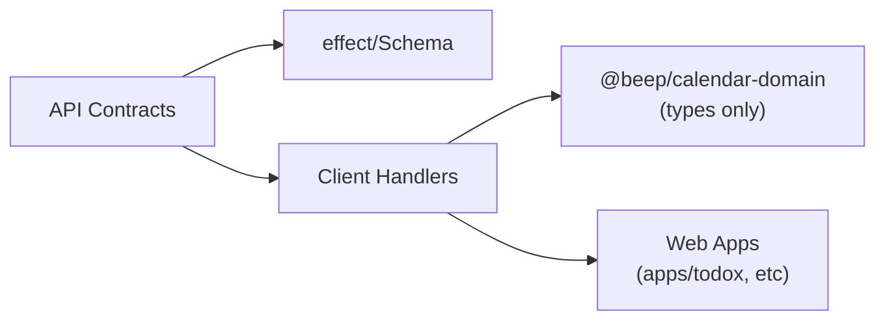

# @beep/calendar-client

Client-side SDK for the calendar vertical slice. Provides RPC contract definitions and type-safe handlers for event scheduling operations. This package is browser-safe and contains no server-side dependencies.

## Architecture



## Core Modules

| Module | Purpose |
|--------|---------|
| `contracts` | RPC schema definitions for calendar operations (pending implementation) |

## Usage Patterns

### Consuming Calendar Client in Web App

```typescript
import * as Effect from "effect/Effect";
// import { CalendarContract } from "@beep/calendar-client";

// Fetch events in date range (pattern example)
const getEventsInRange = (start: Date, end: Date) =>
  Effect.gen(function* () {
    // const client = yield* CalendarContract.Client;
    // const events = yield* client.listEvents({
    //   startTime: start.toISOString(),
    //   endTime: end.toISOString(),
    // });
    // return events;
  });
```

### Contract Definition Pattern

```typescript
import * as S from "effect/Schema";
import * as Rpc from "@effect/rpc";

// Define request/response schemas
const ListEventsRequest = S.Struct({
  startTime: S.String, // ISO 8601
  endTime: S.String,   // ISO 8601
});

const ListEventsResponse = S.Array(EventSchema);

// Define RPC contract
// export const CalendarContract = Rpc.make({ ... });
```

## Design Decisions

| Decision | Rationale |
|----------|-----------|
| Browser-safe package | No server dependencies, safe for client bundling |
| ISO 8601 DateTime strings | Standard wire format for cross-platform compatibility |
| Effect-based handlers | Consistent error handling and composability |
| Separate from domain | Domain types imported for type alignment only |

## Dependencies

**Internal**:
- None (browser-safe, no workspace dependencies in peerDependencies)

**External**:
- `effect` - Core Effect runtime for client handlers

**Dev**:
- `@babel/preset-react` - React JSX transformation
- `babel-plugin-transform-next-use-client` - Next.js client directive support

## Related

- **AGENTS.md** - Detailed contributor guidance for client authoring
- `packages/calendar/server` - Server implements contracts defined here
- `packages/calendar/domain` - Domain types for alignment
