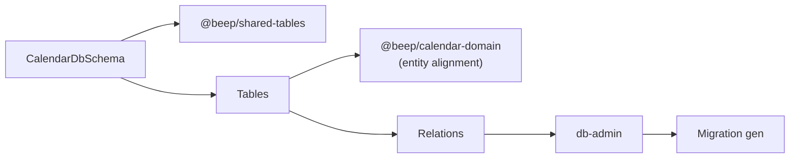

# @beep/calendar-tables

Drizzle ORM table definitions for the calendar vertical slice. Provides database schemas for calendar events with proper temporal indexing and audit columns using shared table factories.

## Architecture



## Core Modules

| Module | Purpose |
|--------|---------|
| `CalendarDbSchema` | Unified schema export combining tables and relations |
| `calendarEvent` | Calendar event table with name, description, indexes |
| `relations` | Drizzle relation definitions for query building |

## Usage Patterns

### Importing Schema for Database Client

```typescript
import * as DbSchema from "@beep/calendar-tables/schema";
import { DbClient } from "@beep/shared-server";

const db = DbClient.make({ schema: DbSchema });
```

### Table Definition Pattern

```typescript
import { CalendarEntityIds } from "@beep/shared-domain";
import { Table } from "@beep/shared-tables";
import * as pg from "drizzle-orm/pg-core";

export const calendarEvent = Table.make(CalendarEntityIds.CalendarEventId)(
  {
    name: pg.text("name").notNull(),
    description: pg.text("description"),
  },
  (t) => [pg.index("calendar_calendarEvent_name_idx").on(t.name)]
);
```

### Querying with Relations

```typescript
import * as CalendarDbSchema from "@beep/calendar-tables/schema";

// Use in Drizzle queries with relation loading
const events = yield* db.query.calendarEvent.findMany({
  where: (table, { eq }) => eq(table.name, "Meeting"),
});
```

## Design Decisions

| Decision | Rationale |
|----------|-----------|
| `Table.make` factory | Consistent audit columns (id, createdAt, updatedAt) across tables |
| Branded ID columns | Type-safe foreign keys preventing cross-entity ID mixing |
| Name index | Optimizes common lookup patterns by event name |
| Separate relations file | Clean separation of table definitions from query relations |

## Dependencies

**Internal**:
- `@beep/calendar-domain` - Domain entity alignment verification
- `@beep/shared-domain` - Entity ID schemas for typed columns
- `@beep/shared-tables` - Table factory and column helpers
- `@beep/schema` - Schema utilities

**External**:
- `drizzle-orm` - ORM for PostgreSQL table definitions

## Related

- **AGENTS.md** - Detailed contributor guidance for table authoring
- `packages/calendar/domain` - Domain entities these tables persist
- `packages/calendar/server` - Database client consuming this schema
- `packages/_internal/db-admin` - Migration generation tooling
