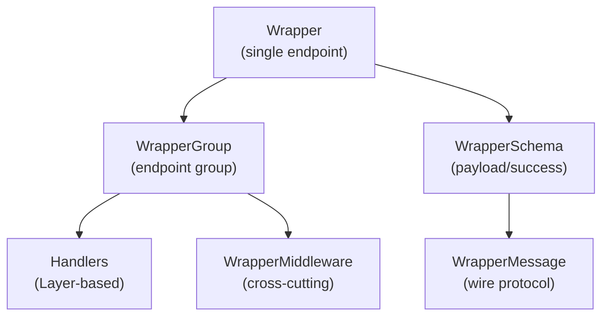

# @beep/wrap

Type-safe RPC wrapper system for defining, grouping, and implementing Effect-based API endpoints. Provides a fluent builder pattern for endpoint definitions with payload/success/error schemas, middleware composition, and handler implementation via Effect Layers.

## Architecture


## Core Modules
| Module | Purpose |
|--------|---------|
| `Wrapper` | Core endpoint definition with payload/success/error schemas |
| `WrapperGroup` | Groups multiple endpoints, applies middleware, generates handler layers |
| `WrapperMiddleware` | Cross-cutting concerns (auth, logging) as Effect services |
| `WrapperSchema` | Stream schema support and schema utilities |
| `WrapperMessage` | Wire protocol types for client/server communication |
| `WrapperClientError` | Tagged error type for client-side protocol errors |

## Usage Patterns
### Define an Endpoint
```typescript
import * as Effect from "effect/Effect";
import * as S from "effect/Schema";
import { Wrap } from "@beep/wrap";

const GetUser = Wrap.Wrapper.make("GetUser", {
  payload: { userId: S.String },
  success: S.Struct({ id: S.String, name: S.String }),
  error: S.TaggedError<NotFoundError>()("NotFoundError", { message: S.String }),
});
```

### Create Endpoint Groups
```typescript
import { Wrap } from "@beep/wrap";

const UserEndpoints = Wrap.WrapperGroup.make(GetUser, UpdateUser, DeleteUser)
  .middleware(AuthMiddleware)
  .prefix("users/");
```

### Implement Handlers via Layers
```typescript
import * as Effect from "effect/Effect";
import * as Layer from "effect/Layer";

const UserHandlersLive = UserEndpoints.toLayer({
  GetUser: (payload) =>
    Effect.gen(function* () {
      const repo = yield* UserRepo;
      return yield* repo.findById(payload.userId);
    }),
  UpdateUser: (payload) =>
    Effect.gen(function* () {
      const repo = yield* UserRepo;
      return yield* repo.update(payload);
    }),
});
```

### Define Middleware
```typescript
import * as Effect from "effect/Effect";
import * as Context from "effect/Context";
import * as S from "effect/Schema";
import { Wrap } from "@beep/wrap";

class AuthContext extends Context.Tag("AuthContext")<AuthContext, { userId: string }>() {}

class AuthMiddleware extends Wrap.WrapperMiddleware.Tag<AuthMiddleware>()(
  "AuthMiddleware",
  {
    provides: AuthContext,
    failure: S.TaggedError<AuthError>()("AuthError", { message: S.String }),
  }
) {}
```

### Stream Endpoints
```typescript
import * as S from "effect/Schema";
import { Wrap } from "@beep/wrap";

const StreamEvents = Wrap.Wrapper.make("StreamEvents", {
  payload: { filter: S.String },
  success: S.Struct({ event: S.String }),
  error: S.Never,
  stream: true,  // Enables streaming response
});
```

## Design Decisions
| Decision | Rationale |
|----------|-----------|
| Builder pattern for Wrapper | Enables fluent, chainable endpoint definition with type inference |
| Middleware as Context Tags | Integrates with Effect's dependency injection, provides typed failures |
| Groups return Layers | Handler implementations compose via Effect Layer system |
| Schema-first approach | Wire format validation, automatic encoding/decoding |
| Separate client/server messages | Clean protocol separation for bidirectional RPC |

## Dependencies
**Internal**: `@beep/identity`, `@beep/invariant`, `@beep/schema`, `@beep/types`, `@beep/utils`
**External**: `effect`, `@effect/platform`

## Related
- **AGENTS.md** - Detailed contributor guidance
- **@beep/schema** - Schema utilities used by WrapperSchema
- **@effect/rpc** - Similar patterns in upstream Effect ecosystem
