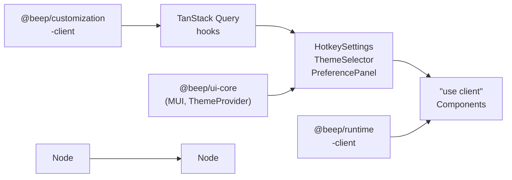

# @beep/customization-ui

React UI components for the customization slice. Provides user-facing interfaces for hotkey configuration, theme selection, and personalization features. Integrates with `@beep/customization-client` contracts via TanStack Query hooks.

**Status**: Minimal scaffold - awaiting component implementations as customization features mature.

## Architecture



## Core Modules (Planned)

| Module | Purpose |
|--------|---------|
| `HotkeySettings` | Keyboard shortcut configuration component |
| `ThemeSelector` | Theme picker with preview |
| `PreferencePanel` | User settings management UI |

## Usage Patterns

### Hotkey Settings Component (Planned)

```tsx
"use client";
import * as React from "react";
import { useQuery, useMutation, useQueryClient } from "@tanstack/react-query";
import { Box, Typography, TextField } from "@mui/material";
// import { hotkeyContract } from "@beep/customization-client";

export function HotkeySettings({ userId }: { userId: string }) {
  const queryClient = useQueryClient();

  // const { data: hotkeys, isLoading } = useQuery({
  //   queryKey: ["hotkeys", userId],
  //   queryFn: () => hotkeyContract.get({ userId }),
  // });

  // const mutation = useMutation({
  //   mutationFn: hotkeyContract.update,
  //   onSuccess: () => {
  //     queryClient.invalidateQueries({ queryKey: ["hotkeys"] });
  //     queryClient.invalidateQueries({ queryKey: ["preferences"] });
  //   },
  // });

  return (
    <Box>
      <Typography variant="h6">Keyboard Shortcuts</Typography>
      {/* Hotkey configuration UI */}
    </Box>
  );
}
```

### Theme Selection with MUI

```tsx
"use client";
import * as React from "react";
import { useTheme } from "@mui/material/styles";
import { ToggleButtonGroup, ToggleButton } from "@mui/material";

export function ThemeSelector() {
  const theme = useTheme();
  const [mode, setMode] = React.useState(theme.palette.mode);

  return (
    <ToggleButtonGroup
      value={mode}
      exclusive
      onChange={(_, newMode) => newMode && setMode(newMode)}
      aria-label="theme selection"
    >
      <ToggleButton value="light" aria-label="light theme">Light</ToggleButton>
      <ToggleButton value="dark" aria-label="dark theme">Dark</ToggleButton>
    </ToggleButtonGroup>
  );
}
```

## Design Decisions

| Decision | Rationale |
|----------|-----------|
| `"use client"` directive | Interactive preference components require client-side hooks |
| TanStack Query for data | Caching, invalidation, optimistic updates for preference changes |
| MUI + Tailwind styling | Consistent with `@beep/ui-core` design system |
| WCAG AA accessibility | Color contrast, keyboard nav, ARIA labels for all interactive elements |
| Debounced saves | Preference persistence on blur, not every keystroke |

## Dependencies

**Internal**: `@beep/customization-client` (contracts), `@beep/ui-core` (MUI theme, components), `@beep/runtime-client` (Effect hooks)

**External**: `effect`, `@tanstack/react-query`, `@mui/material`, `react`

## Related

- **AGENTS.md** - React 19 patterns, query invalidation, Effect integration in React
- **@beep/customization-client** - RPC contracts consumed by these components
- **@beep/ui-core** - Theme system and settings provider
