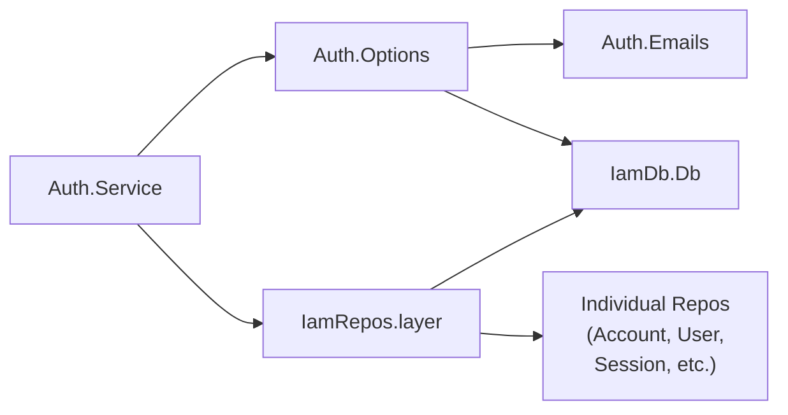

# @beep/iam-server

Server-side IAM infrastructure binding domain models to real services. Provides Drizzle-backed repositories, Better Auth adapters with plugin wiring, and Effect Layer factories for runtime composition.

## Architecture



## Core Modules

| Module | Purpose |
|--------|---------|
| `db/Db/Db.ts` | Scoped database Layer wrapping DbClient with IAM schema |
| `db/repositories.ts` | Merged Layer of all IAM repos (`IamRepos.layer`) |
| `db/repos/*.repo.ts` | Individual Effect.Service repos (Account, User, Session, etc.) |
| `adapters/better-auth/Service.ts` | Better Auth integration, session helpers, hooks |
| `adapters/better-auth/Options.ts` | Better Auth config with all plugins |
| `adapters/better-auth/Emails.ts` | Auth email helpers (verification, reset, OTP) |
| `adapters/better-auth/BetterAuthBridge.ts` | Type bridge for org plugin operations |

## Usage Patterns

### Compose IAM Layers for Tests
```typescript
import * as Effect from "effect/Effect";
import * as Layer from "effect/Layer";
import { IamRepos } from "@beep/iam-server";
import { IamDb } from "@beep/iam-server/db";

const TestIamLayer = Layer.mergeAll(
  IamDb.layer,
  IamRepos.layer
);
```

### Use Repository Service
```typescript
import * as Effect from "effect/Effect";
import { AccountRepo } from "@beep/iam-server/db/repos/Account.repo";

const program = Effect.gen(function* () {
  const accountRepo = yield* AccountRepo;
  return yield* accountRepo.findById(accountId);
});
```

## Design Decisions

| Decision | Rationale |
|----------|-----------|
| Effect.Service for repos | Enables Layer composition and dependency injection |
| Centralized plugin wiring | Single location (Options.ts) for Better Auth config |
| Scoped DB connections | Prevents session leakage across requests |
| Email via shared-server | Consistent templates, automatic redaction |

## Dependencies

**Internal**: `@beep/iam-domain`, `@beep/iam-tables`, `@beep/shared-domain`, `@beep/shared-server`, `@beep/shared-env`

**External**: `better-auth`, `@effect/sql-pg`, `@effect/sql-drizzle`, `drizzle-orm`

## Related

- **AGENTS.md** - Security guidelines, contributor checklist, verification commands
