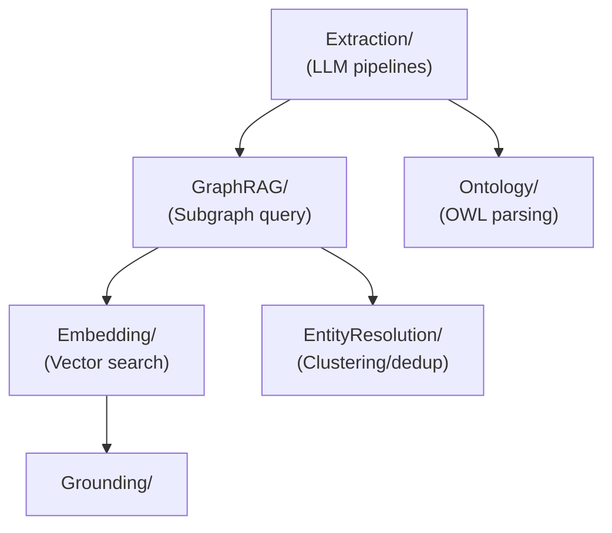

# @beep/knowledge-server

Server infrastructure for the knowledge graph vertical slice providing ontology-guided entity/relation extraction via LLM, vector embeddings with pgvector similarity search, GraphRAG subgraph retrieval for agent context, and entity resolution/deduplication.

## Architecture



## Core Modules

| Module | Purpose |
|--------|---------|
| `Extraction/ExtractionPipeline` | End-to-end text-to-graph extraction orchestration |
| `Extraction/MentionExtractor` | LLM-powered mention detection in text |
| `Extraction/EntityExtractor` | Classify mentions into ontology-typed entities |
| `Extraction/RelationExtractor` | Extract typed relations between entities |
| `Extraction/GraphAssembler` | Assemble extraction results into knowledge graph |
| `GraphRAG/GraphRAGService` | Subgraph retrieval for LLM context augmentation |
| `GraphRAG/RrfScorer` | Reciprocal Rank Fusion for multi-signal ranking |
| `GraphRAG/ContextFormatter` | Format graph data for LLM consumption |
| `Embedding/EmbeddingService` | Vector embedding generation via @effect/ai |
| `Ontology/OntologyService` | OWL ontology management and lookup |
| `Ontology/OntologyParser` | N3-based OWL/RDF parsing |
| `EntityResolution/EntityResolutionService` | Entity clustering and deduplication |
| `EntityResolution/EntityClusterer` | Similarity-based entity grouping |
| `Grounding/GroundingService` | Confidence-based extraction filtering |
| `Nlp/NlpService` | Text chunking and preprocessing |
| `Runtime/LlmLayers` | LLM provider layers (Anthropic, OpenAI) |
| `db/repos/` | Repository implementations for all entities |

## Usage Patterns

### GraphRAG Query

```typescript
import * as Effect from "effect/Effect";
import { GraphRAGService, GraphRAGQuery } from "@beep/knowledge-server/GraphRAG";

const retrieveContext = Effect.gen(function* () {
  const graphrag = yield* GraphRAGService;

  const result = yield* graphrag.query(
    new GraphRAGQuery({
      query: "Who are the key investors?",
      topK: 10,
      hops: 2,
      maxTokens: 4000
    }),
    organizationId,
    ontologyId
  );

  return result.context;
});
```

### Extraction Pipeline

```typescript
import * as Effect from "effect/Effect";
import { ExtractionPipeline } from "@beep/knowledge-server/Extraction";

const extractFromText = Effect.gen(function* () {
  const pipeline = yield* ExtractionPipeline;

  const result = yield* pipeline.extract(text, ontologyContext, {
    minMentionConfidence: 0.5,
    minEntityConfidence: 0.7,
    minRelationConfidence: 0.6
  });

  return result.graph;
});
```

### Embedding Layer Composition

```typescript
import * as Layer from "effect/Layer";
import { EmbeddingServiceLive, OpenAiEmbeddingLayerConfig } from "@beep/knowledge-server/Embedding";

// Production
const KnowledgeLive = EmbeddingServiceLive.pipe(
  Layer.provide(OpenAiEmbeddingLayerConfig)
);

// Testing
import { MockEmbeddingModelLayer } from "@beep/knowledge-server/Embedding";
const TestLayer = EmbeddingServiceLive.pipe(
  Layer.provide(MockEmbeddingModelLayer)
);
```

## Design Decisions

| Decision | Rationale |
|----------|-----------|
| @effect/ai for LLM | Unified interface across providers with Effect integration |
| RRF scoring | Combines semantic + graph signals without tuning weights |
| OWL ontologies | Semantic web standards enable schema interoperability |
| Confidence thresholds | Filter low-quality extractions before persistence |

## Dependencies

**Internal**: `@beep/knowledge-domain`, `@beep/knowledge-tables`, `@beep/shared-server`, `@beep/schema`, `@beep/shared-domain`, `@beep/utils`

**External**: `effect`, `@effect/platform`, `@effect/sql`, `@effect/sql-pg`, `@effect/ai`, `@effect/ai-anthropic`, `@effect/ai-openai`, `n3`, `drizzle-orm`

## Related

- **AGENTS.md** - Detailed contributor guidance with testing patterns
- **@beep/knowledge-domain** - Domain models used by repositories
- **@beep/knowledge-tables** - Table definitions for database operations
