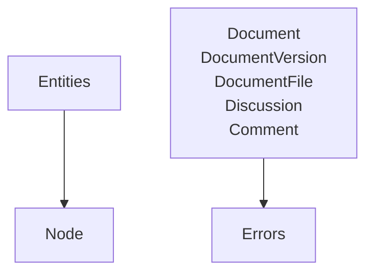

# @beep/workspaces-domain

Domain layer providing pure business models for the documents vertical slice. Defines entities (Document, DocumentVersion, DocumentFile, Discussion, Comment), value objects (LinkType, TextStyle), and Effect RPC schemas for remote operations. Infrastructure-agnostic by design.

## Architecture



## Core Modules

| Module | Purpose |
|--------|---------|
| `src/entities/Document.ts` | Core document entity with versioning support |
| `src/entities/DocumentVersion.ts` | Version history tracking |
| `src/entities/DocumentFile.ts` | File attachment metadata |
| `src/entities/Discussion.ts` | Discussion threads on documents |
| `src/entities/Comment.ts` | Individual comments in discussions |
| `src/values/LinkType.ts` | Link types: explicit, inline-reference, block_embed |
| `src/values/TextStyle.ts` | Text styles: default, serif, mono |
| `src/errors.ts` | Tagged domain errors |

## Usage Patterns

### Creating Domain Entities

```typescript
import * as Effect from "effect/Effect";
import * as S from "effect/Schema";
import { Document } from "@beep/workspaces-domain/entities";

export const createDocument = (data: {
  title: string;
  content: unknown;
  organizationId: string;
}) =>
  Effect.gen(function* () {
    const doc = yield* S.decodeUnknown(Document.Model)(data);
    yield* Effect.logInfo("document.created", { documentId: doc.id });
    return doc;
  });
```

### Working with Value Objects

```typescript
import * as Effect from "effect/Effect";
import * as S from "effect/Schema";
import { LinkType, TextStyle } from "@beep/workspaces-domain/values";

export const validateFormatting = (
  linkType: LinkType.Type,
  textStyle: TextStyle.Type
) =>
  Effect.gen(function* () {
    const validatedLinkType = yield* S.decodeUnknown(LinkType)(linkType);
    const validatedTextStyle = yield* S.decodeUnknown(TextStyle)(textStyle);
    return { linkType: validatedLinkType, textStyle: validatedTextStyle };
  });
```

## Design Decisions

| Decision | Rationale |
|----------|-----------|
| Pure domain models | No infrastructure dependencies enables testing and reuse across layers |
| RPC schemas on entities | Enables type-safe client-server communication via @effect/rpc |
| Value objects via BS.StringLiteralKit | Immutable validated types with compile-time safety |
| Tagged errors with Data.TaggedError | Structured error handling with Effect's catchTag pattern |

## Dependencies

**Internal**: `@beep/identity`, `@beep/schema`, `@beep/shared-domain`

**External**: `effect`, `@effect/platform`, `@effect/rpc`, `@effect/sql`

## Related

- **AGENTS.md** - Detailed contributor guidance and guardrails
- **@beep/workspaces-tables** - Drizzle table schemas mirroring these entities
- **@beep/workspaces-server** - Repository implementations using these models
