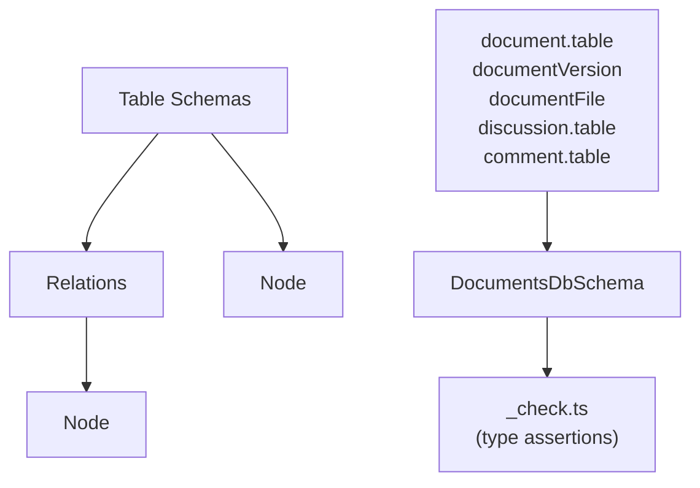

# @beep/workspaces-tables

Drizzle ORM table definitions bridging `@beep/workspaces-domain` entities to PostgreSQL storage. Exports `DocumentsDbSchema` namespace consumed by `@beep/workspaces-server` repositories. Uses shared table factories from `@beep/shared-tables` for consistent naming, cascades, and multi-tenant auditing.

## Architecture



## Core Modules

| Module | Purpose |
|--------|---------|
| `src/tables/document.table.ts` | Core document table with versioning support |
| `src/tables/documentVersion.table.ts` | Version history snapshots |
| `src/tables/documentFile.table.ts` | File attachment metadata storage |
| `src/tables/discussion.table.ts` | Discussion thread storage |
| `src/tables/comment.table.ts` | Comment storage with discussion FK |
| `src/relations.ts` | Drizzle relations for joins |
| `src/schema.ts` | Central export point |
| `src/_check.ts` | Type compatibility assertions |

## Usage Patterns

### Consuming Tables in Repositories

```typescript
import * as Effect from "effect/Effect";
import { DocumentsDbSchema } from "@beep/workspaces-tables";
import { DocumentsDb } from "@beep/workspaces-server/db";

const findDocument = (id: string) =>
  Effect.gen(function* () {
    const { makeQuery } = yield* DocumentsDb.Db;
    return yield* makeQuery((execute) =>
      execute((client) =>
        client.query.document.findFirst({
          where: (table, { eq }) => eq(table.id, id),
          with: { versions: true, files: true },
        })
      )
    );
  });
```

### Type-Safe EntityId Columns

```typescript
import { DocumentsEntityIds } from "@beep/shared-domain";
import { pg } from "@beep/shared-tables";

// ALWAYS use .$type<>() for EntityId columns
const documentTable = {
  id: pg.text("id").primaryKey().$type<DocumentsEntityIds.DocumentId.Type>(),
  organizationId: pg.text("organization_id")
    .notNull()
    .$type<SharedEntityIds.OrganizationId.Type>(),
};
```

## Design Decisions

| Decision | Rationale |
|----------|-----------|
| Shared table factories | `Table.make`/`OrgTable.make` enforce naming and audit conventions |
| Type assertions in _check.ts | Compile-time validation that Drizzle models match domain schemas |
| Centralized schema export | Single import point prevents reaching into tables/ directly |
| No runtime config | Pure schema package with no process.env access |

## Dependencies

**Internal**: `@beep/schema`, `@beep/shared-domain`, `@beep/workspaces-domain`, `@beep/shared-tables`

**External**: `drizzle-orm`

## Related

- **AGENTS.md** - Detailed contributor guidance including Drizzle gotchas
- **@beep/workspaces-domain** - Domain entities these tables persist
- **@beep/workspaces-server** - Repository layer consuming these schemas
- **packages/_internal/db-admin** - Migration generation from these schemas
