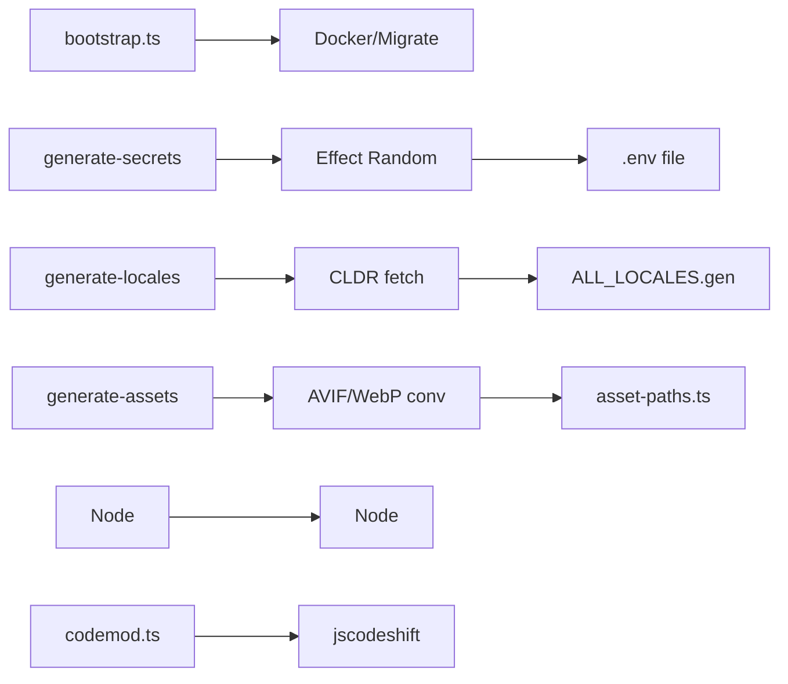

# @beep/repo-scripts

Orchestrates repo-wide maintenance CLIs including bootstrap flows, environment scaffolding, asset/locale generators, and codemod utilities. Provides canonical `@effect/cli` + Bun runtime patterns for long-lived utilities. Scripts layer `FsUtils` and `RepoUtils` so downstream packages can rely on generated artifacts.

## Architecture



## Core Modules

| Module | Purpose |
|--------|---------|
| `src/bootstrap.ts` | Interactive server bootstrapper (Docker, migrations) |
| `src/generate-env-secrets.ts` | Secure secret hydrator with Effect Random |
| `src/generate-asset-paths.ts` | Public asset crawler with schema validation |
| `src/generate-locales.ts` | CLDR fetch and locale file generation |
| `src/codemod.ts` | jscodeshift-based AST transformation framework |
| `src/codemods/` | Individual codemod implementations |
| `src/utils/convert-to-nextgen.ts` | AVIF/WebP image conversion |
| `src/utils/asset-path.schema.ts` | Asset path validation schema |
| `src/analyze-jsdoc.ts` | JSDoc documentation completeness checker |
| `src/purge.ts` | Workspace artifact cleanup |

## Usage Patterns

### Bootstrap Flow

```bash
# Interactive server setup (Docker, migrations, .env)
bun run bootstrap
```

### Secret Generation

```bash
# Generate secure environment secrets
bun run gen:secrets
```

### Asset Pipeline

```bash
# Regenerate public asset paths with AVIF conversion
bun run generate-public-paths
```

### Locale Generation

```bash
# Fetch CLDR data and generate locale files
bun run gen:locales
```

### Codemod Execution

```typescript
import * as Effect from "effect/Effect";
import * as Command from "@effect/cli/Command";
import * as Console from "effect/Console";
import * as BunRuntime from "@effect/platform-bun/BunRuntime";
import * as BunContext from "@effect/platform-bun/BunContext";

const helloCommand = Command.make("hello", {}, () =>
  Effect.gen(function* () {
    yield* Console.log("Hello from repo-scripts");
  })
);
```

## Design Decisions

| Decision | Rationale |
|----------|-----------|
| Generated files in `_generated/` | Clear separation of source vs generated code |
| Schema-validated outputs | Type-safe generated artifacts with decode guards |
| Effect Random for secrets | Cryptographically secure secret generation |
| Centralized .env management | Single source of truth at repo root |
| Truncated secret logging | Security: never log full secret values |

## Dependencies

**Internal**: `@beep/constants`, `@beep/schema`, `@beep/tooling-utils`

**External**: `effect`, `@effect/platform`, `@effect/platform-bun`, `@effect/cli`, `jscodeshift`, `ts-morph`, `@jsquash/*`, `glob`

## Related

- **AGENTS.md** - Detailed contributor guidance and security guardrails
- **Root package.json** - Exposes generators via `bun run gen:*` scripts
