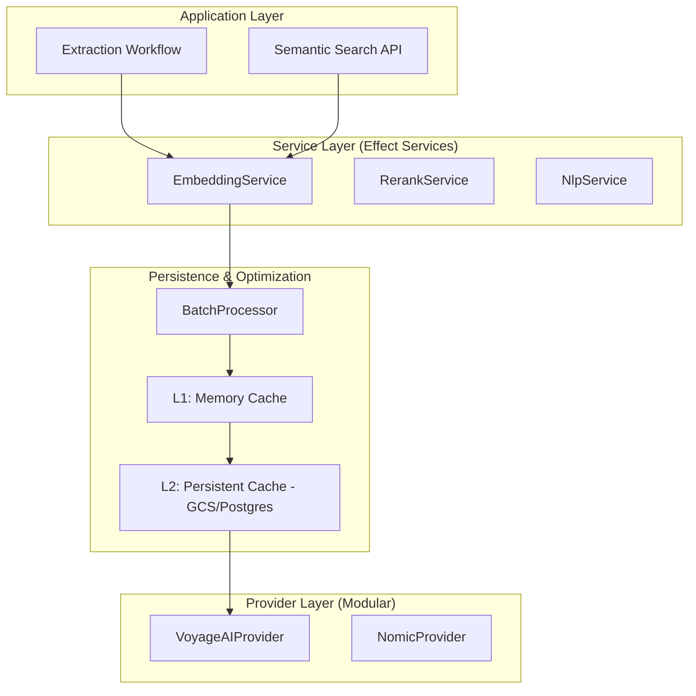

# Architectural Map: Voyage AI Embeddings Service

This document outlines the planned architecture for a "rock-solid" embeddings and NLP service integration, specifically optimized for document and ontology extraction using Voyage AI models.

## 1. Core Objectives
- **Precision Retrieval**: Use Voyage AI's specialized models (e.g., `voyage-3`, `voyage-3-lite`, `voyage-law-2`) for state-of-the-art semantic search.
- **Deep Domain Integration**: Align embeddings with `OntologyContext`, `ClassDefinition`, and `PropertyDefinition`.
- **Feature Completeness**: Support hybrid search (BM25 + Vector), Cross-Encoder Reranking, and Matryoshka-aware truncation.
- **Production Resilience**: Multi-level caching (L1 Memory, L2 Persistent), robust batching, and Effect-native rate limiting.

## 2. High-Level Architecture

## 3. Component Details

### 3.1 `VoyageNlpService` (Implementation of `EmbeddingService`)
- **Model Mapping**:
  - `query`: Use `input_type="query"` for search queries.
  - `document`: Use `input_type="document"` for indexing.
- **Context Handling**: Native support for 32K tokens (Voyage-3), but pipeline should still chunk at 500-1000 tokens for precision.
- **Truncation**: Configurable `truncation` flag (default `true`) to prevent API errors.

### 3.2 Multi-Level Caching Strategy
- **L1 (In-Memory)**: LRU cache for high-frequency lookups during a single extraction run.
- **L2 (Persistent)**: Content-addressable storage (CAS) keyed by `sha256(text + model_id + task_type)`.
  - Stored in GCS for batch-wide reuse.
  - Optional Postgres backend for low-latency retrieval in interactive apps.

### 3.3 Hybrid Retrieval Engine
- **BM25 (Wink-NLP)**: Token-based lexical search for exact matches (names, IDs).
- **Vector Search (Voyage)**: Semantic matching for paraphrases and synonyms.
- **RRF (Reciprocal Rank Fusion)**: Combine results using the formula:
  $score(d) = \sum_{r \in R} \frac{1}{k + r(d)}$
- **Cross-Encoder Reranking**: Use `rerank-2.5` to re-score the top-50 results from hybrid search for final precision.

## 4. Extraction Pipeline Integration

### 4.1 Phase 2: Retrieval
- Enrich search queries with entity mentions and their surrounding context.
- Use `voyage-3-lite` for cost-efficient class retrieval.
- Use `rerank-2.5` to ensure the most relevant classes are in the prompt context.

### 4.2 Ontology Indexing
- **Pre-computed Embeddings**: Continue using `OntologyEmbeddings` schema but upgrade to Voyage models.
- **Contextual Enrichment**: When embedding classes/properties, include:
  - Label
  - rdfs:comment
  - skos:altLabel
  - Parent class labels (for inheritance context)

## 5. Implementation Roadmap (Planning)

### Phase 1: Modular Provider System
- Define a generic `EmbeddingProvider` interface.
- Implement `VoyageEmbeddingProvider` using `@effect/platform-http`.
- Support Matryoshka truncation (Voyage-3 supports multiple dimensions).

### Phase 2: Enhanced Caching
- Refactor `EmbeddingCache` to be an interface with multiple implementations.
- Implement `TieredEmbeddingCache` (Memory -> Persistent).

### Phase 3: Reranking Service
- Create `RerankService` with `VoyageRerankProvider`.
- Integrate into `OntologyService.searchClassesHybrid`.

### Phase 4: Feature Completeness
- Add support for multilingual embeddings (`voyage-multilingual-2`).
- Implement "Matryoshka Search" (initially search 256d, then refine with 1024d for top-k).

## 6. SOTA Alignment
- **Late Interaction**: Investigate if `rerank-2.5` can be used for late-interaction style retrieval.
- **Domain-Specific Models**: Option to toggle `voyage-law-2` when the target ontology is in the legal domain.
