# Effect-Ontology @core-v2 System Architecture

> **Version:** 2.6.0
> **Last Updated:** December 2025
> **Status:** Unified Extraction Pipeline - Streaming First + WebSocket Events

## Table of Contents

1. [Overview](#overview)
2. [System Context](#system-context)
3. [Component Architecture](#component-architecture)
4. [Workflow Pipeline](#workflow-pipeline)
5. [Service Layer](#service-layer)
6. [Embedding Infrastructure](#embedding-infrastructure)
7. [Data Model](#data-model)
8. [Infrastructure](#infrastructure)
9. [Layer Composition](#layer-composition)
10. [API Reference](#api-reference)
11. [Document Preprocessing](#document-preprocessing)
12. [GraphRAG: Knowledge Graph Querying](#graphrag-knowledge-graph-querying)

---

## Overview

Effect-Ontology is a knowledge graph extraction system that transforms unstructured text into RDF triples using LLM-powered entity and relation extraction, guided by domain ontologies.

### Key Capabilities

- **Ontology-Guided Extraction**: Uses SKOS/OWL ontologies to constrain entity types and relation predicates
- **Unified Streaming Pipeline**: 6-phase extraction (Chunk → Mention → Entity → Property Scope → Relation → Ground)
- **Durable Workflows**: @effect/workflow-based pipelines with PostgreSQL persistence for crash recovery
- **SSE Streaming**: Real-time batch state streaming via Server-Sent Events
- **Batch Processing**: 5-stage workflow (Preprocess → Extract → Resolve → Validate → Ingest) wrapping 6-phase extraction
- **Agentic Document Preprocessing**: LLM-based document classification, adaptive chunking strategies, and intelligent batch ordering
- **Entity Resolution**: Graph-based clustering for entity deduplication
- **Grounding Verification**: Embedding-based relation filtering for context alignment (confidence ≥ 0.8)
- **SHACL Validation**: Optional shape-based constraint checking
- **GraphRAG Querying**: Retrieval-augmented generation with knowledge graph context, grounded answers with citations, and explainable reasoning traces

---

## System Context


---

## Component Architecture


---

## Workflow Pipeline

### Unified Extraction Architecture

The system uses a **unified streaming extraction pipeline** wrapped in durable workflow stages. The core extraction engine (`StreamingExtraction`) implements a 6-phase pipeline that is:

- **Single source of truth**: One extraction path for both batch and streaming use cases
- **Durable**: Wrapped in `StreamingExtractionActivity` for crash recovery
- **Grounded**: Includes embedding-based verification for context alignment

### Batch Extraction Workflow

The workflow orchestration layer consists of 5 durable stages, with the **Extracting** stage using the 6-phase unified pipeline:

```mermaid
stateDiagram-v2
    [*] --> Pending: start()

    Pending --> Preprocessing: Load manifest

    Preprocessing --> Extracting: Documents classified
    Preprocessing --> Failed: Preprocessing error

    Extracting --> Resolving: All documents extracted
    Extracting --> Failed: Extraction error

    Resolving --> Validating: Graphs merged
    Resolving --> Failed: Resolution error

    Validating --> Ingesting: SHACL conforms
    Validating --> Failed: Validation failed

    Ingesting --> Complete: Written to canonical
    Ingesting --> Failed: Ingestion error

    Complete --> [*]
    Failed --> [*]

    note right of Preprocessing
        Agentic classification
        Adaptive chunking
        Batch ordering
    end note

    note right of Extracting
        6-phase unified pipeline:
        Chunk → Mention → Entity →
        Property Scope → Relation → Ground
        Parallel execution (concurrency: 5)
    end note

    note right of Validating
        Optional SHACL
        shapes validation
    end note
```



### 6-Phase Unified Extraction Pipeline

The `StreamingExtraction` module implements the core extraction logic used by all extraction paths:

```mermaid
graph LR
    subgraph "Phase 1: Chunking"
        DOC[Document Text]
        CHUNK[NlpService.chunk]
        CHUNKS[TextChunk[]]
    end

    subgraph "Phase 2: Mention Detection"
        ME[MentionExtractor]
        MENTIONS[EntityMention[]]
    end

    subgraph "Phase 3: Entity Extraction"
        EE[EntityExtractor]
        CTX[OntologyContext]
        ENTITIES[ExtractedEntity[]]
    end

    subgraph "Phase 4: Property Scoping"
        OS[OntologyService.getPropertiesFor]
        PROPS[ScopedProperty[]]
    end

    subgraph "Phase 5: Relation Extraction"
        RE[RelationExtractor]
        RELS[ExtractedRelation[]]
    end

    subgraph "Phase 6: Grounding"
        GR[Grounder.verifyRelationBatch]
        FILTER[Filter ≥ 0.8 confidence]
        GROUNDED[GroundedRelation[]]
    end

    DOC --> CHUNK --> CHUNKS
    CHUNKS --> ME --> MENTIONS
    MENTIONS --> EE
    CTX --> EE
    EE --> ENTITIES
    ENTITIES --> OS --> PROPS
    ENTITIES --> RE
    PROPS --> RE
    RE --> RELS
    RELS --> GR --> FILTER --> GROUNDED

    style DOC fill:#e3f2fd
    style GROUNDED fill:#c8e6c9
    style GR fill:#a5d6a7
```

| Phase | Service | Input | Output | Purpose |
|-------|---------|-------|--------|---------|
| 1. Chunk | NlpService | Document text | TextChunk[] | Split into processable segments |
| 2. Mention | MentionExtractor | TextChunk[] | EntityMention[] | Detect entity mention spans |
| 3. Entity | EntityExtractor | Mentions + OntologyContext | ExtractedEntity[] | LLM-based entity typing |
| 4. Property | OntologyService | Entity types | ScopedProperty[] | Domain/range filtered properties |
| 5. Relation | RelationExtractor | Entities + Properties | ExtractedRelation[] | LLM-based relation extraction |
| 6. Ground | Grounder | Relations + Context | GroundedRelation[] | Filter by embedding similarity ≥ 0.8 |

### Activity Sequence


---

## Service Layer

### Service Dependency Graph


### Service Specifications

| Service | Purpose | Layer | Dependencies |
|---------|---------|-------|--------------|
| **Orchestration** ||||
| `WorkflowOrchestrator` | High-level batch workflow API | Service | WorkflowEngine, BatchStateHub |
| `BatchStateHub` | PubSub for real-time state changes | Service | PubSub |
| `BatchStatePersistence` | State snapshots in storage | Service | StorageService, KeyValueStore |
| **Extraction** ||||
| `EntityExtractor` | LLM-based named entity recognition | Service | LanguageModel, OntologyService |
| `RelationExtractor` | LLM-based relation extraction | Service | LanguageModel, OntologyService |
| `MentionExtractor` | Entity mention detection via NLP | Service | NlpService |
| `Grounder` | Entity grounding/linking | Service | NlpService, OntologyService |
| `SimilarityScorer` | Embedding-based entity similarity | Service | EmbeddingService |
| **Entity Resolution** ||||
| `EntityResolutionService` | Graph clustering and entity matching | Service | EmbeddingService |
| `EntityLinker` | Canonical entity ID queries | Util | EntityResolutionGraph |
| `RelationLinker` | Relation canonicalization | Service | EntityResolutionGraph |
| **GraphRAG** ||||
| `GraphRAG` | Retrieval-augmented generation with KG context | Service | EntityIndex, SubgraphExtractor, LanguageModel |
| `EntityIndex` | In-memory k-NN entity index via embeddings | Service | EmbeddingService |
| `SubgraphExtractor` | N-hop subgraph extraction around seeds | Service | EntityIndex |
| **Embedding** ||||
| `EmbeddingService` | Provider-agnostic embedding service with caching | Service | EmbeddingProvider, EmbeddingCache, EmbeddingResolver |
| `EmbeddingProvider` | Abstract embedding interface (Nomic/Voyage) | Service | ConfigService, EmbeddingRateLimiter |
| `EmbeddingCache` | Content-addressable embedding cache with TTL | Service | Clock, Ref |
| `EmbeddingResolver` | Request API batching and deduplication | Resolver | EmbeddingProvider |
| `EmbeddingRateLimiter` | RPM and concurrency control for API providers | Service | Clock, Ref, Semaphore |
| `NomicEmbeddingProvider` | Local Transformers.js embedding provider | Service | NomicNlpService, ConfigService |
| `VoyageEmbeddingProvider` | Voyage AI API embedding provider | Service | ConfigService, HttpClient, EmbeddingRateLimiter |
| **Ontology** ||||
| `OntologyService` | SKOS/OWL ontology operations | Core | RdfBuilder, StorageService |
| `OntologyLoader` | Ontology + embeddings loading | Service | RdfBuilder, EmbeddingService, StorageService |
| `InheritanceService` | Class hierarchy property inheritance | Service | OntologyService |
| **Core Infrastructure** ||||
| `ConfigService` | Centralized configuration | Core | Environment |
| `StorageService` | Abstracted storage (GCS/Local/Memory) | Core | ConfigService |
| `RdfBuilder` | RDF parsing/serialization (N3.js) | Core | ConfigService |
| `ShaclService` | SHACL validation engine | Core | RdfBuilder |
| **Run Management** ||||
| `ExtractionRun` | Run management with artifact storage | Service | StorageService |
| `ExtractionCache` | Filesystem extraction result cache | Service | FileSystem |
| `ExecutionDeduplicator` | Idempotency key deduplication | Service | Ref |

---

## Embedding Infrastructure

### Overview

The embedding infrastructure provides provider-agnostic vector embeddings with automatic batching, caching, and rate limiting. It supports both local inference (Nomic via Transformers.js) and API providers (Voyage AI), with dynamic provider selection via configuration.

### Architecture


### Key Features

| Feature | Description | Implementation |
|---------|-------------|----------------|
| **Provider Abstraction** | Switch between Nomic (local) and Voyage (API) via config | `EmbeddingProvider` interface |
| **Automatic Batching** | Collects requests into batches for efficient processing | Effect Request API via `EmbeddingResolver` |
| **Deduplication** | Same text+taskType returns same instance | Request hash: `provider::model::taskType::text` |
| **Versioned Caching** | Cache keys include model ID and dimension | `hashVersionedEmbeddingKey()` |
| **Rate Limiting** | RPM and concurrency control for API providers | `EmbeddingRateLimiter` with sliding window |
| **Multi-Dimension** | Supports different embedding dimensions per provider | Nomic: 64-768, Voyage: 512-1024 |
| **Task Types** | Optimized embeddings for search/clustering/classification | Voyage-compatible superset |

### Provider Selection

The system selects the embedding provider based on the `EMBEDDING_PROVIDER` environment variable:

```typescript
// Dynamic provider selection via Layer.unwrapEffect
export const EmbeddingProviderFromConfig: Layer.Layer<
  EmbeddingProvider,
  never,
  ConfigService | NomicNlpService | EmbeddingRateLimiter | HttpClient
> = Layer.unwrapEffect(
  Effect.gen(function* () {
    const config = yield* ConfigService
    return config.embedding.provider === "voyage"
      ? VoyageEmbeddingProviderLive
      : NomicEmbeddingProviderLive
  })
)
```

### Request API Batching

The system uses Effect's Request API for automatic batching and deduplication:


### Cache Key Versioning

Cache keys include provider, model, and dimension to prevent cross-contamination:

```typescript
// Format: sha256(provider:model:dimension:taskType:text)
const hash = await hashVersionedEmbeddingKey(
  "Hello world",
  "search_document",
  { providerId: "voyage", modelId: "voyage-3-lite", dimension: 512 }
)
// Result: "a1b2c3d4..." (64 hex chars)
```

This ensures that changing the model invalidates the cache automatically.

### Rate Limiting

API providers enforce rate limits via `EmbeddingRateLimiter`:

```typescript
// Voyage AI limits: 100 RPM, 10 concurrent
export const VOYAGE_RATE_LIMITS: EmbeddingRateLimiterConfig = {
  provider: "voyage",
  requestsPerMinute: 100,
  maxConcurrent: 10
}

// Local models: effectively unlimited
export const LOCAL_RATE_LIMITS: EmbeddingRateLimiterConfig = {
  provider: "nomic",
  requestsPerMinute: 10000,
  maxConcurrent: 50
}
```

The rate limiter uses a sliding window for RPM tracking and a semaphore for concurrency control.

### Configuration

| Variable | Description | Default |
|----------|-------------|---------|
| `EMBEDDING_PROVIDER` | Provider to use (nomic \| voyage) | nomic |
| `VOYAGE_API_KEY` | Voyage AI API key | - |
| `VOYAGE_MODEL` | Voyage model (voyage-3 \| voyage-3-lite) | voyage-3-lite |
| `EMBEDDING_DIMENSION` | Embedding dimension (provider-specific) | 768 (nomic), 512 (voyage-3-lite) |
| `EMBEDDING_CACHE_TTL_HOURS` | Cache TTL in hours | 1 |
| `EMBEDDING_CACHE_MAX_ENTRIES` | Max cache entries | 10000 |

### Layer Composition

```typescript
// Production: Config-driven provider selection
export const EmbeddingInfrastructure: Layer.Layer<
  EmbeddingProvider | EmbeddingRateLimiter | EmbeddingCache,
  never,
  ConfigService
> = Layer.mergeAll(
  EmbeddingProviderFromConfig,
  EmbeddingRateLimiterFromConfig,
  EmbeddingCache.Default
)

// Development: Force Nomic (local)
export const NomicEmbeddingInfrastructure = Layer.mergeAll(
  NomicEmbeddingProviderDefault,
  EmbeddingRateLimiterLocal,
  EmbeddingCache.Default
)

// Production: Force Voyage (API)
export const VoyageEmbeddingInfrastructure = Layer.mergeAll(
  VoyageEmbeddingProviderDefault,
  EmbeddingRateLimiterVoyage,
  EmbeddingCache.Default
)
```

### Testing Patterns

```typescript
import { EmbeddingProvider } from "./EmbeddingProvider.js"
import { Layer } from "effect"

// Mock provider for deterministic tests
const MockEmbeddingProvider = Layer.succeed(EmbeddingProvider, {
  metadata: { providerId: "mock", modelId: "mock", dimension: 768 },
  embedBatch: (requests) => Effect.succeed(
    requests.map(() => Array(768).fill(0))
  ),
  cosineSimilarity: (a, b) => 0.9
})

// Use in tests
const program = Effect.gen(function* () {
  const embeddings = yield* EmbeddingService
  const result = yield* embeddings.embed("test")
  // result: [0, 0, 0, ..., 0] (768 dimensions)
}).pipe(
  Effect.provide(EmbeddingService.Default),
  Effect.provide(MockEmbeddingProvider)
)
```

---

## Data Model

### Branded Identity Types

```mermaid
classDiagram
    class BatchId {
        +String value
        +Pattern: batch-[a-f0-9]{12}
    }

    class DocumentId {
        +String value
        +Pattern: doc-[a-f0-9]{12}
    }

    class GcsUri {
        +String value
        +Pattern: gs://bucket/path
    }

    class OntologyVersion {
        +String value
        +Pattern: namespace/name@[a-f0-9]{16}
    }

    class Namespace {
        +String value
        +Pattern: [a-z][a-z0-9-]*
    }
```

### BatchState Union Type


### Storage Path Layout

```mermaid
graph TD
    ROOT["📁 Storage Root"]

    ROOT --> BATCHES["📁 batches/"]
    ROOT --> DOCS["📁 documents/"]
    ROOT --> CANON["📁 canonical/"]
    ROOT --> ONTOS["📁 ontologies/"]

    BATCHES --> BATCH_ID["📁 batch-id/"]
    BATCH_ID --> MANIFEST["📄 manifest.json"]
    BATCH_ID --> STATUS["📄 status.json"]
    BATCH_ID --> RESOL["📁 resolution/"]
    BATCH_ID --> VALID["📁 validation/"]
    BATCH_ID --> BATCH_CANON["📁 canonical/"]

    RESOL --> MERGED["📄 merged.ttl"]
    VALID --> VALID_GRAPH["📄 graph.ttl"]
    VALID --> REPORT["📄 report.json"]
    BATCH_CANON --> BATCH_ENTITIES["📄 entities.ttl"]

    DOCS --> DOC_ID["📁 doc-id/"]
    DOC_ID --> INPUT["📄 input.txt"]
    DOC_ID --> DOC_GRAPH["📄 graph.ttl"]

    CANON --> NS["📁 namespace/"]
    NS --> NS_ENTITIES["📄 entities.ttl"]
    NS --> NS_RELATIONS["📄 relations.ttl"]

    ONTOS --> ONT_NS["📁 namespace/"]
    ONT_NS --> ONTOLOGY["📄 ontology.ttl"]
    ONT_NS --> SHAPES["📄 shapes.ttl"]
```



---

## Infrastructure

### GCP Architecture


### Terraform Module Structure


### Environment Configuration

| Variable | Description | Default |
|----------|-------------|---------|
| `LLM_PROVIDER` | LLM backend (anthropic/openai/google) | anthropic |
| `LLM_MODEL` | Model identifier | claude-haiku-4-5 |
| `LLM_API_KEY` | API key (from Secret Manager) | required |
| `STORAGE_TYPE` | Storage backend (gcs/local/memory) | local |
| `STORAGE_BUCKET` | GCS bucket name | - |
| `ONTOLOGY_PATH` | Path to ontology file | required |
| `POSTGRES_HOST` | PostgreSQL host | localhost |
| `POSTGRES_PORT` | PostgreSQL port | 5432 |
| `POSTGRES_DATABASE` | Database name | workflow |
| `POSTGRES_USER` | Database user | workflow |
| `POSTGRES_PASSWORD` | Database password (secret) | required |

---

## Layer Composition

### Effect Layer Stack


### Test vs Production Layers


---

## API Reference

### REST Endpoints

```mermaid
graph LR
    subgraph "Health"
        H1[GET /health/live]
        H2[GET /health/ready]
        H3[GET /health/deep]
    end

    subgraph "Extraction (SSE)"
        E1[POST /v1/extract/batch<br/>→ SSE Stream]
        E2[POST /v1/extract<br/>→ SSE Stream]
    end

    subgraph "Batch Status"
        B1[GET /v1/batch/:id]
        B2[POST /v1/batch/:id/resume]
    end
```



### SSE Streaming

The extraction endpoints return Server-Sent Events streaming `BatchState` transitions:

```
POST /v1/extract/batch
Content-Type: application/json
Accept: text/event-stream

← HTTP/1.1 200 OK
← Content-Type: text/event-stream

← event: state
← id: batch-abc123-Pending-1702300000000
← data: {"_tag":"Pending","batchId":"batch-abc123",...}

← event: state
← id: batch-abc123-Extracting-1702300001000
← data: {"_tag":"Extracting","documentsCompleted":1,"documentsTotal":3,...}

← retry: 15000

← event: state
← id: batch-abc123-Complete-1702300010000
← data: {"_tag":"Complete","stats":{...},...}
```

### SSE Deployment Configuration (Cloud Run)

Server-Sent Events require specific Cloud Run configuration for reliable streaming:

```bash
# Required settings for SSE
gcloud run services update SERVICE \
  --timeout=3600 \           # 60 min max (default 5 min is too short)
  --no-cpu-throttling \      # CPU always allocated during streaming
  --min-instances=1          # Prevent cold starts killing connections
```

| Setting | Default | Required | Purpose |
|---------|---------|----------|---------|
| `--timeout` | 300s | **3600s** | Prevents premature connection close |
| `--no-cpu-throttling` | throttled | **always-on** | Keeps CPU during idle streaming |
| `--min-instances` | 0 | **1+** | Avoids scale-to-zero killing connections |

**Important**: Clients must use **HTTP/1.1** for SSE connections. HTTP/2 has protocol compatibility issues with Cloud Run's load balancer for SSE streams.

```bash
# Client example (force HTTP/1.1)
curl --http1.1 -H "Accept: text/event-stream" https://SERVICE/v1/extract/batch
```

Required response headers (already configured in HttpServer.ts):

```text
Content-Type: text/event-stream
Cache-Control: no-cache, no-store, must-revalidate
Connection: keep-alive
X-Accel-Buffering: no
```

### WebSocket Event Streaming

Real-time event synchronization between frontend and backend via `@effect/experimental/EventLog`.

#### Authentication

WebSocket connections support dual-mode authentication:

| Mode | Query Param | Use Case |
|------|-------------|----------|
| Dev | `?dev=true` | Local development, bypasses auth when `API_REQUIRE_AUTH=false` |
| Prod | `?ticket=xxx` | Production, requires single-use ticket from `/v1/auth/ticket` |

#### Ticket Lifecycle

```
Frontend                              Backend
─────────                             ───────
1. POST /v1/auth/ticket        →      TicketService.createTicket()
   X-API-Key: your-key                - Generates 32-byte secure token
   {"ontologyId": "seattle"}          - Stores in HashMap with 5-min TTL
                               ←      {"ticket": "xxx", "expiresAt": ..., "ttlSeconds": 300}

2. Connect WebSocket           →      EventStreamRouter
   ws://.../events/ws?ticket=xxx      - validateWebSocketAuth()
                                      - TicketService.validateTicket() (consumes ticket)
                               ←      WebSocket upgrade (if valid)
```

#### Key Implementation Details

**Backend (EventStreamRouter)**:
- Uses `@effect/experimental/EventLogServer` for WebSocket protocol
- Validates ticket on upgrade, returns 401/403 on auth failure
- Single-use tickets prevent replay attacks

**Frontend (EventBusClient)**:
- Uses `@effect/experimental/EventLogRemote` for client sync
- Layer composition order is critical (leaf → root):
  ```typescript
  // CORRECT order:
  Layer.provide(EventLogRemote.layerWebSocketBrowser(wsUrl)),  // Root
  Layer.provide(EventLog.layerEventLog),                        // Intermediate
  Layer.provide(TicketClientDefault),                           // Leaf
  Layer.provide(IdentityLayer),                                 // Leaf
  Layer.provide(OntologyEventJournalLayer(ontologyId))          // Leaf
  ```
- `layerWebSocketBrowser` automatically provides `EventLogEncryption` and socket

**Services**:
| Service | Location | Purpose |
|---------|----------|---------|
| `TicketService` | `src/Service/Ticket.ts` | In-memory ticket management |
| `AuthRouter` | `src/Runtime/AuthRouter.ts` | `POST /v1/auth/ticket` endpoint |
| `EventStreamRouter` | `src/Runtime/EventStreamRouter.ts` | WebSocket with auth |
| `TicketClient` | `web/src/services/TicketClient.ts` | Frontend ticket fetching |
| `EventBusClient` | `web/src/services/EventBusClient.ts` | Frontend event sync |

### BatchStatusResponse Union

The `GET /v1/batch/:id` endpoint returns a discriminated union:

| Variant | Description | HTTP Status |
|---------|-------------|-------------|
| `Active` | Workflow running or completed | 200 |
| `Suspended` | Workflow suspended (can resume) | 200 |
| `NotFound` | Batch ID not found | 404 |

### WorkflowOrchestrator Interface

```typescript
interface WorkflowOrchestrator {
  // Start workflow (fire-and-forget)
  start(payload: BatchWorkflowPayload): Effect<string, string>

  // Start and wait for completion
  startAndWait(payload: BatchWorkflowPayload): Effect<BatchState, string>

  // Poll for result
  poll(executionId: string): Effect<Workflow.Result<BatchState, string> | undefined>

  // Interrupt running workflow
  interrupt(executionId: string): Effect<void>

  // Resume suspended workflow
  resume(executionId: string): Effect<void>
}
```

### BatchRequest Schema (API Input)

```typescript
// Request body for POST /v1/extract/batch
// Server generates batchId and createdAt
const BatchRequest = Schema.Struct({
  ontologyUri: GcsUri,
  ontologyVersion: OntologyVersion,
  shaclUri: Schema.optional(GcsUri),
  targetNamespace: Namespace,
  documents: Schema.NonEmptyArray(Schema.Struct({
    documentId: Schema.optional(DocumentId),  // Server generates if omitted
    sourceUri: GcsUri,
    contentType: Schema.String,
    sizeBytes: Schema.optional(Schema.Number)
  }))
})
```

### BatchWorkflowPayload Schema (Internal)

```typescript
// Used internally for workflow execution
// Includes all fields for idempotency key derivation
const BatchWorkflowPayload = Schema.Struct({
  batchId: BatchId,
  manifestUri: GcsUri,
  ontologyVersion: OntologyVersion,
  ontologyUri: GcsUri,
  targetNamespace: Namespace,
  shaclUri: Schema.optional(GcsUri),
  documentIds: Schema.Array(DocumentId)
})
```

### BatchManifest Schema

```typescript
const BatchManifest = Schema.Struct({
  batchId: BatchId,
  ontologyUri: GcsUri,
  ontologyVersion: OntologyVersion,
  shaclUri: Schema.optional(GcsUri),
  targetNamespace: Namespace,
  documents: Schema.Array(Schema.Struct({
    documentId: DocumentId,
    sourceUri: GcsUri,
    contentType: Schema.String,
    sizeBytes: Schema.Number
  })),
  createdAt: Schema.DateTimeUtc
})
```

---

## File Reference

| Path | Purpose |
|------|---------|
| `src/Service/WorkflowOrchestrator.ts` | High-level workflow API with Result handling |
| `src/Service/BatchState.ts` | BatchStateHub (PubSub) + persistence |
| `src/Service/Config.ts` | Centralized configuration |
| `src/Service/Storage.ts` | Storage abstraction (GCS/Local/Memory) |
| `src/Service/Extraction.ts` | Entity/Relation extractors |
| `src/Service/Grounder.ts` | Entity grounding |
| `src/Service/Embedding.ts` | Provider-agnostic embedding service with caching |
| `src/Service/EmbeddingProvider.ts` | Embedding provider interface |
| `src/Service/EmbeddingCache.ts` | Versioned embedding cache with TTL and LRU |
| `src/Service/EmbeddingResolver.ts` | Request API batching resolver |
| `src/Service/EmbeddingRateLimiter.ts` | RPM and concurrency rate limiting |
| `src/Service/EmbeddingRequest.ts` | Request types for batching |
| `src/Service/NomicEmbeddingProvider.ts` | Local Transformers.js embedding provider |
| `src/Service/VoyageEmbeddingProvider.ts` | Voyage AI API embedding provider |
| `src/Runtime/EmbeddingLayers.ts` | Layer composition for embedding infrastructure |
| `src/Service/GraphRAG.ts` | **NEW**: GraphRAG retrieval and generation |
| `src/Service/EntityIndex.ts` | **NEW**: Entity embedding k-NN index |
| `src/Service/SubgraphExtractor.ts` | **NEW**: N-hop subgraph extraction |
| `src/Service/DocumentClassifier.ts` | LLM-based document classification |
| `src/Workflow/Activities.ts` | @effect/workflow durable activities |
| `src/Workflow/DurableActivities.ts` | Durable activity implementations |
| `src/Workflow/StreamingExtraction.ts` | 6-phase unified extraction engine |
| `src/Workflow/StreamingExtractionActivity.ts` | Durable activity wrapper for streaming extraction |
| `src/Workflow/EntityResolution.ts` | Graph-based entity resolution |
| `src/Runtime/HttpServer.ts` | HTTP routes + SSE streaming |
| `src/Runtime/ProductionRuntime.ts` | Production layer stack |
| `src/Runtime/TestRuntime.ts` | Test layer stack |
| `src/Runtime/ActivityRunner.ts` | Cloud Run Jobs activity dispatcher |
| `src/Domain/Identity.ts` | Branded ID types |
| `src/Domain/PathLayout.ts` | Type-safe storage paths |
| `src/Domain/Model/BatchWorkflow.ts` | BatchState union type |
| `src/Domain/Schema/Batch.ts` | BatchManifest, BatchWorkflowPayload |
| `src/Domain/Schema/BatchRequest.ts` | API request schema |
| `src/Domain/Schema/DocumentMetadata.ts` | **NEW**: DocumentMetadata, EnrichedManifest schemas |
| `src/Domain/Schema/BatchStatusResponse.ts` | Active/Suspended/NotFound union |
| `src/Domain/Error/Workflow.ts` | WorkflowError, WorkflowSuspendedError |
| `infra/modules/postgres/` | Terraform for PostgreSQL |
| `infra/modules/cloud-run/` | Terraform for Cloud Run |
| `infra/modules/preprocess-job/` | **NEW**: Terraform for preprocessing Cloud Run Job |

---

## Workflow Annotations

The `BatchExtractionWorkflow` uses @effect/workflow annotations for resilience:

| Annotation | Value | Purpose |
|------------|-------|---------|
| `SuspendOnFailure` | `true` | Suspend workflow on any error (can be resumed) |
| `CaptureDefects` | `true` | Capture unexpected errors in Result |
| `suspendedRetrySchedule` | Exponential backoff (5 retries) | Auto-retry suspended workflows |

```typescript
export const BatchExtractionWorkflow = Workflow.make({
  name: "batch-extraction",
  payload: BatchWorkflowPayload,
  success: BatchState,
  error: Schema.String,
  idempotencyKey: (p) => `${p.batchId}-${hashSemanticInputs(p)}`,
  annotations: Context.make(Workflow.SuspendOnFailure, true).pipe(
    Context.add(Workflow.CaptureDefects, true)
  ),
  suspendedRetrySchedule: Schedule.exponential("1 second").pipe(
    Schedule.compose(Schedule.recurs(5)),
    Schedule.jittered
  )
})
```

---

## Document Preprocessing

### Overview

Document preprocessing is an agentic pipeline stage that analyzes documents before extraction to optimize chunking strategies, classify content, and order batches for efficient processing.

### Architecture

```mermaid
graph TB
    subgraph "Preprocessing Pipeline"
        INPUT[BatchManifest<br/>documents: ManifestDocument[]]

        subgraph "Stage 1: Load Previews"
            LP[Load first 4KB<br/>of each document]
        end

        subgraph "Stage 2: LLM Classification"
            CL[Batch classify<br/>10 docs at a time]
            DT[Document Type]
            DOM[Domain Tags]
            COMP[Complexity Score]
            DENS[Entity Density]
        end

        subgraph "Stage 3: Strategy Selection"
            CS[Chunking Strategy]
            SIZE[Chunk Size]
            OVER[Overlap]
        end

        subgraph "Stage 4: Batch Optimization"
            PRI[Priority Scoring]
            ORD[Batch Ordering]
            TOK[Token Estimation]
        end

        OUTPUT[EnrichedManifest<br/>documents: DocumentMetadata[]]
    end

    INPUT --> LP
    LP --> CL
    CL --> DT
    CL --> DOM
    CL --> COMP
    CL --> DENS
    DT --> CS
    DOM --> CS
    COMP --> CS
    DENS --> CS
    CS --> SIZE
    CS --> OVER
    SIZE --> PRI
    OVER --> PRI
    COMP --> PRI
    PRI --> ORD
    ORD --> TOK
    TOK --> OUTPUT

    style INPUT fill:#e3f2fd
    style OUTPUT fill:#c8e6c9
    style CL fill:#fff3e0
```

### Cloud Deployment Options

| Batch Size | Strategy | Infrastructure | Timeout |
|------------|----------|----------------|---------|
| Small (<50 docs) | Inline Activity | Same Cloud Run service | 5 min |
| Medium (50-500 docs) | Cloud Run Job | Dedicated job instance | 30 min |
| Large (>500 docs) | Cloud Tasks Fan-out | Parallel job workers | 60 min |


### DocumentMetadata Schema

```typescript
// Domain/Schema/DocumentMetadata.ts

export const DocumentType = Schema.Literal(
  "article",      // News, blog posts
  "transcript",   // Meeting notes, interviews
  "report",       // Technical reports, whitepapers
  "contract",     // Legal documents
  "correspondence", // Emails, letters
  "reference",    // Wikipedia, encyclopedic
  "narrative",    // Stories, descriptions
  "structured",   // Tables, lists, forms
  "unknown"
)

export const EntityDensity = Schema.Literal(
  "sparse",       // Few entities, mostly narrative
  "moderate",     // Average entity density
  "dense"         // Many entities per sentence
)

export const ChunkingStrategy = Schema.Literal(
  "standard",         // Default: 500 chars, 2 sentence overlap
  "fine_grained",     // Dense: 300 chars, 3 sentence overlap
  "high_overlap",     // Complex: 400 chars, 4 sentence overlap
  "section_aware",    // Contracts: respect section boundaries
  "speaker_aware",    // Transcripts: respect speaker turns
  "paragraph_based"   // Articles: natural paragraph breaks
)

export const DocumentMetadata = Schema.Struct({
  // === Original fields ===
  documentId: DocumentId,
  sourceUri: GcsUri,
  contentType: Schema.String,
  sizeBytes: Schema.Number,

  // === Preprocessing timestamp ===
  preprocessedAt: Schema.DateTimeUtc,

  // === Basic extraction (always populated) ===
  title: Schema.optional(Schema.String),
  language: Schema.String,              // ISO 639-1: "en", "es", etc.
  estimatedTokens: Schema.Number,

  // === LLM Classification ===
  documentType: DocumentType,
  domainTags: Schema.Array(Schema.String),  // ["sports", "football"]
  complexityScore: Schema.Number.pipe(      // 0-1 scale
    Schema.greaterThanOrEqualTo(0),
    Schema.lessThanOrEqualTo(1)
  ),
  entityDensityHint: EntityDensity,

  // === Chunking Strategy (derived) ===
  chunkingStrategy: ChunkingStrategy,
  suggestedChunkSize: Schema.Number,
  suggestedOverlap: Schema.Number,

  // === Batch Optimization ===
  priority: Schema.Number,              // Lower = process first
  estimatedExtractionCost: Schema.Number
})

export const EnrichedManifest = Schema.Struct({
  batchId: BatchId,
  ontologyUri: GcsUri,
  ontologyVersion: OntologyVersion,
  shaclUri: Schema.optional(GcsUri),
  targetNamespace: Namespace,
  documents: Schema.Array(DocumentMetadata),  // Enriched!
  createdAt: Schema.DateTimeUtc,

  // === Preprocessing Stats ===
  preprocessingStats: Schema.Struct({
    totalDocuments: Schema.Number,
    classifiedCount: Schema.Number,
    totalEstimatedTokens: Schema.Number,
    preprocessingDurationMs: Schema.Number,
    averageComplexity: Schema.Number
  })
})
```

### Chunking Strategy Selection

```typescript
// Strategy decision tree based on classification

const selectChunkingStrategy = (
  documentType: DocumentType,
  entityDensity: EntityDensity,
  complexity: number
): { strategy: ChunkingStrategy; chunkSize: number; overlap: number } => {
  // Document type takes precedence
  if (documentType === "transcript") {
    return { strategy: "speaker_aware", chunkSize: 1000, overlap: 3 }
  }
  if (documentType === "contract") {
    return { strategy: "section_aware", chunkSize: 800, overlap: 1 }
  }
  if (documentType === "article" || documentType === "narrative") {
    return { strategy: "paragraph_based", chunkSize: 600, overlap: 2 }
  }

  // Entity density for other types
  if (entityDensity === "dense") {
    return { strategy: "fine_grained", chunkSize: 300, overlap: 3 }
  }

  // Complexity fallback
  if (complexity > 0.8) {
    return { strategy: "high_overlap", chunkSize: 400, overlap: 4 }
  }

  // Default
  return { strategy: "standard", chunkSize: 500, overlap: 2 }
}
```

### Batch Priority Scoring

Documents are ordered to optimize resource utilization:

```typescript
// Lower priority = process first
const computePriority = (metadata: DocumentMetadata): number => {
  let priority = 50  // Base priority

  // Simple documents first (fail fast on easy wins)
  priority -= (1 - metadata.complexityScore) * 20

  // Smaller documents first
  if (metadata.estimatedTokens < 1000) priority -= 10
  if (metadata.estimatedTokens > 10000) priority += 10

  // Sparse entity density is faster
  if (metadata.entityDensityHint === "sparse") priority -= 5
  if (metadata.entityDensityHint === "dense") priority += 5

  return priority
}
```

### Storage Layout

```text
batches/{batch-id}/
  manifest.json              # Original (unchanged)
  enriched-manifest.json     # NEW: With DocumentMetadata[]
  preprocessing-report.json  # NEW: Stats and timings
  ...
```

### Terraform Module (Phase 4)

```hcl
# infra/modules/preprocess-job/main.tf

resource "google_cloud_run_v2_job" "preprocess" {
  name     = "effect-ontology-preprocess-${var.environment}"
  location = var.region

  template {
    template {
      service_account = var.cloud_run_sa
      timeout         = "1800s"  # 30 minutes max

      containers {
        image = var.image
        args  = ["--mode", "preprocess"]

        resources {
          limits = {
            cpu    = "2"
            memory = "4Gi"
          }
        }

        # Environment variables (same as main service)
        env { name = "LLM_PROVIDER"; value = var.llm_provider }
        env { name = "LLM_MODEL"; value = var.llm_model }
        env {
          name = "LLM_API_KEY"
          value_source {
            secret_key_ref {
              secret  = var.llm_api_key_secret
              version = "latest"
            }
          }
        }
        env { name = "STORAGE_TYPE"; value = "gcs" }
        env { name = "STORAGE_BUCKET"; value = var.storage_bucket }
      }
    }
  }
}
```

### Implementation Phases

| Phase | Scope | Files | Depends On |
|-------|-------|-------|------------|
| **1** | `DocumentMetadata` and `EnrichedManifest` schemas | `Domain/Schema/DocumentMetadata.ts` | - |
| **2** | `PreprocessingActivity` (inline) | `Workflow/DurableActivities.ts` | Phase 1 |
| **3** | `BatchState.Preprocessing` state | `Domain/Model/BatchWorkflow.ts` | Phase 2 |
| **4** | Extraction uses preprocessing hints | `Workflow/StreamingExtractionActivity.ts`, `Service/Nlp.ts` | Phase 3 |
| **5** | Cloud Run Job for large batches | `infra/modules/preprocess-job/` | Phase 4 |
| **6** | Cloud Tasks fan-out (optional) | Future | Phase 5 |

---

## GraphRAG: Knowledge Graph Querying

### Overview

GraphRAG (Graph Retrieval-Augmented Generation) enables LLMs to answer questions by retrieving relevant subgraphs from extracted knowledge, reducing hallucinations and providing traceable reasoning paths.

### Architecture


### Core Types

```typescript
// Grounded answer with citations
interface GroundedAnswer {
  answer: string                    // Generated response
  citations: string[]               // Entity IDs cited
  confidence: number                // 0-1 score
  reasoning: string                 // Brief explanation
  retrieval: RetrievalResult        // Full context used
}

// Reasoning trace for explainability
interface ReasoningTrace {
  steps: ReasoningStep[]            // Path through graph
  explanation: string               // NL explanation
  confidence: number                // Inherited from answer
  query: string                     // Original query
  involvedEntities: string[]        // All entity IDs
}

interface ReasoningStep {
  from: Entity                      // Source entity
  relation: Relation                // Edge traversed
  to: Entity                        // Target entity
  explanation: string               // Step explanation
}
```

### Retrieval Pipeline

| Stage | Service | Method | Output |
|-------|---------|--------|--------|
| **Index** | EntityIndex | `index(graph)` | Entities indexed with embeddings |
| **Search** | EntityIndex | `findSimilar(query, k)` | Top-k similar entities |
| **Extract** | SubgraphExtractor | `extract(seeds, hops)` | N-hop subgraph |
| **Score** | GraphRAG | RRF fusion | Scored nodes |
| **Format** | GraphRAG | `formatContext()` | LLM-ready context |
| **Generate** | GraphRAG | `generate(llm, query)` | GroundedAnswer |
| **Explain** | GraphRAG | `explain(llm, answer)` | ReasoningTrace |

### RRF Scoring

Reciprocal Rank Fusion combines multiple ranking signals:

```
score = Σ (1 / (rank_i + 60))
```

Signals used:
- Embedding similarity rank
- Hop distance from seed (closer = better)
- Type relevance (if filtering)

### Usage Example

```typescript
import { GraphRAG } from "./Service/GraphRAG.js"

const program = Effect.gen(function*() {
  const graphRAG = yield* GraphRAG
  const llm = yield* LanguageModel.LanguageModel

  // 1. Full pipeline: index + retrieve + generate
  const answer = yield* graphRAG.answer(
    llm,
    knowledgeGraph,
    "Where does Alice work?",
    { topK: 5, hops: 2 }
  )

  console.log(answer.answer)      // "Alice works at ACME Corporation"
  console.log(answer.citations)   // ["alice", "acme_corp"]
  console.log(answer.confidence)  // 0.95

  // 2. Generate reasoning trace
  const trace = yield* graphRAG.explain(llm, answer)

  for (const step of trace.steps) {
    console.log(`${step.from.mention} → ${step.to.mention}`)
    console.log(`  ${step.explanation}`)
  }
})
```

### Service Dependencies


