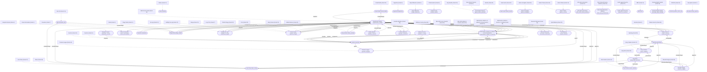

# Entity Resolution Graph

```mermaid
graph TD
  m40["Alamo (chunk 21)"]
  m41["Amad Diallo (chunk 33)"]
  m42["Amorim (chunk 2)"]
  m43["Argentina (chunk 3)"]
  m44["Benjamin Sesko (chunk 4)"]
  m45["Bruno Fernandes (chunk 3)"]
  m46["Bryan Mbeumo (chunk 3)"]
  m47["Casemiro (chunk 7)"]
  m48["Charlie Austin (chunk 8)"]
  m49["Dalot (chunk 9)"]
  m50["De Ligt (chunk 10)"]
  m51["Diogo Dalot (chunk 11)"]
  m52["Dorgu (chunk 33)"]
  m53["Everton (chunk 13)"]
  m54["Everton (chunk 14)"]
  m55["Gary Neville (chunk 15)"]
  m56["Gary Neville Podcast (chunk 8)"]
  m57["Geny Catamo (chunk 17)"]
  m58["Harry Amass (chunk 33)"]
  m59["head coach (chunk 37)"]
  m60["Jamie Carragher (chunk 20)"]
  m61["Jamie O'Hara (chunk 32)"]
  m62["Jamie O'Hara (chunk 33)"]
  m63["Kobbie Mainoo (chunk 23)"]
  m64["left-sided centre-back (chunk 30)"]
  m65["Leny Yoro (chunk 7)"]
  m66["Lisandro Martinez (chunk 29)"]
  m67["Luke Shaw (chunk 27)"]
  m68["Man Utd (chunk 19)"]
  m69["Man Utd's loss to Everton (chunk 29)"]
  m70["Man Utd performance statistics (chunk 31)"]
  m71["Man Utd's defeat to Everton (chunk 32)"]
  m72["Manchester United (chunk 32)"]
  m73["Manchester United's 1-0 defeat to 10-man Everton (chunk 33)"]
  m74["Manchester United vs Everton 1-0 defeat (chunk 34)"]
  m75["match against Everton (chunk 27)"]
  m76["Matheus Cunha (chunk 36)"]
  m77["Matthijs De Ligt (chunk 37)"]
  m78["MNF (chunk 13)"]
  m79["Monday Night Football (chunk 39)"]
  m80["Neville (chunk 40)"]
  m81["Noussair Mazraoui (chunk 33)"]
  m82["Nuno Santos (chunk 42)"]
  m83["Patrick Dorgu (chunk 43)"]
  m84["Premier League (chunk 44)"]
  m85["Ricardo Esagio (chunk 45)"]
  m86["Ruben Amorim (chunk 46)"]
  m87["2023/24 (chunk 30)"]
  m88["Shaw (chunk 48)"]
  m89["Sky Sports (chunk 2)"]
  m90["Sporting (chunk 50)"]
  m91["Tyrell Malacia (chunk 33)"]
  m92["wing-back (chunk 30)"]
  m93["Yoro (chunk 53)"]
  r0(["Alamo (alamo)"])
  r1(["Amad Diallo (amad_diallo)"])
  r2(["Ruben Amorim (ruben_amorim)"])
  r3(["Argentina (argentina)"])
  r4(["Benjamin Sesko (benjamin_sesko)"])
  r5(["Bruno Fernandes (bruno_fernandes)"])
  r6(["Bryan Mbeumo (bryan_mbeumo)"])
  r7(["Casemiro (casemiro)"])
  r8(["Charlie Austin (charlie_austin)"])
  r9(["Diogo Dalot (diogo_dalot)"])
  r10(["Matthijs De Ligt (matthijs_de_ligt)"])
  r11(["Patrick Dorgu (patrick_dorgu)"])
  r12(["Everton (everton)"])
  r13(["Gary Neville Podcast (gary_neville_podcast)"])
  r14(["Geny Catamo (geny_catamo)"])
  r15(["Harry Amass (harry_amass)"])
  r16(["head coach (head_coach)"])
  r17(["Jamie Carragher (jamie_carragher)"])
  r18(["Jamie O'Hara (jamie_o_hara)"])
  r19(["Kobbie Mainoo (kobbie_mainoo)"])
  r20(["left-sided centre-back (left_centre_back_position)"])
  r21(["Lisandro Martinez (lisandro_martinez)"])
  r22(["Luke Shaw (luke_shaw)"])
  r23(["Man Utd (man_utd)"])
  r24(["Manchester United's 1-0 defeat to 10-man Everton (manchester_united_vs_everton)"])
  r25(["Man Utd performance statistics (man_utd_performance)"])
  r26(["Manchester United (manchester_united)"])
  r27(["match against Everton (match_vs_everton)"])
  r28(["Matheus Cunha (matheus_cunha)"])
  r29(["MNF (mnf)"])
  r30(["Monday Night Football (monday_night_football)"])
  r31(["Noussair Mazraoui (noussair_mazraoui)"])
  r32(["Nuno Santos (nuno_santos)"])
  r33(["Premier League (premier_league)"])
  r34(["Ricardo Esagio (ricardo_esagio)"])
  r35(["2023/24 (season_2023_24)"])
  r36(["Sky Sports (sky_sports)"])
  r37(["Sporting (sporting)"])
  r38(["Tyrell Malacia (tyrell_malacia)"])
  r39(["wing-back (wing_back_position)"])
  m40 -.-> r0
  m41 -.-> r1
  m42 -.-> r2
  m43 -.-> r3
  m44 -.-> r4
  m45 -.-> r5
  m46 -.-> r6
  m47 -.-> r7
  m48 -.-> r8
  m49 -.-> r9
  m50 -.-> r10
  m51 -.-> r9
  m52 -.-> r11
  m53 -.-> r12
  m54 -.-> r12
  m55 -.-> r13
  m56 -.-> r13
  m57 -.-> r14
  m58 -.-> r15
  m59 -.-> r16
  m60 -.-> r17
  m61 -.-> r18
  m62 -.-> r18
  m63 -.-> r19
  m64 -.-> r20
  m65 -.-> r11
  m66 -.-> r21
  m67 -.-> r22
  m68 -.-> r23
  m69 -.-> r24
  m70 -.-> r25
  m71 -.-> r24
  m72 -.-> r26
  m73 -.-> r24
  m74 -.-> r24
  m75 -.-> r27
  m76 -.-> r28
  m77 -.-> r10
  m78 -.-> r29
  m79 -.-> r30
  m80 -.-> r13
  m81 -.-> r31
  m82 -.-> r32
  m83 -.-> r11
  m84 -.-> r33
  m85 -.-> r34
  m86 -.-> r2
  m87 -.-> r35
  m88 -.-> r22
  m89 -.-> r36
  m90 -.-> r37
  m91 -.-> r38
  m92 -.-> r39
  m93 -.-> r11
  r1 -->|playsFor| r26
  r2 -->|manages| r26
  r2 -->|manages| r37
  r4 -->|playsFor| r12
  r7 -->|playsFor| r26
  r9 -->|playsFor| r26
  r10 -->|playsFor| r26
  r9 -->|playsFor| r26
  r11 -->|playsFor| r26
  r12 -->|competesIn| r24
  r12 -->|competesIn| r24
  r12 -->|competesIn| r24
  r12 -->|competesIn| r24
  r12 -->|partOf| r33
  r12 -->|competesIn| r24
  r12 -->|competesIn| r24
  r14 -->|hasPosition| r39
  r14 -->|playsFor| r37
  r15 -->|playsFor| r26
  r19 -->|playsFor| r26
  r21 -->|playsFor| r26
  r22 -->|playsFor| r26
  r23 -->|includesPlayer| r9
  r23 -->|includesPlayer| r22
  r24 -->|includes| r12
  r24 -->|includes| r12
  r26 -->|competesIn| r24
  r26 -->|competesIn| r24
  r26 -->|competesIn| r24
  r26 -->|competesIn| r24
  r26 -->|includesPlayer| r1
  r26 -->|includesPlayer| r5
  r26 -->|includesPlayer| r7
  r26 -->|includesPlayer| r9
  r26 -->|includesPlayer| r10
  r26 -->|includesPlayer| r9
  r26 -->|includesPlayer| r11
  r26 -->|includesPlayer| r15
  r26 -->|includesPlayer| r19
  r26 -->|includesPlayer| r21
  r26 -->|includesPlayer| r22
  r26 -->|includesPlayer| r10
  r26 -->|includesPlayer| r31
  r26 -->|includesPlayer| r11
  r26 -->|includesPlayer| r22
  r26 -->|includesPlayer| r38
  r26 -->|includesPlayer| r11
  r26 -->|managedBy| r2
  r26 -->|managedBy| r2
  r26 -->|partOf| r33
  r24 -->|competesIn| r12
  r24 -->|competesIn| r26
  r28 -->|playsFor| r12
  r10 -->|playsFor| r26
  r31 -->|playsFor| r26
  r32 -->|hasPosition| r39
  r32 -->|playsFor| r37
  r11 -->|playsFor| r26
  r34 -->|hasPosition| r39
  r34 -->|playsFor| r37
  r2 -->|manages| r26
  r22 -->|playsFor| r26
  r37 -->|includesPlayer| r14
  r37 -->|includesPlayer| r32
  r37 -->|includesPlayer| r34
  r37 -->|managedBy| r2
  r38 -->|playsFor| r26
  r39 -->|isPositionOf| r14
  r39 -->|isPositionOf| r32
  r39 -->|isPositionOf| r34
  r39 -->|isPositionOf| r22
  r11 -->|playsFor| r26
```