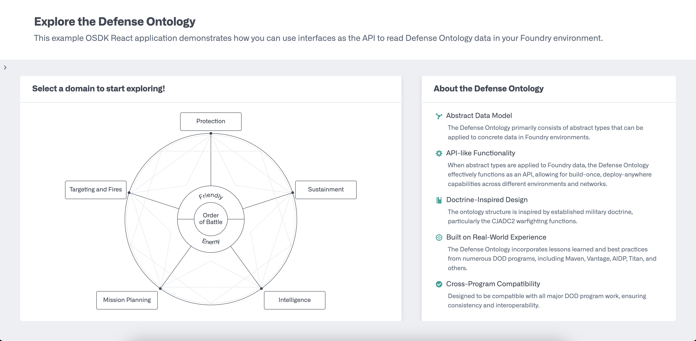

# defense-ontology-explorer-app

This reference example OSDK React application demonstrates how to leverage the Defense Ontology via OSDK. The Defense Ontology was developed by Palantir to act as a Defense-focused API for Foundry developers. This application can run against any environment that has the Defense Ontology installed and applied to existing ontology data. For more information on how to deploy the Defense Ontology, reach out to your Palantir representative.

To use the application, select a domain from the diagram on the main page to see Defense Ontology interfaces. From there you can drill down to explore interfaces included in that domain, implementing object types, objects, and finally, you can load an object via OSDK and see the JSON response.



## Running the Application

**Prerequisites**

- Have the Defense Ontology product installed on your Foundry
- Apply the Defense Ontology to your object types

#### Developer Console

1. Create a new public client Developer Console Application with Ontology Resources and call it `Defense Ontology Explorer App`
   <br />

2. Under the _Data Resources_ tab, add all of the Defense Ontology interfaces and implementing object types
   <br />

3. To leverage the media iconography rendering, you will need to add additional Platform SDK resources, specifically the `Media sets read permission`
   <br />

4. Generate a new SDK version and be sure to enable beta SDK features
   <br />

#### Run Locally

1. Navigate to the "Start Developing" page of your developer application &rarr; select "Add the Ontology SDK to an existing project"

   1. Follow the steps to set your `FOUNDRY_TOKEN` and `.npmrc` file contents; you will need to edit the `.npmrc` file in this cloned repository
      <br />

2. Navigate to the OAuth & Scopes page of your developer console application

   1. Add `http://localhost:8080/auth/callback` as a redirect URL
   2. Copy the client ID under "App Credentials"
      <br />

3. Edit the `.env.development` file in this cloned repository and set the values:

   ```
   VITE_FOUNDRY_API_URL=https://<your foundry domain>
   VITE_FOUNDRY_REDIRECT_URL=http://localhost:8080/auth/callback
   VITE_FOUNDRY_CLIENT_ID=<copied client id>
   ```

      <br />

4. Configure CORS in your control panel to allow `http://localhost:8080` - see [official Palantir documentation](https://www.palantir.com/docs/foundry/administration/configure-cors) for more details

  <br />

5. At this point you should be able to run `npm install` to install required dependencies, including the OSDK

   ```
   ➜  Defense-Ontology-Explorer-App git:(develop) npm install

      up to date, audited 372 packages in 1s

      80 packages are looking for funding
      run `npm fund` for details
   ```

      <br />

6. Access the application by running `npm run dev` and navigating to http://localhost:8080

   ```
   ➜  Defense-Ontology-Explorer-App git:(develop) npm run dev

   > defense-ontology-explorer@0.0.0 dev
   > vite


   VITE v5.4.14  ready in 460 ms

   ➜  Local:   http://localhost:8080/
   ➜  Network: use --host to expose
   ➜  press h + enter to show help
   ```

#### Deploy to Production

_Check out the "Deploying applications" of your Developer Console application to explore different deployment options_
