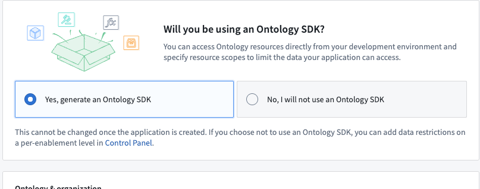
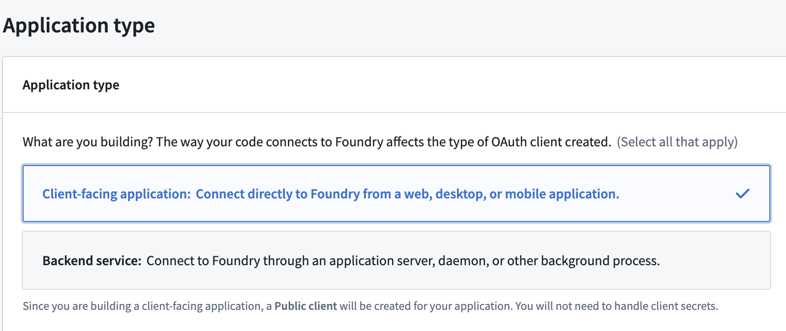
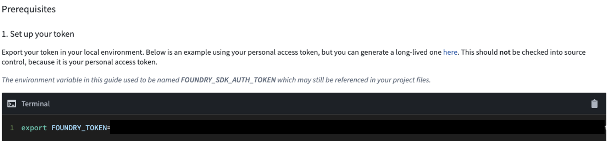
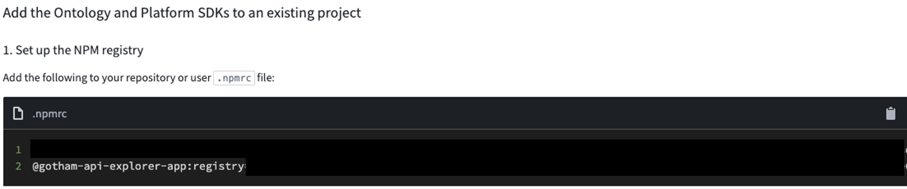
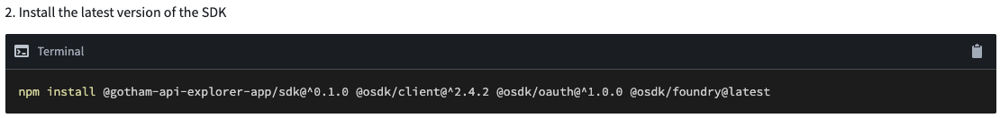
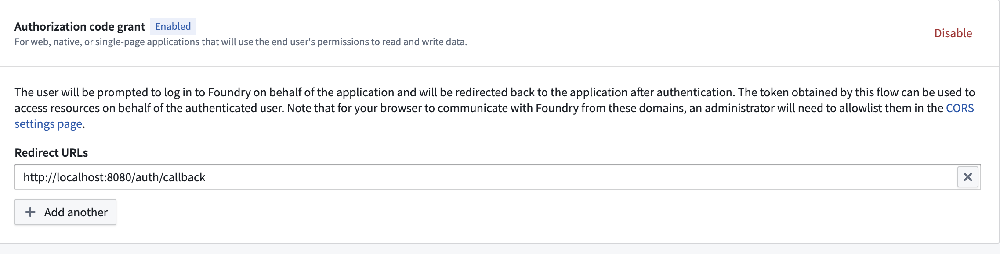
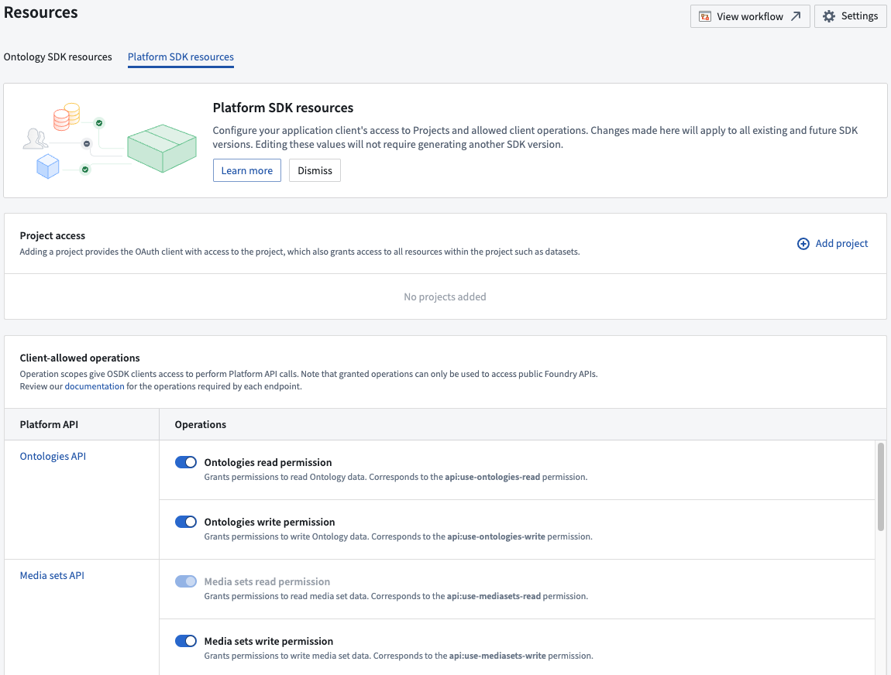
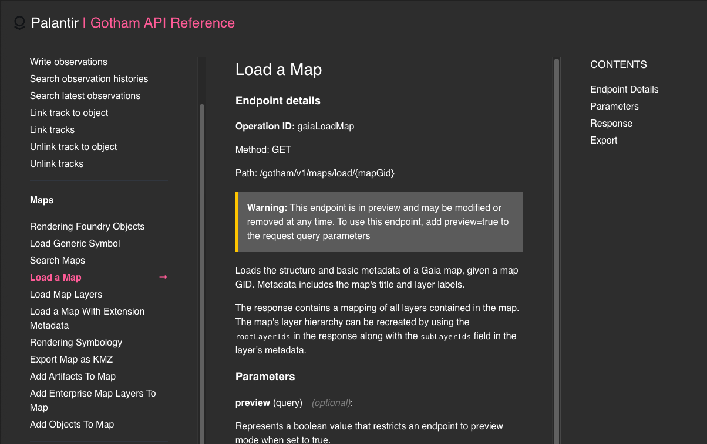

# Use the gotham-api-explorer-app to interact with Gotham APIs


The gotham-api-explorer-app enables third-party developers to interact with Palantir's [Gotham APIs](https://www.palantir.com/docs/gotham/api/general/overview/introduction/) and create custom cURL requests instantly through dynamic form generation. Acting as an API endpoint glossary and point of reference, the gotham-explorer-api-app helps third-party developers create custom calls to various Gotham services, such as [Gaia](https://www.palantir.com/docs/gotham/api/map-resources/maps) and [Target Workbench](https://www.palantir.com/docs/gotham/api/target-workbench).

To get started, navigate to [Developer Console](https://www.palantir.com/docs/foundry/ontology-sdk/create-a-new-osdk/) in Foundry and [follow the instructions below](#create-a-new-developer-console-application) to create a new application.

If you don't have access to Foundry, you can sign up for a free AIP Developer Tier account [here](https://build.palantir.com/).

## Create a new Developer Console application

1. Create a new public client Developer Console Application with Ontology Resources and call it `Gotham API Explorer App`
2. Select "Yes, generate an Ontology SDK" and select an arbitrary ontology

3. Select Client-facing application during creation

   <br />

## Run your Developer Console application locally

After you create a Developer Console application, you can run it locally by navigating to its **Start Developing** page and selecting **Add the Ontology and Platform SDKs to an existing project**. [Learn more about projects in Foundry](https://www.palantir.com/docs/foundry/security/projects-and-roles/).

<br />

1. Navigate to the Start developing page and select "Add the Ontology and Platform SDKs to an existing project"
   1. Follow the steps to set your `FOUNDRY_TOKEN` and `.npmrc` file contents; you will need to edit the `.npmrc` file in this cloned repository
   
   
   2. Also follow the step to install the latest version of the SDK locally
   

2. Navigate to the OAuth & Scopes page of your developer console application

   1. Add `http://localhost:8080/auth/callback` as a redirect URL
   2. Copy the client IDs under "App Credentials"
   

      <br />

3. Navigate to the Resources page then the Platform SDK resources
   1. Add the following Operations under Client-allowed-operations: 
   ontologies-read, ontologies-write, admin-read, admin-write, datasets-read, datasets-write, filesystem-read, filesystem-write, map-read, map-write, target-read, target-write, geotime-read, and geotime-write
   
   <br />

3. Edit the `.env.development` file in this cloned repository and set the values:

   ```
   VITE_FOUNDRY_API_URL=https://<your foundry domain>
   VITE_FOUNDRY_REDIRECT_URL=http://localhost:8080/auth/callback
   VITE_FOUNDRY_CLIENT_ID=<copied client id>
   ```

      <br />

4. Follow the [existing documentation](https://www.palantir.com/docs/foundry/administration/configure-cors) to configure cross-origin resource sharing (CORS) in [Control Panel](https://www.palantir.com/docs/foundry/administration/control-panel/) that enables web page access to APIs hosted on a different origin. The default setting of `http://localhost:8080` should suffice.
<br />

5. Navigate to the root of gotham-api-explorer-app locally and run `npm install` to install all required dependencies, including the OSDK.

   ```
   ➜  gotham-api-explorer-app % npm install

    added 46 packages in 8s

    168 packages are looking for funding
    run `npm fund` for details
   ```
 <br />

6. Access the application by running `npm run dev` and navigating to `http://localhost:8080` in your browser of choice.

   ```
   ➜  gotham-api-explorer-app git:(develop) npm run dev

   > gotham-api-explorer-app@0.0.0 dev
   > vite


   VITE v5.4.14  ready in 460 ms

   ➜  Local:   http://localhost:8080/
   ➜  Network: use --host to expose
   ➜  press h + enter to show help
   ```

## Interact with Gotham APIs

With gotham-api-explorer-app running locally, you can select an endpoint from those available in **API endpoints** on the left side of your screen to render its details in the middle panel, such as its path and request body.



Input specific values into the form fields within the **Parameters** and **Request Body** sections before choosing **Submit** to render an API call's **Response**.  A formatted cURL request will display in the **Export as cURL** section, which you can export to your clipboard by selecting **Copy**.

## Code structure

The gotham-api-explorer-app acts as a reference point to help third-party developers use Gotham APIs and their corresponding specifications programmatically through code in compliance with [OpenAPI specifications](https://swagger.io/specification/).

### General components
To fetch the OpenAPI spec definitions of all available API endpoints, gotham-api-explorer-app uses an API call to [`/api/gotham/openapi`](./src/Home.tsx) in Foundry and stores the response data globally.

Additionally, gotham-api-explorer-app uses [Redux](https://redux.js.org/) to maintain global state across the application through [selectors](./src/features/form/selectors.ts), [sagas](./src/features/form/sagas.ts), and [reducers](./src/features/form/slice.ts).

When you select an endpoint from the menu on the left side of the screen, gotham-api-explorer-app [dynamically and recursively generates](./src/SchemaForm/SchemaForm.tsx) a form based off of the OpenAPI spec. When you update a parameter or request body value field, then gotham-api-explorer-app updates the input values by their corresponding [sagas](./src/features/form/sagas.ts) before [creating a cURL](./src/MainContent.tsx) that corresponds to the input values. 

When you select **Submit**, gotham-api-explorere-app [validates the form](./src/SchemaForm/SubmitButton.tsx) against the OpenAPI spec to ensure that all the required values have been fulfilled before pushing a cURL request to the necessary backend service which renders in the **Export as cURL** section.