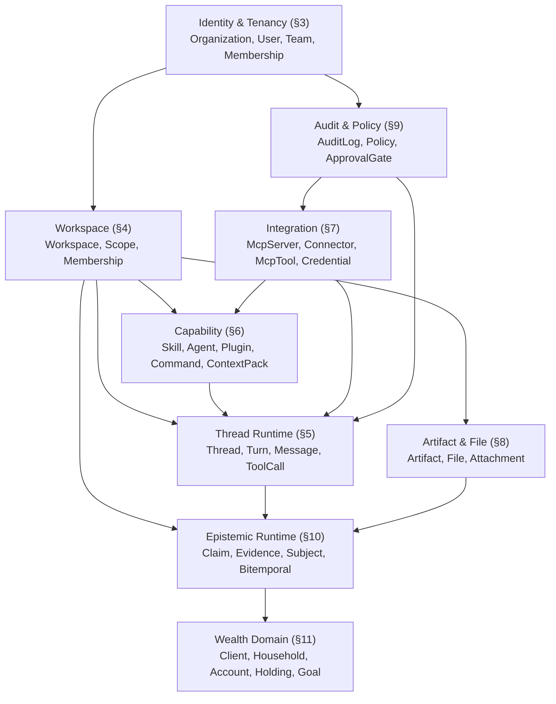
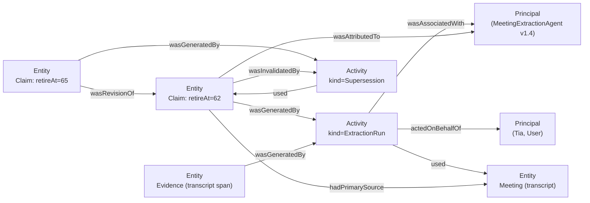
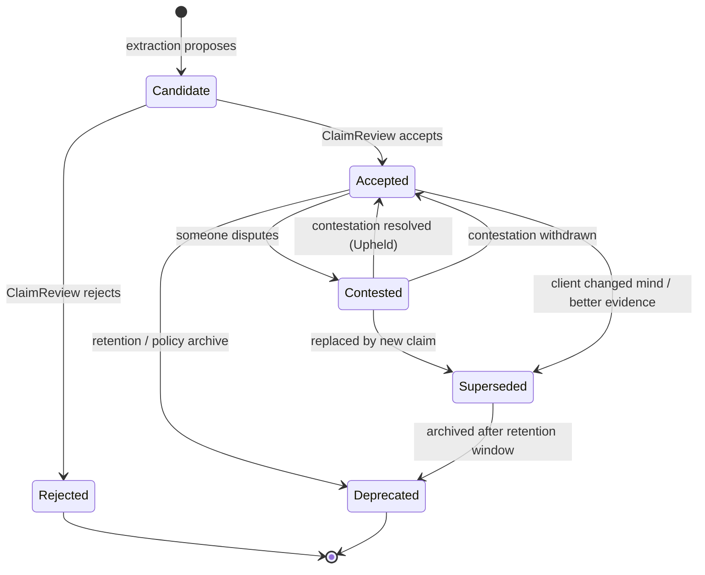

# Todox Data Model

<aside>
🧭

**Purpose.** This is the canonical entity / aggregate map for the Todox runtime — the source of truth for naming, scoping, and ownership across the codebase, the schema layer (`@beep/schema`), and the local-first persistence layer. It's organized as DDD bounded contexts; each context maps cleanly to an Effect `Layer` and a directory under `packages/domain`.

**Reading order.** §1 (naming) → §2 (context map) → **Foundation (PROV-O-aligned universal entity base, F.1–F.10)** → §3–§9 (per-context entity tables) → §10 (the epistemic runtime, the moat) → §11 (wealth domain) → §12 (cross-cutting entities + read models) → §13 (open questions).

</aside>

---

## 1. Naming: `Thread` vs `Chat` vs `Conversation`

<aside>
✅

**Recommendation: `Thread` is the canonical entity name. `Chat` is the UI surface noun. `Conversation` is reserved for a future cross-thread aggregate.**

</aside>

| Candidate | Connotation | Verdict |
| --- | --- | --- |
| **`Thread`** | Sequence of turns with first-class branching, forking, and parent-child lineage. Standard term in agentic systems (Anthropic Threads, OpenAI Assistants Threads, MCP spec). Implies a durable artifact, not an ephemeral conversation. | **Use as the entity name.** Carries the right semantics for multi-agent orchestration, sub-agent spawn, and turn-level supersession. |
| `Chat` | Colloquial, end-user-friendly. Implies real-time, single-track, ephemeral. Loses precision once sub-agents and forks exist. | **Use only as a UI label** ("New chat" button, "Chat history" sidebar). Do not model it. |
| `Conversation` | Higher-level aggregate — the human-meaningful grouping that may span multiple Threads (e.g. "the Q2 retirement-planning conversation with the Smith household" spans 4 Threads). | **Reserved.** Do not introduce until §10's claim graph needs it. v1 models Thread directly. |
| `Session` | Implies auth/runtime lifecycle. Already overloaded with login session. | **Avoid.** |
| `Dialogue` | Two-party. Doesn't accommodate multi-agent. | **Avoid.** |

**Concrete impact:** code says `Thread`, `ThreadId`, `ThreadRepository`. UI says "Chats" / "New chat." Schema and API are `thread_*`. Matches the vocabulary of Anthropic, OpenAI, and the MCP spec.

---

## 2. Bounded Contexts — The Map

Nine bounded contexts (plus §12's cross-cutting entities and read models, which span all of them). Each context is a separately-deployable Effect `Layer` and a separately-versioned schema package. Arrows show **dependency direction only** (downstream depends on upstream); they are not data-flow arrows.



<aside>
🧱

Identity, Workspace, and Thread Runtime are the spine every agentic app has. Capability and Integration are the BYOS levers. Artifact and File are the output side. **Epistemic Runtime + Wealth Domain are the moat** — what makes Todox not-a-notetaker. Audit & Policy crosscuts because compliance has its own readers.

</aside>

---

## Foundation. Universal Entity Base — PROV-O Aligned

<aside>
🧬

**The invariant.** Every entity in §3–§12 extends `BaseEntity` and composes one or more of the mixins below. Modeled on **W3C PROV-O** ([https://www.w3.org/TR/prov-o/](https://www.w3.org/TR/prov-o/)) — the 204-2 audit graph is *exactly* a PROV-O graph extended with bitemporal time. Aligning with the standard means the audit export is PROV-N / PROV-XML / PROV-JSON without translation, and the vocabulary is something an outside auditor or systems-of-record vendor already understands.

</aside>

### F.1  PROV-O → Todox mapping

PROV-O has three foundational classes; every Todox concept maps cleanly onto one of them.

| PROV-O class | Todox realization | Notes |
| --- | --- | --- |
| **`prov:Entity`** | Every aggregate in §3–§12, except the `Activity` table itself. Anything with an `id` that represents a persisted thing: `Claim`, `Artifact`, `Thread`, `Skill`, `Workspace`, `AuditLog`, etc. | The base case. `BaseEntity` is the storage parent struct; the PROV-O export class is still selected per entity type. |
| **`prov:Activity`** | **`Activity`** (a first-class table). `Activity.kind` carries the discriminated audit-relevant event type; F.6 is the canonical list. | A Todox `Activity` is a persisted `BaseEntity` row, but exports as `prov:Activity`, not as `prov:Entity`. PROV-O keeps `Entity`, `Activity`, and `Agent` as separate foundational classes; `BaseEntity` is the storage invariant, not the ontology class. |
| **`prov:Agent`** | **`Principal`** (a tagged union, not a table — used as a typed actor reference). `User`, `ServiceAccount`, `Agent` (the AI sense), `ConnectorAccount`, `System` are the `Principal.kind` discriminators (canonical definition in §3). | PROV-O distinguishes `prov:Person` / `prov:SoftwareAgent` / `prov:Organization`. Todox stores `User`, `ServiceAccount`, and `Organization` as tenant-scoped rows, then exports actor references through `Principal` as `prov:Person` / `prov:SoftwareAgent`. The tenant `Organization` row may also export as `prov:Organization` for accountable-firm attribution, but runtime actions should be attributed to a concrete `User`, `ServiceAccount`, `Agent`, `ConnectorAccount`, or `System` principal rather than a bare org. |
| `prov:Bundle` | **`ProvenanceBundle`** (optional). Used to group related Activity / Entity records into a named, hash-anchored set — e.g. "all extractions from meeting `M`." | Defer to v2 unless export tooling needs it sooner. |

### F.2  The invariant fields — `BaseEntity`

Mandatory on **every** entity, no exceptions. This is the row-CRUD floor: identity, tenancy, who-did-what-when, the row-version counter, and the denormalized source filter every read path expects.

| Field | Type | PROV-O equivalent | Notes |
| --- | --- | --- | --- |
| `id` | `ULID` | (URI identity) | Time-prefixed, sortable, globally unique row identity. Content hashes live in `IntegrityMixin.contentHash` and entity-specific immutable hashes such as `Claim.assertionHash`; they are not primary keys. |
| `entityType` | `EntityTypeTag` | (rdf:type) | Persisted discriminator synced with the concrete `S.TaggedClass` tag. `EntityTypeTag` is the closed union generated from the concrete entity classes in F.8 plus the separately-modeled rows called out in §3–§12; adding a tag is a migration. |
| `orgId` | `OrganizationId` | (scope, not in PROV-O) | Hard tenant boundary. Compliance-mandatory. For the `Organization` row itself, `orgId = id` by invariant. |
| `createdAt` | `Instant` | `prov:generatedAtTime` *(for Entity exports)* | Wall-clock at insert. For rows exported as `prov:Entity`, this maps to `prov:generatedAtTime`. For `Activity` rows, this is storage insertion time; the PROV-O activity time is `startedAt` / `endedAt` in F.6. |
| `createdByPrincipal` | `Principal` | `prov:wasAttributedTo` | The Principal responsible for the row's existence. Includes `onBehalfOfUserId` when an `Agent` Principal acts for a User (`prov:actedOnBehalfOf` — the field 204-2 cares about most). Typed as `Principal`, not a bare `userId`, so agent-on-behalf-of-user is representable without a second column. |
| `updatedAt` | `Instant` | (denormalized projection) | Defaults to `createdAt` on insert; rewritten on every row mutation. **For strictly append-only rows (Activity, AuditLog, Message, ToolCall, ToolResult, Evidence, Supersession, ClaimDerivation, LlmUsageRecord) it remains equal to `createdAt` by construction.** `Claim` is assertion-immutable: its subject/predicate/value/evidence payload never changes, but lifecycle projection fields such as `lifecycleState`, `supersededAt`, and `supersededByEntityId` may be projection-updated by a `Supersession` / `Contestation` Activity. Those projection writes increment `rowVersion`, update `updatedAt`, and fan out to `AuditLog`; the canonical event remains the Activity edge. |
| `updatedByPrincipal` | `Principal` | (denormalized projection) | Defaults to `createdByPrincipal` on insert; rewritten on every mutation. Same projection rule as `updatedAt`. |
| `rowVersion` | `PosInt` | (not in PROV-O) | Auto-incrementing integer. Starts at `1`; increments on every row write. Used for optimistic-concurrency control, CRDT merge resolution, and sync deduplication. **Distinct from `schemaVersion` (SemVer of the schema definition) and from `VersioningMixin.version` (SemVer of explicitly-versioned entities like `Skill` / `Artifact`).** All three can coexist on the same row. |
| `source` | `SourceKind` | (denormalized projection) | `SourceKind = User, Agent, Admin, Application, System, Sync, Connector`. Cheap-filter projection derived from `createdByPrincipal.kind` plus role / component facets — used for compliance dashboards, UI list filters, and audit-log faceting. **Not authoritative**; the full Principal is. |
| `schemaVersion` | `SemVer` | (not in PROV-O) | The schema version this row was written under. Forward-compatibility insurance for migrations. Distinct from `rowVersion` (which counts row writes) and from `VersioningMixin.version` (which is the user-visible SemVer of versioned content). |

<aside>
🤝

**SourceKind projection table.** `User` maps to `User`; `User` plus `Membership.role ∈ {Owner, Admin}` may also project to `Admin`; `Agent` maps to `Agent`; `ConnectorAccount` maps to `Connector`; `ServiceAccount` maps to `Application`, `Connector`, `Sync`, or `System` based on `ServiceAccountKind`; `System` maps to `System` or `Sync` based on `SystemComponent`. The `Admin` shortcut is explicitly a hot-path UI / audit facet, not a Principal kind.

**Why these all belong on Base, not on `ProvenanceMixin`.** `createdAt` / `createdByPrincipal` are universal — every row has them, and rows exported as PROV-O Entities map them cleanly to `prov:generatedAtTime` / `prov:wasAttributedTo`. `updatedAt` / `updatedByPrincipal` / `rowVersion` are universal mutation metadata — every mutable row needs them, and immutable rows just leave the `updated*` fields equal to their `created*` counterparts. `source` is a denormalized hot-path filter every UI and audit dashboard needs without loading the full Principal. **`ProvenanceMixin` is reserved for the richer derivation-graph fields** (`generatedByActivityId`, `derivedFromEntityIds`, `primarySourceEntityId`, `revisionOfEntityId`, etc.) that don't apply to pure-join or static reference rows.

**On the PROV-O purist tension with `updatedAt`.** PROV-O technically says every edit produces a *new* Entity. In Todox we allow in-place mutation for non-Claim entities (Workspace renamed, Skill description tweaked, etc.) for ergonomic and storage reasons. The full edit history still lives in the `Activity` / `AuditLog` graph — `updatedAt` and `updatedByPrincipal` are denormalized projections of "the most recent `ManualEdit` Activity that touched this row." Claims never mutate their assertion payload; truth changes through supersession / contestation Activities, with lifecycle projection fields updated from those Activities.

</aside>

### F.3  `ProvenanceMixin` — the derivation-graph extension

Applied on top of `BaseEntity` for entities that participate in the PROV-O *derivation* graph — anything that can be derived from, revised, sourced, or specialized. Most "real" entities use this mixin; pure-join rows (`Membership`, `TeamMembership`, `WorkspaceMembership`, `WorkspaceBinding`, `WorkspaceModelBinding`, `Attachment`, `ThreadAttachment`, `Tagging`) typically don't.

`BaseEntity` already covers `prov:generatedAtTime` (`createdAt`, for Entity exports) and `prov:wasAttributedTo` (`createdByPrincipal`). This mixin adds the relational fields PROV-O needs to express derivation, sourcing, and revision.

| Field | Type | PROV-O property | Meaning in Todox |
| --- | --- | --- | --- |
| `generatedByActivityId` | `ActivityId` | `prov:wasGeneratedBy` | The Activity that produced this entity. Required when this mixin is applied — even manual creation runs as a `ManualEdit` Activity. |
| `derivedFromEntityIds` | `Array<EntityId>` | `prov:wasDerivedFrom` | Source entities this was derived from. For a Claim: the prior Claims it was inferred over. For an Artifact: the Threads / Claims it was authored from. |
| `primarySourceEntityId?` | `EntityId?` | `prov:hadPrimarySource` | The original first-hand source. For an extracted Claim: the `Meeting.transcriptFileId`. For a quote: the original document. |
| `influencedByEntityIds` | `Array<EntityId>` | `prov:wasInfluencedBy` | Softer than `derivedFrom` — context that shaped the entity without being a direct input. |
| `revisionOfEntityId?` | `EntityId?` | `prov:wasRevisionOf` | For versioned entities: the prior version. (Subproperty of `derivedFrom`.) |
| `specializationOfEntityId?` | `EntityId?` | `prov:specializationOf` | This entity is a more-specific version of another (e.g. `ContextPack` instance specializing a template). |

### F.4  `LifecycleMixin` — invalidation, deletion, retention

Applied to entities that can be invalidated. (Not on append-only Activity / AuditLog rows.)

| Field | Type | PROV-O property | Meaning |
| --- | --- | --- | --- |
| `invalidatedAt?` | `Instant?` | `prov:invalidatedAtTime` | When this entity ceased to be valid. Distinct from soft-delete: an entity can be invalidated (no longer the truth) but still queryable. |
| `invalidatedByActivityId?` | `ActivityId?` | `prov:wasInvalidatedBy` | The Activity that invalidated it (a `Supersession`, `Correction`, etc.). |
| `invalidationReason?` | `InvalidationReason?` | (Todox extension) | `Superseded, Corrected, Withdrawn, Expired, Rejected`. |
| `deletedAt?` | `Instant?` | (soft delete; not PROV-O) | User-initiated soft delete. Distinct from invalidation. |
| `purgeAfter?` | `Instant?` | (retention; not PROV-O) | Set per `orgId.licenseTier`. Hard-delete watermark. |

### F.5  Other mixins (composed where needed)

| Mixin | Fields | Applied to | Purpose |
| --- | --- | --- | --- |
| **`BitemporalMixin`** | `assertedAt`, `observedAt`, `effectiveAt?`, `effectiveUntil?`, `eventTime?`, `supersededAt?`, `supersedesEntityId?`, `supersededByEntityId?` | `Claim`, `Holding`, `Goal`, `PlanningEngagement`, `Project`, `Task`, anything time-truthy | The 204-2-defensible time model from §10b. PROV-O's `generatedAtTime` / `invalidatedAtTime` is one timestamp — we extend it with the four-clock real-world model. |
| **`SyncMixin`** | `hybridLogicalClock` (HLC), `originLocalMachineId`, `lastSyncedAt`, `syncStatus: SyncStatus`, `vectorClock?` | **Every** entity (local-first axiom) | Required because every entity may be authored offline on a `LocalMachine` and reconciled later. `SyncStatus = LocalOnly, PendingUpload, Synced, Conflict, Failed`. HLC is preferred over Lamport for human-readable wall-clock ordering. |
| **`IntegrityMixin`** | `contentHash: Sha256`, `previousVersionHash?`, `signature?: Ed25519Signature`, `signerKeyId?` | **See F.8 for the canonical list.** Applied broadly to audit-bearing entities: `Claim`, `Evidence`, `Activity`, `AuditLog`, `Message`, `Turn`, `ToolCall`, `ToolResult`, every `*Version` row, `Artifact`, `Policy`, `ApprovalGate`, `CapabilityPromotionRequest`, `Comment`, `RetentionPolicy`, `RetentionHold`, `Webhook`, `LlmUsageRecord`, `Notification`, `DataClassification`, `Project`, `Task`. Optional on identity rows. | Canonical SHA-256 of the row's content + Merkle-style chain to prior version. Optional Ed25519 signature by the author's keystore key. **This is what makes the audit log tamper-evident.** |
| **`VersioningMixin`** | `version: SemVer`, `versionLabel?`, `previousVersionId?` | **See F.8.** Applied to **explicitly-versioned** entities: `Plugin`, every `*Version` row (`SkillVersion`, `AgentVersion`, `ContextPackVersion`, `CommandVersion`, `ArtifactVersion`), `Policy`, `ClaimPredicate`, `RetentionPolicy`, `Webhook`. Parent capability / artifact rows (`Skill`, `Agent`, `ContextPack`, `Command`, `Artifact`) point at a `currentVersionId` instead of carrying their own `version` field — the SemVer lives on the `*Version` child. | Explicit revision chain. Layered on top of `revisionOfEntityId` from `ProvenanceMixin` for SemVer-aware tooling. Each concrete `*Version` row carries its own parent FK (`skillId`, `agentId`, etc.); the mixin does not add a generic fourth "current version" concept. |
| **`EncryptionMixin`** | `encryptionKeyId`, `encryptionScheme`, `encryptedAtRest: boolean` | **See F.8.** Applied to entities that contain client data: `Claim`, `Evidence`, `File`, `Artifact` / `ArtifactVersion`, `Message`, `ToolResult`, `ConnectorAccount`, `Comment`, wealth-domain parties, work items. Optional on `Thread`, `Turn`, `Subject`, `*Version` rows that may quote client content. | Local-first means rows that contain client data are encrypted at rest with a key derived from the User's machine keystore. The mixin records *which* key, so re-key operations are reproducible. |

### F.6  The `Activity` table — first-class PROV-O Activity

Because PROV-O treats the *act* of generating an entity as its own object, `Activity` is a first-class table. It's the connective tissue between `AuditLog` (§9) and the entity graph.

| Field | Type | PROV-O property | Notes |
| --- | --- | --- | --- |
| `id`, `entityType="Activity"`, `orgId`, `schemaVersion` | (BaseEntity) | — | Storage-wise, an Activity is a `BaseEntity` row. Ontology-wise, it exports as `prov:Activity`, not `prov:Entity`. |
| `kind` | `ActivityKind` | (rdf:type) | Canonical v1 values: `ToolCall`, `AgentRun`, `ExtractionRun`, `ClaimReview`, `ManualEdit`, `Correction`, `Supersession`, `Contestation`, `Publish`, `ApprovalDecision`, `PolicyEvaluation`, `SyncRun`, `ConnectorSync`, `Login`, `Authorize`, `Revoke`, `CredentialAccess`, `LlmCompletion`, `WebhookDelivery`, `ClassificationDecision`, `RetentionHoldPlaced`, `RetentionHoldReleased`, `RetentionPurge`, `KeyRotation`, `Export`. Open-extensible by migration only; new kinds require schema-version bump and audit export mapping. |
| `startedAt`, `endedAt?` | `Instant` | `prov:startedAtTime`, `prov:endedAtTime` | Activities have duration; entities don't. Durable Activity rows are inserted with the known time facts; in-flight runtime progress is not represented by mutating this append-only row. |
| `associatedWithPrincipal` | `Principal` | `prov:wasAssociatedWith` | The Principal performing the Activity. |
| `onBehalfOfPrincipal?` | `Principal?` | `prov:actedOnBehalfOf` | For Agent / ServiceAccount / Connector Activities: the User or organizational Principal the actor is acting for. **Critical for 204-2.** Canonical authority is still the embedded `Principal`; this field is the normalized PROV-O edge used by exports and audit queries so callers do not have to decode each Principal variant. |
| `usedEntityIds` | `Array<EntityId>` | `prov:used` | Inputs the Activity consumed. |
| `generatedEntityIds` | `Array<EntityId>` | (inverse of `prov:wasGeneratedBy`) | Outputs the Activity produced. |
| `invalidatedEntityIds` | `Array<EntityId>` | (inverse of `prov:wasInvalidatedBy`) | Entities the Activity invalidated (e.g. a Supersession invalidates the prior Claim). |
| `informedByActivityIds` | `Array<ActivityId>` | `prov:wasInformedBy` | Causal chain between Activities. The follow-up turn is `wasInformedBy` the prior turn. |
| `inputArguments?`, `outputs?` | `Json` | (Todox extension) | Structured I/O for the Activity. Same shape as `ToolCall.arguments` / `ToolResult.result`. |
| `atLocation?` | `LocationDescriptor?` | `prov:atLocation` | For local-first: which `LocalMachine` ran the Activity. |

<aside>
🔗

**Activity ↔ AuditLog relationship.** `AuditLog` is **not a duplicate** of `Activity` — it's a denormalized projection optimized for compliance reads. Every `Activity` write fans out to one or more `AuditLog` rows, one per target entity / action facet, with each row carrying the same `activityId` and a `payloadHash` referencing the canonical `Activity`. This mirrors the PROV-O / accounting separation: PROV is the rich graph, the audit log is the linearized journal.

</aside>

### F.7  PROV-O picture — how it all fits together



### F.8  Composition matrix

Which mixins each entity composes. (`✓` = required, `~` = optional, `–` = not applicable.)

| Entity | Base | Provenance | Lifecycle | Bitemporal | Sync | Integrity | Versioning | Encryption |
| --- | --- | --- | --- | --- | --- | --- | --- | --- |
| **Organization** | ✓ | ✓ | ✓ | – | ✓ | ~ | – | – |
| **User** | ✓ | ✓ | ✓ | – | ✓ | ~ | – | – |
| **Team / ServiceAccount / LocalMachine** | ✓ | ✓ | ✓ | – | ✓ | ~ | – | ~ |
| **Membership / TeamMembership / WorkspaceMembership / WorkspaceBinding / WorkspaceModelBinding / Attachment / ThreadAttachment / Tagging** *(pure join rows)* | ✓ | – *(per F.10.9 — `Authorize` / `Revoke` Activities carry the audit story)* | ✓ | – | ✓ | – | – | – |
| **Workspace** | ✓ | ✓ | ✓ | – | ✓ | ~ | – | – |
| **Thread** | ✓ | ✓ | ✓ | – | ✓ | ~ | – | ~ |
| **Turn** | ✓ | ✓ | ~ | – | ✓ | ✓ | – | ~ |
| **Message / ToolCall / ToolResult** | ✓ | ✓ | – | – | ✓ | ✓ | – | ✓ |
| **Skill / Agent / ContextPack / Command** (parent of `*Version` rows) | ✓ | ✓ | ✓ | – | ✓ | ✓ | – (`currentVersionId` points at the `*Version` row) | – |
| **Plugin** *(single-version capability)* | ✓ | ✓ | ✓ | – | ✓ | ✓ | ✓ | – |
| **SkillVersion / AgentVersion / ContextPackVersion / CommandVersion / ArtifactVersion** | ✓ | ✓ | ✓ | – | ✓ | ✓ | ✓ | ~ |
| **McpServer / Connector / McpTool / LlmProvider** | ✓ | ✓ | ✓ | – | ✓ | ~ | – | – |
| **ConnectorAccount / Credential** | ✓ | ✓ | ✓ | – | ✓ | ~ | – | ✓ |
| **Artifact** | ✓ | ✓ | ✓ | – | ✓ | ✓ | – (`currentVersionId` points at `ArtifactVersion`) | ✓ |
| **File** | ✓ | ✓ | ✓ | – | ✓ | ✓ | – | ✓ |
| **Claim** | ✓ | ✓ | ✓ | ✓ | ✓ | ✓ | – | ✓ |
| **Evidence / Supersession / ClaimDerivation** | ✓ | ✓ | – | – | ✓ | ✓ | – | ✓ |
| **Contestation** | ✓ | ✓ | ✓ | – | ✓ | ✓ | – | ✓ |
| **ClaimPredicate** | ✓ | ✓ | ✓ | – | ✓ | ✓ | ✓ | – |
| **Subject** | ✓ | ✓ | ✓ | – | ✓ | ~ | – | ~ |
| **Wealth Domain (Party / PartyRoleAssignment / PartyRelationship / ContactMechanism / Client / Household / Account / Holding / Instrument / Goal / Meeting / PlanningEngagement)** | ✓ | ✓ | ✓ | ~ | ✓ | ✓ | – | ✓ |
| **Project / Task** | ✓ | ✓ | ✓ | ~ | ✓ | ✓ | – | ✓ |
| **Activity** | ✓ | – | – | – | ✓ | ✓ | – | ~ |
| **AuditLog** | ✓ | – | – | – | ✓ | ✓ | – | ~ |
| **Policy** | ✓ | ✓ | ✓ | – | ✓ | ✓ | ✓ | – |
| **ApprovalGate / CapabilityPromotionRequest** | ✓ | ✓ | ✓ | – | ✓ | ✓ | – | – |
| **Notification** | ✓ | – | ✓ | – | ✓ | ✓ | – | – |
| **Comment** | ✓ | ✓ | ✓ | – | ✓ | ✓ | – | ✓ |
| **Tag** | ✓ | – | ✓ | – | ✓ | – | – | – |
| **RetentionPolicy / Webhook** | ✓ | ✓ | ✓ | – | ✓ | ✓ | ✓ | – |
| **RetentionHold** | ✓ | ✓ | ✓ | – | ✓ | ✓ | – | ~ |
| **DataClassification** | ✓ | ✓ | ✓ | – | ✓ | ✓ | – | – |
| **LlmUsageRecord** | ✓ | – *(append-only metering row; no derivation graph)* | – | – | ✓ | ✓ | – | – |

### F.9  Effect / `@beep/schema` shape

The mixins compose at the schema level via field-object spread. Sketch:

```tsx
// packages/domain-foundation/src/BaseEntity.ts
import { $SchemaId } from "@beep/identity";
import * as A from "effect/Array";
import * as Effect from "effect/Effect";
import * as S from "effect/Schema";
import { PosInt } from "@beep/schema";

const $I = $SchemaId.create("domain-foundation");

// BaseEntity is a *fields-object factory*, not a tagged class. Each concrete
// entity gets its own S.TaggedClass with these fields spread in. The persisted
// `entityType` literal is fixed to the same value as the class tag, so a Claim
// row cannot accidentally carry `entityType = "Artifact"`.
export const BaseEntityFields = <const TEntityType extends EntityTypeTag>(
  entityType: TEntityType,
) => ({
  id: EntityId,
  entityType: S.Literal(entityType),
  orgId: OrganizationId,
  // PROV-O generation for Entity exports; Activity rows use startedAt / endedAt.
  createdAt: S.DateTimeUtc,
  createdByPrincipal: Principal,
  // Mutation metadata (universal; equals created* for append-only entities)
  updatedAt: S.DateTimeUtc,
  updatedByPrincipal: Principal,
  rowVersion: PosInt,                        // auto-increment per write; optimistic concurrency / CRDT merge
  // Denormalized hot-path filter
  source: SourceKind,                        // User | Agent | Admin | Application | System | Sync | Connector
  // Schema-evolution insurance
  schemaVersion: SemVer,
});

// Derivation-graph extension. Each mixin is also a fields object, so they
// compose by spread without a wrapper Struct. Applied where it makes sense;
// not on pure-join rows (per F.10.9).
const EntityIdArray = S.Array(EntityId).pipe(
  S.withConstructorDefault(Effect.succeed(A.empty<EntityId>())),
);

export const ProvenanceMixinFields = {
  generatedByActivityId: ActivityId,
  derivedFromEntityIds: EntityIdArray,
  primarySourceEntityId: S.OptionFromOptionalKey(EntityId),
  influencedByEntityIds: EntityIdArray,
  revisionOfEntityId: S.OptionFromOptionalKey(EntityId),
  specializationOfEntityId: S.OptionFromOptionalKey(EntityId),
};

// And so on: LifecycleMixinFields, BitemporalMixinFields, SyncMixinFields,
// IntegrityMixinFields, VersioningMixinFields, EncryptionMixinFields.

// Each concrete entity is its own Schema.TaggedClass — one runtime tag per entity type:
export class Claim extends S.TaggedClass<Claim>($I`Claim`)(
  "Claim",
  {
    ...BaseEntityFields("Claim"),
    ...ProvenanceMixinFields,
    ...LifecycleMixinFields,
    ...BitemporalMixinFields,
    ...SyncMixinFields,
    ...IntegrityMixinFields,
    ...EncryptionMixinFields,
    // Claim-specific:
    subjectId: SubjectId,
    predicateId: ClaimPredicateId,
    value: ClaimValue,
    confidence: Confidence,
    assertionHash: Sha256,
    lifecycleState: ClaimLifecycleState,
    originThreadId: S.OptionFromOptionalKey(ThreadId),
    originTurnId: S.OptionFromOptionalKey(TurnId),
    // Note: the asserting Principal is BaseEntity.createdByPrincipal — no separate field.
  },
  $I.annote("Claim", {
    description: "Typed, provenance-bearing assertion about a Subject.",
  }),
) {}
```

The fields objects (`BaseEntityFields`, `*MixinFields`) are exported from `packages/domain-foundation` (an internal package every other domain package depends on). Each concrete entity is its own `S.TaggedClass` — the in-memory `_tag` and persisted `entityType` literal are both fixed to the same value — making runtime narrowing trivial via `S.is(Claim)(row)` or `Match.tag("Claim", …)`.

### F.10  Open questions for the foundation

<aside>
❓

Foundation-layer decisions to make before the rest of the schema solidifies. These are upstream of every other context.

</aside>

1. **HLC vs Lamport vs vector clock?** **Lean: HLC** (Hybrid Logical Clock) — preserves human-readable wall-clock ordering across machines, doesn't grow unboundedly like vector clocks, and is what CRDT libraries like Automerge / Yjs already use. Vector clocks reserved for the Claim graph if causal-conflict resolution gets complex.
2. **Sign every row, or only compliance-relevant ones?** Argument for *every* row: cheap, auditor-friendly, makes the foundation uniform. Argument against: key-management overhead and sync-time cost. **Lean: sign every row, but with a single per-machine Ed25519 key — not per-action.**
3. **`prov:Bundle` adoption.** PROV-O has Bundles for grouping. Useful for "export this audit period as one signed package." **Lean: defer until the first real export request**, because Activity / AuditLog already provide row-level auditability and Bundles only matter once auditors ask for packaged exports.
4. **Should `Activity` and `AuditLog` be the same table?** Argument for merging: simpler, one source of truth. Argument against: Activity is rich (PROV-O graph); AuditLog is flat (compliance feed). **Lean: keep separate, fan-out on write.**
5. **`schemaVersion` granularity.** Per-entity-type SemVer or one global schema version? Per-entity-type is more flexible but requires careful migration tooling. **Lean: per-entity-type SemVer**, because bounded-context packages version independently and §13 owns the migration mechanism.
6. **Encryption-at-rest key rotation.** When the User rotates their machine key, do we re-encrypt everything in place, or do we just track which key encrypted which row and re-key lazily on read? **Lean: lazy re-key with the `EncryptionMixin.encryptionKeyId` field.**
7. **PROV-O export format.** Which serialization do auditors actually want — PROV-N (Turtle-like), PROV-XML, or PROV-JSON? **Lean: PROV-JSON for tooling plus PROV-N for human-readable archives**, because JSON is easiest to ingest and PROV-N is easiest to inspect in a production request.
8. **`source` granularity — distinguish `User` from `Admin`?** Since admin-ness is really a `Membership.role` lookup against the principal, treating `Admin` as a top-level `SourceKind` is a denormalization shortcut, not a clean ontology. Two options: (a) drop `Admin` from `SourceKind` and force compliance dashboards to join through `Membership`; (b) keep it as a hot-path filter and accept the redundancy. **Lean: keep it (option b)**, because compliance dashboards run this filter constantly and the alternative is a join on every row read. Document explicitly that `source.Admin` is a UI hint and `Membership.role` is authority.
9. **Should pure join rows carry `ProvenanceMixin` at all?** `Membership`, `TeamMembership`, `WorkspaceMembership`, `WorkspaceBinding`, `WorkspaceModelBinding`, `Attachment`, `ThreadAttachment`, and `Tagging` are created, sometimes revoked, never derived. **Lean: no.** `BaseEntity` plus `LifecycleMixin` is enough; `Activity` records of kind `Authorize` / `Revoke` / `ManualEdit` carry the audit story for join changes.
10. **ID strategy and canonical hash boundaries.** IDs are row identities; hashes are integrity / dedupe facts. **Lean: ULID for every row id, `contentHash` for canonical row integrity, and entity-specific immutable hashes such as `Claim.assertionHash` for deduplication / assertion identity**, because lifecycle projection writes must never change a primary key.

---

## 3. Identity & Tenancy

| Entity | Purpose | Key fields | Notes |
| --- | --- | --- | --- |
| **`Organization`** | Tenant root. Every other entity is transitively owned by exactly one Organization. | `id`, `orgId (= id)`, `name`, `slug`, `legalName`, `licenseTier`, `parentOrgId?`, `createdAt`, `settings: OrgSettings` | Hard tenant boundary. No cross-org reads, ever. The model supports parent / subsidiary / d/b/a relationships via `parentOrgId`; do not infer a separate regulatory filing boundary from brand alone. |
| **`User`** | An org-scoped authenticated person profile. | `id`, `orgId`, `email`, `displayName`, `avatarUrl`, `createdAt`, `externalIdentitySubject?` | Same human in multiple firms gets separate User rows; any cross-org identity stitching belongs to the IdP / auth boundary, not the Todox domain model. This preserves the hard tenant invariant. |
| **`Membership`** | User ↔ Organization, with role and grant lifecycle. | `userId`, `orgId`, `role: OrgRole`, `status: MembershipStatus`, `joinedAt` | `OrgRole = Owner, Admin, Compliance, Advisor, Ops, Guest`. `MembershipStatus = Invited, Active, Suspended, Revoked`. Compliance is **first-class** because they need read access across every Workspace in the org. Invariant: `User.orgId = Membership.orgId`. |
| **`Team`** | Sub-org grouping. A department, a pod, an advisor + their CSA(s). | `id`, `orgId`, `name`, `parentTeamId?`, `kind: TeamKind` | `TeamKind = Department, Pod, AdvisorTeam, ComplianceTeam, FamilyOfficeServices, EstatePlanning, Operations`. Trees allowed. Mariner-scale orgs need this; AdvicePeriod-scale may flatten it. |
| **`TeamMembership`** | User ↔ Team, with team-scoped role. | `userId`, `teamId`, `role: TeamRole` | `TeamRole = Lead, Member`. Distinct from `OrgRole` so a junior advisor can be Member of one team and Lead of another. |
| **`ServiceAccount`** | Non-human principal — used by background jobs, MCP servers acting on behalf of the org, and shared agents. | `id`, `orgId`, `name`, `kind: ServiceAccountKind`, `ownedByUserId?` | `ServiceAccountKind = SystemJob, Connector, McpServer, SharedAgent, RetentionRunner, SyncWorker`. Every action has a principal. Background actions run as a ServiceAccount, never as `null`. Cornerstone of the audit log. |
| **`LocalMachine`** | A specific install of the Todox desktop runtime, owned by a User inside an org. | `id`, `orgId`, `userId`, `hostname`, `os`, `installedAt`, `lastSeenAt`, `keystoreFingerprint` | The CRDT / sync layer keys off this. A physical laptop can have one LocalMachine row per org-scoped User profile. Lets a User revoke a lost laptop without destroying their identity. |

<aside>
🚪

**`Principal` — canonical actor reference.** The tagged union used by every field that names an actor: `createdByPrincipal`, `updatedByPrincipal`, `attributedToPrincipal`, `associatedWithPrincipal`, `onBehalfOfPrincipal`, `actorPrincipal`, `requestedByPrincipal`, `decidedByPrincipal`, etc. **Single source of truth — every other section that previously defined `Principal` inline now references this one.**

```tsx
export const UserPrincipal = S.Struct({
  kind: S.Literal("User"),
  userId: UserId,
});

export const ServiceAccountPrincipal = S.Struct({
  kind: S.Literal("ServiceAccount"),
  serviceAccountId: ServiceAccountId,
  onBehalfOfUserId: S.OptionFromOptionalKey(UserId),
});

export const AgentPrincipal = S.Struct({
  kind: S.Literal("Agent"),
  agentId: AgentId,
  agentVersionId: AgentVersionId,
  onBehalfOfUserId: UserId,
  onBehalfOfTeamId: S.OptionFromOptionalKey(TeamId),
});

export const ConnectorAccountPrincipal = S.Struct({
  kind: S.Literal("ConnectorAccount"),
  connectorAccountId: ConnectorAccountId,
  onBehalfOfUserId: S.OptionFromOptionalKey(UserId),
});

export const SystemPrincipal = S.Struct({
  kind: S.Literal("System"),
  component: SystemComponent,
});

export const Principal = S.Union([
  UserPrincipal,
  ServiceAccountPrincipal,
  AgentPrincipal,
  ConnectorAccountPrincipal,
  SystemPrincipal,
]);

export type Principal = typeof Principal.Type;
```

Implementation is schema-first: each variant is an `S.Struct` with a literal `kind`, the aggregate is an `S.Union`, and the exported guards come from `S.is(Principal)`. If the repo needs richer literal-domain helpers, build the same variants from `LiteralKit("User", "ServiceAccount", "Agent", "ConnectorAccount", "System")` and map members into tagged structs; do not re-create `Principal` inline in downstream packages.

**Why `onBehalfOfUserId` lives on the Principal.** PROV-O's `prov:actedOnBehalfOf` is the most-cared-about field for SEC 204-2 ("an Agent did X on behalf of advisor Tia"). Modeling it on the Principal — instead of as a parallel column — makes it traceable through every audit query without joins. **Required on the `Agent` variant** (an Agent always acts for someone); optional on `ServiceAccount` and `ConnectorAccount`; never on `User` or `System`.

**Relationship to `BaseEntity.source`.** `source: SourceKind` is a denormalized projection of `Principal.kind` plus the role / service-account / system-component facets listed in F.2. Authority is the Principal; `source` is the hot-path filter.

**Naming collision: `Agent` entity vs `Agent` Principal variant.** §6 defines `Agent` as a *capability definition* (system prompt + skill set + tool set + model binding). `Principal.kind = "Agent"` is a *runtime actor reference* — `{ agentId, agentVersionId, onBehalfOfUserId }` — that points at a specific run of that capability for a specific user. Same word, different layers: the entity is the *what*, the Principal is the *who-just-did*. Schema homes: `@beep/domain-capability` for the entity, `@beep/domain-foundation` for the Principal variant.

</aside>

<aside>
📌

**Reading the entity tables in §3–§12.** Each table is a **field highlight, not a full schema** — `id` and natural foreign-key columns may appear inline for readability, but every entity transparently inherits all of `BaseEntity` (id, entityType, orgId, createdAt, createdByPrincipal, updatedAt, updatedByPrincipal, rowVersion, source, schemaVersion) plus whichever mixins are marked in the F.8 composition matrix. So when you see e.g. `Workspace` listing `id, orgId, scope, ownerUserId?, name, icon, createdAt`, the full row also has the remaining BaseEntity fields plus its mixin set. **§9 and §12 use the stricter "Entity-specific / Inherited" split** because their entities have richer mixin compositions worth spelling out per-row — prefer that style for any new context with non-trivial mixin layering.

</aside>

---

## 4. Workspace

<aside>
🪟

**Mental model.** A Workspace is **the agentic environment** — the bundle of (skills enabled, agents available, MCP servers connected, knowledge accessible, threads-and-artifacts accumulated). Each User has at least one personal Workspace. Teams have shared Workspaces. The Org has at most one organizational Workspace that holds firm-wide skills, knowledge, and SOPs.

</aside>

| Entity | Purpose | Key fields | Notes |
| --- | --- | --- | --- |
| **`Workspace`** | The scoping container for everything in §5–§7. | `id`, `orgId`, `scope: WorkspaceScope`, `ownerUserId?`, `ownerTeamId?`, `name`, `icon`, `createdAt` | `WorkspaceScope = Personal, Team, Organizational`. **At most one** of `ownerUserId` / `ownerTeamId` is set: `ownerUserId` for Personal, `ownerTeamId` for Team, neither for Organizational. |
| **`WorkspaceMembership`** | User ↔ Workspace, with workspace-scoped permission. | `workspaceId`, `userId`, `role: WorkspaceRole` | `WorkspaceRole = Owner, Editor, Viewer, ComplianceObserver`. Compliance can read any workspace transparently. |
| **`WorkspaceBinding`** | Joins a Workspace to a Capability (Skill / Agent / Plugin / Command / ContextPack) or an Integration (McpServer / Connector). The presence of a binding = that capability is enabled in that workspace. | `workspaceId`, `targetType: WorkspaceBindingTargetType`, `targetId: EntityId`, `enabled: boolean`, `config: Json`, `enabledAt: Instant` | `WorkspaceBindingTargetType = Skill, Agent, Plugin, Command, ContextPack, McpServer, Connector`; `targetId` must resolve to that entity type inside the same `orgId`. This is how inheritance works: a User's Personal workspace inherits all bindings from their Team workspaces and the Organizational workspace, but the User can override or disable any of them locally. |
| **`WorkspaceModelBinding`** | Per-workspace LLM model selection. Distinct from WorkspaceBinding because models are substrate, not capabilities. | `workspaceId`, `purpose: ModelPurpose`, `providerId`, `modelName`, `credentialId` | `ModelPurpose = ThreadResponse, Embedding, Summarization, Classification, Reasoning`. The UI may label `ThreadResponse` as "Chat", but schema/API vocabulary stays on the `Thread` side of the naming boundary. Lets an advisor say "Claude Opus for reasoning, GPT-4o-mini for cheap classification." |

<aside>
🛡️

**Compliance read-access is implicit, not table-driven.** Users with `Membership.role = Compliance` are granted `WorkspaceRole = ComplianceObserver` on every Workspace in their `orgId` automatically — no `WorkspaceMembership` rows are written for them. The `policy-engine` evaluates this at access time. **Revoking compliance access is a single change to `Membership.role` — not a backfill across N Workspaces** — and the audit log records that single Activity. Same pattern (implicit grant from `Membership.role`) applies to `Owner` / `Admin` for cross-workspace administration.

</aside>

---

## 5. Thread Runtime

<aside>
🔁

**Thread-runtime activity views are projections of `Activity` (F.6).** `Thread` is the root entity; `Turn` is the thread-layer view of an `Activity` of kind `AgentRun`; `ToolCall` is the view of an `Activity` of kind `ToolCall`. The table here carries the thread-rendering shape (message stream, sub-agent tree, cost rollups); the `Activity` carries the PROV-O audit detail (`used` / `generated` / `invalidated` / `wasInformedBy` edges). Each `Turn` and each `ToolCall` carries a `1:1` `activityId` pointer (this is `generatedByActivityId` from `ProvenanceMixin`, made non-nullable for these two entities). **Don't model the audit story twice** — query `Activity` for provenance, query `Turn` / `ToolCall` for the thread UI.

</aside>

| Entity | Purpose | Key fields | Notes |
| --- | --- | --- | --- |
| **`Thread`** | Root entity for a conversation. Always scoped to (Workspace, User). | `id`, `workspaceId`, `ownerUserId`, `title`, `parentThreadId?`, `forkedFromTurnId?`, `status: ThreadStatus`, `agentId?`, `createdAt`, `archivedAt?` | `ThreadStatus = Active, Archived, Locked`. Deletion is inherited `LifecycleMixin.deletedAt`, not a status value. `ownerUserId` is the human workspace owner; the actual creator is still `BaseEntity.createdByPrincipal`. `parentThreadId`  • `forkedFromTurnId` enable branching (try a different prompt without polluting the main thread). `agentId` pins the thread to a specific Agent definition. |
| **`Turn`** | One round of (user input → assistant action → assistant response). The atomic unit of conversation history. | `id`, `threadId`, `index`, `activityId: ActivityId` *(non-nullable — points at the `AgentRun` Activity)*, `userMessageId`, `assistantMessageId?`, `subAgentTurnIds: Array<TurnId>`, `startedAt`, `completedAt?`, `costUsd?`, `tokensIn?`, `tokensOut?` | Modeling at the Turn level (not Message) makes accounting, retries, and supersession sane. A failed turn can be re-run without corrupting the message-stream view. |
| **`Message`** | A single message within a Turn. Polymorphic by role. | `id`, `turnId`, `role: MessageRole`, `content: MessageContent`, `createdAt` | `MessageRole = User, Assistant, System, Tool`. `MessageContent` is a tagged union: text, tool_call, tool_result, artifact_ref, claim_emission. **When the assistant emits a Claim (§10), it goes through this seam.** |
| **`ToolCall`** | An invocation of an MCP tool, plugin command, or connector action by the assistant. | `id`, `messageId`, `activityId: ActivityId` *(non-nullable — points at the `ToolCall` Activity)*, `toolUrn: ToolUrn`, `arguments: Json`, `status: ToolCallStatus`, `startedAt`, `completedAt?`, `errorCode?` | Persisted `ToolCallStatus = Succeeded, Failed, Cancelled, TimedOut`; `Pending` / `Running` are runtime execution states, not canonical row values. ToolCall rows are inserted once with terminal status so they remain append-only. `ToolUrn` follows MCP convention: `mcp://{serverId}/{toolName}` or `plugin://{pluginId}/{commandName}` or `connector://{connectorId}/{actionName}`. One URN namespace; readable in the audit log. |
| **`ToolResult`** | The structured result returned by a ToolCall. Stored separately so a result can be reused as evidence (§10) without duplicating content. | `id`, `toolCallId`, `result: Json`, `mimeType?`, `evidenceSpans: Array<EvidenceSpan>` | `evidenceSpans` is what the epistemic runtime hangs Claim provenance off of. |
| **`ThreadAttachment`** | File attached to a Thread (or Turn-scoped). | `threadId`, `turnId?`, `fileId`, `attachedByPrincipal: Principal`, `attachedAt` | Convenience name for the `Attachment` pure join row when `targetType = Thread` or `Turn`; see §8. |

---

## 6. Capability

<aside>
🧩

**The BYOS thesis lives here.** Skills are the markdown-files-an-advisor-drops-in differentiator vs. Zocks' concierge customization. Agents are dedicated sub-agents. Plugins are first-party shipped functionality. Commands are slash-command entry points. ContextPacks are typed retrieval bundles — the anti-RAG-vector-dump primitive.

</aside>

| Entity | Purpose | Key fields | Notes |
| --- | --- | --- | --- |
| **`Skill`** | The `.claude/skills/<name>/SKILL.md` analog. A markdown-defined behavior with optional resources (templates, prompts, scripts). | `id`, `orgId`, `scope: CapabilityScope`, `ownerUserId?`, `ownerTeamId?`, `slug`, `name`, `description`, `currentVersionId: SkillVersionId` | `CapabilityScope = User, Team, Organizational`. Advisor authors at User scope, Team Lead promotes to Team, org publishes at Organizational. **The three-layer promotion is the core IP of the BYOS pitch.** |
| **`SkillVersion`** | Immutable version of a Skill. Lets you roll back; lets compliance review a specific version. | `id`, `skillId`, `version: SemVer`, `markdownContent`, `frontmatter: Json`, `resourceFileIds: Array<FileId>`, `authoredByPrincipal: Principal`, `authoredAt`, `reviewStatus: ReviewStatus` | `ReviewStatus = Draft, InReview, Approved, Rejected, Deprecated`. Required for org-scoped skills before they can be enabled in a Workspace. |
| **`Agent`** | A specialized sub-agent. The "Client Meeting Prep Agent," "Compliance Review Agent," etc. | `id`, `orgId`, `scope: CapabilityScope`, `ownerUserId?`, `ownerTeamId?`, `slug`, `name`, `description`, `systemPromptTemplate`, `enabledSkillIds: Array<SkillId>`, `enabledToolUrns: Array<ToolUrn>`, `defaultModelBinding: ModelPurposeBinding`, `currentVersionId: AgentVersionId` | An Agent = (system prompt + skill set + tool set + model binding). Same scope invariant as `Skill`: `ownerUserId` for User scope, `ownerTeamId` for Team scope, neither for Organizational. `ModelPurposeBinding` is a value object `{ purpose: ModelPurpose, providerId, modelName, credentialId? }`, not a separate entity. Threads pin to an Agent parent; each run records the exact `agentVersionId` on the `Principal`. |
| **`AgentVersion`** | Immutable Agent definition. | `id`, `agentId`, `version: SemVer`, `systemPromptTemplate`, `enabledSkillVersionIds: Array<SkillVersionId>`, `enabledToolUrns: Array<ToolUrn>`, `defaultModelBinding: ModelPurposeBinding`, `authoredByPrincipal: Principal`, `authoredAt`, `reviewStatus: ReviewStatus` | Same versioning rules as Skill. The version points at SkillVersions, not mutable Skill parents, so replaying an old Agent run gets the same tool/skill surface. |
| **`Plugin`** | First-party, code-shipped capability bundle installed into an org-scoped catalog. Built into the app, not user-authored. Examples: Bitemporal Claim Editor, Evidence Span Picker, Compliance Diff Viewer. | `id`, `orgId`, `slug`, `name`, `version: SemVer`, `installedAt`, `enabledByDefault` | The distinction from Skill: Plugins are **binary code** shipped with Todox releases. Skills are **markdown** authored by users. Global plugin definitions are copied into each org so enablement, policy, and audit stay tenant-scoped. |
| **`Command`** | A slash-command entry point. Surfaces a Skill, Agent, ContextPack, or Plugin as `/<slug>` in the Thread input. | `id`, `orgId`, `scope: CapabilityScope`, `ownerUserId?`, `ownerTeamId?`, `slug`, `currentVersionId: CommandVersionId` | Lets the advisor type `/meetingprep` to fire a specific Agent run with structured args. Same scope invariant as `Skill`: `ownerUserId` for User scope, `ownerTeamId` for Team scope, neither for Organizational. Target and argument schema live on `CommandVersion` so a historical Thread can replay what `/meetingprep` meant at the time. |
| **`CommandVersion`** | Immutable slash-command definition. | `id`, `commandId`, `version: SemVer`, `targetRef: CommandTargetRef`, `argsSchema: Json`, `authoredByPrincipal: Principal`, `authoredAt`, `reviewStatus: ReviewStatus` | `CommandTargetRef` is a tagged union over `SkillVersionId`, `AgentVersionId`, `ContextPackVersionId`, and `PluginId`; `CommandTargetType = SkillVersion, AgentVersion, ContextPackVersion, Plugin`. Versioned because changing a command target or arg schema changes behavior. Org-scoped commands require review before promotion. |
| **`ContextPack`** | A bounded retrieval bundle — the "evidence-bearing context for a specific task" from the Zocks takedown. Composable: `meeting_prep_pack` = (last 3 meetings + portfolio snapshot + open goals + recent emails). | `id`, `orgId`, `slug`, `scope: CapabilityScope`, `ownerUserId?`, `ownerTeamId?`, `currentVersionId: ContextPackVersionId` | **Anti-RAG-vector-dump primitive.** Pack definitions are typed queries against the §10 Claim graph, not similarity searches. |
| **`ContextPackVersion`** | Immutable retrieval-bundle definition. | `id`, `contextPackId`, `version: SemVer`, `definition: ContextPackSpec`, `authoredByPrincipal: Principal`, `authoredAt`, `reviewStatus: ReviewStatus` | A ContextPack used in an Activity must point to the versioned definition, not the mutable parent. This is what makes "what context did the Agent see?" replayable. |

---

## 7. Integration

| Entity | Purpose | Key fields | Notes |
| --- | --- | --- | --- |
| **`McpServer`** | A registered MCP server endpoint. Shared organizational ones (firm knowledge, document store, CRM bridge) are org-scoped; an advisor can register personal MCP servers at user scope. | `id`, `orgId`, `scope: IntegrationScope`, `ownerUserId?`, `ownerTeamId?`, `name`, `transport: McpTransport`, `endpoint`, `authMethod: McpAuthMethod`, `credentialId?`, `capabilities: McpCapabilities` | `IntegrationScope = User, Team, Organizational`. `ownerUserId` is set only for User scope; `ownerTeamId` only for Team scope; neither for Organizational. `McpTransport = Stdio, StreamableHttp, Sse`. `McpAuthMethod = None, OAuth, ApiKey, LocalCommand, Custom`. `McpCapabilities` is an open protocol-cache object containing the tools/resources/prompts the server exposes — refreshed via the MCP `list_*` calls. |
| **`McpTool`** | A tool exposed by an McpServer. Cached locally so we can show the advisor what's available without hitting the server. | `mcpServerId`, `name`, `description`, `inputSchema: Json`, `annotations: Json`, `lastSeenAt` | Compositionally identical to plugin commands and connector actions, but routed through MCP. |
| **`Connector`** | A binding to a specific third-party SaaS (Gmail, Google Drive, Salesforce FSC, Wealthbox, Orion, etc.). | `id`, `orgId`, `scope: IntegrationScope`, `ownerUserId?`, `ownerTeamId?`, `kind: ConnectorKind`, `displayName`, `credentialId`, `configuration: Json`, `status: IntegrationStatus` | Same scope invariant as `McpServer`. `ConnectorKind` is open-extensible by provider registry; seed values include `Gmail`, `GoogleDrive`, `Outlook`, `SharePoint`, `SalesforceFsc`, `Wealthbox`, `Orion`, `BlackDiamond`, `Box`, `Slack`. `IntegrationStatus = Draft, Active, Degraded, Disabled, Revoked`. **A Connector may be implemented as an MCP server under the hood**; the distinction is conceptual — Connectors are user/firm-facing branded integrations, McpServers are the protocol layer. |
| **`ConnectorAccount`** | The specific OAuth account / API binding for a Connector. A user may have multiple Gmail accounts. | `id`, `connectorId`, `userId?`, `serviceAccountId?`, `accountIdentifier`, `tokenStoreRef`, `expiresAt?` | Tokens never live in the database — only references to the OS keychain (macOS Keychain, Windows Credential Manager, Linux libsecret). |
| **`Credential`** | Generic, polymorphic credential record. Used by McpServer, Connector, and per-workspace BYO LLM keys. | `id`, `orgId`, `scope: IntegrationScope`, `ownerUserId?`, `ownerTeamId?`, `kind: CredentialKind`, `tokenStoreRef`, `metadata: Json` | Same scope invariant as `McpServer`. `CredentialKind = OAuth, ApiKey, PersonalAccessToken, ServiceAccountKey, LocalKeychainRef`. Local-first principle: the credential record itself can sync, but the **secret material lives only in the user's machine keystore**. A Zocks-killer architectural detail. |
| **`LlmProvider`** | Org-scoped catalog of available providers (Anthropic, OpenAI, Google, Mistral, Ollama, OpenRouter, LiteLLM, etc.). Global defaults are copied into each org so provider visibility can be tenant-scoped. | `id`, `orgId`, `slug`, `displayName`, `kind: LlmProviderKind`, `defaultEndpoint`, `supportedModels: Array<ModelDescriptor>` | `LlmProviderKind = Hosted, OpenRouterRouted, LocalOllama, LocalLlamaCpp`. The local options are the BYOC story. |

---

## 8. Artifact & File

| Entity | Purpose | Key fields | Notes |
| --- | --- | --- | --- |
| **`Artifact`** | A publishable output authored by an Agent (with the User in the loop). Examples: a draft client email, a meeting prep brief, an IPS update, a compliance memo. | `id`, `workspaceId`, `kind: ArtifactKind`, `title`, `currentVersionId: ArtifactVersionId`, `originThreadId?`, `originTurnId?`, `status: ArtifactStatus`, `responsibleUserId`, `createdAt` | `responsibleUserId` is the accountable human for review / delivery; the actual creator remains `BaseEntity.createdByPrincipal`. `ArtifactKind = Document, Email, Memo, Brief, Deck, Spreadsheet, Custom`. `ArtifactStatus = Draft, InReview, Approved, Published, Archived`. Artifacts are the **output side** — they get emailed to the client, filed in the CRM, or saved to the WORM archive. |
| **`ArtifactVersion`** | Immutable snapshot. Lets compliance see exactly what was sent. | `id`, `artifactId`, `version: SemVer`, `content: ArtifactContent`, `authoredByPrincipal: Principal`, `authoredAt`, `reviewedByUserIds: Array<UserId>` | Versioning is mandatory because of Reg S-P / 204-2. Reviews are intentionally human-user refs; authorship may be User, Agent, ServiceAccount, or System. |
| **`File`** | A blob — uploaded document, transcript audio, PDF, image. Content-addressed. | `id`, `orgId`, `workspaceId?`, `contentHash: Sha256`, `mimeType`, `bytes`, `localPath?`, `remoteUri?`, `uploadedByPrincipal: Principal`, `uploadedAt` | `localPath` for the local-first machine-resident copy; `remoteUri` only for explicitly-synced files. Hash-addressed = same file referenced from many places without duplication. |
| **`Attachment`** | Polymorphic File ↔ (Thread / Turn / Message / Artifact / Claim). | `id`, `fileId`, `targetType: AttachmentTargetType`, `targetId: EntityId`, `attachedByPrincipal: Principal`, `attachedAt` | `AttachmentTargetType = Thread, Turn, Message, Artifact, Claim`; `targetId` must resolve to that entity type inside the same `orgId`. One join table to rule them all. Keeps File a clean leaf. |

---

## 9. Audit & Policy

| Entity | Purpose | Key fields | Notes |
| --- | --- | --- | --- |
| **`AuditLog`** | Immutable, append-only **fan-out projection of `Activity`** (F.6) — the linearized compliance feed. Every row points back to its canonical `Activity`; **`AuditLog` is not a parallel source of truth.** | **Entity-specific:** `activityId`, `action: AuditAction`, `targetEntityType: EntityTypeTag`, `targetEntityId: EntityId`, `payloadHash: Sha256`, `occurredAt: Instant`, `clientGeneratedId: Ulid`<br>**Inherited:** `BaseEntity` (incl. `createdByPrincipal` = the actor), `IntegrityMixin`, `SyncMixin` | One or more `AuditLog` rows per `Activity` write: one row for each target entity / action facet that compliance needs to filter. `AuditAction` is a projection enum derived from `ActivityKind` plus target entity type; it is not an independent event taxonomy. The full PROV-O graph (`used` / `generated` / `actedOnBehalfOf` / `wasInformedBy`) lives on `Activity`; `AuditLog` is the flat compliance journal optimized for read-heavy 204-2 queries. **`Principal` is canonical in §3** — the inline definition that used to live here is removed to avoid drift. |
| **`Policy`** | A declarative permission rule. "Only Compliance can publish Memos." "Skills authored at User scope cannot call write-tools on the CRM connector." | **Entity-specific:** `name`, `subject: PolicySubject`, `predicate: PolicyPredicate`, `effect: PolicyEffect`<br>**Inherited:** `BaseEntity`, `ProvenanceMixin`, `LifecycleMixin`, `SyncMixin`, `IntegrityMixin`, `VersioningMixin` | `PolicyEffect = Allow, Deny, RequireApproval`. `PolicySubject` is a tagged union with variants `EntityRef`, `CapabilityRef`, and `PrincipalRoleRef`. `PolicyPredicate` is an OPA / Cedar-style boolean expression. Evaluated in a single chokepoint (`policy-engine` package). When `effect = RequireApproval`, the runtime opens an `ApprovalGate` instead of allowing or denying outright. |
| **`ApprovalGate`** | A pending action that requires human approval before execution. The "agents-can-write-but-with-a-gate" pattern from the Mariner doc Phase 4. | **Entity-specific:** `requestedByPrincipal: Principal`, `actionDescriptor: Json`, `status: ApprovalStatus`, `requiredApproverRoles: Array<Role>`, `decidedByPrincipal?`, `decidedAt?`, `decisionReason?`, `expiresAt?`<br>**Inherited:** `BaseEntity`, `ProvenanceMixin`, `LifecycleMixin`, `SyncMixin`, `IntegrityMixin` | `ApprovalStatus = Pending, Approved, Rejected, Expired`. `Role = OrgRole, TeamRole, WorkspaceRole` — the union; an approver matches if any of their role memberships satisfies a required role. The decision itself is recorded as an `Activity` of kind `ApprovalDecision` — the `ApprovalGate` row is the *request*, the `Activity` is the *decision event*. Triggered by `Policy` rules with `effect = RequireApproval`. |
| **`CapabilityPromotionRequest`** | The workflow entity for the User → Team → Org promotion of `Skill` / `Agent` / `ContextPack` / `Command` from §6. Closes the gap that §6 described promotion semantically but didn't model the request. | **Entity-specific:** `capabilityType: CapabilityType`, `capabilityId`, `candidateVersionId: CapabilityVersionId`, `fromScope: CapabilityScope`, `toScope: CapabilityScope`, `requestedByPrincipal: Principal`, `reviewerPrincipals: Array<Principal>`, `status: PromotionStatus`, `decidedAt?`, `decisionReason?`<br>**Inherited:** `BaseEntity`, `ProvenanceMixin`, `LifecycleMixin`, `SyncMixin`, `IntegrityMixin` | `CapabilityType = Skill, Agent, ContextPack, Command`. `CapabilityVersionId` is one of `SkillVersionId`, `AgentVersionId`, `ContextPackVersionId`, or `CommandVersionId`, narrowed by `capabilityType`. `PromotionStatus = Draft, InReview, Approved, Rejected, Withdrawn`. Reuses the `ApprovalGate` mechanics under the hood; this entity carries the capability-specific review payload (diff of versions, reviewer comments, compliance sign-off). `Plugin` is excluded because first-party plugin definitions are shipped code; org enablement is handled by `WorkspaceBinding` plus `Policy`, not promotion. |

---

## 10. Epistemic Runtime — *The Moat*

<aside>
🧠

This is what makes Todox not-a-notetaker. Every other context above is table stakes for an agentic app. **This context is what survives the Wealthbox / Practifi / Orion notetaker wave** and what answers the SEC 204-2 audit. Spend the most schema design time here.

</aside>

### 10a. Core entities

| Entity | Purpose | Key fields | Notes |
| --- | --- | --- | --- |
| **`Subject`** | The thing a Claim is about. Polymorphic over the Wealth Domain and work graph: a Party, Client, Household, Account, Holding, Goal, Meeting, Project, Task, Artifact, File, etc. | `id`, `orgId`, `kind: SubjectKind`, `domainEntityId`, `displayName` | Indirection prevents the Claim graph from growing N tables every time a domain entity is added. `SubjectKind = Party, Client, Household, Account, Holding, Instrument, Goal, Meeting, PlanningEngagement, Project, Task, Artifact, File, Custom`. Invariant: `Subject.orgId` must equal the target entity's `orgId`; cross-org subject pointers are invalid. |
| **`Claim`** | **The atomic unit of knowledge.** A typed assertion about a Subject, as of some time, based on some evidence, under some lifecycle state. | **Entity-specific:** `subjectId`, `predicateId`, `value: ClaimValue`, `confidence: Confidence`, `assertionHash: Sha256`, `lifecycleState: ClaimLifecycleState`, `originThreadId?`, `originTurnId?`<br>**Inherited (from F.8):** all of `BaseEntity` (the asserting principal **is** `createdByPrincipal` — no separate `assertingPrincipal` field), `ProvenanceMixin` (the extractor's `Activity` is reachable via `generatedByActivityId` — no separate `Provenance` entity), `LifecycleMixin`, `BitemporalMixin` (carries `assertedAt`, `observedAt`, `effectiveAt?` / `effectiveUntil?`, `eventTime?`, `supersededAt?`, `supersedesEntityId?`, `supersededByEntityId?`), `SyncMixin`, `IntegrityMixin`, `EncryptionMixin` | **The schema you defend in front of a 204-2 auditor.** See §10b for the bitemporal field semantics. **`ClaimValue` must validate against `ClaimPredicate.valueSchema` at write time** — enforced in the schema layer, not at the DB level. `assertionHash` is the canonical hash of the immutable assertion payload (`orgId`, `subjectId`, `predicateId`, `value`, bitemporal observation/effective fields, and Evidence refs); `id` remains a ULID. `ClaimLifecycleState = Candidate, Accepted, Contested, Superseded, Rejected, Deprecated`. The assertion payload is immutable; lifecycle projection fields can only change through a recorded `Activity`. **`Confidence` is stored as a calibrated float 0–1** (extractor output); UI may project to `Low`, `Medium`, `High` tiers for compliance review. |
| **`ClaimPredicate`** | The typed verb of a Claim. "hasRetirementGoalAge," "prefersCommunicationChannel," "hasRiskTolerance," "holdsPosition." | `id`, `slug`, `name`, `valueSchema: Json`, `domainScope: Array<SubjectKind>`, `version: SemVer` | Predicates are versioned and typed. The `valueSchema` enforces that `hasRetirementGoalAge` is an integer 0–120, not a string. Compliance-defensible structure. |
| **`Evidence`** | The source a Claim was extracted from. Span-based. | `id`, `claimId`, `kind: EvidenceKind`, `sourceRef: EvidenceSourceRef`, `span: EvidenceSpan` | `EvidenceKind = TranscriptSpan, DocumentSpan, EmailSpan, FormSubmission, ManualEntry, ToolResult, InferredFromClaims`. `EvidenceSpan.unit = Char, Line, or Second`. Extractor identity and version live on the `Activity` reached through `generatedByActivityId`; duplicating them here would create a second provenance truth. **A Claim with no Evidence is invalid by construction; manual assertions still create an `Evidence` row with `kind = ManualEntry`.** |
| **`Supersession`** | Explicit edge: Claim B supersedes Claim A. Carries the why. | `supersedingClaimId`, `supersededClaimId`, `reason: SupersessionReason`, `decidedByPrincipal`, `decidedAt` | `SupersessionReason = ClientChangedMind, Correction, BetterEvidence, Expired, Rejected`. The supersession graph answers "the client changed their mind in Q3, reconstruct it." |
| **`Contestation`** | A Claim that's been challenged but not yet resolved. Distinct lifecycle state. | `claimId`, `contestedByPrincipal`, `contestedAt`, `reason: ContestationReason`, `resolution: ContestationResolution?` | `ContestationReason = ConflictingEvidence, ClientDispute, AdvisorDispute, StaleData, ComplianceConcern, Other`. `ContestationResolution = Upheld, Superseded, Withdrawn`. Lets compliance say "this assertion is in dispute" without nuking it. |
| **`ClaimDerivation`** | Claim B was derived from Claims {A1, A2, A3}. Not supersession — composition. | `derivedClaimId`, `inputClaimIds: Array<ClaimId>`, `derivationFn: DerivationFnRef` | Lets the system reason over Claims and emit higher-order Claims while keeping the audit trail intact. "Effective tax rate (derived) = 32%, derived from {filed-as-MFJ-claim} + {AGI-claim} + {state-of-residence-claim}." |

`Confidence` is a branded float in `[0, 1]`. `ClaimValue` is a schema-checked JSON value whose runtime type is selected by `ClaimPredicate.valueSchema`. `EvidenceSourceRef` is a tagged union over transcript, document, email, form, tool-result, and manual-entry sources. `DerivationFnRef` is an open-extensible function reference, but every value must resolve to a versioned capability or plugin command before a derived Claim can be accepted.

<aside>
🧹

**Two entities removed from this table during review.**

**`Provenance` is gone.** What used to be a separate entity is the `Activity` referenced by `Claim.generatedByActivityId` (from `ProvenanceMixin`). All of `agentVersionId`, `skillVersionIds`, `modelDescriptor`, `extractionMethod`, `extractedAt` live on that `Activity` record — `Activity.kind = "ExtractionRun"`, `associatedWithPrincipal = the Agent`, `onBehalfOfPrincipal = the User`, `usedEntityIds = [the Meeting / transcript File]`, `generatedEntityIds = [the Claim, the Evidence rows]`. **One source of truth for the extraction story.**

**`KnowledgeGraph` is gone too** — it's a *read model* (denormalized projection of accepted Claims indexed by the bitemporal tuple in §12b), not an entity. Catalogued in §12 alongside the other read models. Carries no independent truth.

</aside>

### 10b. The bitemporal field set

<aside>
⏱️

**One timestamp is a lie.** This field set is mandatory on `Claim` and is the single thing Zocks cannot match without re-architecting.

</aside>

| Field | Meaning | Example |
| --- | --- | --- |
| `assertedAt` | When the system recorded the assertion. Wall-clock at write. | 2026-04-26 14:33:11Z |
| `observedAt` | When the underlying observation happened. Timestamp of the source event (meeting time, email send, signing). | 2026-04-25 10:00:00Z (the meeting) |
| `effectiveAt` / `effectiveUntil` | The validity interval in the real world. "Client wants to retire at 62, effective 2026-Q1 onward." `effectiveUntil` closes the real-world interval; it is not the same thing as when Todox learned the fact was superseded. | effectiveAt = 2026-01-01, effectiveUntil = 2026-09-15 |
| `eventTime` | The time the Claim itself names. Distinct from `effectiveAt`. "Client said *during the Q1 meeting* that they want to retire." The named time inside the Claim's content. | 2026-Q1 |
| `supersededAt` | When Todox recorded that a newer assertion took this Claim's place. This is the knowledge-lifecycle close time; it may differ from `effectiveUntil` if the real-world change became known later. | 2026-09-15T16:20:00Z (when the Q3 correction was accepted) |
| `supersedesEntityId?` | Edge to the entity this one replaced. For `Claim`, the concrete type is `ClaimId`; the mixin stays generic so other bitemporal entities can reuse it. | The Q1 retireAt=62 Claim's id |
| `supersededByEntityId?` | Edge to the entity that replaced this one. For `Claim`, set only by a `Supersession` Activity and mirrored by a `Supersession` row so the graph is traversable both ways without trusting a single mutable pointer. | The Q3 retireAt=65 Claim's id |

**Bitemporal invariants.**

- `assertedAt` is the write/recording time and must be present on every bitemporal row.
- `observedAt` is the source-event time; late imports are allowed, so `assertedAt >= observedAt` is expected but not used as an integrity proof by itself.
- If both `effectiveAt` and `effectiveUntil` are present, `effectiveAt <= effectiveUntil`.
- `supersededAt` is a Todox knowledge-lifecycle time. It does not rewrite `observedAt` or `eventTime`.
- `supersedesEntityId` and `supersededByEntityId` must be consistent with the Activity that recorded the replacement. For Claims, that means exactly one `Supersession` row and one `Activity.kind = Supersession`; for other bitemporal entities, the Activity edge is mandatory and a domain-specific supersession edge is optional.
- 204-2 reconstructibility queries use the full tuple: `assertedAt`, `observedAt`, `effectiveAt`, `effectiveUntil`, `eventTime`, `supersededAt`, supersession edges, `generatedByActivityId`, and the `AuditLog` fan-out.

**The lifecycle states**, formalized:



### 10c. Why this beats the vector-dump architecture

Directly tied to Move 3 from [Zock’s Takedown](https://www.notion.so/Zock-s-Takedown-34b69573788d80b6821dee6e631da115?pvs=21) and the **Barman et al. (2026)** "No Escape Theorem." The architecture above is the *external symbolic verifier* the paper identifies as the only way to keep semantic capability without inevitable forgetting and false recall:

- **No interference-driven forgetting.** Claims are addressed by `(subjectId, predicate, time)`, not by semantic similarity. Adding more Claims doesn't bury old ones.
- **No false recall.** A Claim either exists with a referenceable Evidence span, or it doesn't. There's no semantic-neighborhood retrieval that can hallucinate an assertion.
- **Reconstructable history.** `assertedAt + observedAt + effectiveAt/effectiveUntil + eventTime + supersededAt + supersedesEntityId/supersededByEntityId + Activity + AuditLog` is exactly what 204-2 reconstruction needs.
- **ContextPacks (§6) sit on top of this** as the bounded retrieval layer — typed queries against the Claim graph, not freeform RAG over a vector dump.

---

## 11. Wealth Domain (the Subject space)

<aside>
🏦

These are the entities Claims are about. They are **thin by design** — most of what would normally be a column on `Client` (retirement goal, risk tolerance, preferred channel) is instead a **Claim with a typed predicate**. That's how the bitemporal lifecycle gets applied to every fact.

</aside>

| Entity | Why it exists at all (vs. just being Claims) | Key fields (intentionally minimal) |
| --- | --- | --- |
| **`Party`** | The legal/business personhood primitive from the wealth-domain language. A Party can be a person, trust, LLC, foundation, estate, custodian, attorney, beneficiary, prospect, or client. | `id`, `orgId`, `kind: PartyKind`, `legalName`, `displayName`, `taxResidency?`, `externalRefs: Array<ExternalRef>` |
| **`PartyRoleAssignment`** | A Party's capacity in a relationship or workflow. Keeps "Client," "Beneficiary," "Trustee," "PrimaryAdvisor," and "Custodian" as roles rather than mutually-exclusive entity types. | `id`, `orgId`, `partyId`, `role: PartyRole`, `scopeEntityType?`, `scopeEntityId?`, `effectiveAt?`, `effectiveUntil?` |
| **`PartyRelationship`** | A directional relationship between Parties: spouse, parent, trustee, beneficiary, entity owner, advisory relationship, custodian relationship. | `id`, `orgId`, `fromPartyId`, `toPartyId`, `kind: PartyRelationshipKind`, `effectiveAt?`, `effectiveUntil?` |
| **`ContactMechanism`** | A contact channel for a Party, separated from the Party so preferences and validity windows are auditable. | `id`, `orgId`, `partyId`, `kind: ContactMechanismKind`, `value`, `purpose?`, `preferred: boolean`, `effectiveAt?`, `effectiveUntil?` |
| **`Household`** | The aggregate billing / planning unit. Claims attach here for joint goals. | `id`, `orgId`, `displayName`, `primaryAdvisorUserId`, `serviceTeamId?` |
| **`Client`** | A Party receiving advisory or CFO services. Distinct from `User` (Users are employees). | `id`, `orgId`, `partyId`, `householdId?`, `primaryAdvisorUserId`, `relationshipStatus` |
| **`Account`** | A custodial account. The structural object the custodian feed populates. | `id`, `orgId`, `householdId?`, `clientId?`, `custodianRef`, `accountType`, `registration`, `openedAt`, `closedAt?` |
| **`Holding`** | A position in an Account. Snapshot-shaped. Claims attach for cost basis explanations, planned trades, etc. | `id`, `orgId`, `accountId`, `instrumentId`, `quantity`, `asOf` |
| **`Instrument`** | A security / fund / cash equivalent. Reference data, mostly cached from a market data feed. Global reference data is copied into org scope before use so tenancy stays hard. | `id`, `orgId`, `symbol`, `cusip?`, `kind`, `displayName` |
| **`Goal`** | A planning goal. Most facts about it are Claims; this is the stable identity to attach them to. | `id`, `orgId`, `householdId?`, `clientId?`, `kind: GoalKind`, `displayName` |
| **`Meeting`** | An event with a transcript. Source of many Claims. | `id`, `orgId`, `householdId?`, `attendees: Array<MeetingParticipantRef>`, `scheduledAt`, `occurredAt?`, `transcriptFileId?` |
| **`PlanningEngagement`** | The named, multi-meeting human conversation. Justifies the `Conversation` aggregate from §1. Spans Threads. | `id`, `orgId`, `householdId`, `kind: EngagementKind`, `name`, `startedAt`, `closedAt?`, `leadAdvisorUserId` |

`MeetingParticipantRef` is a tagged union: `{ kind: "Principal"; principal: Principal }` for internal actors and `{ kind: "Party"; partyId: PartyId; role?: MeetingParticipantRole }` for clients, household members, attorneys, CPAs, or other outside participants. A client attendee is never modeled as a `Principal` unless they are also an authenticated Todox user.

Wealth-domain literal domains are open-extensible by the wealth package but start with audited seed sets: `PartyKind = Person, Trust, Llc, Corporation, Foundation, Estate, Custodian, AdvisorFirm, Prospect, Other`; `PartyRole = Client, Prospect, Beneficiary, Trustee, Attorney, CPA, Custodian, PrimaryAdvisor, CSA, WealthManager, CFO, EstatePlanner`; `PartyRelationshipKind = SpouseOf, ParentOf, ChildOf, TrusteeOf, BeneficiaryOf, OwnerOf, AdvisorFor, CustodianFor`; `ContactMechanismKind = Email, Phone, MailingAddress, Portal, InPerson, Other`; `MeetingParticipantRole = Advisor, CSA, Client, Spouse, Beneficiary, Attorney, CPA, Custodian, Guest`; `RelationshipStatus = Prospect, Active, Inactive, Terminated`; `AccountType = Taxable, IRA, RothIRA, Trust, Estate, Corporate, DonorAdvisedFund, Other`; `InstrumentKind = Equity, MutualFund, ETF, Bond, Cash, Alternative, Insurance, Other`; `GoalKind = Retirement, Education, Estate, Tax, CashFlow, Philanthropy, Insurance, Other`; `EngagementKind = FinancialPlanning, InvestmentReview, EstatePlanning, TaxPlanning, FamilyOfficeServices, Onboarding, AnnualReview, Other`. `ExternalRef` is a value object `{ system, externalId, displayUrl? }`.

---

## 12. Cross-cutting entities & read models

The **mechanical** cross-cutting concerns (sync state, soft-delete + retention, encryption, ID strategy, content hashing) are subsumed by the **Foundation** section's mixin set — see F.4 (Lifecycle), F.5 (Sync, Integrity, Encryption), and the `id` discussion in F.10. This section catalogs the cross-cutting **entities** that don't naturally live in any single bounded context but are referenced from many, and the **read models** that project across contexts.

### 12a. Cross-cutting entities

| Entity | Purpose | Key fields | Notes |
| --- | --- | --- | --- |
| **`Project`** | A multi-step unit of work that may be client-scoped, role-team-scoped, or internal. Mirrors the field vocabulary: projects contain tasks, have owners, deadlines, status, and can attach to clients / households / planning engagements. | **Entity-specific:** `scopeEntityType?`, `scopeEntityId?`, `name`, `status: ProjectStatus`, `ownerPrincipal?`, `dueAt?`, `priority: Priority`, `startedAt?`, `completedAt?`<br>**Inherited:** `BaseEntity`, `ProvenanceMixin`, `LifecycleMixin`, `BitemporalMixin`, `SyncMixin`, `IntegrityMixin`, `EncryptionMixin` | `ProjectStatus = Planned, Active, Blocked, Completed, Cancelled, Archived`. `Priority = Low, Normal, High, Urgent`. Client projects, annual reviews, IPS reviews, insurance reviews, and onboarding all fit here without bloating the wealth-domain tables. |
| **`Task`** | An atomic to-do or delegated work item. Can be generated from a Thread, email, meeting, project, or human entry. | **Entity-specific:** `projectId?`, `scopeEntityType?`, `scopeEntityId?`, `title`, `status: TaskStatus`, `assigneePrincipal?`, `dueAt?`, `priority: Priority`, `sourceEntityId?`, `completedAt?`<br>**Inherited:** `BaseEntity`, `ProvenanceMixin`, `LifecycleMixin`, `BitemporalMixin`, `SyncMixin`, `IntegrityMixin`, `EncryptionMixin` | `TaskStatus = Inbox, Todo, InProgress, Waiting, Done, Cancelled, Archived`. `Priority = Low, Normal, High, Urgent`. Supports the AdvicePeriod vocabulary where "Project" is larger multi-step work and "Task" is a concrete ask. |
| **`Notification`** | An item in a User's or Team's inbox. Generated by the system when something needs attention: an `ApprovalGate` is pending, a `Contestation` was filed against a Claim the User authored, an Agent finished a long-running task, a sync conflict needs review. | **Entity-specific:** `recipientPrincipal: Principal`, `kind: NotificationKind`, `subjectEntityType: EntityTypeTag`, `subjectEntityId: EntityId`, `title`, `body`, `severity: Severity`, `readAt?`, `actionUrl?`, `dismissedAt?`<br>**Inherited:** `BaseEntity`, `LifecycleMixin`, `SyncMixin`, `IntegrityMixin` | `NotificationKind = ApprovalRequested, ClaimContested, AgentRunComplete, MentionInThread, ArtifactReadyForReview, SyncConflict, PolicyViolation, RetentionWarning, Custom`. `Severity = Info, Warning, Error, Critical`. Notification rows are mutable only for `readAt` / `dismissedAt`; those writes are audited. |
| **`Comment`** | Human annotation on any entity (Thread, Turn, Artifact, Claim, Skill, etc.). Used for review workflows, internal discussion, compliance notes. | **Entity-specific:** `targetEntityType: EntityTypeTag`, `targetEntityId: EntityId`, `bodyMarkdown`, `parentCommentId?`, `mentionedPrincipals: Array<Principal>`, `resolvedAt?`, `resolvedByPrincipal?`<br>**Inherited:** `BaseEntity`, `ProvenanceMixin`, `LifecycleMixin`, `SyncMixin`, `IntegrityMixin`, `EncryptionMixin` | Threading via `parentCommentId`. `resolvedAt` lets review threads be closed without deletion. **Carries no compliance weight on its own** — Claims do that. Encrypted because comments may contain client information. |
| **`Tag`** | A free-form label that can be applied to any entity. Org-scoped vocabulary; advisors share a tag namespace per org. | **Entity-specific:** `slug`, `displayName`, `color?`, `description?`, `category?: TagCategory`<br>**Inherited:** `BaseEntity`, `LifecycleMixin`, `SyncMixin` | `TagCategory = Workflow, Compliance, ClientSegment, ReviewCycle, Custom`. Joined to entities via `Tagging`. Useful for ad-hoc grouping that pre-dates a formal `ContextPack` or `ClaimPredicate` — sometimes the right structure is "the thing the firm is currently tagging `#regshare-2026`." |
| **`Tagging`** | The polymorphic join: which Tags are on which entity. | **Entity-specific:** `tagId: TagId`, `targetEntityType: EntityTypeTag`, `targetEntityId: EntityId`<br>**Inherited:** `BaseEntity`, `LifecycleMixin`, `SyncMixin` (pure join row, per F.10.9) | The `taggedByPrincipal` is just `BaseEntity.createdByPrincipal`. Pure join row; revoke / remove through lifecycle invalidation rather than hard delete. |
| **`RetentionPolicy`** | Org-level rule that drives `LifecycleMixin.purgeAfter` on entities matching its scope. The compliance-defensible version of "retain, hold, then purge after the configured window" required for SEC 17a-4 / 204-2 defensibility. | **Entity-specific:** `name`, `targetEntityTypes: Array<EntityTypeTag>`, `dataClassification: DataClassificationLevel`, `retentionDuration: ISODuration`, `legalBasis: RetentionLegalBasis`, `appliesAfter: RetentionTrigger`, `enabled: boolean`<br>**Inherited:** `BaseEntity`, `ProvenanceMixin`, `LifecycleMixin`, `SyncMixin`, `IntegrityMixin`, `VersioningMixin` | `RetentionLegalBasis` is a value object carrying the regulation / policy citation and human-readable rationale. `RetentionTrigger = AfterCreation, AfterLastAccess, AfterArchival, AfterClientOffboarding, AfterEngagementClose`. The runtime evaluates active policies on every write to set the row's `purgeAfter`. Versioned because retention rules themselves are auditable. |
| **`RetentionHold`** | A legal / regulatory hold that blocks purge even when `RetentionPolicy` says a row is eligible. | **Entity-specific:** `name`, `targetEntityType: EntityTypeTag`, `targetEntityId: EntityId`, `reason: RetentionHoldReason`, `placedByPrincipal: Principal`, `placedAt`, `releasedAt?`, `releasedByPrincipal?`, `releaseReason?`<br>**Inherited:** `BaseEntity`, `ProvenanceMixin`, `LifecycleMixin`, `SyncMixin`, `IntegrityMixin` | `RetentionHoldReason = Litigation, RegulatoryInquiry, ClientComplaint, AuditRequest, InternalInvestigation, Other`. Placement and release are recorded as `Activity.kind = RetentionHoldPlaced` / `RetentionHoldReleased`. 17a-4 defensibility needs this: purge jobs must check active holds before deleting or compacting any record. |
| **`DataClassification`** | The data-sensitivity label attached to an entity. Drives encryption-at-rest, sync eligibility, retention duration, and PII handling. | **Entity-specific:** `targetEntityType: EntityTypeTag`, `targetEntityId: EntityId`, `level: DataClassificationLevel`, `containsPii: boolean`, `piiCategories: Array<PiiCategory>`, `classificationReason?`<br>**Inherited:** `BaseEntity`, `ProvenanceMixin`, `LifecycleMixin`, `SyncMixin`, `IntegrityMixin` | `DataClassificationLevel = Public, Internal, Confidential, Restricted, ComplianceCritical`. `PiiCategory` is open-extensible by policy package; seed values include `Name`, `Address`, `Email`, `Phone`, `TaxId`, `AccountNumber`, `FinancialAccount`, `Health`, `GovernmentId`. Most entities are classified by **type-default**; an explicit row overrides the default for a specific instance. |
| **`Webhook`** | Outbound HTTP delivery target. Triggered by named events (Claim accepted, Artifact published, ApprovalGate decided, etc.) for org-level integration with downstream systems (CRM, compliance archive, BI warehouse). | **Entity-specific:** `name`, `targetUrl`, `eventTypes: Array<WebhookEventType>`, `secretCredentialId: CredentialId`, `enabled: boolean`, `retryPolicy: RetryPolicy`, `lastDeliveryAt?`, `consecutiveFailures: NonNegativeInt`<br>**Inherited:** `BaseEntity`, `ProvenanceMixin`, `LifecycleMixin`, `SyncMixin`, `IntegrityMixin`, `VersioningMixin` | `WebhookEventType` is open-extensible by integration package; each value must map to an `ActivityKind`. `RetryPolicy.strategy = None, Linear, or Exponential`; it also carries `maxAttempts: PosInt`, `baseDelay: ISODuration`, and optional `maxDelay`. Each delivery attempt is itself an `Activity` of kind `WebhookDelivery` — the audit trail naturally falls out of the PROV-O foundation. Failed deliveries surface as `Notification` items. |
| **`LlmUsageRecord`** | Per-`Activity` token + cost rollup. Required for org-shared LLM credentials so a firm can attribute Anthropic / OpenAI bills back to advisors. | **Entity-specific:** `activityId: ActivityId`, `providerId: LlmProviderId`, `modelName`, `tokensIn: NonNegativeInt`, `tokensOut: NonNegativeInt`, `cachedTokensIn: NonNegativeInt`, `costUsd: Decimal`, `latencyMs: NonNegativeInt`, `credentialId: CredentialId`<br>**Inherited:** `BaseEntity`, `SyncMixin`, `IntegrityMixin` | One row per LLM call. Aggregate up by `Activity → Turn → Thread → User → Workspace → Org` for billing dashboards. **Append-only**; never edited. |

### 12b. Read models (materialized projections, not entities)

<aside>
📊

Denormalized views computed from the canonical entity store. **They carry no independent truth** — each is rebuildable from the source-of-truth tables at any time. Live in `packages/read-models/*` and are repopulated by event handlers off the canonical write path. **Never write to a read model directly.**

</aside>

| Read model | Projects over | Indexed by | Powers |
| --- | --- | --- | --- |
| **`KnowledgeGraph`** | `Claim` (state = `Accepted`), `Subject`, `ClaimPredicate`, `Evidence`, `ClaimDerivation` | `(orgId, subjectId, predicateSlug, effectiveAt, eventTime, assertedAt, supersededAt)` | `ContextPack` resolution, the Claim browser UI, the "what do we know about this client?" panel. The index carries the full bitemporal tuple needed for §10b reconstruction; UI projections may collapse it to "current facts." |
| **`ComplianceView`** | `AuditLog`, `Activity`, `Claim`, `Supersession`, `Contestation`, `ArtifactVersion`, `ApprovalGate`, `RetentionHold`, `LlmUsageRecord` | `(orgId, occurredAt, actorPrincipal, action, targetEntityType)` | SEC 204-2 / Reg S-P queries. Avoids OLTP-path joins on the compliance read pattern. **Always queryable by Compliance role across all Workspaces.** |
| **`InboxView`** | `Notification`, `ApprovalGate`, `Comment` (where `mentionedPrincipals` includes the user), `CapabilityPromotionRequest` | `(recipientPrincipal, readAt IS NULL, severity, createdAt)` | The user's inbox UI — the unified "things waiting on me" panel. |
| **`ThreadTimeline`** | `Thread`, `Turn`, `Message`, `ToolCall`, `ToolResult`, `Activity` (kind `AgentRun` / `ToolCall`), `LlmUsageRecord` | `(threadId, turnIndex, messageOrder)` | Thread-history rendering. Cost / token rollups per Turn and per Thread. |
| **`ConversationRollup`** | `Thread`, `PlanningEngagement`, `Meeting`, `Claim`, `Artifact`, `Task` | `(orgId, householdId, planningEngagementId, updatedAt)` | The future `Conversation` UX from §1 / §13 without creating a source-of-truth `Conversation` entity. Rebuildable from canonical entities. |
| **`HouseholdRollup`** | `Household`, `Client`, `Account`, `Holding`, `Goal`, `Claim` (where subject ∈ household) | `(orgId, householdId, asOf)` | The household summary view advisors see: AUM, top goals, recent meetings, open Claims by category. |
| **`PromotionQueue`** | `CapabilityPromotionRequest`, `SkillVersion`, `AgentVersion`, `ContextPackVersion`, `CommandVersion`, `Comment` (on the request) | `(reviewerPrincipal, status = InReview, createdAt)` | The Compliance / Team-Lead review queue for promoting Skills, Agents, ContextPacks, and Commands up the User → Team → Org ladder. |
| **`WorkQueue`** | `Project`, `Task`, `Thread`, `Meeting`, `Notification`, `Comment` | `(orgId, assigneePrincipal, dueAt, priority, status)` | Advisor / CSA / Wealth Manager task boards, bottleneck views, and "what is in my court for Jane Doe?" queries. |

---

## 13. Open Questions

<aside>
❓

Domain-layer decisions still to make. **Foundation-layer questions live in §F.10**; this list is for everything above the foundation.

</aside>

1. **`Conversation` aggregate — ship in v1, or derived?** **Lean: derive it** from `Thread` + `PlanningEngagement` membership. UX may want it materialized — likely as a read model in §12b, not a stored entity. This keeps the §1 "reserved" status intact for v1.
2. **`PlanningEngagement` vs `Conversation`.** §11 calls `PlanningEngagement` "the named, multi-meeting human conversation." That is structurally what the `Conversation` aggregate would be. **Lean: keep `PlanningEngagement` as the wealth-domain specialization and let `Conversation` remain the future generic parent/read-model name**, because the wealth domain needs engagement semantics before the generic cross-thread aggregate is worth storing.
3. **`Plugin` vs `Skill`.** Anthropic's recent model has skills doing much of what plugins used to. **Lean: keep the distinction** (binary vs. markdown), scope `Plugin` narrowly to things `Skill` *can't* do (native UI surfaces, OS integration, codecs).
4. **Org-shared LLM credentials.** `LlmUsageRecord` is now drafted in §12a; the open question is the **Credential-sharing policy** — does a single org-level Anthropic Credential get bound to a `Workspace` of `scope = Organizational` and inherited down, or is it a per-user override? **Lean: org-level binding with per-user usage attribution via the joined `Activity.associatedWithPrincipal`** (the `LlmUsageRecord` carries `activityId`; the actor falls out of the join — no second column needed).
5. **`Subject` vs direct domain reference.** Two shapes: (a) `Subject` table with `(kind, domainEntityId)` pointers, (b) Claims directly reference `(targetType, targetId)`. **Lean: keep the `Subject` table**, because it gives the `KnowledgeGraph` a stable index and keeps cross-context Claim queries uniform; revisit only if KG performance proves the indirection too expensive.
6. **Per-resource ACL beyond `Membership.role`.** A workspace owner may want to share a single Artifact with one external reviewer without a full `WorkspaceMembership`. Needs a `ResourceGrant` entity (target entity + granted principals + grant level + expiry). **Lean: defer `ResourceGrant` to v2**, because v1 can satisfy the compliance-critical internal access model with org/workspace/team roles.
7. **Embedding / vector store stance.** "Anti-RAG" is the moat narrative, but `ContextPack` resolution may benefit from semantic-similarity *as augment* (not as authority). If we adopt embeddings, where do they live? **Lean: an opt-in materialized index over Claims and Artifact text, never the source of truth.** Track as a separate read model in §12b when adopted.
8. **Migration mechanism for `schemaVersion`.** Per-entity-type SemVer (leaned in F.10.5) is the policy; the *mechanism* — backfill vs. lazy upgrade vs. event-replay — needs its own design doc. **Lean: lazy-upgrade-on-read with an optional backfill job for indexed columns**, because local-first clients may be offline across multiple schema releases.
9. **Multi-machine sync for a single User.** Two `LocalMachine` records writing concurrently: which CRDT, which conflict-resolution rule per entity type, how does HLC handle clock skew? **Lean: own design doc before implementation**, because conflict policy differs by entity class and cannot be safely hidden in `SyncMixin`.
10. **`Connector` ↔ `McpServer` architectural contract.** §7 says "a Connector may be implemented as an MCP server under the hood." Concretely: do all first-party Connectors ship as bundled MCP servers (uniform protocol, easy local-first), or is `Connector` a separate adapter pattern (better branding, more complex)? **Lean: first-party Connectors expose MCP-compatible tool surfaces internally while retaining branded Connector entities externally**, because that preserves protocol uniformity without leaking implementation language into the advisor UI.
11. **Place to host first-class agentic workflow / state-machine entity.** The current model has `Activity` for a *single* execution and `Thread` for a *conversational* sequence, but no entity for a **named, durable, resumable workflow** like "Quarterly Review for Smith Household 2026-Q2" that may span days, multiple agents, multiple humans, and pause for `ApprovalGate` decisions. **Lean: add a `Workflow` / `Saga` context in v2**, because it is bigger than a Task but should not overload Thread or Activity.
12. **Privacy data subjects (non-Client humans).** Reg S-P / GDPR / CCPA define a "data subject" (the human whose data is held). §11 now introduces `Party` as the legal/personhood primitive, but the data-subject-rights workflow still needs policy detail: which `PartyRole` values trigger access/delete/export obligations, and how do those rights interact with 204-2 / 17a-4 retention holds? **Lean: use `Party` as the data-subject identity and model rights workflows in Policy**, because a separate `DataSubject` table would duplicate Party identity while still needing the same retention exceptions.

---

<aside>
📐

**Suggested next moves, in order:**

1. Lock §1 (naming), §2 (context map), and resolve **F.10** open questions — these are upstream of every line of code.
2. Write the companion design docs before persistence code: ID strategy / canonical hashing, schema migration, sync conflict policy, threat model, audit export profile, and read-model replay / performance budgets.
3. Build `@beep/domain-foundation` (`BaseEntity` + the seven mixins + `Activity` + `Principal`). Nothing else compiles without it.
4. Draft `@beep/schema` `Schema.Struct` definitions for Identity, Workspace, and Thread Runtime contexts (§3–§5). Well-understood, unblocks the UI.
5. Spend a week on the Epistemic Runtime (§10) before touching code. The bitemporal field set, lifecycle state machine, and Evidence span model all need to be right the first time.
6. Defer Wealth Domain (§11) until §10 is solid. The domain is thin precisely because Claims do the work — but only if Claims are right.
7. Audit & Policy (§9) is best designed after three or four real Claim flows are drafted end-to-end. Premature policy modeling will overconstrain.
8. Cross-cutting entities (§12) and read models can lag the canonical entities — they're projections, not source-of-truth, so they can be rebuilt at any time.
</aside>
