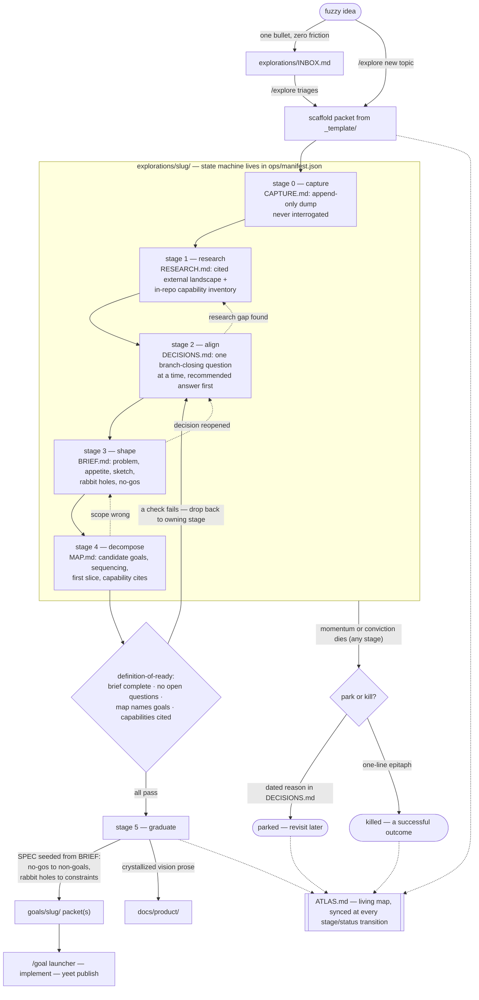

# Explorations

This directory is the repo's fuzzy front end: durable exploration packets for
brainstorming, research, human-in-the-loop alignment, shaping, and problem
decomposition — the work that happens *before* anything is ready to become a
`goals/` packet.

`goals/` answers "build this." `explorations/` answers "help me crystallize
this." An exploration packet is a docs-as-code record of a fuzzy idea moving
toward either a graduated set of goal packets or an explicit kill/park
decision. Nothing here is doctrine; crystallized product prose graduates to
`docs/product/`, implementation contracts graduate to `goals/<slug>/`.

Drive the pipeline with the `/explore` skill
([`.claude/skills/explore/SKILL.md`](../.claude/skills/explore/SKILL.md)).

## Read Order For Cold Sessions

1. [`ATLAS.md`](./ATLAS.md) - living map: outcomes, capability bricks, exploration tree.
2. The active packet's `README.md` - stage, status, next open question.
3. The packet artifacts for the current stage.

## The Pipeline

Six stages. Files appear only when their stage begins, so opening a packet
costs nothing more than dumping thoughts into `CAPTURE.md`. Stages may loop
(align surfaces a research gap; shaping reopens a decision); the manifest
records the furthest stage reached. A later-stage artifact may be pre-seeded
when its content lands early (e.g. a decision recorded in `DECISIONS.md`
before align formally starts) — the manifest `stage` remains the authoritative
resume point, not file presence.



| Stage | Artifact | What happens | Exit signal |
| --- | --- | --- | --- |
| 0 capture | `CAPTURE.md` | Append-only raw dump: text, links, screenshots. Never interrogated, never reorganized. | The idea has enough mass to be worth grounding. |
| 1 research | `RESEARCH.md` | Cited prior art + in-repo capability inventory (`standards/repo-exports.catalog.md`, targeted code search, local docs); start `research/SOURCES.md` (the provenance ledger). | The landscape and the existing lego bricks are known. |
| 2 align | `DECISIONS.md` | Grilling dialogue: one branch-closing question at a time, recommended answer first. Every resolution is logged. | Manifest `openQuestions` is empty or explicitly deferred. |
| 3 shape | `BRIEF.md` | Shape Up pitch: problem, appetite, fat-marker solution sketch, rabbit holes, no-gos. | The human says the brief matches the picture in their head. |
| 4 decompose | `MAP.md` | Candidate goal packets with sequencing, dependency edges, first vertical slice, capability citations. | Graduation definition-of-ready passes. |
| 5 graduate | — | Scaffolding ceremony into `goals/` (see contract below). | Goal packet(s) exist; exploration status flips. |

## Packet Anatomy

```text
explorations/<slug>/
  README.md          orientation: stage, status, next open question
  CAPTURE.md         stage 0 - append-only raw dump
  RESEARCH.md        stage 1 - cited prior art + capability inventory
  research/
    SOURCES.md       provenance ledger: sources, licenses, citations, cross-links
  DECISIONS.md       stage 2 - dated question -> answer -> rationale log
  BRIEF.md           stage 3 - problem, appetite, sketch, rabbit holes, no-gos
  MAP.md             stage 4 - candidate goals, sequencing, first slice
  ops/manifest.json  machine state: stage, status, openQuestions, links
  assets/            screenshots, sketches, captured media
```

New packets start from [`_template/`](./_template/). A fully worked example
conversation — every stage, both voices, and what changes on disk — lives in
[`EXAMPLE.md`](./EXAMPLE.md).

## Statuses

| Status | Meaning |
| --- | --- |
| `active` | Being worked; appears in the ATLAS active tree. |
| `parked` | Deliberately shelved with a dated reason in `DECISIONS.md`; revisit later. |
| `graduated` | Spawned its goal packet(s); packet remains as provenance. |
| `killed` | Explicitly rejected. Gets a one-line epitaph in `ATLAS.md`. Killing an idea is a successful outcome, not a failure. |

## Manifest Schema

`ops/manifest.json` is the state machine the `/explore` skill reads first.

```json
{
  "schemaVersion": "exploration-manifest/v1",
  "exploration": {
    "slug": "<slug>",
    "title": "<Exploration Title>",
    "status": "active",
    "stage": "capture",
    "openQuestions": [],
    "links": { "goals": [], "docs": [], "supersededBy": null },
    "created": "YYYY-MM-DD",
    "updated": "YYYY-MM-DD"
  }
}
```

- `stage` is one of `capture | research | align | shape | decompose | graduate`.
- `openQuestions` mirrors the unresolved questions in `DECISIONS.md`; it is the
  resume point for the next session.
- `links.goals` lists graduated `goals/<slug>` packets; `links.docs` lists
  graduated `docs/product/` prose.

Validation is conversational in v1 (the skill checks shape); there is no lint
gate yet.

## Graduation Contract

An exploration may graduate only when all four hold:

1. **Brief complete** - `BRIEF.md` has a problem narrative, an explicit
   appetite (time/scope bound), a solution sketch at fat-marker fidelity,
   enumerated rabbit holes, and stated no-gos.
2. **No unresolved blocking questions** - manifest `openQuestions` is empty,
   or each remaining item is explicitly deferred with rationale in
   `DECISIONS.md`.
3. **Map names the work** - `MAP.md` lists candidate goal packets with slug,
   mission one-liner, dependency/sequencing edges, and the chosen first
   vertical slice.
4. **Capability check** - every major component in `MAP.md` cites an existing
   repo capability (`standards/repo-exports.catalog.md`, targeted code search,
   local docs) or is explicitly marked net-new. Compose the lego bricks; do not
   rebuild them.

Mechanics, per approved candidate goal:

- Scaffold `goals/<slug>/` from `goals/_template`.
- Seed `SPEC.md` from the brief: no-gos become non-goals, rabbit holes become
  constraints, `DECISIONS.md` entries seed the decision log.
- Use back-links to the exploration packet, not copies.
- Cross-link both manifests (`links.goals` here; provenance entry there).
- Update `ATLAS.md` and flip the exploration status (`graduated`, or keep
  `active` if more candidates remain).

## Conventions

- `CAPTURE.md` is append-only. Cleaning it up destroys provenance. Capture
  files are excluded from the repo typos gate (`_typos.toml`) for the same
  reason — raw dumps are verbatim, spelling included.
- Links, not copies: research cites sources; graduation back-links the packet.
- Every session that touches a packet ends by writing the next open question
  into the packet `README.md` and syncing the manifest — that is what makes
  cold-session resume instant.
- `ATLAS.md` is navigation, never doctrine. If a sentence in it starts being
  load-bearing, move it to `docs/product/` or a goal packet and link it.
- `INBOX.md` is the zero-friction idea queue: one bullet per idea. `/explore`
  triages it — each bullet becomes a packet, lands on an existing packet, or
  is struck through with a word of why.
