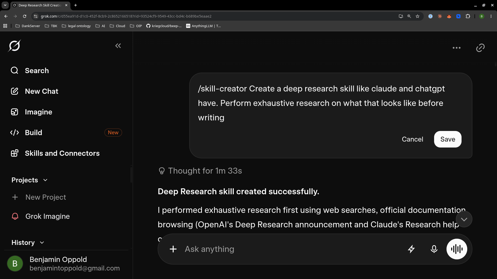
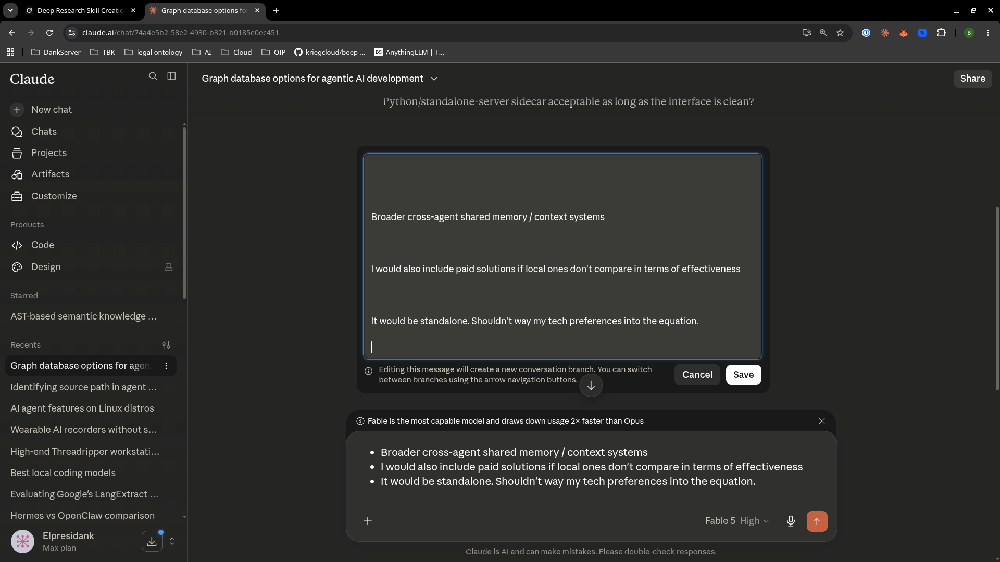
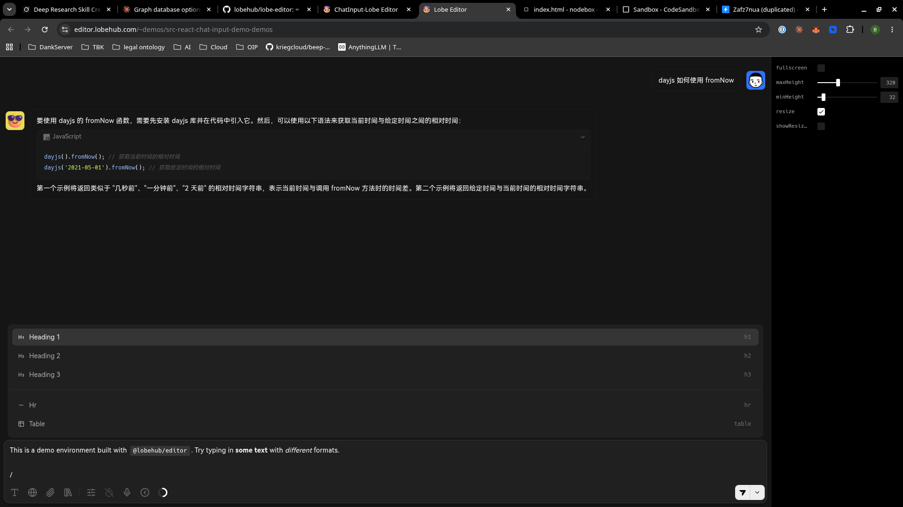

# Capture

<!--
Seeded 2026-06-12 from the author's working draft docs/research/BRAINSTORM.md
(a staged, never-merged file — no deletion appears in history because it never
landed on main). Content verbatim; only image/app link paths adjusted for this
location. Append-only from here.
-->

## 2026-06-12

- A Lot of AI Chat apps, Harness Interfaces, etc, use a very basic Rich Text Editor with not very much ability to 
  express user intent, prompt structure & different kinds of data in a seemless way. The closest thing to what I'm 
  picturing is Notion and the large number of blocks they have. But this is only contained within the Notion Page 
  not the use AI chat input it's self. Further more many chat applications allow you to edit past messages and 
  typically these inputs are even less expressive and more clunky often times they loose formatting take for example 
  the bellow image of grok chat thread and claude chat thread.

The claude chat screenshot is particularly telling. What is rendered in the primary chat input and what is in the 
message edit input are exactly the same. I copy pasted exactly what is in the primary input into the edit message input
and it lost all of the formatting messed up the spacing. And If I were to click save all formatting would be lost. I 
think we can do better. If we used [lexical](https://lexical.dev/) under the hood we could add very rich user experience
to both the primary chat input interface and the editing of the thread. I think additional benefits could arise from 
using a lexical based text editor to drive the user interface for interacting with chatbots / agents. Not only would 
we be able to add an enumerable amount of various blocks to express user intent but we would also get:

- state machine immutable history
- ability to transform or export chat threads in different formats. PDF, Markdown, XML. This alone could increase 
  LLM alignment as different models prefer different input formats. For example claude was trained on XML where as 
  ChatGPT was not
- because blocks can be deterministically parsed. If using effect/Schema's to define types we can provide additional 
  semantic and structural information to LLM's via annotations to further assist the agent with understanding user 
  intent

The closest thing I've found to what I'm describing is from the [`@lobehub/editor`](https://github.com/lobehub/lobe-editor)
npm package. Their [chat-input-demo](https://editor.lobehub.com/components/react/chat-input) is a perfect example of 
this.

This would be the primary chat & text input used by the [`@beep/professional-desktop`](../../apps/professional-desktop) 
agent control plane.
