# MAP — atlas-synthesis (decompose stage)

_Date: 2026-06-17 · Packet: `atlas-synthesis` · Stage: **decompose** · Authority
cited: `goals/agentic-professional-runtime/SPEC.md` +
`goals/agentic-professional-runtime/docs/data-model-law-practice.md`._

> **What this file is.** The canonical decomposition of the rung-0 **office-action
> review loop** into goal packets. Every major component below cites an existing
> `@beep/*` capability (a HAVE brick) **or** is explicitly tagged `NET-NEW` with a
> justification for why it is not an existing brick. Per the locked decisions this
> resolves to **two slice-owned goal packets** — no new `knowledge-law/*`
> packages. This is upstream of implementation: it is a decomposition, not a spec.
> The per-packet `PLAN.md`/`SPEC.md` are authored at graduation.

The loop, walked once, embarrassingly shallow:

```
fixture office-action doc
  → @beep/langextract span-grounded extraction
  → @beep/nlp Handoff IR
  → (NET-NEW) IR → law-entity mapping
  → CandidateClaim + Evidence(char-span)
  → SHACL gate + ClaimLifecycle
  → in-memory projection (pure function, rebuilt from authority)
  → trivial ask / view
```

---

## 0. Candidate goal packets (the table)

| slug | mission (one line) | slice | depends-on | key capabilities cited (REAL `@beep/*`) or NET-NEW |
|---|---|---|---|---|
| **`epistemic-claim-lifecycle-gate`** | Make the epistemic boundary reusable: full `ClaimLifecycle` state machine, the SHACL-gate mechanism, projection-as-pure-function, and the ported `EvidenceSpan` char-offset primitive — all owned by the epistemic slice, product-agnostic. | `epistemic` (`@beep/epistemic-domain` + `epistemic-use-cases`†) | **HAVE:** `@beep/semantic-web/services/shacl-validation` (`ShaclValidationService`), `@beep/semantic-web/services/provenance` (PROV-O), `@beep/semantic-web/evidence` (`EvidenceAnchor`/`TextPositionSelector`), `@beep/epistemic-domain` (`CandidateClaim`, `Evidence`, `Activity`, `ClaimLifecycle`). | **NET-NEW:** (1) `ClaimLifecycle` extended `candidate → shape_valid → consistency_checked → admitted` (today `LiteralKit(["candidate"])`); (2) `EvidenceSpan` char-offset fields on `Evidence` (today two opaque string refs); (3) `ClaimGate` service contract wrapping the bounded SHACL adapter; (4) `ClaimProjection` pure-function (in-memory, rebuilt from authority); (5) the lifecycle transition function. |
| **`law-practice-office-action-spike`** | Add the IP-law vertical (OfficeAction / Claim / Rejection §101-§103-§112 / PriorArt / Distinction) as bespoke Effect-Schema, the IR→law-entity mapping, and wire the end-to-end loop on one fixture OA with a trivial view. | `law-practice` (`@beep/law-practice-domain` + `law-practice-use-cases`† + `law-practice-server`†) | **`epistemic-claim-lifecycle-gate`** (composed only via its public surface); **HAVE:** `@beep/langextract` (`Extraction`/`Alignment`/`Handoff`/`Service`/`Target`), `@beep/nlp/Handoff/Contract` (IR), `@beep/file-processing`, `@beep/tika`, `@beep/law-practice-domain` (`Matter`, `PatentAsset`, `LegalClient`), `@beep/rdf/Vocab/{Prov,Skos}` (light `@source`). | **NET-NEW:** (1) bespoke `OfficeAction`/`Claim`/`Rejection`/`PriorArtReference`/`Distinction` schemas; (2) the **IR→law-entity mapping** (generic `Entity`/`Relation`/`Span` → typed law entities); (3) the loop-wiring use-case; (4) one fixture OA (synthetic/public PDF) + a trivial ask/view. |

† `epistemic-use-cases`, `law-practice-use-cases`, `law-practice-server` are
**new tiers within existing slices** (minimum-viable slice = domain + use-cases +
server per `standards/ARCHITECTURE.md`), **not new slices and not new
`knowledge-law/*` packages**. They follow the established slice-tier naming the
`architecture-lab` reference slice already demonstrates.

---

## 1. Packet A — `epistemic-claim-lifecycle-gate` (the reusable boundary)

**Slice ownership:** epistemic owns lifecycle + gate-mechanism + projection +
the evidence primitive. It has **zero** IP-law vocabulary. This is the
parallelizable, reusable half.

### 1.1 Target surfaces (exact packages / role-files)

| Surface | Path | Role | HAVE / NET-NEW |
|---|---|---|---|
| `ClaimLifecycle` value | `packages/epistemic/domain/src/values/ClaimLifecycle/ClaimLifecycle.model.ts` | `.model.ts` — extend the literal union | **EDIT** (HAVE file, NET-NEW states) |
| `Evidence` entity | `packages/epistemic/domain/src/entities/Evidence/Evidence.model.ts` | `.model.ts` — add char-offset span fields | **EDIT** (HAVE file, NET-NEW fields) |
| `CandidateClaim` entity | `packages/epistemic/domain/src/entities/CandidateClaim/CandidateClaim.model.ts` | `.model.ts` — already carries `lifecycle` | **HAVE** (consumes extended lifecycle) |
| `ClaimGate` contract | `packages/epistemic/use-cases/src/ClaimGate/ClaimGate.service.ts` (NEW tier) | `.service.ts` — port over the SHACL adapter | **NET-NEW** |
| `ClaimLifecycle` transition fn | `packages/epistemic/use-cases/src/ClaimLifecycle/ClaimLifecycle.service.ts` | `.service.ts` — the state machine | **NET-NEW** |
| `ClaimProjection` | `packages/epistemic/use-cases/src/ClaimProjection/ClaimProjection.ts` | pure fn (post-contract helper) | **NET-NEW** |
| SHACL gate mechanism | `@beep/semantic-web/services/shacl-validation` (`ShaclValidationService`, `ShaclValidationResult`, `ShaclValidationViolation`) | bounded SHACL engine (targetClass/minCount/maxCount/datatype) | **HAVE** |
| Provenance | `@beep/semantic-web/services/provenance` + `@beep/rdf/Vocab/Prov` | PROV-O `Activity`/`Agent`/`Derivation` | **HAVE** |
| Evidence anchor reference | `@beep/semantic-web/evidence` (`EvidenceAnchor`, `TextPositionSelector`, `TextQuoteSelector`) | W3C-annotation-style selector vocabulary to mirror | **HAVE** |

### 1.2 Phase shape (BINDING sequencing: schema → contract → impl → verify)

- **P0 — schema.** Extend `ClaimLifecycle` to the 4-state union
  `candidate → shape_valid → consistency_checked → admitted`. Add char-offset
  fields to `Evidence` (`startChar`/`endChar`/`quote`/`confidence`) — the ported
  v3 `EvidenceSpan` primitive. Define `ClaimGateResult` (admitted | rejected +
  violations) and `ClaimProjectionView` schemas. No service code yet.
- **P1 — service contract.** Define `ClaimGate` as an Effect `Context.Service`
  whose port consumes `ShaclValidationService` and emits a `ClaimGateResult`;
  define `ClaimLifecycle` transition service (`advance(claim, gateResult)`); define
  `ClaimProjection` signature `(authority: ReadonlyArray<CandidateClaim>) => ClaimProjectionView`.
  Ports first; **no helpers extracted yet** (forbidden anti-pattern).
- **P2 — implementation.** Implement the gate over the bounded SHACL adapter,
  the transition function (candidate→shape_valid on gate pass; rejected on
  violation), the pure projection (in-memory fold over authority). Helpers
  extracted **after** P0/P1 are fixed.
- **P3 — verify.** Acceptance proof (§1.4). Gate P_{n+1} on P_n in `SPEC.md`.

### 1.3 NET-NEW components — each justified (challenged against existing bricks)

1. **`ClaimLifecycle` 4-state machine.** *Why not a brick:* the existing
   `ClaimLifecycle` is literally `LiteralKit(["candidate"])` — candidate-only
   (verified in `ClaimLifecycle.model.ts:25`). The states
   `shape_valid → consistency_checked → admitted` and the transition guards do
   **not** exist. This is the under-modeled hop `30 §A-NW-1` flagged. NET-NEW.
2. **`EvidenceSpan` char-offset on `Evidence`.** *Why not a brick:* today
   `Evidence` is two opaque string refs (`artifactFixtureKey`, `spanFixtureKey` —
   verified `Evidence.model.ts:31-42`); it carries **no character offsets**. v3's
   `domain/src/values/EvidenceSpan.value.ts` (`{text,startChar,endChar,confidence}`,
   confirmed in `43`) is the donor pattern to port. *Challenge resolved:*
   `@beep/semantic-web/evidence`'s `TextPositionSelector` already models
   start/end offsets — but it is an RDF-annotation selector in the semantic-web
   capability, **not** the epistemic A-Box `Evidence` field set. The port adds the
   offsets to the epistemic entity (reusing the selector vocabulary as the shape
   reference, not re-deriving it). NET-NEW (entity fields), HAVE (selector shape).
3. **`ClaimGate` service contract.** *Why not a brick:* `ShaclValidationService`
   is the **mechanism** (a generic SHACL engine) and is HAVE; the
   *claim-shape-gating contract* that maps a `CandidateClaim` + its `Evidence`
   into a SHACL dataset, runs the engine, and returns a typed
   admitted/rejected verdict does not exist. This is composition over the HAVE
   engine, not a re-implementation. NET-NEW (thin wrapper).
4. **`ClaimProjection` pure function.** *Why not a brick:* the projection-as-pure-
   function (in-memory view rebuilt from authority, per FEDERATION INVARIANT) has
   no current implementation; the closest is `@beep/semantic-web`'s
   `BoundedEvidenceProjection`, which projects *evidence anchors to RDF*, a
   different object. The federation invariant (authority single-owner; any
   cross-matter view is a permissioned projection, never a central write) is baked
   in here as a **type-level** property: the projection signature takes a local
   authority array and returns a view; it cannot write. NET-NEW.

### 1.4 Acceptance proof (P3)

A unit-level proof inside the epistemic slice (no IP-law data):
- Given a synthetic `CandidateClaim` + a well-formed `Evidence(char-span)`, the
  `ClaimGate` returns **admitted** and the lifecycle advances
  `candidate → shape_valid`.
- Given a claim that violates the SHACL shape (e.g. missing required evidence
  field), the gate returns **rejected** with a `ShaclValidationViolation`, and the
  lifecycle does **not** advance.
- `ClaimProjection(authority[])` returns a deterministic view; rebuilding it from
  the same authority is referentially equal (pure-function proof).
- Bun test green; `bun run check --filter @beep/epistemic-domain` (and the new
  use-cases tier) passes with no new failures.

---

## 2. Packet B — `law-practice-office-action-spike` (the IP-law vertical + loop)

**Slice ownership:** law-practice owns the IP-law product language + the IR→law
mapping + the loop wiring + the trivial view. It **composes** epistemic only via
its public surface (no slice-to-slice internal imports per
`standards/ARCHITECTURE.md`).

### 2.1 Target surfaces

| Surface | Path | Role | HAVE / NET-NEW |
|---|---|---|---|
| `OfficeAction` | `packages/law-practice/domain/src/entities/OfficeAction/OfficeAction.model.ts` | `.model.ts` | **NET-NEW** |
| `Claim` (independent/dependent) | `.../entities/Claim/Claim.model.ts` + `Claim.values.ts` | `.model.ts` | **NET-NEW** |
| `Rejection` (tagged union §101/§102/§103/§112) | `.../entities/Rejection/Rejection.model.ts` + `Rejection.values.ts` | `.model.ts` | **NET-NEW** |
| `PriorArtReference` | `.../entities/PriorArtReference/PriorArtReference.model.ts` | `.model.ts` | **NET-NEW** |
| `Distinction` (work product, tagged union) | `.../entities/Distinction/Distinction.model.ts` | `.model.ts` | **NET-NEW** |
| `Matter`/`PatentAsset` (link target) | `packages/law-practice/domain/src/entities/{Matter,PatentAsset}` | existing entities | **HAVE** |
| IR→law mapping | `packages/law-practice/use-cases/src/IrToLaw/IrToLaw.service.ts` (NEW tier) | `.service.ts` | **NET-NEW** |
| Loop wiring | `packages/law-practice/use-cases/src/OfficeActionReview/OfficeActionReview.service.ts` | `.service.ts` | **NET-NEW** |
| Fixture ingestion | `@beep/file-processing` + `@beep/tika` → `@beep/langextract` (`Extraction`/`Alignment`/`Service`/`Target`) | HAVE bricks composed | **HAVE** |
| IR contract | `@beep/nlp/Handoff/Contract` (`TextChunk`/`Mention`/`Entity`/`Relation`/`Span`/`Provenance`) | HAVE IR | **HAVE** |
| IR adapter | `@beep/langextract/Handoff` (`AnnotatedDocumentInput`) | langextract→nlp bridge | **HAVE** |
| Epistemic gate/lifecycle | `@beep/epistemic-use-cases` public surface (`ClaimGate`, `ClaimLifecycle`, `ClaimProjection`) | composed | **HAVE (Packet A)** |
| `@source` JSDoc hints | `@beep/rdf/Vocab/{Prov,Skos}`; CPC/IPC, PROV-O, SKOS as design-time annotations | light grounding | **HAVE (annotation only)** |
| Server / trivial view | `packages/law-practice/server/src/...` + a trivial ask/view | wiring + view | **NET-NEW (thin)** |

### 2.2 Phase shape

- **P0 — schema.** Bespoke Effect-Schema for `OfficeAction`, `Claim`,
  `Rejection` (tagged union on `statute`; §102 = exactly 1 ref, §103 = ≥1 combo +
  `combinationRationale`, §101/§112 = 0 refs; see `50` §6/§7), `PriorArtReference`,
  `Distinction` (tagged union on `kind`; `lifecycleState` typed from epistemic's
  public `ClaimLifecycle`). Light `@source` JSDoc only (CPC/IPC, PROV-O, SKOS) —
  the 7-source ontology grounding is DEFERRED (`51` confirms all 7 defer). Cite
  `goals/agentic-professional-runtime/docs/data-model-law-practice.md` (already
  has `OfficeAction`) as authority; reconcile field names against it.
- **P1 — service contract.** `IrToLaw` port: `(HandoffIR) => Effect<LawEntities>`;
  `OfficeActionReview` port: the loop orchestrator
  `(fixtureDocRef) => Effect<ClaimProjectionView>`, declaring deps on
  `@beep/file-processing`, `@beep/langextract`, `IrToLaw`, and the epistemic
  `ClaimGate`/`ClaimLifecycle`/`ClaimProjection`. Ports first; no loose helpers.
- **P2 — implementation.** Implement `IrToLaw` (map generic `Entity.type`/
  `Relation.type` discriminants → typed `OfficeAction`/`Claim`/`Rejection`/
  `Distinction`, carrying `Span` → `Evidence(char-span)`); implement the loop
  orchestrator composing the HAVE ingestion bricks + epistemic gate; produce a
  `Distinction` candidate, gate it, project it, answer the trivial ask.
- **P3 — verify.** The first-vertical-slice proof (§4).

### 2.3 NET-NEW components — each justified

1. **Bespoke `OfficeAction`/`Claim`/`Rejection`/`PriorArtReference`/`Distinction`
   schemas.** *Why not a brick:* `51` confirms with primary sources that **no
   published ontology** models patent-claim/office-action/statutory-rejection
   semantics, and none of the 7 `ip-law-knowledge-graph` sources cover it. The
   existing `law-practice-domain` entities are `Matter`/`PatentAsset`/`LegalClient`/
   `LegalContact` — none is an OA/Claim/Rejection. Bespoke Effect-Schema is the
   only option (it is the TBox). NET-NEW.
2. **IR→law-entity mapping.** *Why not a brick:* `@beep/nlp/Handoff/Contract` emits
   a **generic** IR (`Entity.type`/`Relation.type` are open discriminants with
   "NO product vocabulary" per the contract header). The mapping that turns
   generic mentions/entities into typed *law* entities is the
   "hardest, most semantic, least-typed" hop (`43 §4.1`, `30 §A-NW-1`) and is
   flat NOT FOUND in either repo (v3 mapped generic→email, never IP-law). NET-NEW.
3. **Loop wiring + trivial ask/view.** *Why not a brick:* the bricks
   (file-processing, tika, langextract, the epistemic gate) exist, but **the
   composition that walks the OA loop end-to-end does not** (no law-practice
   server/use-cases tier exists today — `16` confirms domain-only). NET-NEW
   (thin composition + a deliberately trivial query; a real GraphRAG ask is
   DEFERRED).
4. **One fixture OA.** *Why not a brick:* per `51` §1.2 the fixture must be a
   synthetic/public OA PDF/DOCX (privilege wall — no real client matter in repo),
   run through tika; the USPTO OA Rejection API is a schema `@source` donor, **not**
   a fixture source. NET-NEW (one asset under the spike's `fixtures/`).

### 2.4 Acceptance proof (P3)

See §4 (this packet's acceptance proof **is** the first-vertical-slice proof).

---

## 3. Sequencing — A first, then B (and why)

**`epistemic-claim-lifecycle-gate` graduates and builds FIRST; then
`law-practice-office-action-spike` composes it.**

1. **Dependency direction is one-way.** Packet B imports Packet A's *public
   surface* (`ClaimGate`/`ClaimLifecycle`/`ClaimProjection`,
   `Evidence(char-span)`). Packet A imports nothing from B (it has zero IP-law
   vocabulary). The `Distinction.lifecycleState` field in B is typed *from* A's
   `ClaimLifecycle`. You cannot wire the loop's gate before the gate exists.
2. **A is the reusable boundary; B is one consumer.** A is the durable IP — the
   epistemic discipline that every future vertical (not just OA review) reuses. B
   is rung-0's first consumer. Building the boundary first prevents B's product
   pressure from leaking IP-law specifics into the epistemic slice (slice-ownership
   integrity).
3. **A is parallelizable / independently provable.** A's acceptance proof (§1.4)
   needs no IP-law data — it can be built and verified against synthetic claims
   while B's schema design (P0) proceeds in parallel. Only B's **P1+ wiring** hard-
   blocks on A's public surface. So the critical path is: A(P0→P2) ∥ B(P0) → B(P1→P3).
4. **It matches the BINDING design sequencing at the portfolio level.** A delivers
   the shared schema + contract that B's contract phase depends on — the same
   schema→contract→impl ordering, lifted one level up.

---

## 4. THE FIRST VERTICAL SLICE — the single smallest end-to-end proof

**One fixture office action → one `Distinction` candidate, gated, projected,
answered.** The loop turns exactly once on the thinnest viable path:

- **Input:** one synthetic/public OA PDF in the spike's `fixtures/` containing
  **one** §102 rejection of **one** independent claim citing **one** prior-art
  reference (the simplest cardinality — single ref, single claim; see `50` §2.2).
- **Path:** `tika` extracts text → `langextract` aligns one span (the "reject …
  under 35 U.S.C. 102" sentence + the missing-limitation locus) → `@beep/nlp`
  Handoff IR → `IrToLaw` maps to one `OfficeAction` + one `Rejection(§102)` + one
  `Claim` + one `PriorArtReference` → emits one `Distinction(kind="missing_limitation")`
  as a `CandidateClaim` with `Evidence(char-span)` → `ClaimGate` runs the bounded
  SHACL shape → lifecycle `candidate → shape_valid` → `ClaimProjection` builds the
  in-memory view → trivial ask: *"what distinguishes claim 1 over the cited
  reference, and where is the evidence?"* returns the distinction text + its
  char-span.

**How to verify:**
- A single integration test (law-practice/use-cases or law-practice/server) runs
  the fixture through the whole orchestrator and asserts: (a) exactly one
  `Distinction` candidate is produced; (b) its `Evidence` carries non-empty
  `startChar`/`endChar` that re-slice the fixture text to the expected quote;
  (c) the gate admits it and lifecycle reaches `shape_valid`; (d) the trivial ask
  returns the distinction + span. Bun test green.
- `bun run check` clean for both new tiers, no new failures (per the
  `@beep/schema` Bun-runtime baseline: gate on *no NEW* failures).
- The proof is deliberately shallow: **one** rejection type (§102), **one** claim,
  **one** ref, **one** distinction kind. Multi-ref §103, §101/§112, the response
  ladder, and a real GraphRAG ask are all out of this first slice.

---

## 5. Inherited risks (from the brief's rabbit holes) as constraints

These carry forward as **binding constraints** on both packets (sourced from the
LOCKED decisions, `DECISIONS.md`, and the `30`/`32`/`43`/`51` assessments —
this packet has no separate `BRIEF.md`; its constraints are the locked brief):

| Risk / rabbit hole | Constraint baked into the MAP |
|---|---|
| **The loop never closes** (`32 §5.3` modal failure; now a *focus/scope* risk per `43 §4.2`) | First vertical slice is one §102 / one claim / one ref / one distinction. **No** engine-perfecting before the loop turns once. Trivial ask, in-memory projection. |
| **Re-building the whole v3 engine** (`43`: builder's demonstrated tendency) | Port **only** the `EvidenceSpan` char-offset primitive. FalkorDB, GraphRAG retrieval/RRF, entity-resolution, runtime reasoner — all DEFERRED. langextract covers extraction. |
| **TBox over-scoping** (`51`: no usable ontology; 7 sources all defer) | Bespoke Effect-Schema in `law-practice/domain`; `@source` JSDoc **light** only (CPC/IPC, PROV-O, SKOS). `goals/ip-law-knowledge-graph` stays PENDING/REFERENCED, never merged. |
| **Privilege wall** (`51` §1.2; `01` C-rules) | Fixture OA must be synthetic/public — never a real client matter in repo. USPTO OA Rejection API is a schema `@source`, **not** a fixture/feed. |
| **Slice leakage** (`standards/ARCHITECTURE.md`) | No slice-to-slice internal imports. law-practice composes epistemic **only** via its public surface. Lifecycle/gate/projection live in epistemic; IP-law language never leaks into it. |
| **Federation / firm-rung optionality** (`DECISIONS.md` ambition-ladder) | `ClaimProjection` is a pure function over a **single-owner local authority**; any cross-matter/firm view is a permissioned projection, never a central write. `OfficeAction.matterId` (matter wall) modeled now; enforcement deferrable. |
| **Provenance is a wedge, not a moat** (`32 §2`) | Don't over-invest in the gate as differentiation. The durable value is the boundary's reusability + the corpus/trust moat — out of rung-0 scope. Keep the gate minimal (bounded SHACL). |
| **`@beep/schema` Bun test baseline** (MEMORY) | Acceptance gates on **no NEW** failures, not full-green, under Bun/vitest. |
| **OA structural distinctions** (`50` §1.3/§7) | Rejection vs Objection kept as distinct entities (appeal vs petition); `Rejection` is a tagged union on `statute` (cardinality differs per §); `citedReferences` optional (§101/§112 cite none). |

---

## 6. The loop — HAVE (built bricks) vs NET-NEW

```mermaid
graph LR
  classDef have fill:#1b4332,stroke:#2d6a4f,color:#d8f3dc;
  classDef netnew fill:#6a040f,stroke:#9d0208,color:#ffccd5;
  classDef epi fill:#03045e,stroke:#0077b6,color:#caf0f8;

  Fixture["fixture OA PDF<br/>(synthetic/public)"]:::netnew
  Tika["@beep/tika<br/>+ @beep/file-processing"]:::have
  LX["@beep/langextract<br/>Extraction · Alignment"]:::have
  IR["@beep/nlp<br/>Handoff/Contract IR"]:::have
  Map["IR → law-entity mapping<br/>(law-practice/use-cases)"]:::netnew
  Law["OfficeAction · Claim · Rejection<br/>PriorArt · Distinction<br/>(law-practice/domain schema)"]:::netnew
  CC["CandidateClaim<br/>(@beep/epistemic-domain)"]:::have
  Ev["Evidence(char-span)<br/>EvidenceSpan offsets"]:::netnew
  Gate["ClaimGate over<br/>ShaclValidationService"]:::epi
  Life["ClaimLifecycle 4-state<br/>candidate→shape_valid→…→admitted"]:::epi
  Proj["ClaimProjection<br/>(pure fn, in-memory)"]:::epi
  Ask["trivial ask / view"]:::netnew

  Fixture --> Tika --> LX --> IR --> Map --> Law --> CC
  Law -.span.-> Ev --> CC
  CC --> Gate --> Life --> Proj --> Ask

  subgraph PacketA["Packet A — epistemic-claim-lifecycle-gate (NET-NEW in epistemic)"]
    Gate
    Life
    Proj
  end
  subgraph PacketB["Packet B — law-practice-office-action-spike"]
    Map
    Law
    Ask
  end
```



Legend: **green** = HAVE (built brick, real `@beep/*` path); **red** = NET-NEW
product/loop component; **blue** = NET-NEW epistemic boundary (Packet A — reusable
mechanism wrapping a HAVE SHACL engine). `Evidence(char-span)` is red because the
char-offset fields are NET-NEW even though the `Evidence` entity file is HAVE.

---

## Confidence & Caveats

**High confidence (verified on disk this session):**
- `ClaimLifecycle` is `LiteralKit(["candidate"])` — candidate-only; the 4-state
  machine is genuinely NET-NEW (`ClaimLifecycle.model.ts:25`).
- `Evidence` carries only `artifactFixtureKey`/`spanFixtureKey` (two string refs);
  char-offsets are NET-NEW (`Evidence.model.ts:31-42`).
- `CandidateClaim` already has a `lifecycle` field consuming `ClaimLifecycle`
  (`CandidateClaim.model.ts:34-44`) — so extending the union flows through.
- HAVE bricks exist at the cited paths: `@beep/semantic-web/services/shacl-validation`
  (`ShaclValidationService`, bounded subset), `@beep/semantic-web/services/provenance`
  (PROV-O), `@beep/semantic-web/evidence` (`EvidenceAnchor`/`TextPositionSelector`),
  `@beep/nlp/Handoff/Contract` (generic IR), `@beep/langextract/Handoff`
  (`AnnotatedDocumentInput`), `@beep/file-processing`, `@beep/tika`,
  `@beep/law-practice-domain` (`Matter`/`PatentAsset`/`LegalClient`/`LegalContact`).
- `law-practice` is domain-only today (no server/use-cases) and has **no**
  OA/Claim/Rejection entities — confirmed (`16`, `ls`).

**Medium confidence (design proposals, not yet code):**
- The exact `.model.ts`/`.service.ts` file paths for the NEW
  `epistemic-use-cases`, `law-practice-use-cases`, `law-practice-server` tiers are
  *proposed* per the role-suffix convention and the `architecture-lab` reference
  slice; the slices' final layout is fixed at graduation (`PLAN.md`).
- The bespoke law-schema field set is seeded from `50` §6 (a *proposed
  vocabulary*, not a frozen schema); it must be reconciled against
  `goals/agentic-professional-runtime/docs/data-model-law-practice.md` (which
  already has an `OfficeAction`) during Packet B's P0.
- `ClaimGate` wrapping the bounded SHACL adapter assumes the
  `CandidateClaim`+`Evidence` → SHACL-dataset shaping is expressible within the
  bounded subset (targetClass/minCount/maxCount/datatype). If the claim shape
  needs richer SHACL than the bounded engine supports, P1 must either widen the
  shape to the bounded subset or note the engine as a follow-on — flagged, not
  assumed away.

**Deferred (per LOCKED, restated as non-goals here):** FalkorDB projection store,
the v3 GraphRAG/extraction-pipeline port (only `EvidenceSpan` ported), a real
GraphRAG ask, the 7-source IP-law ontology grounding, the full §132 response
ladder, multi-ref §103 / §101 / §112 in the first slice, matter-wall
*enforcement* (model now, enforce later).

**Not independently verifiable here:** the precise fixture OA (none inspected —
to be authored in Packet B); the exact USPTO OA Rejection API field names
(high-confidence from `51`'s search, not byte-confirmed); whether the bounded
SHACL subset fully expresses the claim shape (to be proven in Packet A P1/P2).

---

### Verification (2026-06-17)

Skeptical on-disk audit of every MAP citation against
`/home/elpresidank/YeeBois/projects/beep-effect3/packages`. **Verdict: PASS — no
corrections required.**

- **All HAVE bricks resolve to real source files** (packages use a grouped
  layout — `@beep/*` aliases, not flat dirs): `@beep/semantic-web` =
  `foundation/capability/semantic-web` (`src/services/shacl-validation.ts`,
  `src/services/provenance.ts`, `src/evidence.ts`; the `"./*": "./src/*.ts"`
  export map makes the cited subpaths resolve); `@beep/nlp` =
  `foundation/capability/nlp/src/Handoff/Contract.ts` (the "NO product
  vocabulary" generic-IR header and `TextChunk`/`Mention`/`Entity`/`Relation`/
  `Span`/`Provenance` types all present); `@beep/langextract` =
  `foundation/capability/langextract` (`src/Handoff/index.ts`,
  `AnnotatedDocumentInput`); `@beep/tika`/`@beep/file-processing` =
  `drivers/tika` (+ `foundation/capability/file-processing`); `@beep/rdf` Vocab =
  `foundation/modeling/rdf/src/Vocab/{Prov,Skos}.ts`; `@beep/epistemic-domain` =
  `epistemic/domain` (`CandidateClaim`, `Evidence`, `ClaimLifecycle` all present).
- **Line-pinned NET-NEW claims are accurate:** `ClaimLifecycle` is
  `LiteralKit(["candidate"])` (model line 25 — candidate-only); `Evidence`
  carries only `artifactFixtureKey`/`spanFixtureKey` string refs (lines 32-33, no
  char offsets); `CandidateClaim` consumes `lifecycle: ClaimLifecycle` (line 36).
- **`law-practice` is domain-only** with entities `Matter`/`PatentAsset`/
  `LegalClient`/`LegalContact` — no `OfficeAction`/`Claim`/`Rejection` and no
  `use-cases`/`server` tier (NET-NEW correctly tagged). `architecture-lab`
  demonstrates the `domain`/`use-cases`/`server` tier naming the new tiers borrow.
- **Doctrine checks all hold:** epistemic owns lifecycle/gate/projection +
  `EvidenceSpan` (Packet A); law-practice owns IP-law language + IR→law mapping +
  loop (Packet B); **no `knowledge-law/*` package** is cited as HAVE (the slug
  appears only as a negative); `goals/ip-law-knowledge-graph` exists as a
  referenced-not-merged PENDING packet. The schema→contract→impl→verify (P0→P3)
  ordering is present in both §1.2 and §2.2. Cross-links are reference, not merge
  (one-way A←B dependency via public surface; `ip-law-knowledge-graph` stays
  REFERENCED). The `epistemic-use-cases` tier is consistently flagged `†`/NET-NEW
  at component level and only "HAVE (Packet A)" from Packet B's downstream view
  (consistent with the §3 sequencing). No falsely-HAVE-tagged NET-NEW paths found.
