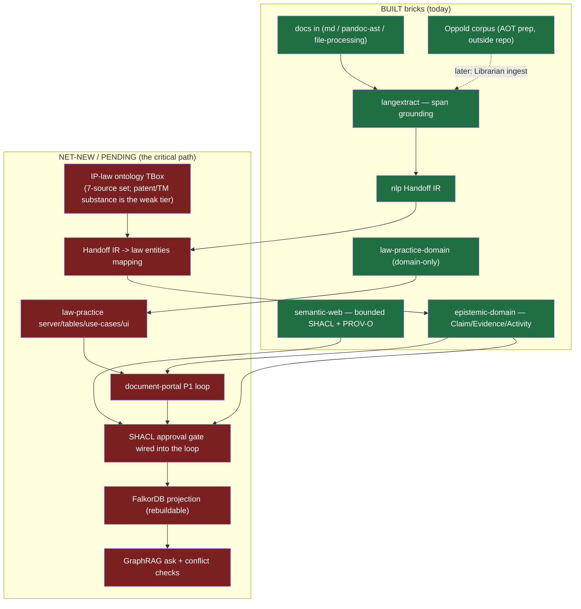

# 00 — Baseline Gap Map (Synthesis of Syntheses)

_Date: 2026-06-17 · Packet: `baseline-synthesis` · Read this first._

This is the centerpiece of the `baseline-synthesis` packet: a single map that
fuses the 14 companion synthesis artifacts (01–04, 10–16, 20–22, 90) into one
honest picture of **where the work is, where it's going, and what stands
between**. Every companion was read in full; this document does not re-prove
their citations — it integrates them and surfaces the cross-document tensions.
Each section names its source artifacts so you can drill down. (Two companions —
`05-user-profile-working-style.md` and `23-external-codebase-lineage.md` — were
added after this synthesis was generated; both appear in the reading guide (§6)
and complement, not contradict, the picture below — `23` in particular evidences
the local near-complete TrustGraph Effect-native port behind BeepGraph's "shell.")

---

## 1. Orientation — the blur we kill

There are **two different things** in this repository, and almost every prior
confusion comes from conflating them.

**The learning substrate (the vehicle — retired).** The software /
repo-intelligence / code-AST / "repo-memory v0" / "L3 deterministic code
intelligence" body of work was a **learning vehicle**. The builder grounded
himself in a domain he already knew — software, the `beep-effect` codebase — to
learn ontology, graph, and memory architecture, betting those lessons would
generalize to law and wealth management. The git record corroborates a
deliberate, dated retirement (`90-archaeology`):

| Date | Commit | Event |
|---|---|---|
| 2026-03-08 | `309649ebcc` | Bulk delete of the repo-intelligence **spec corpus** (`specs/**`: AST+JSDoc KG, effect-v4 KG, codegraph-canonical/jsdoc, AST visualizer). |
| 2026-04-07 | `78f5d3fb0e` | Delete the **repo-memory v0 hosts**: `apps/clawhole` (incl. `src/domain/Memory.ts`), `packages/ai/**` (204 paths). |
| 2026-04-15 | `3129cb6029` | `standards/memory-architecture/` doctrine lands — **after** the prunes. |
| 2026-04-27 | `6c8bab5b25` | Delete `RepoMemoryDesktop.tsx` (last UI residue). |

The signature is textbook: speculative build artifacts deleted first, then the
**lessons crystallized into binding standards** weeks later. The doctrine did
not spawn the code; it post-dates and supersedes it.

> **Two honesty corrections the companions force me to carry forward** (not
> softenings of the guardrail, but precision):
> 1. The standards (`standards/memory-architecture/`) are still written in the
>    present tense and call L3 "deterministic code intelligence" **"the project's
>    competitive edge / the diamond"** (`01-memory-layer-taxonomy.md:72`,
>    `README.md` Imperative #1). Per the guardrail this is **stale** — do not read
>    it as a present product moat. The standard likely needs a dated amendment
>    (open question in §5).
> 2. A live ~1,630-line `packages/tooling/library/repo-utils/src/EffectCapabilityKG.ts`
>    **still exists in the working tree** (verified, `01`/`90`). "Pruned" is true
>    of the *product ambition* and the apps/specs; it is **not** literally true of
>    that single file. The operative point is unchanged: it is **monorepo-quality
>    tooling, not product capability and not the moat.** `BEEPGRAPH_ARCHITECTURE.md §8`
>    still maps it as the "L3 competitive edge" row; that row is stale.

**The product (the destination — active).** The PRODUCT is a **local-first,
provenance-grounded knowledge workbench for a solo IP-law practice** — the firm
the builder's father, **Tom Oppold** (25-year IP practitioner), is opening. This
is the **sole active vertical** (`ATLAS.md` Outcomes line 22). Wealth management
is **dormant** — only doc stubs exist
(`goals/agentic-professional-runtime/docs/data-model-wealth-management.md`), no
slice behind it (`01`, `04`).

The memory-architecture framework the vehicle yielded — the **No-Escape Theorem**
and the **4-layer taxonomy** — is now **learned theory applied to law**, not
shipping code (`03`, `22`). The Oppold corpus and its Corpus CLI are **ahead-of-
time data prep**, not a live runtime feeder (`13`).

**The one sentence to remember:** _code intelligence was how the builder learned;
the IP-law flywheel is what the builder is building._

---

## 2. You are here — current state (honest)

Sourced from `10`–`16` (current-state inventories) + `20`–`22` (external). The
key asymmetry: **the substrate is broad and mature; the one product slice is
domain-only.** `architecture-lab` (the most *complete* slice) is a reference
vehicle; `law-practice` (the *product*) is the least complete (`14`, `16`).

### What is SHIPPING (present, wired, runnable)

The chat/runtime stack — itself a **learning-vehicle proving ground** for
Effect/schema-first/streaming/observability, **not** the product (`10`, `15`).

| Capability | Carrier | State |
|---|---|---|
| Local-first desktop chat | `apps/professional-desktop` (Tauri + Bun sidecar + file PGlite), **v0.0.3** | Working runtime (fixture by default; Anthropic kernel gated on key) |
| Conversation domain | `@beep/workspace-domain` (`Thread`/`Turn`/`Message`; branching first-class) | Shipping |
| Turn kernel + structured output | `@beep/agents-{use-cases,server}` (`AgentTurnKernel` port; `AnthropicTurnKernel` forced-tool + scan + validate + repair tail) | Shipping |
| Rich-text trio | `@beep/md` ↔ `@beep/lexical-schema` ↔ `@beep/editor` (mermaid/tables/youtube/`ArtifactRefNode`) | Shipping |
| Persistence + migrations | `@beep/workspace-server` ThreadStore (Drizzle + in-memory) over PGlite | Shipping |
| Observability | env-gated OTLP + Effect DevTools; quality metrics both sides | Shipping (no Grafana dashboard found) |
| Epistemic cost | `@beep/epistemic-domain` `UsageRecord` + sink | **Schema/sink wired but fixture-valued** — `TODO(live sidecar)`; no real tokens/$ recorded |
| Public marketing/intake | `apps/oip-web` (Next.js, HubSpot contact) | Working (firm's public face, not the flywheel) |

### What is ACTIVE / built-but-not-closed

Substrate the IP-law product will compose; built, with goals still open (`11`, `12`).

| Capability | Carrier | State |
|---|---|---|
| NLP core + 42-tool MCP | `@beep/nlp` (Graph IR + Handoff Contract), `@beep/wink`, `@beep/nlp-mcp` | **Built / `nlp-adjunct-port` DONE** (42 tools verified: 25+17) |
| Span-grounded extraction | `@beep/langextract` (~1,131 LOC; exact/fuzzy/lesser aligner, provider-neutral) | **Built; goal `active`, P4 in-progress** (not closed) |
| Pandoc ↔ md interop | `@beep/pandoc-ast` (model/codec/mapping/report, self-reports lossy/unsupported) | **Built; goal `active`, P3 "Close" pending** |
| File-processing contract + IR | `@beep/file-processing` + `@beep/tika`/`@beep/libpff` (scaffold + real subprocess engines) | **Built (contract-only by design, 4 importers); goal manifest label "pending" is STALE vs disk** |
| Semantic-web / RDF substrate | `@beep/semantic-web` (JSON-LD/SHACL-subset/SPARQL/PROV), `@beep/rdf` (vocab) | **Built, mature** (SHACL is a "bounded subset", not full engine) |
| Memory theory as schema | `@beep/epistemic-domain` (`CandidateClaim`/`Evidence`/`Activity`/`UsageRecord`) | **Built (domain schema only)**; `ClaimLifecycle` is candidate-only literal |
| Corpus data prep | Corpus CLI → `/home/elpresidank/data-home/oppold-corpus/` (8,438 files / ~31.7 GB curated) | **Completed-retained batch; outside repo; not a live feeder** |

### What is PENDING / SPECCED (intent, not built)

The product-defining middle — none of this is code (`12`, `04`, `20`, `21`).

| Capability | Status | Evidence |
|---|---|---|
| `law-practice` server/tables/use-cases/client/ui tiers | **NOT BUILT** — slice is **domain-only** (`LegalClient`/`LegalContact`/`Matter`/`PatentAsset`) | `16` |
| IP-law ontology TBox (the 7-source set + layered stack) | **SPECCED / PENDING (P0)** — no `tbox` code; ontologies are P0 survey targets | `12`, `20` |
| IP-law KG + FalkorDB/Cypher projection | **SPECCED ONLY** — `ip-law-knowledge-graph` goal `PENDING` (all phases); only FalkorDB touchpoint is the unrelated Graphiti memory proxy | `12`, `21` |
| Text → KG end-to-end projection (Handoff IR → law entities) | **NOT FOUND** — IR exists, no consumer maps it | `12` |
| "BeepGraph" as an assembled package | **DOCTRINE / NOT a package** — zero hits in the catalog; docs-only | `03` |
| Document portal slice (P1 MVP loop) | **SPECCED** — the integration of the Have primitives into one loop is unproven | `01` |
| OWL reasoner / AI librarian / sync engine / on-device embeddings | **BUILD (net-new)** | `01` |

---

## 3. Where we're going — the vision

Sourced from `01` (vision) + `ATLAS.md` + `02` (doctrine).

**North star: _Prose in, proof out._** "Obsidian for lawyers — but it proves its
sources." A solo IP attorney's entire practice flows through **one local
machine** that *reads* prose, *proposes* structured claims, *proves* them against
a formal legal ontology, and admits only what survives into **one knowledge graph
where every fact links back to the exact words that justify it**.

**The thesis (the invariant that must never blur):** *retrieval proposes,
fallibly; logic proves, soundly.* Between them sits **the boundary** — a proposal
crosses into the graph only after a **SHACL gate** validates its shape, a
**consistency check** proves no contradiction, and it is **materialized with a
permanent link to its source span**. The deepest test: *does anything compute an
entailment?* Left of the boundary, no; right of it, yes.

**The architecture name — BeepGraph (Proposed, 2026-06-15):** *effect-ontology is
the spine; TrustGraph is the shell.*

| Tier | Role | Carrier |
|---|---|---|
| **Authority (spine)** | Typed claims + evidence + provenance + lifecycle — the **only** source of truth | `@beep/epistemic-domain`, `@beep/semantic-web` (PROV-O + bounded SHACL), `@beep/rdf` |
| **Projection (shell)** | Rebuildable views — traversal/search/GraphRAG/timeline | FalkorDB/Cypher projection, **rebuilt from authority, never a second source** |
| **Cache** | Candidates only — similarity, unasserted corpus | vectors / on-device embeddings (TTL'd) |

Two resolved consequences: **FalkorDB is a projection, not a second source of
truth**, and **OWL is design-time only** — runtime validation is bounded SHACL;
**Effect Schema stays the typed authority** (`01`, `22`).

**The outcomes** (`ATLAS.md`): a **local-first agentic professional runtime**
(BYO agents/tools/data/credentials; every assertion carries evidence,
provenance, lifecycle, cost); the **agentic solo IP law practice** (sole active
vertical); the **agent control plane** (`apps/professional-desktop`).

**The flywheel:** Tom's 25 years → corpus → extract+ground → candidate claims →
**Tom's approval gate** → proven graph → practice memory → sharper drafts. His
use makes it smarter; "father built the knowledge, son builds the machine that
makes it legible."

---

## 4. The gap & critical path

The vision's own ledger (`01 §6`) says the **authority spine is largely built**;
the **projection/retrieval shell and the EO-style extraction kernel are the
principal net-new work.** Reconciled against the current-state inventories, the
real distance to an **IP-law flywheel MVP** is three things, in order:

1. **Graduate `law-practice` past domain-only.** The bricks all exist
   (`@beep/schema`, `@beep/drizzle`/`EntityTable.pgTableFrom`, `@beep/shared-*`,
   `@beep/uspto`, the capability layers); `architecture-lab` is the full-slice
   template. The bottleneck is **composition, not missing bricks** (`14`, `16`).
2. **Build the IP-law TBox + the missing middle.** Everything to *produce* a
   grounded IR (NLP/wink/MCP/langextract) and to *serialize/validate* semantic
   data (RDF/JSON-LD/SHACL/SPARQL) is built. Missing: (a) an IP-law ontology/TBox,
   (b) a graph store + projection turning the Handoff IR into product nodes/edges,
   (c) the mapping onto `law-practice` entities. **All three are spec, all
   PENDING** (`12`).
3. **Close the document-portal P1 loop.** Wire the Have primitives into one
   running loop: documents → ground → SHACL gate → proven graph → ask. The
   load-bearing risk is the **integration gap** — the parts are separate packages;
   recombining them is unproven work, not assembly of finished parts (`01`).

The dependency chain from today's bricks to the flywheel:

**Sequenced path (compressed from the PRD roadmap, `01 §8`):** P1 document-portal
loop on real matter docs (the MVP wedge) → P2 Librarian (corpus at scale) → P3
graph & ask (FalkorDB projection + GraphRAG + conflict checks) → P4 reason & wall
(OWL EL/RL design-time + enforced matter walls) → P5 sync & scale. **The MVP is
P1**, and it is gated on items (1)+(3) above; the TBox (2) is needed before the
gate is meaningful for IP-substance claims.

---

## 5. Tensions, risks & open questions

Rolled up from every companion's Confidence/Verification sections.

**Doctrine drift (the recurring one).**

- **Stale "L3 = moat" framing** persists in `standards/memory-architecture/`
  (`:72`, README Imperative #1) and `BEEPGRAPH_ARCHITECTURE.md §8`, while the code
  it points at is pruned (apps/specs) or demoted to tooling (`EffectCapabilityKG.ts`).
  Flagged by `90`, `03`, `01`, `22`. **Open: does the standard need a dated
  amendment** demoting the code-intelligence-moat language and re-pointing the
  theory at law?
- **Goal manifests lag disk.** `file-processing-capability` is labelled
  `pending-implementation` but the contract + drivers are built and imported
  (`11`); do not quote the manifest as truth.
- **The product spine has no exploration lineage.** The chat/control-plane
  cluster graduated cleanly through the fuzzy front end; the IP-law spine
  (`nlp-adjunct-port`, `langextract`, `ip-law-knowledge-graph`, corpus) **bypassed
  it** — governed only by `agentic-professional-runtime` (`04`).

**Substantive risks.**

| Risk | Source | Note |
|---|---|---|
| **Patent/TM IP-substance ontology gap** | `20` | No off-the-shelf ontology models patent claims / office actions / Nice classes / docketing. FOLIO is shallow on IP; IPROnto/Copyright are copyright/DRM, ~2003. **Likely bespoke Effect-Schema, not an ontology.** |
| **FalkorDB is SSPLv1** | `21` | The one donor meant to *run*; SSPL service-source clause is a real call for a client-facing legal product. Repo's "open-source" label is inaccurate. |
| **No-Escape paper is an unrefereed vendor preprint** | `22` | arXiv:2603.27116 exists and numbers check out, but no DOI/peer-review; Sentra CTO + co-founder authors. Treat as motivated position paper; the design pattern survives regardless. |
| **SHACL is a bounded subset; OWL DL is JVM-bound** | `03`, `22` | In-process SHACL + OWL-RL (eye-js WASM) are realistic local-first; full OWL 2 DL is not. The "boundary gate" is real but partial today. |
| **Three-tops alignment** (BFO / LKIF / FOLIO) | `20` | Undemonstrated; composing all three coherently is non-trivial. |
| **`ClaimLifecycle` is candidate-only** | `03` | The acceptance states the authority/projection boundary depends on aren't modeled yet — doctrine ahead of schema. |
| **Integration gap** | `01` | The "Have" rows are separate packages; the P1 loop is unproven recombination. |

**Relationship to the other explorations (explicitly).**

- **THIS packet (`atlas-synthesis`, `research`/`active`; renamed from
  `baseline-synthesis` on 2026-06-17)** is the grounding layer — the shared "you are
  here ↔ where we're going" baseline, and the capability-inventory half of the
  grand-vision exercise.
- **`atlas-synthesis` (Proposed in `ATLAS.md`)** is the "grand-vision exercise:
  full capability inventory + outcome decomposition … break the vision into
  sequenced explorations/goals." **Relationship: this baseline-synthesis packet
  IS the capability-inventory half of that proposed work.** `baseline-synthesis`
  should most likely **graduate into / be renamed** `atlas-synthesis` (which then
  does the decomposition half), rather than the two running in parallel. They are
  the same initiative at two stages, not competitors.
- **`effect-capability-kg` (Active, `graduate` stage; seed goal
  `completed-retained`)** is **learning-track residue** — tooling-first, advisory,
  deterministic, confined to `packages/tooling/**` (`90 §4`). It does **not feed**
  the IP-law product and is **not superseded by** baseline-synthesis; it is a
  parallel tooling exploration that, per the guardrail, is a **candidate to
  park/kill** rather than expand, since the code-intelligence learning track it
  belongs to is the retired vehicle (`04` open question 2).

**Top open questions for the next instruction.**

1. Which **first workflow** has the highest trust/value ratio (office-action
   review vs intake vs drafting vs contract review)? Still open (`01`, PRD §13).
2. Should `law-practice` be graduated to the full slice spine **now** (it is the
   live vertical yet domain-only), and at what fidelity to the doctrine?
3. _(Resolved 2026-06-17 — doctrine-hygiene cleanup: memory-architecture standard
   amended ("L3 = moat" retired), `effect-capability-kg` **parked**, and this packet
   **renamed** `baseline-synthesis → atlas-synthesis`.)_

---

## 6. Reading guide (recommended order)

| # | Doc | One line |
|---|---|---|
| **00** | _this file_ | The synthesis-of-syntheses: you-are-here ↔ vision ↔ gap ↔ critical path. |
| 90 | `90-archaeology-pruned-repo-intel.md` | Commit-level proof the code-intelligence vehicle was pruned; disambiguates the surviving tooling residue. **Read second — it sets the frame.** |
| 01 | `01-vision-prose-to-proof.md` | The product vision: prose-to-proof, Tom/flywheel, BeepGraph spine/shell, Have/Specced/Build ledger. |
| 02 | `02-architecture-doctrine.md` | The binding `standards/ARCHITECTURE.md` grammar: vertical+hexagonal slices, drivers, foundation, errors, layers. |
| 03 | `03-memory-architecture.md` | No-Escape + 4-layer taxonomy as **learned theory mapped onto product substrate**. |
| 04 | `04-goals-landscape.md` | The planning surface: goal-packet statuses + exploration front end + clusters. |
| 05 | `05-user-profile-working-style.md` | Who the builder is + how to collaborate: types/schemas-first, capability-decomposition, learn-by-porting; ontology novice who wants challenge. |
| 16 | `16-package-topology-census.md` | The substrate reference — every workspace package, built-ness, naming resolved. **Read before 10–15.** |
| 10 | `10-current-chat-runtime.md` | The shipping chat/runtime stack (learning-vehicle proving ground). |
| 11 | `11-current-doc-processing.md` | File-processing contract + tika/libpff drivers + pandoc-ast↔md interop. |
| 12 | `12-current-nlp-kg.md` | NLP → extraction → (specced) KG pipeline; where "built" stops and "PENDING" begins. |
| 13 | `13-current-corpus-data.md` | The Oppold corpus as ahead-of-time data prep (tool in-repo, data out, outcomes recorded). |
| 14 | `14-foundation-tooling-drivers.md` | The reusable brick layer — what to build the product with. |
| 15 | `15-apps-and-runtime-wiring.md` | Every app + how each wires its runtime; `law-practice` named-but-unwired. |
| 20 | `20-external-ontology-stack.md` | External deep-research on the IP-law ontology stack; the patent/TM substance gap. |
| 21 | `21-external-memory-kg-donors.md` | TrustGraph/FalkorDB/GraphRAG/Graphiti/Cognee/langextract as idea donors; FalkorDB SSPL flag. |
| 22 | `22-external-noescape-foundations.md` | No-Escape paper audit, SHACL/OWL local-first feasibility, langextract grounding. |
| 23 | `23-external-codebase-lineage.md` | The local learn-by-porting lineage: Lexical reports → effect-lexical-chat → repo; TrustGraph Python → near-complete Effect-native TS port → narrowed kernel. |

---

## Confidence & Caveats

**Verified (this session):** I read all 15 companion synthesis artifacts in full
(`01`–`04`, `10`–`16`, `20`–`22`, `90`) plus `explorations/ATLAS.md`,
`explorations/CLAUDE.md`, and the `baseline-synthesis` + `effect-capability-kg`
exploration manifests. Every claim in §§1–5 is an integration of claims those
companions already verified against the working tree, the catalog
(`standards/repo-exports.catalog.md`), git history, or primary external sources;
their per-document Confidence/Verification sections are the evidentiary base.

**Relied-upon, not independently re-verified here (this is a synthesis layer):**
in-repo file paths, package built-ness, symbol counts, goal-manifest statuses,
git commit hashes/dates, corpus counts (8,438 files etc.), the "42 tools" count,
and all external citations (arXiv:2603.27116, ontology versions, donor
licenses/stars). Each is cited to the companion that verified it; I did not
re-open source files or re-run web research. No builds/tests/codegen were run.

**UNVERIFIED / carried forward from companions:** whether any "working runtime"
actually boots green (wiring-inferred, not booted, `15`); whether
`@beep/langextract`'s LLM front-end is wired to a live pipeline (`12`, `22`);
whether a working repo-memory v0 ever fully ran (`90`); the SSPL/FalkorDB
licensing decision; the No-Escape peer-review status (none found).

**NOT FOUND (absent, per companions):** any `beepgraph`/`beep-graph` package
(`03`); any `ip-law-*` KG / TBox code (`12`); `law-practice` server/tables/
use-cases/client/ui tiers (`16`); a text→KG projection consuming the Handoff IR
(`12`); a Grafana dashboard artifact (`10`); any live corpus→product ingestion
loop (`13`); any shipped domain ontology `.owl` in a runtime path (`20`).

**Open questions** are consolidated in §5; the load-bearing ones for the next
instruction are the first-workflow choice, whether to graduate `law-practice`
now, and the three doctrine-hygiene decisions (amend the memory standard,
park/kill `effect-capability-kg`, rename this packet to `atlas-synthesis`).
