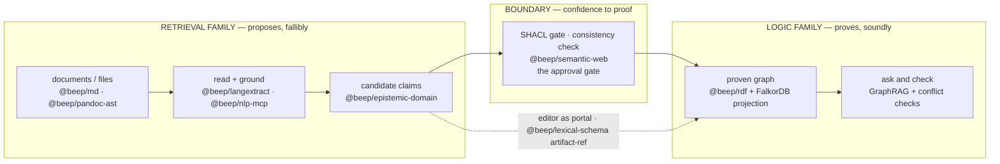

# Vision Synthesis — Prose-to-Proof

> Synthesis artifact for the `baseline-synthesis` exploration packet.
> Date: 2026-06-17 · Scope: the **product vision** only (the north star, the
> thesis, the architecture name, the capability ledger, the commitments).
> Sources are the authored vision docs under `docs/` plus targeted in-repo
> verification. Companion synthesis artifacts cover architecture, capability
> inventory, and corpus separately.

---

## 0. Framing — what is the product, and what was the scaffold

A guardrail governs every claim below, because the repo's history mixes two
very different things:

- **The learning substrate (pruned).** The software / repo-intelligence /
  code-AST / "L3 deterministic code intelligence" work (e.g. the
  `EffectCapabilityKG` capability graph, "repo-memory v0") was a *learning
  vehicle*: the builder grounded himself in software and the `beep-effect`
  codebase to learn ontology, graph, and memory architecture, betting it would
  transfer to law and wealth management. That code is **not** the product or
  the moat and is treated as the (now-superseded) learning vehicle — though,
  contrary to a "fully pruned" framing, parts of it **still exist in the
  working tree** (verified: `packages/tooling/library/repo-utils/src/EffectCapabilityKG.ts`
  is a live ~1,630-line file, last touched in recent commits). It must not be
  inventoried as present *product* capability regardless. The *memory-architecture framework* it
  yielded — the **No-Escape Theorem** and the **four-layer taxonomy** — is now
  **learned theory applied to law**, not shipping code.
- **The product (active).** A **local-first, provenance-grounded knowledge
  workbench** for a **solo IP-law practice**. This is the only active vertical.
  Wealth management is **dormant** (a `data-model-wealth-management.md` stub
  exists at `goals/agentic-professional-runtime/docs/`, dated 2026-05-20, but
  no active vertical sits behind it).

Everything that follows describes the *product*. Where a capability is theory,
spec, or net-new build, it is labelled as such — never as built.

---

## 1. The north star (one paragraph, then the spine)

> *Prose in, proof out.* "Obsidian for lawyers — but it proves its sources."
> (`docs/PROSE_TO_PROOF_VISION.md` §header.)

A solo IP attorney's entire practice — every email, application, office action,
contract, and figure — flows through **one local machine** that *reads* the
prose, *proposes* structured claims about it, *proves* those claims sound
against a formal legal ontology, and admits only what survives into **one
knowledge graph where every fact links back to the exact words that justify it**
(`PROSE_TO_PROOF_VISION.md` §1). Three nouns anchor it:

| Anchor | Meaning | Source |
|---|---|---|
| **Codename** | Prose-to-Proof | `PROSE_TO_PROOF_VISION.md` header |
| **Architecture name** | BeepGraph (authority spine + projection shell) | `docs/BEEPGRAPH_ARCHITECTURE.md` |
| **Product target** | `apps/professional-desktop` (today a chat shell; tomorrow the workbench) | verified `apps/professional-desktop/package.json` = **v0.0.3** |

The vision deliberately bounds itself by *what it is not*
(`PROSE_TO_PROOF_VISION.md` §5): **not** a cloud SaaS, **not** a replacement for
systems of record (email/calendar/billing/docketing/USPTO), **not** an
autonomous lawyer (agents *propose*, the attorney *approves*), and **not** a
home for privileged data in git (real client material lives outside the repo).

---

## 2. Who "Tom" is, and why the relationship *is* the architecture

The product is not abstract. Its first user is **Tom Oppold**, the builder's
father — a **25-year intellectual-property practitioner** opening a **solo
practice** (`PROSE_TO_PROOF_VISION.md` §2; `PROSE_TO_PROOF_FOR_TOM.md`). The
vision documents treat the father–son relationship as a *load-bearing design
constraint*, not sentiment:

- **The corpus is his 25 years.** The deduplicated, USPTO-enriched Oppold
  corpus is the seed data — cited in the vision as **8,438 files**
  (`PROSE_TO_PROOF_VISION.md` §2, §7). Verified: the corpus lives **outside the
  repo** at `/home/elpresidank/data-home/oppold-corpus/` (directory present).
- **The first user is him** — a real attorney with real matters and deadlines,
  not a persona (`PROSE_TO_PROOF_VISION.md` §2; PRD §4).
- **His use makes it smarter** — every approved claim, every edit into his own
  voice, every correction teaches the system his standard.

This is the **dogfooding flywheel** (`PROSE_TO_PROOF_VISION.md` §7):

```
Tom's 25 years ─► corpus (8,438 files) ─► extract + ground (spans)
      ▲                                            │
      │                                            ▼
 sharper drafts,                            candidate claims
 faster review                                     │
      │                                            ▼
      │                                   approval gate (Tom)
      │                                            │
      └──── practice memory ◄── proven graph ◄─────┘
```

"Father built the knowledge; son builds the machine that makes it legible. The
machine serves the father; the father's work sharpens the machine." The bet:
the product gets better *because* the person it's built for uses it on real
work (`PROSE_TO_PROOF_VISION.md` §2). The PRD elevates this from anecdote to
strategy: "his 25-year corpus as seed, his daily use as signal — is the product
strategy, not a footnote" (`docs/product/prose-to-proof.md` §1).

A note on the corpus's role under the guardrail: the corpus and its **Corpus
CLI** (verified at `packages/tooling/tool/cli/src/commands/Corpus/` —
`Corpus.command.ts`, `Corpus.service.ts`, `Corpus.schemas.ts`, etc.) are
**ahead-of-time data prep**, not a live runtime feeder. The vision/architecture
docs are consistent with this: the corpus pipeline is described as
*completed/retained* batch salvage that an as-yet-unbuilt librarian lane will
later read (`PROSE_TO_PROOF_ARCHITECTURE_MAP.md` §6;
`BEEPGRAPH_ARCHITECTURE.md` §9 "feeder, no KG of its own").

---

## 3. The thesis — "prose proposes, logic proves"

The intellectual core of the product is a single distinction the design refuses
to blur (`PROSE_TO_PROOF_VISION.md` §3):

| Family | Verb | What it is | Trust |
|---|---|---|---|
| **Retrieval family** | *proposes*, fallibly | LLM + NLP read documents and *guess* (this string is an inventor, that clause is a license grant) | useful, fast, revisable — never true on its own |
| **Logic family** | *proves*, soundly | a formal ontology + reasoner compute what *follows* (consequences true in every model) | what it asserts, it can defend |

Between them sits **the boundary — the one place where confidence becomes
provenance**. A proposal does *not* enter the graph because a model felt sure.
It crosses only after three things happen (`PROSE_TO_PROOF_VISION.md` §3;
`PROSE_TO_PROOF_ARCHITECTURE_MAP.md` §1):

1. a **SHACL gate** validates its *shape*,
2. a **consistency check** proves it doesn't contradict what's already known,
3. it is **materialized** with a permanent link to its source span.

> The single deepest invariant, stated as a test: *does anything compute an
> entailment?* Left of the boundary, **no** (vectors + an LLM — revisable
> guesses); right of it, **yes** (consequences true in every model). The
> surface form — triples, RDF, a graph database — never tells you which family
> you're in; only that question does. (`PROSE_TO_PROOF_VISION.md` §3;
> `ARCHITECTURE_MAP.md` §1.)



This thesis is the source of the product's headline guarantee — **provenance
everywhere**. Nothing is asserted without a source; the provenance link is a
**character span** (the exact words, highlightable), modelled on "a search
engine jumping you to the precise sentence on a page"
(`PROSE_TO_PROOF_VISION.md` §6 principle 4; `PROSE_TO_PROOF_FOR_TOM.md` "It
highlights the exact line"). In plain terms for Tom: "The machine guesses; you
decide; the record only keeps what's proven" (`PROSE_TO_PROOF_FOR_TOM.md`).

---

## 4. BeepGraph — the architecture that names the spine/shell split

The thesis lands as a three-tier discipline, settled in
`docs/BEEPGRAPH_ARCHITECTURE.md` (status: **Proposed**, dated 2026-06-15;
sharpens, does not reverse, the 2026-05-12 portfolio decision). The one-liner:
**effect-ontology (EO) is the spine; TrustGraph (TG) is the shell.**

| Tier | What lives here | Role | Carrier (as documented) |
|---|---|---|---|
| **Authority** (spine) | typed claims + evidence + provenance + lifecycle — the **only** source of truth | EO-style typed, ontology-guided, provenance-first extraction core | `@beep/epistemic-domain`, `@beep/semantic-web` (PROV-O + bounded SHACL), `@beep/rdf`, EventLog/`Activity` |
| **Projection** (read model) | rebuildable views for traversal/search/timeline | TG-style FalkorDB graph + GraphRAG + explainability DAG — **rebuilt from authority, never a second source** | FalkorDB/Cypher, search index, GraphRAG packets |
| **Cache** (candidates) | similarity + unasserted corpus | managed, TTL'd, candidates-only | vectors / on-device embeddings (pgvector, documented as present-but-unused) |

The verdict's reasoning (`BEEPGRAPH_ARCHITECTURE.md` §5): EO wins all seven
*authority* criteria (typed schema-first authority, authority/projection/cache
fit, No-Escape alignment, layer fit, local-first single-app, OWL-design-time +
bounded SHACL, Effect-Schema-as-authority); TG wins the three *projection /
retrieval / packaging* dimensions where EO is silent (pluggable graph store,
GraphRAG + explainability, Knowledge Cores + Librarian). Hence the graft.

Two consequences worth surfacing because they resolve real tensions:

- **FalkorDB is a PROJECTION, not a second source of truth.** This resolves the
  open P0 in `goals/ip-law-knowledge-graph` directly
  (`BEEPGRAPH_ARCHITECTURE.md` §9).
- **OWL is design-time only.** No OWL reasoner sits in the runtime dependency
  graph; runtime validation is **bounded SHACL**
  (`BEEPGRAPH_ARCHITECTURE.md` §4 criterion 6, §6 "Leave from EO"). The
  ontology supplies vocabulary and constraints; **Effect Schema remains the
  typed authority** (`ARCHITECTURE_MAP.md` §4 — "design-time grounding, not a
  live runtime authority").

**Guardrail note.** `BEEPGRAPH_ARCHITECTURE.md` §8 still maps the pruned
learning substrate into an "L3 — Procedural / deterministic AST capability
graph — the competitive edge" row and calls `EffectCapabilityKG.ts` "done."
Under the governing guardrail this must **not** be read as present product
capability or as the moat: that L3 code-intelligence work was the *learning
vehicle*. (Note: `EffectCapabilityKG.ts` still exists in-tree as of this
verification — it has not literally been deleted — but it is not product
capability.) The doc predates its deprioritization (it is dated
2026-06-15); treat its L3 claims as stale. The product's edge is the
**law-specific local+grounded workbench**, not code intelligence.

---

## 5. What the product *is* — four faces over one graph

`PROSE_TO_PROOF_VISION.md` §4 frames the product as **one application with four
faces, all over the same graph**:

1. **A document portal.** A rich editor where the file is the source of truth
   and every document is a *portal into a subgraph* (hover "Figure 1" → linked
   CAD file; hover a defined term → its definition and every use).
2. **A document-management system (DMS).** Every file canonical on disk, synced
   to interchangeable backups (Box / S3 / local); **identity is minted and
   stable**, storage locators (`box:fileId`, `s3:key`, `sha256`) are mere
   properties, never identity.
3. **A knowledge graph.** Prose becomes typed claims + evidence + provenance,
   grounded against published legal ontologies, **walled by matter** (each
   matter a named subgraph that doubles as an ethical wall with legal force).
4. **Ask & check.** GraphRAG Q&A over the practice, plus **cross-matter
   conflict-of-interest checks** — a query only a single unified graph can
   answer, even though each matter stays sealed for substantive reads.

The User Story ("The Office Action", `PROSE_TO_PROOF_USER_STORY.md`) walks all
four faces through one real-shaped workflow: an Office Action PDF lands → is
read & structured → claims grounded to spans → portal links surfaced
(claim ↔ spec ↔ figure) → distinctions *proposed* (candidate, not fact) → draft
written in Tom's voice → Tom reviews & approves → proven facts join the graph,
all on his machine. It is the same loop, walked once on real work.

---

## 6. The capability ledger — Have / Specced / Build (verified)

`PROSE_TO_PROOF_ARCHITECTURE_MAP.md` §2 and §7 give an "honest ledger." I
re-verified the **Have** rows against the working tree (paths confirmed present
unless noted):

| Capability | Status (per docs) | Carrier | Verified |
|---|---|---|---|
| Editor-as-portal (`ArtifactRefNode`) | **Have** | `packages/foundation/modeling/lexical/src/Lexical.model.ts` | ✅ file present; `ArtifactRefNode` symbol present |
| Span-grounded extraction | **Have** | `packages/foundation/capability/langextract/src/Extraction` | ✅ dir present |
| Typed claims/evidence/provenance | **Have** | `packages/epistemic/domain/src/entities/{CandidateClaim,Evidence,Activity,UsageRecord}` | ✅ all four dirs present |
| Approval gate (PROV-O + bounded SHACL) | **Have** | `packages/foundation/capability/semantic-web/src/{prov.ts, adapters/shacl-engine.ts}` | ✅ both present |
| RDF substrate | **Have** | `packages/foundation/modeling/rdf/src/Rdf.ts` | ✅ present |
| NLP driver (offsets/entities) | **Have** | `packages/drivers/nlp-mcp` ("42 tools") | ✅ dir present (tool count UNVERIFIED) |
| Canonical documents | **Have** | `@beep/md` (`packages/foundation/modeling/md`), `@beep/pandoc-ast` | partial — md/pandoc-ast referenced, not re-opened here |
| Desktop chat app | **Have** | `apps/professional-desktop` (Tauri + React + Bun, PGlite) | ✅ present, **v0.0.3** |
| Law-specific overlays | **Specced / partial** | `packages/law-practice` | ✅ thin — `domain/src/{entities,index.ts}` only |
| FalkorDB projection / GraphRAG / conflicts | **Specced** | `goals/ip-law-knowledge-graph`, `goals/trustgraph-port` | not re-verified here |
| OWL reasoner; AI librarian; sync engine; on-device embeddings | **Build (net-new)** | per system diagram | net-new by definition |

The honest summary the docs themselves draw: **the authority spine is largely
already built; the projection/retrieval shell and the EO-style extraction
kernel are the principal net-new work** (`BEEPGRAPH_ARCHITECTURE.md` §10). And
the candid "today" statement: `apps/professional-desktop` is "honestly a
local-first **chat app**" whose foundations are "realer than the surface
implies" (`PROSE_TO_PROOF_VISION.md` §8).

The ontology TBox (`ARCHITECTURE_MAP.md` §4) is a layered, standards-backed
stack used as **design-time grounding** — OWL 2 (EL+RL), BFO (upper),
FRBR/LRM/LRMoo (document model), FOLIO (legal practice; flagged shallow on
patent/trademark specifics), LKIF-Core, IPRonto/Copyright Ontology, ODRL, SKOS,
CPC/IPC, PROV-O, SHACL. The `ip-law-knowledge-graph` packet locks a **7-ontology
source-of-truth set** requiring every node/edge type to cite ≥1 source.

---

## 7. The core commitments (the non-negotiables)

Distilled from `PROSE_TO_PROOF_VISION.md` §6, `ARCHITECTURE_MAP.md` §8, and the
PRD's NFRs — these are the invariants the product is unwilling to trade:

| # | Commitment | Why it matters |
|---|---|---|
| C1 | **Local-first, every matter walled** | On-device by default; matters are named subgraphs that are confidentiality boundaries with legal force; joinable for conflict checks, sealed for substantive reads |
| C2 | **The file is canonical** | One file = the truth for prose; format is a per-document property; the graph indexes the file, never replaces it |
| C3 | **The editor is a portal** | Reading is navigating; provenance is one hover away |
| C4 | **Provenance everywhere** | Nothing asserted without a source; the link is a resolvable **character span**; the validator rejects a claim whose span doesn't exist in the source |
| C5 | **Retrieval proposes, logic proves** | Confidence routes a guess to review; only proof admits a fact; the boundary is sacred |
| C6 | **Candidate-only writes** | Agents propose; human/policy approval promotes to authoritative state; professional judgment stays approval-gated |
| C7 | **Authority vs. projection** | Claim+evidence+provenance+lifecycle is the authoritative primitive; graph/search/retrieval are rebuildable projections |
| C8 | **SDK-first** | The internal Effect/TS SDK is the canonical contract; MCP / desktop / native app are adapters over it |
| C9 | **Storage-neutral domain** | PGlite is the first adapter; domain language must not depend on it |

These trace back to binding standards — `goals/agentic-professional-runtime/SPEC.md`
and `standards/ARCHITECTURE.md` — so they are inherited law, not aspiration
(`ARCHITECTURE_MAP.md` §8).

---

## 8. Roadmap shape (where it goes)

The PRD (`docs/product/prose-to-proof.md` §10) sequences the build; the vision
§8 compresses it to today / next / horizon:

| Phase | Theme | Outcome |
|---|---|---|
| **P0** (done/spec) | Runtime data loop on email fixtures | candidate claims/tasks/draft + approval + SDK packet, deterministic |
| **P1** (the PRD's MVP) | Extend loop to **documents**; editor portal | real matter docs → grounded candidates → approve → local proven store |
| **P2** | **Librarian** | ingest the corpus at scale into candidate claims |
| **P3** | Graph & ask | FalkorDB projection, GraphRAG ask-and-check, cross-matter conflict checks |
| **P4** | Reason & wall | OWL 2 EL/RL reasoner over the TBox; enforced matter walls; bitemporal store |
| **P5** | Sync & scale | sync engine (FS ↔ Box/S3/local), Box Events → ingest |

The MVP wedge, stated competitively (PRD §2, §12): the intersection of
**local-first + every-assertion-grounded + IP-specialized** is "essentially
unoccupied" — cloud legal-AI grounds well but isn't local; local AI tools are
private but don't ground rigorously; patent tools are cloud SaaS. (Competitive
claims are point-in-time, researched 2026-06-15, per the PRD's own caveat.)

---

## 9. The interactive visualizations (role only)

Three HTML files accompany the prose, all present and dated 2026-06-15
(verified `ls`): `docs/PROSE_TO_PROOF_VISUALIZATION.html` (~43 KB, the master
system diagram referenced throughout the vision as "the system diagram"),
`docs/PROSE_TO_PROOF_CHAT.html` (~24 KB), and `docs/PROSE_TO_PROOF_GRAPH.html`
(~27 KB). They are **interactive companions** to the written vision — the
canonical articulation of the retrieval/boundary/logic split and the
authority/projection/cache tiers in visual form. Their role is illustrative and
navigational; the binding prose lives in the `.md` documents. (Not parsed in
detail per scope.)

---

## 10. Tensions & gaps surfaced

- **Stale "moat" language in BeepGraph §8.** The L3 deterministic
  code-intelligence row ("the competitive edge", `EffectCapabilityKG.ts`
  "done") describes the **learning substrate**, not product capability. (The
  file `EffectCapabilityKG.ts` is in fact still present in-tree — it has not
  been deleted — but it is not the product and not the moat.) Do not propagate
  "code intelligence = moat." The moat is the local+grounded **law** workbench.
- **"Have" vs. surface honesty.** The docs are admirably candid that the
  *visible* app is a chat shell (v0.0.3) while the *foundations* are built. The
  load-bearing risk is the **integration gap** — the Have primitives exist as
  separate packages; wiring them into the P1 document-portal loop is unproven
  work, not a recombination of finished parts.
- **Ontology depth.** FOLIO is explicitly flagged as shallow on
  patent/trademark specifics; FOLIO governance (SALI/SOLI lineage) is unsettled
  (`ARCHITECTURE_MAP.md` §4; PRD §13). The IP layer depends on the 7-source set
  that is **Specced**, not built.
- **Open product question — first workflow.** Office-action review vs. intake
  vs. drafting vs. contract review: the highest trust/value ratio is *still
  open* (PRD §13; `product-vision-law-practice.md` Open Questions).
- **Wealth management dormant, but documented.** A
  `data-model-wealth-management.md` and the "Todox" product-vision stub exist
  under `goals/agentic-professional-runtime/docs/`; they are not the active
  vertical. The ATLAS Outcomes name the **agentic solo IP law practice** as the
  **sole active vertical** (`explorations/ATLAS.md` §Outcomes, line 22).

---

## Confidence & Caveats

**Verified directly (opened or `ls`-confirmed this session):**
- All six vision/product docs read in full: `docs/README.md`,
  `docs/PROSE_TO_PROOF_VISION.md`, `docs/product/prose-to-proof.md`,
  `docs/PROSE_TO_PROOF_FOR_TOM.md`, `docs/PROSE_TO_PROOF_USER_STORY.md`,
  `docs/PROSE_TO_PROOF_ARCHITECTURE_MAP.md`, `docs/BEEPGRAPH_ARCHITECTURE.md`,
  `goals/agentic-professional-runtime/docs/product-vision-law-practice.md`, and
  the Outcomes section of `explorations/ATLAS.md`.
- Three HTML visualizations exist and are dated 2026-06-15 (sizes noted).
- **Have** carrier paths confirmed present: `Lexical.model.ts` (+
  `ArtifactRefNode`), `langextract/src/Extraction`, the four
  `epistemic/domain/src/entities/*`, `semantic-web` `prov.ts` +
  `adapters/shacl-engine.ts`, `rdf/src/Rdf.ts`, `drivers/nlp-mcp`,
  `apps/professional-desktop` at **v0.0.3**, `packages/law-practice/domain`
  (thin: `entities` + `index.ts`).
- Corpus location `/home/elpresidank/data-home/oppold-corpus/` exists; the
  **Corpus CLI** exists at `packages/tooling/tool/cli/src/commands/Corpus/`.

**UNVERIFIED (asserted by docs, not independently checked this session):**
- The "8,438 files", "643 docket files", "105 families" corpus counts (cited
  from `goals/oppold-corpus-pipeline/SPEC.md`).
- The "42 tools" count for `nlp-mcp`.
- The internal content/behaviour of `@beep/md`, `@beep/pandoc-ast`, FalkorDB
  specs, and the `ip-law-knowledge-graph` 7-ontology set (read about, not
  opened).
- All **Specced/Build** rows — accepted as specs/plans per their labels; none
  presented as built.
- External competitive claims (Harvey, CoCounsel, iManage, etc.) — point-in-time
  per the PRD's own caveat (researched 2026-06-15); not re-verified.

**NOT FOUND / stale:**
- No active wealth-management vertical — only dormant doc stubs.
- BeepGraph §8's "L3 code intelligence = competitive edge" describes the
  **learning substrate**; treated as stale per the governing guardrail, not as
  present *product* capability or moat. (Caveat: the cited carrier
  `EffectCapabilityKG.ts` still exists in-tree — see Verification below — so the
  "deleted" framing is imprecise; the operative point is that it is not product.)

**Open questions (from the docs, unresolved):**
- Which first workflow has the highest trust/value ratio.
- What of Tom's prior-firm history can be exported under confidentiality terms.
- How the UI distinguishes "assistant draft" from "attorney work product".
- FOLIO governance stability and IP-layer ontology depth.

### Verification (2026-06-17)

Adversarial in-repo pass by a skeptical verifier.

**Re-confirmed present (Read/ls/grep this session):**
- All six vision/product docs + `docs/README.md` + `docs/BEEPGRAPH_ARCHITECTURE.md`
  exist as cited.
- Three HTML visualizations exist, dated 2026-06-15, sizes match (~42.6 KB /
  ~24.5 KB / ~27.1 KB).
- Every **Have**-row carrier path resolves: `Lexical.model.ts` (contains
  `ArtifactRefNode`), `langextract/src/Extraction`, the four
  `epistemic/domain/src/entities/{CandidateClaim,Evidence,Activity,UsageRecord}`,
  `semantic-web/src/prov.ts` + `adapters/shacl-engine.ts`, `rdf/src/Rdf.ts`,
  `drivers/nlp-mcp`, `apps/professional-desktop` at **v0.0.3**.
- `packages/law-practice/domain/src` is indeed thin: `index.ts` + `entities/`
  (`LegalClient`, `LegalContact`, `Matter`, `PatentAsset`) — consistent with the
  "Specced / partial" label.
- Corpus data dir `/home/elpresidank/data-home/oppold-corpus/` exists; Corpus
  CLI exists at `packages/tooling/tool/cli/src/commands/Corpus/` with the cited
  files. Framing as ahead-of-time data prep (not a live runtime feeder) is sound.
- `BEEPGRAPH_ARCHITECTURE.md` status (**Proposed**, dated 2026-06-15, sharpens
  the 2026-05-12 decision) and its §8 L3 "competitive edge" / `EffectCapabilityKG.ts`
  "done" rows are quoted accurately.
- `explorations/ATLAS.md` Outcomes line 22 names "Agentic solo IP law practice
  (sole active vertical)" — verbatim match.
- Wealth-management stub's "dated 2026-05-20" is its git creation date (not an
  in-file date), which is fair provenance.

**Corrected this pass:**
- The doc's claim that the L3 / code-AST learning substrate "has been
  pruned/deleted" is **factually imprecise**: `packages/tooling/library/repo-utils/src/EffectCapabilityKG.ts`
  is still present in the working tree (a live ~1,630-line file, last touched in
  recent commits `fd7c8c2b` / `b7d47457`). Softened §0, the §4 guardrail note,
  and both §10 / "NOT FOUND / stale" bullets to say the substrate is the
  deprioritized *learning vehicle* and **not product capability / not the moat**,
  while noting the file has not literally been deleted. The guardrail's
  intent (do not frame code intelligence as present capability or moat) is
  preserved and reinforced.

**Remaining doubts (unverified, as the doc already flags):**
- Corpus counts (8,438 files / 643 docket / 105 families) and the nlp-mcp "42
  tools" count — not independently counted; `nlp-mcp/package.json` does not state
  a tool count. The doc already marks these UNVERIFIED.
- Internal behaviour of `@beep/md`, `@beep/pandoc-ast`, FalkorDB specs, and the
  7-ontology set — not opened.
- All Specced/Build rows accepted as plans per their labels; none is presented
  as built. No pruned work is presented as present *product* capability.
