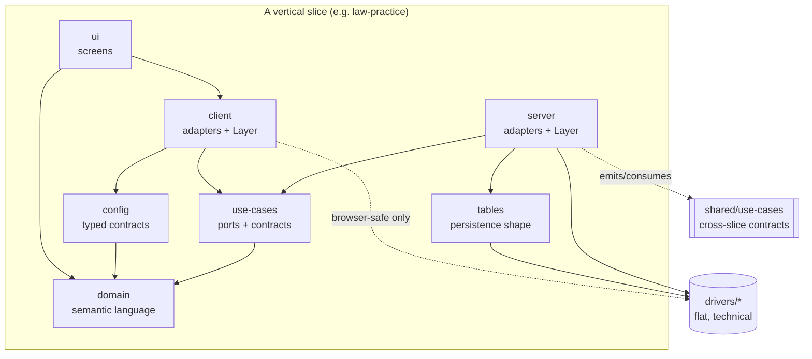

# 02 — Architecture Doctrine (Synthesis)

_Date: 2026-06-17 · Packet: baseline-synthesis · Scope: the architecture constitution under `standards/`_

This artifact synthesizes the binding architecture standard
(`standards/ARCHITECTURE.md`) and its rationale packet
(`standards/architecture/`: `README.md`, `GLOSSARY.md`, `DECISIONS.md`, and the
numbered docs `00`..`13`). It is a map and a doctrine-vs-transitional reading,
not a file dump.

> **Framing guardrail.** The architecture standard is a _learning substrate_ —
> the doctrine was authored and stress-tested against software topology
> (slices, ports, drivers, schema-first modeling) while the user grounded
> themselves in ontology/graph/memory architecture. The deleted
> code-intelligence / repo-memory work was the vehicle, not the product. Read
> this doctrine as the durable _grammar_ that survives the pruning, now to be
> pointed at the IP-law firm flywheel. Where the docs use `iam` / `Membership` /
> `billing`, those are **illustrative examples**, not shipped slices (see
> Confidence & Caveats).

---

## 1. One-line-per-doc map

| Doc | File | Thesis in one line |
|-----|------|--------------------|
| README | `architecture/README.md` | The packet is rationale; `ARCHITECTURE.md` is the binding constitution. Topology is durable product infrastructure. |
| GLOSSARY | `architecture/GLOSSARY.md` | Canonical vocabulary: slice, port, adapter, driver, foundation, shared kernel, the five error kinds, role suffix, canonical subpath. |
| DECISIONS | `architecture/DECISIONS.md` | Dated decision/amendment log; every retirement supersedes its original adoption entry. |
| 00 | `00-philosophy.md` | Core bet: `high modularity + consistent topology > low ceremony + improvised structure`; topology preserves optionality. |
| 01 | `01-hexagonal-vertical-slices.md` | Slices are vertical (product locality) **and** hexagonal (ports/adapters keep externals out); same concept, different lens per layer. |
| 02 | `02-shared-kernel.md` | `shared/*` is a DDD shared kernel, not a junk drawer; high-bar exports require promotion records; reduced spine. |
| 03 | `03-driver-boundaries.md` | `drivers/*` are flat, repo-level, technical-only wrappers; they must never learn product language. |
| 04 | `04-rich-domain-model.md` | Hybrid rich domain: schema-first + pure behavior; the five-form behavior table; "pure ≠ Effect-free"; forbidden `R`-channel deps. |
| 05 | `05-layer-composition.md` | No God Layers; slice-local `Layer.ts` composition; Effect v4 memoizes Layers by default; apps compose slices, not concepts. |
| 06 | `06-configuration-boundaries.md` | `config` is a typed contract package; `/public` `/server` `/secrets` `/layer` `/test`; config→domain is one-way. |
| 07 | `07-non-slice-families.md` | `foundation` / `drivers` / `tooling` family+kind grammar; capability gate (≥2 consumers + negative gate); `@beep/schema` & CLI topology. |
| 08 | `08-testing.md` | Domain tested without Layers; use-case tests stub ports; fixture ownership via `/test`; contract tests; slice-isolation guarantee. |
| 09 | `09-errors-across-boundaries.md` | Five error kinds; each boundary _translates_; failure that escapes its declaration is a doctrine violation. |
| 10 | `10-cross-slice-coordination.md` | Single-slice process stays local; cross-slice goes through `shared/use-cases` event contracts; God Process Manager anti-pattern. |
| 11 | `11-evolution-and-deprecation.md` | Slice retirement, `shared/use-cases` V2 versioning, port deprecation windows, feature-flag 6-week cap. |
| 12 | `12-observability.md` | Slice boundary = span boundary; use-case = architectural root span; naming `<slice>.<concept>.<action>`; domain vs technical attributes. |
| 13 | `13-onboarding-the-minimum-viable-slice.md` | Smallest legal slice (~3 packages, ~15 files); first cross-slice promotion; 60-second slice-path reading guide. |

---

## 2. The core model: vertical slices + hexagonal ports

The architecture deliberately fuses two patterns that are usually held apart
(`01-hexagonal-vertical-slices.md`):

- **Vertical** keeps a product concept's work together so reuse is intentional,
  not accidental.
- **Hexagonal** keeps external systems behind ports/adapters so the domain core
  stays clean.

The canonical slice spine:

```txt
packages/<slice>/
  domain/      # driver-neutral semantic language
  use-cases/   # product ports + driver-neutral boundary/protocol contracts
  config/      # typed config contracts (optional — create only when meaningful)
  server/      # live server adapters + slice-local Layer composition
  client/      # live client adapters + slice-local Layer composition
  tables/      # product persistence shape
  ui/          # product screens/workflows
```

Dependency arrows point outer→inner (importer→imported):

```txt
domain  <- config <- use-cases <- server
domain  <- client <- ui
use-cases <- client   (client-safe exports only)
config    <- client   (public exports only)
use-cases product ports <- server implementations <- drivers
```

The **"same concept, different lens"** principle is what makes the grammar pay
off: `Membership.policy.ts` (domain), `Membership.commands.ts` (use-cases),
`Membership.http-handlers.ts` (server) are the _same_ concept folder seen
through different package + role-suffix lenses. Concept-locality is the default;
cross-concept modules (process managers, projections, slice-wide policies,
package composers) are explicit escape hatches gated on touching ≥2 concepts.

**Hard isolation rules** (recur in 01/05/08/10):

- Slice-to-slice direct imports across `domain/use-cases/server/tables/client/ui`
  of _different_ slices are **forbidden**.
- Cross-slice integration goes only through `shared/use-cases` contracts or
  emitted events.
- A slice's tests must boot only that slice's Layers (plus test-kit/driver test
  Layers) — the test-time enforcement of optionality.



---

## 3. Shared kernel: deliberate cross-slice language

`shared/*` (`02-shared-kernel.md`, GLOSSARY "Shared Kernel") is a **DDD shared
kernel** — every dependency is "easy to add, hard to remove," so coupling is
made visible. The reduced spine:

| Sub-package | Status | Bar |
|-------------|--------|-----|
| `shared/domain` | Normal home | Cross-slice value objects, semantic building blocks, shared entity metadata. |
| `shared/config` | Normal home | Cross-slice config primitives/contracts; not a global config registry. |
| `shared/use-cases` | **Exceptional, contract-only** | Cross-slice commands/queries/DTOs/boundary contracts/client-safe errors/facade interfaces; product ports require extra proof. Promotion record required. |
| `shared/client` `shared/server` `shared/tables` `shared/ui` | **Exceptional** | Only deliberate cross-slice product semantics; promotion record required. |

**Shared ≠ Foundation** is the load-bearing distinction (also in `07`):

```txt
shared      = deliberate cross-slice PRODUCT language (coupling)
foundation  = domain-agnostic reusable SUBSTRATE (no product coupling)
```

**Promotion records** (Appendix in `02`, schema reproduced in `13` worked
example) are README sections proving a high-bar export earned its home:
date, shared semantics, ≥2 named consumers, rejected homes (owning slice +
foundation), surface, runtime limits, coupling acceptors, removal trigger.
**Doctrine, not yet automated:** the README "Known Unknowns" flags
`lint:promotion-records` as _planned, not implemented_ — promotion records are
currently a **Review Gate**, not a Hard Check.

---

## 4. Drivers: flat external wrappers

`drivers/*` (`03-driver-boundaries.md`) are the **flat-family exception**: no
`<kind>` segment, repo-level home (`packages/drivers/<name>` → `@beep/<name>`).
The discipline is "locality by product language, not locality by library": a
wrapper that starts knowing about `Membership`/`Account` is a product adapter
wearing a technical label and is in the wrong home.

- **Use-cases** define _what_ the application needs (ports, contracts) in product
  language; **drivers** define safe technical capability (SDK wrappers, DB
  clients, queue/workflow engines, retry/timeout/transaction helpers).
- **Server** adapts drivers to product ports; **tables** declare product schema;
  **client** may touch a driver only via `@beep/<driver>/browser` (root is never
  browser-safe by default).
- Direct driver imports are narrow: `server` and `tables` may import drivers;
  `domain/use-cases/config/ui/shared/*` may not.
- **Driver config vs slice config** gray zone: the canonical worked example is a
  retry-policy flag — the driver owns the _values_ (max attempts, backoff), the
  slice config owns the _flag selecting_ a bundle, and `server` is the only place
  that knows both sides. Diagnostic: _if a driver imports from a slice, the
  boundary is wrong._

**Verified in-repo:** `packages/drivers/` is flat with 25 wrappers (`drizzle`,
`postgres`, `anthropic`, `firecrawl`, `tika`, `box`, `xai`, `venice-ai`, etc.) —
consistent with the flat-family doctrine.

---

## 5. Foundation families: primitive / modeling / capability / ui-system

`foundation` (`07-non-slice-families.md`, GLOSSARY "Foundation Family") is
domain-agnostic substrate with required kinds. **Verified in-repo:**
`packages/foundation/{primitive,modeling,capability,ui-system}` all exist.

| Kind | Role | Routing note |
|------|------|--------------|
| `primitive` | Lowest-level domain-agnostic primitives. | — |
| `modeling` | Reusable schemas, brands, identity contracts (e.g. `@beep/schema`, identity). | Domain may import `foundation/primitive` + `foundation/modeling`. |
| `capability` | Repo-owned, domain-agnostic technical services. | **Last** generic destination, behind a gate. |
| `ui-system` | Product-agnostic UI primitives, themes, tokens, hooks (e.g. `@beep/ui`). | May depend on primitive/modeling; **not** capability by default. |

**The capability gate** is the sharpest rule in `07`: a `foundation/capability`
package must pass a negative gate (no product semantics, no external-engine
wrapping, no tooling purpose, no UI role) **plus ≥2 named current consumers in
the README**. "Reusable shape alone is not proof." The worked rejection (a
schema-validator wrapper with one consumer) shows the three failure modes:
(a) <2 consumers, (b) a more specific home exists, (c) it's an ergonomic wrapper
not a capability.

**Routing order** (specific before generic): product semantics → slice/`shared`;
external engines → `drivers`; repo ops → `tooling`; UI primitives →
`foundation/ui-system`; only the residue → `foundation/capability`.

Two topology sub-doctrines worth flagging because they are **enforced or
enforceable today**:

- **`@beep/schema` concept-module topology** — flat PascalCase concept subpaths
  (`@beep/schema/Duration`), role-file source topology, retired lowercase
  topical paths. Enforced by `bun run beep lint schema-topology`.
- **Repo CLI command topology** — thresholded command groups
  (`<Group>.command.ts`, `.schemas.ts`, `.errors.ts`, `.service.ts`, `index.ts`).
  **Verified in-repo:** `packages/tooling/tool/cli/src/commands/Corpus/` matches
  this exactly (`Corpus.command.ts`, `Corpus.errors.ts`, `Corpus.schemas.ts`,
  `Corpus.service.ts`, `index.ts`). _Per the packet guardrail, the Corpus CLI is
  ahead-of-time data prep over `/home/elpresidank/data-home/oppold-corpus/`, not
  a live product runtime feeder._

---

## 6. Tooling family

`tooling` (`07`) is developer-operational code, with a small kind catalog so the
family stays legible. **Verified in-repo:** `packages/tooling/{library,policy-pack,test-kit,tool}`.

| Kind | Role |
|------|------|
| `library` | Reusable repo-analysis/support code. |
| `tool` | CLIs, pipeline tools, orchestrators (repo-wide orchestration is _behavior_ inside `tool`, not a new kind). |
| `policy-pack` | Config presets / governance data (declarative, not executable). |
| `test-kit` | Reusable testing helpers (importable by any slice with **no** promotion record). |

Tooling may compose a driver directly when acting as an operational adapter
around a product-neutral engine, but this is not a license for product semantics
to enter `drivers` nor for runtime substrate to be routed through `tooling`.

`packages/_internal/db-admin` is the single named internal exception (migration
aggregation home); new durable `_internal` packages still need an explicit
decision.

---

## 7. Layer composition: no God Layers, slice-local, Effect v4 memoization

`05-layer-composition.md` rests on an Effect-v4 premise: **Layers are memoized by
default**, so the old pressure toward global `DataAccess.layer` /
`Persistence.layer` God Layers is gone. Slice-local composition is now the better
default.

- **God Layer** (GLOSSARY): a central runtime Layer merging many unrelated slices
  + drivers. Rejected by a **Boundary + Ownership** test.
- **Scope ladder:** concept-level → package-level → slice-level → app-level.
  Each slice publishes a single live Layer from its `/layer` subpath; apps
  compose _slices, not concepts_.
- **Diagnostic:** if `apps/<app>/src/runtime/Layer.ts` mentions a concept name
  (e.g. `Membership`), it has reached past the slice boundary.
- `use-cases` and `shared/use-cases` stop at the contract surface — they export
  **no live Layer values**. Drivers may export boundary-local layer constructors;
  config may expose server/runtime-only `/layer` helpers; live application Layer
  composition lives only in `server`/`client`.
- **"Private" definition** (shared with GLOSSARY): anything not exported through a
  canonical subpath (`/public` `/server` `/secrets` `/layer` `/test`). Reaching
  past those into internal module structure is _the_ boundary violation.

---

## 8. The five error kinds + translators

`09-errors-across-boundaries.md` is the most operationally precise doc. Five
failure kinds, each with a fixed home and a fixed translator. The arrow is always
a _translation_, never a passthrough.

| Kind | Home | Exported from | Who branches | Translated by |
|------|------|---------------|--------------|---------------|
| Domain (actionable) | `domain/<C>/<C>.errors.ts` | domain | use-cases | (consumed by use-cases) |
| Port | `use-cases/<C>/<C>.errors.ts` | `/server` only | use-cases | adapter→port; use-case→public |
| Public action | `use-cases/<C>/<C>.errors.ts` | `/public` | protocol handlers, clients, UI atoms | use-case service |
| Internal/technical | driver/adapter | (never crosses) | nobody above the adapter | **dies in the adapter** |
| Protocol | boundary (HTTP/RPC) | response shape | — | HTTP/RPC handler |

The three translation rules:

1. **Server adapters** translate driver errors → port-declared errors
   (`PostgresError` → `MembershipRepositoryNotFound`).
2. **Use-case services** translate port errors → public action errors
   (`MembershipRepositoryNotFound` → `MembershipNotFound`).
3. **HTTP/RPC handlers** translate public action errors → protocol shape
   (403/404/409 problem-details; unbranched → 500 + correlation id).

Invariants: a handler must never branch on a port error; a use-case never on a
driver error; ports declare `Effect.Effect<Result, Failures, never>` (R stays
`never`; live requirements enter at Layer composition). Two corollaries:
**logging is the dual of translation** (the boundary that drops detail logs it),
and **defects (`Effect.die`) bypass translation by design** (→ 500, fix the
precondition, not the translator). Translation lives in
`<Concept>.error-translation.ts` when policy is interesting, inline `mapError`/
`catchTag` when trivial.

The executable proof is `packages/architecture-lab/*`: `WorkItemRepositoryNotFound`
(server-only) vs `WorkItemNotFound` (public), translated by `WorkItemUseCases`.
**Verified in-repo:** `packages/architecture-lab/` carries the full canonical
spine (`domain client config server tables ui use-cases`) — it is the live
reference slice the docs point to.

---

## 9. Configuration boundaries

`06-configuration-boundaries.md` makes `config` a typed-contract package, not env
access or a constants dump. `config` names the typed contract; `env` is merely one
source (modeled through Effect `Config`/`ConfigProvider`, never raw `process.env`
in slice code).

Canonical subpaths (each a required name _when the role exists_, not a placeholder
mandate):

| Subpath | Browser-safe? | Holds |
|---------|---------------|-------|
| `/public` | Yes (only browser-safe surface) | Public/browser config contracts. |
| `/server` | No | Server-only config contracts. |
| `/secrets` | No | Redacted secret config. |
| `/layer` | No (server/runtime-only) | Live Layers reading the ambient `ConfigProvider`. |
| `/test` | No | Static/test Layers + fixtures. |

**One-way config→domain:** config may depend inward on `domain`/`shared` for
driver-neutral schemas; **domain must never import slice config,
`@beep/<kernel>-config`, `Config`, `ConfigProvider`, secret helpers, or test
config utilities.** Config must not import drivers; live config Layers are
composed in `server`/`client`, then assembled by app entrypoints. `env`-shaped
packages are **transitional compatibility** — clean toward typed config on touch.

---

## 10. Observability span model

`12-observability.md`: **slice boundaries are span boundaries; the trace tree
mirrors the architectural tree.**

- A protocol handler may be the request trace root; the **use-case command is the
  architectural root span**. Port calls are child spans; driver work is
  grandchildren (Effect threads the parent span through the fiber — no manual
  `withParentSpan`).
- **Naming:** `<slice>.<concept>.<action>` in snake_case action
  (`iam.membership.revoke`, `iam.membership.find_by_id`). Protocol spans use the
  protocol operation name (`http.POST /v1/...`); adapter-internal spans use a
  technical namespace (`db.query`, `http.request`, `queue.publish`).
- **Attribute split by who-imports-what:** domain-semantic attributes
  (`iam.membership.actor.role`) attach in use-cases; technical attributes
  (`db.statement`, `db.rows_affected`) attach in adapters. A driver _cannot_
  attach domain attributes because it does not import `domain`.
- **Three signals are not interchangeable:** Tracing = durable structure of every
  call; Logging (`Effect.log*`) = exceptional/diagnostic; Console
  (`effect/Console`) = user-facing CLI output only. Happy path = spans + bounded
  attributes, not logs. Low-cardinality only; never raw input/secrets/PII.

---

## 11. Evolution & deprecation

`11-evolution-and-deprecation.md`: "optionality without an exit plan is not
optionality."

- **Slice retirement** is a 5-step procedure (deprecate README line → sunset
  window → dependent migration → removal PR updating workspace/tsconfig/turbo and
  promotion records to `Retired:` → DECISIONS entry).
- **`shared/use-cases` versioning:** additive changes are free; breaking changes
  require a parallel **V2 tagged variant** + its own promotion record. A breaking
  change without V2 is a contract violation even if producer tests pass.
- **Port deprecation:** `@deprecated` tag + CHANGELOG + consumer migration +
  single removal PR.
- **Feature flags:** hard **6-week cap** after full ramp or rollback; new flags
  not added while older flags in the slice are past cap.

**Default windows are explicitly provisional** (README "Known Unknowns" flags the
2-minor-release / 1-quarter / 6-week defaults as starting values to tune).

---

## 12. Testing boundaries

`08-testing.md` enforces the optionality promise at test time. Runner discipline:
**Vitest via `bun run test` or `bunx --bun vitest run`; never `bun test`** (Bun's
runner breaks `@effect/vitest`).

- **Domain in isolation:** pure functions need no Layer; `R` resolves to `never`.
  `it.effect` + `Effect.exit` for typed failures; schema-derived property tests
  via `S.toArbitrary` + FastCheck.
- **Use-case tests stub ports:** `Layer.succeed` (explicit) or `Layer.mock`
  (partial). Tests must cover the boundary translator, not just the happy path.
- **Fixture ownership:** each slice publishes fixtures via `/test`; cross-slice
  fixtures must be promoted to `shared/use-cases/test`. `tooling/test-kit/*` is
  importable without promotion.
- **Contract tests:** a port contract suite runs identically against the live
  driver-backed and in-memory implementations; divergence = drift, not flake.
- **Slice-isolation guarantee:** a slice's tests must not boot another slice's
  `Layer.ts` nor any app `runtime/Layer.ts`. Anti-pattern table lists the smells.

---

## 13. Minimum viable slice + role-suffix vocabulary

`13-onboarding-the-minimum-viable-slice.md`: the smallest legal slice is **~3
packages, ~15 files** (`domain` + `use-cases` + `server`; no `client/tables/
config/ui` until there is a real reason). The scratchpad lane (`scratchpad/` or
explicitly temporary `packages/_internal/*`) is for learning, not product — no
product slice or public export may import it; promotion re-enters through the
smallest legal slice shape.

**Role-suffix vocabulary** (the precondition-check-at-filename-time from `00`):

| Suffix | Layer | Allowed contents |
|--------|-------|------------------|
| `.model.ts` | domain | schema-first class: identity + shape + small `Effect.fn` methods |
| `.errors.ts` | domain / use-cases | `TaggedErrorClass` definitions (home decides which error kind) |
| `.behavior.ts` | domain | pure transitions (`Effect.fn` returning typed failures) |
| `.policy.ts` | domain | pure decision rules (functions, not services) |
| `.commands.ts` | use-cases | command schemas (intent shapes) |
| `.queries.ts` | use-cases | query schemas (read-side intent) |
| `.ports.ts` | use-cases | port interfaces (`Context.Tag`/service contracts) |
| `.service.ts` | use-cases | use-case service composing ports + domain |
| `.repo.ts` | server | port implementation (adapter, server side) |
| `.http-handlers.ts` | server | HTTP handler implementations (server side) |
| `.event-handlers.ts` | server | thin event reactions (server side) |
| `.processes.ts` | server | multi-step coordination/sagas (single-slice) |
| `.config.ts` | config / drivers | typed config (slice) or technical knobs (driver) |

Reading a path is mechanical: `packages/iam/server/src/Membership/Membership.http-handlers.ts`
= iam slice → server adapter layer → Membership concept → HTTP-handler role.

---

## 14. Target doctrine vs transitional / cleanup-on-touch

The standard partitions migration state into five buckets (README; GLOSSARY
"Cleanup-On-Touch", "Enforcement Lane"): **Target Doctrine**, **Transitional
Compatibility**, **Cleanup-On-Touch**, **Forbidden In New Work**, **Pending
Automation/Generator Support**.

| Rule / shape | Status the docs assign |
|--------------|------------------------|
| Slice spine, hexagonal arrows, role suffixes, family/kind grammar | **Target Doctrine** |
| `providers→drivers`, `env→config`, `protocol→use-cases`, `common/core/utils/lib→foundation` | **Transitional Compatibility** — route via README table; legacy names are leftovers |
| Package-root + `./*` wildcard exports (vs canonical subpaths) | **Transitional Compatibility** — leftovers, not the target contract |
| `env` packages / raw `process.env` in slice code | **Forbidden In New Work** + Cleanup-On-Touch (clean the touched boundary) |
| Promotion records | Doctrine **(Review Gate)**; `lint:promotion-records` is **Pending Automation** (planned, not implemented) |
| God Process Manager diagnostic (`10`) | Doctrine; **not yet caught a real case** (README Known Unknowns) |
| Deprecation windows (2-minor / 1-quarter / 6-week) | Doctrine **with provisional values** to be tuned |
| Span/attribute conventions (`12`) | Doctrine; **not yet validated against live traces** |
| `@beep/schema` topology, repo-CLI command topology | Doctrine **(Hard Check)** — enforced by `bun run beep lint schema-topology` and CLI lint |
| Cross-slice event-import lint (`10` §3) | Doctrine; lint **does not yet exist** — review-blocking convention until then |

Cleanup-on-touch is explicitly scoped to the boundary being edited — **not** a
mandate to sweep whole package families.

---

## Confidence & Caveats

**Verified (opened the file):** all 14 numbered docs plus `README.md`,
`GLOSSARY.md` (full), and the architecture directory listing. Verified in-repo
via `ls`/`find`: `packages/foundation/{primitive,modeling,capability,ui-system}`,
flat `packages/drivers/*` (25 wrappers), `packages/tooling/{library,policy-pack,
test-kit,tool}`, `packages/shared/{domain,config,use-cases,client,server,tables,
ui}`, `packages/architecture-lab/` carrying the full spine, and the Corpus CLI
command group (`Corpus.command.ts` / `.errors.ts` / `.schemas.ts` / `.service.ts`
/ `index.ts`) matching the CLI command-topology doctrine.

**Important reality gap (verified):** the docs' running examples (`iam`,
`Membership`, `billing`, `notes`/`tasks`) are **illustrative — NOT FOUND as
shipped slices** (`packages/iam*` does not exist). The only slice carrying the
full canonical spine today is `packages/architecture-lab/` (the proof slice).
`packages/law-practice/` currently has **only a `domain/` package** — the IP-law
product slice is at an early stage relative to the doctrine. Role-suffix file
counts across the repo: `.model.ts` ×57, `.errors.ts` ×49, `.behavior.ts` ×4,
`.commands.ts` ×3, `.repo.ts` ×3, but **`.policy.ts` ×0, `.ports.ts` ×0,
`.http-handlers.ts` ×0** — confirming that large parts of the doctrine
(ports/handlers/policies) are **target shape not yet materialized** outside the
lab.

**UNVERIFIED:** I did not open `ARCHITECTURE.md` itself (75 KB binding
constitution) or `DECISIONS.md` (37 KB) in full — claims about their _content_
are inferred from the rationale packet's cross-references, not direct reading. I
did not run lint to confirm `schema-topology` / CLI-topology checks actually pass
today; their _existence_ as commands is asserted by the docs, not executed here.
Promotion-record lint, cross-slice event-import lint, and the God Process Manager
diagnostic are stated by the docs to be **planned/absent** — treated as such.

**Open questions:** (1) How close is `law-practice` expected to track the full
slice spine, given it is the live product vertical and currently domain-only?
(2) Which doctrine rules are actively enforced by `bun run beep yeet`/CI vs.
review-only — the docs name enforcement lanes but I did not verify the live gate
set. (3) Whether the architecture-lab proof slice is kept green as the doctrine
evolves, since it is the single executable reference.

### Verification (2026-06-17)

Skeptical re-check of in-repo claims; the doc was already unusually well
self-verified, so this is a confirmation pass with one correction.

**Checked and confirmed:**
- `standards/architecture/` carries all 14 numbered docs + `README.md` /
  `GLOSSARY.md` / `DECISIONS.md`; `standards/ARCHITECTURE.md` exists (75 KB).
- `packages/foundation/{primitive,modeling,capability,ui-system}` — all present.
- `packages/tooling/{library,policy-pack,test-kit,tool}` — all present.
- `packages/shared/{client,config,domain,server,tables,ui,use-cases}` — present.
- `packages/architecture-lab/` carries the full spine (`client config domain
  server tables ui use-cases`); `WorkItemRepositoryNotFound` /
  `WorkItemNotFound` / `WorkItemUseCases` error-translation proof exists in
  `use-cases/src/aggregates/WorkItem/` and the server/client adapters.
- `packages/law-practice/` has **only `domain/`** — confirmed.
- No `packages/iam*` exists — the `iam`/`Membership`/`billing` examples are
  illustrative, as stated.
- Named drivers `drizzle postgres anthropic firecrawl tika box xai venice-ai`
  all present; `packages/drivers/` is flat.
- Role-suffix counts re-counted and match exactly: `.model.ts` 57, `.errors.ts`
  49, `.behavior.ts` 4, `.commands.ts` 3, `.repo.ts` 3, and `.policy.ts` /
  `.ports.ts` / `.http-handlers.ts` all 0.
- `schema-topology` is a real lint command (`tooling/tool/cli/src/bin-main.ts`,
  `commands/Quality/Tasks.ts`).
- Corpus CLI command group matches the topology doctrine
  (`Corpus.command.ts` / `.errors.ts` / `.schemas.ts` / `.service.ts` /
  `index.ts`); it also has a `Corpus.recyclebin.ts` not noted in §5 (behavior
  file, does not contradict the doctrine claim).

**Corrected:** driver count was stated as "~26 wrappers" in §4 and Confidence;
actual flat count is **25** — fixed in both places.

**Remaining doubts (unchanged from author's own caveats):** I did not read
`ARCHITECTURE.md` / `DECISIONS.md` content in full, nor execute the lint gates
to confirm they pass today (only confirmed the commands exist). No pruned
code-intelligence / repo-memory / L3 capability is presented as present, and
"planned/Pending Automation" items (`lint:promotion-records`, cross-slice
event-import lint, God Process Manager diagnostic) are correctly flagged as not
built. The learning-substrate-vs-product framing holds.
