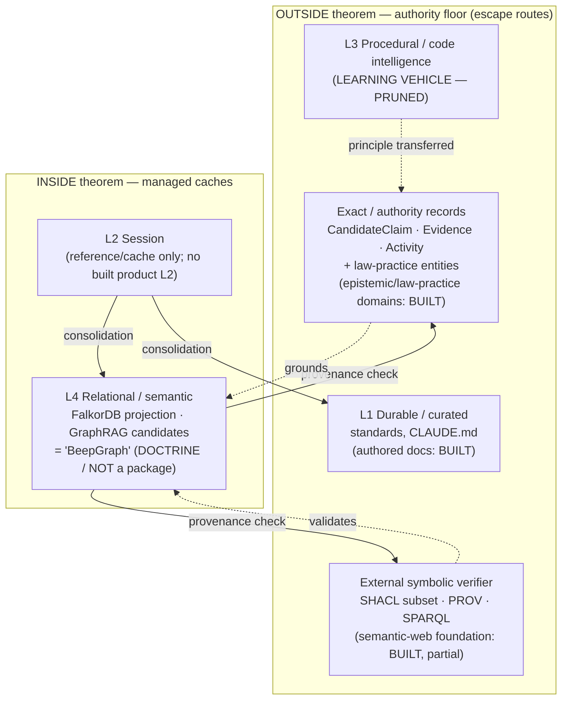

# 03 — Memory Architecture as Learned Theory

_Synthesis date: 2026-06-17_
_Method: read-only Read/Grep/Glob over `standards/memory-architecture/00–05.md`,
the packet's `DECISIONS.md`, the companion archaeology artifact
(`90-archaeology-pruned-repo-intel.md`), and the product-side substrate packages
(`packages/epistemic/**`, `packages/law-practice/**`,
`packages/foundation/capability/semantic-web/**`,
`packages/tooling/tool/cli/src/commands/Corpus/**`)._

## Framing (read this first)

`standards/memory-architecture/` is written in the present tense and repeatedly
names "deterministic code intelligence / repo-memory v0" as **"the project's
competitive edge"** (`01-memory-layer-taxonomy.md:72`) and **"the diamond"**
(`README.md`, Imperative #1). Taken literally that contradicts this baseline's
guardrail. The companion artifact `90-archaeology-pruned-repo-intel.md` resolves
the tension with commit-level evidence: the code those imperatives point at
(`apps/clawhole`, `packages/ai`, `RepoMemoryDesktop.tsx`, the AST/KG specs) was
**deleted before or around the time the doctrine was authored** (prunes
`309649ebcc` 2026-03-08 and `78f5d3fb0e` 2026-04-07; doctrine `3129cb6029`
2026-04-15).

So this artifact treats the memory architecture as **learned theory**, not
shipping product capability. The software/repo-intelligence work was the
**learning vehicle**: the user grounded themselves in a familiar domain
(software / `beep-effect`) to learn ontology / graph / memory architecture,
betting it would transfer to law and wealth management. The vehicle is pruned.
What survives — and what this document inventories — is the **transferable
principle**, now aimed at the **product**: the solo IP-law firm flywheel for the
user's father (wealth management dormant).

The durable principle, stated once: **deterministic authority + provenance
verification + managed semantic caches.** Below, the No-Escape Theorem and the
4-layer taxonomy are presented as the framework the user adopted, then mapped
onto the product substrate that actually exists in-repo.

---

## 1. The No-Escape Theorem (adopted framework, not in-house result)

The framework the user adopted is summarized in `00-no-escape-theorem.md`. It is
an **external research claim** the user took on as a governing constraint; the
citation itself (arXiv:2603.27116, "The Price of Meaning", Barman et al., 2026,
`00-no-escape-theorem.md:137–141`) is fact-checked separately by this packet's
deep-research sweep (see `DECISIONS.md` 2026-06-17 external-research-depth, item
3) and is **not re-verified here**.

**The claim.** Any memory system that retrieves by conceptual relatedness (the
Semantic Proximity Property) will, as it scales: (1) **forget** via
interference-driven power-law decay, and (2) **falsely recall** information it
never stored via associative lures. The doc frames this as geometric — a
consequence of low effective embedding dimensionality (~10–50 regardless of
nominal dimensionality, `00:27–29`) — so no embedding upgrade or retrieval
cleverness inside the SPP class escapes it.

**The three escape routes** (`00:67–79`) are the load-bearing part for the
product:

| Escape route | What it is | Product analogue (see §3) |
| --- | --- | --- |
| Exact episodic records | Verbatim storage, no semantic proximity | Source spans + accepted claims (evidence records) |
| External symbolic verifiers | Check retrieved content against non-semantic records | Ontology + SHACL validation |
| Hybrid routing | Combine degrading-semantic with rigid-robust | Route queries to highest-certainty layer |

The doc is candid that the escape routes do not *defeat* the theorem; they build
"a routing layer between a system that forgets and a system that cannot
generalise" (`00:77–78`). Engineering lives in managing where you sit on the
interference–fidelity frontier, with **compression/clustering as the most
practical lever** (`00:113–115`; cited Pareto point ~2,500 clusters).

**Caveat on the original framing.** The standard maps the escape routes onto a
three-tier *code-intelligence* certainty model (AST=1.0, type-checker=0.85–0.95,
LLM=0.6–0.85, `00:86–92`). That mapping is the **learning-vehicle artifact** —
it describes the pruned repo-intelligence engine. The transferable content is
the escape-route taxonomy, not the AST tiering.

---

## 2. The 4-layer taxonomy (the framework's spine)

`01-memory-layer-taxonomy.md` defines four layers, each tagged INSIDE or OUTSIDE
the theorem class, with a routing rule: **always route a query to the
highest-certainty layer that can answer it** (`01:137–142`).

| Layer | Role | Theorem status | Original (vehicle) implementation | Status today |
| --- | --- | --- | --- | --- |
| **L1 Durable / curated** | Project goals, principles, domain rules, standards | **OUTSIDE** (exact records) | `standards/`, `CLAUDE.md`, curated ClaimRecord | Present as authored docs; the durable-claim system is **substrate, see §3** |
| **L2 Session / ephemeral** | Today's work, recent context, in-progress state | **INSIDE** (managed) | Graphiti, bounded + consolidated | Reference/cache only; no built product L2 found |
| **L3 Procedural / code intelligence** | How to use APIs/functions, code patterns | **OUTSIDE** (symbolic lookup) | AST + JSDoc + type-checker = "the competitive edge" | **LEARNING VEHICLE — PRUNED** (see §4) |
| **L4 Relational / semantic** | How concepts/subsystems connect | **INSIDE** (managed cache) | "BeepGraph" — Effect-native TrustGraph rewrite | **Doctrine/aspirational**; substrate exists, BeepGraph itself NOT FOUND as a package (§3) |

Two layers are escape routes (L1, L3); two are inside the theorem and must be
treated as managed caches (L2, L4). The doc's own composition diagram and
promotion flow: **L2 →(consolidation)→ L1 or L4**, and **L4 →(provenance
check)→ L3 or L1** (`01:111–135`).

**Critical reframing of L3.** L3 is the layer the standard calls the moat
("mathematically immune", `01:72`; "the diamond", `README.md`). That layer was
the **software learning vehicle** and is **pruned** — its hosts
(`apps/clawhole`, `packages/ai`) and specs (AST/KG) were deleted
(`90-archaeology-pruned-repo-intel.md` §2). Per the guardrail, **do not
inventory L3/code-intelligence as a current product moat.** Its enduring value
is the *principle* — deterministic, exact, non-semantic records as the authority
floor — now reapplied to law via L1/L4 product substrate, not as code AST.

---

## 3. Mapping the framework onto the product (what actually exists)

The transferable principle is **deterministic authority + provenance
verification + managed semantic caches**, applied to the IP-law product. The
in-repo substrate for that is real and verifiable, even though the named
aggregate ("BeepGraph") is not yet a package.

### 3a. Exact / authority records → epistemic + law-practice domains (BUILT)

The escape route "exact episodic records / schema-first claims" maps to the
`epistemic` and `law-practice` domain packages:

| Concept (framework) | In-repo substrate | Path (verified) |
| --- | --- | --- |
| Accepted claim + lifecycle | `CandidateClaim` entity, `ClaimLifecycle` value | `packages/epistemic/domain/src/entities/CandidateClaim/`, `.../values/ClaimLifecycle/ClaimLifecycle.model.ts` |
| Source evidence record | `Evidence` entity | `packages/epistemic/domain/src/entities/Evidence/` |
| Provenance activity | `Activity` entity | `packages/epistemic/domain/src/entities/Activity/` |
| Usage / retrieval trace | `UsageRecord` entity | `packages/epistemic/domain/src/entities/UsageRecord/` |
| Legal subject matter | `PatentAsset`, `Matter`, `LegalClient`, `LegalContact` | `packages/law-practice/domain/src/entities/` |

The `ClaimLifecycle` literal currently models only the `"candidate"` state
(`ClaimLifecycle.model.ts:25`, `LiteralKit(["candidate"])`). This is consistent
with the doctrine's **authority-or-projection** boundary
(`05:43–58`): LLM/GraphRAG output is a **candidate producer** until it is linked
to evidence and **accepted** by a policy boundary. The acceptance states beyond
`"candidate"` appear **not yet modeled** in the literal — a gap, not a built
capability.

### 3b. External symbolic verifier → ontology + SHACL (BUILT, foundation-level)

The escape route "external symbolic verifier" maps to the `semantic-web`
foundation capability, which is **a real, present package** (not pruned, not
aspirational):

| Verifier concept | In-repo substrate | Path (verified) |
| --- | --- | --- |
| SHACL shape validation | `shacl-validation` service + `shacl-engine` adapter | `packages/foundation/capability/semantic-web/src/services/shacl-validation.ts`, `.../adapters/shacl-engine.ts` |
| Provenance (W3C PROV-O) | `provenance` service, `prov.ts` | `.../src/services/provenance.ts`, `.../src/prov.ts` |
| RDF / IRI / JSON-LD substrate | `rdf.ts`, `iri.ts`, `jsonld.ts`, JSON-LD services | `.../src/rdf.ts`, `.../src/iri.ts`, `.../src/services/jsonld-*.ts` |
| SPARQL query | `sparql-query` service | `.../src/services/sparql-query.ts` |
| Evidence / annotation | `evidence.ts`, `web-annotation` adapter | `.../src/evidence.ts`, `.../adapters/web-annotation.ts` |

Important honesty marker: the SHACL service header states it validates **"a
bounded SHACL-inspired subset covering targetClass, minCount, maxCount, and
datatype"**, with a full external engine deferrable behind the same contract
(`shacl-validation.ts` implementation notes). So the verifier escape route has a
**real but partial** in-repo realization — the contract and a v1 subset exist;
full SHACL is a future swap, not a present claim. The ontology TBox for IP-law
(the actual legal classes the verifier would check against) is the subject of
the **pending** `ip-law-knowledge-graph` work and was **NOT FOUND** as a built
package.

### 3c. Managed L4 cache → FalkorDB / GraphRAG / vectors (REFERENCE + doctrine)

The escape route "managed semantic cache" maps to the L4 graph projection. The
doctrine (`05-context-graph-capability-assessment.md`) is explicit that this is
a **projection / read model**, never authority:

- **FalkorDB** is the chosen graph projection engine — "Projection/read model …
  Rebuildable from authoritative events, claims, and source records"
  (`05:51`). In-repo, FalkorDB appears only in the **Graphiti CLI proxy**
  tooling (`packages/tooling/tool/cli/src/commands/Graphiti/internal/Proxy*.ts`)
  — an operator/sidecar surface, **not** a product-runtime feeder. No
  product package embeds FalkorDB as a runtime store (NOT FOUND).
- **GraphRAG / OntologyRAG / vectors** are **candidate producers** only
  (`05:53–54`): "GraphRAG/OntologyRAG output is never an accepted fact until
  verified against source evidence and accepted by the appropriate policy
  boundary" (`05:532`).
- **BeepGraph** — the named "Effect-native TrustGraph rewrite" that
  `01:90,105` and `04`/`03`/`README` discuss as L4's destination — is
  **doctrine/docs-only**. `grep` finds "BeepGraph" only in prose
  (`standards/memory-architecture/{01,03,04,README}.md`,
  `standards/git-worktrees.md`, several `docs/` files including
  `docs/BEEPGRAPH_ARCHITECTURE.md` and `docs/product/prose-to-proof.md`, and
  this packet's `CAPTURE.md`/`DECISIONS.md`/synthesis docs) — never in package
  source. There is **no `beepgraph`/`beep-graph` package** in `packages/**` or
  `apps/**`, and **zero** occurrences in `standards/repo-exports.catalog.md`.
  Treat BeepGraph as the *target shape* for L4, not a built component.

---

## 4. The Oppold corpus & Corpus CLI (ahead-of-time data prep, not a runtime feeder)

The Corpus CLI (`packages/tooling/tool/cli/src/commands/Corpus/` →
`/home/elpresidank/data-home/oppold-corpus/`) is **data preparation**, not a
live L2/L4 memory feeder. Verified shape:

- `Corpus.service.ts` is a **curation** service built on `@beep/file-processing`
  (artifact ingest, extraction, coverage/failure manifests, content digests) and
  **DuckDB** (`@beep/duckdb`) — i.e. batch file processing and cataloguing, not
  graph ingestion or embedding.
- The corpus directory layout (`raw`, `staging`, `organized`, `catalog`,
  `logs`, `ops`, plus `Corpus.recyclebin.ts`) is a staging pipeline for getting
  the father's IP-law document corpus clean and catalogued **ahead of time**.

Per the guardrail: this is the *input substrate* the future
`ip-law-knowledge-graph` (ontology extraction → candidate claims → SHACL
verification → accepted claims) would draw from — but the extraction-to-graph
runtime is **not built**, so the corpus is prep, not a feeder.

---

## 5. Portfolio / decision-log stance (donors as feature donors; repo-native authority)

The decision log (`04-decision-log.md`) and the context-graph addendum
(`05`) converge on one stance: **adopt a capability portfolio, never a single
external foundation.** The repo keeps authority; external projects are **feature
donors / references / cache sidecars**, gated behind `drivers/*` wrappers
(`05:520–523`).

| Donor | Donates (capability) | Explicitly NOT allowed to own |
| --- | --- | --- |
| TrustGraph (+ local TS port) | Provenance/explainability model, multi-store decomposition, OntologyRAG idea | Runtime topology, source-of-truth status (`05:71–135`) |
| Cognee | `DataPoint` ergonomics, ontology UX, memory-control-plane, session/permanent split | Accepted claims, professional approvals, durable legal facts (`05:138–176`) |
| Graphiti / Zep, GraphZep | Bi-temporal validity windows, episode lineage, auto-invalidation (L2 reference) | Unbounded memory; must have TTL/pruning/consolidation (`05:179–231`) |
| Microsoft GraphRAG, LlamaIndex | Batch corpus → entities/communities/summaries derivation | Runtime memory store; outputs stay candidate-only (`05:233–256, 358–378`) |
| FalkorDB | Graph projection / traversal engine | Memory architecture; it's "a graph database, not a memory architecture" (`05:258–281`) |
| LangGraph/LangMem, Letta, Mastra, mem0, Hindsight | Agent-recall UX, store ergonomics, benchmarks | Durable professional truth (`05:283–468`) |

The governing test (`05:56–58`): *if a proposed feature cannot say which row of
the authority-vs-projection table it belongs to (authority / authority-after-
acceptance / event-log / projection / candidate producer / managed cache /
context packet), it is not ready for implementation.* This is the doctrine that
keeps L4 a cache and L1/authority records the truth.

---

## 6. Tensions & gaps

1. **Present-tense "moat" rhetoric vs. pruned code.** The standard still calls
   L3 code-intelligence "the competitive edge / the diamond" while the code is
   deleted. The archaeology artifact flags (and this artifact echoes) that the
   doctrine likely needs a **dated amendment** softening that framing so it is
   not misread as a current product claim. The product moat is the IP-law
   flywheel, not L3.
2. **BeepGraph is a name, not a package.** L4's destination is doctrine-only.
   The *substrate* (epistemic claims/evidence/provenance, semantic-web
   SHACL/PROV, law-practice entities) exists; the *assembled* graph runtime does
   not.
3. **`ClaimLifecycle` is candidate-only.** The acceptance/rejection states that
   the authority-vs-candidate boundary depends on are not yet in the literal —
   the gate is described in doctrine before it is modeled in the value object.
4. **SHACL is a bounded subset.** The "external symbolic verifier" escape route
   has a real contract and v1 subset, but not a full SHACL engine, and no IP-law
   TBox to validate against yet (`ip-law-knowledge-graph` is pending).
5. **No built L2.** Session memory is reference-only (Graphiti as a CLI
   proxy/sidecar); no product session-memory layer was found.

---

## Confidence & Caveats

**Verified (read directly this session):**
- Full text of `standards/memory-architecture/00`, `01`, `04`, `05`, `README`,
  including the escape-route taxonomy (`00:67–79`), the 4-layer table and
  routing rule (`01`), the authority-vs-projection table (`05:43–58`), and the
  donor assessments (`05`).
- `epistemic/domain` entities (`CandidateClaim`, `Evidence`, `Activity`,
  `UsageRecord`) and `ClaimLifecycle` value (currently `LiteralKit(["candidate"])`).
- `law-practice/domain` entities (`PatentAsset`, `Matter`, `LegalClient`,
  `LegalContact`).
- `semantic-web` foundation package: SHACL service/adapter, PROV/provenance,
  RDF/IRI/JSON-LD, SPARQL, evidence, web-annotation — and the SHACL header's own
  "bounded SHACL-inspired subset" disclosure.
- Corpus CLI service built on `@beep/file-processing` + `@beep/duckdb`; the
  `/home/elpresidank/data-home/oppold-corpus/` directory layout
  (raw/staging/organized/catalog/logs/ops).
- The companion archaeology artifact's prune commits (`309649ebcc`,
  `78f5d3fb0e`, doctrine `3129cb6029`) — relied on, not re-run here.

**UNVERIFIED:**
- The No-Escape Theorem citation (arXiv:2603.27116) and its numeric claims —
  by design, fact-checked by this packet's external deep-research sweep, not
  here.
- Whether a working repo-memory v0 ever fully ran (the standard implies "P0
  gaps"); the L3 vehicle is treated as pruned per `90-`, not re-traced.

**NOT FOUND (absent, not built):**
- Any `beepgraph` / `beep-graph` package in `packages/**` or `apps/**`, or in
  `standards/repo-exports.catalog.md` — "BeepGraph" is doctrine/aspirational.
- An `ip-law-knowledge-graph` package / IP-law ontology TBox.
- A product-runtime FalkorDB store (it appears only in the Graphiti CLI proxy
  tooling) or a built L2 session-memory product layer.
- `ClaimLifecycle` states beyond `"candidate"`.

**Open questions:**
- Does the memory-architecture standard need a dated amendment to retire the
  "L3 = moat" framing now that the code is pruned and the product is the IP-law
  flywheel?
- When `ip-law-knowledge-graph` graduates, does the SHACL "external symbolic
  verifier" subset get upgraded to a full engine, and does `ClaimLifecycle`
  gain the acceptance states the authority boundary assumes?

### Verification (2026-06-17)

Adversarial spot-check of in-repo path/claim citations by a skeptical verifier.

**Checked and confirmed:**
- `packages/epistemic/domain/src/entities/{Activity,CandidateClaim,Evidence,UsageRecord}`
  all exist; `ClaimLifecycle` lives at
  `packages/epistemic/domain/src/values/ClaimLifecycle/ClaimLifecycle.model.ts`
  and is `LiteralKit(["candidate"])` — candidate-only as the doc states.
- `packages/law-practice/domain/src/entities/{PatentAsset,Matter,LegalClient,LegalContact}`
  all exist.
- `semantic-web` foundation package present with `services/{shacl-validation,provenance,sparql-query,jsonld-*}.ts`,
  `adapters/{shacl-engine,web-annotation,jsonld-*}.ts`, `rdf.ts`, `iri.ts`,
  `jsonld.ts`, `prov.ts`, `evidence.ts`. The SHACL service header's quoted
  "bounded SHACL-inspired subset covering targetClass, minCount, maxCount, and
  datatype" is verbatim accurate.
- Corpus CLI (`packages/tooling/tool/cli/src/commands/Corpus/`) imports
  `@beep/duckdb` and `@beep/file-processing/*` as claimed; the
  `/home/elpresidank/data-home/oppold-corpus/` layout
  (catalog/logs/ops/organized/raw/staging) matches.
- Graphiti proxy tooling exists (`.../commands/Graphiti/internal/Proxy*.ts`).
- No `beepgraph`/`beep-graph` package anywhere in `packages/**`/`apps/**`; zero
  "BeepGraph" hits in `standards/repo-exports.catalog.md`. No `ip-law-*` package.
  Confirms BeepGraph and `ip-law-knowledge-graph` are doctrine/aspirational.
- Nothing pruned (repo-intelligence / code-AST / L3) is presented as present
  capability; "specced/planned" is consistently distinguished from "built".

**Corrected:**
- The §3c claim that `grep` finds "BeepGraph" *exclusively* in
  `memory-architecture/{01,03,04,README}.md` + `DECISIONS.md` was an
  understatement. It also appears in `docs/BEEPGRAPH_ARCHITECTURE.md`,
  `docs/product/prose-to-proof.md`, other `docs/` and synthesis files, and
  `standards/git-worktrees.md`. Reworded to "doctrine/docs-only … never in
  package source." The load-bearing claim (no package, absent from catalog)
  was and remains correct.
- Fixed line ref `05:533` → `05:532` for the GraphRAG "never an accepted fact"
  quote (file is 557 lines; quote is on 532).

**Remaining doubts:**
- Line refs into `00`/`01`/`05` were spot-checked, not exhaustively re-counted;
  a few may be off by a line or two.
- The No-Escape Theorem citation remains unverified here (delegated to the
  packet's deep-research sweep), as the doc already flags.
