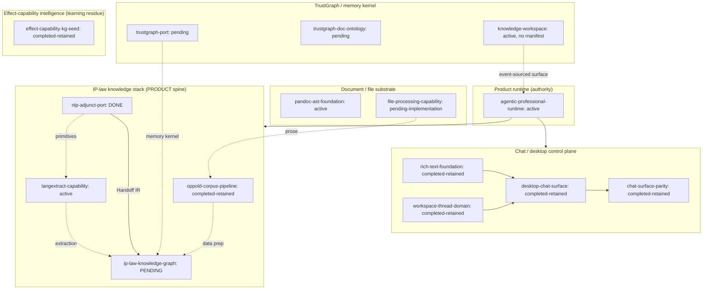

# 04 — Goals + Explorations Landscape

_Synthesis artifact for the `baseline-synthesis` exploration packet. Dated 2026-06-17._

> **Framing guardrail.** This artifact maps the repo's *planning surface*
> (`goals/` packets and the `explorations/` fuzzy front end), not shipped
> capability. Where a packet's status is anything other than a completed/merged
> state, treat it as **intent**, not built. The product is the solo IP-law firm
> flywheel for the user's father (sole active vertical; wealth-management
> dormant). The earlier software / repo-intelligence / code-AST / "L3 code
> intelligence" work was a *learning vehicle* and has been pruned — several
> packets below (e.g. `repo-codegraph`, `effect-capability-kg-seed`) are
> residue of that learning track, retained as evidence, not as the product moat.

---

## 1. Lifecycle conventions (how to read a packet)

Source: [`goals/README.md`](../../../goals/README.md) and
[`explorations/README.md`](../../../explorations/README.md) /
[`explorations/CLAUDE.md`](../../../explorations/CLAUDE.md).

**Goals (`goals/`)** — durable, execution-capable contracts. Directory names do
**not** encode state; lifecycle is declared in each `README.md` and
`ops/manifest.json`. Canonical states:

| State | Meaning |
| --- | --- |
| `active` | Execution open; packet must ship `GOAL.md` launcher. |
| `paused` | Intentionally stopped; resume conditions explicit. |
| `reference` | Retained design/research precedent; not directly executable. |
| `completed-retained` | Implementation/proof done; kept as evidence or launch context. |
| `removed` | Left the working tree; git history is the archive. |

Standard packet shape: `README.md` (orientation), `SPEC.md` (normative anchor,
`packetAnchorDocument`), `PLAN.md` (mutable plan), `GOAL.md` (≤4000-char `/goal`
launcher), `ops/manifest.json` (machine routing), `research/`, `history/`
(incl. `history/reflections/`). **Schema drift is real**: newer packets use
`initiative.status` + `agentLaunchers`; legacy packets (e.g.
`ip-law-knowledge-graph`, `nlp-adjunct-port`, `trustgraph-doc-ontology`) use
top-level `slug`/`status` with ad-hoc casing (`PENDING`, `DONE`). The README
explicitly tolerates these compatibility shapes. **Status strings are therefore
not normalized** — `pending`, `pending-implementation`, `PENDING`, `DONE` all
appear and must be read literally per packet.

**Explorations (`explorations/`)** — the fuzzy front end, upstream of code.
State machine: `capture → research → align → shape → decompose → graduate`
(loops allowed; park/kill exits at any stage), one artifact per stage
(`CAPTURE/RESEARCH/DECISIONS/BRIEF/MAP.md`). Manifest schema is
`exploration-manifest/v1` with `exploration.stage` + `exploration.status`
(`active` / `graduated`) and `links.goals` back-links. Graduation produces
`goals/` packets that link back, never copy.

---

## 2. Status board — the requested goal packets

> Statuses are quoted verbatim from each packet's `ops/manifest.json`
> (`initiative.status` / top-level `status`). "Cluster" is my thematic grouping
> (§4). "Depends-on" is from manifest `dependsOn` arrays where present, otherwise
> from README/SPEC prose (marked *prose*).

| Goal | Status (verbatim) | Cluster | Depends-on |
| --- | --- | --- | --- |
| `agentic-professional-runtime` | `active` | Product runtime (root authority) | — (defines the "why" for all clusters) |
| `workspace-thread-domain` | `completed-retained` | Chat/desktop control plane | — (foundation; feeds `desktop-chat-surface`) |
| `rich-text-foundation` | `completed-retained` | Chat/desktop control plane | — (`@beep/md`↔lexical↔editor; feeds `desktop-chat-surface`) |
| `desktop-chat-surface` | `completed-retained` | Chat/desktop control plane | `rich-text-foundation`, `workspace-thread-domain` |
| `chat-surface-parity` | `completed-retained` | Chat/desktop control plane | `desktop-chat-surface` |
| `pandoc-ast-foundation` | `active` | Document / rich-text substrate | `@beep/md` *(prose)* |
| `file-processing-capability` | `pending-implementation` | Document / file substrate | — (foundation below document mgmt) |
| `oppold-corpus-pipeline` | `completed-retained` | IP-law data prep (ahead-of-time) | `@beep/file-processing` manifests *(prose)* |
| `nlp-adjunct-port` | `DONE` | IP-law knowledge stack (upstream NLP) | — (ships `@beep/nlp`, `@beep/wink`, `@beep/nlp-mcp`) |
| `langextract-capability` | `active` | IP-law knowledge stack (extraction) | `@beep/nlp` primitives *(prose)* |
| `ip-law-knowledge-graph` | `PENDING` | IP-law knowledge stack (KG/ontology) | `@beep/nlp/Handoff` IR from `nlp-adjunct-port` *(prose)* |
| `trustgraph-port` | `pending` | TrustGraph / memory kernel | repo-memory architecture *(prose)* |
| `trustgraph-doc-ontology` | `pending` | TrustGraph / memory kernel | doc-memory exploration *(prose)* |
| `knowledge-workspace` | `active` | Knowledge surface (event-sourced) | repo-memory + expert-memory foundations *(prose; no manifest)* |
| `effect-capability-kg-seed` | `completed-retained` | Effect-capability intelligence (learning residue) | upstream AST/JSDoc facts *(prose)* |

**Data-quality notes (verified):**
- `knowledge-workspace` has **NO `ops/manifest.json`** (NOT FOUND); status `active`
  taken from its `README.md`. It also lacks `GOAL.md`, so it is not currently a
  launchable execution packet despite the `active` label.
- `trustgraph-port` has **NO `ops/manifest.json`** (its `ops/` dir holds only a
  `prompts/` subdir; PLAN/SPEC/research are top-level). Status `pending` is read
  from its `README.md` `## Status` heading, not a manifest field.
- Within the requested 15-packet slice, only two manifests declare
  machine-readable `dependsOn`:
  `chat-surface-parity → desktop-chat-surface` and
  `desktop-chat-surface → [rich-text-foundation, workspace-thread-domain]`.
  (Repo-wide there is a third, `oip-web-production-hardening → oip-web-launch`,
  outside this slice.) All other dependencies below are prose-level, not
  enforced metadata.

### Other packets present in `goals/` (beyond the requested set)

`ls goals/` returns 56 entries (54 packet dirs plus `README.md` and the
`_template` scaffold). The requested list is a slice. The remainder
cluster into recognizable families (enumerated, not deeply summarized, per focus):

- **Repo-quality / yeet operator:** `repo-quality-acceleration`,
  `repo-quality-convergence`, `repo-quality-throughput`, `fallow-*`
  (`advisory-ratchets`, `debt-burndown`, `quality-enforcement`, `zero-dead-code`),
  `lint-advisory-hardening`, `yeet-agent-ergonomics`, `yeet-operator-clarity`,
  `yeet-pr-closeout-loop`, `codex-security-findings-2026-06`.
- **Agent effectiveness / governance:** `agent-effectiveness-loop`,
  `-phoenix-enrichment`, `-workflow-integration`, `agent-governance-control-plane`,
  `agent-reflection-loop`, `ai-metrics-stack`, `jsdoc-worker-eval`,
  `unified-ai-toolchain`.
- **Repo-intelligence / code-AST (LEARNING-VEHICLE residue):** `repo-codegraph`,
  `repo-codegraph-jsdoc`, `repo-context-topology`, `canonical-slice-factory`,
  `dedup-clone-engine`, `beep-schema-topology`. *Per guardrail: do not frame
  these as product moat; they are the pruned/learning code-intelligence track.*
- **Schema-first / Effect platform:** `schema-first-v4-capabilities`,
  `schema-first-zero-actionables`, `effect-native-migration`.
- **Ontology / KG platform:** `ontology-modeling-foundation`,
  `ontology-interop-roadmap`, `agentic-cad-patent-tooling`.
- **Drivers / infra:** `box-driver`, `firecrawl-driver`, `stack-installer`,
  `storybook-app`, `canvas`, `oip-web-launch`, `oip-web-production-hardening`.

This breadth confirms the planning surface spans far beyond the IP-law product;
the IP-law cluster is the **active product spine**, the rest is substrate,
operator tooling, and learning residue.

---

## 3. Explorations front end (status)

Source: [`explorations/ATLAS.md`](../../ATLAS.md),
[`explorations/INBOX.md`](../../INBOX.md), and each `ops/manifest.json`
(`exploration-manifest/v1`).

| Exploration | Stage | Status | Updated | Graduated into (links.goals) |
| --- | --- | --- | --- | --- |
| `agent-chat-interface` | `graduate` | `graduated` | 2026-06-12 | `rich-text-foundation`, `workspace-thread-domain`, `desktop-chat-surface` |
| `docx-roundtrip-interop` | `graduate` | `graduated` | 2026-06-15 | `pandoc-ast-foundation` |
| `effect-capability-kg` | `graduate` | `active` | 2026-06-15 | `effect-capability-kg-seed` (seed scaffolded; later candidate goals uncreated pending seed proof) |
| `baseline-synthesis` | `research` | `active` | 2026-06-17 | _(this packet; no goals yet)_ |
| `_template` | `capture` | `active` | `YYYY-MM-DD` | — (scaffold template) |

**ATLAS state:** `INBOX.md` queue is **empty**. ATLAS lists one **Active**
exploration (`effect-capability-kg`), one **Proposed** (`atlas-synthesis` — the
grand-vision exercise, now unblocked because `agent-chat-interface` proved the
pipeline end-to-end), **Parked: none**, **Killed: none**. The proposed
`atlas-synthesis` is the likely successor/rename of `baseline-synthesis` (its
own open question raises that candidate rename).

**Outcomes anchor:** ATLAS seeds its "Outcomes" from
`goals/agentic-professional-runtime` — confirming that packet is the
product-definition root the whole tree points at, with the law-firm vertical
named the sole active vertical.

---

## 4. Thematic clusters

**Cluster narratives:**

1. **Product runtime (root):** `agentic-professional-runtime` is the single
   product-definition authority; everything else is justified relative to it.
   Its own status note (2026-06-11) demotes wealth-management to a dormant
   fixture, leaving the IP-law firm as the sole live proof.

2. **Chat / desktop control plane (DONE):** The most mature cluster. The
   `agent-chat-interface` exploration graduated into a clean
   foundation→surface→parity chain, all `completed-retained` (and
   `desktop-chat-surface` merged via PR #243). This is the agent control-plane
   workbench (`apps/professional-desktop`).

3. **Document / file substrate (in flight):** `pandoc-ast-foundation` (active,
   graduated from `docx-roundtrip-interop`) gives a schema-first Pandoc AST
   mirror; `file-processing-capability` (pending-implementation) defines the
   product-neutral extraction layer that document management and corpus
   ingestion will sit on. Neither is built-and-merged yet.

4. **IP-law knowledge stack (the product spine):** `oppold-corpus-pipeline`
   (completed-retained) is **ahead-of-time data prep** — it consolidated the
   25-year Oppold corpus into a governed home with a DuckDB catalog, *not* a
   live runtime feeder. `nlp-adjunct-port` (DONE) shipped `@beep/nlp` + driver +
   MCP and hands a generic graph IR to `ip-law-knowledge-graph` (PENDING), which
   owns the ontology and the generic→IP-law mapping. `langextract-capability`
   (active) adds source-grounded structured extraction reusing `@beep/nlp`.
   This cluster is the **most strategically central and the least complete** —
   the KG packet that ties it together is still PENDING with P0 open questions.

5. **TrustGraph / memory kernel:** `trustgraph-port` + `trustgraph-doc-ontology`
   (both pending) are the applied memory-architecture theory (the No-Escape /
   4-layer framing as *learned theory now pointed at law*, not shipping code).
   `knowledge-workspace` (active, but no manifest / no `GOAL.md`) is an
   event-sourced surface concept on top of these — the least operationalized
   packet in the set.

6. **Effect-capability intelligence (learning residue):**
   `effect-capability-kg-seed` (completed-retained, from `effect-capability-kg`)
   is a deterministic Effect-helper intelligence proof. Per guardrail this is
   part of the pruned code-intelligence learning track — retained as a proof,
   **not** the product moat.

---

## 5. Goals ↔ Explorations relationship

Verified from `links.goals` in each exploration manifest plus "Graduated from"
prose in the goal READMEs (bidirectional back-links confirmed):

| Exploration (stage/status) | Graduated goal packet(s) | Goal status |
| --- | --- | --- |
| `agent-chat-interface` (graduate / graduated, 2026-06-12) | `rich-text-foundation` | completed-retained |
| ↳ | `workspace-thread-domain` | completed-retained |
| ↳ | `desktop-chat-surface` (depends on the two above) | completed-retained |
| `docx-roundtrip-interop` (graduate / graduated, 2026-06-15) | `pandoc-ast-foundation` | active |
| `effect-capability-kg` (graduate / **active**, 2026-06-15) | `effect-capability-kg-seed` (seed only; later candidates uncreated) | completed-retained |
| `baseline-synthesis` (research / active, 2026-06-17) | — _(none yet; candidate rename → `atlas-synthesis`)_ |

**Tensions / gaps surfaced:**

- **No exploration → goal lineage for the IP-law spine.** The product-critical
  cluster (`nlp-adjunct-port`, `langextract-capability`, `ip-law-knowledge-graph`,
  `oppold-corpus-pipeline`) has **no graduating exploration** recorded in ATLAS
  or in `links.goals`. These packets predate or bypassed the fuzzy front end.
  The exploration pipeline has so far only crystallized chat-surface and
  document-AST work, plus the learning-residue capability KG — **not** the law
  product itself.
- **The most complete cluster is the control plane; the product spine is the
  least complete.** Everything `completed-retained` is either chat-surface or
  learning-residue; the IP-law KG that defines product value is `PENDING`.
- **`effect-capability-kg` exploration is still `active` while its seed goal is
  `completed-retained`** — the exploration is held open pending a decision on
  graduating further capability-router goals after the seed proof. Given the
  guardrail (pruned learning track), this open exploration is a candidate to
  park/kill rather than expand.
- **`knowledge-workspace` is `active` but structurally incomplete** (no
  manifest, no `GOAL.md`) — it cannot be launched as an execution packet in its
  current shape.

---

## Confidence & Caveats

**Verified (opened directly):**
- `goals/README.md`, `explorations/README.md`/`CLAUDE.md`, `explorations/ATLAS.md`,
  `explorations/INBOX.md` (lifecycle conventions, ATLAS sections, empty inbox).
- `ls goals/` (~55 packets) and `ls explorations/`.
- Status strings via `jq`/`head` on `ops/manifest.json` for all 15 requested
  goals and via README heads for intent.
- Exploration stages/statuses and `links.goals` for all 5 explorations
  (`docx-roundtrip-interop`, `agent-chat-interface`, `effect-capability-kg`,
  `baseline-synthesis`, `_template`).
- The only two machine-readable `dependsOn` arrays
  (`chat-surface-parity`, `desktop-chat-surface`).

**UNVERIFIED / inferred:**
- All "depends-on" entries marked *(prose)* come from README/SPEC narrative, not
  enforced manifest metadata — they reflect stated intent, not a validated graph.
- `trustgraph-port` status (`pending`) read from README `## Status`; the packet
  has **no `ops/manifest.json`** at all (verified 2026-06-17), so there is no
  manifest `status` field to confirm.
- Cluster groupings in §4 are my synthesis, not a repo-declared taxonomy.
- The `atlas-synthesis` → `baseline-synthesis` rename is a candidate raised in
  the packet's own open question, not a decision.
- I did **not** verify implementation/merge state of any package
  (`@beep/nlp`, `@beep/md`, `@beep/pandoc-ast`, `@beep/file-processing`, etc.);
  this artifact reports *packet planning state*, not shipped capability. The
  `nlp-adjunct-port` README cites PR #199 as merged, but that is its own claim,
  not independently confirmed here.

**NOT FOUND:**
- `goals/knowledge-workspace/ops/manifest.json` (absent) and `GOAL.md`.
- Any exploration that graduated into the IP-law knowledge-stack packets — no
  recorded fuzzy-front-end lineage for the product spine.
- Machine-readable graduation back-link fields in goal manifests
  (`sourceExploration`/`graduatedFrom`); the back-link lives only in README prose
  per the convention.

**Open questions for the next session:**
1. Should the IP-law product spine get a retroactive exploration/Atlas entry, or
   is it deliberately governed only by `agentic-professional-runtime`?
2. Should `effect-capability-kg` (active) be parked/killed given the pruning of
   the code-intelligence learning track?
3. Should `knowledge-workspace` be reshaped to packet standard (manifest +
   GOAL.md) or downgraded to `reference`?

### Verification (2026-06-17)

Adversarial spot-check of the in-repo claims by a skeptical verifier.

**Checked and confirmed:**
- All 15 requested goal packets exist; manifest `status` strings match the
  status board verbatim (`active`, `completed-retained`, `pending-implementation`,
  `DONE`, `PENDING`, `pending`). `nlp-adjunct-port` and `ip-law-knowledge-graph`
  use legacy top-level `slug`/`status` casing as described.
- `knowledge-workspace` has no `ops/manifest.json` and no `GOAL.md` (confirmed);
  it holds only design `.md` files + PLAN/SPEC/README. Status `active` is README-level.
- `agentic-professional-runtime` has no `GOAL.md` (ops/docs/fixtures/history present).
- All 5 exploration manifests match their stage/status/updated rows.
- Corpus CLI (`packages/tooling/tool/cli/src/commands/Corpus/`) and the data home
  (`/home/elpresidank/data-home/oppold-corpus/`) exist; `apps/professional-desktop`
  exists. No pruned `codegraph`/`repo-intel`/`repo-memory`/`code-ast` packages
  exist under `packages/` — guardrail respected, learning-residue not presented
  as live capability.

**Corrected:**
- Goals count was "~55"; actual `ls goals/` = 56 (54 packet dirs + README.md +
  _template). Tightened.
- `dependsOn` claim said "Only two manifests declare machine-readable
  `dependsOn`" as an absolute; repo-wide there is a third
  (`oip-web-production-hardening → oip-web-launch`). Re-scoped the claim to the
  requested 15-packet slice and noted the third.
- `trustgraph-port` manifest was hedged as "UNVERIFIED"; now positively
  verified — it has NO `ops/manifest.json` at all (only `ops/prompts/`), status
  is README-only. Updated both the data-quality note and the UNVERIFIED list.

**Remaining doubts:**
- All *(prose)* depends-on edges remain unverified as enforced metadata (by
  design — they are narrative).
- Implementation/merge state of packages (`@beep/nlp`, `@beep/md`,
  `@beep/pandoc-ast`, `@beep/file-processing`) and PR numbers (#199, #243) were
  not independently confirmed; this artifact reports packet planning state, not
  shipped capability, which is the correct framing.
