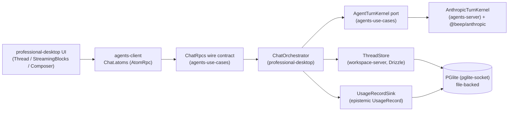

# 10 — Current Chat / Conversation / Runtime Stack (Current-State Inventory)

_Date: 2026-06-17_
_Scope: what EXISTS in the tree TODAY for the chat/conversation/runtime stack — domain → driver → kernel → orchestration → UI → runtime — verified against code, not goal docs. Reads on top of [`16-package-topology-census.md`](./16-package-topology-census.md)._

> GUARDRAIL: This inventories a **learning-vehicle** chat runtime, not the product. The chat surface is the proving ground where the user grounded themselves in Effect/schema-first/streaming/observability architecture. The memory-architecture framework (epistemic `UsageRecord`, "epistemic cost") shows up here as **applied schema/theory**, not a running memory engine. The PRODUCT (solo IP-law firm flywheel) is the `law-practice` slice + USPTO driver + Corpus CLI, none of which this chat stack feeds. Where this doc says a chat capability "ships", it means the code is present and wired; it is not a product claim.

---

## 1. The stack at a glance

The chat runtime is a vertical assembled from many slices. The data/control path:

| Layer | Package(s) | State |
|---|---|---|
| Conversation domain | `@beep/workspace-domain` (`Thread`, `Turn`, `Message`) | shipping |
| Persistence | `@beep/workspace-tables` + `@beep/workspace-server` ThreadStore | shipping (Drizzle + in-memory) |
| Turn kernel port | `@beep/agents-use-cases` (`AgentTurnKernel`, contracts) | shipping |
| Live driver | `@beep/anthropic` + `@beep/agents-server` (`AnthropicTurnKernel`) | shipping |
| Block validation/repair | `@beep/agents-server` (`ScanState`, `BlockRepair`) | shipping |
| Epistemic cost | `@beep/epistemic-domain` (`UsageRecord`) | shipping schema; **fixture-valued** at runtime |
| Rich-text pipeline | `@beep/md`, `@beep/lexical-schema`, `@beep/editor` | shipping |
| Client state | `@beep/agents-client` (`Chat.atoms`) | shipping |
| Chat surface | `apps/professional-desktop` | shipping |

---

## 2. Workspace slice — Thread / Turn / Message domain model

The conversation model lives in `@beep/workspace-domain` (NOT in `agents`). Three `BaseEntity.Class` models, all `$WorkspaceDomainId`-identified:

| Entity | File | Key fields | Persistence |
|---|---|---|---|
| `Thread` | `packages/workspace/domain/src/entities/Thread/Thread.model.ts` | `title`, `workspaceId` | text + entityId columns |
| `Turn` | `packages/workspace/domain/src/entities/Turn/Turn.model.ts` | `items` (TurnItems), `parentTurnId` (Option), `threadId`, `turnIndex` | jsonb `items`, indexed `parent_turn_id`/`thread_id`/`turn_index` |
| `Message` | `packages/workspace/domain/src/entities/Message/Message.model.ts` | `content` (`@beep/md` `Document`), `role`, `threadId`, `turnId` | jsonb `content`, literal `role` |

Notable design facts (all verified):
- **Branching is first-class in the schema.** `Turn.parentTurnId` is `S.OptionFromNullOr(TurnId)` — the edit-as-branch lineage is modeled at the domain level (`Turn.model.ts:180`), not synthesized in the UI.
- **`Turn` is an aggregate of typed items**, not a flat message. `TurnItem` is a 5-member tagged union (`message`, `tool_call`, `tool_result`, `artifact_ref`, `activity`) built with `LiteralKit` + `S.toTaggedUnion("itemType")` (`Turn.model.ts:102-132`). Tool-call/tool-result/artifact/activity item types exist in the model **today**, ahead of any runtime that emits them — only `message` items are produced by the live chat path.
- **`Message.content` is a `@beep/md` `Document`** (`Message.model.ts:9,69`), so message bodies are the canonical Markdown AST, stored as jsonb.
- **`MessageRole`** is `["system","user","assistant","agent","tool"]` (`Message.model.ts:30`) — broader than the live path uses (`user`/`assistant`).

Tables mirror these in `@beep/workspace-tables` with `.converters.ts` per entity (`Thread/Turn/Message` under `packages/workspace/tables/src/entities/`). The server tier (`@beep/workspace-server`) provides the `ThreadStore` aggregate as both a Drizzle repository (`ThreadStore.repo.ts`, `ThreadStoreDrizzleLayer`) and an in-memory layer (`ThreadStoreInMemoryLayer`), with a PGlite integration test (`workspace/server/test/integration/ThreadStoreDrizzleRepository.pglite.test.ts`) and a `ThreadTimeline` read-model test in `workspace/use-cases`.

### Local-first PGlite

Verified shipping in `apps/professional-desktop/src/runtime/Pglite.ts`: a **file-backed `PGlite`** instance is booted and exposed over the Postgres wire protocol via `PGLiteSocketServer` bound to loopback (`127.0.0.1:54399` default), then the repo's `PostgresClient`/`PostgresDrizzle` layers point at that socket. The db-admin Drizzle migrations (`packages/_internal/db-admin/drizzle`) are applied on boot, and the socket server is `Scope`-owned (started on acquire, `server.stop()`+`db.close()` on release). `CHAT_DB_PATH` defaults to a repo-local `.beep/professional-desktop/chat-db`. This is genuine local-first: the same in-process DB the integration tests run against.

---

## 3. Agents slice — the turn kernel

**Naming verified (resolves the prompt's question):** the slice on disk is `agents/` with packages `@beep/agents-{domain,server,client,use-cases}`. There is **no `agent-capability`** package or directory — the legacy rename has NOT landed (consistent with `16-package-topology-census.md`).

| Concern | Symbol | File |
|---|---|---|
| Kernel port (service tag) | `AgentTurnKernel` (`streamTurn(history) → Stream<IndexedBlock, TurnGenerationError>`) | `agents/use-cases/src/processes/AssistantTurn/AssistantTurn.kernel.ts` |
| Wire contracts | `TurnHistoryItem` (`user`/`assistant`), `IndexedBlock` | `.../AssistantTurn.contracts.ts` |
| Chat RPC group | `ChatRpcs` (ListThreads/CreateThread/GetTimeline/SendMessage/EditMessage) | `.../Chat/Chat.rpc.ts` |
| Live impl | `AnthropicTurnKernel` (`Layer.succeed(AgentTurnKernel)`) | `agents/server/src/AssistantTurn/AnthropicTurnKernel.ts` |
| Fixture impl | `FixtureTurnKernel` | `agents/use-cases/src/proof.ts` (deterministic, keyless) |
| Block scanner | `scanChunk`, `initialScanState`, `ScanState` | `agents/server/src/AssistantTurn/ScanState.ts` |
| Block repair | `repairInvalidBlocks`, `IssueReport` | `agents/server/src/AssistantTurn/BlockRepair.ts` |
| Provider codec | `assistantBlockOutput` | `agents/server/src/AssistantTurn/AnthropicTurnCodec.ts` |
| Block vocabulary | `AssistantContent`, `AssistantBlock`, `InlineNode` | `agents/domain/src/values/AssistantContent/AssistantContent.model.ts` |

The **kernel port is the seam** both implementations satisfy: a plain-text `TurnHistoryItem[]` in, a `Stream<IndexedBlock>` out. `SendMessage`/`EditMessage` RPCs are `stream: true` with `success: AssistantBlock` (`Chat.rpc.ts:93-123`) — the wire carries bare blocks; envelope ordering is a handler concern.

The `agents-domain` tier also carries `Agent` and `Skill` entities and an empty `turn/` re-export dir — these are domain models present today but not exercised by the live chat path (the chat path only uses `AssistantContent`).

### `AssistantContent` block vocabulary (the structured-output envelope)

`AssistantContent.model.ts` defines a **stratified, non-recursive** block→inline schema (blocks contain inlines, inlines contain nothing) so it compiles to clean JSON-Schema for forced-tool generation. Verified members:

- Inlines: `TextInline` (bold/italic/code flags), `LinkInline`.
- Blocks: `ParagraphBlock`, `HeadingBlock` (`h1`/`h2`/`h3`), `QuoteBlock`, `ListBlock` (bullet/number), `CodeBlock`, `TableBlock`, `YouTubeBlock`.
- **Rich-block invariants are enforced in-schema:** tables must be rectangular and non-empty (`RectangularTableRows` filter, lines 328-354); YouTube must be a bare 11-char id (`YouTubeVideoId` pattern, lines 356-367). **Mermaid is NOT a separate block** — it is a `CodeBlock` with `language: "mermaid"` (the system prompt instructs this, `AnthropicTurnKernel.ts:41`).

---

## 4. The `@beep/anthropic` driver + the streaming/validate/repair kernel

`@beep/anthropic` (5 src files) is a thin Effect-AI wrapper:
- `AnthropicLive` — client layer from `AnthropicClient.layerConfig` with a redacted `AI_ANTHROPIC_API_KEY` (`Anthropic.service.ts:34`).
- `AnthropicLanguageModelLive` — the pinned-model language-model layer.
- `AnthropicTurnPlan` — an `ExecutionPlan` that **retries only retryable `AiError`s** (auth/invalid-request fail fast), exponential backoff (`Anthropic.service.ts:102-108`).
- `generateAnthropicToolJson` / `AnthropicStructuredOutput` / `RepairError` — used by `BlockRepair`.

The kernel (`AnthropicTurnKernel.ts`) is the substantive piece. Verified mechanics:
1. **Forced-tool structured output.** A single non-strict `respond` Tool whose parameters schema is `AssistantContent`, forced via `toolChoice: { tool: "respond" }`, with `disableToolCallResolution: true` (lines 56-61, 121-130). `Tool.Strict` is set `false` because the block union exceeds grammar-compilation limits — blocks are validated by the scanner instead.
2. **Incremental block extraction.** `input_json_delta` SSE → `tool-params-delta` parts → `scanChunk` (a hand-rolled JSON-depth/string-escape scanner, `ScanState.ts`) incrementally emits each completed element of the top-level `"blocks"` array as it closes.
3. **Validate-and-route streaming.** Each slice is decoded through the per-block codec; valid blocks stream immediately (`tool-params-end` boundary). The first failure flips a `holdingAfterFailure` ref; subsequent valid blocks are buffered so the repair tail can re-emit everything in original envelope order (lines 75-111, 139-159).
4. **Haiku-style repair tail.** Failed slices are collected into `IssueReport`s and sent through `repairInvalidBlocks` (`BlockRepair.ts`): up to `REPAIR_ATTEMPTS = 2` repair calls via a forced `repair` tool, each returned block re-encoded → re-decoded → codec-checked, with a `JsonPatch` diff logged. Unrepairable blocks are **dropped and logged**, not failed (lines 319-324). Repair-call failures DO become turn failures.
5. **Metrics throughout:** `agents_assistant_turn_blocks_total{result}`, `agents_assistant_turn_blocks_repaired_total{outcome}`.

> The prompt's phrase "block validation/repair via Haiku" is **substantively accurate** but note the model is **not pinned to Haiku in the code I read** — the repair call uses the same `generateAnthropicToolJson` path against the default Anthropic model (`Anthropic.config.ts` `ANTHROPIC_DEFAULT_MODEL`). I did not open the config constant to confirm which model; marking the specific "Haiku" identity **UNVERIFIED** (the repair *mechanism* is verified).

Tests present: `agents/server/test/{AnthropicTurnCodec,BlockRepair,scanChunk}.test.ts`; `drivers/anthropic/test/{Anthropic,Anthropic.repair}.test.ts`.

---

## 5. Epistemic cost path (`UsageRecord`)

`@beep/epistemic-domain`'s `UsageRecord` (`entities/UsageRecord/UsageRecord.model.ts`) is the applied memory-architecture theory: an **append-only attribution record** linked to an epistemic `Activity`, with `provider`, `model`, `inputTokens`/`outputTokens`/`totalTokens`, `costUsdApproxMicros`, `latencyMillis`, `actor` (`Principal`), and a OnePassword `credentialReference` — all token/cost/latency fields are `Option` (nullable). A `TurnFinalizationUsageAppend` boundary command + `appendTurnFinalizationUsageRecord` constructor (lines 106-132) are the turn-finalization entrypoint.

**Critical shipping-vs-partial finding:** the runtime path is **wired but fixture-valued**. `ChatOrchestrator.ts:232-257` constructs `fixtureUsageRecord` with `provider: "fixture"`, `model: "fixture"`, and **every token/cost/latency field `null`**, with a `TODO(live sidecar)` to "carry real provider/model/token/latency from the kernel turn-meta and a real request principal/activity once the Anthropic kernel and the sidecar request context land." So: the cost schema is real, the sink is real (`UsageRecordSink` → `UsageRecordSinkDrizzle` persists to PGlite `usage_record`, tested in `UsageRecordSink.pglite.test.ts`), but **no real tokens/cost are recorded yet**. The UI's `CostRollup` (`Thread.tsx:57-60`) renders `costMicros/1e6` and is therefore **always blank** on the live path (it only shows when `costMicros > 0`). This is the seam where epistemic cost is theory-applied-as-schema but not yet a live signal.

---

## 6. Rich-text pipeline (`@beep/md` / `@beep/lexical-schema` / `@beep/editor`)

Three cooperating packages, all shipping:

| Package | Role | Evidence |
|---|---|---|
| `@beep/md` | Canonical Markdown AST schema (`Document`, `Block`, `Inline`) + Markdown renderer (`Md.render.ts`) | `packages/foundation/modeling/md/src/Md.model.ts`, `index.ts` re-exports model/render/utils |
| `@beep/lexical-schema` | Md ↔ Lexical codecs with a documented lossiness profile | `packages/foundation/modeling/lexical/src/Lexical.codec.ts:1-12` (header documents drops: alignment, indent, underline, NodeState) |
| `@beep/editor` | React/Lexical editor kit: `EditorComposer`, `EditorViewer`, node registration, theme, **`MermaidView`, `MermaidCodeDecoratorPlugin`, `YouTubeEmbed`, `YouTubeNode`, `ArtifactRefNode`** | `packages/foundation/ui-system/editor/src/index.ts` (full export list verified) |

The two render paths are distinct and both present:
- **Persisted messages** render through Lexical (`MessageView` → `@beep/editor` viewer over `@beep/md` `Document`).
- **In-flight streaming** renders through a **standalone lightweight DOM renderer** (`StreamingBlocks.tsx`) that maps `AssistantBlock` directly to JSX — **no Lexical, no schema decode** — so blocks paint as each finishes. It reuses `@beep/editor`'s `MermaidView`/`YouTubeEmbed` for rich blocks (lines 16-17, 167-176). Tables render as real `<table>` with header-row support; mermaid code blocks render as SVG; YouTube as an iframe embed. This is the "rich blocks: mermaid / tables / youtube" parity feature — **shipping**.

---

## 7. apps/professional-desktop chat surface + parity features

The desktop app (16 src files) is the live chat surface. Components verified:
`App.tsx`, `chat/ChatOrchestrator.ts`, `chat/UsageRecordSink.ts`, `chat/ui/{ChatApp,Composer,MessageView,Sidebar,StreamingBlocks,Thread,ChatTurnErrorToasts}.tsx`, `runtime/{Layer,Observability,Pglite,ProfessionalAtomProvider,ProfessionalAtomRuntime}.ts(x)`.

### Parity-feature scorecard (verified against code)

| Feature | State | Evidence |
|---|---|---|
| **Streamed block turns** | ✅ shipping | `Chat.rpc.ts` stream RPCs; `runTurnAtom` appends blocks via `Stream.runForEach` (`Chat.atoms.ts:455-468`); `StreamingBlocks` paints incrementally |
| **Edit-as-branch** | ✅ shipping | `Turn.parentTurnId` lineage; `editMessage` appends a user turn with `parentTurnId: O.some(turnId)` (`ChatOrchestrator.ts:464-465`); UI Edit control + sibling-branch detection + optimistic tail-hide (`Thread.tsx:99-159`) |
| **Cancel-in-flight (no partial row)** | ✅ shipping | SPEC enforced both sides: server persists assistant turn **only on `Stream.onEnd`** (success), nothing on interrupt (`ChatOrchestrator.ts:1-12, 317-356`); client `Stop` button writes `Atom.Interrupt`, cleanup via registry/reactivity because `ctx` is disposed on interrupt (`Thread.tsx:201`, `Chat.atoms.ts:482-493`) |
| **Block validation + repair tail** | ✅ shipping | `AnthropicTurnKernel` route+repair (§4) |
| **Rich blocks (mermaid/tables/youtube)** | ✅ shipping | `StreamingBlocks` + `@beep/editor` (§6) |
| **Thread title derivation** | ✅ shipping | `deriveThreadTitle` from first user message, with edit-guard (`ChatOrchestrator.ts:118-176, 369-405`) |
| **Drafts persistence** | ✅ shipping | `draftAtoms` via `Atom.kvs` over `localStorage` (`Chat.atoms.ts:189-196`) |
| **Observability / DevTools / OTLP** | ✅ shipping (env-gated) | `Observability.ts`: effect-native OTLP exporter gated on `OTEL_EXPORTER_OTLP_ENDPOINT`; Effect DevTools websocket mirror gated on `DEVTOOLS` (`@beep/observability/server`); client spans threaded onto rpc envelopes via `ClientObservabilityLive` (`Chat.atoms.ts:53`) |
| **Quality metrics** | ✅ shipping | server: `agents_chat_turns_total`, `agents_chat_turn_duration`, `agents_chat_blocks_streamed_total`, failure counters; client: `ui_turn_perceived_latency` (send→first block), `ui_editor_decode_failures_total` |
| **Epistemic cost (live tokens/$)** | ⚠️ partial | schema + sink shipping; runtime value is `"fixture"`/`null` (§5) |
| **Grafana dashboards** | ❓ NOT FOUND in this scope | OTLP export is shipping, but no Grafana dashboard JSON/config was found under the chat app or `@beep/observability` in this investigation — marking **NOT FOUND / UNVERIFIED** (telemetry is emitted; a Grafana consumer was not located) |

### Runtime wiring (sidecar)

`runtime/Layer.ts` assembles `RuntimeLive`: `ChatHandlersLive` (the `ChatRpcs` group) provided with `TurnKernelLive` (selects `AnthropicTurnKernel` by default, `FixtureTurnKernel` when `CHAT_AGENT=fixture`), `Thread.ThreadStoreDrizzleLayer`, and `UsageRecordSinkDrizzle`, all over one shared `PgliteDrizzleLive`, with `ObservabilityLive` merged. A `RuntimeTest` variant uses fixture kernel + in-memory store/sink (no DB, no key). The client (`Chat.atoms.ts`) is an `AtomRpc.Service` over NDJSON HTTP to `/rpc` (origin-relative in dev, `127.0.0.1:3939` packaged).

**Live-vs-fixture is a single env flag** (`CHAT_AGENT`). The live Anthropic path is real and exercised by an opt-in token-spending E2E (`apps/professional-desktop/test/integration/chat-real-anthropic.e2e.test.ts`, gated on `BEEP_TEST_REAL_ANTHROPIC_CHAT=1` + a real key). So "live Anthropic chat" is **shipping but gated**, while the default-runnable proof path is fixture + PGlite.

---

## 8. Tensions & gaps

- **Domain is richer than the live path.** `Turn` models tool-call/tool-result/artifact-ref/activity items; `agents-domain` has `Agent`/`Skill`; `MessageRole` includes `agent`/`tool`/`system`. The live chat path only produces `message` items with `user`/`assistant` roles. These are present-but-dormant capabilities — schema ahead of runtime.
- **Epistemic cost is the clearest theory-vs-runtime seam.** The whole `UsageRecord`/`Activity` apparatus exists and persists, but the chat path appends a fixture record. Real token/cost/latency attribution is an explicit `TODO`. The "epistemic cost path" is therefore *modeled and wired* but *not yet measuring*.
- **Two rich-text renderers.** Streaming uses a bespoke DOM renderer; persisted uses Lexical. Intentional (paint-as-you-stream vs. canonical AST), but it means rich-block rendering logic exists in two places (`StreamingBlocks.tsx` and `@beep/editor`).
- **Grafana** is asserted in the prompt's parity list but I located only the OTLP/DevTools export side, not a dashboard artifact — gap flagged.

---

## Confidence & Caveats

**Verified (files opened directly):**
- Workspace domain models `Thread`/`Turn`/`Message` (field-by-field), incl. `Turn.parentTurnId` branching and the `TurnItem` union.
- Agents slice naming = `agents` (not `agent-capability`); kernel port `AgentTurnKernel`; `ChatRpcs` stream contracts; `IndexedBlock`/`TurnHistoryItem`.
- `AnthropicTurnKernel` forced-tool + scan + validate-route + repair-tail mechanics; `BlockRepair` 2-attempt repair with drop-on-fail; `ScanState` scanner.
- `@beep/anthropic` `AnthropicLive`/`AnthropicTurnPlan` retry policy.
- `AssistantContent` block vocabulary + rectangular-table / youtube-id in-schema invariants; mermaid-as-code-block.
- `ChatOrchestrator` cancel-no-partial (`Stream.onEnd`), edit-as-branch, title derivation, fixture usage record.
- `Chat.atoms` streaming/interrupt-cleanup, drafts, perceived-latency metric.
- `Pglite.ts` file-backed pglite-socket local-first DB + boot migrations; `runtime/Layer.ts` sidecar wiring; `Observability.ts` OTLP + DevTools.
- `UsageRecord` model + `TurnFinalizationUsageAppend`; `UsageRecordSink` port.
- Rich-text trio: `@beep/md` index exports, `@beep/lexical-schema` codec lossiness header, `@beep/editor` mermaid/youtube/artifact-ref exports.
- Test inventory across the slices (listed in §3–§7).

**UNVERIFIED:**
- That the repair model is specifically **Haiku** — the repair *mechanism* is verified, but the model identity resolves through `ANTHROPIC_DEFAULT_MODEL` in `Anthropic.config.ts`, which I did not open. The prompt's "via Haiku" describes the *repair pass*, which exists; the model pin is unconfirmed.
- Exact behavior of `scanChunk` beyond its documented purpose (read the type/header, not the full scan algorithm).
- `workspace-server` ThreadStore query internals (confirmed it exists in Drizzle + in-memory form via file list + Layer.ts references; did not read `ThreadStore.repo.ts` line-by-line).

**NOT FOUND:**
- No Grafana dashboard/config artifact in the chat app or `@beep/observability` surface within this investigation — OTLP export exists, a Grafana consumer was not located.
- No `agent-capability` package/dir (rename not applied).
- No real-token usage attribution on the live chat path (fixture-valued by design, with a TODO).

**Open questions for downstream agents:**
- When the "live sidecar request context" TODO lands, does the kernel need to surface turn-meta (tokens/cost/latency) through the `AgentTurnKernel` port, or via a side channel? The port currently returns only `IndexedBlock`s.
- Is the dormant `Turn` item vocabulary (tool_call/activity/artifact_ref) intended for this chat runtime or carried for a future agent runtime? Topology shows the types but no producer.

### Verification (2026-06-17)

Adversarial in-repo spot-check by a skeptical verifier. Result: claims hold; one path-citation error corrected.

**Checked and confirmed present (via `ls`/`grep`):**
- Every cited file in §2–§7 exists at the stated path: the three workspace models; the `agents/{use-cases,server,domain,client}` slice (kernel port, `Chat.rpc.ts`, `AnthropicTurnKernel.ts`, `ScanState.ts`, `BlockRepair.ts`, `AnthropicTurnCodec.ts`, `AssistantContent.model.ts`, `proof.ts`); `Chat.atoms.ts`; the four desktop runtime files (`Pglite.ts`, `Layer.ts`, `Observability.ts`) and chat UI (`ChatOrchestrator.ts`, `Thread.tsx`, `StreamingBlocks.tsx`, `UsageRecordSink.ts`); the opt-in real-Anthropic E2E test.
- Load-bearing claims confirmed at the cited lines: `Turn.parentTurnId: S.OptionFromNullOr(...)` (Turn.model.ts:180); `fixtureUsageRecord` with `provider/model: "fixture"` + `TODO(live sidecar)` (ChatOrchestrator.ts:228/232/251); mermaid-as-code-block system-prompt instruction (AnthropicTurnKernel.ts:41), `toolChoice` (127), `disableToolCallResolution: true` (128), `Tool.Strict` false (59); `REPAIR_ATTEMPTS = 2` (BlockRepair.ts:24); `TurnFinalizationUsageAppend`/`appendTurnFinalizationUsageRecord` (UsageRecord.model.ts:106/131); `Stream.onEnd` cancel-no-partial doc-comment + persist-once `Ref` guard (ChatOrchestrator.ts:7-11, 312-317).
- Guardrail check: nothing pruned (repo-intelligence / code-AST / L3) is presented as present capability; `agent-capability` package/dir confirmed absent. "Specced/planned" is not conflated with "built" — the doc correctly flags epistemic cost as fixture-valued (TODO), the dormant Turn-item vocabulary as schema-ahead-of-runtime, and Grafana as NOT FOUND.

**Corrected:**
- §6 rich-text table cited abbreviated paths (`md/src/...`, `lexical/src/...`, `editor/src/...`). Actual locations are `packages/foundation/modeling/md`, `packages/foundation/modeling/lexical`, and `packages/foundation/ui-system/editor`. Paths expanded to full repo-relative form. Filenames (`Md.model.ts`, `Lexical.codec.ts`, `index.ts`) and editor mermaid/youtube/artifact-ref exports independently confirmed.

**Remaining doubts (unchanged from doc's own caveats):**
- Repair-model "Haiku" identity still UNVERIFIED (resolves through `ANTHROPIC_DEFAULT_MODEL`); mechanism verified, model pin not.
- Did not re-read `ScanState` scan algorithm or `ThreadStore.repo.ts` internals line-by-line; existence and roles confirmed.
- Grafana dashboard artifact: re-ran `grep -ril grafana` over `@beep/observability` + desktop app — zero hits, consistent with the doc's NOT FOUND.
