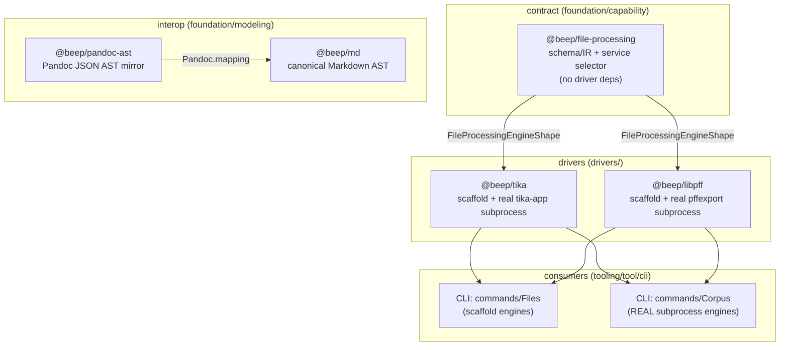

# 11 — Current Document-Processing / Interop Stack (Inventory)

_Date: 2026-06-17_
_Scope: current-state inventory of the document-processing & interop stack in `beep-effect3` — `@beep/file-processing`, the `@beep/tika` and `@beep/libpff` drivers, the `@beep/pandoc-ast` ↔ `@beep/md` interop slice, and a glance at the Corpus CLI. Substrate read first: [`16-package-topology-census.md`](./16-package-topology-census.md)._

> GUARDRAIL: This stack is **data-prep / interop plumbing**, not the product. The product is the solo IP-law firm flywheel (`law-practice` slice + `@beep/uspto` + Corpus CLI). The document stack is the ahead-of-time pipeline that turns the father's IP-law document corpus into structured artifacts; it is a *feeder for offline prep*, not a live product runtime. Treat the memory-architecture theory (No-Escape / 4-layer) as **applied theory**, not shipping code; nothing in this stack is the "L3 code-intelligence" that was pruned.

---

## 1. The stack at a glance

The document stack is a clean **contract → driver → CLI** layering, all schema-first and runtime-neutral:

Key facts that frame everything below:

| Claim | Verified-on-disk state |
|---|---|
| `@beep/file-processing` is "pending-implementation" (goal manifest) | **Stale label.** The contract package is fully written and has 4 real importers. See §2 + §6 tension. |
| `@beep/file-processing` has zero driver deps | ✅ deps are only `@beep/identity`, `@beep/schema`, `@beep/utils`, `effect` (`package.json`). Pure contract + in-memory selector. |
| `tika`/`libpff` drivers exist and wrap binaries | ✅ Both ship a **scaffold engine** (typed deferrals) *and* a **real subprocess engine** (`java -jar tika-app.jar` / `pffexport`). |
| `pandoc-ast` mirrors Pandoc JSON + maps to `@beep/md` | ✅ Built: model/codec/mapping/report all present; goal status `active`, P3 ("Close") pending. |
| Corpus CLI is the live feeder | ⚠️ It is the only consumer wiring the **real** subprocess engines, but per guardrail it is **offline curation/enrich**, not a product runtime. |

---

## 2. `@beep/file-processing` — the contract IR (built, not "pending")

Path: `packages/foundation/capability/file-processing/`. Description in its own `package.json`: _"Runtime-neutral schema-first file processing capability contracts and manifest models."_ Seven `src` modules, all opened:

| Module | Path | What it actually contains (verified) |
|---|---|---|
| `Artifact` | `src/Artifact/index.ts` | `ArtifactId`/`OperationId`/`ContentDigest` template-literal IDs over `Sha256Hex`; `deriveArtifactId` (content-addressed via `\x1f`-joined parts); `ArtifactLocator` (`file`/`synthetic`/`memory`); `SourceArtifact`; `ArtifactReference`. |
| `Strategy` | `src/Strategy/index.ts` | The format/engine vocabulary: `FileFormatFamily` (14 literals: `doc, docx, docm, rtf, html, xhtml, pdf-text-layer, pst, plain-text, markdown, image-metadata, xls, xlsx, unknown`), `FileProcessingEngineFamily` (`auto, tika, libpff, test`), `FileProcessingCapability` (`detect, extract-text, extract-metadata, export-children`), `FileProcessingSkipReason`, `SelectedStrategy` union, `FileProcessingEngineDescriptor`, and `classifyFormatFromExtension` (deterministic `Match.type` extension→format). |
| `Operation` | `src/Operation/index.ts` | Request schemas (`DetectFileOperation`, `ExtractFileOperation`, `ExportArchiveOperation`, `ProcessFileOperation`, `DetectionResult`) + `FileProcessingOperationError` (a `TaggedErrorClass` with `fromReason`) and the `FileProcessingOperationErrorReason` literal kit. |
| `Extraction` | `src/Extraction/index.ts` | The result/manifest IR (largest module): `ExtractionResult`, `ArchiveExportResult`, tagged `ProcessFileResult` union (`extracted`/`archive-exported`/`skipped`), JSONL-safe `SourceProcessingRecord` + `FileProcessingFailureRecord` unions, `ProcessRunManifest` (`manifestVersion: "beep.file-processing.run.v1"`), `FileProcessingCoverageSummary`, and JSON/JSONL encoders (`encodeProcessRunManifestJson`, etc.). |
| `Service` | `src/Service/index.ts` | `FileProcessingEngineShape` (the driver contract: `descriptor`+`detect`/`extract`/`exportArchive`), `FileProcessingServiceShape` (adds `process`), the `FileProcessingService` `Context.Service` tag, and **`makeFileProcessingServiceLayer(engines)`** — a real in-memory engine-selection orchestrator (`selectEngine`, `detectWithAvailableEngine`, capability/format/preference matching) plus `detectFile`/`extractFile`/`exportArchive`/`processFile` use-case fns. |
| `index` | `src/index.ts` | Re-exports the 5 namespaces above. |
| `test` | `src/test.ts` | `TestFileProcessingEngine` + descriptor — a synthetic in-tree engine implementing `FileProcessingEngineShape` for fixtures (supports all caps incl. PST export). Exported as the package's `./test` entry. |

**Built vs specced verdict:** This is **implemented, contract-only-by-design**, not a stub. The "engine" is an injected `ReadonlyArray<FileProcessingEngineShape>`; the package never imports a driver. Drivers supply the concrete engines, the CLI composes them. The selector logic (`process` folds detect → extract|exportArchive|skip, PST-aware) is real, tested by the synthetic engine, and exercised by 4 importers (§5).

---

## 3. `@beep/tika` — Apache Tika driver (scaffold + real subprocess)

Path: `packages/drivers/tika/` (4 `src` files). Depends on `@beep/file-processing` (workspace), `@beep/identity`, `@beep/schema`, `@beep/utils`, `effect`. **Two engines coexist**, both satisfying `FileProcessingEngineShape`:

| Engine | File | Status | Behavior |
|---|---|---|---|
| `TikaFileProcessingEngine` / `makeTikaFileProcessingEngine()` | `src/Tika.service.ts` | **Scaffold ("P1 proof")** | Detect via `classifyFormatFromExtension`; extract handles `html/xhtml/markdown/plain-text` by decoding source bytes/text inline, returns `metadata-only` for `image-metadata`, and emits **typed deferrals** (`engine-unavailable`) for `doc/docx/rtf/pdf-text-layer` and `unsupported-file-format` for `docm/xls/xlsx`. No archive export. |
| `makeTikaAppFileProcessingEngine(config)` | `src/Tika.tikaapp.ts` | **Real binary wrapper** | Captures `ChildProcessSpawner` (from `effect/unstable/process`), spawns `java -jar <jarPath> -J -t <file>`, parses Tika's `-J` JSON, extracts `X-TIKA:content` as text + stringifies metadata. Config schema `TikaAppEngineConfig` (`jarPath`, optional `javaPath`/`timeoutMillis`; default 120s, force-kill 10s). Requires a `file`-kind locator. |

Descriptor advertises `engine: "tika"`, capabilities `detect, extract-text, extract-metadata`, and all non-PST formats. So tika "wraps" the **Apache Tika `tika-app.jar` via a Java subprocess** — there is no embedded Tika; it shells out. The scaffold is the offline/no-runtime fallback; the tika-app engine is the production path.

> Note: `drivers/tika/CLAUDE.md` Surface Map is stale — it lists only `VERSION` as a key export, which does not reflect the engine surface actually present in `src`.

---

## 4. `@beep/libpff` — PST/Outlook driver (scaffold + real pffexport)

Path: `packages/drivers/libpff/` (4 `src` files). Same two-engine pattern, scoped to PST archives:

| Engine | File | Status | Behavior |
|---|---|---|---|
| `LibpffFileProcessingEngine` / `makeLibpffFileProcessingEngine(opts)` | `src/Libpff.service.ts` | **Scaffold** | Detect: `pst` extension → `pst` (confidence 1) else `unknown`. `exportArchive` for PST: if `opts.syntheticExport === true`, emits one synthetic child artifact (`children/synthetic-libpff-message.txt`, content-addressed via `deriveArtifactId`); otherwise a typed `engine-unavailable` deferral. `extract` always `unsupported-file-format` (libpff is export-only). Capabilities: `detect, export-children`. |
| `makePffexportFileProcessingEngine(config)` | `src/Libpff.pffexport.ts` | **Real binary wrapper** | Wraps the libpff CLI **`pffexport`** via `ChildProcessSpawner`; `PffexportMode` literal kit (`all`/`items`/`recovered`), uses `FileSystem`/`Path`/`Stream`, config `PffexportEngineConfig` (incl. `pffexportPath`). Materializes PST children into artifact references. |

So libpff "wraps" the **`pffexport` binary** (part of libpff/libyal), not an in-process binding. Like tika, the scaffold is the no-runtime path and `pffexport` is the production path. `drivers/libpff/CLAUDE.md` Surface Map is similarly stale (`VERSION` only).

---

## 5. Who consumes the contract (driver wiring)

`grep` for `@beep/file-processing` importers outside the package itself (excluding `dist/`):

| Consumer | What it wires |
|---|---|
| `@beep/tika` (`Tika.service.ts`, `Tika.tikaapp.ts`) | Implements `FileProcessingEngineShape`. |
| `@beep/libpff` (`Libpff.service.ts`, `Libpff.pffexport.ts`) | Implements `FileProcessingEngineShape`. |
| `@beep/identity` (`packages.ts`) | Registers the `$FileProcessingId` package identity namespace. |
| CLI `commands/Files` (`Files.service.ts`) | Composes engines via `processEngineFor` → uses the **scaffold** `makeTikaFileProcessingEngine()` / `makeLibpffFileProcessingEngine()` (+ `TestFileProcessingEngine`). Emits the V1 `processFiles` proof manifest tree (`ProcessRunManifest.make` with `manifestVersion: "beep.file-processing.run.v1"` at `Files.service.ts:4628`; public `processFiles` export at `:5628`). |
| CLI `commands/Corpus` (`Corpus.service.ts`) | Composes the **real** subprocess engines: `makePffexportFileProcessingEngine(PffexportEngineConfig…)` + `makeTikaAppFileProcessingEngine(TikaAppEngineConfig…)`, then `makeFileProcessingServiceLayer([libpff, tika])` (`Corpus.service.ts:780–981`). Requires `FileSystem | Path | ChildProcessSpawner`. |

**Important asymmetry:** the generic `beep files process` proof uses the *scaffold* engines (deterministic, no external binaries); the *Corpus* command is the only place the *real* Java/pffexport subprocesses are actually invoked. That matches the guardrail: real binary extraction lives in the offline corpus-prep tool.

---

## 6. The `pandoc-ast` ↔ `md` interop slice

Two foundation/modeling packages form a lossless-as-possible Markdown round-trip path. Goal packet `pandoc-ast-foundation` manifest status: `active`, phases P0–P2 `completed`, **P3 ("Close") pending** — consistent with the prompt's "active, P3-close pending."

### `@beep/pandoc-ast` — Pandoc JSON AST mirror (built)
Path: `packages/foundation/modeling/pandoc-ast/` (5 `src` files):

| File | Role |
|---|---|
| `Pandoc.model.ts` | Schema-first mirror of the Pandoc JSON AST (`PandocApiVersion`, block/inline node classes: `Header`, `Para`, `BlockQuote`, `BulletList`, `CodeBlock`, `Div`, `Emph`, `Code`, `Table`, etc.). |
| `Pandoc.codec.ts` | Pandoc JSON **wire codecs** (decode/encode the on-wire Pandoc `-t json` shape into the model). |
| `Pandoc.mapping.ts` | **Compatibility mapping** Pandoc AST ↔ canonical `@beep/md` AST (`import * as Md from "@beep/md/Md.model"`); uses `Match.tagsExhaustive` over node tags. |
| `Pandoc.report.ts` | Compatibility-report models — tracks mapping `severity` (`lossy`/`unsupported`) and direction. |

**Fidelity gaps are explicit, not silent:** the mapping records `severity: "unsupported"` for constructs like `Note`, `Math`, and Pandoc-attributed `Table`s, and `"lossy"` where attributes can't round-trip (`Pandoc.mapping.ts` ~lines 265–277, 603–642, 833–837). This is the "P3-close pending" surface: the mapping is built and reports its own lossiness rather than claiming total coverage.

### `@beep/md` — canonical Markdown AST (built)
Path: `packages/foundation/modeling/md/` (5 `src` files): `Md.model.ts` (the node taxonomy), `Md.ts` (builder/content-input types: `InlineContent`, `BlockContent`, template builders), `Md.render.ts` (render adapters: `PureRenderAdapter`, `renderFencedCode`/`renderInlineCode`, typed `RenderError`), `Md.utils.ts`.

`Md.model.ts` node inventory (verified `S.TaggedClass`/union members):
- **Inline:** `Text, RawMarkdown, RawHtml, Strong, Em, Del, Code, A, Img, Br` (`Inline` union).
- **Block:** `P, H1…H6, Li/Ul/Ol, TaskItem/TaskList, BlockQuote, Pre, TableCell/TableRow/Table, YouTube, Hr` (`Block` union), wrapped by `Document`.

So `@beep/md` is the **canonical/owned** document model; `@beep/pandoc-ast` is the **interop adapter** that lets external Pandoc-converted documents (the broad office/HTML/RTF universe Tika feeds) land in the owned AST. The relationship: external bytes → tika text/HTML → (Pandoc, externally) → Pandoc JSON → `pandoc-ast` codec → `pandoc-ast` mapping → `@beep/md`. Note: Pandoc itself is **not wrapped as a driver in this repo** — there is no `@beep/pandoc` binary driver (NOT FOUND); `pandoc-ast` only models/maps the JSON Pandoc would emit. The actual Pandoc invocation step is UNVERIFIED / appears out-of-tree.

---

## 7. Corpus CLI at a glance (deep-dive → corpus-data artifact)

Path: `packages/tooling/tool/cli/src/commands/Corpus/`. Per the topology census and guardrail, this is **ahead-of-time curation/enrichment of the Oppold corpus** (`/home/elpresidank/data-home/oppold-corpus/`), not a live product feeder. Its relevance *here*: it is the **only** wiring point for the real Tika/pffexport subprocess engines (`Corpus.service.ts:780–981`), driving `makeFileProcessingServiceLayer` against `[pffexport, tika-app]` with `FileSystem | Path | ChildProcessSpawner` requirements. Everything else about Corpus (catalog/enrich options, recycle bin) belongs to the corpus-data artifact.

---

## 8. Built / specced / pending summary

| Component | Path | State |
|---|---|---|
| `@beep/file-processing` contract + IR + selector | `packages/foundation/capability/file-processing` | **BUILT** (contract-only by design; 4 importers; goal label "pending" is stale — see §9) |
| `TestFileProcessingEngine` | `…/file-processing/src/test.ts` | **BUILT** (synthetic fixture engine) |
| `@beep/tika` scaffold engine | `drivers/tika/Tika.service.ts` | **BUILT** (typed deferrals for heavy formats) |
| `@beep/tika` real tika-app engine | `drivers/tika/Tika.tikaapp.ts` | **BUILT** (subprocess; needs `tika-app.jar` + Java at runtime) |
| `@beep/libpff` scaffold engine | `drivers/libpff/Libpff.service.ts` | **BUILT** (synthetic/deferred PST export) |
| `@beep/libpff` real pffexport engine | `drivers/libpff/Libpff.pffexport.ts` | **BUILT** (subprocess; needs `pffexport` at runtime) |
| `@beep/pandoc-ast` model/codec/mapping/report | `foundation/modeling/pandoc-ast` | **BUILT**, goal `active`, P3 "Close" **PENDING**; mapping has self-reported `lossy`/`unsupported` gaps |
| `@beep/md` model/builders/render | `foundation/modeling/md` | **BUILT** |
| Pandoc *binary* driver | — | **NOT FOUND** (only the JSON-AST mirror exists; the Pandoc invocation step is UNVERIFIED/out-of-tree) |
| `doc/docx/rtf/pdf-text-layer` deep extraction in scaffold tika | `Tika.service.ts` | **DEFERRED** (typed `engine-unavailable`); real extraction only via tika-app subprocess |
| `docm/xls/xlsx` extraction | both tika engines | **OUT OF SCOPE for V1** (typed `unsupported-file-format`) |

---

## 9. Tensions & gaps

- **Goal manifest vs disk (file-processing).** `goals/file-processing-capability/ops/manifest.json` says `status: "pending-implementation"`, `currentTargetPhase: "P1"`, and lists P1–P5 all `pending`. But on disk the P1 exit criteria ("`@beep/file-processing` scaffolded and imported by ≥2 real consumers, smallest driver + CLI manifest proof") is **already satisfied**: the package is fully written, has 4 importers, both drivers exist with real subprocess engines, and `beep files process` emits the `beep.file-processing.run.v1` manifest. The packet docs are **stale relative to code** — do not quote "pending-implementation" as the true state of the contract package. (The phases may instead track *production hardening / corpus coverage*, but the manifest text does not say that.)
- **Two-engine duplication.** Each driver carries a scaffold engine and a real engine. The generic CLI `Files` path uses scaffolds; only `Corpus` uses the real binaries. A reader could mistake the scaffold deferrals (`engine-unavailable`, "deferred in this proof") for missing capability — the real extraction does exist, just gated behind subprocess config and wired only in Corpus.
- **Pandoc-step gap.** The interop slice models Pandoc JSON and maps it to `@beep/md`, but the repo contains no code that actually *runs* Pandoc to produce that JSON. Whether Pandoc is invoked externally, via a not-yet-built driver, or only ever fed hand-authored JSON is **UNVERIFIED**.
- **Runtime dependencies are external binaries.** Real document processing requires Java + `tika-app.jar` and the `pffexport` binary on the host. None are bundled; absence degrades to typed deferrals, not crashes — but "built" here means "wraps a binary you must install," not "self-contained."
- **Stale CLAUDE.md surface maps** in both drivers (list only `VERSION`) — navigation hazard for downstream agents.

---

## Confidence & Caveats

**Verified (files opened directly):**
- `@beep/file-processing` `package.json` (deps: only `identity`/`schema`/`utils`/`effect`) and all 7 `src` modules (`Service`, `Extraction`, `Strategy`, `Operation`, `Artifact`, `index`, `test`) — schema/IR/typed-failure/selector content as described.
- `@beep/tika` `Tika.service.ts` + `Tika.tikaapp.ts` in full (scaffold + `java -jar tika-app.jar -J -t` subprocess); `package.json` deps.
- `@beep/libpff` `Libpff.service.ts` in full + `Libpff.pffexport.ts` head (scaffold + `pffexport` subprocess, `PffexportMode`); `package.json` deps.
- `@beep/pandoc-ast` file inventory + module heads + grep of `Pandoc.mapping.ts` (Match-tag coverage, `lossy`/`unsupported` severities); imports `@beep/md/Md.model`.
- `@beep/md` `Md.model.ts` node inventory (grep of all `TaggedClass`/union members) + `Md.render.ts`/`Md.ts` heads.
- Consumer grep for `@beep/file-processing` and `makeTikaApp…`/`pffexport` (4 importers; Files=scaffold, Corpus=real, confirmed at `Corpus.service.ts:780–981`).
- Goal manifests: `goals/file-processing-capability/ops/manifest.json` (`pending-implementation`, P0/P0.5 completed, P1–P5 pending) and `goals/pandoc-ast-foundation/ops/manifest.json` (`active`, P0–P2 completed, P3 "Close" pending).
- Catalog rows for both packages in `standards/repo-exports.catalog.md` (read, not regenerated).

**UNVERIFIED:**
- Whether the real tika-app / pffexport engines have ever been *run* against the live corpus (no builds/tests executed per instructions).
- The exact runtime step that produces Pandoc JSON for `pandoc-ast` to ingest (no in-tree Pandoc invocation found).
- Full per-node mapping fidelity of `Pandoc.mapping.ts` beyond the sampled `lossy`/`unsupported` markers.
- Corpus command runtime behavior beyond engine wiring (deferred to the corpus-data artifact).

**NOT FOUND:**
- A Pandoc *binary* driver package (`@beep/pandoc` or similar) — only the JSON-AST mirror/mapping exists.
- Any embedded (non-subprocess) Tika or libpff binding — both drivers shell out to external binaries.

**Open questions for downstream agents:**
- Is the `file-processing-capability` goal packet genuinely behind, or is its manifest simply not updated to reflect the shipped contract + drivers? (Disk strongly suggests the latter.)
- Where/how is Pandoc actually executed in the corpus-prep flow, and is a Pandoc driver intended?
- Should the scaffold engines be retired now that real subprocess engines exist, or are they the permanent no-binary fallback for the generic `beep files process` proof?

### Verification (2026-06-17)

Adversarial re-check against disk. **Checked:**
- All cited package src dirs exist: `file-processing` (5 namespace subdirs + `index.ts` + `test.ts`), `tika` (4 src files), `libpff` (4 src files), `pandoc-ast` (5 src files), `md` (5 src files). ✅
- `@beep/file-processing` deps are exactly `@beep/identity`, `@beep/schema`, `@beep/utils`, `effect` — zero driver deps. ✅ `index.ts` re-exports exactly the 5 namespaces (Artifact/Extraction/Operation/Service/Strategy). ✅ `$FileProcessingId` registered in `identity/src/packages.ts`. ✅
- `FileFormatFamily` is exactly the 14 literals listed, in order. ✅ `FileProcessingEngineFamily` = `auto/tika/libpff/test`. ✅
- Tika real engine spawns `java ["-jar", jarPath, "-J", "-t", sourcePath]` via `ChildProcessSpawner`, `tikaContentKey = "X-TIKA:content"`, default 120 000 ms timeout. ✅ Scaffold emits `engine-unavailable`/`unsupported-file-format`/`metadata-only` deferrals as described. ✅
- Libpff real engine wraps `pffexport` (default path `"pffexport"`), `PffexportMode = all/items/recovered`. ✅ Scaffold `syntheticExport` → `children/synthetic-libpff-message.txt` via `deriveArtifactId`, caps `detect, export-children`, extract → `unsupported-file-format`. ✅
- Consumer wiring: `Corpus.service.ts` imports `makePffexportFileProcessingEngine`+`makeTikaAppFileProcessingEngine` (lines 780/786) and `makeFileProcessingServiceLayer` (981) — real subprocess path. ✅ `Files.service.ts` uses scaffold `makeTikaFileProcessingEngine`/`makeLibpffFileProcessingEngine`/`TestFileProcessingEngine` via `processEngineFor` (3862–3880). ✅
- Goal manifests: `file-processing-capability` = `pending-implementation`, `currentTargetPhase "P1"`, P0/P0.5 completed / P1+ pending. ✅ `pandoc-ast-foundation` = `active`, P0–P2 completed, P3 pending. ✅
- No Pandoc binary driver in `packages/drivers/` (NOT FOUND confirmed); `pandoc-ast` only models/maps JSON. ✅
- Guardrail integrity: nothing pruned (repo-intelligence / code-AST / L3) is presented as present capability; the doc correctly frames the stack as data-prep/interop and Corpus as offline prep. ✅

**Corrected:**
- §5 cited the V1 manifest emission at `Files.service.ts:5628`, but that line is the public `processFiles` export wrapper. The actual `ProcessRunManifest.make` with `manifestVersion: "beep.file-processing.run.v1"` is at line **4628** (digit transposition). Fixed the citation to name both lines precisely.

**Remaining doubts:** unchanged from the UNVERIFIED list above — no builds/tests were run, so live-corpus execution of the real engines and the exact out-of-tree Pandoc-invocation step remain unconfirmed; per-node mapping fidelity sampled, not exhaustively walked.
