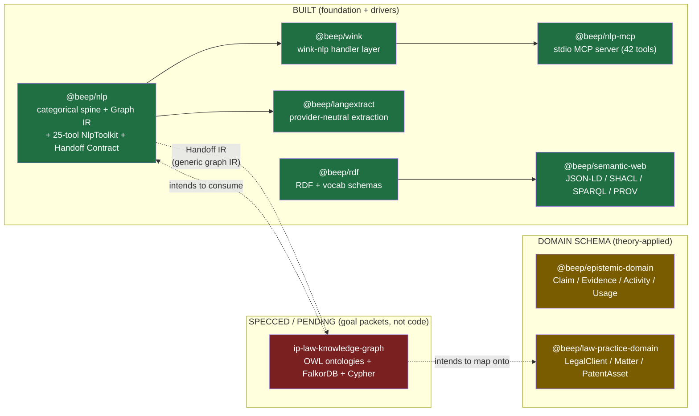

# 12 — Current State: NLP → Extraction → Knowledge-Graph Stack

_Date: 2026-06-17_
_Scope: what exists **today** along the pipeline from raw text → NLP annotation → structured extraction → (intended) knowledge graph. Built vs active vs specced, with real file paths._

> GUARDRAIL. The repo-intelligence / code-AST / "repo-memory v0 / L3 deterministic code-intelligence" work was a **learning vehicle** and has been pruned. It is NOT inventoried here as capability and is NOT the moat. The **product** is the solo IP-law firm flywheel (`law-practice` slice + `@beep/uspto` driver + the Corpus CLI as ahead-of-time data prep). The memory-architecture framework (No-Escape theorem, 4-layer taxonomy) is treated as **learned theory now being applied to law**, surviving in the repo as *domain schema* (`@beep/epistemic-domain`), not as a running product engine. The IP-law knowledge graph itself is **specced and PENDING**, not built — this file is careful never to present that spec as shipped.

This synthesis builds on the authoritative package census in
[`16-package-topology-census.md`](./16-package-topology-census.md). Where that file
established *which packages exist*, this file establishes *how far along the
NLP→KG pipeline they actually reach*.

---

## 1. The pipeline at a glance

The pipeline is **fully built on the left (NLP + extraction + semantic-web/RDF
plumbing)**, has **domain schema scaffolded in the middle**, and is **purely a
goal spec on the right (the IP-law KG itself)**. There is **no running
text → graph projection wired end-to-end**, and **no graph database
integration** for the product.

---

## 2. NLP core — `@beep/nlp` (BUILT, mature)

`packages/foundation/capability/nlp` — 82 source modules, 897 exports / 459 unique
symbols (catalog row 62, `standards/repo-exports.catalog.md`). The anchor of the
whole pipeline. Three pieces matter for the NLP→KG story:

| Sub-area | Path | What it is |
|---|---|---|
| Tool surface | `src/Tools/` (25 tool modules + `NlpToolkit.ts`) | The `Effect/ai` `Toolkit` contract — provider-neutral tool *definitions*, no handlers. |
| Graph IR | `src/Graph/` (`TextGraph`, `AnnotatedTextGraph`, `EffectGraph`, `GraphOps`, `GraphOperations/{Catalog,Executor,Operation,...}`) | A categorical text-graph intermediate representation with an operation catalog/executor. |
| Handoff Contract | `src/Handoff/Contract.ts`, `src/Handoff/index.ts` | The **versioned generic graph-IR handoff schema** the package emits downstream. |

**The Handoff Contract is the load-bearing seam.** Its own header
(`src/Handoff/Contract.ts:1-20`) describes it as *"the product-neutral generic
graph IR handoff contract … a generic text-annotation IR — `TextChunk`s carved
from a document, the `Mention`s/`Entity`s/`Relation`s extracted from them, each
carrying a character `Span` and PROV-O-aligned `Provenance` — with NO product
vocabulary."* It explicitly names *"the `ip-law-knowledge-graph` initiative"* as
the intended downstream consumer that turns the generic `Entity.type` /
`Relation.type` discriminants into concrete KG node/edge types. So the IR exists
and is documented; the consumer that would map it to an IP-law graph does not.

The 25 NlpToolkit tools (`src/Tools/NlpToolkit.ts:89-115`): `Analyze`,
`BagOfWords`, `BowCosineSimilarity`, `ChunkBySentences`, `CorpusStats`,
`CreateCorpus`, `DeleteCorpus`, `DocumentStats`, `ExtractEntities`,
`ExtractKeywords`, `LearnCorpus`, `LearnCustomEntities`, `NGrams`, `Paragraphize`,
`PhoneticMatch`, `QueryCorpus`, `RankByRelevance`, `RemoveStopWords`, `Sentences`,
`Stem`, `TextSimilarity`, `Tokenize`, `TransformText`, `TverskySimilarity`,
`WordCount`. These are tool *contracts only* — the implementation lives in the
wink driver.

---

## 3. `@beep/wink` driver (BUILT) — the handler layer

`packages/drivers/wink` — 15 src files, 149 exports / 43 unique (catalog row 84).
Wraps `wink-nlp` behind Effect services and, critically, **provides the handler
layer for the NlpToolkit contract**: `WinkTools.service.ts:346` builds
`NlpToolkit.toLayer(...)` (the `WinkNlpToolkitLive` layer). Services present:
`Wink.service`, `WinkCorpus`, `WinkSimilarity`, `WinkTokenization`,
`WinkVectorizer`, `WinkBackend`, `WinkEngineRef`, plus `WinkObservability`. This
is the only concrete NLP backend in the repo; the contract/handler split is real
and intact.

---

## 4. `@beep/nlp-mcp` (BUILT, DONE) — MCP server, "42 tools" VERIFIED

`packages/drivers/nlp-mcp` — 9 src files, 90 exports / 65 unique (catalog row 22).
The `nlp-adjunct-port` goal is **`status: DONE`** (`goals/nlp-adjunct-port/ops/manifest.json`),
all five phases (`landed`, `p1`–`p4`) DONE.

**"42 tools" claim — VERIFIED by direct count, not just the goal's self-report.**
`src/Server.ts:104-107` mounts exactly two toolkits into one stdio server:

| Toolkit | Source | Tool count | Evidence |
|---|---|---:|---|
| `NlpToolkit` (via `WinkNlpToolkitLive`) | `@beep/nlp` `src/Tools/NlpToolkit.ts` | **25** | `NlpTools` array, lines 89-115 (counted) |
| `StreamingToolkit` (via `StreamingToolkitHandlersLive`) | `@beep/nlp-mcp` `src/StreamingTools.ts:1073` | **17** | 17 `Tool.make("stream_*")` defs (counted); catalog desc says "all 17 streaming tools" |
| **Total** | | **42** | 25 + 17 |

The 17 streaming tools (`stream_read_lines`, `stream_file_info`,
`stream_text_stats`, `stream_sample_lines`, `stream_read_jsonl`,
`stream_jsonl_stats`, `stream_validate_jsonl`, `stream_sample_jsonl`,
`stream_load_text`, `stream_load_lines`, `stream_load_jsonl`, `stream_load_json`,
`stream_process_file`, `stream_filter_lines`, `stream_extract_matches`,
`stream_count_lines`, `stream_count_jsonl`) are file/JSONL/dataset IO built over
`effect/FileSystem` + `effect/Stream` + `HttpClient`. The goal's `p4` summary
records the count was confirmed live via a JSON-RPC `tools/list` probe; I did not
re-run that probe (read-only), but the static count corroborates it.

**Registration — VERIFIED.** Root `.mcp.json` registers an `nlp` stdio server:
`bun run ./packages/drivers/nlp-mcp/src/bin.ts`. So the server is wired into the
agent harness, consistent with `p4: DONE`.

---

## 5. `@beep/langextract` (BUILT, goal ACTIVE / P4 in-progress)

`packages/foundation/capability/langextract` — 6 src files, 60 exports / 27 unique
(catalog row 40). The census prior could not tell research-only from scaffold;
**this file resolves it: the package is substantively implemented, not a stub.**

| Module | Path | LOC | Substance |
|---|---|---:|---|
| `Target` | `src/Target/index.ts` | 114 | `ExtractionTarget`, `ExtractionExample` schemas |
| `Extraction` | `src/Extraction/index.ts` | 372 | `LangExtractResult`, `LangExtractError`, `LangExtractErrorReason` (6-variant), request/parser contracts |
| `Alignment` | `src/Alignment/index.ts` | 269 | `alignCandidates` — source-grounded span alignment |
| `Handoff` | `src/Handoff/index.ts` | 152 | `toAnnotatedDocument` → emits the `@beep/nlp` Handoff IR |
| `Service` | `src/Service/index.ts` | 182 | `LangExtractService` with `extract(request) → Effect<LangExtractResult, LangExtractError>`, backed by `effect/unstable/ai/LanguageModel`, 30s timeout |
| `index` | `src/index.ts` | 42 | barrel |

~1,131 src LOC total, with tests (`test/{Alignment,Extraction,Service}.test.ts`)
and built `dist/`. It depends only on `@beep/{identity,nlp,schema}` + `effect`
(no driver/provider coupling — honors the "provider-neutral" boundary in its
goal manifest's `packageIntent.mustNotDependOn`).

**Goal status nuance:** `langextract-capability` manifest is `status: active`.
Phases P0–P3 (bootstrap, research, synthesis, finalization) = `completed`;
**P4 "Implement" = `in-progress`**; P5 (quality review) and P6 (yeet/PR) =
`pending`. So: the package is genuinely coded and tested, but the goal does not
yet consider implementation closed. Frame it as **built-and-active, not done**.

The earlier framing "research/synthesis vs scaffolded package" resolves to:
**both** — there is a research synthesis trail in the packet *and* a real
implemented capability package; it is well past scaffolding.

---

## 6. Semantic-web / RDF plumbing (BUILT, mature)

These are the substrate a future KG would serialize/validate against. Both are
real, sizeable foundation packages — **not slices, not specs.**

| Package | Path | Symbols | What's actually there |
|---|---|---:|---|
| `@beep/semantic-web` | `packages/foundation/capability/semantic-web` | 271 exp / 219 uniq (row 44) | Services + adapters for **JSON-LD** (`jsonld-context`, `jsonld-document`, `jsonld-stream-{parse,serialize}`), **canonicalization** (RDF Dataset Canonicalization), **SHACL** validation (`shacl-engine`, `services/shacl-validation`), **SPARQL** query (`services/sparql-query`), **PROV** provenance (`services/provenance`), web-annotation, plus vocab (`oa`, `owl`, `prov`, `rdf`, `rdfs`, `xsd`). |
| `@beep/rdf` | `packages/foundation/modeling/rdf` | 301 exp / 110 uniq (row 67) | RDF term/triple schemas (`Rdf.ts`), `JsonLd`, `Iri`/`Uri`, `SemanticSchemaMetadata`, vocab (`Oa`, `Owl`, `Prov`, `Rdf`, `Rdfs`, `Skos`, `Xsd`). |

So the repo already has typed RDF modeling, JSON-LD round-tripping, SHACL
validation, and SPARQL-query *services*. **Tension worth flagging:** the
ip-law-knowledge-graph SPEC (ADR-005, see §8) deliberately chooses **Cypher via
FalkorDB and explicitly avoids a SPARQL runtime** — which would leave this
existing SPARQL/SHACL capability *unused by the product KG* despite being
available. That is an unreconciled architectural divergence between built
substrate and the planned graph layer.

---

## 7. Memory framework as domain schema — `@beep/epistemic-domain` (theory-applied)

`packages/epistemic/domain` (+ `epistemic-tables`) — 24 exp / 7 uniq (row 58).
This is where the **learned** memory-architecture theory (claims/evidence/
provenance/usage) lands as *schema*, per the guardrail. Entities present
(direct `ls`): `Activity`, `CandidateClaim`, `Evidence`, `UsageRecord`, plus a
`ClaimLifecycle` value object. These are `Model`-class domain schemas + drizzle
tables — **not a running extraction/memory engine.** Treat this as "the 4-layer/
claim-evidence framework expressed as persistable domain types," available for a
future product to consume, not as shipping memory infrastructure.

`@beep/law-practice-domain` (row 23, 14 src files, domain-only) is the actual
product target: `LegalClient`, `LegalContact`, `Matter`, `PatentAsset` models
(+ `.values.ts`). No server/tables/use-cases/client tiers exist (confirmed in
census §"law-practice"). The KG spec intends to map the NLP Handoff IR onto these
product entities, but that mapping is unwritten.

---

## 8. The IP-law Knowledge Graph itself (SPECCED / PENDING — NOT BUILT)

This is the right-hand box of the pipeline, and **it does not exist as code.**

- Goal `ip-law-knowledge-graph` manifest: **`status: PENDING`**, and **every
  phase P0–P4 is `PENDING`** (`goals/ip-law-knowledge-graph/ops/manifest.json`).
  The `history/outputs/p*-*.md` files referenced are spec/handoff documents, not
  implementation artifacts — their existence does **not** indicate built code.
- **No ontology TBox is built as code.** A repo-wide grep for `tbox`/`10-layer`/
  `ten-layer` in `packages/**/*.ts` returned only false positives (Box driver
  autocomplete tokens, an `_generated` model file). The "10-layer ontology TBox"
  is a **planned** artifact, not present. `ip-law-knowledge-graph` is PENDING/P0.
- The SPEC's ontology grounding is research-stage: it names LKIF-Core [S1],
  IPRonto [S2], Copyright Ontology [S3], JudO [S4] etc. as **OWL files to survey
  in P0** (`goals/ip-law-knowledge-graph/SPEC.md:78-88, 166-173`). Acceptance
  checkboxes (lines 130, 143-146) are all unchecked. P0's own verification gate
  is "`p0-ontology-research.md` exists and all 7 ontology sections populated" —
  i.e. research not yet complete.

### FalkorDB projection — SPECCED ONLY (no product integration code)

- FalkorDB is named **only in the goal SPEC** as the chosen graph DB: ADR-002
  ("FalkorDB … GraphBLAS … falkordblite for testing"), ADR-005 ("Cypher via
  FalkorDB (no SPARQL runtime)"), plus storage-layer checklist items and a
  `falkordb` npm-package note (`SPEC.md:62, 98, 119, 122, 143, 272, 307`). All of
  it is **future-tense / unchecked.**
- A grep for `falkor` in `packages/**/*.ts` / `apps/**/*.ts` returns **no KG
  integration code.** The only source hits are in
  `packages/tooling/tool/cli/src/commands/Graphiti/internal/{ProxyConfig,ProxyServices,ProxyOps}.ts`
  — and those are **Graphiti MCP memory-server container health-check config**
  (`falkorContainer` default `"graphiti-mcp-falkordb-1"`, an env-driven container
  name for dependency health checks), i.e. infra for the *agent's* Graphiti
  memory backend, **not** an IP-law graph projection. Do not conflate the two.

So: **FalkorDB is specced as the product KG store but has zero product
integration code; the only live FalkorDB touchpoint is the Graphiti memory
proxy, which is unrelated agent infrastructure.**

---

## 9. Built vs active vs pending — consolidated verdict

| Component | Path | State | Evidence |
|---|---|---|---|
| `@beep/nlp` core + Graph IR + Handoff Contract | `packages/foundation/capability/nlp` | **BUILT (mature)** | 82 src, 459 uniq syms; `Handoff/Contract.ts` documented IR |
| 25-tool `NlpToolkit` (contracts) | `…/nlp/src/Tools/NlpToolkit.ts` | **BUILT** | 25-entry `NlpTools` array (counted) |
| `@beep/wink` handler layer | `packages/drivers/wink` | **BUILT** | `NlpToolkit.toLayer` at `WinkTools.service.ts:346` |
| `@beep/nlp-mcp` server, 42 tools, registered | `packages/drivers/nlp-mcp` | **BUILT / goal DONE** | 25+17 counted; `.mcp.json` `nlp` server; `nlp-adjunct-port` DONE |
| `@beep/langextract` extraction capability | `packages/foundation/capability/langextract` | **BUILT, goal ACTIVE (P4 in-progress)** | ~1,131 src LOC, real `LangExtractService.extract`; manifest P4 `in-progress` |
| `@beep/semantic-web` (JSON-LD/SHACL/SPARQL/PROV) | `packages/foundation/capability/semantic-web` | **BUILT (mature)** | 30 src, 219 uniq; full service/adapter set |
| `@beep/rdf` modeling + vocab | `packages/foundation/modeling/rdf` | **BUILT (mature)** | 13 src, 110 uniq |
| `@beep/epistemic-domain` (memory theory as schema) | `packages/epistemic/domain` | **BUILT (domain schema only)** | Claim/Evidence/Activity/Usage models + tables |
| `@beep/law-practice-domain` (product entities) | `packages/law-practice/domain` | **BUILT (domain-only, early)** | LegalClient/Matter/PatentAsset; no other tiers |
| IP-law KG: ontology TBox (10-layer) | — | **SPECCED / PENDING (P0)** | goal PENDING; no `tbox` code; ontologies are P0 survey targets |
| IP-law KG: FalkorDB + Cypher projection | — | **SPECCED ONLY** | only in SPEC ADRs; no product code; falkor src = Graphiti proxy infra |
| Text → KG end-to-end projection | — | **NOT FOUND** | Handoff IR exists; no consumer maps it onto law entities |

**The shape of the gap:** everything needed to *produce* a grounded
text-annotation IR (NLP, wink, MCP, langextract) and everything needed to
*serialize/validate* semantic data (RDF, JSON-LD, SHACL, SPARQL) is built. The
missing middle is (a) an ontology/TBox for IP law, (b) a graph store +
projection that turns the Handoff IR into product graph nodes/edges, and (c) the
mapping onto `law-practice-domain` entities. All three are spec, all PENDING.

---

## Confidence & Caveats

**Verified (opened/counted directly):**
- 42-tool MCP claim: counted 25 `NlpTools` (`NlpToolkit.ts:89-115`) + 17
  `Tool.make("stream_*")` in `StreamingTools.ts` (`StreamingToolkit.make`,
  line 1073). `Server.ts:104-107` mounts exactly those two toolkits.
- `.mcp.json` registers the `nlp` stdio server pointing at `nlp-mcp/src/bin.ts`.
- `nlp-adjunct-port` goal `status: DONE` (all phases); `langextract-capability`
  goal `status: active`, P4 `in-progress`; `ip-law-knowledge-graph` goal
  `status: PENDING`, all phases PENDING (manifests read directly).
- `@beep/langextract` is substantively implemented (~1,131 src LOC, real
  `LangExtractService.extract`, alignment, parser, handoff), not a stub.
- `@beep/semantic-web` and `@beep/rdf` source trees (SHACL/JSON-LD/SPARQL/PROV
  services; RDF + vocab schemas) listed on disk.
- nlp `Handoff/Contract.ts` header naming the `ip-law-knowledge-graph` initiative
  as intended downstream consumer of the generic graph IR.
- FalkorDB appears only in the KG SPEC (future-tense ADRs/checklists) and in the
  Graphiti CLI proxy config (`Graphiti/internal/ProxyConfig.ts` — memory-infra
  container health check, default `graphiti-mcp-falkordb-1`), **not** in any KG
  projection code. Grep over `packages/**/*.ts` + `apps/**/*.ts` confirms no
  product FalkorDB integration.
- No ontology TBox in code: `tbox`/`10-layer` grep over `packages/**/*.ts`
  returned only false positives.
- Symbol/export counts quoted from `standards/repo-exports.catalog.md` (read,
  not regenerated).

**UNVERIFIED:**
- I did not re-run the live `tools/list` JSON-RPC probe (read-only constraint);
  the 42 count is from static source counting + the goal's recorded probe, which
  agree.
- Whether `LangExtractService` is actually *wired into* any app/runtime was not
  traced beyond the package boundary; the package compiles to `dist/` and has
  tests, but downstream consumption is unconfirmed.
- The full behavior of the nlp `Graph/GraphOperations` executor (beyond file
  inventory and the Handoff contract) was not deep-read.
- "Mature/built" labels are heuristic from src counts, symbol counts, presence of
  tests/dist, and spot-reads — no builds/tests were run.

### Verification (2026-06-17)

Independent skeptical re-check against the live repo. Result: **no outright
errors found; every load-bearing claim reproduced.** Specifics:

**Re-counted / re-read directly (all confirmed):**
- 25 `NlpTools` entries in `NlpToolkit.ts:89-115` (exact array, counted).
- 17 `Tool.make("stream_*")` in `StreamingTools.ts` (`grep -c` = 17, names match
  the doc's list one-for-one); catalog desc "all 17 streaming tools" agrees.
- `Server.ts:104-107` mounts exactly `NlpToolkit` (via `WinkNlpToolkitLive`) +
  `StreamingToolkit` (via `StreamingToolkitHandlersLive`). 25+17 = 42 stands.
- `WinkTools.service.ts:346` = `WinkNlpToolkitLive = NlpToolkit.toLayer(...)`.
- `.mcp.json` `nlp` stdio server → `bun run ./packages/drivers/nlp-mcp/src/bin.ts`.
- Manifest statuses: `nlp-adjunct-port` DONE (all phases DONE);
  `langextract-capability` active with P4 `in-progress`, P5/P6 `pending`;
  `ip-law-knowledge-graph` PENDING (all phases PENDING). Verbatim.
- `@beep/langextract` src = 1131 LOC (`wc -l`), with `Alignment/Extraction/
  Service` tests and a built `dist/`. Substantive, not a stub — confirmed.
- `Handoff/Contract.ts:1-20` header text and its naming of the
  `ip-law-knowledge-graph` initiative as intended downstream consumer — quoted
  accurately.
- `falkor` grep over `packages/**/*.ts` + `apps/**/*.ts`: only hits are
  `tooling/tool/cli/src/commands/Graphiti/internal/*` (+ their `dist/.d.ts` and
  a `graphiti-proxy-security.test.ts`) — Graphiti memory-proxy infra, NOT KG
  code. No product FalkorDB integration. Confirmed.
- `tbox`/`10-layer`/`ten-layer` grep: only false positives (Box driver
  `_generated`, an autocomplete theme token). No ontology TBox in code.
- Domain trees on disk: `epistemic/domain` has `Activity/CandidateClaim/
  Evidence/UsageRecord` + `values/ClaimLifecycle`; `law-practice/domain` has
  `LegalClient/LegalContact/Matter/PatentAsset` (each model+values), and
  `packages/law-practice/` contains **only** `domain/` — no server/tables/
  use-cases/client tiers. Confirmed.

**Catalog cross-checks (row numbers + counts all matched
`standards/repo-exports.catalog.md`):** nlp row 62 (897/459), wink row 84
(149/43), nlp-mcp row 22 (90/65), langextract row 40 (60/27), semantic-web
row 44 (271/219), rdf row 67 (301/110), epistemic-domain row 58 (24/7),
law-practice-domain row 23 (36/8).

**Corrections made:** none. All discrepancies investigated were benign:
- "82 source modules" for nlp (line 60): raw `find -name '*.ts'` returns 75,
  but the figure is explicitly attributed to catalog row 62's module column
  (which reads 82), so the citation is faithful and was left as-is.
- "src files" counts elsewhere are raw `.ts` counts and all reproduce
  (law-practice-domain 14, nlp-mcp 9, rdf 13) even where the catalog's module
  column differs slightly — internally consistent, not errors.

**Guardrail compliance:** clean. Pruned repo-intelligence/code-AST/L3 is
excluded and explicitly flagged as a learning vehicle; specced/PENDING work
(IP-law KG, TBox, FalkorDB/Cypher) is never presented as shipped;
`epistemic-domain` is framed as theory-as-schema, not a running engine; the
Corpus CLI is treated as ahead-of-time data prep.

**Remaining doubts (unchanged from author's own caveats):** no live
`tools/list` probe re-run; downstream runtime wiring of `LangExtractService`
not traced; `Graph/GraphOperations` executor behavior not deep-read; no
builds/tests executed.

**NOT FOUND:**
- No IP-law knowledge-graph code (storage, Cypher, ontology loader, projection).
- No ontology TBox / 10-layer ontology as code.
- No product FalkorDB integration (only Graphiti memory-proxy infra config).
- No end-to-end text → KG projection consuming the nlp Handoff IR.
- No `law-practice` server/tables/use-cases tiers to receive a graph mapping.

**Open questions for downstream agents:**
- The repo already ships SPARQL/SHACL (`@beep/semantic-web`), yet the KG SPEC
  (ADR-005) chooses Cypher/FalkorDB and explicitly forgoes a SPARQL runtime.
  Is the existing semantic-web SPARQL capability intended to be orphaned, used
  only for ontology ingestion, or is this a divergence to reconcile before the
  KG is built?
- Is `@beep/epistemic-domain` (claim/evidence/activity) the intended substrate
  that the IP-law KG and `law-practice-domain` will share, or parallel tracks?
  No dependency edges were traced here to confirm.
- The nlp Handoff IR names `ip-law-knowledge-graph` as consumer, but that goal is
  PENDING/P0 — what unblocks P0 (ontology-file retrieval per its risk register)?
