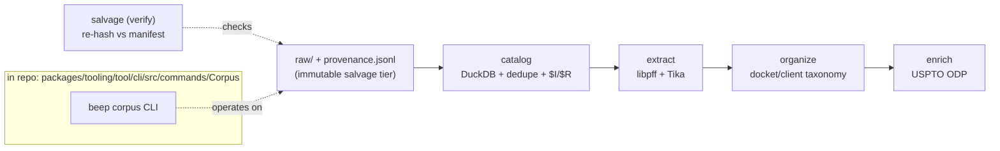

# 13 — Current Corpus & Data Substrate (ahead-of-time data prep)

_Date: 2026-06-17_
_Scope: current state of the corpus/data substrate that supports the solo IP-law firm flywheel (the product). Framed per guardrail as **ahead-of-time data preparation**, NOT a live runtime ingestion feeder._

## Framing (read first)

The Oppold corpus is **cleaned real data from the user's father's 25-year IP-law practice**, salvaged and curated so that a clean, provenance-tracked substrate **exists WHEN the system is ready** to consume it. It is decidedly **NOT** wired into a live ingestion loop today. Two facts make this concrete and verifiable:

1. The curation work is a **closed, completed goal packet** (`completed-retained`, dated 2026-06-11) — a finished batch effort, not a running service. See `goals/oppold-corpus-pipeline/ops/manifest.json`.
2. The data physically lives **outside the repository** at `/home/elpresidank/data-home/oppold-corpus/` (confirmed on disk). The packet's own rule is that "real corpus data never enters this repository" (`goals/oppold-corpus-pipeline/README.md`, Notes). What lives in the repo is the **Corpus CLI tool** (curation operator) and the **goal-recorded evidence** (reports, manifests, counts) — never the data.

So there are three distinct things to keep separate:

| Thing | Where | Status |
|---|---|---|
| The **Corpus CLI tool** (operator surface) | `packages/tooling/tool/cli/src/commands/Corpus/` (in repo) | Built, verified files |
| The **curated data** (raw → catalog → extract → organized → enriched) | `/home/elpresidank/data-home/oppold-corpus/` (outside repo) | Exists on disk; products of a completed batch run |
| The **pipeline run history** (phases/outcomes) | `goals/oppold-corpus-pipeline/` (in repo) | GOAL-RECORDED, completed-retained |

This file inventories all three but keeps the guardrail line bright: this is **data prep ahead of time**, not a product runtime.

---

## The Corpus CLI — `beep corpus` command family

Location (verified files): `packages/tooling/tool/cli/src/commands/Corpus/` — `Corpus.command.ts`, `Corpus.service.ts` (81 KB, the implementation), `Corpus.schemas.ts` (28 KB), `Corpus.errors.ts`, `Corpus.recyclebin.ts`, `index.ts`.

It is a subcommand group under the `beep` CLI (`@beep/repo-cli`). The root command is `corpus` ("Corpus salvage and curation commands"), with five subcommands wired in `Corpus.command.ts` (`Command.withSubcommands([...])`). Each subcommand's description below is quoted directly from `Command.withDescription(...)` in `Corpus.command.ts`; behavior is corroborated by the exported service functions in `Corpus.service.ts`.

| Subcommand | Service fn (`Corpus.service.ts`) | What it does (from `withDescription` + service) |
|---|---|---|
| `catalog` | `catalogCorpus` | "Build the corpus DuckDB catalog, exact-duplicate report, and recycle-bin name-restoration manifest." Reads `raw/provenance.jsonl`, validates every record against `CorpusProvenanceRecord`, loads into DuckDB (`DuckDb.makeNodeLayer`), emits duplicate sets + `$I`/`$R` restoration manifest. |
| `extract` | `extractCorpus` | "Run libpff and Tika extraction over salvaged raw/ files into staging/extract." Spawns `pffexport` (PST) and Apache Tika (`java -jar tika-app.jar`) subprocesses, bounded concurrency (default 4), emitting `@beep/file-processing` manifest shapes. |
| `organize` | `organizeCorpus` | "Build the organized/ client, docket, and email-archive taxonomy from the catalog." Deterministic (no LLM) docket-token + restored-path heuristics; client tier only from an explicit `--client-map` JSON. |
| `enrich` | `enrichCorpus` | "Resolve corpus-derived patent and application numbers against the USPTO open data portal." Uses the `@beep/uspto` driver; rate-limited (`--lookup-delay-millis`, default 400), bounded by `--max-lookups`. |
| `salvage` (verify) | `verifySalvage` | "Re-hash salvaged raw/ files against the provenance manifest." Note: this subcommand **verifies** an existing salvage; the original P0 salvage itself was done by a shell runner (`ops/run-salvage.sh` → `ops/salvage.sh`), not by this TS command — see below. |

**Note on "salvage":** the in-repo `corpus salvage` subcommand is a re-hash **verifier** (`verifySalvage`), with `--sample-stride` to check every Nth record. The actual P0 file salvage (copy + SHA-256) was performed by a bash runner kept beside the data (`oppold-corpus/ops/run-salvage.sh` → `ops/salvage.sh`, per `goals/oppold-corpus-pipeline/history/outputs/2026-06-11-p0-salvage-report.md`). So the CLI's role across the pipeline is: verify-salvage → catalog → extract → organize → enrich.

### Tech substrate the CLI leans on (verified imports in `Corpus.service.ts`)

- `@beep/duckdb` — `DuckDb`, `DuckDbConnectionOptions`; catalog is a DuckDB database built via `DuckDb.makeNodeLayer(...)` and `db.run(createSourceFilesTable(...))` reading the JSONL manifest via `read_json(...)`.
- `@beep/file-processing` — imports from its `Artifact`, `Extraction`, `Operation`, `Service`, `Strategy` modules (`ArtifactId`, `ContentDigest`, `SourceArtifact`, `ProcessFileOperation`, `FileProcessingEngineShape`, etc.). The corpus extract output is written in `@beep/file-processing` manifest shapes.
- `@beep/uspto` driver — for the `enrich` lookups; imported directly in `Corpus.service.ts` (`Uspto`, `normalizeUsptoApplicationNumber`, `normalizeUsptoPatentNumber`, `makeUsptoError`) and present at `packages/drivers/uspto`.
- Drivers `@beep/libpff` (`pffexport`) and `@beep/tika` (`tika-app`) — the extraction engines.
- Schema-first throughout: `Corpus.schemas.ts` defines ~20 `S.Class` models with `$I` identity keys (e.g. `CorpusProvenanceRecord`, `CorpusRestorationRecord` union, `CorpusDuplicateSetRecord`, `CorpusOrganizeRecord`, `CorpusEnrichmentRecord`, plus per-command `*Options`/`*Summary` classes), each with JSON decode/encode helpers.

---

## The `oppold-corpus-pipeline` goal — recorded phases & outcomes

> **GOAL-RECORDED.** Everything in this section is taken from the goal packet's own reports under `goals/oppold-corpus-pipeline/history/outputs/`. These describe **data that lives at `/home/elpresidank/data-home/oppold-corpus/` (outside the repo)**. The numbers are self-reported run evidence, not independently re-counted here (the data dir structure was confirmed on disk; per-row counts were not re-tallied).

Packet status: **`completed-retained`**, created/updated 2026-06-11 (`ops/manifest.json`). All six phases marked `completed`.

| Phase | Name | Recorded outcome (source report) |
|---|---|---|
| P0 | Salvage & Inventory | **8,438 files / 31,687,534,556 bytes (~31.7 GB)** salvaged into `raw/` with per-file SHA-256, zero read errors / hash mismatches. 5 source labels (ESD-USB emails, two standalone PSTs, the Oppold IP-law tree of 8,294 files, a Precision Planting CAD package). `p0-salvage-report.md` |
| P1 | Catalog & Exact Dedupe | DuckDB catalog `catalog/corpus.duckdb` (tables `corpus_source_files` 8,438 rows, `corpus_restorations`, view `corpus_duplicate_sets`). **7,330 distinct digests, 290 duplicate sets, 1,108 redundant copies.** Windows recycle-bin `$I`/`$R` name restoration: 251 matched pairs. `p1-catalog-report.md` |
| P2 | Extraction | Real libpff + Tika over the 7,330 unique digests → `staging/extract/` (~28 GB). **7,045 succeeded / 285 failed** (all expected classes). **663,272 PST child message artifacts**, **6,702 text artifacts**. `p2-extraction-report.md` |
| P3 | Organization | `organized/` taxonomy: **643 docket files across 105 docket families**, 81 client files (Precision Planting via client map), 28 PST email archives (symlinked), **242 restored recycle-bin names**. Deterministic heuristics, no LLM. `p3-organize-report.md` |
| P4 | Enrichment | USPTO ODP via `@beep/uspto`: 3,571 identifier candidates discovered, 150 lookups, **99 resolved → 99 docket-family anchors**. `enrichment-manifest.jsonl` + table `corpus_enrichment`. `p4-enrichment-report.md` |
| P5 | Close | Closeout reflection at `history/reflections/2026-06-11-claude.md`; packet retained. |

### On-disk corroboration (confirmed by `ls`, outside repo)

`/home/elpresidank/data-home/oppold-corpus/` exists with the expected tier dirs: `raw/`, `catalog/`, `staging/`, `organized/`, `logs/`, `ops/`.

- `catalog/corpus.duckdb` (~5.25 MB) present, plus `enrichment-manifest.jsonl`, `organize-manifest.jsonl` (~2.9 MB), `restoration-manifest.jsonl`, and `reports/` (`catalog-summary.json`, `duplicate-sets.json`, `enrich-summary.json`, `organize-summary.json`).
- `organized/` contains `clients/`, `dockets/`, `email-archives/`, `_unsorted/`.
- `staging/extract/` present.

So the curated outputs are **real and durable on disk** — the substrate exists. What does **not** exist is any wiring that streams it into a running product.

---

## DuckDB catalog & `@beep/file-processing` manifests (the consumable surface)

The packet's stated outcome is a substrate "with DuckDB catalog + `@beep/file-processing` manifests as the consumable surface" (`GOAL.md`). Two complementary surfaces:

1. **DuckDB catalog** (`catalog/corpus.duckdb`): relational index over the corpus — source-file rows (digest + artifact id), duplicate sets, restorations, and the P3/P4 tables `corpus_organized` and `corpus_enrichment`. Built in-repo by `catalogCorpus` via `@beep/duckdb`'s `DuckDb.makeNodeLayer`, reading the JSONL provenance manifest through DuckDB's `read_json`. This is the queryable "what do we have" index.

2. **`@beep/file-processing` manifests** (`staging/extract/`): the extraction outputs (`run.json`, `coverage.json`, `sources.jsonl`, `failures.jsonl`, plus `text/`, `metadata/`, `children/` trees) are written in the manifest shapes defined by `@beep/file-processing` (modules `Artifact`, `Extraction`, `Operation`, `Service`, `Strategy`). This is the content-addressed extracted-text surface.

Together they form a **clean, provenance-tracked, content-addressed dataset** — a snapshot ready to be ingested, not an ingestion runtime. The DuckDB file is a passive artifact on disk; nothing in the running product opens it today.

### Where it is "supposed" to go (recorded intent, NOT built)

The packet's README "Related Packets" section records the **intended** downstream consumers — explicitly as future lanes, not current wiring:
- `goals/agentic-professional-runtime` — "this corpus feeds its NEXT roadmap lane (corpus ingestion → epistemic claims); the runtime packet **owns epistemic ingestion, not this one**." (packet directory confirmed to exist.)
- `goals/ip-law-knowledge-graph` — "consumes the organized corpus" for ontology grounding.

That is the bridge to the learned memory-architecture theory (epistemic claims/evidence — see the `epistemic-domain` package in the census, modeling `Activity`/`CandidateClaim`/`Evidence`/`UsageRecord`). But the bridge is **roadmap, not code**: the corpus packet is `Out:` scope for epistemic ingestion (`GOAL.md` Scope), and there is no verified runtime edge from `oppold-corpus/` into the epistemic or law-practice slices. This is exactly the "clean data exists WHEN the system is ready" posture, not a live loop.

---

## Tensions & gaps

- **Tool-in-repo vs data-outside-repo split is load-bearing.** The product-relevant *data* never appears in version control; only the operator (CLI) and evidence do. Any "current capability" claim about the corpus must name which side it is on. The substrate is data prep; the moat is not code intelligence.
- **Completed-retained ≠ running.** The pipeline is a finished batch, last touched 2026-06-11. Re-running it (e.g. `enrich` with a higher `--max-lookups`, 3,421 candidates remain unresolved by choice) is an operator action, not an automated process.
- **No runtime consumer verified.** The "consumable surface" (DuckDB + manifests) has consumers named only in *future* goal packets (`agentic-professional-runtime`, `ip-law-knowledge-graph`). No present-day code path reads the corpus catalog. (UNVERIFIED: a deeper dependency-graph scan could confirm zero edges; I checked imports of the corpus dir and found none in product slices, but did not exhaustively grep the whole tree.)
- **Product slice still thin.** Per the package census, `law-practice` is **domain-only** (`@beep/law-practice-domain`: `LegalClient`, `LegalContact`, `Matter`, `PatentAsset`). So even if the corpus were wired in, the product slice that would receive it (server/use-cases/app) does not exist yet. The corpus prep is **ahead of** the product surface that will eventually use it — consistent with its data-prep framing.

---

## Confidence & Caveats

**Verified (opened / `ls`'d directly):**
- Corpus CLI file inventory under `packages/tooling/tool/cli/src/commands/Corpus/` (6 files); full read of `Corpus.command.ts` and `index.ts`; grep of `Corpus.service.ts` and `Corpus.schemas.ts` for exports, imports (`@beep/duckdb`, `@beep/file-processing/*`), and command wiring.
- The five subcommands and their `withDescription` text, and the service-fn mapping.
- Existence and tier structure of `/home/elpresidank/data-home/oppold-corpus/` (`raw/ catalog/ staging/ organized/ logs/ ops/`), including `catalog/corpus.duckdb` (~5.25 MB), the four manifest JSONL files, `catalog/reports/*.json`, and `organized/{clients,dockets,email-archives,_unsorted}`, `staging/extract/`.
- Goal packet `ops/manifest.json` (`completed-retained`, six phases all `completed`), `GOAL.md`, `README.md`, and all five P0–P4 run reports under `history/outputs/`.
- Existence of `goals/agentic-professional-runtime` (the named future consumer packet).

**GOAL-RECORDED (taken from packet reports, not independently re-counted):**
- All quantitative outcomes: 8,438 files / 31.7 GB, 7,330 distinct digests, 290 duplicate sets, 7,045/7,330 extracted, 663,272 PST child artifacts, 6,702 text artifacts, 643 docket files / 105 families, 242 restored names, 99 USPTO anchors. These are self-reported run evidence; the data dir's existence was confirmed but per-row totals were not re-tallied from the DuckDB file.

**UNVERIFIED:**
- That **no** product/runtime code path reads the corpus catalog — I checked the corpus tool's own imports and the product slice topology, but did not exhaustively grep the entire repo for references to `oppold-corpus`/`corpus.duckdb`.
- Exact contents of the DuckDB tables and manifest JSON files (I confirmed file presence/sizes, not row-level contents).

**NOT FOUND:**
- Any live ingestion loop, scheduler, or service that streams the corpus into the product at runtime. Downstream consumption exists only as recorded *intent* in future goal packets (`agentic-professional-runtime`, `ip-law-knowledge-graph`).
- Any law-practice server/use-cases/app package that would receive the corpus (slice is domain-only per census `16-package-topology-census.md`).

**Open questions:**
- When the runtime lane is built, will it read DuckDB directly, the `@beep/file-processing` manifests, or re-extract? (The "consumable surface" is dual; the chosen entry point is unspecified.)
- Is `epistemic-domain` the intended ingestion target for corpus-derived claims, and does the corpus enrichment schema (`CorpusEnrichmentRecord`) map onto `CandidateClaim`/`Evidence`? (Cross-slice mapping not yet present in code.)

### Verification (2026-06-17)

Adversarial re-check against the live repo and on-disk data; this doc held up very well.

**Checked and confirmed (direct):**
- Corpus CLI inventory: all 6 files present under `packages/tooling/tool/cli/src/commands/Corpus/` (`Corpus.service.ts` ~80 KB / 81,825 B, `Corpus.schemas.ts` ~27 KB / 27,729 B — doc's "81 KB"/"28 KB" are reasonable roundings).
- `Corpus.command.ts` read in full: 5 subcommands wired via `Command.withSubcommands`, root description "Corpus salvage and curation commands"; every per-subcommand `withDescription` string in the table matches verbatim, as do defaults (`concurrency` 4, `lookup-delay-millis` 400, `--max-lookups`, `--sample-stride`). Service-fn mapping (`catalogCorpus`/`extractCorpus`/`organizeCorpus`/`enrichCorpus`/`verifySalvage`) confirmed against imports.
- Imports in `Corpus.service.ts`: `@beep/duckdb`, `@beep/file-processing/{Artifact,Extraction,Operation,Service,Strategy}`, `@beep/libpff`, `@beep/tika`, `@beep/uspto` all present; corresponding packages exist (`packages/drivers/{uspto,duckdb,libpff,tika}`, `packages/foundation/capability/file-processing`). 21 `S.Class` models in `Corpus.schemas.ts` (doc "~20" accurate); `CorpusRestorationRecord` present in schemas + service.
- On-disk data at `/home/elpresidank/data-home/oppold-corpus/`: tier dirs `raw/ catalog/ staging/ organized/ logs/ ops/`; `raw/provenance.jsonl` present; `catalog/corpus.duckdb` = 5,255,168 B (~5.25 MB, exact); the three manifest JSONL files live under `catalog/` (not the data root); `catalog/reports/*.json` and `organized/{clients,dockets,email-archives,_unsorted}` + `staging/extract/` present.
- On-disk summary JSON corroborates the GOAL-RECORDED numbers independently: `catalog-summary.json` → 8,438 source files, 31,687,534,556 bytes, 7,330 distinct digests, 290 duplicate sets, 1,108 duplicate files, 251 matched restorations; `organize-summary.json` → 643 docket files, 105 families, 81 client files, 28 email archives, 242 restored names; `enrich-summary.json` → 99 resolved / 99 family anchors. P0/P2/P3/P4 reports confirm salvage runner (`ops/run-salvage.sh → ops/salvage.sh`), 7,045/285 extraction split, 663,272 child + 6,702 text artifacts, 3,571 candidates / 3,421 unresolved-by-choice.
- Goal packet `ops/manifest.json` = `completed-retained`, all six phases `completed`. Future-consumer packets `goals/agentic-professional-runtime` and `goals/ip-law-knowledge-graph` exist. `@beep/epistemic-domain` exists with `Activity`/`CandidateClaim`/`Evidence`/`UsageRecord` models; `@beep/law-practice-domain` is the only law-practice package (domain-only: `LegalClient`/`LegalContact`/`Matter`/`PatentAsset`) — confirming the "product slice still thin" caveat.

**Corrected:**
- Tightened the `@beep/uspto` substrate line: it is a direct verified import in `Corpus.service.ts`, not merely "confirmed in the package census."

**Guardrail check:** no pruned repo-intelligence / code-AST / L3 capability is presented as present. The doc's only "moat" sentence correctly states "the moat is not code intelligence," and the corpus is consistently framed as ahead-of-time data prep, not a live runtime feeder.

**Remaining doubts (unchanged from doc):** the "no product/runtime code path reads the corpus" claim was not re-proven by an exhaustive repo-wide grep for `oppold-corpus`/`corpus.duckdb`; row-level contents of the DuckDB tables were not re-tallied (only summary JSON cross-checked).
