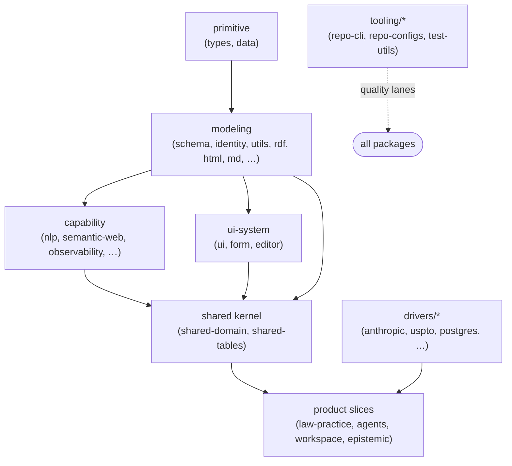

# 14 — Foundation, Tooling & Drivers: The Reusable Substrate

_Date: 2026-06-17_
_Scope: the "what can we build with" inventory. The current, on-disk **reusable substrate** — foundation, drivers, tooling, and the cross-slice shared kernel — that future product work (the solo IP-law firm flywheel) would compose. This is the **lego-brick layer**, not the product layer._

> GUARDRAIL. These are the bricks, not the building. The pruned "repo-memory v0 / L3 deterministic code-intelligence" *product* layer is NOT inventoried here as a capability. Where repo-intelligence-flavored bricks survive (`@beep/repo-codegraph`, `@beep/repo-ai-metrics`), they are **monorepo-quality tooling** — learning-vehicle residue, not the product moat. The memory-architecture theory (No-Escape theorem, 4-layer taxonomy) is **learned theory now applied to law**, not shipping code. The product slice (`law-practice`) is domain-only and consumes this substrate; see [16-package-topology-census.md](./16-package-topology-census.md) for slice built-ness.

This file is downstream of the census (16). Where 16 catalogs *every* package, this file goes one level deeper into the **substrate families only**, naming the high-value composable bricks and what they give you for free.

---

## The four substrate families at a glance

| Family | Root dir | Role | High-value anchor brick(s) |
|---|---|---|---|
| **foundation** | `packages/foundation/{primitive,modeling,capability,ui-system}` | Vertical-agnostic building blocks (types → schema → capabilities → UI) | `@beep/schema`, `@beep/identity`, `@beep/utils`, `@beep/ui` |
| **drivers** | `packages/drivers/*` (flat) | Effect-service wrappers around external systems/binaries | `@beep/anthropic`, `@beep/uspto`, `@beep/postgres`+`@beep/drizzle` |
| **tooling** | `packages/tooling/{library,tool,policy-pack,test-kit}` | Build/quality/codegen/test plumbing for the monorepo itself | `@beep/repo-cli`, `@beep/repo-configs`, `@beep/test-utils` |
| **shared** | `packages/shared/*` | Cross-slice kernel (domain models + tables every slice reuses) | `@beep/shared-domain`, `@beep/shared-tables` |

The dependency gravity flows **left-to-right and down**: primitives → modeling → capability/ui → shared kernel → product slices. Drivers and tooling sit beside the stack; product slices reach into drivers, foundation, and shared.

---

## 1. foundation/primitive — the floor

Two packages, both `src`+`test`. Everything else builds on these.

| Package | Path | Purpose | Why it's a brick |
|---|---|---|---|
| `@beep/types` | `packages/foundation/primitive/types` | Lowest-level shared TS type primitives (`TArray`, `TString`, `TUnsafe`, `TUtils`). | Type-level helpers consumed across the whole modeling layer; no runtime cost. |
| `@beep/data` | `packages/foundation/primitive/data` | Effect-native constant/value data: `Blockchain`, `Calendar`, `CurrencyCodes`, `MimeTypes`, `Timezones`, `KeyboardShortcuts`, `HotKey`, plus a `generated/` dir. | Canonical reference data so slices don't re-hardcode currency/timezone/mime tables. |

_Verified by `ls` of both `src/` dirs._

---

## 2. foundation/modeling — the schema-first backbone (the crown jewel)

This is the highest-leverage family. `@beep/schema` is the single most important brick in the repo for any new domain work.

| Package | Path | Purpose | Notable exports / structure |
|---|---|---|---|
| **`@beep/schema`** | `packages/foundation/modeling/schema` | Core `effect/Schema` extensions — the schema-first kit (~228 src files, **61 sub-dirs**). | `DomainModel` (a `Model.Class` base, see below), `EntitySchema/*` (constructors, definition, factory, fields, persist, shape), `Model/*` (codecs, datetime, fields, sqlite, uuid, variants), `LiteralKit` + `MappedLiteralKit`, `TaggedErrorClass`/`StatusCauseTaggedErrorClass`, plus a vast library of ready domain primitives: `Email`, `Cuid`, `CurrencyCode`, `Color/*`, `Csv*`, `Csp`, blockchain (`EvmAddress`, `EthAmount`), security-header schemas, typed-array schemas, etc. |
| **`@beep/identity`** | `packages/foundation/modeling/identity` | `$I` identity composers — the canonical way to mint schema ids, error tags, and service keys per workspace namespace. | `Id.ts` (the `IdentityComposer`), `packages.ts` (`$I = Identity.make("beep").$BeepId`, plus a pre-built composer for **every** `@beep/*` package). Usage: `` $SchemaId`TenantService` ``, `` $I`DomainModel` ``. |
| **`@beep/utils`** | `packages/foundation/modeling/utils` | Namespace-first helper modules (the canonical `Str`, `Equal`, `Option`, `Predicate`, … wrappers CLAUDE.md mandates). | `Array`, `Bool`, `DateTime`, `Equal`, `Errors`, `Event`, `FileSystem`, `Function`, `GlobalValue`, `Glob`, `Html`, `NodeUrl`, `Number`, `Option`, `Predicate`, `Random`, `Stream`, `Str`, `Struct`, `Text`, `thunk`, `Utils`. ~582 unique exported symbols. |
| `@beep/rdf` | `packages/foundation/modeling/rdf` | RDF modeling primitives (triples/terms schemas). | Brick for the semantic-web capability; relevant to ontology-as-applied-theory. |
| `@beep/html` / `@beep/md` / `@beep/pandoc-ast` / `@beep/lexical-schema` | `packages/foundation/modeling/{html,md,pandoc-ast,lexical}` | AST/document modeling schemas (HTML, Markdown, Pandoc, Lexical editor docs). | Document-shaped corpora and editor content get typed schemas — directly useful for legal-document prep. |

### The two patterns to know

- **`DomainModel`** (`schema/src/DomainModel.ts`): a `Model.Class<DomainModel>($I\`DomainModel\`)(...)` base with `defaultFields`. This is the persisted-entity base that domain slices extend (the `law-practice` entities `LegalClient`/`Matter`/`PatentAsset` and the `epistemic` `CandidateClaim`/`Evidence` models sit on this lineage).
- **`$I` composers** (`identity/src/packages.ts`): every service key / schema id / error tag in the repo is minted from a single root composer, so identity is collision-free and grep-able across packages.

> NOTE: A standalone `Table.make` brick was **NOT FOUND** inside `@beep/schema` (grep for a `Table`-named module in `schema/src` returned nothing). Drizzle table definition lives in the **`@beep/drizzle` driver** (`EntityTable.models.ts`, via `EntityTable.pgTableFrom(EntityClass)`) and per-slice `*-tables` packages — not in the schema kit. The `schema-model-specialist` skill references `Table.make`; no such export exists for drizzle tables (the canonical composer is `EntityTable.pgTableFrom`). (Marked because the skill description implies otherwise.)

_Verified: `ls schema/src` (61 dirs), `ls EntitySchema/`, `ls Model/`, `ls LiteralKit/`, `DomainModel.ts` head, `identity/src/packages.ts`, `ls utils/src`._

---

## 3. foundation/capability — domain-agnostic capability layers

Seven packages wrapping reusable *capabilities* (vs. external drivers). All `src`+`test`.

| Package | Path | Purpose | Future-product relevance |
|---|---|---|---|
| `@beep/nlp` | `packages/foundation/capability/nlp` | Large NLP capability layer (75 src files, ~459 symbols). | Text analysis over legal corpora. |
| `@beep/semantic-web` | `packages/foundation/capability/semantic-web` | Semantic-web services/schemas (~219 symbols). | Where ontology-as-applied-theory would live; pairs with `@beep/rdf`. |
| `@beep/observability` | `packages/foundation/capability/observability` | Tracing/metrics/logging capability. | Standard wiring for any server tier. |
| `@beep/file-processing` | `packages/foundation/capability/file-processing` | File ingestion/processing. | Document intake for the corpus / matters. |
| `@beep/langextract` | `packages/foundation/capability/langextract` | Language-extraction capability. | Structured extraction from documents. |
| `@beep/chalk` | `packages/foundation/capability/chalk` | Terminal styling. | CLI ergonomics (used by `repo-cli`). |
| `@beep/colors` | `packages/foundation/capability/colors` | Color utilities. | UI + terminal color math. |

_Symbol counts from `standards/repo-exports.catalog.md` (read, not regenerated); package set verified in census 16._

---

## 4. foundation/ui-system — the design-system bricks

| Package | Path | Purpose | What's inside |
|---|---|---|---|
| **`@beep/ui`** | `packages/foundation/ui-system/ui` | Core component system (~121 src files, ~461 symbols). | `components/` (a full shadcn/base-ui-style kit: accordion, dialog, drawer, command, combobox, calendar, chart, plus domain-flavored ones like `knowledge-graph.tsx`, `conversation.tsx`, `orb.tsx`, `live-waveform.tsx`, a `blocks/` dir, an `editor/` dir), `hooks/` (`useMobile`, `useNumberInput`, `use-scribe`, `useSpinner`), `themes/`, `styles/`, `lib/`. |
| `@beep/form` | `packages/foundation/ui-system/form` | Form system, split `core` (headless) + `react`. | Schema-driven forms compose with `@beep/schema`. |
| `@beep/editor` | `packages/foundation/ui-system/editor` | Lexical-based rich-text editor UI. | `composer`, `viewer`, mermaid decorator/view, youtube embed nodes, `artifact-ref-node`. Pairs with `@beep/lexical-schema`. |

> The UI brick is **mature and broad** — it's the fastest path to a product UI surface. The desktop app (`@beep/professional-desktop`, active in git status) and `oip-web` already consume it. Storybook (`apps/storybook`) is a config-only host over `@beep/ui`.

_Verified by `ls ui/src`, `ls ui/src/components`, `ls ui/src/hooks`, `ls form/src`, `ls editor/src`._

---

## 5. drivers/* — external-system adapters (flat, 25 packages)

All wrap a third-party API or binary behind an Effect service, with a **consistent file shape**: `*.service.ts`, `*.config.ts`, `*.errors.ts`, sometimes `*.models.ts` and an `index.ts`. This uniformity is itself a brick: a new driver is a known template.

**Product-relevant drivers (IP-law flywheel):**

| Driver | Path | Purpose |
|---|---|---|
| **`@beep/uspto`** | `packages/drivers/uspto` | USPTO patent-data driver (`Uspto.service.ts`, `Uspto.models.ts`, `.config`, `.errors`). Direct product input for patent/IP matters. |
| **`@beep/anthropic`** | `packages/drivers/anthropic` | Anthropic LLM driver (`Anthropic.service.ts` + `Anthropic.repair.ts` repair pass, `.config`, `.errors`). The primary LLM brick. |
| `@beep/postgres` + `@beep/drizzle` | `packages/drivers/{postgres,drizzle}` | DB connectivity + ORM integration (`@beep/drizzle` holds `EntityTable.models.ts`). The persistence pair every server tier needs. |
| `@beep/box` | `packages/drivers/box` | Box file-storage driver (huge generated surface, ~3462 symbols). Document storage. |
| `@beep/tika` / `@beep/libpff` | `packages/drivers/{tika,libpff}` | Document extraction (Apache Tika) and PST/Outlook parsing — corpus/email ingestion. |
| `@beep/firecrawl` | `packages/drivers/firecrawl` | Web-scraping (~198 symbols). |

**LLM / AI fleet:** `@beep/anthropic`, `@beep/xai`, `@beep/venice-ai`, `@beep/openai-compat`, `@beep/ai-provider-cli`, `@beep/acp` (agent/client protocol, ~228 symbols), `@beep/runpod`, `@beep/phoenix` (Arize observability), `@beep/nlp-mcp`, `@beep/wink` (wink-nlp).

**Other system adapters:** `@beep/sanity`, `@beep/hubspot`, `@beep/discord`, `@beep/duckdb`, `@beep/ffmpeg`, `@beep/face-detection`, `@beep/konva`, `@beep/onepassword-cli`.

_Verified: `ls packages/drivers` (25 entries), `ls` of `anthropic/src`, `uspto/src`, `drizzle/src`. Symbol counts from catalog._

---

## 6. tooling/* — the monorepo's own quality plumbing

Four sub-families. These are **operator-facing** (they keep the repo green) and are largely *not* product runtime, but `repo-utils`, `repo-configs`, and `test-utils` are reusable patterns/configs a new package inherits.

### tooling/library

| Package | Path | Purpose |
|---|---|---|
| `@beep/repo-utils` | `packages/tooling/library/repo-utils` | Monorepo tooling utilities (~515 symbols): `Dependencies`/`DependencyIndex`/`UniqueDeps`, `Graph`, `FsUtils`, `JsonUtils`, `TsConfig`, `Workspaces`, `TSMorph`/`TypeScript` AST helpers, `JSDoc`, `Reuse`, plus `EffectCapabilityKG.ts`. |
| `@beep/repo-ai-metrics` | `packages/tooling/library/ai-metrics` | AI-usage metrics for repo lanes (~219 symbols). **Learning-vehicle residue** — quality tooling, not product. |
| `@beep/ai-sync` | `packages/tooling/library/ai-sync` | AI artifact sync tooling. |
| `@beep/repo-codegraph` | `packages/tooling/library/repo-codegraph` | Repo code-graph library. **Learning-vehicle residue** (the L3 code-intelligence learning bet) — now monorepo-quality substrate, not the product moat. |

### tooling/tool

| Package | Path | Purpose |
|---|---|---|
| **`@beep/repo-cli`** | `packages/tooling/tool/cli` | The `beep` CLI (~162 src files, ~790 symbols). Command groups: `Quality`, `Yeet`, `Codegen`, `Lint`, `Laws`, `Architecture`, `Docgen`/`Docs`, `Reuse`, `TopoSort`, `TsconfigSync`, `VersionSync`, `CreatePackage`, `Ci`, `Files`, `Purge`, `Image`, `Graphiti`, `Codex`, `AgentEffectiveness`, `AIMetrics`, `SyncDataToTs`, `Fallow`, and **`Corpus`** (Oppold-corpus curation — see census 16; AHEAD-OF-TIME data prep, not a live runtime feeder). |
| `@beep/repo-docgen` | `packages/tooling/tool/docgen` | Docgen tool (feeds `docs/generated/`). |

### tooling/policy-pack & test-kit

| Package | Path | Purpose |
|---|---|---|
| `@beep/repo-configs` | `packages/tooling/policy-pack/repo-configs` | Shared `eslint/` + `next/` lint/build policy configs (~30 files). A new package inherits standards from here. |
| **`@beep/test-utils`** | `packages/tooling/test-kit/test-utils` | Shared test helpers/layers: `Layer.ts` (`provideScopedLayer`), `Entity.ts` (`baseEntityFixtureInput`, `systemPrincipal`), `Schema.ts`, `SqlTest.ts`. The canonical test-harness brick for service/entity/SQL tests. |

_Verified: `ls cli/src/commands`, `ls repo-utils/src`, `ls repo-configs/src`, `ls test-utils/src` + grep of `Layer.ts`/`Entity.ts` exports._

---

## 7. shared/* — the cross-slice kernel

Standard horizontal tiers; most are thin re-export/compose shells. Two are substantive.

| Package | Path | Purpose |
|---|---|---|
| **`@beep/shared-domain`** | `packages/shared/domain` | Cross-slice domain models (~111 symbols). Structured into `aggregates/`, `entities/`, `entity/`, `values/`, `identity/` — the base entity/value vocabulary every product slice reuses. |
| **`@beep/shared-tables`** | `packages/shared/tables` | Shared drizzle table definitions (11 src files). |
| `@beep/shared-ui` | `packages/shared/ui` | Shared UI compositions (thin, 4 files). |
| `@beep/shared-server` / `-client` / `-config` / `-use-cases` | `packages/shared/{server,client,config,use-cases}` | Thin (1 src file each) wiring/compose shells. |

> `@beep/shared-domain` + `@beep/shared-tables` are the kernel a new product slice (e.g. fleshing out `law-practice` server/tables) builds on top of, alongside `@beep/schema` + `@beep/drizzle`.

_Verified by `ls shared/domain/src`; rest from census 16._

---

## What to build with — the high-value brick shortlist

For future **IP-law product** work (graduating `law-practice` past domain-only), the composition path is well-supplied:

| Need | Reach for | Family |
|---|---|---|
| Define a persisted legal entity (Matter, PatentAsset, …) | `@beep/schema` (`DomainModel`, `EntitySchema/*`, `LiteralKit`) + `@beep/identity` (`$I`) | modeling |
| Persist it | `@beep/drizzle` + `@beep/postgres` + a new `law-practice-tables` on `@beep/shared-tables` | drivers + shared |
| Reuse base entity/value vocabulary | `@beep/shared-domain` | shared |
| Pull patent data | `@beep/uspto` | drivers |
| Reason/extract over documents | `@beep/anthropic` (+ `@beep/langextract`, `@beep/nlp`, `@beep/file-processing`, `@beep/tika`/`@beep/libpff`) | drivers + capability |
| Build the UI | `@beep/ui` + `@beep/form` + `@beep/editor` | ui-system |
| Test it | `@beep/test-utils` | test-kit |
| Scaffold the package | `beep create-package` (`@beep/repo-cli`) inheriting `@beep/repo-configs` | tooling |
| Helper hygiene (Str/Equal/Option/…) | `@beep/utils` | modeling |

The gap is **not** substrate — it's that `law-practice` only has a domain tier (census 16). The bricks to build its server/tables/use-cases/client/ui tiers already exist; `architecture-lab` is the full-slice reference template showing exactly how they compose.

---

## Tensions & gaps

- **Substrate-rich, product-thin.** The substrate is broad and mature, but the only *product* consumer (`law-practice`) is domain-only. The bottleneck is composition, not missing bricks.
- **No `Table.make` composer exists; the real composer is `EntityTable.pgTableFrom`.** Skills reference a `Table.make` composer; it was **NOT FOUND** in `@beep/schema/src`, and there is no `Table.make` anywhere for drizzle tables (the only `Table.make` hits are the unrelated Pandoc-AST `Table` node in `@beep/md`/`@beep/lexical`). The canonical drizzle-table composer is `EntityTable.pgTableFrom(EntityClass)` exported from **`@beep/drizzle`** (`EntityTable.models.ts`), and `@beep/shared-tables` (`table/Table.ts`) simply re-exports `EntityTable` from `@beep/drizzle`. So for `law-practice-tables`, reach for `EntityTable.pgTableFrom` via `@beep/drizzle` (or the `@beep/shared-tables` re-export).
- **Learning-vehicle residue inside tooling.** `@beep/repo-codegraph` and `@beep/repo-ai-metrics` are bricks, but they are *monorepo-quality* bricks, not product capability. Do not let their presence re-frame code-intelligence as a product moat.
- **Driver uniformity is an asset.** The `*.service/*.config/*.errors/*.models` shape across all 25 drivers means new external integrations (e.g. a docketing API for the law firm) are a fill-in-the-template exercise — verified consistent across `anthropic`, `uspto`, `drizzle`.

---

## Confidence & Caveats

**Verified (opened/listed directly this session):**
- `ls` of every foundation `src/`: `primitive/{types,data}`, `modeling/{schema,identity,utils}` (+ schema sub-dirs `EntitySchema/`, `Model/`, `LiteralKit/`; 61 top-level schema dirs), `ui-system/{ui,form,editor}` (+ `ui/src/components` and `ui/src/hooks`).
- `schema/src/DomainModel.ts` head (`DomainModel extends Model.Class(...)`, `defaultFields`); `identity/src/packages.ts` head (`$I`, per-package composers).
- Driver structure for `anthropic`, `uspto`, `drizzle` (confirms the `*.service/*.config/*.errors/*.models` template); `ls packages/drivers` = 25 entries.
- Tooling: `ls cli/src/commands` (all command groups incl. `Corpus`), `ls repo-utils/src`, `ls repo-configs/src`, `ls test-utils/src` + export grep of `Layer.ts`/`Entity.ts`.
- `ls shared/domain/src` (aggregates/entities/entity/values/identity structure).

**UNVERIFIED:**
- Symbol/export counts (e.g. schema ~228 files, utils ~582 symbols, ui ~461, repo-cli ~790, box ~3462) are quoted from `standards/repo-exports.catalog.md` (read, not regenerated) and census 16 — not recomputed.
- Capability-package internals (`nlp`, `semantic-web`, `observability`, etc.) were not deep-read this session; purposes are from census 16 + names. Same for most non-product drivers.
- One-line purposes for thin shared tiers are inferred from name/path, not from opening each file.

**NOT FOUND:**
- A `Table`-named composer module inside `@beep/schema/src` (grep miss). Table definition appears to live in `@beep/drizzle` (`EntityTable.models.ts`) and per-slice `*-tables` packages.

**Open questions for downstream agents:**
- ~~What is the canonical drizzle-table composer's exact export path/signature?~~ **Answered (2026-06-17 verification):** it is `EntityTable.pgTableFrom(EntityClass)` from `@beep/drizzle` (`EntityTable.models.ts`), re-exported by `@beep/shared-tables` (`table/Table.ts`). There is no `Table.make`; the `schema-model-specialist` skill's `Table.make` reference does not correspond to a real export.
- Do the capability layers (`nlp`, `langextract`, `semantic-web`) have ready service Layers a `law-practice` server tier can drop in, or do they need adapter wiring? (Not inspected at the Layer level here.)

### Verification (2026-06-17)

Skeptical re-check against the on-disk repo. **Guardrail held:** no pruned repo-intelligence / code-AST / L3 "product" capability is presented as present; `@beep/repo-codegraph` and `@beep/repo-ai-metrics` are explicitly framed as learning-vehicle/quality residue, and `Corpus` is framed as ahead-of-time data prep. No "specced/planned" passed off as "built."

**Checked (all confirmed on disk):**
- Family roots: `foundation/{primitive,modeling,capability,ui-system}` with the exact subpackage sets listed; `drivers/*` = **25 entries** (matches); `tooling/{library,tool,policy-pack,test-kit}`; `shared/*`.
- `schema/src` = **61 sub-dirs** (exact, via `ls -d */`); `DomainModel.ts`, `EntitySchema/`, `Model/`, `LiteralKit/` present.
- `identity/src/packages.ts` line 40: `export const $I = Identity.make("beep").$BeepId` — matches verbatim.
- Driver shapes for `anthropic` (incl. `Anthropic.repair.ts`), `uspto` (`Uspto.models.ts`), `drizzle` (`EntityTable.models.ts`) — `*.service/*.config/*.errors/*.models` template confirmed.
- CLI command groups incl. `Corpus` (`Corpus.service.ts` etc.); tooling subpackages all present.
- `shared/domain/src` (aggregates/entities/entity/values/identity) and `shared/tables/src` = **11 `.ts` files** (doc's "11 src files" is correct; recursive count, not top-level).
- `law-practice` is **domain-only** (single `domain` tier; entities `LegalClient`/`LegalContact`/`Matter`/`PatentAsset`) — substrate-rich/product-thin claim holds.

**Corrected:**
- epistemic entity `Claim` → **`CandidateClaim`** (actual entities: `Activity`, `CandidateClaim`, `Evidence`, `UsageRecord`; there is no bare `Claim` entity).
- Resolved the `Table.make` open question: the real composer is **`EntityTable.pgTableFrom(EntityClass)`** from `@beep/drizzle`, re-exported by `@beep/shared-tables` (`table/Table.ts` is a 14-line `export { EntityTable } from "@beep/drizzle"`). No `Table.make` export exists for tables (only the unrelated Pandoc-AST `Table.make` node in `@beep/md`/`@beep/lexical`). Updated the NOTE, Tensions, and Open-questions accordingly.

**Remaining doubts (unchanged from original UNVERIFIED block):**
- Symbol/export counts (~228 schema files, ~582 utils symbols, ~3462 box, etc.) are quoted from `standards/repo-exports.catalog.md` / census 16, not recomputed this session.
- Capability-package and non-product-driver internals not deep-read; purposes inferred from names + census.
