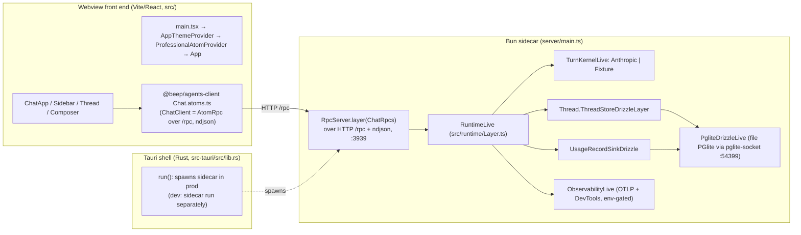

# 15 — Apps & Runtime Wiring (Authoritative)

_Date: 2026-06-17_
_Scope: current-state inventory of every app under `apps/*` and how each composes its runtime Layers / Atom runtimes at the app boundary. Substrate read first: [`16-package-topology-census.md`](./16-package-topology-census.md)._

> GUARDRAIL: This file inventories runtime wiring that exists on disk **today**. The desktop app's `professional_desktop_health` Rust command advertises four slices `["workspace", "agents", "epistemic", "law-practice"]`, but only `workspace` (ThreadStore) + `agents` (turn kernel) + `epistemic` (usage record) are actually wired into the running chat sidecar. `law-practice` is **named but not wired** — consistent with its domain-only state in the topology census. No pruned "repo-memory / L3 code-intelligence" runtime is wired into any app. The IP-law product is not a running app yet.

---

## 1. App roster (what each app *is* and *runs*)

Four apps. They are wildly different shapes — one Tauri+Bun desktop with a real Effect RPC backend, one Next.js marketing/contact site, one headless contract-harness "app", one Storybook host. Only **professional-desktop** has a non-trivial app-local runtime Layer graph.

| App | Path | Shell / runner | What it actually runs today | Runtime posture |
|---|---|---|---|---|
| `@beep/professional-desktop` | `apps/professional-desktop` | Tauri 2 (Rust) webview + Vite/React front end + **Bun sidecar** | Desktop chat surface (Sidebar/Thread/Composer) talking over RPC-on-HTTP (ndjson) to a Bun process that runs an Effect `ChatRpcs` server backed by file-backed PGlite | **Working runtime** (dev: fixture kernel; prod: Anthropic kernel + bundled sidecar) |
| `@beep/oip-web` | `apps/oip-web` | Next.js (App Router, Turbopack) | IP-law firm public/marketing site: home page, contact intake (HubSpot), SEO/sitemap/robots/manifest, `llms.txt` | **Working runtime** (per-request Effect at route boundary; thin browser Atom runtime) |
| `@beep/architecture-lab-proof` | `apps/architecture-lab-proof` | None (library-shaped "app"; `Effect` exported, run by tests) | A single `runArchitectureLabProof` Effect that creates one `WorkItem` through the architecture-lab server and projects a summary view-model | **Harness, not a process** — no entrypoint, no `main` |
| `@beep/storybook` | `apps/storybook` | Storybook (`@storybook/react-vite`) + Vite | Executable Storybook host for `@beep/ui` foundation stories; QA via `@vitest/browser` + Playwright | **Tooling host** — no app-local Effect runtime; consumes `@beep/ui` only |

Sources: app `package.json` files (`apps/*/package.json`), `apps/professional-desktop/src-tauri/tauri.conf.json`, `apps/architecture-lab-proof/src/index.ts`, `apps/storybook/.storybook/main.ts`.

---

## 2. professional-desktop — the only multi-layer runtime app

This is the app where "runtime Layer composition" is a real, substantive thing. It is a **three-process** topology, not one.

### 2a. Front-end entrypoint & Atom runtime (browser side)

- **Entrypoint:** `src/main.tsx` — `createRoot(...).render(<AppThemeProvider><ProfessionalAtomProvider><App/></ProfessionalAtomProvider></AppThemeProvider>)`. Imports `@beep/ui/styles/globals.css`.
- **App-local Atom runtime:** `src/runtime/ProfessionalAtomRuntime.ts` builds `professionalBrowserRuntime = Atom.context({ memoMap })(Layer.empty)`. **The browser runtime layer is `Layer.empty`** — the desktop front end provides *no* app-local services to atoms; all server interaction goes through the RPC client defined in `@beep/agents-client`.
- **Provider:** `src/runtime/ProfessionalAtomProvider.tsx` — `<RegistryProvider defaultIdleTTL={30_000}>` + `useAtomMount(professionalBrowserRuntime)`.
- **Where the client→server edge actually lives:** NOT in the app. It is in `@beep/agents-client/Chat.atoms.ts`: `ChatClient = AtomRpc.Service(...)({ group: ChatRpcs, protocol: RpcClient.layerProtocolHttp({ url: SERVER_URL }) ⨁ RpcSerialization.layerNdjson ⨁ FetchHttpClient.layer })`. `SERVER_URL` resolves to `<origin>/rpc` when served from an http(s) origin (dev / `tauri dev`), else falls back to `http://127.0.0.1:3939/rpc` (packaged `tauri://` origin). Client observability rides `Atom.runtime.addGlobalLayer(ClientObservabilityLive)` (env-gated OTLP).

> Doctrine note ("app entrypoint wires top-level"): the desktop **front-end** under-delivers on this — its app-local layer is empty and the load-bearing client wiring (RPC protocol, serialization, observability) sits in the shared `@beep/agents-client` slice package, not in `apps/professional-desktop/src/runtime`. The **sidecar**, by contrast, *does* follow the doctrine: `src/runtime/Layer.ts` is the single place slices are composed.

### 2b. Sidecar entrypoint & runtime Layer composition (server side)

- **Entrypoint:** `server/main.ts` — `BunRuntime.runMain(Layer.launch(Main))`. `Main = RpcServer.layer(ChatRpcs)` provided by `RuntimeLive`, merged with an HTTP router (`RpcServer.layerProtocolHttp({ path: "/rpc" })`), permissive CORS, `BunHttpServer.layer({ port: PORT, idleTimeout: 255 })` where `PORT = Config.port("CHAT_SIDECAR_PORT")` defaults to `3939` (255s = Bun max, to survive silent streamed-turn tails), and `RpcSerialization.layerNdjson`.
- **The app-local runtime Layer:** `src/runtime/Layer.ts` exports `RuntimeLive` (and `RuntimeTest`). This is the canonical "app entrypoint wires top-level" composition. It assembles `ChatHandlersLive` (the `ChatRpcs` handler group from `src/chat/ChatOrchestrator.ts`) by satisfying its three requirements:

| Requirement | Live provider | Test/fixture provider | Source slice |
|---|---|---|---|
| `AgentTurnKernel` | `AnthropicTurnKernel` (default; resolves `AI_ANTHROPIC_API_KEY` itself) | `FixtureTurnKernel` (keyless, deterministic) | `@beep/agents-server`, `@beep/agents-use-cases/proof` |
| `Thread.ThreadStore` | `Thread.ThreadStoreDrizzleLayer` over PGlite | `Thread.ThreadStoreInMemoryLayer` | `@beep/workspace-server` |
| `UsageRecordSink` | `UsageRecordSinkDrizzle` over PGlite | `UsageRecordSinkInMemory` | `apps/.../src/chat/UsageRecordSink.ts` + `@beep/epistemic-domain` |

Kernel selection is env-driven: `Config.literals(["anthropic","fixture"],"CHAT_AGENT")` defaulting to `anthropic` (`src/runtime/Layer.ts` `TurnKernelLive`).

- **Composition shape (`RuntimeLive`):**
  `ChatHandlersLive.pipe(Layer.provide([TurnKernelLive, ThreadStoreDrizzleLayer, UsageRecordSinkDrizzle]), Layer.provide(PgliteDrizzleLive), Layer.provideMerge(ObservabilityLive))`. The handler group's `AgentTurnKernel | ThreadStore | UsageRecordSink` are resolved to `never`, leaving only the rpc/http transport for `server/main.ts`.

### 2c. The shared database (PGlite-in-sidecar)

`src/runtime/Pglite.ts` (`PgliteDrizzleLive`): boots a **file-backed** `PGlite` instance, exposes it over the Postgres wire protocol via `PGLiteSocketServer` on loopback `127.0.0.1:54399` (`CHAT_DB_PORT`), and points `@beep/postgres` `PostgresClient`/`PostgresDrizzle` at it. Data dir defaults to repo-local `.beep/professional-desktop/chat-db` (`CHAT_DB_PATH`; packaged app points it at Tauri `app_data_dir/chat-db`). **db-admin Drizzle migrations** (`packages/_internal/db-admin/drizzle`, schema `drizzle`) are applied on boot (idempotent). Socket server + db are `Scope`-owned (acquire/release), so the sidecar leaves no orphan listener. Both the ThreadStore and the usage sink share this one database.

### 2d. Observability

`src/runtime/Observability.ts` (`ObservabilityLive` = `OtlpLive ⨁ DevToolsLive`): both env-gated, both collapse to `Layer.empty` by default. `OTEL_EXPORTER_OTLP_ENDPOINT` enables effect-native OTLP export (no OpenTelemetry SDK dep). `DEVTOOLS=true` enables the Effect DevTools websocket mirror via `@beep/observability/server` (local-URL guard unless `DEVTOOLS_ALLOW_REMOTE=true`).

### 2e. Tauri shell & build/run posture

- **Rust shell:** `src-tauri/src/lib.rs` exposes a `professional_desktop_health` IPC command (advertises `runtime_connection: "pending"`, slices `["workspace","agents","epistemic","law-practice"]` — see guardrail). In **prod** (`!debug_assertions`) it spawns the bundled `sidecar` external binary with `CHAT_DB_PATH=<app_data>/chat-db`, `CHAT_AGENT=anthropic`, and an Anthropic key resolved from `AI_ANTHROPIC_API_KEY` or the 1Password CLI (`op read op://BEEP_SECRETS/...`), and kills it on `RunEvent::Exit`. In **dev** the sidecar is run separately.
- **Run lanes (`package.json`):** `dev` = `vite --host 127.0.0.1` (front end, port 1421); `dev:sidecar` = `CHAT_AGENT=fixture bun run server/main.ts` (keyless); `dev:tauri` = `tauri dev`; `build:sidecar` = `scripts/build-sidecar.ts` (`bun build --compile server/main.ts` → `src-tauri/binaries/sidecar-<target-triple>` for Tauri `externalBin`).
- **Tauri config:** `beforeBuildCommand` = `bun run build:sidecar && bun run build`; `frontendDist` = `../dist`; CSP `connect-src` allows `http://127.0.0.1:3939` (the sidecar). `bundle.externalBin = ["binaries/sidecar"]`.
- **Vite dev proxy** (`vite.config.ts`): `/rpc` → `http://127.0.0.1:3939` (same-origin rpc to the sidecar) and `/otlp` → `http://localhost:4318` (OTel collector). Port `1421`, `strictPort`.

> Working-runtime verdict: **professional-desktop is a working runtime**, end-to-end, in the *fixture* configuration (`bun run dev:sidecar` + `bun run dev`, no API key, no external services). The *live* configuration (Anthropic kernel) is wired but depends on `AI_ANTHROPIC_API_KEY`. Several finalization details are explicitly stubbed: usage records on the fixture path are synthesized with `provider/model: "fixture"` and null token/cost/latency, and a `TODO(live sidecar)` in `ChatOrchestrator.ts` flags carrying real provider/model/token/latency + a real request principal once the live path lands. The Rust health command's `runtime_connection: "pending"` is a literal stub.

---

## 3. oip-web — Next.js, per-request Effect at the boundary

- **Framework runner:** Next.js App Router with Turbopack. Dev via `portless oip-web next dev --turbopack` (named `.localhost` URL); build `next build --turbopack`; PWA build is a separate webpack lane (`build:pwa`). Deploy target is Vercel (`vercel.json`, `@vercel/analytics`, `@vercel/speed-insights`).
- **No app-local Effect Layer graph.** The runtime model is "run an Effect per request/render." Route handlers call `Effect.runPromise(...)` directly — e.g. `src/app/api/contact/route.ts` `POST` runs an Effect that decodes a `ContactSubmissionPayload` and dispatches to the HubSpot-backed contact workflow (`src/contact/ContactSubmission.service.ts`). `layout.tsx` runs small synchronous config Effects (`Effect.runSync(Config.option(...))`) to gate dev-only scripts and Vercel insights.
- **App-local Atom runtime:** `src/runtime/OipAtomRuntime.ts` — `oipBrowserRuntime = Atom.context({ memoMap })(oipBrowserLayer)` where `oipBrowserLayer = BrowserHttpClient.layerFetch ⨁ BrowserKeyValueStore.layerLocalStorage`. Mounted by `src/runtime/OipAtomProvider.tsx`. This **is** an app-local layer (unlike the desktop's `Layer.empty`), but a thin one — fetch + localStorage only.
- **Product relevance:** oip-web is the IP-law firm's *public face* (the home page is `OipHomePage.tsx`, content modeled in `src/content/OipContent.model.ts`). It is marketing/intake, not the practice flywheel runtime.

> Working-runtime verdict: **working** as a Next.js site with a real Effect-backed contact intake path (HubSpot driver). It does not embody the "app entrypoint composes slices into one runtime Layer" doctrine — Next.js owns the process lifecycle and Effects are run ad hoc at boundaries.

---

## 4. architecture-lab-proof — a harness shaped like a package

- **No entrypoint, no process.** `src/index.ts` exports `runArchitectureLabProof: Effect<…, WorkItemActionError, WorkItemServer>` and a result schema. There is no `main`, no Bun/Vite runner. It is consumed by `test/ArchitectureLabProof.test.ts` (the `beep:test`/`beep:test:integration` lanes), which must provide `WorkItemServer` to discharge the requirement.
- **What it proves:** the canonical full vertical slice (`@beep/architecture-lab-{config,domain,server,ui,use-cases}`) composes — create a `WorkItem` through the server, project a summary view-model. It is the didactic "complete slice" reference exerciser, not a product.
- **Build posture:** `tsc -b` + babel `annotate-pure-calls` (it publishes like a library: `exports`, `publishConfig`, `dist/**`). It has its own docgen lane.

> Working-runtime verdict: **not a runtime** — a contract/proof harness. "App" here means "app-tier package that wires slices for a test," not a launchable process.

---

## 5. storybook — UI host, no Effect runtime

- **Runner:** `@storybook/react-vite` + Vite; `bun run storybook` = `portless storybook.beep ... storybook dev`; build to `storybook-static/` (present on disk — a built artifact is checked in / cached). QA via `@vitest/browser` + Playwright (`test:storybook`).
- **Config:** `.storybook/{main.ts,manager.ts,preview.tsx,preview.css}`. Consumes `@beep/ui` and reads stories from `packages/foundation/ui-system/*/stories/` (per the `beep:lint` glob).
- **No app-local Layer / Atom runtime.** Pure UI surface.

---

## 6. Cross-app comparison — runtime-wiring doctrine adherence

| Dimension | professional-desktop | oip-web | architecture-lab-proof | storybook |
|---|---|---|---|---|
| Launchable process | ✓ (Tauri + Bun sidecar) | ✓ (Next.js) | ✗ (test-run) | ✓ (Storybook) |
| App-local runtime Layer file | ✓ `src/runtime/Layer.ts` (sidecar) | ✗ (per-request Effects) | ✗ (exports an Effect) | ✗ |
| App-local Atom runtime | `Layer.empty` (front end) | thin (`fetch`+`localStorage`) | n/a | n/a |
| Composes domain slices at the boundary | ✓ (agents + workspace + epistemic) | partial (contact only) | ✓ (architecture-lab) | ✗ |
| Real DB | ✓ file PGlite + Drizzle migrations | ✗ (HubSpot SaaS) | ✗ (in-test) | ✗ |
| Observability wired | ✓ env-gated OTLP/DevTools (server + client) | analytics SDKs only | ✗ | ✗ |
| Product (IP-law) relevance | indirect (chat shell, advertises `law-practice` but unwired) | direct (firm marketing/intake) | none (reference vehicle) | none |

**Key tension for downstream agents:** the doctrine "app entrypoint wires top-level Layers" is cleanly honored in exactly one place — the **professional-desktop Bun sidecar** (`src/runtime/Layer.ts`). The desktop front end pushes its load-bearing client wiring down into `@beep/agents-client`; oip-web runs Effects ad hoc per request; the other two have no runtime to wire. So "app-local runtime composition" as a repo pattern is essentially a sample size of one mature instance.

---

## Confidence & Caveats

**Verified (opened directly):**
- professional-desktop full tree: `src/main.tsx`, `src/App.tsx`, `src/runtime/{Layer,Pglite,Observability,ProfessionalAtomRuntime}.ts(x)`, `src/runtime/ProfessionalAtomProvider.tsx`, `src/chat/ChatOrchestrator.ts`, `src/chat/ui/ChatApp.tsx`, `server/main.ts`, `scripts/build-sidecar.ts`, `vite.config.ts`, `src-tauri/{tauri.conf.json, src/lib.rs, src/main.rs, Cargo.toml}`.
- Client→server edge: `packages/agents/client/src/Chat.atoms.ts` (`ChatClient` AtomRpc, `SERVER_URL`, global observability layer) and the presence of `ClientObservability.ts`.
- oip-web: `package.json`, `src/runtime/OipAtomRuntime.ts`, `src/app/api/contact/route.ts`, `src/app/layout.tsx` head, `src/contact/ContactSubmission.service.ts` head, full `src/` file listing.
- architecture-lab-proof: `package.json`, `src/index.ts`, test file presence.
- storybook: `package.json`, `.storybook/` dir listing.
- Env flags / ports / defaults quoted directly from the files above (`CHAT_AGENT`, `CHAT_SIDECAR_PORT=3939`, `CHAT_DB_PORT=54399`, `CHAT_DB_PATH`, vite `1421`, idleTimeout `255`).

**UNVERIFIED:**
- Whether any app *currently builds/boots green* — no builds, `tauri dev`, or `next dev` were run (read-only investigation per instructions). "Working runtime" verdicts are inferred from wiring completeness, not from a live boot.
- Exact contents of `@beep/agents-server/AnthropicTurnKernel`, `@beep/agents-use-cases/proof` `FixtureTurnKernel`, and `Thread.ThreadStoreDrizzleLayer` internals — referenced via imports, not opened here (their slices are inventoried in file 16).
- storybook `storybook-static/` freshness (a built artifact is on disk; not regenerated/verified).
- oip-web `proxy.ts` / `OipRedirects.ts` runtime behavior (listed, not deep-read).

**NOT FOUND:**
- No app-local runtime Layer for oip-web, architecture-lab-proof, or storybook (only professional-desktop's sidecar has one).
- No `law-practice` runtime wiring in any app — it is advertised in the Rust health command's slice list but has no provider in `RuntimeLive` (consistent with `law-practice` being domain-only in file 16).
- No pruned "repo-memory v0 / L3 code-intelligence" runtime wired into any app.
- No fifth app; `apps/` is exactly `{professional-desktop, oip-web, architecture-lab-proof, storybook}`.

**Open questions for downstream agents:**
- The desktop's `runtime_connection: "pending"` and the `TODO(live sidecar)` (real provider/model/token/latency + request principal) mark the live Anthropic chat path as wired-but-unfinished — how far from "live-green" is it really?
- Is the desktop front-end's `Layer.empty` Atom runtime an intentional minimalism (all state via RPC) or an under-wiring that future app-local services (e.g. local key/value, offline cache) will fill?

### Verification (2026-06-17)

Adversarial spot-check of cited in-repo paths and load-bearing claims.

**Checked & confirmed on disk:**
- App roster is exactly `{professional-desktop, oip-web, architecture-lab-proof, storybook}` — `apps/` listing matches; all four `package.json` present. No fifth app.
- Desktop runtime tree (`src/runtime/{Layer,Pglite,Observability,ProfessionalAtomRuntime}.ts`, `ProfessionalAtomProvider.tsx`), `server/main.ts`, `scripts/build-sidecar.ts`, `vite.config.ts`, `src-tauri/{src/lib.rs,tauri.conf.json}`, `src/chat/{ChatOrchestrator,UsageRecordSink}.ts` all exist.
- `RuntimeLive` composition (section 2b/2c) verified verbatim against `src/runtime/Layer.ts` lines 82-86: `ChatHandlersLive.pipe(Layer.provide([TurnKernelLive, Thread.ThreadStoreDrizzleLayer, UsageRecordSinkDrizzle]), Layer.provide(PgliteDrizzleLive), Layer.provideMerge(ObservabilityLive))`. `RuntimeTest` (fixture + in-memory) confirmed. `TurnKernelLive` env-selects via `Config.literals(["anthropic","fixture"],"CHAT_AGENT")` default `anthropic` — confirmed.
- Ports/env: sidecar `CHAT_SIDECAR_PORT` default `3939`; `idleTimeout: 255`; PGlite `CHAT_DB_PORT` default `54399`, `CHAT_DB_PATH` default `.beep/professional-desktop/chat-db`; vite `1421`/`strictPort`, `/rpc`→`:3939`, `/otlp`→`:4318`; migrations from `packages/_internal/db-admin/drizzle` schema `drizzle` — all confirmed in source.
- Client edge: `packages/agents/client/src/Chat.atoms.ts` `ChatClient` = `AtomRpc.Service` with `RpcClient.layerProtocolHttp({url: SERVER_URL})` + `RpcSerialization.layerNdjson` + `FetchHttpClient.layer`; `SERVER_URL` = `/rpc` on http(s) origin else `http://127.0.0.1:3939/rpc` — confirmed verbatim.
- Front-end `professionalBrowserRuntime = factory(Layer.empty)` confirmed; oip `oipBrowserLayer = mergeAll(BrowserHttpClient.layerFetch, BrowserKeyValueStore.layerLocalStorage)` confirmed.
- Rust `professional_desktop_health`: `runtime_connection: "pending"`, `slices: ["workspace","agents","epistemic","law-practice"]` (literal `[&'static str; 4]`) — confirmed; `law-practice` is named, no `RuntimeLive` provider exists for it. Prod spawn sets `CHAT_AGENT=anthropic`, `CHAT_DB_PATH=<app_data>/chat-db`, key from `AI_ANTHROPIC_API_KEY` or `op read op://BEEP_SECRETS/...`, killed on `RunEvent::Exit` — confirmed.
- `ChatOrchestrator.ts` `TODO(live sidecar)` and fixture `provider/model: "fixture"` synthesis — confirmed (lines ~222-253, 324).
- Pruned-tech guard: scoped grep over `apps/*/src` and `apps/*/server` for `repo-memory|code-ast|repo-intelligence|L3 ...code intel` returned **nothing**. No pruned code-intelligence runtime is wired into any app. The product (IP-law) is correctly framed as not-yet-a-running-app; oip-web is its marketing/intake face only.

**Corrected:**
- Section 2b: changed the literal `BunHttpServer.layer({ port: 3939, ... })` to `{ port: PORT, ... }` with `PORT = Config.port("CHAT_SIDECAR_PORT")` default `3939`, matching `server/main.ts` (the port is env-configurable, not hard-coded). The caveats section already listed `CHAT_SIDECAR_PORT=3939`, so this aligns the narrative with its own appendix.

**Remaining doubts (unchanged from doc's own UNVERIFIED list):**
- No live boot was attempted; "working runtime" verdicts remain wiring-inferred, not runtime-proven.
- Internals of `AnthropicTurnKernel` / `FixtureTurnKernel` / `ThreadStoreDrizzleLayer` were not opened (import-confirmed only).
