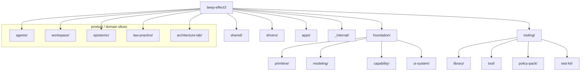

# 16 — Package & Topology Census (Authoritative)

_Date: 2026-06-17_
_Scope: current-state inventory of every workspace package in `beep-effect3`. This file is the SUBSTRATE other baseline-synthesis agents read; treat the tables here as the canonical "what exists today" reference._

## How this was built

- Canonical export facts: `standards/repo-exports.catalog.md` (89-package summary table, lines 36–128) and its `.jsonc` sibling. **Not regenerated** for this census — read as-is.
- Full `package.json` glob across `packages/**` and `apps/**` (excluding `node_modules`, `.next`, test fixtures).
- Per-package `src/` and `test/` presence + TypeScript file counts measured directly on disk.
- Slice/family directory names confirmed via `ls packages` and targeted directory listings.

**Census totals (cross-checked):** 89 workspace packages in the export catalog (includes `@beep/root` at `.` and `@beep/infra` at `infra`, which sit outside `packages/`/`apps/`). The on-disk `package.json` glob yields **84 real packages under `packages/` + `apps/`** (the catalog's 89 also counts `@beep/root`, `@beep/infra`, and 4 phantom `missing-workspace-metadata` rows — `dependencies`/`devDependencies`/etc. — which are not real packages). The catalog's "missingWorkspaceMetadata: 4" line is those phantom rows.

> GUARDRAIL NOTE: This is a topology census of code that exists on disk **today**. The pruned "repo-memory v0 / L3 deterministic code-intelligence" product layer is NOT inventoried here as a capability. Where repo-intelligence-flavored packages survive (e.g. `@beep/repo-codegraph`, `@beep/repo-ai-metrics`), they are tooling/library substrate for the monorepo's own quality lanes — a *learning vehicle residue*, not the product. The product (solo IP-law firm flywheel) is represented by the `law-practice` slice and the Corpus CLI data-prep tool, both flagged below.

---

## Family map (directory truth)

`ls packages` returns exactly these family roots:

```
agents/  architecture-lab/  drivers/  epistemic/  foundation/  _internal/  law-practice/  shared/  tooling/  workspace/
```

Plus `apps/`. There is **no `semantic-web/` slice dir** and **no `rdf/` slice dir** at the top level — those exist as single foundation packages (`@beep/semantic-web`, `@beep/rdf`), not as multi-package product slices (see naming resolution below).



---

## Naming resolution (uncertainties settled)

| Question | Answer (verified on disk) | Evidence |
|---|---|---|
| Is the slice `agent-capability` or `agents`? | **`agents`**. No package or dir named `agent-capability` exists (`grep` for `agent-capability` in package.json names returned nothing). The rename mentioned in goals has **NOT landed**; the four packages are `@beep/agents-{domain,server,client,use-cases}` under `packages/agents/`. | `ls packages` → `agents/`; grep miss |
| Does `epistemic` exist? Is it `epistemic` or `epistemic-domain`? | Slice dir is **`epistemic/`**, containing two packages: **`@beep/epistemic-domain`** (`packages/epistemic/domain`) and **`@beep/epistemic-tables`** (`packages/epistemic/tables`). | catalog rows 58, 87; `ls packages/epistemic` |
| Does `semantic-web` exist? | Yes, as **one capability package** `@beep/semantic-web` at `packages/foundation/capability/semantic-web` (30 src files). Not a slice. | catalog row 44 |
| Does `rdf` exist? | Yes, as **one modeling package** `@beep/rdf` at `packages/foundation/modeling/rdf` (13 src files). Not a slice. | catalog row 67 |
| Does `law-practice` exist? | Yes. Slice dir **`law-practice/`** with **one package** `@beep/law-practice-domain` (`packages/law-practice/domain`, 14 src files). Server/tables/use-cases/client tiers NOT FOUND — domain-only. | catalog row 23; `ls packages/law-practice` |
| `architecture-lab` | Exists as a **full 7-package slice** + a proof app — the most complete vertical-slice example in the repo (see below). | catalog rows 7,15,47,59,69,72,86,125 |

---

## Master census — by family

Legend: **src** = has `src/`; **test** = has `test/`; **#ts** = count of `.ts`/`.tsx` files under `src/`. All paths are repo-relative.

### foundation/primitive

| Package | Path | src | test | #ts | Purpose (one line) |
|---|---|:--:|:--:|--:|---|
| `@beep/types` | `packages/foundation/primitive/types` | ✓ | ✓ | 5 | Lowest-level shared TypeScript type primitives. |
| `@beep/data` | `packages/foundation/primitive/data` | ✓ | ✓ | 25 | Primitive data helpers/values (effect-native data utilities). |

### foundation/modeling

| Package | Path | src | test | #ts | Purpose |
|---|---|:--:|:--:|--:|---|
| `@beep/schema` | `packages/foundation/modeling/schema` | ✓ | ✓ | 228 | Core `effect/Schema` extensions — the schema-first backbone (largest modeling pkg). |
| `@beep/identity` | `packages/foundation/modeling/identity` | ✓ | ✓ | 3 | `$I` identity composers / EntityId + package identity registry. |
| `@beep/utils` | `packages/foundation/modeling/utils` | ✓ | ✓ | 24 | General modeling utilities (582 unique exported symbols). |
| `@beep/rdf` | `packages/foundation/modeling/rdf` | ✓ | ✓ | 13 | RDF modeling primitives (triples/terms schemas). |
| `@beep/html` | `packages/foundation/modeling/html` | ✓ | ✓ | 5 | HTML AST modeling. |
| `@beep/md` | `packages/foundation/modeling/md` | ✓ | ✓ | 5 | Markdown AST modeling. |
| `@beep/pandoc-ast` | `packages/foundation/modeling/pandoc-ast` | ✓ | ✓ | 5 | Pandoc AST schema modeling. |
| `@beep/lexical-schema` | `packages/foundation/modeling/lexical` | ✓ | ✓ | 3 | Lexical (editor) document schema modeling. |

### foundation/capability

| Package | Path | src | test | #ts | Purpose |
|---|---|:--:|:--:|--:|---|
| `@beep/nlp` | `packages/foundation/capability/nlp` | ✓ | ✓ | 75 | NLP capability layer (large: 459 unique symbols). |
| `@beep/semantic-web` | `packages/foundation/capability/semantic-web` | ✓ | ✓ | 30 | Semantic-web utilities/schemas/services (219 unique symbols). |
| `@beep/observability` | `packages/foundation/capability/observability` | ✓ | ✓ | 23 | Tracing/metrics/logging capability. |
| `@beep/file-processing` | `packages/foundation/capability/file-processing` | ✓ | ✓ | 7 | File ingestion/processing capability. |
| `@beep/langextract` | `packages/foundation/capability/langextract` | ✓ | ✓ | 6 | Language-extraction capability. |
| `@beep/chalk` | `packages/foundation/capability/chalk` | ✓ | ✓ | 10 | Terminal styling capability. |
| `@beep/colors` | `packages/foundation/capability/colors` | ✓ | ✓ | 4 | Color utilities capability. |

### foundation/ui-system

| Package | Path | src | test | #ts | Purpose |
|---|---|:--:|:--:|--:|---|
| `@beep/ui` | `packages/foundation/ui-system/ui` | ✓ | ✓ | 121 | Core UI component system (461 unique symbols). |
| `@beep/form` | `packages/foundation/ui-system/form` | ✓ | ✓ | 15 | Form system. |
| `@beep/editor` | `packages/foundation/ui-system/editor` | ✓ | ✓ | 10 | Rich-text editor UI. |

### shared/*

Standard horizontal slice tiers (domain/server/client/tables/use-cases/ui/config). Most are thin (1 src file) — they re-export/compose.

| Package | Path | src | test | #ts | Purpose |
|---|---|:--:|:--:|--:|---|
| `@beep/shared-domain` | `packages/shared/domain` | ✓ | ✓ | 36 | Cross-slice domain models (111 unique symbols — the substantive one). |
| `@beep/shared-tables` | `packages/shared/tables` | ✓ | ✓ | 11 | Shared drizzle table definitions. |
| `@beep/shared-ui` | `packages/shared/ui` | ✓ | ✓ | 4 | Shared UI compositions. |
| `@beep/shared-server` | `packages/shared/server` | ✓ | ✓ | 1 | Shared server wiring (thin). |
| `@beep/shared-client` | `packages/shared/client` | ✓ | ✓ | 1 | Shared client wiring (thin). |
| `@beep/shared-config` | `packages/shared/config` | ✓ | ✓ | 1 | Shared config (thin). |
| `@beep/shared-use-cases` | `packages/shared/use-cases` | ✓ | ✓ | 1 | Shared use-case orchestration (thin). |

### drivers/* (external-system adapters)

All have `src` + `test`. These wrap third-party APIs/binaries behind Effect services.

| Package | Path | #ts | Purpose |
|---|---|--:|---|
| `@beep/anthropic` | `packages/drivers/anthropic` | 5 | Anthropic LLM API driver. |
| `@beep/xai` | `packages/drivers/xai` | 7 | xAI LLM driver. |
| `@beep/venice-ai` | `packages/drivers/venice-ai` | 3 | Venice AI driver. |
| `@beep/openai-compat` | `packages/drivers/openai-compat` | 4 | OpenAI-compatible API driver. |
| `@beep/ai-provider-cli` | `packages/drivers/ai-provider-cli` | 4 | CLI-facing AI provider adapter. |
| `@beep/acp` | `packages/drivers/acp` | 12 | Agent/Client protocol driver (228 unique symbols). |
| `@beep/runpod` | `packages/drivers/runpod` | 6 | RunPod compute driver. |
| `@beep/phoenix` | `packages/drivers/phoenix` | 5 | Arize Phoenix (LLM observability) driver. |
| `@beep/firecrawl` | `packages/drivers/firecrawl` | 5 | Firecrawl web-scraping driver (198 unique symbols). |
| `@beep/box` | `packages/drivers/box` | 13 | Box file-storage driver (huge generated export surface: 3462 symbols). |
| `@beep/sanity` | `packages/drivers/sanity` | 4 | Sanity CMS driver. |
| `@beep/hubspot` | `packages/drivers/hubspot` | 4 | HubSpot CRM/Forms driver. |
| `@beep/discord` | `packages/drivers/discord` | 4 | Discord driver. |
| `@beep/uspto` | `packages/drivers/uspto` | 5 | USPTO patent-data driver (relevant to IP-law product). |
| `@beep/postgres` | `packages/drivers/postgres` | 7 | Postgres driver. |
| `@beep/drizzle` | `packages/drivers/drizzle` | 4 | Drizzle ORM integration driver. |
| `@beep/duckdb` | `packages/drivers/duckdb` | 4 | DuckDB driver. |
| `@beep/tika` | `packages/drivers/tika` | 4 | Apache Tika document-extraction driver. |
| `@beep/libpff` | `packages/drivers/libpff` | 4 | libpff (PST/Outlook) parsing driver. |
| `@beep/ffmpeg` | `packages/drivers/ffmpeg` | 4 | FFmpeg media driver. |
| `@beep/face-detection` | `packages/drivers/face-detection` | 4 | Face-detection driver. |
| `@beep/konva` | `packages/drivers/konva` | 1 | Konva canvas driver (thin). |
| `@beep/wink` | `packages/drivers/wink` | 15 | wink-nlp driver. |
| `@beep/nlp-mcp` | `packages/drivers/nlp-mcp` | 9 | NLP MCP-server driver. |
| `@beep/onepassword-cli` | `packages/drivers/onepassword-cli` | 4 | 1Password CLI driver. |

### tooling/library

| Package | Path | src | test | #ts | Purpose |
|---|---|:--:|:--:|--:|---|
| `@beep/repo-utils` | `packages/tooling/library/repo-utils` | ✓ | ✓ | 65 | Monorepo tooling utilities (515 unique symbols). |
| `@beep/repo-ai-metrics` | `packages/tooling/library/ai-metrics` | ✓ | ✓ | 20 | AI-usage metrics for repo lanes (219 unique symbols). |
| `@beep/ai-sync` | `packages/tooling/library/ai-sync` | ✓ | ✓ | 10 | AI artifact sync tooling. |
| `@beep/repo-codegraph` | `packages/tooling/library/repo-codegraph` | ✓ | ✓ | 5 | Repo code-graph library (learning-vehicle residue; tooling, not product moat). |

### tooling/tool

| Package | Path | src | test | #ts | Purpose |
|---|---|:--:|:--:|--:|---|
| `@beep/repo-cli` | `packages/tooling/tool/cli` | ✓ | ✓ | 162 | The `beep` CLI — quality lanes, codegen, yeet, **Corpus** command, etc. (790 unique symbols). |
| `@beep/repo-docgen` | `packages/tooling/tool/docgen` | ✓ | ✓ | 12 | Docgen tool. |

### tooling/policy-pack & test-kit

| Package | Path | src | test | #ts | Purpose |
|---|---|:--:|:--:|--:|---|
| `@beep/repo-configs` | `packages/tooling/policy-pack/repo-configs` | ✓ | ✓ | 30 | Shared lint/tsconfig/build policy configs. |
| `@beep/test-utils` | `packages/tooling/test-kit/test-utils` | ✓ | ✓ | 5 | Shared test helpers/layers. |

### _internal

| Package | Path | src | test | #ts | Purpose |
|---|---|:--:|:--:|--:|---|
| `@beep/db-admin` | `packages/_internal/db-admin` | ✓ | ✓ | 6 | Internal DB administration tooling (not a public export surface). |

---

## Product / domain slices

These five slice dirs hold the domain verticals. **Built-ness varies enormously** — `architecture-lab` is the only full multi-tier slice; the product-relevant `law-practice` is domain-only.

### `architecture-lab/` — full reference slice (7 pkgs + proof app)

This is the canonical "complete vertical slice" template (domain → tables → server → use-cases → client → ui → config), with an `architecture-lab-proof` app exercising it. It is a **didactic / reference vehicle**, not the product.

| Package | Path | #ts | Purpose |
|---|---|--:|---|
| `@beep/architecture-lab-domain` | `packages/architecture-lab/domain` | 15 | Domain models for the reference slice. |
| `@beep/architecture-lab-tables` | `packages/architecture-lab/tables` | 7 | Drizzle tables. |
| `@beep/architecture-lab-server` | `packages/architecture-lab/server` | 13 | Server services. |
| `@beep/architecture-lab-use-cases` | `packages/architecture-lab/use-cases` | 18 | Use-case orchestration. |
| `@beep/architecture-lab-client` | `packages/architecture-lab/client` | 3 | Client wiring. |
| `@beep/architecture-lab-ui` | `packages/architecture-lab/ui` | 3 | UI. |
| `@beep/architecture-lab-config` | `packages/architecture-lab/config` | 9 | Slice config. |

### `agents/` — agent-capability slice (rename NOT applied)

Four-tier slice. Directory is **`agents/`**, package prefix `@beep/agents-*`. The goals-mentioned rename to "agent-capability" has not landed on disk.

| Package | Path | #ts | Purpose |
|---|---|--:|---|
| `@beep/agents-domain` | `packages/agents/domain` | 12 | Domain models for agents and skills. |
| `@beep/agents-use-cases` | `packages/agents/use-cases` | 23 | Agent use-case orchestration (most substantive tier; 48 unique symbols). |
| `@beep/agents-server` | `packages/agents/server` | 7 | Agent server services (AssistantTurn codecs etc.). |
| `@beep/agents-client` | `packages/agents/client` | 3 | Agent client/observability wiring. |

### `workspace/` — workspace slice (4 tiers, no client/ui)

| Package | Path | #ts | Purpose |
|---|---|--:|---|
| `@beep/workspace-domain` | `packages/workspace/domain` | 34 | Workspace domain models (substantive). |
| `@beep/workspace-tables` | `packages/workspace/tables` | 16 | Workspace drizzle tables. |
| `@beep/workspace-server` | `packages/workspace/server` | 6 | Workspace server services. |
| `@beep/workspace-use-cases` | `packages/workspace/use-cases` | 8 | Workspace use-cases. |

### `epistemic/` — domain + tables only

Models the memory/knowledge substrate as DOMAIN THEORY applied (claims/evidence/activities/usage) — the No-Escape / 4-layer memory framework as schema, not as a running product engine.

| Package | Path | #ts | Purpose |
|---|---|--:|---|
| `@beep/epistemic-domain` | `packages/epistemic/domain` | 13 | Domain models for **claims, evidence, activities, usage**. Entities: `Activity`, `CandidateClaim`, `Evidence`, `UsageRecord` (+ `values/`). |
| `@beep/epistemic-tables` | `packages/epistemic/tables` | 6 | Drizzle tables for the epistemic domain. |

### `law-practice/` — THE PRODUCT slice (domain-only today)

The solo IP-law firm flywheel's domain. **Domain tier only** — no server/tables/use-cases/client packages exist yet. Entities present: `LegalClient`, `LegalContact`, `Matter`, `PatentAsset`.

| Package | Path | #ts | Purpose |
|---|---|--:|---|
| `@beep/law-practice-domain` | `packages/law-practice/domain` | 14 | "Law-practice context domain models for the runtime proof." Entities: `LegalClient`, `LegalContact`, `Matter`, `PatentAsset`. |

> Product reality check: the IP-law product surface on disk today is (a) this **domain-only** slice, (b) the `@beep/uspto` driver, and (c) the **Corpus CLI** (below). There is no law-practice server/use-cases/app wiring yet — it is early.

---

## apps/*

| App | Path | src | test | #ts | Purpose |
|---|---|:--:|:--:|--:|---|
| `@beep/oip-web` | `apps/oip-web` | ✓ | ✓ | 31 | Next.js web app (oip = the public web surface). |
| `@beep/professional-desktop` | `apps/professional-desktop` | ✓ | ✓ | 16 | Desktop app with chat orchestrator/Thread UI (active per git status). |
| `@beep/architecture-lab-proof` | `apps/architecture-lab-proof` | ✓ | ✓ | 1 | Proof harness exercising the architecture-lab slice. |
| `@beep/storybook` | `apps/storybook` | — | — | 0 | Storybook host (no `src/`; config-only consumer of `@beep/ui`). |

---

## The Corpus CLI (ahead-of-time data prep, NOT a live runtime feeder)

- Location: `packages/tooling/tool/cli/src/commands/Corpus/` — verified files: `Corpus.command.ts`, `Corpus.service.ts`, `Corpus.schemas.ts`, `Corpus.errors.ts`, `Corpus.recyclebin.ts`, `index.ts`.
- Header comment: "Command definitions for **corpus curation**." Options include `CorpusCatalogOptions`, `CorpusEnrichOptions`.
- Data target: `/home/elpresidank/data-home/oppold-corpus/` exists on disk (confirmed).
- Framing per guardrail: this is **offline curation/enrichment of the Oppold corpus** — ahead-of-time data prep, not a runtime ingestion pipeline wired into the product.

---

## Slice & family inventory (downstream-reliable summary)

Authoritative names other agents should use verbatim:

| Family / slice dir | Packages (exact `@beep/*` names) | Built-ness |
|---|---|---|
| `foundation/primitive` | `types`, `data` | mature |
| `foundation/modeling` | `schema`, `identity`, `utils`, `rdf`, `html`, `md`, `pandoc-ast`, `lexical-schema` | mature (schema is the anchor) |
| `foundation/capability` | `nlp`, `semantic-web`, `observability`, `file-processing`, `langextract`, `chalk`, `colors` | mature |
| `foundation/ui-system` | `ui`, `form`, `editor` | mature |
| `shared` | `shared-domain`, `shared-tables`, `shared-ui`, `shared-server`, `shared-client`, `shared-config`, `shared-use-cases` | domain/tables substantive; rest thin |
| `drivers` | 25 packages (see table) | varied; all have src+test |
| `tooling/library` | `repo-utils`, `repo-ai-metrics`, `ai-sync`, `repo-codegraph` | mature (codegraph = learning residue) |
| `tooling/tool` | `repo-cli` (incl. Corpus), `repo-docgen` | mature |
| `tooling/policy-pack` | `repo-configs` | mature |
| `tooling/test-kit` | `test-utils` | mature |
| `_internal` | `db-admin` | internal tooling |
| `agents` (NOT `agent-capability`) | `agents-domain`, `agents-use-cases`, `agents-server`, `agents-client` | 4-tier, mid |
| `workspace` | `workspace-domain`, `workspace-tables`, `workspace-server`, `workspace-use-cases` | 4-tier, mid |
| `epistemic` | `epistemic-domain`, `epistemic-tables` | domain+tables only |
| `law-practice` (**product**) | `law-practice-domain` | **domain-only, early** |
| `architecture-lab` | 7 packages (domain/tables/server/use-cases/client/ui/config) | full reference slice |
| `apps` | `oip-web`, `professional-desktop`, `architecture-lab-proof`, `storybook` | varied |

**Key asymmetry for downstream agents:** the most *complete* slice (`architecture-lab`) is a reference/learning vehicle; the *product* slice (`law-practice`) is the least complete (domain-only). Do not conflate slice completeness with product maturity.

---

## Confidence & Caveats

**Verified (opened/measured directly):**
- All 84 on-disk `package.json` files globbed; names, paths, `src/`/`test/` presence, and `.ts`/`.tsx` counts measured on disk (not from catalog alone).
- Slice dir names via `ls packages` — exactly `agents, architecture-lab, drivers, epistemic, foundation, _internal, law-practice, shared, tooling, workspace`.
- Naming resolutions: `agents` (NOT `agent-capability`; grep miss confirms rename not applied); `epistemic-domain` + `epistemic-tables`; `semantic-web` and `rdf` are single foundation packages (NOT slices); `law-practice-domain` is the only law-practice package.
- Entity lists for `law-practice` (`LegalClient`, `LegalContact`, `Matter`, `PatentAsset`) and `epistemic` (`Activity`, `CandidateClaim`, `Evidence`, `UsageRecord`) via direct `ls`.
- Corpus CLI file inventory under `packages/tooling/tool/cli/src/commands/Corpus/` and existence of `/home/elpresidank/data-home/oppold-corpus/`.
- Export/symbol counts quoted from `standards/repo-exports.catalog.md` (read, not regenerated).

**UNVERIFIED:**
- Per-package one-line purposes for some thin packages are inferred from name + path + (where read) the `description` field; not every `package.json` description was opened. Substantive ones (law-practice, epistemic, agents-domain, semantic-web, rdf) were read directly.
- "Built-ness" labels (mature/mid/thin) are heuristic from src-file counts and export symbol counts, not from running builds or tests (per instructions, no builds run).
- The Corpus command's exact runtime behavior beyond curation/enrich option names was not deep-read.

**NOT FOUND:**
- No `agent-capability` package or directory.
- No `semantic-web/` or `rdf/` slice directories (only single foundation packages).
- No `law-practice` server/tables/use-cases/client/app packages (domain-only).
- No present-day "repo-memory v0 / L3 code-intelligence" *product* layer — consistent with the pruning guardrail; only tooling residue (`repo-codegraph`, `repo-ai-metrics`) survives as monorepo-quality substrate.

**Open questions for downstream agents:**
- Is `epistemic` intended as the generalized memory substrate that `law-practice` will consume, or is it independent? (Topology shows no dependency edges here — would need a dependency-graph census to answer.)
- The catalog lists `@beep/infra` (`infra`) and `@beep/root` (`.`) as packages outside `packages/`/`apps/`; their role was not investigated in this census.
