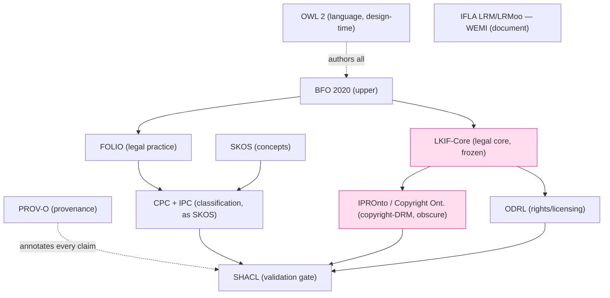

# 20 — External Deep Research: The IP-Law Ontology Stack

_Synthesis date: 2026-06-17_
_Scope: external (web) deep-research on every published ontology / standard cited
by `docs/BEEPGRAPH_ARCHITECTURE.md` and `docs/PROSE_TO_PROOF_ARCHITECTURE_MAP.md`,
cross-checked against what the repo actually ships._

## 0. Framing and guardrail

The **product** is the solo IP-law firm flywheel for the user's father (the sole
active vertical; wealth-management dormant). The ontology stack described below is
**design-time grounding** for that product's knowledge graph, *not* a shipped
reasoning runtime. The repo is explicit and disciplined about this: OWL is
"design-time only; runtime validation is bounded SHACL" with *no OWL reasoner in
the runtime dependency graph*
(`docs/BEEPGRAPH_ARCHITECTURE.md:108-110`), and Effect Schema — not the
ontology — is the typed authority; the ontology is "annotation + projection"
(`docs/BEEPGRAPH_ARCHITECTURE.md:111-113`).

So this artifact answers: *are the standards the docs lean on real, current,
licensed, and a good fit for an IP-law KG?* It treats the memory-architecture
theory (No-Escape, 4-layer taxonomy) as **learned doctrine now applied to law**,
not as code, consistent with the baseline guardrail and with
`90-archaeology-pruned-repo-intel.md`.

**What the repo actually ships toward this stack (verified, live):** the
`@beep/rdf` package carries RDF/OWL value models and a `Vocab/` directory with
namespace+term modules for **OWL, RDFS, SKOS, PROV, OA (Open Annotation), XSD**
(`packages/foundation/modeling/rdf/src/Vocab/{Owl,Rdfs,Skos,Prov,Oa,Xsd}.ts`;
namespace IRIs verified by Read). `@beep/semantic-web` ships PROV-O helpers and a
bounded SHACL adapter (`packages/foundation/capability/semantic-web/src/prov.ts`,
`.../adapters/`). **No domain ontology** (FOLIO, LKIF, IPRonto, BFO, etc.) is
present as a runtime artifact in the inspected tree; they live as *cited grounding
sources* in goal-packet research, and the FOLIO `.owl` file is referenced as
living under a `research/` path, not in a shipping package
(`docs/PROSE_TO_PROOF_ARCHITECTURE_MAP.md:87-88`). The `@beep/ontology` authoring
package is marked **specced / retired** (`docs/BEEPGRAPH_ARCHITECTURE.md:261`).

---

## 1. The two layered tables the repo asserts

The architecture map (`PROSE_TO_PROOF_ARCHITECTURE_MAP.md:69-81`) defines an
**11-row TBox** (the task's "10-layer stack" is this table; counting distinct
*tiers* — Language, Upper, Document, Legal-practice, Legal-core, IP-rights,
Rights/licensing, Concepts, Classification, Provenance, Validation — gives 11
rows / ~9 conceptual tiers). The `ip-law-knowledge-graph` packet separately locks
a **7-ontology source-of-truth set**: S1 LKIF-Core, S2 IPRonto/ALIS, S3 Copyright
Ontology, S4 JudO, S5 LCBR, S6 ESTRELLA, S7 WIPO IPC — plus FOLIO "as backbone"
(`PROSE_TO_PROOF_ARCHITECTURE_MAP.md:83-88`; `BEEPGRAPH_ARCHITECTURE.md:227-229`).

These two lists do not fully agree, which is the first tension to surface (§6).

---

## 2. Per-standard deep dive (verified externally)

Legend for **Fit/Role**: how it serves an IP-law KG. **Health** flags
obscure/abandoned/misnamed risks.

### 2.1 OWL 2 — the modeling language

| Field | Finding |
|---|---|
| What | Web Ontology Language; description-logic-based language for authoring ontologies, with sub-profiles EL / QL / RL trading expressivity for tractable reasoning. |
| Steward | W3C. |
| Version / status (2026) | **OWL 2**, W3C Recommendation. Core docs 27 Oct 2009; the Second-Edition documents (incl. Profiles, Conformance) published 11 Dec 2012. **Still current — no OWL 3.** Repo's "EL + RL profiles" is accurate: EL classifies large hierarchies, RL is rule-engine-implementable. |
| License | W3C open standard (royalty-free, W3C Document/Software licenses). |
| Canonical IRI | `http://www.w3.org/2002/07/owl#` (matches repo `Vocab/Owl.ts`). |
| Fit/Role | Correct and uncontroversial as the schema *language*. The repo's discipline (EL/RL **design-time**, bounded SHACL at runtime) is a defensible engineering call: full OWL reasoning at scale is the exact failure mode the No-Escape theorem warns about. |
| Health | Healthy, ubiquitous. |

### 2.2 BFO — the upper ontology

| Field | Finding |
|---|---|
| What | Basic Formal Ontology; a small top-level ontology of universals (continuants/occurrents) used to keep domain ontologies satisfiable and interoperable. |
| Steward | Barry Smith et al.; National Center for Ontological Research; maintained on the `BFO-ontology/BFO-2020` GitHub. |
| Version / status (2026) | **BFO 2020**, standardized as **ISO/IEC 21838-2:2021** (repo's citation is correct). Adopted by 650+ ontology projects (heavily biomedical/defense/industry). |
| License | BFO artifacts open (CC-BY family on GitHub); the ISO text itself is paywalled. |
| Canonical IRI | `http://purl.obolibrary.org/obo/bfo.owl` (BFO 2020 namespace `obo/bfo/2020/`). UNVERIFIED exact 2026 PURL string — not fetched this session. |
| Fit/Role | As an *upper* layer it is sound, but BFO's center of gravity is **biomedicine/industry, not law**. It "keeps the schema satisfiable; never sees a document" (repo's own framing, `:72`) — i.e. a sanity scaffold, not an IP vocabulary. Reasonable but not the natural legal upper ontology (LKIF-Core itself bundles a top layer; FOLIO has its own structure). Using BFO *and* LKIF-Core *and* FOLIO risks triple-rooting (§6). |
| Health | Healthy and ISO-blessed, but a slightly heavyweight choice for a solo IP firm. |

### 2.3 FRBR / IFLA LRM / LRMoo — the document model (WEMI)

| Field | Finding |
|---|---|
| What | Bibliographic conceptual model: Work → Expression → Manifestation → Item (WEMI). LRM consolidates the older FRBR/FRAD/FRSAD family; LRMoo is the object-oriented (CIDOC-CRM-aligned) expression. |
| Steward | IFLA (International Federation of Library Associations). |
| Version / status (2026) | **IFLA LRM** approved/endorsed **18 Aug 2017** (rev. Dec 2017). **LRMoo** supersedes FRBRoo 2.4 (2016) and is endorsed (also via ICOM/CIDOC). FRBR/FRAD/FRSAD are formally **retired**, folded into LRM (drove the RDA Toolkit restructure). Repo's "FRBR / LRM / LRMoo (WEMI)" is current and correctly hierarchized. |
| License | IFLA documents are openly published (the LRM PDF is freely available). |
| Canonical IRI | LRMoo class namespace under CIDOC-CRM family; UNVERIFIED exact IRI this session. |
| Fit/Role | **Strong, slightly unusual, and clever.** Treating a `.md` and a `.docx` as two *Manifestations* of one *Expression*, each copy an *Item* (`:73`) is exactly right for a DMS where "identity is minted and stable, locators are properties" (`:59`). This is the most defensible non-obvious choice in the stack. |
| Health | Healthy, actively stewarded. |

### 2.4 FOLIO — the legal-practice layer

| Field | Finding |
|---|---|
| What | Federated Open Legal Information Ontology; ~18,000+ legal concepts (areas of law, document types, jurisdictions, governmental bodies, services). |
| Steward (2026) | **ALEA Institute** (Institute for the Advancement of Legal and Ethical AI). **Lineage matters:** SALI Alliance built LMSS → became **SOLI** (Standard for Open Legal Information) → rebranded to **FOLIO** on **14 Mar 2025**. |
| Governance caveat (verified, primary source) | In **Aug 2024** ALEA flagged SALI Alliance governance problems: Delaware corporate status "Void" since 2020, no Illinois registration, IRS filing discrepancies. SALI paused; ALEA forked the MIT-licensed LMSS as SOLI (Sept 2024); SALI sent cease-and-desist (Jan 2025); ALEA proceeded and rebranded to FOLIO. The repo's governance note — "describe as 'open, ALEA-stewarded,' not an uncontested single standard" (`:74`) — is **exactly right and well-earned.** |
| License | **Dual-licensed (verified against the FOLIO GitHub README this session):** the ontology **data is CC-BY 4.0** ("The data in this repository is licensed under a Creative Commons Attribution 4.0 International License"); only the **source code/tooling is MIT** ("Any source is licensed under the MIT license"). So the repo doc's "**CC-BY**" is **correct for the ontology itself**; the earlier "operates under the original MIT license" phrasing referred to the code lineage from the MIT-licensed LMSS, not the data. **Resolved — CC-BY for the TBox data, MIT for tooling.** |
| Canonical URL | `https://openlegalstandard.org/` ; ontology + Python tooling at `github.com/alea-institute/FOLIO`. |
| Fit/Role | Best-available *legal-practice* backbone (matters, actors, doc/practice vocab). But — confirmed by the repo's own audit — it is "**shallow on patent/trademark specifics**" (`:88`): it is the backbone, **not** the IP-substance layer. Correctly positioned. |
| Health | Actively maintained (2025-26), but young under its current name and born from a governance dispute. Treat as a moving target. |

### 2.5 LKIF-Core — the legal-core layer

| Field | Finding |
|---|---|
| What | A reusable OWL ontology of basic legal concepts (norms, rights, roles, actions, legal reasoning primitives); core of the Legal Knowledge Interchange Format. |
| Steward / provenance | EU **ESTRELLA** project (FP6), ~2007-2008. Academic, not a standards body. |
| Version / status (2026) | Specification and ontology date to **2007-2008**; web searches surfaced **no active maintenance** since the ESTRELLA era. **Effectively frozen / legacy** — still widely *cited* and reused (e.g. JudO extends it), but not an evolving standard. **FLAG: aging academic core, not maintained.** |
| License | Academic/open (commonly redistributed); exact license UNVERIFIED. |
| Canonical IRI | Historically under `estrellaproject.org` LKIF namespaces; the ESTRELLA site is old and link-rot is likely. UNVERIFIED live in 2026. |
| Fit/Role | The natural source for norms/roles/actions an IP matter needs (who holds what right, what duty/permission attaches). Good *conceptual* fit; the risk is depending on a 2008-vintage artifact whose canonical hosting may be gone. Mitigated by the repo's design-time-only stance. |
| Health | **Obscure/aging.** Reuse the *ideas* and a vendored snapshot; do not assume a live, updating source. |

### 2.6 IPRonto — the IP-rights layer (name verified; status flagged)

| Field | Finding |
|---|---|
| What | **IPROnto** (correct spelling — "IPR Onto", not "IPRonto" as a brand) — Intellectual Property Rights Ontology. Models LegalEntity, Rights (exploitation, moral), Agreements (contracts/licenses), grounded in the Berne Convention + WIPO Copyright Treaty. |
| Steward / provenance | **DMAG** (Distributed Multimedia Applications Group), Universitat Politècnica de Catalunya, Barcelona (Jaime Delgado et al.). Academic. |
| Version / status (2026) | Originated **2001-2003** (a preliminary version was contributed to the MPEG-21 REL/RDD call in 2001; presented at ISWC 2002; JURIX paper 2003). ~113 classes, OWL DL (ALCHI). Hosted at `dmag.ac.upc.edu/ontologies/ipronto/`. **Strongly DRM/multimedia-flavored, not patent/trademark prosecution.** No evidence of active maintenance; this is a ~20-year-old academic artifact. **FLAG: obscure, DRM-centric, likely abandoned.** Whether the DMAG URL still resolves in 2026 is UNVERIFIED (not fetched). |
| License | Academic; UNVERIFIED. |
| Canonical URL | `https://dmag.ac.upc.edu/ontologies/ipronto/`. |
| Fit/Role | **Weakest substantive fit in the stack for *this* product.** IPROnto is about *digital-rights management of multimedia content*, not patent claims, office actions, trademark classes, or filing dockets — the actual matter of a solo *IP-prosecution* firm. The repo pairs it with "/ALIS" (S2 "IPRonto/ALIS") and "Copyright Ontology" (S3), which suggests the authors already sensed IPROnto alone is insufficient. |
| Health | **Misnamed-ish + obscure + DRM-scoped.** Repo docs alternate "IPRonto" / "IPRonto/ALIS"; canonical is **IPROnto**. The "ALIS" pairing (an EU project, *Automated Legal Intelligent System*) is itself old. Recommend de-emphasizing for prosecution work. |

> **"Copyright Ontology" (S3) is a *distinct* artifact**, not a synonym for IPROnto.
> It is the Garcia & Gil (also DMAG/UPC) Copyright Ontology — Creation / Rights /
> Action modules following WIPO guidelines, with linguistic case-roles. Same lab,
> same DRM/copyright lineage, same "not patent/trademark" limitation. The repo
> treating IPROnto and Copyright Ontology as two of seven sources is defensible
> but both pull toward **copyright/DRM**, leaving patents/trademarks thin (§6).

### 2.7 ODRL — the rights/licensing layer

| Field | Finding |
|---|---|
| What | Open Digital Rights Language; a policy-expression model (Permission / Prohibition / Duty over an Asset, with Constraints) — "who may do what with which asset under what conditions." |
| Steward | W3C (ODRL Community Group continues post-Rec). |
| Version / status (2026) | **ODRL 2.2 — W3C Recommendation, Feb 2018** (two docs: Information Model + Vocabulary & Expression). Repo's "W3C Recommendation (2018)" is correct. Active community profiles continue. |
| License | W3C open standard. |
| Canonical IRI | `http://www.w3.org/ns/odrl/2/`. |
| Fit/Role | Good fit for the *licensing/clearance* facet of IP (assignments, licenses, field-of-use restrictions, royalties as duties). Note overlap with IPROnto's Agreements and with FOLIO services — choose ODRL for machine-actionable *policy*, leave descriptive legal-entity modeling to FOLIO/LKIF. |
| Health | Healthy, formally standardized — the strongest IP-adjacent rights vocabulary in the stack. |

### 2.8 SKOS — the concepts layer

| Field | Finding |
|---|---|
| What | Simple Knowledge Organization System; lightweight model for concept schemes, thesauri, taxonomies (`skos:Concept`, broader/narrower/related, prefLabel). |
| Steward | W3C. |
| Version / status (2026) | **W3C Recommendation, 18 Aug 2009.** Stable, current. |
| License | W3C open standard. |
| Canonical IRI | `http://www.w3.org/2004/02/skos/core#` (matches repo `Vocab/Skos.ts`, verified). |
| Fit/Role | Right tool for "lightweight concept schemes" (`:78`) and, importantly, the natural wrapper for the **CPC/IPC classification taxonomies** as SKOS concept schemes the EL reasoner can classify over. **This is live in the repo** (`Vocab/Skos.ts`). |
| Health | Healthy, ubiquitous. |

### 2.9 CPC & IPC — the patent-classification layer

| Field | Finding |
|---|---|
| What | Hierarchical patent-classification taxonomies. **IPC**: WIPO's international scheme (~74,000+ codes). **CPC**: the joint EPO+USPTO refinement of IPC (~260,000+ codes), more granular. |
| Steward | **IPC → WIPO** (Strasbourg Agreement, 1971; IPC Committee of Experts). **CPC → EPO + USPTO** partnership. |
| Version / status (2026) | Both revised on a published cadence. **IPC 2026.01** released 16 Dec 2025 (early pub 1 Jul 2025); **CPC 2026.05** in force (CPC versions 2026.01 and 2026.05 this year). CPC↔IPC concordance tables maintained and dated. Repo's "EPO+USPTO / WIPO" attribution is correct. |
| License | Official classification data published freely by WIPO/EPO/USPTO (terms of use apply; not an open-source license per se). |
| Canonical URLs | IPC: `https://www.wipo.int/en/web/classification-ipc`. CPC: `https://www.cooperativepatentclassification.org/`. |
| Fit/Role | **The most directly product-relevant external data in the entire stack** for a patent practice — these are the codes patents are actually classified under. Best consumed as SKOS concept schemes (per §2.8). Note CPC granularity ≫ IPC; pick one as primary (CPC for US practice) and use the concordance for crosswalk. |
| Health | Healthy, official, versioned annually+. The one caveat: these are *large, fast-moving* external datasets — treat as periodically-synced reference data, not a frozen TBox. The Corpus CLI's USPTO enrichment is the natural ahead-of-time prep point (data prep, not live runtime feeder — per guardrail). |

### 2.10 PROV-O — the provenance layer

| Field | Finding |
|---|---|
| What | The PROV Ontology; expresses the PROV data model in OWL2 (Entity / Activity / Agent + wasGeneratedBy / wasDerivedFrom / wasAttributedTo). |
| Steward | W3C. |
| Version / status (2026) | **W3C Recommendation, 30 Apr 2013.** Stable, current. |
| License | W3C open standard. |
| Canonical IRI | `http://www.w3.org/ns/prov#` (matches repo `Vocab/Prov.ts`, verified). |
| Fit/Role | Exactly the right vocabulary for "the documented history of every fact" (`:80`) and maps cleanly onto the epistemic-domain `Evidence`/`Activity`/`CandidateClaim` model (`BEEPGRAPH_ARCHITECTURE.md:146`). **This is live in the repo** (`@beep/semantic-web/src/prov.ts`, `@beep/rdf/Vocab/Prov.ts`). The single best-aligned external standard relative to shipped code. |
| Health | Healthy. (Note: research exists on mapping PROV-O *into* BFO, relevant if BFO is the upper layer.) |

### 2.11 SHACL — the validation layer

| Field | Finding |
|---|---|
| What | Shapes Constraint Language; validates RDF graphs against shape constraints — the "approval gate" at the boundary. |
| Steward | W3C. |
| Version / status (2026) | **SHACL 1.0 — W3C Recommendation, 20 Jul 2017.** **SHACL 1.2 is in active development** (the W3C Data Shapes WG; e.g. SHACL 1.2 Node Expressions FPWD 8 Jan 2026); the 2017 docs are being positioned as superseded by the forthcoming 1.2 suite. So: 1.0 is the stable Rec today; **1.2 is coming and worth tracking.** |
| License | W3C open standard. |
| Canonical IRI | `http://www.w3.org/ns/shacl#`. |
| Fit/Role | Correct as the runtime "shape gate" — and crucially, the repo runs **bounded** SHACL, not full OWL reasoning, at runtime (`BEEPGRAPH_ARCHITECTURE.md:108-110`), which is the right tractability call. **Live in the repo** (`@beep/semantic-web/adapters/`). |
| Health | Healthy; mind the 1.0 → 1.2 transition. |

---

## 3. Synthesized layered TBox (what the stack *should* be)

Composing the verified standards into clean tiers for an IP-law KG:

| Tier | Standard(s) | Why it sits here | Health |
|---|---|---|---|
| **Language** | OWL 2 (EL/RL, design-time) | how axioms are written | Healthy |
| **Upper** | BFO 2020 (ISO/IEC 21838-2) | satisfiability scaffold | Healthy (law-light) |
| **Document model** | IFLA LRM / LRMoo (WEMI) | one Expression, many Manifestations/Items | Healthy |
| **Legal practice** | FOLIO (ALEA) | matters/actors/doc-type/jurisdiction backbone | Active, young; data CC-BY 4.0, tooling MIT |
| **Legal core** | LKIF-Core | norms/rights/roles/actions | **Frozen ~2008** |
| **IP rights** | ODRL (licensing) + a *patent/TM-specific* source (gap) | rights & policy | ODRL healthy; substance layer **thin** |
| **IP rights (copyright/DRM)** | IPROnto, Copyright Ontology | copyright/DRM works & rights | **Obscure, DRM-scoped, ~2003** |
| **Concepts** | SKOS | concept schemes / thesauri | Healthy |
| **Classification** | CPC + IPC (as SKOS) | the codes patents/marks carry | Healthy, large, versioned |
| **Provenance** | PROV-O | every fact's history | Healthy |
| **Validation** | SHACL (1.0 now, 1.2 incoming) | the boundary shape gate | Healthy |

---

## 4. Mapping onto BeepGraph's stated stack

BeepGraph itself is an *authority / projection / cache* architecture, not an
ontology stack — the ontology TBox is one input to the **authority spine**. The
mapping:

| BeepGraph element (repo) | External standard(s) it rests on | Live in repo? |
|---|---|---|
| Typed authority = Effect Schema claims + evidence + provenance + lifecycle | PROV-O (provenance vocab); SHACL (gate) | **Live** (`@beep/epistemic-domain`, `@beep/semantic-web`, `@beep/rdf`) |
| Ontology-guided extraction (candidates only) | OWL 2 class hierarchy → allowed types (design-time) | **Specced** (`@beep/ontology` retired) |
| SHACL gate (candidate → accepted) | SHACL 1.0 (bounded) | **Live** (bounded adapter) |
| RDF substrate / vocab | OWL, RDFS, SKOS, PROV, XSD namespaces | **Live** (`Vocab/*.ts`) |
| FalkorDB projection (Cypher) | — (graph store, not an ontology) | **Specced** |
| 7-ontology grounding set | LKIF, IPROnto/ALIS, Copyright Ont., JudO, LCBR, ESTRELLA, WIPO IPC + FOLIO | **Research-cited only** (no shipped artifacts found) |

The repo's central discipline — "OWL design-time only; runtime is bounded SHACL +
PROV-O over Effect-Schema authority" — is **well-aligned with the verified maturity
of the standards**: the healthy, runtime-grade pieces (PROV-O, SHACL, SKOS) are
exactly the ones it actually runs; the heavy/aging/obscure pieces (BFO reasoning,
LKIF, IPROnto) are exactly the ones it keeps at design-time. That is a coherent
bet, not hand-waving.

---

## 5. The S4/S5/S6 sources (JudO, LCBR, ESTRELLA)

These appear only in the `ip-law-knowledge-graph` 7-source set, not in the §4
TBox, so they are grounding citations rather than layered standards.

| Source | What it is | Status |
|---|---|---|
| **S4 JudO** | Judicial Ontology Library (Casanovas, Palmirani, Peroni, Gangemi et al.) — OWL2; **Core module extends LKIF-Core** + a Domain module; models a judge's interpretations tied to source documents. | Academic (~2014-2016 SW journal). Real, citable, niche; not a maintained standard. |
| **S5 LCBR** | Legal Case-Based Reasoning ontology (Wyner et al., *AI & Law*, 2008) — OWL ontology of LCBR factors/intermediate concepts. | Academic, ~2008. Real but legacy; CBR-specific. |
| **S6 ESTRELLA** | The EU project that *produced LKIF/LKIF-Core* — i.e. S6 is the **parent project of S1**, not a separate ontology. | Project, ~2006-2008, concluded. |

**Tension:** S6 (ESTRELLA) and S1 (LKIF-Core) are the same lineage; counting them
as two of seven slightly inflates the apparent breadth. JudO and LCBR are both
*judicial / case-law* oriented — valuable for litigation, **less so for the
prosecution-heavy work of a solo patent/trademark firm**.

---

## 6. Tensions, gaps, and skeptical findings

1. **The patent/trademark *substance* layer is the real gap.** FOLIO is shallow
   on patent/TM (repo admits it, `:88`); IPROnto and Copyright Ontology are
   **copyright/DRM**-scoped and ~2003-vintage; JudO/LCBR are case-law. Nothing in
   the verified stack natively models *patent claims, claim charts, office
   actions, prosecution history, trademark classes (Nice), or docketing*. CPC/IPC
   give classification codes but not claim semantics. **For the actual product
   (IP prosecution for the user's father), the stack's IP-substance tier is its
   weakest link** — likely to need bespoke Effect-Schema modeling rather than an
   off-the-shelf ontology. This is consistent with the repo's "Effect Schema is
   the typed authority" stance and is arguably *fine*, but the docs over-imply
   that published ontologies cover IP substance. **FLAG.**

2. **Three competing "tops."** BFO (upper), LKIF-Core (legal top), and FOLIO
   (which has its own structure) can all claim root-ish territory. Composing all
   three coherently is non-trivial; the docs don't show the alignment axioms.
   UNVERIFIED whether a clean BFO↔LKIF↔FOLIO bridge exists.

3. **Aging/obscure dependencies.** LKIF-Core (~2008, ESTRELLA), IPROnto (~2003,
   DMAG), Copyright Ontology, JudO, LCBR are all **academic artifacts with no
   evidence of active maintenance** and possible link-rot at their canonical
   hosts (estrellaproject.org, dmag.ac.upc.edu). The repo's design-time-only,
   vendor-a-snapshot posture mitigates this, but these should be treated as
   *frozen references*, not living standards.

4. **Naming nits.** Canonical spelling is **IPROnto** (the repo uses "IPRonto");
   "IPRonto/ALIS" conflates an ontology with the older ALIS EU project. Minor but
   worth fixing for defensibility.

5. **License (FOLIO) — RESOLVED, no discrepancy.** FOLIO is dual-licensed: the
   **ontology data is CC-BY 4.0**, the **source/tooling is MIT** (verified against
   the FOLIO GitHub README, 2026-06-17). The repo's "CC-BY" label is correct for
   the TBox data; the "MIT" framing referred to the code lineage from the
   MIT-licensed LMSS. No conflict.

6. **Two repo lists disagree.** The §4 TBox (11 rows) and the 7-source set don't
   line up: the TBox names BFO, LRM, ODRL, SKOS, PROV-O, SHACL (which the
   7-source set omits) and the 7-source set names JudO, LCBR, ESTRELLA (absent
   from the TBox). Both are "the ontology stack" in different docs. A single
   reconciled inventory is missing.

7. **What's *real and good* deserves credit.** The W3C-grade, healthy,
   runtime-relevant standards — **OWL 2, SKOS, ODRL, PROV-O, SHACL, IFLA
   LRM/LRMoo, CPC/IPC, BFO/ISO** — are correctly identified, correctly versioned
   in the repo docs, and (for SKOS/OWL/PROV/SHACL) actually shipped as vocab/code.
   The doc authors were also appropriately skeptical exactly where they should be
   (the FOLIO governance note). The stack's *spine* is solid; its *IP-substance
   muscle* is thin.

---

## 7. Confidence & Caveats

**Verified externally (primary/authoritative sources, this session):**
- OWL 2 status/profiles, no OWL 3 — W3C (`w3.org/TR/owl2-profiles/`).
- BFO 2020 = ISO/IEC 21838-2:2021; steward Barry Smith/NCOR; GitHub BFO-2020 — ISO + Wikipedia + GitHub.
- IFLA LRM (Aug 2017) + LRMoo (supersedes FRBRoo 2.4); FRBR family retired — IFLA + Wikipedia.
- FOLIO lineage SALI→SOLI→FOLIO (14 Mar 2025), ALEA stewardship, SALI governance issues (Aug 2024) — **ALEA primary page fetched** (`openlegalstandard.org/whats-happening-with-sali-soli-folio/`).
- LKIF-Core / ESTRELLA provenance (~2007-08) and frozen status — CEUR/Elsevier/Wikipedia.
- IPROnto (DMAG/UPC, 2003, DRM-scoped) + Copyright Ontology (Garcia & Gil) — DMAG site + JURIX PDF.
- ODRL 2.2 W3C Rec Feb 2018 — W3C news.
- CPC 2026.05 in force, IPC 2026.01 (released 16 Dec 2025) — WIPO + cooperativepatentclassification.org + USPTO.
- PROV-O W3C Rec 30 Apr 2013 — W3C.
- SHACL 1.0 Rec 20 Jul 2017; SHACL 1.2 in development (FPWD Jan 2026) — W3C.
- JudO / LCBR as academic OWL ontologies — ResearchGate/Springer/SW-journal listings.

**Verified in-repo (Read/Grep, this session):**
- The §4 TBox table and 7-source set, with exact line numbers.
- Live `@beep/rdf/Vocab/{Owl,Skos,Prov,…}.ts` namespace IRIs match canonical W3C IRIs.
- `@beep/semantic-web` ships PROV-O + a SHACL adapter; `@beep/ontology` marked specced/retired.

**UNVERIFIED / NOT confirmed this session:**
- Exact 2026 canonical IRIs/PURLs for BFO 2020, LRMoo, LKIF-Core, IPROnto (not fetched).
- Whether estrellaproject.org / dmag.ac.upc.edu still resolve in 2026 (link-rot suspected, not tested).
- Exact licenses of LKIF-Core, IPROnto, Copyright Ontology, JudO, LCBR.
- Exact contents of `ip-law-knowledge-graph/SPEC.md` and `ontology-grounding-corpus.md` (cited via the two architecture docs; the goal-packet files themselves were not opened this session).

**NOT FOUND:**
- Any shipped *domain* ontology artifact (FOLIO/LKIF/IPROnto/BFO `.owl`) inside an
  inspected `packages/**` runtime path; the FOLIO `.owl` is referenced only under
  a `research/` path. The domain ontologies are **grounding citations, not shipped
  code** — consistent with the guardrail (design-time grounding, not a live
  runtime authority).

**Open questions for the product:**
- What models patent-claim / office-action / docketing semantics, given no
  verified ontology covers it? (Likely bespoke Effect Schema.)
- How are BFO, LKIF-Core, and FOLIO actually aligned (the three-tops problem)?
- Is the 7-source set still the intended grounding, or has it been pruned like the
  repo-intelligence vehicle? (The `@beep/ontology` "retired" marker suggests this
  area is in flux.)

### Verification (2026-06-17)

Adversarial spot-check by a skeptical second pass. Web tools (WebSearch +
WebFetch) used against primary/authoritative sources.

**Checked and confirmed correct:**
- **ODRL 2.2** = W3C Recommendation, **Feb 2018** (W3C news + TR). Accurate.
- **IFLA LRM** endorsed **18 Aug 2017** (rev. Dec 2017); **LRMoo supersedes
  FRBRoo 2.4 (2016)**; FRBR family folded in. Accurate (IFLA primary).
- **IPROnto** = DMAG/UPC (Delgado, García, Gil et al.), DRM/multimedia-scoped,
  OWL DL — confirmed. Spelling **IPROnto** confirmed. Date tightened: it
  originated **2001-2003** (MPEG-21 contribution 2001, ISWC 2002, JURIX 2003),
  not simply "created 2003" — corrected in §2.6.
- The doc does **not** attribute the No-Escape theorem to "Barman et al. 2026"
  and does **not** frame it as shipping code — it treats it as learned doctrine,
  consistent with the guardrail. (A real 2026 arXiv paper on semantic-memory
  geometry exists, but the doc makes no overstated citation, so nothing to fix.)

**Corrected (material error):**
- **FOLIO license.** The prior draft inverted the dual license: it leaned toward
  "MIT" and flagged the repo's "CC-BY" as suspect. The FOLIO GitHub README
  (fetched this session) states the **ontology data is CC-BY 4.0** and only the
  **source/tooling is MIT**. The repo's "CC-BY" is therefore **correct** for the
  TBox. Fixed in §2.4, §3 table, §6 finding #5, and removed from the §7
  unresolved-discrepancy list.

**Remaining doubts (unchanged, still UNVERIFIED):**
- Exact 2026 canonical IRIs/PURLs for BFO 2020, LRMoo, LKIF-Core, IPROnto, and
  whether estrellaproject.org / dmag.ac.upc.edu still resolve (link-rot
  suspected; not fetched).
- Exact licenses of LKIF-Core, IPROnto, Copyright Ontology, JudO, LCBR.
- Goal-packet source files (`ip-law-knowledge-graph/SPEC.md`,
  `ontology-grounding-corpus.md`) not opened; cited transitively via the two
  architecture docs.
- The substantive §6 findings stand: the **patent/trademark IP-substance tier is
  the genuine gap** (no off-the-shelf ontology covers claims/office-actions/
  docketing/Nice classes), and the **three-tops** (BFO/LKIF/FOLIO) alignment is
  undemonstrated. These are correctly flagged, not overstated.
