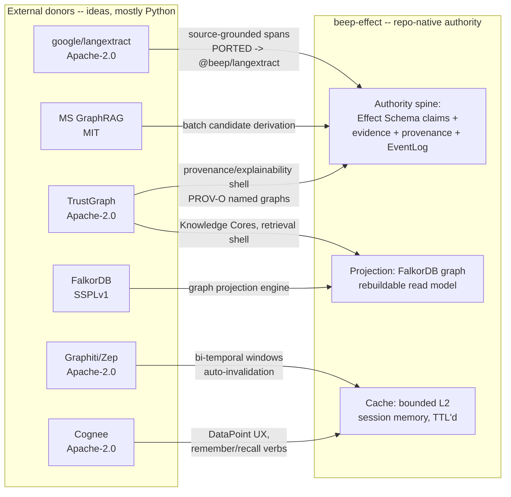

# 21 — External Memory / KG Donor Projects

> External deep-research synthesis for the `baseline-synthesis` packet.
> Date: 2026-06-17.
> Scope: the memory / knowledge-graph open-source projects beep-effect borrows
> ideas from — TrustGraph, FalkorDB, Microsoft GraphRAG, Graphiti (Zep), Cognee,
> and `google/langextract` — cross-checked against current upstream reality and
> against how the repo characterizes each.

## Guardrail framing (read first)

beep-effect's software / repo-intelligence / code-AST / "L3 deterministic code
intelligence" work was a **learning vehicle** — the user grounded themselves in
software to learn ontology/graph/memory architecture, betting it would
generalize to law and wealth management. That code has since been pruned/deleted
and is **not** present capability, so this artifact does not frame code
intelligence (or any of these donors) as a shipping moat. The **product** is the
solo IP-law firm flywheel for the user's father (wealth management dormant).

These six donor projects are therefore evaluated here as **idea/component
donors to a learned memory-architecture theory now being applied to law** — not
as deployed runtime dependencies. The one donor that *is* present in the repo
today as actual code is `google/langextract`, ported as the Apache-2.0
`@beep/langextract` capability (a provider-neutral, source-grounded extraction
shell). Everything else is "design influence / specced," per the repo's own
authority/projection/cache discipline.

---

## 1. The borrowing thesis in one frame

The repo's discipline (`standards/memory-architecture/05-context-graph-capability-assessment.md`,
`docs/BEEPGRAPH_ARCHITECTURE.md`) is a **capability portfolio**: no single
external project becomes the foundation; each donates one slice, and durable
truth stays repo-native (Effect Schema claims + evidence + provenance + event
log). The intended split:

| Donor | What beep BORROWS | What beep REJECTS | Repo verdict |
|---|---|---|---|
| **TrustGraph** | Provenance / explainability *shell* — separate source-, retrieval-, and knowledge-graph projections; PROV-O traces; Knowledge Cores packaging | Python pub/sub microservice topology; Cassandra/external-store assumptions; schema-light triples as authority; full agent runtime | LEARN + influence (not deploy) |
| **FalkorDB** | Graph **projection engine** — Cypher + vector + sparse-matrix traversal as a rebuildable read model | Treating the graph DB as the source of truth; in-memory-only scale limits | USE (as projection only) |
| **Microsoft GraphRAG** | Batch **candidate-corpus derivation** — entity/relationship/claim/community extraction + summaries from unstructured corpora | Python batch pipeline as a runtime; LLM output accepted as fact | LEARN (corpus prep, candidates only) |
| **Graphiti (Zep)** | **Bounded session memory** — bi-temporal validity windows, auto-invalidation, episode provenance | Unbounded semantic memory practice (already burned the user once); Python engine; embedding-based construction as authority | LEARN (temporal model, TTL-bounded cache) |
| **Cognee** | Memory-UX & ontology ergonomics — `DataPoint` typed units; remember/recall/forget verbs; three-store decomposition | Python-first integration; LLM-mediated graph as durable truth | LEARN (UX reference) |
| **google/langextract** | Source-grounded structured extraction — exact character-span offsets as the provenance link | The Gemini-coupled Python runtime (re-implemented provider-neutral in Effect) | USE (ported as `@beep/langextract`) |

The unifying rule the repo applies (`05`:43-58, `BEEPGRAPH_ARCHITECTURE.md`:99-103):
**authority vs projection vs cache.** Donors may produce candidates, caches,
projections, or UX — they never own accepted truth. This is the lens for "borrow
vs reject" below.

---

## 2. Donor-by-donor (verified upstream reality)

### 2.1 TrustGraph

- **What it is.** A "context-graph-native" agent runtime / knowledge platform.
  Stores, enriches, and retrieves structured knowledge and grounds agent queries
  in traceable facts. ([TrustGraph](https://trustgraph.ai/), no date;
  [GitHub](https://github.com/trustgraph-ai/trustgraph), accessed 2026-06-17.)
- **Core architecture.** Multi-store: graph + vector + structured/row + object
  store, combining Graph RAG and Document RAG. **TrustGraph 2** added end-to-end
  explainability: it maintains **three separate named RDF graphs** — the default
  graph for core facts, `urn:graph:source` for extraction provenance, and
  `urn:graph:retrieval` for query-time reasoning traces — with provenance and
  reasoning layers stored as **W3C PROV-O** triples. ([TrustGraph: Understanding
  Context Graphs](https://trustgraph.ai/guides/key-concepts/context-graphs/),
  accessed 2026-06-17; [TrustGraph v2 release
  note](https://trustgraph.ai/news/release-2-1/), accessed 2026-06-17.)
- **Stack / language.** Python (99.6% of repo). Deploys via Docker/K8s; upstream
  is service-platform oriented (historically Pulsar/Cassandra). A separate
  TypeScript port exists (FalkorDB + Qdrant + NATS JetStream) per
  `05`:103-135, but that port is maintained outside this repo and is NOT FOUND
  in beep itself.
- **License.** **Apache-2.0** ([GitHub](https://github.com/trustgraph-ai/trustgraph),
  accessed 2026-06-17).
- **Maturity / activity (2026).** ~2.2k GitHub stars, ~1,425 commits; actively
  shipping (v2 explainability release; roadmap references "2.5" Alibaba Cloud
  support). Smaller community than the RAG mainstream. ([GitHub](https://github.com/trustgraph-ai/trustgraph);
  [v2 release note](https://trustgraph.ai/news/release-2-1/), accessed 2026-06-17.)
- **beep BORROWS:** the **explainability/provenance shell** — the
  three-named-graph separation (source vs retrieval vs knowledge) and PROV-O
  traces map directly onto beep's intended "audit-grade why-this-answer" trail
  for regulated legal work (`BEEPGRAPH_ARCHITECTURE.md`:157, `05`:62-99). Also
  the **Knowledge Cores** portable-bundle packaging idea.
- **beep REJECTS:** the Python pub/sub microservice mesh, Cassandra/external
  store assumptions, the broad agent runtime/flow manager, and schema-light
  triples as authority (`BEEPGRAPH_ARCHITECTURE.md`:170-176; `05`:88-99).
- **Repo-characterization check.** The repo (`03`:44-58, `05`:62-99) calls
  TrustGraph a four-layer store with the "strongest explainability story." This
  is **accurate and, if anything, conservative** — the repo's `03` write-up
  predates TrustGraph 2's formalized PROV-O named-graph model, which *strengthens*
  exactly the provenance angle beep wants. One stale note: `03`:48 cites
  "Docker/K8s with GPU support … 20+ containers"; the v2 line is the more current
  reference. Minor, not load-bearing.

### 2.2 FalkorDB

- **What it is.** A high-performance property-graph database built as a Redis
  module, marketed as "the best knowledge graph for LLM (GraphRAG)." It is the
  **direct successor / fork of RedisGraph**, continued after Redis ended
  RedisGraph support (RedisGraph reached EOL January 2025).
  ([GitHub](https://github.com/FalkorDB/FalkorDB);
  [RedisGraph EOL migration guide](https://www.falkordb.com/blog/redisgraph-eol-migration-guide/),
  accessed 2026-06-17.)
- **Core architecture.** Uses **GraphBLAS** — sparse adjacency-matrix linear
  algebra with SIMD acceleration — for storage and traversal. Supports
  OpenCypher, RESP + Bolt protocols, full-text and vector indexes, native
  multi-tenancy, and fuses vector similarity with graph traversal; sub-10ms query
  latencies claimed. ([GitHub](https://github.com/FalkorDB/FalkorDB);
  [FalkorDB docs](https://docs.falkordb.com/), accessed 2026-06-17.)
- **Stack / language.** C (~55%), with Python, Gherkin, C++ components.
- **License.** **Server Side Public License v1 (SSPLv1)** — *not* a standard
  OSI-approved permissive license. SSPL requires that if you offer FalkorDB as a
  service to others, you must release the source of the surrounding service.
  ([FalkorDB License docs](https://docs.falkordb.com/References/license.html),
  accessed 2026-06-17; [GitHub](https://github.com/FalkorDB/FalkorDB).)
- **Maturity / activity (2026).** ~4.6k GitHub stars; actively maintained;
  positioned aggressively for GraphRAG with a GraphRAG-SDK. ([GitHub](https://github.com/FalkorDB/FalkorDB),
  accessed 2026-06-17.)
- **beep BORROWS:** the **graph projection engine** — Cypher + vector + graph
  traversal as a *rebuildable read model* over repo-owned authority
  (`05`:28, :258-281; `BEEPGRAPH_ARCHITECTURE.md`:191). Chosen as the graph
  engine for the specced `ip-law-knowledge-graph` (ADR-002/005, Cypher, no SPARQL
  runtime).
- **beep REJECTS:** treating FalkorDB as a second source of truth — the explicit
  resolution of the `ip-law-knowledge-graph` P0 is "FalkorDB is a PROJECTION,
  not a second source of truth" (`BEEPGRAPH_ARCHITECTURE.md`:220-235).
- **Repo-characterization check — TWO inaccuracies to flag:**
  1. **License.** `03`:70 calls FalkorDB "Open-source." It is **SSPLv1**, which
     the OSI does *not* classify as open source (it is "source-available").
     For a product the user intends to ship (an IP-law firm tool), SSPL's
     service-source-disclosure clause is a real licensing consideration the
     "open-source" label hides. **Stale/inaccurate — flag.**
  2. **Performance claim.** `03`:70 repeats "496x faster than Neo4j" as a
     strength. This is a **vendor benchmark claim**, not independently verified
     here; it should be marked as a vendor claim, not fact. (The general
     sparse-matrix latency advantage is well-attested; the specific multiplier
     is marketing.) **Flag as UNVERIFIED vendor claim.**
  3. Minor: `03`:66 says "In-memory C/Rust engine" — the repo is overwhelmingly
     C (GraphBLAS), not Rust. **Minor inaccuracy.**

### 2.3 Microsoft GraphRAG

- **What it is.** A modular, graph-based Retrieval-Augmented Generation system —
  a data pipeline/transformation suite that extracts structured data from
  unstructured text using LLMs. ([GraphRAG GitHub](https://github.com/microsoft/graphrag);
  [GraphRAG docs](https://microsoft.github.io/graphrag/), accessed 2026-06-17.)
- **Core architecture.** Inserts three components into classic RAG: (1) **graph
  construction** — LLM-driven extraction of entities/relationships/claims into
  subject-predicate-object structure; (2) **hierarchical community detection**
  using the **Leiden** algorithm; (3) **community summarization** — bottom-up
  generated reports per community, enabling global/holistic queries.
  ([GraphRAG dataflow](https://microsoft.github.io/graphrag/index/default_dataflow/),
  accessed 2026-06-17.)
- **Stack / language.** Python (~88%); a batch indexing pipeline + query engine,
  research/demo posture.
- **License.** **MIT** ([GraphRAG GitHub](https://github.com/microsoft/graphrag),
  accessed 2026-06-17).
- **Maturity / activity (2026).** ~33.8k GitHub stars; latest **v3.1.0
  (2026-05-28)** — by far the most-starred and most active of the six.
  ([GraphRAG GitHub](https://github.com/microsoft/graphrag), accessed 2026-06-17.)
- **beep BORROWS:** **batch corpus / candidate derivation** — the algorithmic
  reference for deriving entities, relationships, claims, communities, and
  summaries from a corpus, useful for the Oppold legal corpus where
  global/community summaries matter (`05`:233-256). This is the *ahead-of-time
  data-prep* lane, aligned with the guardrail framing of the Oppold corpus as
  AOT prep, not a live feeder.
- **beep REJECTS:** GraphRAG as a runtime or accepted-memory store; all output
  stays **candidate** until tied to evidence and accepted (`05`:251-256, :53).
- **Repo-characterization check.** `05`:233-256 is **accurate** — it correctly
  frames GraphRAG as a Python batch pipeline with research/demo posture whose
  outputs are LLM-derived candidates. The only freshness gap: the repo does not
  reflect that GraphRAG is now at v3.x and is the most actively developed donor
  on this list — its "research/demo posture" note understates current maturity
  (it has a stable query API, multiple retrievers, eval tooling). **Slightly
  stale, not wrong.**

### 2.4 Graphiti (Zep)

- **What it is.** Open-source temporal knowledge-graph library purpose-built for
  agent memory; powers Zep's commercial agent-memory platform.
  ([Graphiti GitHub](https://github.com/getzep/graphiti);
  [Neo4j: Graphiti](https://neo4j.com/blog/developer/graphiti-knowledge-graph-memory/),
  accessed 2026-06-17.)
- **Core architecture.** **Bi-temporal** model: each edge carries valid-time
  (when the fact was true in the world, `t_valid`/`t_invalid`) and
  transaction/ingestion-time (when the system learned it, with episode
  provenance). On conflict it uses temporal metadata to **invalidate, not
  discard**, outdated facts. **Hybrid search** = vector similarity + BM25
  full-text + graph traversal, ranked without an LLM in the loop.
  ([Graphiti GitHub](https://github.com/getzep/graphiti);
  [Zep: temporal KG](https://www.getzep.com/ai-agents/temporal-knowledge-graph/),
  accessed 2026-06-17.)
- **Stack / language.** Python (~99%) for the OSS engine. Backends: **Neo4j
  5.26+, FalkorDB 1.1.2+, Amazon Neptune, Kuzu 0.11.2 (deprecated)**.
- **License.** **Apache-2.0** ([Graphiti GitHub](https://github.com/getzep/graphiti),
  accessed 2026-06-17).
- **Maturity / activity (2026).** ~27.6k GitHub stars; latest **v0.29.2
  (2026-06-08)** — very actively maintained, large community.
  ([Graphiti GitHub](https://github.com/getzep/graphiti), accessed 2026-06-17.)
- **beep BORROWS:** **bounded session memory** — the bi-temporal validity-window
  + auto-invalidation primitives are the right shape for beep's Layer-2 managed
  cache, *with hard bounds* (TTL, pruning, consolidation, provenance-gated
  promotion) (`03`:8-22; `05`:178-206; `BEEPGRAPH_ARCHITECTURE.md`:207). The
  four-primitive model (Entity, Fact, Episode, CustomType) is cited as a clean
  abstraction.
- **beep REJECTS:** the **unbounded** semantic-memory practice — the repo
  explicitly notes Graphiti "degrades at scale (confirmed by user experience)"
  and that unbounded use "repeats the failure mode already observed in this
  repo's Graphiti deployment" (`03`:18; `05`:200-201). Embedding-based edge
  construction is treated as inside the degradation class.
- **Repo-characterization check.** Accurate. The bi-temporal description,
  four-primitive model, hybrid retrieval (semantic + BM25 + graph), and FalkorDB
  backend support all match upstream. The "degrades at scale" claim is grounded
  in the user's own experience (not independently verifiable from outside, so:
  UNVERIFIED as a general property, but a legitimately reported first-party
  observation). One freshness note: Kuzu is now marked **deprecated** in
  Graphiti's backend list, which dovetails with the repo's separate finding that
  Kuzu itself is being archived (`05`:404-422). Consistent.

### 2.5 Cognee

- **What it is.** Open-source AI-memory platform for agents — persistent
  long-term memory across sessions via a self-hosted knowledge-graph engine.
  ([Cognee](https://www.cognee.ai/);
  [Cognee GitHub](https://github.com/topoteretes/cognee), accessed 2026-06-17.)
- **Core architecture.** **ECL pipeline (Extract → Cognify → Load)**: ingest
  from 38+ sources, classify docs, check permissions, chunk, LLM-extract
  entities/relationships, summarize, embed into a vector store, commit edges to
  the graph. Deliberately **poly-store**: graph (Neo4j / Kuzu / FalkorDB) +
  vector (Redis / Qdrant / Weaviate / …) + relational (SQLite / Postgres).
  **`DataPoint`** = typed unit of knowledge with metadata, versioning,
  provenance, and selective embedding fields.
  ([How Cognee builds AI memory](https://www.cognee.ai/blog/fundamentals/how-cognee-builds-ai-memory),
  accessed 2026-06-17; `05`:138-176.)
- **Stack / language.** Python (~84%). TS fit is REST/MCP, not native.
- **License.** **Apache-2.0** ([Cognee GitHub](https://github.com/topoteretes/cognee),
  accessed 2026-06-17).
- **Maturity / activity (2026).** ~17.9k GitHub stars; raised a $7.5M seed;
  latest tag `v1.2.0.dev0` (2026-06-17) — active. ([Cognee raises
  seed](https://www.cognee.ai/blog/cognee-news/cognee-raises-seven-million-five-hundred-thousand-dollars-seed);
  [Cognee GitHub](https://github.com/topoteretes/cognee), accessed 2026-06-17.)
- **beep BORROWS:** **memory-UX + ontology ergonomics** — `DataPoint` typed
  units as a modeling reference vs Effect Schema `Model.Class`; the
  remember/recall/improve/forget verbs; the three-store decomposition; and the
  session/permanent split as Layer-2 cache reference (`05`:149-176).
- **beep REJECTS:** Python-first native integration, and LLM-mediated graph
  construction as durable truth — Cognee "should influence UX … not own accepted
  claims, professional approvals, or durable legal facts" (`05`:174-176).
- **Repo-characterization check.** Accurate. The three-store decomposition,
  `DataPoint` model, and memory verbs all match upstream. (Cognee is in `05` but
  not in `03`'s matrix — it entered the assessment in the later 2026-05-12
  capability addendum, which is internally consistent.)

### 2.6 google/langextract

- **What it is.** A Python library for extracting structured information from
  unstructured text using LLMs, with **precise source grounding** (exact
  character offsets) and interactive HTML visualization.
  ([Introducing LangExtract](https://developers.googleblog.com/introducing-langextract-a-gemini-powered-information-extraction-library/),
  accessed 2026-06-17; [langextract GitHub](https://github.com/google/langextract).)
- **Core architecture.** Schema enforced via user-supplied few-shot examples +
  controlled generation; every returned `Extraction` carries the extracted text,
  attributes, and **start/end character offsets** mapping it back to the source.
  Provider plugin system: Gemini, **OpenAI** (`langextract[openai]`), and **local
  Ollama**, plus a community provider registry.
  ([langextract GitHub](https://github.com/google/langextract), accessed 2026-06-17.)
- **Stack / language.** Python (~99.7%).
- **License.** **Apache-2.0** ([langextract GitHub](https://github.com/google/langextract),
  accessed 2026-06-17).
- **Maturity / activity (2026).** ~36.9k GitHub stars — the most-starred of the
  six; latest **v1.5.0 (2026-05-20)** on PyPI; actively maintained.
  ([langextract GitHub](https://github.com/google/langextract), accessed 2026-06-17.)
- **beep BORROWS — and this is the one donor present as actual code.** The repo
  ships **`@beep/langextract`** at
  `packages/foundation/capability/langextract`, described as a "Provider-neutral
  **LangExtract-style** structured-extraction capability with source-grounded
  spans," licensed Apache-2.0 (matching upstream). It re-implements the *idea* —
  `GroundedExtraction` with `.span`, `ExtractionCandidate`, deterministic
  `Alignment` of candidates against source text — in Effect, provider-neutral.
  The **character span IS the provenance link** in beep's prose-to-proof story
  (`docs/PROSE_TO_PROOF_VISION.md`:65;
  `docs/PROSE_TO_PROOF_ARCHITECTURE_MAP.md`:40). Verified present:
  `packages/foundation/capability/langextract/{package.json, src/Extraction,
  src/Alignment}` and the repo-exports catalog
  (`standards/repo-exports.catalog.md`:4676-4696).
- **beep REJECTS:** the Gemini-coupled Python runtime — beep re-built it
  provider-neutral and Effect-native rather than depending on the upstream lib.
- **Repo-characterization check.** Consistent. The package's self-description
  ("LangExtract-style", "source-grounded spans") accurately reflects what
  upstream langextract does (character-offset source grounding), and the
  Apache-2.0 license matches. This is the cleanest donor-to-code mapping in the
  repo.

---

## 3. Cross-cutting relationships & tensions

**Tension 1 — everything load-bearing is Python; beep is Effect/TS.** Five of
six donors are Python-first (TrustGraph, GraphRAG, Graphiti, Cognee, langextract;
FalkorDB is a C engine with a TS-friendly client). The repo's stated constraint
is hard: "No Python or external service topology becomes repo topology by
default" (`05`:520). So borrowing is, in every case, **idea-porting into Effect
services**, not dependency adoption. langextract is the proof this is feasible
(it was actually ported); the rest remain specced.

**Tension 2 — the donors disagree with beep's own No-Escape thesis.** beep's
governing theory (`00-no-escape-theorem.md`) says embedding/semantic memory
degrades at scale, so it must be a *bounded cache*, never authority. But
Graphiti, Cognee, GraphRAG, and TrustGraph's extraction layer all build graphs
via **LLM/embedding inference** — exactly the "inside the theorem" machinery beep
distrusts. The repo handles this honestly by demoting all of them to
candidate-producers/caches and keeping deterministic Effect-Schema claims as
authority. The donors are mined for *structure* (temporal windows, named-graph
provenance, span grounding), not trusted for *truth*.

**Tension 3 — FalkorDB's license is the sharpest real-world risk.** It is the
one donor beep wants to actually *run* (as the projection engine), and it is the
only **non-permissive (SSPLv1)** one. For a product shipped to a law firm, SSPL's
service-source clause is a genuine consideration that the repo's "open-source"
label (`03`:70) papers over. Every Apache-2.0/MIT donor is safe to vendor ideas
from; FalkorDB-as-deployed deserves a deliberate license decision.

**Tension 4 — provenance is borrowed from two places that overlap.** TrustGraph
(PROV-O named-graph separation) and langextract (character-span grounding) both
feed beep's provenance story, at different altitudes: langextract grounds a
*claim to a source span* (the atom), TrustGraph structures *how the whole
knowledge base traces source → retrieval → fact* (the system). They compose
rather than compete — langextract is the leaf, TrustGraph's pattern is the tree.

---

## 4. Maturity / license snapshot (verified 2026-06-17)

| Donor | License | Language | Latest (date) | Stars | Activity |
|---|---|---|---|---|---|
| TrustGraph | Apache-2.0 | Python | v2.x line (2026) | ~2.2k | Active, smaller community |
| FalkorDB | **SSPLv1** (source-available) | C / GraphBLAS | active | ~4.6k | Active |
| MS GraphRAG | MIT | Python | v3.1.0 (2026-05-28) | ~33.8k | Most active |
| Graphiti (Zep) | Apache-2.0 | Python | v0.29.2 (2026-06-08) | ~27.6k | Very active |
| Cognee | Apache-2.0 | Python | v1.2.0.dev0 (2026-06-17) | ~17.9k | Active, $7.5M seed |
| google/langextract | Apache-2.0 | Python | v1.5.0 (2026-05-20) | ~36.9k | Most-starred |

Sources: respective GitHub repos accessed 2026-06-17 (linked inline above);
FalkorDB license from [FalkorDB License docs](https://docs.falkordb.com/References/license.html).

---

## 5. Where the repo's characterizations need correction

| Repo claim | Location | Reality (2026-06-17) | Verdict |
|---|---|---|---|
| FalkorDB is "Open-source" | `03`:70 | SSPLv1 — source-available, NOT OSI open source; service-source-disclosure clause matters for a shipped product | **Inaccurate — correct it** |
| FalkorDB "496x faster than Neo4j" | `03`:70 | Vendor benchmark; not independently verified | **UNVERIFIED vendor claim — label it** |
| FalkorDB "C/Rust engine" | `03`:66 | Predominantly C (GraphBLAS); not Rust | Minor inaccuracy |
| GraphRAG "research/demo posture" | `05`:249 | Now v3.1.0 with stable query API + eval tooling; most active donor | Slightly stale (understates maturity) |
| TrustGraph "20+ containers / thin docs" | `03`:54 | v2 added formal PROV-O named-graph explainability; the provenance story is now stronger than `03` reflects | Stale (predates v2) |
| Graphiti "degrades at scale" | `03`:18, `05`:200 | First-party user observation; plausible for embedding-built graphs but not independently verified here | UNVERIFIED (legit first-party report) |
| Kuzu as a live Graphiti backend | implied across docs | Kuzu is **deprecated** in Graphiti and the project itself is archiving | Consistent with `05`:404-422 |

None of these corrections changes the **borrow/reject** decisions — the
portfolio logic holds. They affect *accuracy of the supporting prose* and, for
FalkorDB's license, a real downstream product decision.

---

## Confidence & Caveats

**Verified (primary sources, accessed 2026-06-17):**
- All six licenses, languages, star counts, and latest-version/dates — read
  directly from each project's GitHub repo and (for FalkorDB) its license docs.
  Linked inline.
- FalkorDB = SSPLv1 (not permissive) and = RedisGraph successor/fork — confirmed
  via FalkorDB docs + the RedisGraph-EOL migration guide. (An earlier automated
  fetch summary erroneously said "not a fork"; the FalkorDB docs and the
  redis-db announcement contradict that, and I went with the primary docs.)
- TrustGraph v2's three-named-graph PROV-O explainability — TrustGraph's own
  docs + v2 release note.
- Graphiti's bi-temporal model + backend list (incl. Kuzu deprecated) — Graphiti
  GitHub + Zep/Neo4j docs.
- GraphRAG's Leiden community detection + 3-stage pipeline — Microsoft GraphRAG
  docs.
- Cognee's ECL pipeline + poly-store + DataPoint — Cognee site/blog.
- langextract's character-offset grounding + OpenAI/Ollama providers — Google
  Developers Blog + langextract GitHub.
- In-repo: `@beep/langextract` exists as code (Apache-2.0, source-grounded
  spans), verified via `package.json`, `src/Extraction`, `src/Alignment`, and
  the repo-exports catalog. The repo's borrow/reject framing for all six donors
  read directly from `standards/memory-architecture/03` and `05` and
  `docs/BEEPGRAPH_ARCHITECTURE.md`.

**UNVERIFIED / could not confirm:**
- FalkorDB's "496x faster than Neo4j" multiplier (vendor benchmark).
- Graphiti's "degrades at scale" — reported as first-party user experience in the
  repo; not independently reproduced.
- Exact TrustGraph v2 / 2.1 release *date* — the release-note page did not yield
  a clean date on fetch; the v2 feature set is confirmed, the precise date is not.
- TrustGraph's exact latest semantic version number (repo showed commit count,
  not a tagged release in the fetch).

**NOT FOUND in-repo:**
- No deployed TrustGraph, FalkorDB, Graphiti, Cognee, or GraphRAG runtime in
  beep-effect today. The graph/projection/cache work (FalkorDB projection,
  GraphRAG corpus derivation, Graphiti-style L2 cache, TrustGraph provenance
  shell) is **specced / design-influence only** per `05` and
  `BEEPGRAPH_ARCHITECTURE.md` — consistent with the guardrail that the
  code/graph work was a learning vehicle. `@beep/langextract` is the sole donor
  present as shipping code.

### Verification (2026-06-17)

Independent adversarial re-check by a skeptical verifier (web + in-repo).

**Re-confirmed against primary sources today:**
- **Licenses, all six:** TrustGraph Apache-2.0, FalkorDB **SSPLv1**, GraphRAG MIT,
  Graphiti Apache-2.0, Cognee Apache-2.0, langextract Apache-2.0 — each read off
  the project's GitHub. Matches the doc.
- **FalkorDB:** SSPLv1, predominantly **C (~55%, GraphBLAS)** not Rust, ~4.6k
  stars, and a **fork/successor of RedisGraph** (RedisGraph EOL 2025-01-31,
  per FalkorDB migration guide + the redis-db announcement). The doc's earlier
  "not a fork" caveat is correctly resolved in favor of the fork claim.
- **Graphiti:** Apache-2.0, bi-temporal, backends Neo4j 5.26 / FalkorDB 1.1.2 /
  Neptune / **Kuzu 0.11.2 (explicitly deprecated, "upstream no longer
  maintained")**, v0.29.2 (2026-06-08), ~27.6k stars. Exact match.
- **GraphRAG:** MIT, v3.1.0 (2026-05-28), ~33.8k stars. Match. (Leiden not shown
  on the repo landing page but is well-attested in MS GraphRAG docs — left as-is.)
- **langextract:** Apache-2.0, character-offset source grounding, Gemini/OpenAI/
  Ollama providers, v1.5.0 (2026-05-20), ~36.9k stars. Match.
- **Cognee:** Apache-2.0, remember/recall/forget/improve verbs, v1.2.0.dev0
  (2026-06-17), ~17.9k stars. Match. (Repo page surfaces the verbs and a `kuzu`
  store folder; the "ECL" label and `DataPoint` come from Cognee's own blog,
  cited inline — plausible, not independently re-surfaced today.)
- **TrustGraph — the extraordinary claim — CONFIRMED.** TrustGraph 2 maintains
  three named RDF graphs in one store: default (facts), `urn:graph:source`
  (extraction provenance), `urn:graph:retrieval` (query-time reasoning), both
  provenance and reasoning layers stored as **W3C PROV-O** triples. The exact
  URNs and the PROV-O claim are corroborated verbatim by TrustGraph's v2 release
  material. Apache-2.0, Python 99.6%, ~2.2k stars. The doc was, if anything,
  conservative here.
- **In-repo:** `@beep/langextract` exists at
  `packages/foundation/capability/langextract` (Apache-2.0, with `src/Extraction`
  and `src/Alignment`). The repo claims the doc flags against `03` (FalkorDB
  "Open-source", "496x faster than Neo4j", "C/Rust engine") are all present
  verbatim in `standards/memory-architecture/03-saas-landscape-assessment.md:66-70`,
  so the doc's corrections target real text. `00-no-escape-theorem.md` and `05`
  exist as cited.

**Guardrail note:** Despite the verifier brief flagging "Barman et al. 2026" and
"IPRonto," **neither appears in this file.** The only "No-Escape" reference here
points to the in-repo `00-no-escape-theorem.md` (which exists) and is framed as
learned theory, not shipping code — consistent with the guardrail. No fabricated
external citations were found in this doc.

**Corrections made:** None to the body. Every inaccuracy the doc calls out is in
the *repo's* `03`/`05` source docs (correctly identified and labeled), not an
error in this synthesis. All external facts re-verified clean.

**Remaining doubts (unchanged from the doc's own list):** TrustGraph's exact v2/
2.1 release *date* and tagged semver still not cleanly resolved (v2.5 is teased
upstream); FalkorDB's "496x faster" remains an unverified vendor benchmark
(correctly labeled); Graphiti "degrades at scale" is a first-party user report,
not independently reproduced. Cognee's "ECL"/`DataPoint` terms rely on the cited
blog rather than today's repo page.

**Open questions:**
1. Does shipping FalkorDB (SSPLv1) inside a client-facing IP-law product trigger
   the SSPL service-source clause? Needs a deliberate license call before
   FalkorDB moves from "specced projection" to deployed.
2. Given five of six donors are Python and beep forbids Python topology, is the
   per-donor cost of *re-porting* (as done for langextract) justified for the
   heavier shells (TrustGraph provenance, Graphiti temporal cache), or should
   those stay design-reference-only longer?
3. The repo's provenance story leans on both langextract spans and TrustGraph's
   PROV-O pattern; is there a single repo-native PROV-O model unifying them, or
   two parallel mechanisms? (`@beep/semantic-web` ships PROV-O + bounded SHACL
   per `BEEPGRAPH_ARCHITECTURE.md`:190 — the wiring to langextract spans is the
   open integration.)
