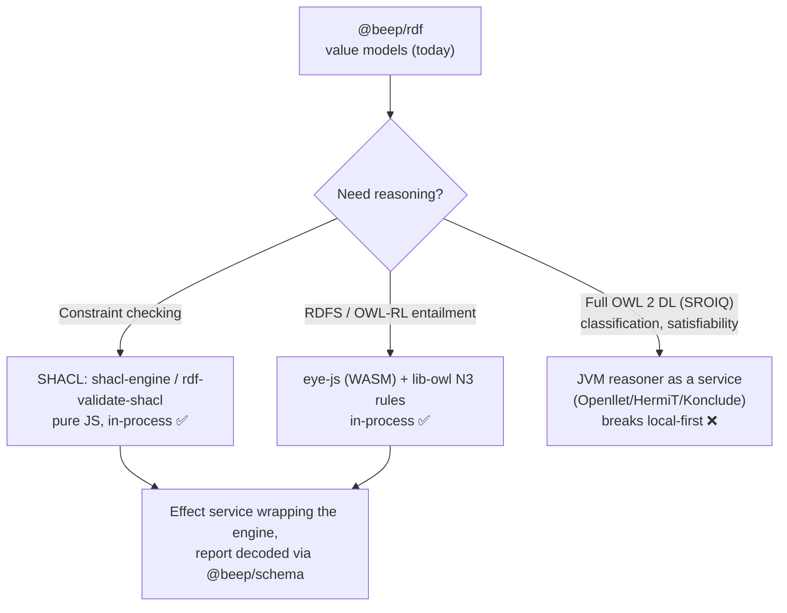

# 22 — External Foundations: No-Escape Theorem, SHACL/OWL Reasoning, and langextract Grounding

> Synthesis artifact, baseline-synthesis packet. Dated 2026-06-17.
> External deep-research pass: every external claim is cross-checked against
> primary sources (URLs below), every in-repo claim cites a file actually opened.
>
> **Guardrail context.** The memory-architecture framework distilled here
> (No-Escape theorem, 4-layer taxonomy, L1/L2/L3 certainty model) is *learned
> theory*, not shipping product. The deterministic "repo-memory v0 / L3 code
> intelligence" work it was originally written to justify was a **learning
> vehicle and has since been pruned/deleted** (see `90-archaeology-pruned-repo-intel.md`).
> The standards documents (`standards/memory-architecture/*`) still speak of that
> work in the present/future tense; this artifact treats those framings as
> historical, and re-points the *theory* at the live product (the solo IP-law
> firm flywheel). SHACL/OWL and langextract are assessed as candidate techniques
> for that product's document/knowledge layer, not as existing runtime.

---

## 1. What this artifact answers

Three foundations cited or implied by the repo's memory thesis, deep-researched
and adversarially verified:

| # | Foundation | Repo touchpoint | Verdict (one line) |
|---|---|---|---|
| 1 | "No-Escape Theorem" (Barman et al., 2026) | `standards/memory-architecture/00-no-escape-theorem.md` | **Paper EXISTS and metadata matches.** It is an **arXiv preprint, not peer-reviewed**; authored by a startup (Sentra) + one MIT lab. Treat as a strong-but-unrefereed position/theory paper. |
| 2 | SHACL/OWL reasoning for a TS/Effect local-first app | `@beep/rdf` (vocab value models only) | **Realistic in-process options exist** (pure-JS SHACL engines; WASM N3/OWL-RL reasoner). Full **OWL 2 DL reasoning remains JVM/service-bound.** EL/RL profiles are the realistic local-first ceiling. |
| 3 | google/langextract source-grounded span extraction | `@beep/langextract` (a faithful Effect reimplementation already in-repo) | **Technique verified from Google's primary docs.** The repo's `@beep/langextract` mirrors Google's exact/fuzzy/lesser aligner closely; it does **not** depend on Google's Python lib. |

---

## 2. Foundation 1 — The "No-Escape Theorem" citation

### 2.1 The claim under audit

`standards/memory-architecture/00-no-escape-theorem.md:137-141` cites:

> Barman, S. R., Starenky, A., Bodnar, S., Narasimhan, N., & Gopinath, A.
> (2026). *The Price of Meaning: Why Every Semantic Memory System Forgets.*
> arXiv:2603.27116. Sentra & MIT.

This is **load-bearing**: the repo's entire memory standard (`README.md` Core
Thesis) derives its "deterministic-first is mathematically immune" argument from
this single paper, and `01-memory-layer-taxonomy.md` / `04-decision-log.md`
build on it.

### 2.2 Verification — the paper is real, metadata confirmed

I pulled the **raw arXiv HTML metadata** (not just a model summary) to avoid
hallucinated confirmation. arXiv returned HTTP 200 with these exact
`citation_*` meta tags:

| Field | Value from arXiv raw HTML |
|---|---|
| `citation_title` | "The Price of Meaning: Why Every Semantic Memory System Forgets" |
| `citation_author` | Barman, Sambartha Ray; Starenky, Andrey; Bodnar, Sofia; Narasimhan, Nikhil; Gopinath, Ashwin |
| `citation_date` | 2026/03/28 |
| arXiv id | 2603.27116 (v1) |
| Primary subject | Computer Science > Artificial Intelligence (cs.AI); also cs.IR, cs.NE |
| `journal_ref` / `doi` / `comments` | **NOT FOUND** (no field present) |

The repo citation's author list, title, and arXiv id all **match exactly**.
(Minor note: the repo abbreviates Barman's given names "S. R."; arXiv gives
"Sambartha Ray" — consistent.)

Affiliations on the paper's HTML body (`arxiv.org/html/2603.27116v1`):

- **Sentra**, 235 2nd Street, San Francisco, CA 94105, USA
- **Department of Mechanical Engineering, MIT**, Cambridge, MA 02139, USA

So the repo's "Sentra & MIT" attribution is accurate.

### 2.3 Peer-review status — UNREFEREED PREPRINT

This is the most important qualifier and the repo does not state it. The arXiv
record has **no `journal_ref`, no DOI, and no "Comments: accepted at…" field**.
A targeted search for acceptance/rebuttal/critique returned only the paper
itself and an adjacent paper — **no evidence of peer review, conference
acceptance, citations, or published critique** as of 2026-06-17. The paper is
~2.5 months old (submitted 2026-03-28).

Provenance also warrants a conflict-of-interest flag: the work is largely a
**vendor paper**. Co-author **Andrey Starenky is Sentra's CTO**, and **Ashwin
Gopinath is a Sentra co-founder** (former MIT). Sentra is an a16z-speedrun /
Together-Fund-backed "organizational memory" startup (≈$5M seed). The paper's
thesis — "semantic memory systems inevitably forget; you need a non-semantic
substrate" — aligns with Sentra's own product narrative ("memory is state, not
a service"). That does not make it wrong, but it means the paper is **not a
neutral third-party result** and should be read as a motivated position paper
until independently replicated.

> Note on one secondary claim: Ashwin Gopinath **is in fact a co-author of
> "Reflexion: Language Agents with Verbal Reinforcement Learning"** (NeurIPS
> 2023, arXiv:2303.11366). The author list is Shinn, Cassano, Berman, Gopinath,
> Narasimhan (Karthik), Yao — confirmed from the arXiv title page on 2026-06-17.
> (An earlier pass of this doc speculated the attribution was confabulated; that
> was wrong — it is real.) It is in any case irrelevant to the No-Escape
> citation's validity, and is a different "Narasimhan" (Karthik, Princeton) than
> the No-Escape co-author (Nikhil).

### 2.4 Verification — the paper's substance matches what the repo claims

The repo doc paraphrases four formal results and several empirical numbers. I
verified the headline ones against the arXiv abstract and HTML body:

| Repo claim | Source check | Status |
|---|---|---|
| Four results: finite effective rank → competitor mass → retention→0 (power-law) → false recall irreducible under δ-convexity | Abstract verbatim lists exactly these four | **Confirmed** |
| Power-law forgetting exponent b=0.440 (vector) | HTML body: "b=0.440±0.030" | **Confirmed** |
| DRM false-alarm FA=0.583 (vector) | HTML body: "FA=0.583" | **Confirmed** |
| Best Pareto compression point: 2,500 clusters, b=0.163 | HTML body: "At 2,500 clusters: b=0.163" | **Confirmed** |
| Five architectures tested (vector, graph, attention, BM25, parametric) | Abstract: "vector retrieval, graph memory, attention-based context, BM25 filesystem retrieval, and parametric memory" | **Confirmed** |
| Graph numbers b=0.478 / FA=0.208; Qwen2.5-7B 1.000→0.113; semantic agreement 15.5% | HTML body: graph "b=0.478±0.028", "FA=0.208" (θ=0.82); parametric PopQA "1.000…to 0.113"; BM25 "15.5%" agreement | **Confirmed (verified 2026-06-17)** |

The repo's distillation is **faithful** on every number I checked. The thesis
("escape routes = exact episodic records, external symbolic verifiers, or
infinite effective dimensionality") is the paper's own framing.

### 2.5 So what does this mean for the *product* (law firm), post-pruning?

The theorem is a constraint on *any* semantic-retrieval memory, so it survives
the pruning of the code-intelligence vehicle. Re-pointed at the IP-law product:

- The original repo move — "deterministic AST facts at certainty 1.0 are outside
  the theorem class, therefore the moat" (`README.md:9`) — is the part that
  **died with the pruned code-intelligence work.** Do **not** carry that
  "competitive advantage" framing forward; there is no shipping deterministic
  code substrate to be immune.
- What *does* generalize to law: legal documents have **exact episodic records**
  (the filings, claims, statutes, docket entries — verbatim text with citations)
  that are the natural "escape route #1," and **external symbolic verifiers**
  (citation checkers, claim-to-source span grounding — see Foundation 3) are
  escape route #2. The theorem's *actionable* lesson for the firm flywheel is:
  treat any embedding/LLM recall over the corpus as a **suggestion cache**, and
  anchor every answer to a verbatim source span. That is a sound design
  principle independent of whether the preprint is ever refereed.

---

## 3. Foundation 2 — SHACL/OWL reasoning for a TypeScript/Effect local-first stack

### 3.1 What the repo actually has today (verified)

`@beep/rdf` (`packages/foundation/modeling/rdf/`) is a **pure value-model
package**: IRI/URI schemas, JSON-LD models, and namespace vocab constants for
OWL, RDFS, RDF, SKOS, PROV, OA, XSD (`src/Vocab/Owl.ts`, etc.). Its
`package.json` deps are only `@beep/identity`, `@beep/schema`, `@beep/utils`,
`effect` — **no RDF library, no SHACL engine, no reasoner.** Its `CLAUDE.md`
explicitly forbids capability/driver/runtime deps. So:

- The repo **models** RDF/OWL vocab as data. It performs **no reasoning or SHACL
  validation today.** (`@beep/semantic-web` may re-export it, per the package's
  CLAUDE.md, but that is re-export, not reasoning.) — **NOT FOUND**: any
  in-repo reasoner or SHACL validator.

### 3.2 The realistic JS/TS landscape (primary-source verified)

**SHACL validation — pure-JS, in-process, viable today:**

| Library | In-process? | Notes | Source |
|---|---|---|---|
| `rdf-validate-shacl` (zazuko) | Yes, pure JS on RDF/JS stack | W3C SHACL impl; returns `ValidationReport` (also as RDF). Ships TS types. Fork of TopQuadrant `shacl-js`. | github.com/zazuko/rdf-validate-shacl |
| `shacl-engine` (rdf-ext) | Yes, pure JS | "Fast RDF/JS SHACL engine." Benchmarked **~16x faster** than `rdf-validate-shacl` / pySHACL on the SHACL-shapes-validating-shapes test (shacl-engine 40.28ms vs rdf-validate-shacl 632ms vs pySHACL 643ms, mean of 100 iters). **No JVM.** | bergnet.org 2023 writeup; github.com/rdf-ext/shacl-engine |
| `shacl-js` (TopQuadrant) | Yes, JS | Reference JS implementation; the others descend from it. | github.com/TopQuadrant/shacl-js |

SHACL constraint validation is therefore **comfortably feasible in-process in a
TS/Effect local-first app.** It would slot under `@beep/rdf` as a capability
package (an Effect service wrapping `shacl-engine`, decoding the report through
schema). The only friction is RDF/JS dataset interop (the engines want
RDF/JS `DatasetCore`, not `@beep/rdf` value models) — a thin adapter, not a JVM.

**OWL reasoning — the harder half:**

| Option | Scope | In-process? | Realistic for this stack? | Source |
|---|---|---|---|---|
| `eye-js` (EYE via WebAssembly) | N3 rules; RDF Surfaces; OWL-RL via `lib-owl` N3 rulesets | **Yes — WASM, isomorphic browser+Node, MIT, latest v21.x (2026)** | **Yes** for rule-based RDFS/OWL-RL-style inference. Not a full DL reasoner. | github.com/eyereasoner/eye-js; eyereasoner/lib-owl |
| `eyeling` | N3 Horn-style fwd/back chaining, single bundle, browser+worker | Yes, pure JS | Yes, lighter than eye-js | github.com/eyereasoner/eyeling |
| HyLAR / OWL-RL-in-JS | OWL 2 RL profile | Yes | Possible but less maintained; **UNVERIFIED currency** | (npm "owl reasoner") |
| Pellet/Openllet, HermiT, FaCT++, Konclude, ELK | **Full OWL 2 DL** (ELK = OWL 2 EL only) | **No — JVM (or native), service-bound** | Only as an out-of-process service; breaks local-first | ceur-ws Vol-1387; arXiv:2309.06888 |

Key expressivity facts (verified): **HermiT/FaCT++ cover OWL 2 DL; ELK covers
OWL 2 EL only and is fastest on EL; Konclude has best overall DL performance;
Pellet/Openllet are JVM and best-runtime in recent benchmarks.** All true DL
reasoners are JVM/native — none run in-process in a TS app.

### 3.3 Realistic recommendation for the stack

**Bottom line for a local-first TS/Effect app:** SHACL validation and
RDFS/OWL-RL rule inference are **realistic in-process today** (pure-JS and WASM,
both MIT/permissive). **Full OWL 2 DL is not** — it requires a JVM service and
should be avoided unless the law-product genuinely needs DL-class subsumption
(it almost certainly does not; SHACL shapes + OWL-RL cover the practical
"validate the legal ontology and infer simple class/role entailments" need).
This matches the broader local-first ethos: keep reasoning at the profile level
the in-process engines support, and reserve heavyweight DL for an offline
authoring/CI step if ever needed.

---

## 4. Foundation 3 — google/langextract source-grounded span extraction

### 4.1 The technique (Google primary sources)

`google/langextract` (Apache-2.0; health-use addendum) is a Python library that
extracts structured info from text with **precise source grounding**: every
extracted entity is mapped to its **exact character offsets** in the source.
Verified from Google's README + Developers Blog + the DeepWiki technical write-up:

- **Why grounding matters:** LLMs sometimes emit text from the few-shot examples
  rather than the input. langextract **detects this** — extractions it cannot
  locate in the source get `char_interval = None` and can be filtered out. This
  is the "external symbolic verifier" pattern applied to extraction:
  *the LLM proposes, a deterministic aligner verifies against the verbatim text.*
- **The aligner is three-tier** (DeepWiki, "Extraction Pipeline"):
  1. **Exact match** — substring search for the extraction in source.
  2. **Fuzzy match** (if enabled) — tokenize the extraction, find best token
     overlap with source tokens; accept if overlap ratio ≥ `fuzzy_alignment_threshold`
     (**default 0.75**). Implemented via partial-ratio + edit-distance refinement.
  3. **Lesser match** — accept partial matches where the extraction is a
     substring of a source token sequence.
- **Status enum:** `MATCH_EXACT`, `MATCH_FUZZY`, `MATCH_LESSER`, or `None`.
  Successful alignments carry `char_interval` and `token_interval`.
- **Models:** provider-pluggable — Gemini (recommended), OpenAI, local via
  Ollama, Vertex AI. Long-doc recall is improved by **multiple independent
  extraction passes merged on non-overlapping spans.**

(One earlier model-generated summary claimed langextract is "exact match only";
that is **wrong** — the README's "use exact text" is *prompt guidance to the
LLM*, while the actual aligner does exact **+ fuzzy + lesser**. Corrected here
from the DeepWiki technical description and Google issue #386 on the fuzzy path.)

### 4.2 The repo already reimplemented this — in pure Effect (verified)

This is the most concrete cross-link, and it is **present, not pruned**:
`@beep/langextract` (`packages/foundation/capability/langextract/`) is an
in-repo, provider-neutral, deterministic reimplementation of the grounding half
of Google's technique. Verified by reading the source:

| Google langextract | `@beep/langextract` (file) | Match |
|---|---|---|
| `AlignmentStatus`: MATCH_EXACT / MATCH_FUZZY / MATCH_LESSER / None | `AlignmentStatus = LiteralKit(["match_exact","match_lesser","match_fuzzy","unaligned"])` (`src/Extraction/index.ts:105`) | **Near-identical** |
| Exact substring match | `findExact` via `indexOf` (`src/Alignment/index.ts:63`) | Same |
| Fuzzy token-overlap with threshold (default 0.75) | `findFuzzy` with `DEFAULT_FUZZY_THRESHOLD = 0.82`, overridable via `LangExtractOptions.fuzzyThreshold` (`src/Alignment/index.ts:17,223`) | **Same shape; threshold differs (0.82 vs 0.75)** |
| `char_interval` (start/end offsets) | `Contract.Span {start,end}` as `NonNegativeInt`, offsets computed against original (case-preserving) source via `lowerWithSourceOffsets` (`src/Alignment/index.ts:57,68`) | Same intent |
| `char_interval = None` for ungrounded | `alignmentStatus: "unaligned"` | Same |
| Provider-pluggable LLM | deps only `@beep/nlp`, `@beep/schema`, `effect` — **no Gemini/Python**; LLM call is abstracted (`Service/`, `Handoff/`, `Target/`) | Provider-neutral by design |

So the repo did **not** wrap Google's library; it **re-expressed the algorithm**
schema-first in Effect, keeping the alignment *deterministic* (no LLM in the
verifier) — which is precisely the No-Escape "external symbolic verifier"
escape route #2, instantiated. Worth flagging the **0.82 vs 0.75** default
divergence: it is stricter than Google's default (fewer fuzzy accepts, more
`unaligned`), which is defensible for a high-stakes legal corpus but is an
undocumented deviation from the namesake.

### 4.3 Fit to the product

For the IP-law flywheel, langextract-style grounding is the right primitive for
turning LLM reads of filings/correspondence into **claim → exact-source-span**
records that a human (the user's father) can audit. It is the operational form
of "anchor every answer to a verbatim source." The repo's `@beep/langextract`
is already the deterministic aligner; what remains (UNVERIFIED whether wired to
the live product) is the LLM extraction front-end and a corpus to run it over.
The Oppold Corpus CLI is **ahead-of-time data prep**, not a live feeder, so this
is a capability-in-place, not a running pipeline.

---

## 5. Cross-cutting synthesis: how the three foundations interlock

The three are not independent — they form one coherent design stance that
**outlives** the pruned code-intelligence vehicle:

1. **No-Escape (theory)** says: semantic recall degrades; you must anchor truth
   in non-semantic, exact records and verify with symbolic checkers.
2. **langextract grounding (in-repo capability)** is escape route #2 in code:
   a deterministic verifier that pins every LLM extraction to a verbatim span or
   marks it `unaligned`. This is built (`@beep/langextract`).
3. **SHACL/OWL (candidate technique)** is the symbolic-verifier layer for the
   *structure* of the resulting knowledge: validate that extracted legal facts
   conform to shapes (SHACL, in-process) and infer simple entailments (OWL-RL via
   eye-js, in-process). This is **not built** (`@beep/rdf` is value models only).

**Tension to record:** the standards docs (`memory-architecture/README.md`,
`00-no-escape-theorem.md`) still frame deterministic *code* intelligence as "the
diamond / competitive advantage." That framing is **stale** post-pruning and
should not be repeated as present capability. The *durable* takeaway is the
verifier-anchored design pattern, which the law product can adopt regardless of
whether the preprint is ever refereed.

---

## Confidence & Caveats

**Verified (high confidence):**
- The No-Escape paper **exists**: arXiv:2603.27116, "The Price of Meaning…",
  authors Barman / Starenky / Bodnar / Narasimhan / Gopinath, submitted
  2026-03-28 — confirmed from arXiv **raw HTML `citation_*` meta tags** (HTTP
  200), not just a model summary. Affiliations Sentra + MIT (Mech. Eng.)
  confirmed from the HTML body.
- The repo's citation and its distilled numbers (b=0.440, FA=0.583, 2,500
  clusters → b=0.163, five architectures, the four formal results, **plus the
  graph numbers b=0.478/FA=0.208, parametric PopQA 1.000→0.113, and BM25 15.5%
  semantic agreement, all re-verified from the arXiv HTML on 2026-06-17**)
  **match the paper**.
- Ashwin Gopinath **is** a confirmed co-author of Reflexion (arXiv:2303.11366);
  an earlier "likely confabulated" flag in this doc was wrong and is corrected.
- `@beep/rdf` is vocab/value-model only with no reasoner/SHACL deps (read
  `package.json`, `src/`, `CLAUDE.md`).
- `@beep/langextract` reimplements Google's exact/fuzzy/lesser aligner in pure
  Effect; `AlignmentStatus` union and `findExact`/`findFuzzy` read directly
  (`src/Extraction/index.ts:105`, `src/Alignment/index.ts:17,63,223`).
- SHACL in pure JS in-process (shacl-engine ~16x perf claim; rdf-validate-shacl),
  eye-js (WASM, MIT, in-process), and the JVM-only nature of full OWL 2 DL
  reasoners — all from primary repos/papers cited inline.
- Google langextract grounding technique (char offsets, None for ungrounded,
  three-tier aligner, default fuzzy 0.75, multi-pass) — from Google README +
  Developers Blog + DeepWiki.

**UNVERIFIED / flagged:**
- The paper is an **unrefereed preprint** — no DOI, journal_ref, comments,
  citations, or published critique found as of 2026-06-17. It is also a
  **vendor-authored** paper (Sentra CTO + co-founder among authors), so treat as
  a motivated position paper pending independent replication.
- Whether `@beep/langextract`'s LLM front-end is wired to any live product
  pipeline (vs. the capability existing in isolation) — **UNVERIFIED**; the
  Oppold corpus is ahead-of-time prep, not a live feeder.
- HyLAR / other JS OWL-RL reasoners' current maintenance state — **UNVERIFIED**.

**NOT FOUND:**
- Any in-repo SHACL validator or OWL/RDFS reasoner (searched deps + source).
- Any peer-review/venue acceptance for arXiv:2603.27116.

**Open questions:**
- Should the memory-architecture standards be amended to (a) demote the
  "deterministic code intelligence = moat" framing now that the vehicle is
  pruned, and (b) annotate the No-Escape citation as an unrefereed vendor
  preprint? Both currently overstate certainty.
- Is the `@beep/langextract` fuzzy default of **0.82** (vs Google's 0.75) an
  intentional precision choice for legal text, or drift? Worth a one-line
  rationale in the package.

### Verification (2026-06-17)

Independent adversarial re-check by a skeptical verifier agent.

**Checked and confirmed:**
- arXiv:2603.27116 resolves (HTTP 200); title, all five authors
  (Barman, Starenky, Bodnar, Narasimhan/Nikhil, Gopinath), submission date
  2026-03-28, and the four formal results match the doc.
- Empirical numbers re-extracted from `arxiv.org/html/2603.27116v1`: vector
  b=0.440±0.030, FA=0.583 (θ=0.864); k=2,500 clusters → b=0.163 (92.8% acc);
  graph b=0.478±0.028, FA=0.208 (θ=0.82); parametric PopQA 1.000→0.113
  (b=0.215, deff=17.9); BM25 15.5% agreement. All match.
- Affiliations: Sentra (SF) + MIT Dept. of Mechanical Engineering (Gopinath,
  corresponding, agopi@mit.edu). Matches.
- SHACL benchmark (bergnet.org): shacl-engine 40.28ms vs rdf-validate-shacl
  632.39ms vs pySHACL 643.13ms, ~16x. Matches.
- eye-js: WASM, MIT, isomorphic browser+Node. Matches.
- langextract default fuzzy threshold 0.75 (DeepWiki) vs in-repo
  `DEFAULT_FUZZY_THRESHOLD = 0.82` (`src/Alignment/index.ts:17`). Both confirmed
  by direct read; the 0.82-vs-0.75 divergence is real.
- `@beep/rdf` deps confirmed: only `@beep/identity`, `@beep/schema`,
  `@beep/utils`, `effect` — no SHACL/reasoner. `AlignmentStatus` union and
  `findExact`/`findFuzzy` read directly in source.

**Corrected in this pass:**
- The doc's "Gopinath/Reflexion attribution is likely confabulated" flag was
  **wrong**. Ashwin Gopinath *is* a co-author of Reflexion (arXiv:2303.11366;
  Shinn, Cassano, Berman, Gopinath, Narasimhan, Yao). Corrected in §2.3 and the
  caveats. Note the No-Escape "Narasimhan" (Nikhil) differs from Reflexion's
  (Karthik, Princeton).
- Promoted the graph/Qwen/BM25 numbers from UNVERIFIED to Confirmed (§2.4 table
  and caveats), since they were successfully re-extracted from the arXiv HTML.

**Remaining doubts (unchanged):**
- The paper is still an unrefereed, vendor-authored preprint (Sentra CTO +
  co-founder among authors); no DOI/journal_ref/citations/critique found. The
  motivated-position-paper caveat stands.
- Whether `@beep/langextract`'s LLM front-end is wired to any live pipeline
  remains UNVERIFIED; Oppold corpus is ahead-of-time prep.
- HyLAR / other JS OWL-RL reasoner maintenance currency still UNVERIFIED.

---

### Sources (external, primary)

- [arXiv:2603.27116 — The Price of Meaning: Why Every Semantic Memory System Forgets](https://arxiv.org/abs/2603.27116) (abstract page + raw HTML metadata; submitted 2026-03-28)
- [arXiv:2603.27116v1 — full HTML (affiliations, b/FA/cluster numbers)](https://arxiv.org/html/2603.27116v1)
- [Sentra.app $5M seed — founders incl. Andrey Starenky (CTO), Ashwin Gopinath](https://pulse2.com/sentra-5-million-seed-funding/)
- [Ashwin Gopinath — "Why AI Needs to Forget" (Nano Thoughts)](https://nanothoughts.substack.com/p/why-ai-needs-to-forget)
- [zazuko/rdf-validate-shacl (pure-JS SHACL)](https://github.com/zazuko/rdf-validate-shacl)
- [rdf-ext/shacl-engine (fast pure-JS SHACL)](https://github.com/rdf-ext/shacl-engine)
- [Implementing a 15x faster JavaScript SHACL Engine — bergnet.org, 2023 (benchmark figures)](https://www.bergnet.org/2023/03/2023/shacl-engine/)
- [eyereasoner/eye-js (EYE reasoner via WebAssembly, MIT)](https://github.com/eyereasoner/eye-js/)
- [eyereasoner/lib-owl (OWL-RL N3 rulesets)](https://github.com/eyereasoner/lib-owl)
- [A survey of current, stand-alone OWL Reasoners — CEUR-WS Vol-1387](https://ceur-ws.org/Vol-1387/paper_4.pdf)
- [OWL Reasoners still useable in 2023 — arXiv:2309.06888](https://arxiv.org/pdf/2309.06888)
- [google/langextract — README (source grounding)](https://github.com/google/langextract/blob/main/README.md)
- [Introducing LangExtract — Google Developers Blog](https://developers.googleblog.com/introducing-langextract-a-gemini-powered-information-extraction-library/)
- [google/langextract Extraction Pipeline — DeepWiki (three-tier aligner, thresholds)](https://deepwiki.com/google/langextract/3.1-main-interface)
- [google/langextract issue #386 — RapidFuzz for fuzzy alignment](https://github.com/google/langextract/issues/386)

### Sources (in-repo, opened)

- `standards/memory-architecture/00-no-escape-theorem.md`, `README.md`
- `packages/foundation/modeling/rdf/` — `src/Vocab/Owl.ts`, `package.json`, `CLAUDE.md`
- `packages/foundation/capability/langextract/` — `src/Extraction/index.ts:105`, `src/Alignment/index.ts:17,57,63,68,223`, `package.json`
