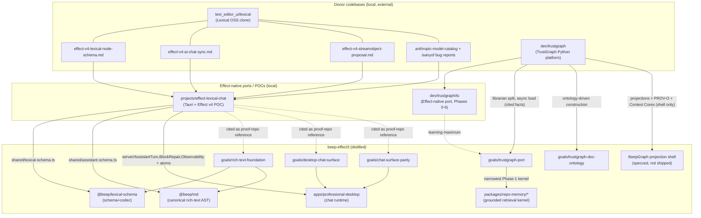

# 23 — External Source-Codebase Lineage (Learning-by-Porting)

_Date: 2026-06-17_
_Scope: the LOCAL source codebases (outside this repo) that fed beep-effect via
the user's learn-by-porting method — Python→TypeScript, then Effect-ified —
and how each flows into current repo artifacts and `goals/` packets._

> GUARDRAIL (read first): These external codebases are evaluated as the user's
> **learning method**, not as shipping product and not as a moat. The user
> learns an architecture by **porting** a mature donor codebase into
> Effect-native TypeScript, then graduating the distilled pattern into
> `beep-effect`. The pruned software/repo-intelligence/code-AST/"L3" work was
> the original learning vehicle; it is **deleted** and is not inventoried here
> as capability. The PRODUCT remains the solo IP-law firm flywheel for the
> user's father. So: TrustGraph and Lexical are **donor codebases the user
> ported to learn**, and the repo keeps only the distilled, schema-first kernel
> — not the donor's runtime, topology, or deployment assumptions.
> This doc complements the *idea/component*-donor view in
> [`21-external-memory-kg-donors.md`](./21-external-memory-kg-donors.md): that
> doc covers projects beep borrows *ideas* from; this doc covers the two
> codebases the user actually **ported locally**.

---

## 1. The method in one frame

The user's repeatable learning loop, observable across both donor codebases:

```
pick a mature donor codebase  →  port it to TypeScript  →  re-architect it
Effect-native (Schema-first, Layers, tagged errors, no Promise APIs)  →
prove it compiles + runs in an isolated scratch repo  →  distill the pattern
(not the whole port) into a beep-effect foundation package + a goals/ packet
```

Two donor lineages dominate the local dev tree:

| Lineage | Donor (local) | Effect-native port (local) | Distilled into repo |
|---|---|---|---|
| **Rich-text chat** | `text_editor_ui/lexical` (Lexical OSS + 5 design reports) | `projects/effect-lexical-chat` (Tauri+Effect POC) | `@beep/lexical-schema`, `@beep/md`, `apps/professional-desktop`; goals `rich-text-foundation`, `desktop-chat-surface`, `chat-surface-parity` |
| **Provenance KG** | `dev/trustgraph` (TrustGraph Python platform) | `dev/trustgraph/ts` (Effect-native port, `ts-port-effect-v4`) | BeepGraph projection *shell* (specced); goals `trustgraph-port`, `trustgraph-doc-ontology` |

The rich-text lineage is the **cleanest and most graduated** chain (donor →
POC → shipped foundation packages + app, with goal packets citing the POC as
"proof-repo reference"). The TrustGraph lineage is a **deep, near-complete
local port** that has been deliberately *narrowed* to a specced kernel, not
copied wholesale.

---

## 2. Lineage A — Lexical / rich-text chat (the graduated chain)

### 2a. Donor + reports: `~/YeeBois/dev/text_editor_ui/lexical/`

A vendored clone of Meta's **Lexical** editor monorepo (`packages/`, examples,
Flow types — `lexical@0.45.x` era) with the user's own **5 Effect-v4 design
reports** dropped at the root. These reports are where the learning happened —
each is a self-contained "I figured out X against `effect@4.0.0-beta.79/80`"
artifact. Files opened:

- **`effect-v4-lexical-node-schema.md`** — the foundational result. Models
  Lexical's `SerializedEditorState`/`SerializedLexicalNode` tree as an Effect v4
  **tagged union keyed on Lexical's own `type` field** via
  `S.Union([...]).pipe(S.toTaggedUnion("type"))` (not `S.TaggedUnion`, which
  hardcodes `_tag`). Documents the hard-won gotchas: tags only on concrete
  classes (a subclass can't override a parent `S.tag` — the intersection
  collapses to `never`, so `TabNode`/`AutoLinkNode` become siblings under
  untagged bases), mutual recursion tied with `S.suspend`, and hand-written
  `declare namespace Type/Encoded` to dodge `TS2506`/`TS7022` cycles. This is
  the literal template for `@beep/lexical-schema`.
- **`effect-v4-ai-chat-sync.md`** — the architecture report. Designs a
  Claude-web-style chat with **edit-rewrites-history** (soft-truncate via a
  pure `foldThread` projection), CRDT-like cross-device draft sync on
  `effect/unstable/eventlog` (UUIDv7 total order + pure folds = convergence),
  shared cross-device undo as journal events, durable assistant turns via
  `effect/unstable/{cluster,workflow}`, and **stratified structured outputs**
  (`AssistantContent` block→inline union → `assistantContentToLexical` lift into
  the recursive Lexical tree). The edit/branch + projection model here is the
  blueprint for `desktop-chat-surface`'s "edit-as-branch."
- **`effect-v4-streamobject-proposal.md`** — the streaming kernel. Documents
  that Anthropic native structured outputs reject non-tiny union schemas
  ("compiled grammar is too large"), so the user built the **forced-tool +
  `input_json_delta` pattern** with a ~40-line chunk-boundary-safe `scanChunk`
  scanner emitting completed array elements decoded per-element via
  `AnthropicStructuredOutput.toCodecAnthropic`. Proposed upstream as
  `LanguageModel.streamObject`. This is the exact kernel `desktop-chat-surface`
  ports ("`scanChunk` block extraction with its property tests").
- **`effect-v4-anthropic-model-catalog-report.md`** — bug report: `@effect/
  ai-anthropic`'s generated catalog tops out at `claude-opus-4-6`, and because
  the SSE *response* schema validates `message.model` against a closed enum,
  newer model ids fail decode (not just request-side). Explains the repo's
  model-pin constraint.
- **`effect-v4-isanyof-bug-report.md`** — type-level bug: `toTaggedUnion`'s
  `isAnyOf` hardcodes `_tag`, so custom discriminants narrow to `never`. A
  paste-ready Discord report. (Runtime fine; type-only.)

### 2b. POC: `~/YeeBois/projects/effect-lexical-chat/`

The reports were assembled into a **working Tauri desktop AI chat built
end-to-end on Effect v4** (`4.0.0-beta.83` by the time it settled). This is the
intermediate proof — what the design reports *became when run*. Structure:

- `shared/lexical-schema.ts` (the node-schema report, realized),
  `shared/assistant-schema.ts` (the block AST + `assistantContentToLexical`
  lift), `shared/rpc.ts` (typed RPC contract).
- `server/` — the kernel and its operational siblings, each of which has a
  named destination in the repo goals: `AssistantTurn.ts` (forced-tool
  streaming kernel), `BlockRepair.ts` + `BlockValidation.ts` +
  `MermaidValidator.ts` (validate→repair→re-validate), `Observability.ts` (OTLP
  traces/logs/metrics, zero OTel SDK deps), `MessageRepo.ts`/`Db.ts` (SQLite via
  `@effect/sql-sqlite-bun`, edit rewrites history in a transaction),
  `IssueReport.ts`.
- `src/` — React webview driven by `@effect/atom-react` (`atoms.ts`), Lexical
  nodes, observability exporter.
- `test/` — `scanChunk.test.ts`, `repairPipeline.test.ts`, `blocks.test.ts`,
  `MessageRepo.test.ts`, a `react-hooks-guard.test.ts`.

**What it proved:** user *and* assistant content flow through **one** Effect
Schema tagged union (identical rich rendering on both sides); streaming
structured output works via forced-tool when native grammars don't scale; edit
rewrites history atomically; full distributed observability is achievable with
no OpenTelemetry SDK; and the whole thing packages as a Tauri app with a
compiled bun sidecar. (README documents the live constraints: model pinned to
`claude-opus-4-6` per the catalog bug, native structured outputs bypassed per
the grammar limit.)

### 2c. Graduation into the repo

The goal packets cite the POC **by absolute path as the read-only "proof-repo
reference,"** which is the strongest possible evidence of intentional
graduation (verified in the GOAL.md headers):

- `goals/rich-text-foundation` → builds `@beep/lexical-schema`
  (`packages/foundation/modeling/lexical`, present: `Lexical.model.ts`,
  `Lexical.codec.ts`) + `@beep/editor`, and explicitly names
  `effect-lexical-chat/shared/lexical-schema.ts` and `assistant-schema.ts` as
  references. Note the repo's *refinement* over the POC: the canonical rich-text
  AST is `@beep/md` (`packages/foundation/modeling/md`, present), with Lexical
  reduced to a schema+codec layer (zero runtime `lexical` imports;
  `lexical` is a devDependency for dtslint conformance only) — a deliberate
  improvement on the POC, where the Lexical schema *was* the canonical shape.
- `goals/desktop-chat-surface` → ships `apps/professional-desktop` E2E
  (rich-block composer, streamed block-by-block turns, edit-as-branch,
  cancel-in-flight, PGlite persistence, UsageRecord finalization). Cites
  `effect-lexical-chat/server/AssistantTurn.ts`, `src/atoms.ts`, and the
  packaging scripts. Ports the forced-tool kernel + `scanChunk` + property
  tests verbatim in intent.
- `goals/chat-surface-parity` → brings `apps/professional-desktop` to full POC
  parity: restores observability/devtooling, **repairs** invalid blocks instead
  of dropping them, adds mermaid/table/youtube blocks. Cites
  `effect-lexical-chat/server/{AssistantTurn,BlockRepair,MermaidValidator,
  Observability}.ts`. Explicitly notes the atom architecture is *already* a
  "verbatim port" (`Chat.atoms.ts`) — do not redo it.

This matches the current-state inventory in
[`10-current-chat-runtime.md`](./10-current-chat-runtime.md): the live chat
vertical (`agents-*`, `professional-desktop`, PGlite ThreadStore, epistemic
`UsageRecord`) is the POC's architecture, re-homed into beep's package topology
and re-skinned with the memory-architecture theory.

---

## 3. Lineage B — TrustGraph (the deep port, then narrowed)

### 3a. Donor: `~/YeeBois/dev/trustgraph/` (Python)

The full **TrustGraph** OSS platform — "semantic infrastructure for agents
built around context graphs." A Python pub/sub microservice monorepo. Top-level
packages: `trustgraph-base`, `trustgraph-flow` (the bulk), `trustgraph-cli`,
`trustgraph-mcp`, plus provider packages (`-bedrock`, `-vertexai`,
`-embeddings-hf`, `-ocr`, `-unstructured`). The `trustgraph-flow/trustgraph/`
tree contains the whole capability chain (from `find`):

- ingestion/processing: `chunking/` (recursive, token), `decoding/`
  (pdf, mistral_ocr), `extract/`, `processing/`
- graph + vectors: `storage/` + `query/` (triples, graph_embeddings,
  doc_embeddings, row_embeddings, sparql, graphql, **ontology**), `embeddings/`
- RAG + agents: `retrieval/` (document_rag, …), `agent/` (react, orchestrator,
  mcp_tool), `prompt/template/`
- platform: `gateway/`, `librarian/` (document↔processing metadata split),
  `cores/` (Context Cores — portable versioned context bundles), `flow/`,
  `config/`, `iam/`, `metering/`, `tables/`, `template/`, `tool_service/`

The README's "Context Core" concept (ontology + context graph + embeddings +
**source manifests & provenance** + retrieval policies, versioned like code)
and the **separate source/retrieval/knowledge-graph projections + PROV-O**
framing are exactly what `21-external-memory-kg-donors.md` records beep
*borrowing the shell of* while *rejecting* the Cassandra/Pulsar topology.

### 3b. Effect-native port: `~/YeeBois/dev/trustgraph/ts/`

This is the standout finding: a **substantial, near-complete Python→TypeScript,
Effect-native port** on branch `ts-port-effect-v4` (`effect@4.0.0-beta.78`).
The port mirrors the Python tree almost subsystem-for-subsystem across
**6 workspace packages** (`packages/{base,flow,client,cli,mcp,workbench}`):

- `packages/base/src/` — the messaging/runtime spine: `backend/`
  (nats, pubsub), `messaging/` (consumer/producer/request-response/runtime),
  `processor/` (async-processor, flow-processor, flow), `schema/`
  (messages, primitives, topics), `services/` (embeddings, llm), `spec/`,
  `metrics/prometheus`.
- `packages/flow/src/` — the full capability chain ported:
  `extract/`, `chunking/`, `decoding/`, `embeddings/`, `storage/{embeddings,
  triples}`, `query/{embeddings,triples}`, `retrieval/` (graph-rag),
  `agent/{react,mcp-tool}`, `prompt/`, `librarian/`, `cores/`, `model/
  text-completion/`, `qdrant/`, `gateway/dispatch`, `flow-manager/`, `config/`,
  `runtime/`.
- `packages/client/src/` — Effect-first RPC client: `rpc/contract.ts`,
  `socket/effect-rpc-client.ts`, `models/{messages,Triple,namespaces}.ts`.
- `packages/{cli,mcp,workbench}` — CLI, native `effect/unstable/ai/McpServer`
  MCP, and a React workbench on `@effect/atom`.

**How far the port got** (from `EFFECT_NATIVE_STATUS.md` and the GOAL1.md
handoff): Phases 0–6 of a 7-phase strict "effect-native" plan are described as
complete on `ts-port-effect-v4` — production surfaces are Effect-first across
backend/pubsub, messaging, processor/runtime, flow services, gateway, CLI, and
service runners; Fastify/Commander/Zod removed; gateway rebuilt on
`effect/unstable/{httpapi,http,rpc}`; CLI on `effect/unstable/cli`; data across
wire/persistence/domain boundaries converted to `S.Class`/`S.TaggedUnion`; a
ratcheting `check-effect-laws.ts` + native-class inventory gate; the law
baseline reported empty with one documented host-boundary exemption. Standing
exemptions are documented (MCP SDK *client* only — v4 has no `McpClient`;
provider SDKs behind `Effect.tryPromise`; `PubSubBackend` as a NATS broker
contract; workbench host-boundary throw). The GOAL1.md handoff (a mid-Phase-2
snapshot) shows the granular conversion discipline and v4-beta gotchas
(`O.fromNullable` gone → `O.fromUndefinedOr`; `A.modify`/`A.replace` return
`Option`; `S.optionalKey` vs `S.optional`; `effect-tsgo` patch step required).
A separate `ts/goals/effect-v4-ui-recovery` packet (4 review rounds with
Playwright evidence) shows the workbench UI being stabilized.

> Verification note: the *claim* that Phases 0–6 are done comes from the port's
> own status/handoff docs; I read those docs but did not run its gates. Treat
> "near-complete" as **documented**, not independently re-proven here.

This is also where the user's **method becomes legible**: the GOAL1.md handoff
states the port's standard *is* "the beep-effect skills, adapted to this repo"
and points at beep's `effect-first-development`/`schema-first-development`
SKILLs and the `.repos/effect-v4` source as the source of truth. The port is
explicitly an exercise in applying beep's laws to a foreign codebase — i.e.
learning beep's own discipline by porting TrustGraph under it.

### 3c. Graduation into the repo (narrowed, not wholesale)

Unlike the lexical chain, the TS port is **not** copied into the repo
wholesale. The repo deliberately **narrows** it:

- `goals/trustgraph-port/SPEC.md` defines a "narrowest viable Phase 1 port" —
  a curated **document library → processing queue → corpus revision** kernel
  layered onto the existing `packages/repo-memory/*` family, **not** TrustGraph's
  deployment topology and **not** the full agent runtime. It explicitly cites
  the Python sources (`librarian.py`'s document/processing metadata split,
  `specs/api/.../document-load.yaml`'s async load) as the facts it ports, while
  reusing beep's own grounded-retrieval/run-state code as the substrate. One
  read-only MCP tool; no model call on the query path in Phase 1.
- `goals/trustgraph-doc-ontology` turns the documentation-memory exploration
  into a runnable ontology workspace (ROBOT/ontology artifacts under
  `history/outputs/`) — the "ontology-driven graph construction" slice of
  TrustGraph applied to the repo's *documentation* domain.
- The BeepGraph "TrustGraph-style projection shell" (separate source/retrieval/
  KG projections + PROV-O provenance + Context-Core-style packaging) is
  **specced**, per `21-external-memory-kg-donors.md` and `docs/
  BEEPGRAPH_ARCHITECTURE.md` (referenced there); BeepGraph itself appears in
  the tree only as architecture prose / exploration text, not as a shipped
  package — consistent with `12-current-nlp-kg.md`'s current-state read.

So the TrustGraph TS port is best understood as a **learning maximum** (port
the whole platform Effect-native to internalize the architecture) from which
the repo takes a **deliberate minimum** (one bounded grounded-retrieval kernel
+ a doc ontology), discarding the microservice topology the donor assumed.

---

## 4. The lineage flow



---

## 5. Cross-cutting themes

1. **Port-to-learn, distill-to-ship.** Both lineages follow the same arc: take
   a mature donor, rebuild it Effect-native at high fidelity in an isolated
   repo, then graduate only the *pattern* (not the whole port) into a beep
   foundation package + goal packet. The full ports are scaffolding for
   understanding, not the deliverable.
2. **Effect v4 beta was co-developed, not just consumed.** The lexical reports
   are paste-ready upstream bug reports and feature proposals
   (`streamObject`, `isAnyOf`, model-catalog) — the user surfaced real v4-beta
   gaps while porting. The TrustGraph port pins `4.0.0-beta.78`, the POC
   `4.0.0-beta.83`; the repo tracks the same `.repos/effect-v4` source of truth.
3. **Schema-first tagged unions are the through-line.** `toTaggedUnion` on a
   domain-native discriminant (Lexical's `type`, TrustGraph's message tags) +
   `S.Class` for everything crossing a boundary is the single pattern carried
   from both donors into beep's own laws — and the TrustGraph port explicitly
   adopted *beep's* schema-first SKILL as its standard, closing the loop.
4. **The repo refines its donors, it doesn't mirror them.** Lexical becomes a
   thin schema/codec over a new canonical `@beep/md` AST (the POC had no such
   AST); TrustGraph's whole platform becomes one bounded retrieval kernel on
   `repo-memory` (the donor was a microservice fleet). Graduation is an act of
   *subtraction*.
5. **Everything stays inside the learning-vehicle frame.** Per the guardrail
   and the sibling current-state docs, the chat runtime and any TrustGraph
   kernel are where the user grounded themselves in the memory/streaming/
   provenance architecture they intend to apply to the IP-law product — not the
   product itself.

---

## Confidence & Caveats

- **High confidence (directly read):** all four local paths exist and were
  opened. Lexical: the 5 design reports read in full. POC: README + directory
  structure of `server/`, `shared/`, `src/`, `test/` + `package.json` deps.
  TrustGraph py: README + `trustgraph-flow` subsystem tree. TrustGraph ts:
  `EFFECT_NATIVE_STATUS.md`, `GOAL.md`, `GOAL1.md` handoff, and the
  `packages/{base,flow,client}` source trees. Repo destinations:
  `@beep/lexical-schema` + `@beep/md` package contents, and the GOAL.md +
  SPEC.md/README.md headers of all five named goal packets — all confirmed
  present. The "proof-repo reference" citations to `effect-lexical-chat` are
  quoted from the goal docs, not inferred.
- **Medium confidence (documented, not re-proven):** the claim that the
  TrustGraph TS port completed Phases 0–6 / is "near-complete Effect-native"
  comes from the port's own `EFFECT_NATIVE_STATUS.md` and handoff prose. I did
  not run its `check`/`build`/`test`/`workbench:qa`/docker gates, so I cannot
  independently certify green; the working tree had uncommitted mid-phase edits
  at the GOAL1.md snapshot. Read this as "the port reached a documented,
  self-reported late stage," not "verified passing."
- **UNVERIFIED / NOT deep-dived:** I did not diff individual ported files
  against their Python originals, nor confirm 1:1 symbol correspondence between
  `effect-lexical-chat/shared/lexical-schema.ts` and `@beep/lexical-schema`'s
  `Lexical.model.ts` (the lineage rests on the goal docs' explicit citations +
  matching structure, not a line diff). BeepGraph's "projection shell" status
  is taken from `21-external-memory-kg-donors.md` and goal SPECs; I did not
  re-locate a shipped BeepGraph package (consistent with it being specced, not
  built). `docs/BEEPGRAPH_ARCHITECTURE.md` is referenced by a sibling synthesis
  doc but was not opened here.
- **Dates:** local file mtimes place the lexical reports and TS port activity in
  Apr–Jun 2026; the POC and repo goal packets in mid-Jun 2026. Content dated
  per task instruction to 2026-06-17.
- **Guardrail integrity:** nothing here frames code/L3 intelligence or the
  donor ports as present product capability or a moat; the ports are the user's
  learning method, the product is the IP-law flywheel.
