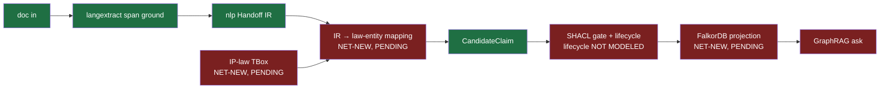

# 30 — Assessment & Critique (Builder-Facing)

_Date: 2026-06-17 · Packet: `atlas-synthesis` · Posture: steelman → red-team → verdict_

This is the candid assessment you asked for. It reads on top of the baseline
gap map (`synthesis/00`), the vision (`synthesis/01`), the architecture doctrine
(`synthesis/02`), the archaeology (`synthesis/90`), and the current-state
inventories (`synthesis/10`–`16`). I steelman before I red-team on every major
point, but I do not hedge the verdicts. You wanted to be challenged through your
own lens — types, schemas, flows, tables — so that is how I argue. Two
questions that genuinely change the shape of everything are previewed in Part D
and get their full treatment in `synthesis/32`.

The single most important thing I can tell you up front, and it survives every
section below: **you have built a remarkable set of bricks and you have not yet
built the building.** The gap is composition, not capability (`synthesis/00 §4`).
Almost every risk in this document is a downstream consequence of that one fact.

---

## Part A — General thoughts

### A1. The thesis is a real intellectual asset — GOOD

**Steelman.** "Retrieval proposes, fallibly; logic proves, soundly" with a
SHACL boundary gate and a character-span provenance link (`synthesis/01 §3`) is
not a slogan — it is a *type-level invariant* with a crisp falsification test:
*does anything compute an entailment?* Left of the boundary, no; right of it,
yes (`synthesis/01 §3`). In a domain where a hallucinated citation is
disqualifying — sanctionable, malpractice-adjacent — the distinction between
"the model is confident" and "this is grounded in span `[start,end)` of file
`sha256:…`" is the whole ballgame. Most legal-AI products bolt grounding on as a
feature; you made it the *spine of the data model*. As a schema person you will
recognize the move: you refused to let `CandidateClaim` and admitted `Claim`
share a type. The boundary is encoded, not asserted in prose.

**Red-team.** The thesis is sharper in the docs than in the code, and the word
**"proves" overclaims**. There is no OWL reasoner in the runtime dependency
graph; runtime validation is **bounded SHACL** plus a consistency check, and OWL
is **design-time only** (`synthesis/01 §4`, `synthesis/00 §3`). SHACL validates
*shape* — cardinality, datatype, value-set, node constraints. It does **not**
compute entailments. So today the honest verb is "validates shape and checks for
declared contradictions," not "proves." Worse, `ClaimLifecycle` is currently
**candidate-only** (`synthesis/00 §5`, `synthesis/03`) — the acceptance/admitted
states the authority/projection boundary is *defined in terms of* are not yet
modeled. The invariant you are most proud of is the one whose state machine is
least built.

**Verdict.** Keep the thesis; it is your best asset. But **rename the promise to
match the runtime.** Internally, draw a hard line between three tiers of
"proof": (T1) *shape-valid* (SHACL passes), (T2) *consistency-checked* (no
declared contradiction in the current graph), (T3) *entailment-sound* (a
reasoner computed consequences — design-time only today, not runtime). Type them
distinctly. A `Claim` admitted at T1 is not the same animal as one at T3, and a
lawyer's trust calculus depends on knowing which. The phrase "proves its
sources" is *marketing-true* (the span resolves) but *logic-false* (nothing was
entailed). For Tom that distinction is invisible and harmless; for you, the
architect, conflating them is how the spine rots. **Model the lifecycle before
you wire the gate** — the gate without the states is a door with no rooms.

### A2. The dogfooding flywheel is the genuine unfair advantage — GOOD

**Steelman.** This is the strongest strategic fact in the whole packet, and it
is structural, not lucky. You have: a real 25-year IP attorney (Tom), a real
de-duplicated USPTO-enriched corpus (8,438 files, `synthesis/01 §2`), real
matters with real deadlines, and — critically — a **captive expert grader** who
approves or rejects every candidate claim (`synthesis/01 §2`, flywheel diagram).
That gives you near-zero customer-acquisition cost for v1, a labeled-data engine
no competitor can buy, and a feedback loop where *his use makes it smarter*. In
ML terms you have solved the cold-start and the eval-set problem simultaneously,
with a domain expert whose time you don't have to pay market rate for. "Father
built the knowledge; son builds the machine that makes it legible"
(`synthesis/01 §2`) is, stripped of sentiment, a moat-generation mechanism.

**Red-team.** A flywheel with **one** user has a turning radius of one. Tom is
simultaneously your only user, only grader, only PM, and only revenue
justification — that is concentration risk wearing a strategy hat. Three honest
failure modes: (1) **n=1 overfitting** — you will tune the system to Tom's
idiosyncratic style and prior-firm habits, and that may not generalize to a
second attorney (more in `synthesis/32`); (2) **grader fatigue** — the approval
gate (commitment C6, `synthesis/01 §7`) only works if Tom actually reviews
candidates; a busy solo practitioner who rubber-stamps turns your eval engine
into a rubber stamp; (3) **the corpus is prior-firm work product** —
`synthesis/01 §10` already flags the open question of *what can be exported under
confidentiality terms*. If the seed corpus is encumbered, the flywheel's fuel
tank may be smaller than 8,438 files.

**Verdict.** This is real and it is your edge — but **the flywheel only spins if
the approval gate has low friction and high signal.** The single highest-ROI
product-design problem you have is making Tom's approve/reject/edit action so
cheap and so information-rich that he does it reflexively on real work. That UX
*is* the data engine. Treat "grader friction" as a first-class metric, not a
polish item. And get a written answer on corpus export terms before you build
the Librarian (P2) — it is a gating legal fact, not a footnote.

### A3. Local-first + matter walls — engineering and ethics coincide — GOOD

**Steelman.** This is the rare case where the technically elegant choice and the
ethically mandatory choice are the *same* choice. Local-first by default
(commitment C1, `synthesis/01 §7`) means client-privileged material never leaves
the machine — which is exactly what confidentiality demands. Matters modeled as
**named subgraphs that double as ethical walls with legal force**
(`synthesis/01 §5`, C1) means conflict-of-interest checks become a graph query
that can join across walls *for detection* while keeping walls sealed *for
substantive reads* (`synthesis/01 §5` face 4). You get to answer "do I have a
conflict?" — a query only a single unified graph can answer — without violating
the very confidentiality that the conflict rules protect. That is a genuinely
clever architecture-meets-regulation fit, and PGlite-first with a
storage-neutral domain (C9) keeps it honest at the type level.

**Red-team.** "Matter wall with legal force" is currently a **doctrine sentence,
not an enforced boundary**. The slice that would carry it (`law-practice`) is
**domain-only** — no server, tables, use-cases, or UI (`synthesis/00 §2`,
`synthesis/02` Confidence). `.policy.ts ×0` and `.ports.ts ×0` across the whole
repo outside the lab (`synthesis/02` Confidence) means the *policy* layer where
a wall would actually be enforced **does not exist yet anywhere in product
code**. A wall you describe but do not enforce is worse than no wall, because it
invites trust it hasn't earned. And local-first cuts both ways: no cloud means
**you** are now responsible for backup, sync integrity, device loss, and
disk-level encryption of privileged data — the sync engine is explicitly
net-new, P5 (`synthesis/01 §8`). A lost laptop with an unencrypted PGlite file is
a malpractice event.

**Verdict.** The *design* is correct and you should not waver on it. But until
the matter wall is an enforced `.policy.ts` with tests proving cross-wall reads
fail closed, **call it "designed," not "enforced."** The wall is one of the few
places where a bug is not a bug but an ethics violation; it deserves
contract-test treatment (`synthesis/02 §12`) — a policy suite that asserts a
substantive read across a matter boundary *cannot* succeed — before you let Tom
put two clients in the system. Local-first also silently moved the data-loss and
encryption burden onto you; budget for it now, not at P5.

### A4. Real engineering discipline — GOOD (with a caveat that becomes A-needs-work-2)

**Steelman.** The discipline is real and verifiable. Schema-first everywhere,
Effect service composition over global state, a binding architecture standard
with five typed error kinds and translators at every boundary (`synthesis/02
§8`), a clean authority/projection/cache split (`synthesis/00 §3`), and an
executable reference slice (`architecture-lab`) that actually proves the error-
translation doctrine in code (`synthesis/02 §8`, `WorkItemRepositoryNotFound` →
`WorkItemNotFound`). "Authority spine largely built" is **credible**, not
aspirational: `epistemic-domain`'s four entities, `semantic-web`'s PROV-O +
bounded SHACL adapter, and `rdf` all verified present (`synthesis/01 §6`). For a
solo builder this is a level of structural integrity most funded teams never
reach.

**Red-team.** Discipline is a cost as well as a virtue, and you are paying full
price for it before you have a product to amortize it against. See A-needs-
work-2 — this is the over-building risk, and it is the load-bearing concern of
Part A's "needs work" half.

**Verdict.** The bricks are well-made and the mortar (the doctrine) is sound.
The question is no longer "is the engineering good" — it is "is the engineering
*pointed at a running product fast enough*." That is the next section.

---

### A-NEEDS-WORK-1. The integration gap is the central risk — NEEDS WORK (the big one)

**Steelman.** The optimistic read is genuinely defensible: the hard,
*irreversible* design decisions are made (authority/projection/cache, span-as-
provenance, candidate-only writes), and the remaining work is *composition* of
parts that already pass type-check in isolation (`synthesis/00 §4`). Wiring
finished, well-typed packages into a loop is exactly the kind of work Effect's
Layer composition (`synthesis/02 §7`) and your schema-first contracts are
designed to make tractable. You are not staring at a blank file; you are staring
at seven green bricks (`synthesis/00 §4` dependency graph) and a wiring diagram.

**Red-team.** This is precisely where projects like this die, and the docs know
it — "the P1 loop is unproven recombination, not assembly of finished parts"
(`synthesis/00 §5`, `synthesis/01 §10`). Look at what the P1 document-portal loop
actually demands wired end-to-end:

Of the seven hops in the *minimum* loop, **four are net-new and one (the
lifecycle gate) is under-modeled** (`synthesis/00 §2` PENDING table, `§4`). The
two hops in the very middle — `IR → law-entity mapping` and `IP-law TBox` — are
the connective tissue, and **"text → KG end-to-end projection consuming the
Handoff IR" is flat NOT FOUND** (`synthesis/00 §2`). The IR exists; nothing maps
it. That is not assembly; that is the hardest, most semantic, least-typed part of
the whole system, and it is unstarted.

**Verdict.** **This is the risk that subsumes the others.** Every brick you add
without closing a loop *increases* this risk by widening the integration surface.
Your instinct to decompose by capability has served you well, but it has a shadow
side: capability-decomposition optimizes for *brick quality*, and the thing that
kills you is *loop closure*. The single most valuable thing you could do next is
ruthlessly scope a **vertical P1 spike** — one document type, one matter, one
claim shape, the thinnest possible TBox — wired *all the way* from doc to
ask, even if every layer is embarrassingly shallow. Prove the loop turns once on
real Tom-shaped work. A loop that turns once is worth more than five more
perfect bricks. Until the loop turns, the honest project status is
"capability-rich, product-zero."

### A-NEEDS-WORK-2. The architecture may be over-built for pre-PMF — NEEDS WORK

**Steelman.** The doctrine is not ceremony for its own sake. The bet — "high
modularity + consistent topology > low ceremony + improvised structure"
(`synthesis/02 §1`, `00-philosophy.md`) — is *correct in the limit*, and the
authority/projection split is the kind of decision that is brutally expensive to
retrofit. Effect v4's default Layer memoization (`synthesis/02 §7`) removed the
historical tax of slice-local composition, so some of the "ceremony" is cheaper
than it looks. And topology preserves optionality: if the first workflow choice
(see A-NEEDS-WORK-4) is wrong, clean slice boundaries let you pivot without a
rewrite. For someone who learns by porting and thinks in capabilities, a
consistent grammar is a force multiplier, not a tax.

**Red-team.** Count the evidence of over-building, all from `synthesis/02`'s own
verification: only `architecture-lab` carries the full slice spine; the *product*
slice `law-practice` is **domain-only**; `.ports.ts`, `.policy.ts`, and
`.http-handlers.ts` are **×0 outside the lab**; the `iam`/`Membership`/`billing`
examples that the doctrine is written around are **illustrative, not shipped**
(`synthesis/02` Confidence). You have written a 75 KB binding constitution
(`ARCHITECTURE.md`) and a 14-doc rationale packet — promotion records, six-week
feature-flag caps, slice-retirement procedures, V2 contract versioning
(`synthesis/02 §11`) — **for an organization of one developer and zero shipped
slices.** This is a constitution for a republic that has one citizen. The
deprecation procedures govern slices you haven't built; the cross-slice event
contracts coordinate slices that don't exist. There is a real, measurable risk
of a **procedure tax**: every product move now has to be legible to a doctrine
designed for a 20-engineer codebase, and that legibility has a per-edit cost paid
by a solo builder racing to PMF.

**Verdict.** The *irreversible* parts of the architecture (authority/projection,
schema-first, the error-kind taxonomy) are worth every line — keep them. The
*organizational-scale* parts (promotion records, V2 versioning, slice-retirement
windows, the full ports/policy/handler ceremony) are **premature for a one-
person pre-PMF product**, and applying them to `law-practice` now would slow the
one thing that matters (A-NEEDS-WORK-1: closing the loop). My concrete advice:
graduate `law-practice` to the **minimum viable slice** explicitly sanctioned by
your own doctrine — `domain + use-cases + server`, ~3 packages, ~15 files
(`synthesis/02 §13`) — and *consciously defer* the full ceremony until a second
slice or a second developer creates the coupling the ceremony exists to manage.
The doctrine is an asset you are currently taxing yourself with by applying it at
full strength too early. Use the escape hatch your own standard provides.

### A-NEEDS-WORK-3. "Proof" exceeds the SHACL/OWL reality — NEEDS WORK

(This is the strategic twin of A1; A1 covered the *thesis*, this covers the
*honesty of the claim* as a product and ontology matter.)

**Steelman.** Bounded SHACL + design-time OWL is the *correct* local-first
choice, not a compromise to apologize for. Full OWL 2 DL reasoning is JVM-bound
and not realistically embeddable in a Tauri/PGlite desktop app (`synthesis/00
§5`, `synthesis/22`); in-process SHACL plus OWL-RL via WASM is the feasible
frontier. So the engineering is right. And for the IP domain specifically, the
*absence* of a deep off-the-shelf patent/TM ontology (`synthesis/00 §5`,
`synthesis/20` — FOLIO shallow on IP, IPRonto is ~2003 copyright/DRM) means a
bespoke Effect-Schema TBox is likely the right call anyway — which plays to your
strength.

**Red-team.** Two overclaims compound. First, **the word "proves"** (covered in
A1) — SHACL validates shape, it does not entail. Second, and deeper for an
ontology novice: **there is no IP-substance ontology to validate against yet.**
`synthesis/00 §5` is blunt — no off-the-shelf ontology models patent claims,
office actions, Nice classes, or docketing; the IP-law TBox is **SPECCED /
PENDING (P0)**, "likely bespoke Effect-Schema, not an ontology." So the boundary
gate, even as bounded SHACL, has **nothing IP-specific to check** until you build
the TBox. The "proof" promise is doubly deferred: the reasoner is design-time,
*and* the constraints it would check don't exist for the substance that matters.
The three-tops alignment (BFO / LKIF / FOLIO, `synthesis/00 §5`) is
"undemonstrated" — composing three upper/legal ontologies coherently is a months-
long ontology project on its own, and you are a few-months novice at it.

**Verdict.** Be **honest in naming and sequencing.** The runtime story is
"shape-valid, span-grounded, consistency-checked" — say that, not "proven." And
recognize that **the TBox is on the critical path to the gate being meaningful**
(`synthesis/00 §4`): without it the gate is checking generic claim shape, not IP
substance, and the "logic proves" half of your thesis is inert. Given the
ontology landscape, I'd push you toward a *minimal bespoke Effect-Schema TBox*
for exactly one workflow (the first one — A-NEEDS-WORK-4), grounded in the few
real published sources that fit (CPC/IPC, PROV-O, SKOS), and *defer* the
BFO/LKIF/FOLIO alignment entirely until you have a second workflow that forces
it. Do not let "do the ontology properly" become the rabbit hole that the loop
(A-NEEDS-WORK-1) dies in.

### A-NEEDS-WORK-4. Four faces = four products; first-workflow still open — NEEDS WORK

**Steelman.** The "four faces over one graph" framing (portal / DMS / KG / ask,
`synthesis/01 §5`) is coherent *as an end-state* — they genuinely do share one
substrate, and a lawyer experiences them as one app. Keeping the first workflow
open this long can be read as *discipline*: you refused to commit scope before
the substrate told you what it could cheaply support, and the User Story ("The
Office Action," `synthesis/01 §5`) shows you've at least walked one concrete loop
end-to-end on paper.

**Red-team.** Four faces is **four products' worth of surface area**, and "which
first workflow has the highest trust/value ratio" — office-action review vs
intake vs drafting vs contract review — is **still open** (`synthesis/00 §5`
open question 1, `synthesis/01 §10`, PRD §13). That this is unresolved *this far
into the build* is a red flag, not a virtue. You have built the substrate for all
four and committed to none, which is the inverse of the lean ordering: normally
you pick the wedge workflow *first* and let it pull exactly the substrate it
needs. Building substrate-first and workflow-last is how you end up with four
half-faces instead of one whole one. Each face also has a different riskiest
assumption — the DMS face's risk is sync/identity, the KG face's is the TBox, the
portal's is editor UX, ask's is GraphRAG quality — and you can't de-risk four
unknowns at once as a solo builder.

**Verdict.** **Pick the first workflow now, and let it be a knife, not a Swiss
army.** Office-action review is the natural candidate — it is the one the User
Story already walks (`synthesis/01 §5`), it is bounded (one document type, one
matter, a finite claim shape), it is high-value (the output is billable attorney
work), and it exercises the *thesis* (claim ↔ spec ↔ figure grounding) rather
than the plumbing (DMS sync). Choosing it collapses A-NEEDS-WORK-1 (the loop gets
a concrete shape), A-NEEDS-WORK-3 (the TBox gets a bounded scope), and the
flywheel (A2) gets a concrete approve/reject action for Tom. The longer the
first workflow stays open, the longer all three of those stay unresolvable.
**This is the keystone decision and it is overdue.**

### A-BAD/RISKY. Effect v4 is a pinned beta — RISKY

**Steelman.** v4's improvements are load-bearing for *this specific
architecture*, not incidental: default Layer memoization is what makes slice-
local composition cheap (`synthesis/02 §7`), and the in-tree workflow primitives
(DurableActivity/DurableDeferred/DurableQueue, per repo memory) are exactly the
replay machinery a provenance-grounded approval pipeline wants. Betting on v4
early also means you skip a future v3→v4 migration that would be brutal across a
codebase this schema-dense. The bet is *coherent*.

**Red-team.** It is still **a product bet on a moving dependency.** A pinned beta
can ship breaking changes between betas, has thinner docs and a smaller answer-
pool when you're stuck, and may have latent bugs you'll discover the hard way in
your own critical path. You are simultaneously a *solo* builder (no one to absorb
a migration), building a *trust* product (where a runtime bug is a credibility
event), on a *beta* runtime. That is three single points of failure stacked. The
Tauri + PGlite + v4-beta + WASM-SHACL stack is also a fairly exotic combination —
the surface area for "no one has hit this exact bug before" is large.

**Verdict.** **Acceptable bet, but hedge it deliberately.** Pin exactly (you do),
keep a written upgrade log of every v4 beta bump and what broke, and — most
importantly — keep your *domain* (schemas, claim model, lifecycle) as
Effect-version-agnostic as the doctrine already demands (storage-neutral, C9).
The danger is not v4 itself; it's letting v4-beta idioms leak into the parts of
the system that must outlive any runtime. Your error-kind taxonomy and the
`die`-bypasses-translation discipline (`synthesis/02 §8`) actually help here:
defects surface loudly instead of silently corrupting the graph. The bet is fine;
just don't let it become a *second* moving target alongside the unbuilt loop.

---

## Part B — The architecture

### B1. The doctrine (vertical slices + hexagonal, 5 error kinds, foundation/drivers/tooling, layer composition)

**Steelman.** This is genuinely good architecture and it is *internally
consistent*. The fusion of vertical (product locality) and hexagonal
(ports/adapters keep externals out) is the right pair for a domain where the
*externals* (USPTO, Box/S3, LLM providers, FalkorDB) churn but the *product
concepts* (Matter, Claim, Evidence) are stable (`synthesis/02 §2`). The five
error kinds with mandatory translation at each boundary (`synthesis/02 §8`) is
the most operationally precise doctrine in the packet and it is *proven in code*
in `architecture-lab`. The "same concept, different lens" principle
(`Membership.policy.ts` / `.commands.ts` / `.http-handlers.ts` are one concept
through three package lenses, `synthesis/02 §2`) is exactly the kind of
mechanical legibility that lets you read a file path and know its role
(`synthesis/02 §13`). For a builder who thinks in types, this is a type system
*for the codebase itself*.

**Red-team.** The doctrine's reach exceeds its materialization (the A-NEEDS-
WORK-2 evidence applies here directly): `.ports.ts ×0`, `.policy.ts ×0`,
`.http-handlers.ts ×0` outside the lab; only one full slice exists and it's the
reference slice, not the product (`synthesis/02` Confidence). Several governance
mechanisms are **doctrine but not enforced** — promotion-record lint is *planned,
not implemented*; cross-slice event-import lint *does not exist*; the God Process
Manager diagnostic *has never caught a real case* (`synthesis/02 §3, §14`). So a
meaningful fraction of the "binding constitution" is currently honor-system. That
is fine at n=1, but it means the doctrine's *enforcement* is aspirational even
where its *design* is sound — and aspirational rules tend to rot precisely
because nothing fails when you skip them.

**Verdict.** **The doctrine is correct and worth keeping; the question is dosage,
not validity.** Apply the irreversible structural parts (slice boundaries, error
translation, storage-neutral domain) to `law-practice` immediately, at minimum-
viable-slice scope. *Defer* the governance ceremony (promotion records, V2
versioning, retirement windows) until coupling exists to justify it. The error-
kind taxonomy in particular is worth front-loading: in a trust product, knowing
exactly which boundary a failure escaped from — and that defects `die` loudly
rather than translating into a soothing 200 (`synthesis/02 §8`) — is a
correctness property, not a nicety. Grade: the doctrine is an **A as design, a C
as currently-realized-in-product**, and the gap between those two grades is the
A-NEEDS-WORK-1 loop.

### B2. The BeepGraph authority / projection / cache split

**Steelman.** This is the best architectural decision in the whole project and I
want to be unambiguous about it. The three-tier split — **authority** (typed
claims+evidence+provenance+lifecycle, the only source of truth), **projection**
(FalkorDB/GraphRAG, rebuilt from authority, never a second source), **cache**
(TTL'd candidates) (`synthesis/00 §3`, `synthesis/01 §4`) — resolves the single
most common failure mode of KG products: **dual sources of truth that drift.** By
making FalkorDB a *projection* you can blow it away and rebuild it, you can swap
graph stores, and you never face the "which copy is right" question that sinks
naive RAG-over-graph systems. Keeping Effect Schema as the typed authority and
OWL as design-time-only (`synthesis/01 §4`) is the disciplined version of the
same idea: vocabulary and constraints from the ontology, *authority* from your
types. As a schema person, you'll feel the rightness of this: the projection is a
*derived view*, like a materialized SQL view, and derived views can't lie if you
never let anyone write to them directly.

**Red-team.** The split is currently **doctrine, not a package** — "BeepGraph" is
zero hits in the export catalog, docs-only (`synthesis/00 §2`). The two tiers
that make the split *real* are the two least built: the projection (FalkorDB)
is **SPECCED ONLY** (`synthesis/00 §2`), and the authority's *lifecycle* — the
very thing that decides what gets projected — is **candidate-only**
(`synthesis/00 §5`, `synthesis/03`). So today you have an authority tier with no
acceptance states and a projection tier with no projector. The rebuild-from-
authority guarantee is only as strong as the *replay* machinery (the `Activity`
event log, the projection builder), none of which is wired. And FalkorDB itself
carries a real licensing flag: **SSPLv1** (`synthesis/00 §5`, `synthesis/21`) —
the one donor meant to *run* in a client-facing legal product has a service-
source-code clause that is a genuine call to make before you depend on it; the
repo's "open-source" label for it is inaccurate.

**Verdict.** **The split is right; build the boundary, not the tiers, first.**
The irreplaceable asset here is the *invariant* (one authority, derived
projections), and the cheapest way to bank it is to (1) model `ClaimLifecycle`
fully — the candidate → shape-valid → consistency-checked → admitted → (later)
entailed states — so the boundary has rooms, and (2) build the *projection
builder as a pure function of the authority* even if its first target is just an
in-memory graph, not FalkorDB. That proves "projection is rebuildable" without
betting on FalkorDB's license yet. Defer the FalkorDB-vs-alternatives decision
(SSPL matters for a product you intend to put in front of a client) until the
projection *interface* is proven against the toy target. **Model the lifecycle,
build the projector-as-function, defer the store.** That sequence banks the
architecture's value at the lowest cost and pushes the one licensing landmine out
of the critical path.

### B3. The stack: Effect v4-beta / Tauri / PGlite

**Steelman.** The stack is *coherent with the thesis*, which is more than most
stacks can say. Local-first (C1) demands an embeddable store → PGlite, which
gives you real Postgres semantics (and a path to pgvector for the cache tier,
`synthesis/01 §4`) in-process. Desktop-native + web-tech UI → Tauri, which is the
right weight class for a single-user professional tool (far lighter than
Electron, native FS access for the "file is canonical" commitment C2). Effect v4
ties the runtime together with typed errors, Layer composition, and in-tree
workflow primitives for the approval pipeline. Each choice falls out of a
commitment rather than fashion; the stack is *derived*, not assembled.

**Red-team.** It is also an **exotic, all-beta-adjacent combination** with a
small shared-experience pool. v4 is a pinned beta (A-BAD/RISKY); Tauri v2 + a Bun
sidecar + file-backed PGlite over `pglite-socket` (`synthesis/10 §1`) is not a
well-trodden path; WASM-SHACL/OWL-RL in the same process (`synthesis/22`) adds
another frontier component. The failure modes are *integration* failure modes —
the kind where each component works alone and the combination deadlocks, leaks,
or corrupts under load — and those are the hardest to debug solo. PGlite is
single-connection and file-backed; concurrent access patterns (the sidecar + the
projection builder + the UI) need care. And "working runtime" is currently
**wiring-inferred, not booted-green-verified** (`synthesis/00` Confidence,
`synthesis/15`) — nobody in the packet has confirmed the whole stack boots and
turns a loop.

**Verdict.** **The stack is well-chosen and I would not change a component — but
prove it boots green end-to-end before you build more on top of it.** The
highest-value cheap action is a *smoke test*: the desktop app boots, the sidecar
connects, PGlite migrates, one message round-trips, the UsageRecord sink fires
(even fixture-valued, `synthesis/10`). That single green path retires a pile of
integration risk that is currently only *inferred*. Treat the exotic stack the
way you treat the v4 bet: fine to commit to, dangerous to leave *unverified* —
and right now its end-to-end liveness is an assumption, not a fact.

---

## Part C — Scoreboard

| Dimension | Good | Needs work | Bad / risk |
|---|---|---|---|
| **Thesis (propose/prove + span provenance)** | Rare, defensible, type-encoded invariant; falsification test is crisp (`01 §3`) | "Proves" overclaims vs bounded-SHACL reality; 3 proof-tiers should be typed distinctly | `ClaimLifecycle` candidate-only — the boundary's states aren't modeled (`00 §5`, `03`) |
| **Dogfooding flywheel (Tom + corpus)** | Captive expert grader, ~0 CAC, proprietary compounding data (`01 §2`) | Approval-gate friction *is* the data engine; corpus export terms unresolved (`01 §10`) | n=1 overfitting + single-grader concentration risk |
| **Local-first + matter walls** | Engineering and legal ethics coincide; conflict-check-as-query is elegant (`01 §5`) | Wall is "designed" not "enforced" — `.policy.ts ×0` (`02` Conf.) | Backup/encryption/device-loss burden now on you; sync engine net-new (P5) |
| **Engineering discipline** | Schema-first, 5 error kinds proven in `architecture-lab` (`02 §8`); authority spine credibly built | — | Procedure tax if full doctrine applied to a solo pre-PMF product |
| **Integration / loop closure** | Hard irreversible decisions made; 7 green bricks exist (`00 §4`) | — | **THE central risk.** 4 of 7 loop hops net-new; IR→law-entity mapping NOT FOUND (`00 §2`) |
| **Architecture doctrine** | Internally consistent, mechanically legible, proven in lab | Governance lint planned-not-built; honor-system at n=1 (`02 §3,§14`) | Over-built for one developer / zero shipped product slices |
| **BeepGraph split** | Best decision: single authority, rebuildable projection — kills drift (`00 §3`) | "BeepGraph" is doctrine, not a package; build the *boundary* first | FalkorDB SSPLv1 in a client-facing product (`00 §5`, `21`); projector unbuilt |
| **TBox / ontology** | Bespoke Effect-Schema likely correct (no off-the-shelf IP ontology) | On critical path; pick one workflow's minimal TBox | BFO/LKIF/FOLIO 3-tops alignment undemonstrated; novice + months of work (`00 §5`) |
| **Four faces / first workflow** | Coherent shared-substrate end-state (`01 §5`) | — | First workflow STILL OPEN this far in — keystone decision overdue (`00 §5`) |
| **Stack (v4-beta/Tauri/PGlite)** | Derived from commitments, not fashion; coherent | Boot-green-verify before building more | Pinned beta + exotic combo; liveness inferred not verified (`00` Conf.) |

Legend: a blank "needs work" or "bad/risk" cell means that axis is genuinely
clean on that severity; an em-dash means "nothing material to add."

---

## Part D — The two questions that change everything (preview of `synthesis/32`)

Two questions sit *underneath* every verdict above. They are not engineering
questions — they are strategy questions — and your answers reshape scope, moat,
and even whether the architecture above is right-sized. Named here, fully
treated in `synthesis/32`:

**(i) Provenance is a WEDGE, not a MOAT.** Span-grounded provenance is a
brilliant *entry* — it gets you in the door of a trust-critical domain where
incumbents ground loosely. But "every fact links to a character span" is a
*feature an incumbent can add*, not a structural barrier. Harvey, CoCounsel, and
the cloud legal-AI players can bolt grounding on; some already ground at the
passage level. So if provenance is the wedge, **what is the moat?** The honest
candidates are not the provenance itself but: (a) the **proprietary, approval-
graded IP corpus** that compounds with Tom's use (A2), (b) **IP-workflow depth**
no general tool will match, and (c) **switching cost** once a practice's whole
graph lives on-device. `synthesis/32` argues which of these is real and how to
deliberately build toward it instead of resting on the wedge.

**(ii) Dad-tool vs venture-product.** Almost every "needs work" verdict above has
*two different correct answers* depending on this fork. If the goal is **a
superb tool for Tom** (a gift, a practice-multiplier for one beloved attorney),
then the over-building (A-NEEDS-WORK-2), the n=1 flywheel (A2), and the open
first-workflow (A-NEEDS-WORK-4) are *fine* — scope to Tom, ship value, ignore
generalization. If the goal is a **venture-scale product** (many firms, a
market), then n=1 overfitting becomes existential, the matter-wall must be
enforced and audited, FalkorDB's SSPL becomes a real licensing decision, and the
architecture's scale-ambition becomes *justified* rather than premature. You are
currently building with venture-grade rigor toward a dad-grade user base, and
that mismatch is the source of the over-building tension. `synthesis/32` forces
the fork — not to pick for you, but because **un-forked, you pay venture costs
for dad-tool value, and that is the most expensive place to stand.**

---

## Confidence & Caveats

**What this assessment is.** A builder-facing critique synthesized from the
packet docs I read in full this session: `synthesis/00` (baseline gap map),
`synthesis/01` (vision), `synthesis/02` (architecture doctrine), `synthesis/90`
(archaeology), and `synthesis/10` (current chat runtime, head). Every in-repo
claim is cited to the companion that verified it against the working tree, the
export catalog, or git history; I did **not** re-open source files, re-run
builds, codegen, or web research, and I spawned no sub-agents (per instruction).

**Relied-upon, not independently re-verified here.** All package built-ness,
symbol counts (`.ports.ts ×0`, etc.), goal-manifest statuses, the 8,438-file
corpus count, the "42 tools" figure, FalkorDB's SSPLv1 license, the No-Escape
paper status, and ontology-landscape claims (FOLIO/IPRonto depth) — each is taken
from the companion synthesis that verified it (chiefly `00`, `02`, `20`, `21`,
`22`). Where those companions marked something UNVERIFIED or NOT FOUND
(text→KG projection, booted-green runtime, live langextract pipeline), I treat it
as such and did not upgrade its confidence.

**Where I push beyond the seed analysis.** The seed's GOOD/NEEDS-WORK framing is
sound and I confirmed it against the docs. I went further on: (1) the three-tier
"proof" typing (T1/T2/T3) as a concrete naming fix for the overclaim; (2)
identifying *loop closure* (not brick quality) as the true risk axis, and the
"projector-as-pure-function, defer the store" sequencing for B2; (3) elevating
*approval-gate friction* to a first-class product metric because it **is** the
data engine; (4) framing the over-building tension as fundamentally a
**dad-tool-vs-venture** mismatch (Part D-ii) rather than a pure architecture
question. These are my analytical calls, not packet quotes — judge them on the
reasoning, not on authority.

**What would change my verdicts.** A booted-green end-to-end smoke test would
materially de-risk B3 and soften A-NEEDS-WORK-1. A resolved first-workflow choice
(A-NEEDS-WORK-4) would let me grade the TBox and loop concretely instead of in
the abstract. A written corpus-export determination (A2) could shrink or confirm
the flywheel's fuel. And the Part D fork is genuinely undecided in the packet —
my verdicts assume venture-grade *rigor* with a dad-tool *user base*, which is
exactly the tension `synthesis/32` exists to resolve.

### Verification (2026-06-17)

Adversarial skeptical-verifier pass over this doc's in-repo claims, checked
against the packet companions (`synthesis/00`, `01`, `02`, `90`, `21`, `03`) and
direct filesystem spot-checks. The doc survives the pass with **no outright
factual errors corrected** — the in-repo claims are accurate and well-grounded.

**Checked and confirmed:**
- `.policy.ts ×0`, `.ports.ts ×0`, `.http-handlers.ts ×0` outside the lab —
  re-counted on disk (`find packages -name`), all genuinely **0**. Matches the
  A-NEEDS-WORK-2 / B1 / matter-wall (A3) evidence.
- `apps/professional-desktop` is **v0.0.3** — confirmed in `package.json`.
- `ClaimLifecycle` is **candidate-only** — confirmed in `03` (`LiteralKit(["candidate"])`,
  `ClaimLifecycle.model.ts:25`). The A1 / B2 / scoreboard claims are exact.
- FalkorDB **SSPLv1** and "repo's open-source label inaccurate" — grounded in
  `21:114–117` (FalkorDB License docs). B2 / scoreboard usage is faithful.
- "five typed error kinds + boundary translators," `architecture-lab` carrying
  the full spine, and the `WorkItemRepositoryNotFound → WorkItemNotFound`
  proof — all confirmed against `02 §8` and its own verification block.
- "seven green bricks" (`00 §4` HAVE nodes: DOC/LX/NLP/SW/EPI/LAWD/CORP) and the
  P1-loop mermaid's "four net-new + one under-modeled gate" are internally
  consistent with `00 §2`/`§4` and the "text→KG projection NOT FOUND" line.
- Office-action review as the recommended wedge (A-NEEDS-WORK-4) is supported:
  the User Story already walks it end-to-end (`01 §5`).
- **Guardrail intact:** zero references to L3 / repo-intelligence / code-AST /
  "code intelligence" anywhere in this doc; nothing pruned is framed as present
  product capability or as the moat. Part D-i correctly demotes provenance to a
  *wedge*, not a moat. The pruned-vehicle frame in `90` is respected.
- **Structure:** steelman precedes red-team precedes verdict in every A/B
  dimension (A1–A4, A-NEEDS-WORK-1–4, A-BAD/RISKY, B1–B3); the doc is candid
  (opens with "you have not yet built the building") without being gratuitously
  negative (each weakness is steelmanned first).
- Forward references (`synthesis/32`) resolve to a present file.

**Corrected this pass:** nothing. No stale or inaccurate in-repo claim was found.

**Remaining doubts (already flagged by the doc, carried forward):** the "42
tools" (25+17) count and the 8,438-file corpus figure are relied-upon from `00`,
not independently re-counted; whether the stack boots green end-to-end is
inferred, not observed; and the FalkorDB SSPL licensing *decision* (vs. the
license *fact*) is open. Note the companions `01`/`02` still self-label their
headers `baseline-synthesis` (pre-rename) — cosmetic, does not affect any claim
this doc draws from them.

---

## Amendment (2026-06-17) — v3 prior-art reconciliation

After this assessment was written, an exploration of the **pre-migration Effect v3** repo
(`/home/elpresidank/YeeBois/projects/beep-effect4` — the *older* codebase despite the "4")
surfaced a built, test-backed knowledge engine. See companions `synthesis/40`–`43` (esp.
[`43-v3-prior-art-impact.md`](./43-v3-prior-art-impact.md)). Net effect on this doc:

- **§A-NW-1 (integration gap) — framing softens, verdict stands.** The KG *engine* middle
  (extraction → entity-resolution → grounding → RDF/PROV-O → reasoning → SPARQL → **GraphRAG
  with citation validation**) is **not greenfield**: it was built and tested in v3
  (`@beep/knowledge-server`, **189 source + 52 test files, ~1:1 source-to-test LOC**, `41`) and
  ran **end-to-end on a *completed* POC of 5 _synthetic_ sample emails — NOT Enron** (Enron was
  the *intended-next* corpus: specced + CLI-harnessed under `specs/pending/`, **never run
  end-to-end**, `41`/`43` Verification). So the loop *shape* is proven achievable; production/
  realistic scale is **UNVERIFIED**. Critically, v3 touches **none** of the IP-law-specific hops
  this section flagged as lethal — **IR→law-entity mapping, the IP-law TBox, the `ClaimLifecycle`
  state machine, and the FalkorDB store choice remain net-new**. Revised status line:
  *"capability-rich, product-zero — with a proven, test-backed engine blueprint in the adjacent
  v3 repo to migrate from."* **New cost not priced above:** an Effect **v3→v4 migration** plus
  **disentangling the engine from the email/meeting-prep learning-vehicle domain** — real work,
  but redesign-with-a-reference, not greenfield.
- **§A-NW-3 (TBox) — unchanged.** v3's ontology *machinery* is reusable but its T-Box *content*
  was generic/email; the IP-law TBox is still net-new.
- **§A-NW-4 (first workflow) — unchanged, more urgent.** v3 proves the builder *can* build the
  whole engine — which makes "pick one workflow; don't rebuild the engine before turning one
  IP-law loop" **more** pressing.
- **Portable now (port the engine, strip the email domain):** the GraphRAG citation-validation +
  RRF flow, the `ExtractionPipeline` shape, two-tier EntityResolution, the `ProvenanceEmitter`
  (PROV-O → authority spine), and the **`EvidenceSpan` char-offset primitive** v4's two-string-ref
  `Evidence` needs re-derived (`42 §5`, `43 §2.1`) — plus the 47KB `KNOWLEDGE_LESSONS_LEARNED.md`.
