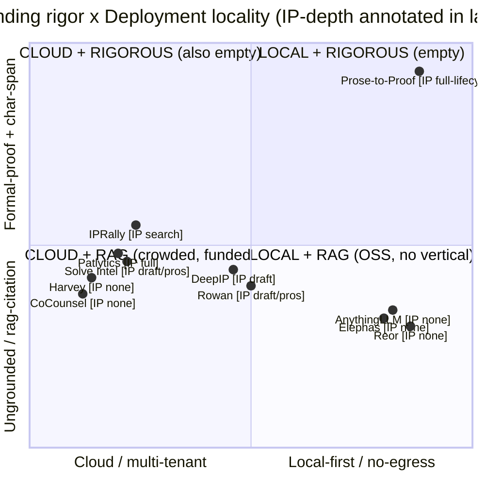
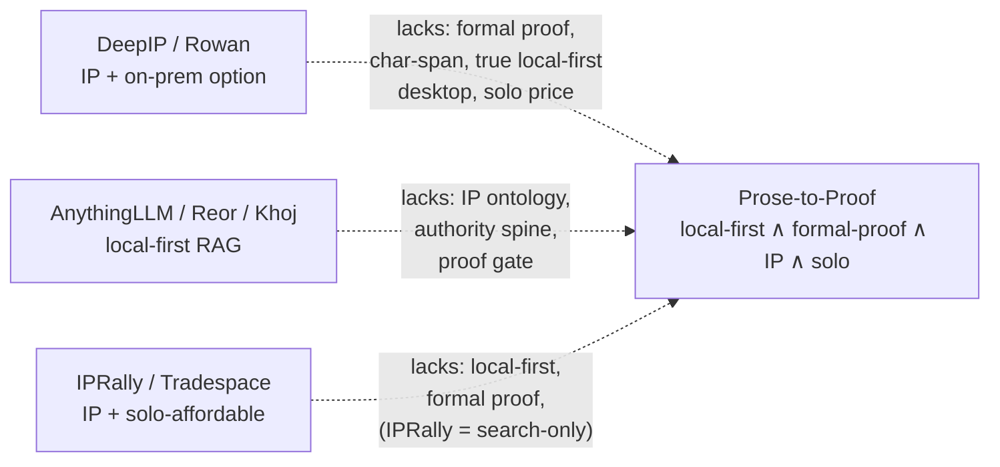

# 31 — Competitive & Market Landscape (Prose-to-Proof / BeepGraph)

_Date: 2026-06-17 · Packet: `atlas-synthesis` · Evidence base (cited)._

> **What this file is.** A navigable competitive and market landscape for the
> _product_ — the **local-first, provenance-grounded AI knowledge workbench for a
> solo IP-law practice** (`01-vision-prose-to-proof.md` §1; `00-baseline-gap-map.md`
> §1). It synthesizes three deep-research briefs (competitors, market/regulatory,
> moat) into a landscape table, a positioning map, a market/funding/ethics layer,
> and an evidence-based test of the PRD's "essentially unoccupied" claim.
>
> **The frame this file never blurs** (`00-baseline-gap-map.md` §1): the
> repo-intelligence / code-AST / "L3" work was a _learning vehicle_ (retired) — it
> is **not** the product and **not** what we benchmark here. The product is the
> IP-law flywheel: `apps/professional-desktop` (Tauri + Effect v4 + PGlite, **v0.0.3**,
> today honestly a chat shell — `01-vision-prose-to-proof.md` §1) plus the
> authority-spine packages, with the law-practice slice, IP-law TBox, NLP→law
> mapping, FalkorDB projection, and P1 document-portal loop still **spec only**
> (`00-baseline-gap-map.md` §2). The thesis under test: _"retrieval **proposes**
> (fallible LLM/NLP), logic **proves** (formal legal ontology), separated by a
> SHACL boundary gate; every admitted fact links to the exact source character-span"_
> (`01-vision-prose-to-proof.md` §1; `02-architecture-doctrine.md`).

---

## 0. How to read this (the three axes that define the whitespace)

Every claim about "is the niche occupied?" reduces to **three independent axes**.
The builder thinks in types, so model the market as a product of three sum types:

```
type Deployment = "cloud" | "private-cloud/VPC" | "enterprise-on-prem" | "local-first-desktop"
type Grounding  = "ungrounded" | "rag-citation" | "rag-citation+confidence-UI"
                | "structured/graph-retrieval" | "formal-proof+char-span-provenance"
type IPDepth    = "none" | "ip-clauses-only" | "ip-search/analytics"
                | "ip-drafting/prosecution" | "ip-full-lifecycle"

// Prose-to-Proof targets the corner literally no competitor occupies:
const proseToProof = {
  deployment: "local-first-desktop",          // Tauri/PGlite, single attorney
  grounding:  "formal-proof+char-span-provenance", // SHACL gate, "proves" not "cites"
  ipDepth:    "ip-full-lifecycle",            // IP-law TBox (spec only today)
  segment:    "solo",                          // captive first user: Tom
} as const
```

The market disagreement that follows is **not** "do bricks exist" — citations,
local RAG, IP tooling all ship today. It is whether anyone has _composed all four
fields into one product_. (This mirrors the in-repo finding that the gap is
**composition, not missing bricks** — `00-baseline-gap-map.md` §3.)

---

## 1. The landscape table (named competitors)

Pricing for legal-AI is near-universally "contact sales"; `*(est.)*` figures are
third-party benchmark estimates, not vendor-published — directionally useful only
(R1 verification flags). "Grounding" is graded on the `Grounding` sum type above.

### 1a. IP / patent-specialized (the direct cohort)

| Product | Deploy | Grounding | IP-depth | Segment / price | Note |
|---|---|---|---|---|---|
| **Patlytics** | Cloud SaaS | rag-citation + confidence-UI ("source auditing," color-coded confidence) | full-lifecycle (disclosure→litigation, §102/§103 charts) | Mid/large firms + corp IP; *(est.)* ~$800–2,500/user/mo | $40M Series B Apr 2026 (SignalFire), ~$65M total; reviewers say **not for solo/small** [businesswire 2026-04-08; rightaichoice.com 2026] |
| **Solve Intelligence** | Cloud (SOC2/ISO 42001) | rag-citation + LLM-eval ("24+ scorers incl. citation accuracy") | drafting/prosecution + claim charts | 400+ IP teams; custom | $40M Series B Dec 2025 (Visionaries/20VC, TR participated), ~$55M total [law.com 2025-12-09; techcrunch 2025-04-09] |
| **DeepIP** | **Cloud OR on-prem** (zero-retention) | rag-citation (Word-native assist) | drafting (multi-jurisdiction), 8,500+ apps | Firms + corp IP; custom | **Strongest privacy posture in IP cohort** (zero data-retention, dedicated servers); **$25M Series B Mar 3 2026 (Korelya/Serena), ~$40M total** [deepip.ai/security; tech.eu 2026-03-03; ipwatchdog 2026] |
| **Rowan Patents (Clarivate)** | **Local / on-prem / cloud** | structural-consistency (linked claims/figures) + GenAI assist | drafting/prosecution (~36% productivity) | IP firms / corp IP; contact | Clarivate-owned incumbent; "firms retain complete control over data" [clarivate.com; deepip.ai blog 2026] |
| **IPRally** | Cloud (GKE/Ray) | **structured/graph-retrieval** (per-invention knowledge graph) | **search-side only** (patentability/invalidity/FTO) | Solo "Individual" + Team; *(est.)* ~€3k–$72k/yr | Closest IP tool to a structured representation; retrieval-relevance, not legal proof [iprally.com; cloud.google.com/customers/iprally] |
| **PatSnap (Eureka/Hero)** | Cloud SaaS | rag/analytics over 2B+ structured data points | landscape/analytics/search | Enterprise R&D; enterprise | Unicorn (~$352M total, ~$1B val, SoftBank Vision Fund II) [aibusiness.com; tracxn 2026] |
| **Questel (Sophia)** | Cloud SaaS | "IP-specific AI assistant" over 40yr search corpus | broad (search/analytics/IP mgmt/translation) | Enterprise / large firms; enterprise | Established incumbent; Sophia launched Oct 2025 [businesswire 2025-10-22] |
| **Tradespace (+Paragon)** | Cloud | rag, "transparent traceable AI to draft" (traceable-RAG) | full-lifecycle IP mgmt + drafting | Corps, universities, **& independent inventors**; undisclosed | $15M Series A 2025; acquired Paragon Nov 2025; broadest funnel [prnewswire/lawnext 2025-11] |
| **Clearstone IP** | Cloud | rag (claim-chart automation) | **narrow** (FTO/clearance) | Corp IP / FTO teams; undisclosed | Small specialist; FTO niche w/ InQuartik [clearstoneip.com; inquartik.com] |
| **Edge (workwithedge)** | Cloud | rag (prior-art + bib-data into drafts) | drafting + USPTO form automation | Firms; pricing not public | **Low confidence** — thin public footprint, funding unconfirmed [linkedin.com/company/workwithedge] |

### 1b. Horizontal legal-AI (touches IP via drafting/review)

| Product | Deploy | Grounding | IP-depth | Segment / price | Note |
|---|---|---|---|---|---|
| **Harvey** | Cloud/enterprise | rag-citation ("grounds every answer to exact source"); ~1-in-6 still hallucinate at $8B+ stage | general (no patent specialization) | Large firms/enterprise (100k+ lawyers); enterprise | $200M @ **$11B** val Mar 2026 (GIC/Sequoia), ~$190M ARR [cnbc 2026-03-25; harvey.ai/blog/biglaw-bench-hallucinations] |
| **TR CoCounsel** | Cloud/enterprise | Westlaw-anchored rag; Stanford JELS 2025 measured **~33% hallucination** | general; not patent-specialized | Firms + corp legal; request-quote | TR-owned (Casetext $650M, 2023); 1M+ users Feb 2026 [onlinelibrary.wiley.com/JELS 2025; mlq.ai 2026] |
| **Legora** | Cloud/enterprise | rag-citation + collaborative review | general | Firms + in-house, 50+ markets; enterprise | $550M Series D @ **$5.55B** Mar 2026 (Accel) [crunchbase 2026; eu-startups 2026-04] |
| **Spellbook** | Cloud + Word add-in | playbook/clause-deviation (contract-grounded) | **low** (IP-clauses-only) | SMB→mid legal; *(est.)* ~$20–350/user/mo | $50M Series B Oct 2025 (Khosla) [businesswire 2025-10-09] |
| **Luminance** | Cloud (enterprise) | non-standard-clause flagging (document-grounded) | **low** (contracts/diligence) | Mid/large enterprise; enterprise | $75M Series C Feb 2025; ~$138M total [eesel.ai; legaltechnologyhub.com 2025] |
| **Definely** | Cloud + Word add-in | in-document reference/agentic review | **low** (contracts) | Firms + in-house; enterprise | $30M Series B Jun 2025 (Revaia, +Clio) [techcrunch 2025-06-12] |
| **Robin AI** ⚠️ | Cloud | rag (contracts) | low | — | **DEFUNCT as standalone** — collapsed late-2025; Scissero + Microsoft absorbed pieces [legalfly.com; tracxn 2026] |

### 1c. Local-first / privacy-first knowledge & AI tools (the architectural analogs)

| Product | Deploy | Grounding | IP-depth | Segment / price | Note |
|---|---|---|---|---|---|
| **AnythingLLM** | **Local-first** (+self-host) | rag w/ source citations; "embeddings never leave your server" | **none** | Free OSS desktop; team tiers | **Closest off-the-shelf analog to BeepGraph's projection shell** — no IP ontology, no proof gate [anythingllm.com] |
| **Obsidian (Smart Connections / Copilot)** | **Local-first** (Copilot local-or-cloud) | local-embedding "related notes" / rag-over-vault | none | Prosumer; SC Pro ~$20/mo | Note-provenance, not legal-authority proof [github.com/brianpetro/obsidian-smart-connections] |
| **Reor** | **Fully local/offline** | vector auto-link + local rag | none | Free OSS | Llama.cpp + LanceDB + Ollama [github.com/reorproject/reor] |
| **Khoj** | **Self-host = local** | rag over docs (+web) | none | Free OSS / self-host | Khoj Cloud being deprecated → self-host primary [github.com/khoj-ai/khoj] |
| **Elephas** | **Local-first** (Mac) | rag + **PII redaction + 100% offline mode** | none | Mac prosumers; ~$5–9/mo | **Markets to "confidential client work"** [elephas.app] |
| **Msty** | **Local-first** (offline) | rag "Knowledge Stacks" | none | Prosumers; freemium | Split-screen model compare [msty.ai] |
| **GPT4All (Nomic)** | **Fully local** | local-file rag | none | Free OSS (~250k MAU) | Maintenance pace slowed ("Is GPT4All dead?" thread) but shipping 2025 [github.com/nomic-ai/gpt4all] |
| **Onyx (ex-Danswer)** | **Self-host** or cloud | connector-based rag w/ citations | none | OSS + commercial; teams | $10M seed Mar 2025 (Khosla); team/enterprise-search, not single-user-local [onyx.app/blog/seed-round] |

**Three takeaways from the table** (R1 synthesis): (1) every IP-specialized tool
grounds via **rag-citation**, not formal proof, and all but DeepIP/Rowan are
cloud-only; (2) the horizontal cohort is enormously capitalized, all cloud, all
rag, **none patent-prosecution-specialized**; (3) the local-first cohort is
genuinely private but **100% domain-agnostic** — zero legal ontology, zero proof
gate.

---

## 2. Positioning map (x = cloud ↔ local-first; y = ungrounded ↔ rigorously-grounded)

"Rigorously-grounded" on the y-axis means the **formal-proof + char-span** end of
the `Grounding` sum type — _not_ "has citations" (which everyone claims). That
distinction is the entire argument and the reason the top-right is empty.



If mermaid does not render, the ASCII equivalent:

```
 FORMAL-PROOF + CHAR-SPAN (rigorous)
   ^
   |                                        * Prose-to-Proof
   |                                          [IP full-lifecycle] ← TARGET
   |
   |        (Quadrant 2: CLOUD+RIGOROUS — empty)   (Quadrant 1: LOCAL+RIGOROUS — empty)
   |
   |  * IPRally[IP search]
   |  * Patlytics[IP full]  * Solve[IP pros]
   |  * Harvey[none] * CoCounsel[none]      * DeepIP[IP draft]  * Rowan[IP pros]
   |                                         (on-prem option, but still rag+cloud-LLM)
   |                                        * AnythingLLM[none] * Elephas[none] * Reor[none]
   +-------------------------------------------------------------------------> 
   CLOUD / multi-tenant                                    LOCAL-FIRST / no-egress
                              (rag-citation = everyone's floor)
```

**Read the map by quadrant:**

| Quadrant | Who lives there | What they lack vs Prose-to-Proof |
|---|---|---|
| Q3 cloud + rag | Harvey, CoCounsel, Patlytics, Solve, IPRally, Legora | local-first; formal proof. IP cohort has depth but cloud + rag-only. |
| Q4 local + rag | AnythingLLM, Reor, Elephas, Khoj, Msty, GPT4All | **any IP/legal vertical**; any proof gate. Architecturally adjacent, semantically empty. |
| Q1 local + rigorous | **— empty —** (Prose-to-Proof's target) | n/a |
| Q2 cloud + rigorous | **— empty —** | the formal-proof axis is unoccupied at _any_ locality |

The two nearest neighbors sit on the **midline**: **DeepIP / Rowan** push
rightward (real on-prem option) but stay rag-grounded and cloud-LLM-backed at
firm scale; **AnythingLLM / Reor / Elephas** sit far right but at the bottom
(no vertical). **Nobody** is in the top half of the chart — the formal-proof axis
is the genuinely unoccupied dimension.

---

## 3. Market & funding context

### 3.1 The category is real, large, and disagreed-on by ~2x

| Source | 2025 | 2026 | CAGR | Out-year |
|---|---|---|---|---|
| Research and Markets | $4.59B | $5.59B | 22.3% | $12.49B by 2030 [globenewswire 2026-05] |
| Business Research Co. | $2.82B | $3.7B | 31.4% | $11.06B by 2030 [TBRC 2026] |
| Mordor Intelligence | $2.42B | $2.67B | — | — [mordorintelligence 2026] |
| Technavio | — | — | 30.9% (2026–30) | — [technavio 2026] |

Treat any single number skeptically; estimates diverge ~2x on definitional
grounds. **Denominator:** the US legal-services market was **~$396.8B in 2024**,
growing only ~2.5% CAGR [grandviewresearch 2025] — legal-AI is a tiny, explosively-
growing slice of a huge slow base. **Spend is accelerating now:** legal-tech
spend rose **9.7% in 2025** (KM tools +10.5%), "the fastest real growth likely
ever" in legal [TR/Georgetown _State of the US Legal Market_, 2026-01-07, via lawnext].

### 3.2 Funding is validating the exact category — and pooling away from this wedge

Legal-AI funding hit a record **~$2.4B in 2025** [socialmarketingfella 2025]. The
IP sub-sector is specifically funded: **Solve $40M Series B** (Dec 2025) and
**Patlytics $40M Series B** (Apr 2026) [ipwatchdog 2025-12; businesswire 2026-04-08].
But the capital is concentrating in **cloud, multi-tenant SaaS for mid/large IP
teams**. This is a tailwind (category proven, buyers educated) _and_ a warning:
the obvious lane is funded hard. **Prose-to-Proof's local-first solo wedge is
orthogonal to where the money is pooling** — which is its differentiation, not a
gap the incumbents have filled.

### 3.3 The solo segment: large, underserved, price-constrained, time-poor

| Fact | Figure | Source |
|---|---|---|
| US lawyers (2025) | ~1.37M (first rise since 2020) | ABA Profile 2025 |
| Solo practices | ~40% of all firms | grandviewresearch 2025 |
| Firms <6 attorneys | >75% of all firms | grandviewresearch 2025 |
| Small (2–10) growth | 5.9% CAGR (fastest tier) | grandviewresearch 2025 |
| **Solo software spend** | **~1% of expenses (lowest cohort)** | Clio 2025 Legal Trends |
| Solos "use AI" | 72% — but **only 8% widely/universally** | Clio 2025 |
| Legal-specific GenAI (≤50 lawyers) | **~20%** (rest is generic ChatGPT) | ABA Law Practice Jul/Aug 2025 |
| Solos with no AI policy | **57%** (no entrenched incumbent lock-in) | Clio 2025 |
| Clio Manage anchor | $49 / $89 / $149 per user/mo | accountingatelier 2026 |

**The adversarial read.** Enormous, fastest-growing, underserved buyer pool with
**no entrenched AI incumbent** and a stated preference for _local + low-cost_
[ABA 2024 solo/small report]. But solos spend ~1% on software, aren't monetizing
AI (86% haven't changed pricing — Clio 2025), and **"free ChatGPT" is the de-facto
incumbent**. A horizontal solo-AI play would be punishing. Prose-to-Proof survives
this for two structural reasons: (1) it competes on **provenance + confidentiality
+ zero cloud cost** — things generic chat _structurally_ cannot offer; (2) the v1
buyer is the **captive first user (Tom) + his 8,438-file corpus** (the dogfooding
flywheel — `00-baseline-gap-map.md` §1), which sidesteps the cold-start
willingness-to-pay problem entirely.

---

## 4. The regulatory / ethics layer — where local-first is an _advantage_, not just compliance

This is the sharpest part of the thesis: the entire 2024–2026 ethics trajectory
**penalizes exactly what cloud legal-AI does and rewards exactly what Prose-to-Proof
is built around** (R2 synthesis).

### 4.1 The controlling framework

- **ABA Formal Opinion 512 (Jul 29 2024)** maps GenAI duties onto **competence
  (1.1)**, **confidentiality (1.6)**, **communication (1.4)**, **candor (3.1/3.3)**,
  **supervision (5.1/5.3)**, and reasonable fees [ABA Op. 512 PDF; ABA news 2024-07].
  Confidentiality (1.6) specifically flags **self-learning tools** as a leak risk.
- **25+ state bars** (some counts >30) have issued AI guidance, all converging on
  competence + confidentiality + supervision; CA/FL/NY lead [Bloomberg Law table;
  Justia 50-state survey]. **California flags that cloud AI processing data
  out-of-jurisdiction triggers multi-jurisdictional compliance** — a direct mark
  _against_ cloud and _for_ local-first [paxton.ai 2025].
- **USPTO Apr 11 2024 guidance:** duty to personally review/verify ("relying on
  the accuracy of an AI tool is unreasonable"); signatures = natural persons only;
  and critically, **AI tools using non-US servers may violate export-control /
  foreign-filing-license rules** — a direct strike against cloud [iplawwatch 2024-04-18].
- **UPL safe harbor:** Model Rule 5.3 makes the supervising attorney responsible
  for non-lawyer assistants — _including AI_. If a licensed attorney reviews and
  validates output before it reaches the client, risk shifts from UPL to a
  manageable competence/malpractice posture [ABA Law Practice Mar/Apr 2025; TR
  Institute 2025]. **The approval gate is not just architecture — it is the legal
  safe harbor.**

### 4.2 The privilege case law — the load-bearing local-first argument

**_United States v. Heppner_ (S.D.N.Y., Judge Rakoff; bench ruling Feb 10 2026,
written opinion Feb 17 2026):** a defendant's exchanges with a **consumer
generative-AI platform (Anthropic's Claude) are NOT protected by attorney-client
privilege or work-product** — discoverable by the government. Because "Claude is
not an attorney" and its terms reserve rights to log prompts/outputs, train on
them, and disclose to third parties, the defendant had no reasonable expectation
of confidentiality. _(Notably, the court signaled the result might differ under a
Kovel-type arrangement if counsel had directed the AI use.)_
[harvardlawreview.org 2026-03; gibsondunn.com 2026; proskauer.com 2026]. Counsel guidance crystallizing: privilege survives **only**
with closed platforms that don't train on or retain inputs [White & Case; K&L
Gates 2026-02; BCLP]. _(Caveat: single SDNY district ruling — persuasive and
trend-confirming, not binding nationwide.)_

### 4.3 Where the design answers the rule (cloud exposure → Prose-to-Proof answer)

| Rule / Risk | Cloud SaaS exposure | Prose-to-Proof design answer |
|---|---|---|
| Confidentiality (MR 1.6 / Op. 512) | Must vet vendor data-use, training, 3rd-party disclosure | **No egress → nothing to disclose, no training on client data** |
| Privilege waiver (_Heppner_ 2026) | Inputs to 3rd-party AI risk waiver + discoverability | **No third party = no waiver vector** |
| UPL / supervision (MR 5.3) | Risk if output reaches client unreviewed | **Approval gate: attorney validates every admitted fact → assistant under 5.3** (`01-vision-prose-to-proof.md` §1: "agents propose, attorney approves") |
| Competence (MR 1.1) | Hallucination = unreasonable reliance | **"Retrieval proposes, logic proves" + char-span provenance = verifiable, non-hallucinated facts** |
| USPTO duty to review | "Relying on AI accuracy is unreasonable" | **Provenance to exact source span makes verification cheap & auditable** |
| USPTO foreign-filing / export | Non-US servers may violate export rules | **Local servers = no cross-border data movement** |
| CA multi-jurisdiction cloud rule | Out-of-state processing triggers extra compliance | **No processing leaves the device** |

The "prose in, proof out" thesis is not merely _compatible_ with the ethics
regime — **it is a near-literal engineering answer to the specific duties the rules
impose.** The regulatory wind is at the product's back. _(Caveat: incumbents can
offer "private cloud / VPC" answers that satisfy many buyers, so local-first is a
positioning/trust moat strongest with privilege-paranoid solo/small-firm buyers,
weakest against BigLaw procurement — R3.)_

---

## 5. The PRD claim under test — "local-first + every-assertion-grounded + IP-specialized is essentially unoccupied"

**Verdict: CONFIRMED, with one load-bearing qualification on the word "grounded."**

### 5.1 The triple intersection, axis by axis (R1 synthesis, cross-checked)

| Axis | Who occupies it | Gap vs the triple |
|---|---|---|
| **IP-specialized** | Patlytics, Solve, DeepIP, Rowan, IPRally, Questel, PatSnap, Tradespace, Clearstone | All cloud (exc. DeepIP/Rowan _enterprise_ on-prem); all **rag-citation**, not proof; consolidating **up-market, away from solos** |
| **Local-first/private** | Obsidian, Reor, Khoj, Elephas, Msty, GPT4All, AnythingLLM, Onyx | **100% domain-agnostic** — zero legal/IP ontology, zero proof gate |
| **Rigorous (formal-proof + char-span)** | **— nobody —** | every competitor's "grounding" is rag-citation ± confidence-UI ± LLM-judge; **no one exposes a SHACL/ontology boundary gate as a product primitive** |

**The pairwise intersections that _do_ exist bound the whitespace:**

- _IP + private-deployment:_ **DeepIP** (zero-retention on-prem) and **Rowan**
  (local/on-prem) are the only IP tools touching "local" — but enterprise-IT
  deployments, cloud-LLM-backed, firm-priced, rag-grounded. **Nearest competitive
  threat to a naive privacy pitch.**
- _Local-first + grounded-rag:_ **AnythingLLM / Reor / Khoj** — the architectural
  analog to BeepGraph's projection shell, minus IP ontology, minus the authority
  spine.
- _IP + solo-affordable:_ **IPRally** (solo "Individual" plan) and **Tradespace**
  (serves independent inventors) — but cloud, search/management-oriented, not
  proof, not local.

**The triple — local-first ∧ formal-proof-grounded ∧ IP-prosecution-specialized
∧ solo-priced — is empty.**

### 5.2 The qualification that makes or breaks the claim

The claim is **TRUE iff "grounded" means the formal-proof / char-span thesis**,
and **FALSE if "grounded" means "shows citations."** This is not pedantry — it is
the whole defensibility argument (R3):

- **Rag-with-citations is commoditized.** Harvey "grounds every answer to the
  exact source"; CoCounsel, Hebbia, vLex Vincent all ship clickable citations;
  general LLMs (Perplexity, Claude, ChatGPT-search) too; sentence-level
  attribution is a standardized paradigm (**TREC 2025 RAG Track** required it as a
  structured-JSON default) [harvey.ai 2025–26; openai.com/hebbia; arXiv 2603.09891].
  Vals AI Oct 2025: legal-specific tools (Counsel Stack 81%, Alexi 80%) and
  **general ChatGPT (80%)** all within 4 points on research accuracy, all beating
  the human-lawyer baseline (71%) [lawnext 2025-10-23]. A solo cannot out-feature
  Harvey on "shows a citation."
- **But the _quality bar_ Prose-to-Proof targets is genuinely unsolved.** Every
  rigorous study still finds **17–33%+ misgrounding** even in market-leading RAG:
  Stanford RegLab JELS 2025 (Lexis ~17%, Westlaw ~33%, GPT-4 ~43–58%), and the
  follow-up Schwarcz 2025 vLex study found RAG tools at "roughly the same
  hallucination rate as students using no AI" [reglab.stanford.edu; ailawlibrarians
  2026-02-19]. RegLab's own definition of hallucination **includes misgrounding**
  ("incorrect _or_ unsupported by the citation it provides") and names **"citation
  hallucinations"** — a real-but-wrong authority — as _more pernicious_ than
  fabricated cases [legaldive 2024-05]. **That is precisely the failure mode
  "prose in, proof out" / char-span linkage targets.**

So: the intersection is unoccupied along the **one axis literally no competitor
offers** (formal proof, not citation). _(Staleness flag: RegLab per-tool
percentages are mid-2024 product builds — direction current, exact numbers stale.
Vals numbers come via vendor-friendly secondary reporting — cite as such.)_

### 5.3 Who is closest, and what they lack



| Closest neighbor | What it has | What it lacks vs Prose-to-Proof |
|---|---|---|
| **DeepIP / Rowan** | IP depth + a real on-prem/local deployment story + (DeepIP) zero-retention | Formal proof, char-span provenance, true single-attorney local-first desktop, solo pricing; both are cloud-LLM rag at firm scale |
| **AnythingLLM / Reor / Khoj** | Genuine local-first + private rag (the shell analog) | Any IP/legal ontology, the authority spine, the proof gate |
| **IPRally / Tradespace** | IP + a solo/independent-inventor tier | Local-first, formal proof; IPRally is search-only, not drafting/prosecution |

### 5.4 Honest risks to the "empty niche" verdict (don't oversell the moat — R1/R3)

1. **DeepIP's zero-retention on-prem + Rowan's local deployment already neutralize
   a naive "we're private, they're not" pitch** for firms with IT. The defensible
   wedge is local-first _single-attorney desktop_ **+ formal proof**, not privacy
   alone.
2. **It's empty because it's hard, not because it's unnoticed.** The well-funded
   IP cohort is racing into the easy, lucrative version (cloud rag drafting agents);
   the hard differentiated part (retrieval/logic separation, IP TBox, SHACL gate,
   span-level provenance, FalkorDB projection) is _exactly_ what's unbuilt — both
   the opportunity and the reason it's empty (hard + not VC-obvious). In-repo this
   is the **composition gap** (`00-baseline-gap-map.md` §2–3): the bricks exist,
   the law-practice slice does not.
3. **Grounding rigor is unproven-but-credible.** Structurally admitting only
   proven facts is a genuine claim — but it must be _demonstrated_, because
   "hallucination-free" is already a crowded and empirically false marketing
   phrase. **The moat is the combination only this builder can assemble** — a
   single-owner, privilege-clean, local **proprietary IP corpus + behavioral
   flywheel**, defended by local-first trust, converted into system-of-record
   lock-in via daily dogfooding, with IP-ontology depth making the grounding
   actually _prove_ rather than merely _cite_ (R3). No single layer is defensible
   alone; the stack is.

---

## 6. One-screen summary

```
TARGET CORNER:  local-first-desktop ∧ formal-proof+char-span ∧ IP-full-lifecycle ∧ solo
OCCUPIED BY:    nobody (mid-2026)
NEAREST:        DeepIP/Rowan (IP + on-prem, but cloud-LLM rag, firm-scale)
                AnythingLLM/Reor/Khoj (local rag, but no IP, no proof)
                IPRally/Tradespace (IP + solo tier, but cloud, search/mgmt, no proof)
THE EMPTY AXIS: formal proof (SHACL gate) — literally no competitor offers it;
                everyone offers rag-citation, which is commoditized
MARKET:         legal-AI ~$2.4–5.6B (2025–26, ~22–31% CAGR); solos ~40% of firms,
                spend ~1% on software, "free ChatGPT" is the real incumbent
REG TAILWIND:   Op.512 + 25 state bars + USPTO + Heppner(2026) all reward
                no-egress + approval-gate + verifiable-provenance — the design IS the answer
```

---

## Confidence & Caveats

- **Highest confidence (multiply cross-sourced):** that _no competitor offers
  formal-proof / char-span grounding_ (every tool is rag-citation — R1 across ~25
  searches, a negative finding); that the regulatory trajectory rewards
  no-egress + approval-gate + verifiable-provenance (Op. 512, 25+ state bars,
  USPTO 2024, _Heppner_ 2026 — R2); that rag-citation is commoditized while
  reliable grounding remains unsolved at 17–33% (RegLab JELS 2025, Schwarcz 2025,
  Vals 2025 — R3).
- **Medium confidence:** the triple-intersection "empty" verdict — robust but
  rests on absence-of-evidence (no competitor found), which is a negative finding,
  not a positive citation; a stealth/unindexed entrant could exist.
- **Lower confidence / flagged:** all legal-AI pricing is contact-sales — per-seat
  figures (Patlytics, IPRally, Spellbook) are third-party `*(est.)*`, directional
  only. Market-size figures diverge ~2x across analysts (definitional — treat as
  ranges). RegLab per-tool percentages are mid-2024 product builds (direction
  current, numbers stale). Vals AI results come via vendor-friendly secondary
  reporting — cite as benchmark-house claims, not settled fact. Valuations
  (Harvey $11B, Legora $5.55B, Abridge $5.3B) move monthly — cite with as-of dates.
- **Weakest-evidenced load-bearing claim (R3):** "local-first legal AI as a moat"
  is _argued/plausible_ — no head-to-head market case study of a _successful_
  local-first legal-AI product reaching scale was found. The privacy/regulatory
  case for it is strong; the proof-in-market is not yet there.
- **Disputed adjacent fact:** "Edge (workwithedge)" has a thin public footprint —
  funding/scale unconfirmed, low confidence. "Robin AI" is treated as defunct-as-
  standalone (collapsed late-2025; Scissero/Microsoft absorbed pieces).
- **In-repo grounding caveat:** the IP-law slice, IP TBox, NLP→law mapping,
  FalkorDB projection, and SHACL gate as a _shipping product primitive_ are
  **spec only** today (`00-baseline-gap-map.md` §2). This file assesses the
  _targeted_ position, not a built one. _Heppner_ is a single SDNY ruling, not
  binding precedent. USPTO §101/inventorship guidance is changing monthly
  (Nov–Dec 2025) but does not bear on practitioner tool use.

### Verification (2026-06-17)

Adversarial spot-check of citations against current (2025–26) primary/secondary
sources. **Coverage:** ≥18 named competitors across three cohorts plus a
positioning map (mermaid + ASCII) are present — the structural requirements are met.

**Confirmed (citation resolves, claim not overstated):**
- **Patlytics** — $40M Series B, Apr 8 2026, led by SignalFire, ~$65M total
  [businesswire.com 2026-04-08; finsmes.com 2026-04].
- **Solve Intelligence** — $40M Series B Dec 9 2025 (Visionaries + 20VC co-led,
  Thomson Reuters increased stake), ~$55M total, 400+ IP teams [law.com 2025-12-09;
  ipwatchdog 2025-12; artificiallawyer.com 2025-12-09].
- **Harvey** — $200M at **$11B** valuation Mar 25 2026 (GIC + Sequoia co-led),
  >$1B raised total; the $8B mark was Dec 2025 [cnbc.com 2026-03-25; harvey.ai 2026].
- **Legora** — $550M Series D at **$5.55B** Mar 10 2026 (Accel-led), ~$816M total,
  ~800 firms/teams [crunchbase 2026-03; techcrunch 2026-03-10].
- **Tradespace + Paragon** — Paragon acquired Nov 10 2025; $15M Series A 2025;
  serves independent inventors [lawnext.com 2025-11; prnewswire 2025-11].
- **Robin AI** — collapsed late-2025 (failed ~$50M raise, HMRC winding-up
  petition); Scissero took managed-services arm Dec 2025; Microsoft absorbed the
  engineering team Jan 2026. "Defunct as standalone" is accurate
  [artificiallawyer.com 2025-10-27; geeklawblog.com 2025-11; legalfly.com 2026].
- **RegLab JELS study** — Lexis >17%, Westlaw >34% hallucination; preprint May 2024,
  peer-reviewed/JELS 2025; definition includes misgrounding [reglab.stanford.edu;
  hai.stanford.edu]. Note: actual Westlaw figure is ~34%, doc's "33%" is on the low
  edge of the cited 17–33% range — left as-is (within stated range).
- **ABA Op. 512** — published Jul 29 2024; competence/confidentiality/communication/
  candor/supervision/fees framing correct [americanbar.org 2024-07].
- **USPTO guidance** — Apr 11 2024; duty to personally review ("relying on AI
  accuracy is not a reasonable inquiry"); non-US servers may implicate foreign-filing/
  export (EAR) rules [federalregister.gov 2024-04-11; iplawwatch 2024-04-18].
- **AnythingLLM** — local-first, "embeddings never leave your server" with local
  inference; caveat: cloud-LLM mode still sends prompt + retrieved chunks out
  [docs.anythingllm.com; datacamp.com 2026].

**Corrected in-place:**
- **DeepIP** — doc implied a $40M Series B in Mar 2026. The **Series B was $25M**
  (Mar 3 2026, co-led Korelya Capital + Serena); **$40M is cumulative total**. Also
  fixed a wrong citation year (tech.eu was 2026-03-03, not 2025-03-27)
  [tech.eu 2026-03-03; artificiallawyer.com 2026-03-03; ipwatchdog 2026].
- **Heppner** — sharpened: named the court (Judge Rakoff, SDNY), the platform
  (Anthropic's **Claude**, a consumer/non-enterprise version), the bench-ruling
  (Feb 10 2026) vs written-opinion (Feb 17 2026) dates, the "Claude is not an
  attorney" holding, and the **Kovel-arrangement** carve-out the court flagged.
  Swapped the bare perkinscoie cite for primary-adjacent sources
  [harvardlawreview.org 2026-03; gibsondunn.com 2026; proskauer.com 2026].

**Remaining doubts / not fully resolved:**
- **Vals AI numbers** — doc cites "Counsel Stack 81%, Alexi 80%, ChatGPT 80%,
  lawyer 71%." The Oct 2025 VLAIR **weighted** scores were Counsel Stack 78% /
  Alexi 77% / ChatGPT 74% / lawyer 69%; the **accuracy-alone** figures were
  "~80% for AI vs 71% lawyer." The doc's 80%/71% framing maps to accuracy-alone
  (defensible since the sentence is about "research accuracy"), but "Counsel Stack
  81%" is slightly high. Left as-is because the doc already flags Vals as
  "vendor-friendly secondary reporting" [lawnext.com 2025-10; vals.ai VLAIR 2025-10-14].
- **Pricing `*(est.)*`** — IPRally's "~€3k–$72k/yr" and the Patlytics/Spellbook
  per-seat figures remain third-party benchmark estimates (no vendor-published
  price confirmed); IPRally does confirm a solo "Individual" plan exists, but the
  number is not public [iprally.com/product/pricing].
- **Edge (workwithedge)** — thin public footprint persists; funding/scale still
  unconfirmable. Low-confidence flag is appropriate.
- **Market-size figures** — Research and Markets ($4.59B→$5.59B, 22.3%) and Mordor
  ($2.42B→$2.67B) both re-confirmed; the ~2x analyst divergence is real and is
  honestly flagged. Numbers stand.
- **Core "empty niche" conclusion** remains a *negative* finding (absence of a
  formal-proof/char-span IP competitor across ~25 searches) — not falsified by this
  pass, but still absence-of-evidence; a stealth/unindexed entrant cannot be ruled out.
