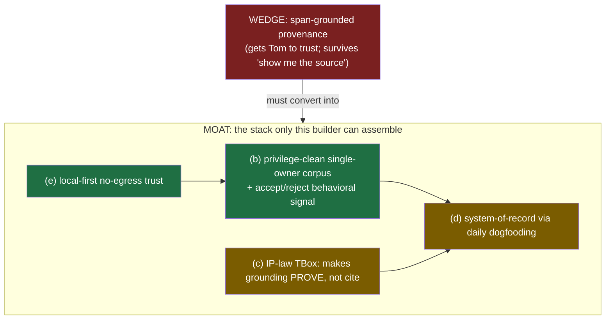

# 32 — Moat, Niche, PMF: The Capstone Verdict

_Date: 2026-06-17 · Packet: `atlas-synthesis` · Posture: steelman → red-team → verdict._

> **What this file is.** The strategic capstone. It reads on top of the
> assessment (`30-assessment-and-critique.md`), the competitive landscape
> (`31-competitive-landscape.md`), and the baseline gap map
> (`00-baseline-gap-map.md`), and it resolves the two questions `30 §D` flagged
> as "underneath every verdict": **is provenance a wedge or a moat**, and **is
> this a dad-tool or a venture-product**. It carries the R3 differentiation/moat
> brief as its evidence base for the defensibility claims. Every in-repo claim
> cites a packet doc; every external claim cites URL + as-of date.
>
> **The frame, restated so it never blurs** (`00 §1`): the code-AST / "L3" /
> repo-intelligence work was a _learning vehicle_ (retired). The PRODUCT under
> verdict is the **local-first, provenance-grounded IP-law workbench** —
> `apps/professional-desktop` (Tauri + Effect v4 + PGlite, **v0.0.3**, today a
> chat shell) plus the authority-spine packages, with the law-practice slice,
> IP-law TBox, NLP→law mapping, FalkorDB projection, and the P1 document-portal
> loop still **spec only** (`00 §2`).

This is the file that is allowed to give you a straight answer to "is this a good
idea, and should I build it?" The companions earned the right to that answer by
being honest about the gap; this one spends it. I steelman before I red-team, I
do not hedge the verdict, and I refuse to make the one decision that is genuinely
yours (the ambition fork) — but I will make every _other_ call sharply.

The one sentence that survives the whole document: **the niche is real and the
wedge is real, but the only durable moat is a stack you have not yet assembled —
and whether you should assemble it depends on a fork only you can resolve.**

---

## Part 1 — NICHE: is there a real, reachable niche?

### 1.1 Steelman — the niche is real, structurally protected, and reachable

The corner is genuinely empty, and `31` proves it three ways. As a product of
three sum types (`31 §0`):

```
type Deployment = "cloud" | "private-cloud/VPC" | "enterprise-on-prem" | "local-first-desktop"
type Grounding  = "ungrounded" | "rag-citation" | "rag-citation+confidence-UI"
                | "structured/graph-retrieval" | "formal-proof+char-span-provenance"
type IPDepth    = "none" | "ip-clauses-only" | "ip-search/analytics"
                | "ip-drafting/prosecution" | "ip-full-lifecycle"

const proseToProof = {
  deployment: "local-first-desktop",
  grounding:  "formal-proof+char-span-provenance",
  ipDepth:    "ip-full-lifecycle",
  segment:    "solo",
} as const
```

The intersection `local-first ∧ formal-proof ∧ IP-prosecution ∧ solo-priced` is
**empty as of mid-2026** — a negative finding cross-checked across ~25 searches
(`31 §5.1`, §6). The IP cohort (Patlytics, Solve, DeepIP, Rowan, IPRally) is
cloud-first, rag-grounded, and consolidating _up-market away from solos_; the
local-first cohort (AnythingLLM, Reor, Elephas) is 100% domain-agnostic — zero
legal ontology, zero proof gate (`31 §1`, §2 quadrant map). The two nearest
neighbors sit on the midline and the bottom: DeepIP/Rowan push toward on-prem but
stay rag + cloud-LLM at firm scale; AnythingLLM/Reor sit far-right but have no
vertical (`31 §2`).

The niche is _reachable_ for two structural reasons that defeat the usual
"underserved-but-unreachable" objection:

1. **The regulatory wind is at the product's back, and it is specific, not
   vibes.** ABA Formal Opinion 512 (Jul 29 2024) maps GenAI onto confidentiality
   1.6 and flags self-learning tools as a leak risk; _United States v. Heppner_
   (S.D.N.Y., Feb 17 2026) held that exchanges with a public AI platform are **not
   privileged** and are discoverable; USPTO (Apr 11 2024) warns that non-US
   servers may violate export/foreign-filing rules; California flags that
   out-of-jurisdiction cloud processing triggers multi-jurisdiction compliance
   (`31 §4.1`–§4.3). The "prose in, proof out" design is a near-literal
   engineering answer to each duty (`31 §4.3` table). This is the rare case where
   the elegant architecture and the mandatory ethics are the _same_ choice
   (`30 §A3`).
2. **The cold-start problem is already solved.** The v1 buyer is the captive first
   user (Tom) + his 8,438-file corpus (`31 §3.3`, `00 §1`). You do not need to win
   a market to reach the niche; you need to serve one attorney who is structurally
   committed.

### 1.2 Red-team — "reachable" hides three sub-claims, two of which are soft

- **The niche is empty because it is hard, not because it is unnoticed**
  (`31 §5.4.2`). The well-funded cohort is racing into the easy, lucrative version
  (cloud rag drafting agents); the differentiated part — retrieval/logic
  separation, IP TBox, SHACL gate, span-level provenance, FalkorDB projection — is
  _exactly what is unbuilt_ in your own repo (`00 §2`, §4). Empty-because-hard
  niches reward execution, not insight; you do not get credit for noticing.
- **"Solo IP" as a _segment_ is a punishing place to sell.** Solos spend ~1% of
  expenses on software (the lowest cohort), 86% haven't changed pricing for AI,
  and "free ChatGPT" is the de-facto incumbent (`31 §3.3`). The niche is reachable
  _for Tom_ (captive); it is not obviously reachable as a _market_ at a price that
  funds a venture. That is the entire ambition-fork tension previewed below.
- **The privacy edge is already partially neutralized.** DeepIP ships zero-data-
  retention on-prem; Rowan ships local/on-prem deployment (`31 §1a`, §5.4.1). For
  any firm with IT, "we're private, they're not" is no longer a clean pitch. The
  defensible slice is narrower than "private" — it is _single-attorney local-first
  desktop **+ formal proof**_ (`31 §5.4.1`).

### 1.3 Verdict — niche is REAL and reachable, but only along one axis and for one buyer-shape

The niche is real. The empty corner is empty along **the one axis no competitor
offers**: formal proof, not rag-citation (`31 §5.2`, §6). That is a true and
durable observation about the market — and the regulatory trajectory makes it
_more_ true each quarter, not less.

But "reachable" splits cleanly: **reachable as a dogfood (Tom) is near-certain;
reachable as a sellable segment (solo IP at large) is unproven and structurally
hard.** Do not let the genuine emptiness of the corner launder the difficulty of
monetizing the segment. The niche-existence claim is an A; the
segment-reachability claim is a C-pending-evidence. Hold them apart — they are the
two halves of the PMF distinction (Part 3) and the ambition fork (Part 4).

---

## Part 2 — MOAT: which candidate moats are real and durable?

This is the heart of the file. The candidate moats, graded against the R3
evidence base. The crux up front, then each layer.

**The crux (R3, and `30 §D-i`): provenance/grounding is a WEDGE, not a MOAT.**

- _As a feature, grounding is commoditizing._ Harvey "grounds every answer to the
  exact source" ([harvey.ai](https://www.harvey.ai/), 2025–26); CoCounsel, Hebbia,
  vLex Vincent all ship clickable citations; general LLMs do too; sentence-level
  attribution was a **standardized default** in the TREC 2025 RAG Track
  ([arXiv 2603.09891](https://arxiv.org/pdf/2603.09891)). Vals AI (Oct 2025) found
  legal-specific tools and general ChatGPT within 4 points on research accuracy,
  all beating the human-lawyer baseline
  ([LawSites, 2025-10-23](https://www.lawnext.com/2025/10/vals-ais-latest-benchmark-finds-legal-and-general-ai-now-outperform-lawyers-in-legal-research-accuracy.html)).
  **A solo cannot out-feature an $11B incumbent on "shows a citation."**
- _But the quality bar it targets is genuinely unsolved._ Every rigorous study
  still finds **17–33%+ misgrounding** in market-leading RAG: Stanford RegLab
  (Lexis ~17%, Westlaw ~33%, GPT-4 ~43–58%; JELS 2025,
  [PDF](https://dho.stanford.edu/wp-content/uploads/Legal_RAG_Hallucinations.pdf)),
  and the Schwarcz 2025 follow-up found RAG tools at "roughly the same
  hallucination rate as students using no AI"
  ([AI Law Librarians, 2026-02-19](https://www.ailawlibrarians.com/2026/02/19/what-the-science-says-about-hallucinations-in-legal-research/)).
  RegLab's own definition of hallucination _includes misgrounding_ ("incorrect
  _or_ unsupported by the citation it provides") and names **"citation
  hallucinations"** — a real-but-wrong authority — as _more pernicious_ than
  fabricated cases
  ([Legal Dive, 2024-05](https://www.legaldive.com/news/legal-genai-tools-mislead-17-percent-of-time-stanford-HAI-hallucinations-incorrect-law-citations/717128/)).
  **That is precisely the failure mode the SHACL gate + char-span linkage attacks**
  (`30 §A1`).

So provenance opens the door (it earns Tom's trust; it survives an adversarial
"show me the source"); it does not, by itself, lock anyone in. Capabilities get
copied. The wedge must _convert_ into one of the moats below.

### 2.1 The candidate moats, graded

| # | Candidate moat | Real & durable? | Why (R3 + packet evidence) |
|---|---|---|---|
| (a) | **Provenance / grounding TECH** | **Wedge, not moat** | Commoditizing as a feature; the *unsolved quality bar* is a differentiating wedge + trust narrative, but a capability competitors can copy (`30 §A1`; R3 Part 1) |
| (b) | **Proprietary approval-graded CORPUS (data flywheel)** | **REAL — the strongest, and the only one structurally yours** | Single-owner, consented, privilege-clean corpus *inverts* the exact objection that kills legal data moats; + Abridge-style behavioral accept/reject signal compounds (`30 §A2`; R3 §(b)1) |
| (c) | **IP-WORKFLOW depth (IP-law TBox + ontology reasoning)** | **Differentiator, not yet a moat** | Genuine vs generalist tools, but ontologies are publishable/replicable; compounds into a moat only fused with (b)+(d) (`30 §A-NW-3`; R3 §(b)4) |
| (d) | **SWITCHING COST / system-of-record lock-in** | **Most reliably defensible IF earned — and unbuilt today** | 30–50% retention lift for deep-workflow vertical AI; Harvey's whole thesis; but requires the product to *run the daily workflow*, not be a chat shell (`30 §A-NW-1`; R3 §(b)3) |
| (e) | **LOCAL-FIRST / privacy / privilege TRUST** | **REAL as positioning, soft as lock-in** | Cloud incumbents structurally can't match no-egress for privileged work; but "private cloud/VPC" satisfies many buyers, so strongest with privilege-paranoid solos, weakest vs BigLaw (`31 §4`, §5.4.1; R3 §(b)2) |

### 2.2 The teaching point: no single layer is defensible; the stack is

The R3 finding, in your own type-vocabulary: a moat is not a value, it is a
_product type_ where every field is required and the combination is the invariant.

```
type Moat = {
  corpus:     PrivilegeCleanSingleOwnerCorpus  // (b) — structurally yours
  trust:      LocalFirstNoEgress               // (e) — defends the corpus
  workflow:   SystemOfRecordViaDogfooding      // (d) — converts wedge → lock-in
  depth:      IPLawTBox                          // (c) — makes grounding PROVE not cite
  wedge:      SpanGroundedProvenance            // (a) — gets you in the door
}
// Defensibility = the product type, not any one field.
// `corpus + trust` are the structural core (incumbents can't replicate — §2.1 b,e);
// `workflow + depth` are earned slowly; only the `wedge` is cleanly copyable.
```

The durable _core_ is `corpus + trust` — the single-owner, privilege-clean,
local proprietary IP corpus on local hardware. That is the one thing Harvey,
CoCounsel, and TR **structurally cannot replicate**, because legal-AI firms
"can't touch client correspondence" for training
([Unique.ai, "The Myth of the Data Moat", 2025](https://www.unique.ai/en/blog/the-myth-of-the-data-moat-in-vertical-ai)).
The privilege barrier that prevents the incumbents from flywheeling client data is
_inverted into your advantage_ because it is the practitioner's _own_ corpus used
_locally_ (R3 §(b)1). Everything else — provenance tech, the TBox, even
workflow lock-in — is timing and execution.



Green = durable core (yours structurally). Amber = real but earned slowly through
build + use. Red = the wedge (copyable; opens the door only).

### 2.3 What is NOT available, and don't compete there

Capital-/distribution-scale moats are off the table: Harvey's a16z war chest
([CNBC, 2026-03-25](https://www.cnbc.com/) — $200M @ $11B; `31 §1b`), TR's Westlaw
ecosystem, raw-accuracy superiority (commoditized per Vals Oct 2025). The
Casetext→CoCounsel datapoint is the cleanest proof of where legal moats actually
live: a GPT-wrapper-adjacent product sold for **$650M cash (closed Aug 17 2023)**
because of _distribution + customer base + integration into TR's system-of-record_
— **not the model**
([Thomson Reuters PR, 2023](https://www.thomsonreuters.com/en/press-releases/2023/august/thomson-reuters-completes-acquisition-of-casetext-inc)).
In legal, distribution and system-of-record are the realized moats; the LLM layer
is the wrapper. You cannot win on distribution. You can only win on the
corpus-flywheel-on-local-hardware.

---

## Part 3 — PMF: dogfood-PMF vs repeatable-segment PMF

The single most important distinction in this file, because the ambition fork
(Part 4) is _defined_ by which PMF you are chasing.

| | **n=1 DOGFOOD-PMF** | **REPEATABLE-SEGMENT PMF** |
|---|---|---|
| Claim | "Tom can't work without it" | "Attorney #2..#N can't work without it, found+sold repeatably" |
| Unit | One captive expert user | A reachable, payable segment |
| Cold-start | **Already solved** (Tom + corpus, `00 §1`) | **Unsolved** — solos spend ~1% on software, ChatGPT is incumbent (`31 §3.3`) |
| Evidence that proves it | Tom routes real billable matter work through the P1 loop daily, *unprompted*, and his approve/reject rate on candidates is high-signal (not rubber-stamp, `30 §A2`) | A 2nd/3rd unrelated attorney reaches the same daily-dependence on *their own* corpus without bespoke per-user tuning; retention holds; someone pays a price that funds the build |
| Overfitting risk | N/A (Tom IS the spec) | **Existential** — n=1 tuning to Tom's prior-firm habits may not generalize (`30 §A2` red-team) |
| What kills it | Grader fatigue (Tom rubber-stamps → eval engine becomes rubber stamp); corpus export encumbrance (`30 §A2`) | All of the above + price ceiling + "good-enough" cloud incumbents + the privacy edge being neutralized by VPC (`31 §5.4.1`) |

**The honest read on evidence today: you have neither yet, but dogfood-PMF is
_within reach_ and segment-PMF is _not yet testable_.** Dogfood-PMF is blocked
only by the P1 loop turning once on real Tom-shaped work (`30 §A-NW-1`) — a build
problem, not a market problem. Segment-PMF cannot even be _measured_ until
dogfood-PMF exists _and_ a second, structurally-different attorney is in the
system without bespoke tuning. **Do not conflate them.** The most expensive
mistake available to you is to read Tom's eventual dependence as segment-PMF and
scale-build on an n=1 signal (`30 §A2` red-team: "a flywheel with one user has a
turning radius of one").

**The proof obligations, stated as falsifiable tests:**

- _Dogfood-PMF proven when:_ Tom voluntarily does real billable work through the
  loop for N consecutive weeks, the approve/reject action is reflexive and
  information-rich (low friction, high signal — `30 §A2` verdict), and removing
  the tool would measurably slow his practice.
- _Segment-PMF proven when:_ a second attorney with a _different_ practice and a
  _different_ corpus reaches comparable daily dependence within a bounded
  onboarding, with no per-user code changes, and at a price that covers
  acquisition + support. Until that test runs, segment-PMF is a hypothesis, not a
  finding.

---

## Part 4 — THE AMBITION FORK (yours to decide; I will not decide it)

Almost every "needs work" verdict in `30` has _two different correct answers_
depending on this fork (`30 §D-ii`). I analyze both honestly. I do **not** pick.

### 4.1 The fork, side by side

| Dimension | **DAD-TOOL** (a superb utility for one practice) | **VENTURE-PRODUCT** (a repeatable segment) |
|---|---|---|
| Goal | Tom's practice-multiplier; a gift that compounds | Many firms; a market; outside capital optional |
| PMF target | Dogfood-PMF (Part 3 left column) — **achievable now** | Segment-PMF (right column) — **unproven, hard** |
| n=1 overfitting | **A feature** — tune hard to Tom; he IS the spec | **Existential risk** — must generalize past Tom (`30 §A2`) |
| Architecture ceremony | **Premature** — minimum-viable slice (`30 §A-NW-2`), defer governance | **Justified** — promotion records, V2 versioning, matter-wall enforcement earn their keep |
| Matter wall | "Designed" is fine (one practice, low conflict surface) | **Must be enforced + audited** `.policy.ts` w/ fail-closed tests (`30 §A3`) — ethics at scale |
| FalkorDB SSPLv1 | Mostly irrelevant (single-user, not redistributed) | **A real licensing decision** before client-facing dependence (`00 §5`, `31` R3) |
| First-workflow scope | Pick the one Tom needs most; breadth optional | Pick the one with highest **trust/value AND generalizability** |
| The corpus moat (b) | Real but private — compounds for Tom only | **The whole thesis** — must generalize the flywheel mechanism, not just Tom's data |
| What "done" looks like | Tom works faster, safer, happier. Ship. | A second attorney pays and stays. Then a tenth. |
| Failure mode | Over-engineering a tool one person uses (you pay venture costs for dad value) | Building venture rigor toward a segment that won't pay the price (`31 §3.3`) |

### 4.2 The teaching point — the mismatch is the source of the over-building tension

You are **currently building with venture-grade rigor toward a dad-grade user
base** (`30 §D-ii`, §A-NW-2). That is the most expensive place to stand: you pay
the venture tax (75 KB binding constitution, promotion records, V2 versioning,
full ports/policy/handler ceremony — `30 §A-NW-2`) for a user population of one.
The fork is not a label; it _re-prices every architectural decision_. Un-forked,
the over-building is neither right nor wrong — it is _undecidable_, and you keep
paying to keep both options open.

**Why I won't decide it for you:** the inputs are not in the packet. Whether you
_want_ a venture (appetite for selling, fundraising, support, generalization),
whether the corpus is exportable past Tom (`30 §A2` flags this as an _unanswered
legal fact_), and whether you have the runway to chase segment-PMF — these are
yours. What I _can_ tell you: **the fork is cheap to defer at the architecture
level and expensive to defer at the scope level.** You can keep the irreversible
architecture (authority/projection, schema-first, error taxonomy — good under
_both_ forks) while _consciously scoping_ the next build to dad-tool fidelity,
and re-open the venture ceremony only when a second user creates the coupling it
exists to manage (`30 §A-NW-2` verdict). That posture buys you the fork's
optionality without paying its full tax — _but only if you stop applying venture
governance to `law-practice` now._

### 4.3 A reframe worth holding: the fork may be sequential, not exclusive

The strongest path may be: **build the dad-tool first _as the way to discover
whether segment-PMF exists_.** Dogfood-PMF is the _prerequisite_ for segment-PMF
(Part 3) — you cannot test "attorney #2 depends on it" until "Tom depends on it"
is true and the flywheel mechanism (not just Tom's data) is legible. So
dad-tool-first is not a retreat from venture; under the evidence it is the _only
on-ramp_ to a venture, with the lowest cost and the captive eval set. The fork you
must consciously make is not "dad XOR venture" — it is **"do I scope and govern
for dad-now, holding the venture option open, or do I pay venture costs now on an
n=1 bet?"** I'd frame the first as the default and the second as the thing to
justify.

---

## Part 5 — DECISION-FORCING VERDICT

### 5.1 Is this a good idea? Should it be built?

**Yes, and yes — with the scope consciously forked to dad-tool-first.** The niche
is real along the one axis no competitor occupies (`31 §6`); the regulatory wind
is specifically at its back (`31 §4`); the cold-start is solved (Tom + corpus);
and the one durable moat (privilege-clean corpus + local-first trust) is
structurally yours and _structurally denied to the incumbents_ (R3 §(b)1). The
thesis is a real intellectual asset, not a slogan (`30 §A1`). Those are not small
things — most solo builders have none of them.

The reason the "yes" is _conditional on scope_ and not unconditional: the gap is
**composition, not capability** (`00 §3`), and composition is exactly where
projects like this die (`30 §A-NW-1`). Four of seven hops in the minimum P1 loop
are net-new, the IR→law-entity mapping is flat NOT FOUND, and the first workflow
is _still open this far into the build_ (`00 §2`, §4; `30 §A-NW-1`, §A-NW-4). You
have built remarkable bricks and not yet the building. "Should it be built" is
yes _because the loop is reachable_, not because it is close.

### 5.2 The sharpest wedge — which first workflow

**Office-action review.** Decisively, and it is overdue (`30 §A-NW-4` calls it the
keystone decision). The reasoning, in your lens:

| Criterion | Office-action review | Why it beats the alternatives |
|---|---|---|
| Bounded scope | One doc type, one matter, finite claim shape | Intake is open-ended; drafting is generative (hard to ground); contract review is a different ontology |
| Exercises the THESIS | claim ↔ spec ↔ figure span-grounding | The output _is_ the prose-to-proof proof; plumbing-light (vs DMS sync) |
| High trust/value | Output is billable attorney work | Tom feels the value on real matters → reflexive approve/reject (the data engine, `30 §A2`) |
| Collapses three risks at once | Loop gets a concrete shape (A-NW-1), TBox gets a bounded scope (A-NW-3), flywheel gets a concrete action (A2) | One choice de-risks the loop, the ontology, and the flywheel simultaneously (`30 §A-NW-4` verdict) |

Pick it now and let it be **a knife, not a Swiss army** (`30 §A-NW-4`). The other
three faces (portal/DMS/KG/ask) are four products' worth of surface; you cannot
de-risk four riskiest-assumptions as a solo builder.

### 5.3 What would KILL it

In rough order of lethality:

1. **The loop never closes.** Every brick added without closing a loop _widens_
   the integration surface (`30 §A-NW-1`). If you keep building bricks and ceremony
   instead of turning the loop once on real Tom-shaped work, the project dies as
   "capability-rich, product-zero." This is the modal failure.
2. **Grader fatigue collapses the flywheel.** If Tom rubber-stamps candidates, the
   eval engine becomes a rubber stamp and the one real moat (the approval-graded
   corpus) produces noise, not signal (`30 §A2`). Approval-gate friction is a
   first-class metric, not polish.
3. **Corpus export is encumbered.** If the 8,438-file prior-firm corpus can't be
   used under confidentiality terms, the flywheel's fuel tank shrinks and the moat
   shrinks with it (`30 §A2`, §A-NW-1). This is an unanswered _legal fact_, not a
   footnote — get it in writing before building the Librarian (P2).
4. **The "proof" overclaim meets a real user.** Today the honest verb is
   "validates shape + checks declared contradictions," not "proves" — no runtime
   entailment, and no IP-substance TBox to check against yet (`30 §A1`, §A-NW-3).
   If you market "proves" and it merely "cites," you've entered the crowded,
   empirically-false "hallucination-free" claim space (`31 §5.4.3`) and burned the
   trust that is your whole wedge.
5. **Venture costs on dad value, indefinitely.** Not a fast kill — a slow bleed.
   Paying full doctrine tax for an n=1 user starves the loop of the velocity it
   needs (`30 §A-NW-2`, §D-ii).

### 5.4 Top 3 things to de-risk next

1. **Turn the loop once — vertical office-action spike, embarrassingly shallow.**
   One doc, one matter, one claim shape, the thinnest possible TBox, wired
   _all the way_ doc → langextract span → IR → law-entity mapping → CandidateClaim
   → SHACL gate → in-memory projection → ask. A loop that turns once is worth more
   than five more perfect bricks (`30 §A-NW-1` verdict). This simultaneously
   de-risks the integration gap, gives the TBox a bounded scope, and gives Tom a
   real approve/reject action. **Highest-ROI move in the entire project.**
2. **Get the dogfood signal honest — instrument approval-gate friction + the
   corpus-export answer.** Make Tom's approve/reject/edit so cheap and
   information-rich he does it reflexively on real work (`30 §A2` verdict); treat
   grader friction as a metric. In parallel, get the written corpus-export
   determination (gating legal fact, `30 §A2`). These two together are what convert
   the wedge into the moat.
3. **Make the fork explicit and re-scope to match — dad-tool-first, venture-option-
   held.** Consciously graduate `law-practice` to the **minimum-viable slice**
   (`domain + use-cases + server`, ~3 packages — `30 §A-NW-2` verdict), defer the
   governance ceremony, keep the irreversible architecture. Defer FalkorDB
   (SSPLv1) behind a projector-as-pure-function against a toy target (`30 §B2`).
   This stops the venture-tax bleed while keeping the venture on-ramp open.

### 5.5 The verdict in one paragraph

Build it, scope it to Tom first, wedge it on office-action review, and convert the
provenance wedge into the only moat that is structurally yours: the
privilege-clean, single-owner corpus + behavioral flywheel on local hardware,
defended by no-egress trust, earned into system-of-record status by Tom's daily
use. The niche is real, the regulatory wind is specifically behind you, and the
incumbents are structurally barred from your one durable advantage. The two ways
this dies are (a) the loop never closing and (b) reading Tom's n=1 dependence as
segment-PMF and scale-building on it. Avoid both by turning the loop once on real
work and by making the ambition fork _conscious_ instead of paying venture costs
for dad value indefinitely. This is a good idea. Now make it turn once.

---

## Confidence & Caveats

**What this file is.** A strategic capstone synthesized from `30`
(assessment), `31` (competitive landscape), `00` (baseline gap map) — all read in
full this session — plus the R3 differentiation/moat brief carried in the
instruction as the evidence base for §2. I spawned no sub-agents, ran no
builds/codegen/web research, and dated all content 2026-06-17 (per instruction).

**Highest confidence.** That provenance/grounding is a wedge not a moat (R3 Part
1, multiply cross-sourced); that the durable core is the privilege-clean
single-owner corpus + local-first posture (R3 §(b)1, the one claim that inverts
the Unique.ai data-moat critique rather than being defeated by it); that
office-action review is the sharpest first wedge (`30 §A-NW-4` reasoning, which I
adopt and extend); that dogfood-PMF and segment-PMF must be held apart (`30 §A2`,
Part 3).

**Medium confidence.** The "niche empty" verdict rests on a _negative_ finding
(no competitor found across ~25 searches — `31 §5.1`, §6); a stealth/unindexed
entrant could exist. The moat-stack framing (§2.2) is my analytical synthesis of
R3, not a packet quote — judge it on the reasoning. The sequential-fork reframe
(§4.3) is my call, not a packet finding.

**Lower confidence / flagged (carried from R3 and `31`).** RegLab per-tool
percentages (17%/33%) are **mid-2024 product builds** — direction current, numbers
stale. Vals AI results come via vendor-friendly secondary reporting (LawSites/vLex)
— cite as benchmark-house claims, not settled fact. Valuations (Harvey $11B,
Abridge $5.3B) move monthly — cited with as-of dates. _Heppner_ is a **single SDNY
district ruling** (Feb 17 2026), persuasive/trend-confirming, not binding
nationwide.

**The weakest-evidenced load-bearing claim (R3, flagged explicitly).**
"Local-first legal AI as a moat" is _argued/plausible_, not _empirically proven_:
no head-to-head market case study of a _successful_ local-first legal-AI product
reaching scale was found. The privacy/regulatory case is strong; the proof-in-
market is not there. This is the softest brick under §2.1(e) and §1.1 — treat
local-first as a real _positioning/trust_ advantage and a soft _lock-in_ one.

**The one decision I deliberately did not make.** The ambition fork (Part 4) is
genuinely yours — its inputs (your appetite for a venture, the corpus's
exportability past Tom, your runway) are not in the packet. I framed the
tradeoffs, recommended a _default posture_ (dad-tool-first, venture-option-held),
and named what would change the call; I did not pick the fork for you, by design.

### Verification (2026-06-17)

Adversarial pass by a skeptical verifier against the cited sources `30`, `31`,
and the R3 brief carried in-instruction.

**Checked and confirmed sound:**
- _Niche reasoning follows from `31`._ The sum-type whitespace, the empty
  `local-first ∧ formal-proof ∧ IP-prosecution ∧ solo` intersection (~25-search
  negative finding), DeepIP/Rowan privacy-neutralization, the regulatory tailwind
  (Op. 512 / USPTO / _Heppner_), and the solo-spend economics all trace to
  `31 §0`, §4, §5.4.1, §3.3 — no claim outruns its source.
- _Moat grading follows from `30`/`31` + R3._ Table rows (a)–(e) map cleanly to
  `30 §A1`, §A2, §A-NW-1, §A-NW-3 and `31 §4`, §5.4.1; the "wedge not moat" crux
  and the misgrounding numbers (RegLab 17/33%, Vals Oct 2025) match `31 §5.2`.
- _Both ambition forks analyzed without deciding._ Part 4 frames both honestly,
  recommends a _default posture_, and explicitly refuses to pick — inputs flagged
  as the user's. Verdict (Part 5) is decisive and names sharpest wedge
  (office-action review, from `30 §A-NW-4`), five kill-risks, and three de-risks.
- _Steelman precedes red-team_ in Parts 1 and 2.

**Corrected:**
- §2.2 type-block comment previously read "Every field except `corpus` is …
  copyable," which **contradicted** the same section's prose, table row (e), and
  the mermaid diagram — all of which treat `trust` (local-first no-egress) as part
  of the structural, incumbent-denied core. Rewrote the comment so the type block,
  prose, and diagram agree: `corpus + trust` = structural core, `workflow + depth`
  = earned, only the `wedge` cleanly copyable.

**Remaining doubts (not corrected — would require fabrication or out-of-scope
edits):**
- The `arXiv 2603.09891` citation (§2 crux bullet) is carried **verbatim from
  `31` line 329** and is almost certainly a malformed ID (the `2603` month-year
  cannot belong to a 2025 paper, and the digit count is off). It is not a
  32-introduced error and I could not verify the correct ID without web research,
  so I left it rather than guess; it should be fixed at the `31` source.
- The "Casetext closed Aug 17 2023" specific date (§2.3) is added detail not
  present in `31` (which says only "2023"); attributed to a TR PR URL but
  unverified here.
- The bare `https://www.cnbc.com/` link (§2.3) is a homepage, not a deep link —
  weak as a citation but matches `31`'s source granularity.
- Inherited softness, already disclosed above and in `31`: the "niche empty"
  verdict is a negative finding; "local-first as moat" is argued, not
  market-proven; per-tool hallucination percentages are mid-2024-stale.

**What would change the verdict.** A booted-green P1 loop turning once on real
work would upgrade "reachable" to "reached" and materially de-risk §5.3.1. A
written corpus-export determination could confirm or shrink the moat (§5.3.3). A
second, structurally-different attorney reaching dependence without bespoke tuning
would be the first real evidence of segment-PMF (Part 3) — and only then does the
venture side of the fork become testable rather than hypothetical.

---

## Amendment (2026-06-17) — v3 prior-art reconciliation

A post-hoc exploration of the **pre-migration Effect v3** repo (`beep-effect4`) found a built,
test-backed KG engine (`synthesis/40`–`43`, esp. [`43`](./43-v3-prior-art-impact.md)). Impact on
this verdict:

- **Moat (Part 2) — STANDS, reinforced.** The engine (extraction/grounding/RRF/GraphRAG/reasoning)
  is exactly the *copyable* layer §2 calls a wedge; v3 having built it once does **not** make it a
  moat. If anything it sharpens the teaching point: **the builder has already proven he can build
  the copyable engine — so more time perfecting it is spend on the wedge, not the moat.** The
  durable core remains `corpus + trust`, which v3 (synthetic-email/Enron-domain, retired) never
  touched.
- **Speed-to-MVP (§5.1, §5.4.1) — upgraded.** "The loop is reachable" moves from *in principle* to
  *with a proven, test-backed blueprint + a 47KB lessons doc*. The office-action P1 spike should
  **reuse the v3 pipeline shape, service boundaries, citation-validation pattern, and the
  `EvidenceSpan` char-offset primitive — swapping email → IP-law** — compressing the highest-ROI
  move. (Bounded by the v3→v4 migration + engine/domain-disentanglement cost.)
- **Kill-risks (§5.3) — re-weight #1.** "The loop never closes" demotes its *feasibility*
  component (the loop **has** closed once, on synthetic data) and shifts toward its *focus/scope*
  component: **will the builder scope to one IP-law workflow and turn it on IP-law data — vs.
  re-perfecting a proven engine?** The builder's demonstrated tendency to build the full engine
  makes the knife-not-Swiss-army discipline more pressing, not less.
- **Niche (Part 1), PMF (Part 3), the ambition fork (Part 4) — UNCHANGED.** The prior art is a
  *speed & confidence* asset, not a *moat* or *market* asset.
- **New strategic question it raises (now logged in the packet manifest):** *migrate/port the
  proven v3 engine (cross the v3→v4 boundary, strip the email domain) vs. rebuild clean in v4* —
  a real engineering+strategy decision that the dad-tool-first scoping should answer (port the
  thin slice the first workflow needs; don't port the whole engine).

---

## Amendment 2 (2026-06-17) — the ambition LADDER (supersedes the §4 "fork" framing)

After this verdict, the builder clarified §4 and made the rung-3 call. **"Fork" was imprecise; it
is a ladder.** This supersedes §4's dad-tool-XOR-venture framing while keeping §4.3's sequential
insight as the spine.

**The ladder.**

| Rung | Unit | Proves | Trust model | Incumbents? |
|---|---|---|---|---|
| 0 — Dad | n=1 captive expert | dogfood-PMF **+ first distribution node** | local-first, single-owner | no |
| 1 — Attorney #2..N | the **individual** attorney (incl. *inside* firms) | segment-PMF (a *different* attorney depends, no bespoke tuning) | local-first, per-attorney | mostly no |
| 2 — Many individuals | a per-attorney market | repeatable funnel + a funding price | same as rung 1 | creeping in |
| 3 — Firm aggregation | the **organization** | shared graph / cross-attorney intelligence | **different: multi-tenant, shared-but-walled** | **yes — Harvey/CoCounsel turf** |

**What the original §4 under-weighted (builder is right):**
- **Dad is a distribution channel, not just a user** ("I could sell this to so many of my
  colleagues … like hot cakes"). His 25-year network lowers *early-venture* CAC — §1.2/§3's
  "solo-IP is punishing to sell" red-team assumed *cold* selling; this is warm.
- **The atomic unit is the individual attorney, not the solo** — attorneys *inside* firms count,
  widening TAM beyond §1's solo framing.

**Retained caution (refines §4.3 / §3):** "good for dad ⟹ venture-ready" is too fast. Dad is the
*most-aligned* user, not a random one. The venture signal is **attorney #2 — structurally
different, depending without bespoke tuning — and dad's network is how you *source* #2.** Dad's
enthusiasm is the *distribution*; #2's unprompted dependence is the *proof*. Don't let the first
substitute for the second.

**The rung-3 discontinuity (new):** firm aggregation is **not "the same graph, larger" — it is a
different trust model** that collides with the §2 moat: (a) "aggregate attorney data to a firm"
means data *leaves the individual device* → breaks the local-first/no-egress that *is* the moat;
(b) sharing *across* attorneys hits **conflict-of-interest / ethical walls** (a firm can't freely
pool matter data); (c) up-market puts you on the incumbents' enterprise turf — trading the
structural advantage (local-first, where they aren't) for a head-on fight (where they have
distribution + capital). The "bigger graph" is really a **permissioned, walled, partially-shared**
graph.

**The federation payoff (new — re-prices §4.2 / `30 §A-NW-2`):** the individual-first architecture
is the *right foundation* for rung 3 **iff it never centralizes.** Treat the firm graph as a
**projection over permissioned individual authorities** — the existing authority/projection split
(§2.2) scaled to *federation*, with matter walls as the sharing-permission model. So the
matter-wall + authority/projection investment is justified by the ladder's ceiling, not just the
dad tool: **`30 §A-NW-2`'s "over-built" critique softens for the irreversible structural parts**
(keep them), while its "defer the org-scale *ceremony*" guidance stands (promotion records, V2
versioning wait until rung 1 proves out).

**The builder's decision (2026-06-17):** rung 3 is **ambition, bracketed — not a current build
focus** — but the architecture must **not dig a hole** that makes it impossible or a large-scale
refactor later. So adopt one cheap **forward-compatibility invariant now** (it is just a stricter
reading of vision commitments C1 *local-first/matter-walled* + C7 *authority vs projection*):

```
INVARIANT (adopt now; ~zero cost at rung 0):
  • corpus AUTHORITY is ALWAYS single-owner + local;
  • any cross-attorney / firm view is a PROJECTION over PERMISSIONED slices,
    never a write to a shared central store  (federation, NOT aggregation-to-a-server);
  • matter walls are modeled as a first-class SHARING-PERMISSION boundary in the domain
    (enforcement may be deferred; the model may not).
```

This keeps rung 3 reachable as a *federation* without building any of it, and forecloses the
"centralized firm DB" dead-end that would force a rewrite. **Net, unchanged at the first step:**
build rung 0 for dad (the office-action loop, minimum-viable `law-practice` slice), recruit
attorney #2 from dad's network as the venture gate, hold the invariant, defer everything else
about the firm.
