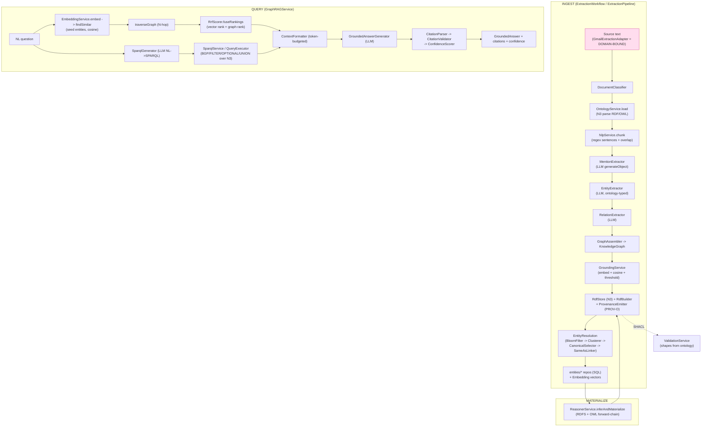

# 41 — V3 Knowledge Engine Survey (`@beep/knowledge-server`)

**Date:** 2026-06-17
**Scope:** Read-only survey of the PRE-migration v3 (Effect v3) knowledge engine at
`/home/elpresidank/YeeBois/projects/beep-effect4/packages/knowledge/server/src` (dir name
`beep-effect4` but it is the OLDER codebase). This is **proven prior art in another repo**, NOT
current v4 (`beep-effect3`) product capability. It de-risks the v4 BeepGraph build
(migration/redesign, not greenfield).

**Guardrail applied throughout.** Three categories are kept distinct:
1. **REUSABLE ENGINE** — portable KG capabilities the v4 IP-law product needs.
2. **DOMAIN-BOUND** — email/meeting-prep/Gmail learning-vehicle bindings; NOT the product.
3. **PRODUCT** — the solo IP-law flywheel lives only in v4; nothing below is v4 capability.

**Census:** `server/src` = **189 `.ts` files, ~23,679 lines** across 21 subsystems;
`server/test` = **52 `.test.ts` files, ~15,135 lines** (a near-1:1 test-to-source line ratio).

---

## Tech-choice findings (verified, not assumed)

| Concern | Choice in v3 | Evidence |
|---|---|---|
| **Graph store** | **In-memory N3 (`new N3.Store()`)** — NOT FalkorDB / Neo4j / Oxigraph / GraphDB | `Rdf/RdfStoreService.ts:210`; grep for `falkordb\|neo4j\|oxigraph\|stardog\|fuseki` in `src` = **0 hits** |
| **RDF parse/serialize** | `n3` (Turtle/N-Triples/N-Quads) via a library-type conversion layer | `Rdf/Serializer.ts`, `Ontology/OntologyParser.ts:17`; `package.json` dep `"n3"` |
| **SPARQL** | **Hand-written engine**: `sparqljs` parses the AST, a custom `QueryExecutor` evaluates BGP/FILTER/OPTIONAL/UNION over the N3 store | `Sparql/SparqlService.ts:13`, `Sparql/QueryExecutor.ts:354` `executeBGP` |
| **Reasoner** | **Hand-written forward-chainer** — RDFS rules (rdfs2/3/5/7/9/11) + OWL (`sameAs` symmetry/transitivity, `inverseOf`); NO external reasoner (HermiT/ELK/openllet) | `Reasoning/ForwardChainer.ts`, `RdfsRules.ts:262`, `OwlRules.ts` |
| **Embeddings** | **OpenAI `text-embedding-3-small`** via `@effect/ai-openai`; Mock + Fallback providers; cosine similarity computed in-process | `Embedding/providers/OpenAiLayer.ts:14`, `Embedding/EmbeddingService.ts:28`, `utils/vector.ts` (`cosineSimilarity`) |
| **LLM extraction/answer** | `@effect/ai` `LanguageModel.generateObject` / `generateText` (Anthropic + OpenAI catalog deps) | `Extraction/EntityExtractor.ts:3,146`; deps `@effect/ai-anthropic`, `@effect/ai-openai` |
| **Vector index** | None external — `EmbeddingService.findSimilar` over persisted `Embedding` rows; **pgvector-style persistence in SQL**, brute-force cosine | `Embedding/EmbeddingService.ts`, `GraphRAGService.ts:159` |
| **Workflow durability** | `@effect/workflow` (`Activity`/`Workflow`/`WorkflowEngine`) + SQL-backed `WorkflowPersistence` | `Workflow/ExtractionWorkflow.ts:11`, `Workflow/WorkflowPersistence.ts` |
| **NLP chunking** | **Regex sentence splitter** (`(?<=[.!?])\s+(?=[A-Z])`) — NO wink/compromise/spaCy | `Nlp/NlpService.ts:13` |

> **Architectural consequence:** the entire RDF/SPARQL/reasoning stack is **self-contained
> TypeScript over an in-memory N3 store**. There is no graph-database dependency to port. That
> makes the engine highly portable but also means it was proven at **demo/POC scale**, not at
> production triple-store scale.

---

## Capability-by-capability table

Substantive = real algorithmic code, not a stub. Tested = matching dir under `server/test`.

| Subsystem | What it does | Substantive & tested? | Engine vs domain |
|---|---|---|---|
| **Extraction** (`Extraction/`, 11f/2957L) | LLM pipeline: classify → load ontology → chunk → mention-extract → entity-extract → relation-extract → assemble `KnowledgeGraph`; emits provenance | YES — 5 tests (`GraphAssembler`, `EntityExtractor`, `MentionExtractor`, `RelationExtractor`, +) | **Engine** (mention/relation/entity extractors are generic, ontology-driven) |
| **EntityResolution** (10f/2137L) | Clustering (`EntityClusterer`), `BloomFilter` blocking, `CanonicalSelector`, `SameAsLinker` (transitive closure), `SplitService`, `MergeHistory`, incremental clusterer | YES — `BloomFilter.test`, `EntityRegistry.test`, bench | **Engine** |
| **Grounding** (3f/510L) | Verifies extracted relations against embeddings (cosine) + confidence threshold; partitions grounded/ungrounded | Substantive; no dedicated test dir (exercised via pipeline) | **Engine** |
| **Rdf** (6f/1163L) | `RdfStore` (N3 wrapper: add/match/getQuads/named-graphs), `RdfBuilder` (fluent quad builder), `Serializer`, `ProvenanceEmitter` (PROV-O) | YES — **6 tests, ~3500L** incl `integration` (747L), `RdfStoreService` (1195L) | **Engine** (PROV-O provenance maps directly to v4 "authority spine") |
| **Reasoning** (5f/869L) | Forward-chaining RDFS + OWL `sameAs`/`inverseOf` with inference provenance + depth/inference caps | YES — `ForwardChainer.test` (600L), `RdfsRules.test`, `ReasonerService.test` (428L) | **Engine** |
| **Sparql** (8f/2070L) | Parse (`sparqljs`) + execute SELECT/CONSTRUCT/ASK/DESCRIBE, `FilterEvaluator`, **LLM `SparqlGenerator`** (NL→read-only SPARQL with parse-retry) | YES — `SparqlParser.test` (692L), `SparqlService.test` (850L) | **Engine** |
| **GraphRAG** (11f/1970L) | **Hybrid retrieval**: embed query → vector seed → N-hop graph traversal → **RRF fusion** → `GroundedAnswerGenerator` with citation parse/validate + confidence scoring | YES — **9 tests** (`Citation*`, `ConfidenceScorer` 545L, `AnswerSchemas`, `RrfScorer`, `GroundedAnswerGenerator`) | **Engine** |
| **Ontology** (5f/972L) | Parse RDF/OWL into class/property defs + hierarchy maps; cache; `OntologyContext` lookups | Substantive (parser is N3-driven); tested via Extraction/Validation | **Engine** |
| **Nlp** (3f/280L) | Regex sentence split + overlapping chunk windowing | YES — 1 test | **Engine** (thin; weakest link) |
| **Embedding** (8f/712L) | `EmbeddingService` (embed/findSimilar), OpenAI + Mock + `FallbackEmbeddingModel`, resilience wrapper | YES — `EmbeddingFallback.test`, `EmbeddingRateLimiter.test` | **Engine** |
| **LlmControl** (5f/1136L) | `CentralRateLimiter` (circuit breaker + rate + semaphore), `TokenBudget`, `StageTimeout`, `LlmResilience` | YES — `LlmResilience.test` (under `test/Resilience`) | **Engine** (cross-cutting) |
| **Validation** (5f/395L) | SHACL: shape generation from ontology, `ShaclParser`, `ShaclService`, `ValidationReport` with policy severities | YES — 1 test | **Engine** |
| **Workflow** (7f/1802L) | Durable extraction workflow, batch orchestrator/aggregator, progress stream, SQL persistence (`@effect/workflow`) | YES — **6 tests** incl engine-parity + payload-boundary | **Engine** (orchestration); batch semantics lean toward corpus ingestion |
| **Service** (10f/2663L) | `DocumentClassifier`, `CrossBatchEntityResolver`, `ReconciliationService`, `OntologyRegistry`, `ExternalEntityCatalog` (+ `Integrations/WikidataCatalog`), `EventBus`, `Storage`, **`ContentEnrichmentAgent`** | YES — **9 tests** | **Mixed**: classifier/reconciliation/catalog = engine; ContentEnrichment leans domain |
| **Runtime** (4f/150L) | Layer bundles (`LlmRuntimeBundleLive`, `WorkflowRuntimeBundleLive`, `ReconciliationBundleLive`), `WorkflowRuntime` | Wiring (substantive composition, thin LOC) | **Engine** (infra) |
| **adapters** (2f/534L) | `GmailExtractionAdapter` — pulls Gmail messages → extraction input | YES — `GmailExtractionAdapter.test` (417L) | **DOMAIN-BOUND** (email source) |
| **db** (4f/69L) | Repo layer wiring for 19 entities over `SliceDbRequirements` | Thin wiring | **Engine** (infra) |
| **entities** (64f/2686L) | 22 persisted models + repos + RPC: `Entity`, `Relation`, `Mention(Record)`, `Embedding`, `EntityCluster`, `SameAsLink`, `MergeHistory`, `Ontology`, `Class/PropertyDefinition`, `Evidence`, `Extraction`, `Batch`, `GraphRAG`, `KnowledgeAgent` … **`EmailThread(Message)`, `MeetingPrep(Bullet/Evidence)`** | Models substantive; tested via service/RPC | **Mixed**: graph entities = engine; `EmailThread*`/`MeetingPrep*` = DOMAIN-BOUND |
| **rpc** (3f/26L) | `V1` RPC layer merging Batch/Entity/Relation/GraphRAG/Evidence/MeetingPrep RPCs | Wiring | **Mixed** |
| **Ai** (2f/166L) | `PromptTemplates` (system + entity/mention/relation prompts) | Substantive | **Engine** (prompts are domain-tunable but generic) |

---

## End-to-end pipeline (reconstructed)

The ingest pipeline (`Extraction/ExtractionPipeline.ts` `serviceEffect`/`run`) wires:
classify → load ontology → NLP chunk → mention → entity → relation → assemble → ground →
RDF emit (+ provenance) → entity resolution. Query path (`GraphRAG/GraphRAGService.ts`):
embed → vector seed → graph traversal → RRF fuse → SPARQL (NL→query) → reasoning →
grounded answer with citations.

---

## Verdict — how complete / proven was this engine?

**Substantially built, tested, AND demoed — at POC scale.** This was not vaporware:

- **Coverage is real.** Every core subsystem has substantive code and a ~1:1 test line ratio
  (52 test files, ~15k test LOC). The heaviest-tested areas are exactly the load-bearing ones:
  RDF store (~3.5k test LOC), SPARQL (~1.5k), GraphRAG citations/confidence (~1.4k),
  reasoning forward-chainer (~1.2k).
- **It ran end-to-end.** A working demo page exists in the v3 repo at
  `apps/todox/src/app/knowledge-demo/` (`KnowledgeDemoClientPage.tsx`, `components/`,
  `rpc-client.ts`), driven by `specs/completed/knowledge-graph-poc-demo/`, which lists all six
  services as **"Complete"**. The **completed** demo corpus was **synthetic sample emails**
  (5 emails, People/Org/Project/Meeting/Date/Role — `apps/todox/src/app/knowledge-demo/data/
  sample-emails.ts`), **NOT Enron**. **Correction (2026-06-17):** "Enron" in the task framing
  is **PARTIALLY VERIFIED** — it is **absent from the knowledge ENGINE code** (`grep -ri enron
  packages/knowledge/` = 0 hits, so the engine is NOT Enron-bound), but it **does exist as
  PLANNED, NOT-BUILT learning-vehicle work**: `specs/pending/enron-data-pipeline/` and
  `specs/pending/enron-knowledge-demo-integration/` (both *pending*), plus a CLI ingestion
  harness `tooling/cli/src/commands/enron/{extraction-harness,parser,thread-reconstructor,
  s3-client,…}.ts` and `test-ontology.ttl` targeting an S3 curated Enron corpus. So Enron was
  the *intended next* corpus to validate the pipeline at realistic scale — specced and
  harnessed but **not run end-to-end through the engine** (the completed POC used the 5
  synthetic emails). This actually *reinforces* the guardrail: Enron is DOMAIN-BOUND
  learning-vehicle scope, cleanly outside the reusable engine.
- **Lessons were captured.** `specs/KNOWLEDGE_LESSONS_LEARNED.md` (47KB) records the
  library-type-conversion-layer pattern, RDF foundation (179 tests), SPARQL (73 tests),
  reasoning scaffolding, GraphRAG phases — i.e. the engine matured across multiple completed specs.

**Honest limits (de-risking, not discrediting):**
- **In-memory N3 store** → proven at demo scale; production triple-store scale is unproven.
- **Hand-written SPARQL + reasoner** are partial (RDFS + a slice of OWL, BGP/FILTER/OPTIONAL/
  UNION) — capable but not a spec-complete engine.
- **NLP is regex-thin** — the weakest subsystem.
- **Vector search is brute-force cosine** over SQL rows — no ANN index.
- Domain bindings (`GmailExtractionAdapter`, `EmailThread*`, `MeetingPrep*`,
  `ContentEnrichmentAgent`) are entangled into `entities/`, `Service/`, `adapters/`, `rpc/` —
  porting requires **separating the engine from the email/meeting-prep learning vehicle**.

---

## Compare to current v4 (`beep-effect3`) packages

The v4 repo has NO `@beep/knowledge-server` equivalent yet; the engine middle is the
documented integration gap. But several v4 foundations already **re-implement the lower layers**
the v3 engine needed — so v4 is migration/redesign over partial greenfield:

| v3 engine layer | Nearest v4 package | v4 size | Read |
|---|---|---|---|
| `Rdf/` (N3 store, builder, serializer) | `packages/foundation/modeling/rdf` | 13f / **4105L** | v4 has a dedicated RDF foundation — likely **larger/cleaner** than v3's 1163L |
| `Sparql/`, `Reasoning/`, `Ontology/`, SHACL | `packages/foundation/capability/semantic-web` | 30f / **5951L** | Has `services/sparql-query.ts` + surface tests; the semantic-web capability is **substantial** in v4 |
| `Extraction/` (LLM mention/entity/relation) | `packages/foundation/capability/langextract` | 6f / **1131L** | Extraction capability scaffolded in v4, **smaller** than v3's 2957L |
| `Nlp/` | `packages/drivers/nlp-mcp` | 9f / **3254L** | v4 NLP is an **MCP driver** — much richer than v3's 280L regex chunker |
| graph entities / persistence | `packages/epistemic/{domain,tables}` | 13f+6f / **786L** | Only **domain + tables**; **NO `epistemic/server`** — the orchestration middle (Extraction/Grounding/EntityResolution/GraphRAG pipeline) is **absent in v4** |

**Net:** v4 has rebuilt or exceeded the **substrate** (rdf, semantic-web, langextract, nlp) but
is **missing the v3 orchestration middle** — `ExtractionPipeline`, `GroundingService`,
`EntityResolutionService`, `GraphRAGService`, `ReasonerService` wiring, and the durable
`ExtractionWorkflow`. The v3 `server/src` is the **highest-value reference** for that middle:
it shows proven service boundaries, the hybrid-retrieval RRF flow, PROV-O provenance emission
(maps to the v4 "authority spine"), and the citation/grounding answer path the IP-law product needs.

**Recommended port priority (engine only, strip domain):**
1. `GraphRAGService` hybrid-retrieval + grounded-answer-with-citations flow (closest to "retrieval
   proposes / logic proves").
2. `ExtractionPipeline` orchestration shape + `Grounding`/`EntityResolution` service interfaces.
3. `ProvenanceEmitter` (PROV-O) → v4 authority spine.
4. `ReasonerService`/`ForwardChainer` if v4 `semantic-web` lacks materialization.
5. Leave behind: `GmailExtractionAdapter`, `EmailThread*`, `MeetingPrep*`, `ContentEnrichmentAgent`.

---

## Confidence & Caveats

- **High confidence** on tech choices, subsystem inventory, file/test counts, and pipeline shape —
  all from files I opened directly (paths cited inline). Graph-store = in-memory N3 is verified by
  `RdfStoreService.ts:210` plus a zero-hit grep for FalkorDB/Neo4j/Oxigraph in `src`.
- **"Enron" is absent from the v3 knowledge ENGINE code** (0 grep hits in
  `packages/knowledge/`) and from the *completed* POC spec — the completed demo corpus is
  **synthetic sample emails** (5). **But Enron is NOT entirely absent from the repo:** it exists
  as **pending (planned, not-built)** specs `specs/pending/enron-data-pipeline/` +
  `enron-knowledge-demo-integration/` and a `tooling/cli/.../enron/` ingestion harness — the
  intended next learning-vehicle corpus, never run through the engine end-to-end. Earlier framing
  of "Enron NOT FOUND" was too strong and is corrected above; the engine/domain guardrail still
  holds (Enron is domain-bound, outside the engine).
- **Medium confidence** on the "substantive but not fully tested" calls for Grounding/Ontology —
  they lack a dedicated `test/` dir and are exercised transitively; I did not run the suite (read-only,
  no builds per instructions), so "tested" means a matching test dir/file exists, not that it passes.
- **v4 comparison sizes** are `find | wc -l` over `src` (excludes `dist`/docs); they indicate
  relative substance, not feature parity. I did not deeply read each v4 package — the claim that v4
  lacks the orchestration middle rests on `packages/epistemic` having only `domain`+`tables` (no
  `server`) and is **medium-high** confidence.
- **Guardrail honored:** nothing here is asserted as present v4 product capability; all of it is v3
  prior art in a separate repo that de-risks (does not constitute) the v4 BeepGraph build.

### Verification (2026-06-17)

Adversarial read-only re-check against `/home/elpresidank/YeeBois/projects/beep-effect4`.

**Checked and confirmed:**
- **Census exact:** `server/src` = **189** `.ts`, `server/test` = **52** `.test.ts` (both match the doc).
- **Graph store:** `grep -ri 'falkordb|neo4j|oxigraph|stardog|fuseki'` over `server/src` = **0 hits**; `RdfStoreService.ts:210` = `const store = new N3.Store();` (verbatim). In-memory N3 claim holds.
- **Capability paths exist:** `GraphRAG/RrfScorer.ts`, `Reasoning/{ForwardChainer,OwlRules,RdfsRules,ReasonerService}.ts`, `EntityResolution/BloomFilter.ts` all present.
- **Domain entities exist:** `entities/{EmailThread,EmailThreadMessage,MeetingPrep,MeetingPrepBullet,MeetingPrepEvidence}/` confirmed — domain-bound classification correct.
- **Demo:** `apps/todox/src/app/knowledge-demo/` exists with `KnowledgeDemoClientPage.tsx`, `rpc-client.ts`, `data/sample-emails.ts`; POC README confirms **5 sample emails** (synthetic). `specs/completed/` holds 13 `knowledge-*` specs incl `knowledge-graph-poc-demo`.

**Corrected:**
- **The "Enron NOT FOUND / UNVERIFIED" claim was materially wrong** and is now fixed in two places + the verdict. Enron *is* absent from the **engine code** (0 hits in `packages/knowledge/`), but it **exists as PLANNED, not-built work**: `specs/pending/enron-data-pipeline/` and `specs/pending/enron-knowledge-demo-integration/` (both pending), plus a real CLI harness `tooling/cli/src/commands/enron/{extraction-harness,parser,thread-reconstructor,s3-client,cache,curator}.ts` + `test-ontology.ttl` over an S3 curated Enron corpus. Net effect: the *completed* POC ran on 5 synthetic emails; Enron was the intended **next** learning-vehicle corpus, specced/harnessed but never proven end-to-end through the engine. This sharpens rather than weakens the guardrail.

**Remaining doubts:**
- "Tested" still means a matching test file/dir exists, not that suites pass — I ran no builds/tests (read-only). The Grounding/Ontology "substantive but transitively tested" calls are unchanged and remain medium confidence.
- v4-comparison sizes are unre-verified here; they were `find|wc` snapshots and indicate relative substance, not parity. The "no `epistemic/server`" claim driving "missing orchestration middle" was not re-checked this pass — treat as medium-high, not certain.
- Whether the Enron harness was *ever executed* (vs. just authored) is unconfirmed: `specs/pending/enron-data-pipeline/outputs/extraction-results.md` exists (93 lines) but lives under `pending/`, so I treat the pipeline as **specced + harnessed, not proven-run**.
