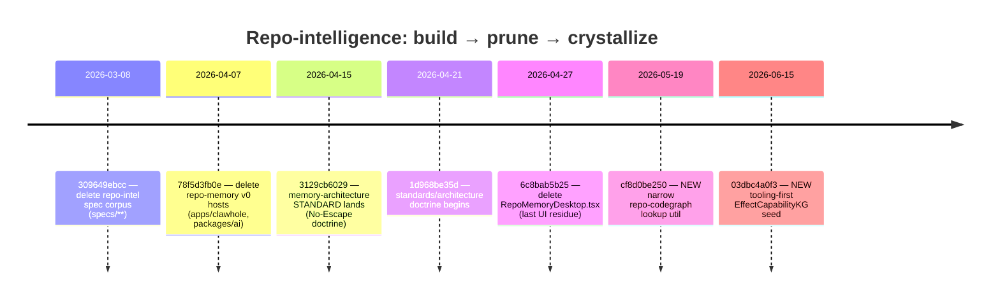

# 90 — Archaeology: The Pruned Repo-Intelligence Vehicle

_Synthesis date: 2026-06-17_
_Method: read-only git history (`git log`, `--diff-filter=D`, `-S`), plus targeted
Read/Grep over `standards/`, `explorations/`, `goals/`, and `packages/tooling/`._

## Purpose

This artifact grounds one claim from the baseline guardrail with commit-level
evidence: that the software / repo-intelligence / code-AST / "repo-memory v0" /
"L3 deterministic code intelligence" body of work was a **learning vehicle** —
the user grounding themselves in software/`beep-effect` to learn
ontology/graph/memory architecture — and has since been **pruned**. The PRODUCT
is the solo IP-law firm flywheel for the user's father; the memory-architecture
framework is now LEARNED THEORY, not shipping code.

The history corroborates the guardrail. The repo-intelligence spec corpus was
deleted, the apps that hosted "repo-memory v0" were deleted, and the
theory was extracted into a binding `standards/memory-architecture/` doctrine
that explicitly reframes the work as a thesis. A small, narrowly-scoped
tooling residue remains and is easy to mistake for the pruned engine; this
artifact disambiguates it.

---

## 1. Chronological timeline (commit-grounded)

All hashes/dates verified via `git log` on `main` / `--all`.

| Date | Commit | Event | Evidence |
| --- | --- | --- | --- |
| 2026-02-24 → 2026-03-02 | `97dd07f3c7` (first `standards/`), `d51334feb6`, `2305cd80b3` | `standards/` tree born around agent-eval / effect-v4 reliability. Memory doctrine not yet present. | `git log --reverse -- standards/` |
| 2026-03-08 | **`309649ebcc`** "chore: remove archived spec artifacts" | **Bulk deletion of the repo-intelligence spec corpus** under `specs/completed/**` and `specs/paused/**` (see §2). | `git show --name-only 309649ebcc` |
| 2026-03-25 | `93a003aad1` "chore: pruned subtrees" | Removed vendored `.repos/*` scaffolds (e.g. `base_bevr-stack`) — unrelated vendor cleanup, listed for completeness. | `git show --stat 93a003aad1` |
| 2026-04-07 | **`78f5d3fb0e`** "chore(repo): remove deprecated workspaces" | **Deletes whole apps/packages**: `apps/clawhole` (incl. `src/domain/Memory.ts`), `packages/ai/**` (204 paths), `apps/crypto-taxes`, `apps/editor-app`. This removes "repo-memory v0" hosts. | `git show --name-only 78f5d3fb0e` |
| 2026-04-15 | **`3129cb6029`** "feat: knowledge workspace spec rewrite + Phase 0 agent bootstrapping" | **Earliest `standards/memory-architecture/` commit** — the No-Escape doctrine lands as a *standard*. | `git log --reverse -- standards/memory-architecture/` |
| 2026-04-21 | `1d968be35d`, `9f418416f6`, `5fd6cd786d` ("architecture stuff") | **`standards/architecture/` doctrine work begins.** | `git log --reverse -- standards/architecture` |
| 2026-04-27 | `6c8bab5b25` "saving" | `apps/desktop/src/RepoMemoryDesktop.tsx` deleted (residual repo-memory UI host). | `git log --diff-filter=D -- apps/desktop/src/RepoMemoryDesktop.tsx` |
| 2026-05-19 | `cf8d0be250` "feat(repo-codegraph): add deterministic reuse lookup" | NEW narrow `@beep/repo-codegraph` lookup utility created (NOT the pruned engine — see §4). | `git log --reverse -- packages/tooling/library/repo-codegraph/` |
| 2026-06-15 | `03dbc4a0f3` "feat(repo-utils): seed effect capability kg" | NEW tooling-first `EffectCapabilityKG` seed shipped; `explorations/effect-capability-kg/` + `goals/effect-capability-kg-seed/` packets authored same day (§4). | `git log -- goals/effect-capability-kg-seed/` |

### Cross-check: were the deletions near the doctrine introduction?

Yes, and the ordering tells a coherent story:

- The **spec-corpus prune** (`309649ebcc`, 2026-03-08) and the
  **workspace prune** (`78f5d3fb0e`, 2026-04-07) both **precede** the formal
  **memory-architecture doctrine** (`3129cb6029`, 2026-04-15) and the
  **architecture doctrine** (`~1d968be35d`, 2026-04-21) by roughly **1–6
  weeks**.
- This is the signature of a learning vehicle being retired: the speculative
  build artifacts are deleted first, then the *lessons* are crystallized into
  binding standards. The doctrine did not spawn the code; it post-dates and
  supersedes it.

---

## 2. What was removed (the pruned repo-intelligence corpus)

`git show --name-only 309649ebcc` (2026-03-08) deleted these spec packages,
whose names are the clearest fingerprint of the abandoned ambition:

| Deleted spec directory | What it was |
| --- | --- |
| `specs/completed/agentic-codebase-ast-kg-enriched-with-jsdoc` | AST + JSDoc-enriched codebase knowledge graph |
| `specs/completed/effect-v4-knowledge-graph` | Effect v4 source → knowledge graph |
| `specs/paused/ast-codebase-kg-visualizer` | AST codebase KG visualizer |
| `specs/paused/claude-effect-v4-knowledge-graph-app` | Agent-facing Effect v4 KG app |
| `specs/paused/repo-codegraph-canonical` | Canonical repo code graph |
| `specs/paused/repo-codegraph-jsdoc` | JSDoc-derived code graph |
| `specs/completed/repo-tooling`, `repo-cli-purge-command`, `repo-cli-version-sync`, `shared-memories`, `shared-ui-package` | Supporting repo-tooling / shared-memory specs |

The same commit removed an orchestration packet whose handoff prompts name the
intended engineering roles — e.g. `handoffs/P3_AST_ENGINEER_PROMPT.md`,
`P3_GRAPHITI_ENGINEER_PROMPT.md`, `P3_SEMANTIC_ENGINEER_PROMPT.md`,
`P2_GRAPHITI_CONTRACT_AGENT_PROMPT.md` — confirming a planned multi-agent
AST/Graphiti/semantic build that never graduated to durable product code.

`git show --name-only 78f5d3fb0e` (2026-04-07, "remove deprecated workspaces")
then removed the *running* hosts:

| Deleted path | Role in repo-memory v0 |
| --- | --- |
| `apps/clawhole/` (incl. `src/domain/Memory.ts`, `src/config/Memory.ts`) | Memory-domain app |
| `packages/ai/**` (204 files) | AI/agent package family the memory work fed |
| `apps/desktop/src/RepoMemoryDesktop.tsx` (later, `6c8bab5b25`, 2026-04-27) | Repo-memory desktop UI |

Other deleted KG/graph artifacts from history (`apps/todox/src/features/knowledge-graph/**`,
`apps/todox/src/app/knowledge-demo/**`, `apps/web/src/app/api/graph/search/route.ts`,
`apps/.../knowledge-workflow-durability/MASTER_ORCHESTRATION.md`) corroborate
that graph/KG demo surfaces were swept as well.

**Verdict on the prune:** This was a *deliberate, dated retirement* of the
repo-intelligence vehicle — specs first (Mar 8), then workspaces (Apr 7), then
the last UI residue (Apr 27) — not an accidental loss or an incomplete refactor.

---

## 3. What remains as THEORY (not shipping code)

The intellectual output of the vehicle survives as a **binding standard**, which
is exactly the "learned theory, now applied elsewhere" framing the guardrail
requires. `standards/memory-architecture/` (first landed `3129cb6029`,
2026-04-15) contains:

| File | Content |
| --- | --- |
| `00-no-escape-theorem.md` | The No-Escape Theorem: semantic memory forgets/fabricates as a mathematical consequence (cites arXiv:2603.27116, "The Price of Meaning"). |
| `01-memory-layer-taxonomy.md` | The **4-layer taxonomy** (working / episodic / procedural / semantic), each mapped to its escape route. |
| `02`–`05` | Thread triage, SaaS landscape (closed), decision log, context-graph capability assessment. |

Two passages are load-bearing for the guardrail and must be read carefully:

- `01-memory-layer-taxonomy.md:72` calls Layer 3 (procedural / "deterministic
  code intelligence") **"the project's competitive edge"** because AST + JSDoc +
  type lookups are "mathematically immune" to the theorem.
- `README.md` Core Thesis repeats this ("Deterministic code intelligence will
  not [degrade]. This is the competitive advantage.") and lists **"Finish
  repo-memory v0"** as Imperative #1, "the diamond."

> **Guardrail reconciliation (important):** These standards are written in the
> present tense and frame L3 code-intelligence as the moat. Taken literally and
> in isolation they would contradict the baseline guardrail. The git evidence
> resolves the tension: the *code* those imperatives point at
> (`repo-expert-memory-local-first-v0`, the AST/KG specs, `apps/clawhole`,
> `packages/ai`) was **deleted before or around the time these documents were
> written**. The README itself records the displacement — its standards-cross
> table says *"the pre-automation memory packets live only in git history and
> the archive branch."* So the doctrine is best read as **distilled theory the
> user learned by building-then-pruning**, with the "competitive edge" rhetoric
> reflecting the learning bet (that L3 determinism generalizes), not a claim of
> currently-shipping product capability. Per the guardrail, do not inventory
> L3/code-intelligence as a present product moat; the product moat is the IP-law
> firm flywheel. This document treats the No-Escape theorem + 4-layer taxonomy
> as learned theory now applicable to law-domain memory.

---

## 4. Currently-present software work that could be confused with the prune

Two live artifacts sit in the software domain and look superficially like the
pruned repo-intelligence. Neither is a revival of the deleted AST/KG engine;
both are **narrow, tooling-scoped, deterministic** descendants of the *idea*.

### 4a. `@beep/repo-codegraph` (live package)

- Path: `packages/tooling/library/repo-codegraph/src/` — only 5 files:
  `RepoCodegraphLookup.ts/.model.ts`, `RepoExportsCatalog.ts/.model.ts`,
  `index.ts`.
- `package.json` description: **"Schema-first deterministic repo export lookup
  primitives."**
- Born `cf8d0be250` (2026-05-19) "add deterministic reuse lookup"; last touched
  `3e36fedfa7` (2026-06-12).
- **What it is:** the lookup substrate behind `standards/repo-exports.catalog.*`
  (the "does this symbol already exist?" reuse surface). It is a *symbol export
  index*, NOT an AST/JSDoc knowledge graph, NOT a Graphiti/semantic store, NOT a
  multi-agent capability engine. The pruned `specs/paused/repo-codegraph-jsdoc`
  shared the name but was far broader; this package implements only the small
  deterministic slice that earned its keep.

### 4b. `effect-capability-kg` (exploration) + `effect-capability-kg-seed` (goal)

This is a **NEW tooling-first take, not a revival.** Evidence:

- Both packets authored 2026-06-15 (`CAPTURE.md` dated 2026-06-15; packet files
  mtime 2026-06-15). Run through the `/explore` fuzzy-front-end flow
  (capture → research → align → shape → decompose → graduate).
- `explorations/effect-capability-kg/CAPTURE.md` frames a **bounded, concrete
  problem**: Effect v4 modules like `Combiner`/`Reducer`/`Filter` are
  underused; can JSDoc/AST facts + a capability graph make them discoverable.
  This is *developer-operational guidance*, not a product-memory system.
- `DECISIONS.md` makes the distinction explicit:
  - "architecture ownership → **tooling first** … not product behavior."
  - "first success surface → **advisory pipeline first**" (no enforcement).
  - "relation to repo-codegraph-jsdoc → treat it as a **focused
    child/provenance-linked exploration**" of the broad prior art, *narrowed* to
    the Effect-capability wedge.
  - "ontology role → **bounded classifier**, deterministic facts remain
    authority" — explicitly inheriting the memory-doctrine authority boundary,
    not rebuilding a semantic KG.
- It actually **shipped a small deterministic proof** (so it is "built" at seed
  scope, unlike the pruned specs): `goals/effect-capability-kg-seed/GOAL.md`
  acceptance is checked `[x]`; `03dbc4a0f3` "feat(repo-utils): seed effect
  capability kg" created
  `packages/tooling/library/repo-utils/src/EffectCapabilityKG.ts` (~1.5k lines
  per catalog spans, e.g. `:1547`, `:1570`) with a test file and a closeout
  reflection (`history/reflections/2026-06-15-codex.md`).
- Scope guardrails in `GOAL.md` keep it small: **In** = `packages/tooling/**`,
  read-only `.repos/effect-v4` corpus; **Out** = runtime hooks, embeddings,
  vector stores, graph DB, full Effect ingestion, hard enforcement.

**Disambiguation table:**

| Dimension | Pruned repo-intelligence | `@beep/repo-codegraph` (live) | `effect-capability-kg` (live) |
| --- | --- | --- | --- |
| Status | DELETED (`309649ebcc`, `78f5d3fb0e`) | Present, narrow | Present, seed shipped |
| Ambition | Full AST + JSDoc + semantic KG, Graphiti, multi-agent, visualizer, repo-memory v0 | Symbol export lookup index | Advisory capability guidance for Effect v4 modules |
| Storage | Graph DB / semantic store (planned) | In-repo deterministic index | None committed (deferred) |
| Enforcement | Implied runtime authority | None | Advisory only (graduated ratchet later) |
| Domain framing | Product/agent memory moat | Dev tooling | Dev tooling |
| Relation | the vehicle | residue of the idea | new bounded child of the idea |

So the live software work is best described as: the *pruned vehicle's
defensible kernel* (deterministic-only, advisory, tooling-scoped) survived;
the speculative superstructure (semantic KG, graph DB, multi-agent runtime,
product-memory apps) was cut.

---

## 5. Verdict on the prune

The guardrail's claim holds. Three independent strands of evidence agree:

1. **Deletion is real and dated.** The AST/KG/codegraph spec corpus
   (`309649ebcc`, 2026-03-08) and the repo-memory v0 workspaces
   (`78f5d3fb0e`, 2026-04-07; `RepoMemoryDesktop.tsx` `6c8bab5b25`, 2026-04-27)
   were deliberately removed.
2. **The theory was crystallized, not the code.** The memory-architecture
   standard (`3129cb6029`, 2026-04-15) and architecture doctrine (`~2026-04-21`)
   post-date the prunes — the lessons were extracted *after* the vehicle was
   retired, the textbook signature of learning scaffolding.
3. **Live residue is narrow and explicitly tooling-scoped**, not a product moat:
   a 5-file export-lookup utility and a same-day-2026-06-15 advisory
   capability-KG seed, both deterministic-only and confined to
   `packages/tooling/**`.

---

## Confidence & Caveats

**Verified (high confidence):**
- Commit hashes/dates/messages for `309649ebcc`, `78f5d3fb0e`, `3129cb6029`,
  `1d968be35d`, `6c8bab5b25`, `cf8d0be250`, `03dbc4a0f3` — all read directly via
  `git show` / `git log` on this checkout.
- Deleted spec directory names and the `P3_AST_ENGINEER_PROMPT.md` /
  `P2_GRAPHITI_CONTRACT_AGENT_PROMPT.md` handoff files (from
  `git show --name-only 309649ebcc`).
- `apps/clawhole`, `packages/ai` (204 paths), `RepoMemoryDesktop.tsx` deletions.
- Contents of `standards/memory-architecture/00`, `01`, `README.md` (read
  directly), including the `:72` "competitive edge" and Imperative-#1
  "Finish repo-memory v0" passages.
- `@beep/repo-codegraph` file list + package description; `EffectCapabilityKG.ts`
  existence and catalog line-spans; capability-kg packet dates and DECISIONS
  content; seed goal acceptance checked `[x]` with a committed reflection.

**UNVERIFIED / NOT FOUND:**
- The earliest *creation* (not deletion) commits of the AST/KG specs were not
  traced; `-S"repo-intelligence"`, `-S"code-ast"`, `-S"codeast"`,
  `-S"capability-graph"` returned **no** hits, so those exact terms were never
  used in tracked source — the ambition lived under the names in §2, not those
  literals. Confirmed NOT FOUND for those literal strings.
- I did not open `specs/.../repo-expert-memory-local-first-v0` (referenced in
  the standard as "git history / archive branch"); whether a working v0 ever
  fully ran is **UNVERIFIED** — the standard implies it had "P0 gaps."
- `93a003aad1` "pruned subtrees" is vendor `.repos/*` cleanup, not
  repo-intelligence; included only to pre-empt confusion.

**Open questions:**
- Does the memory-architecture standard need a dated amendment to soften the
  present-tense "competitive edge" L3 framing so it cannot be misread as a
  product-capability claim, now that the code is pruned and the product is the
  IP-law flywheel? (Tension flagged in §3, not resolved here.)
- Is `effect-capability-kg` intended to stay tooling-only, or is it a stalking
  horse for re-deriving the law-domain capability/memory graph from a safer,
  deterministic-first base? The packets are tooling-scoped today; intent beyond
  that is UNVERIFIED.
