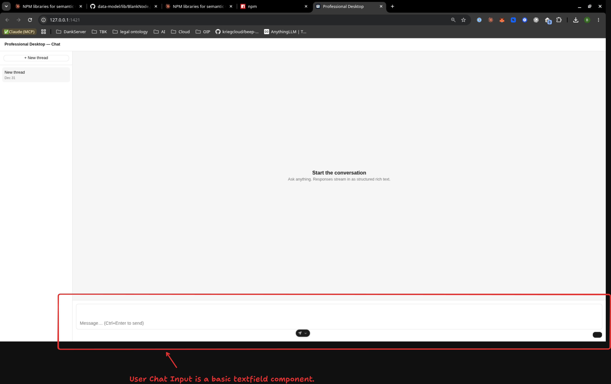
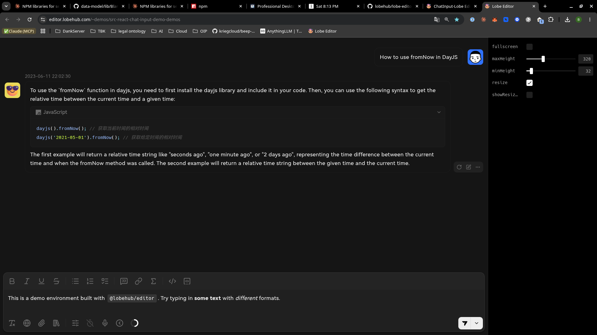
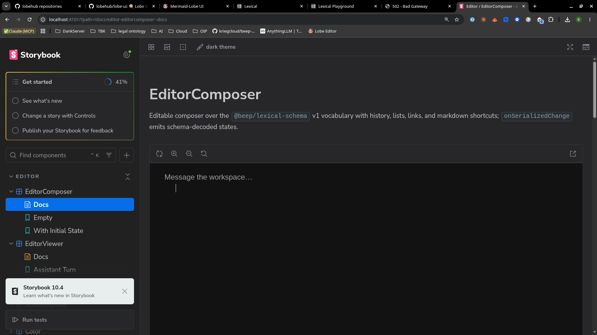

Major progress has been made in the development of [`@beep/professional-desktop`](apps/professional-desktop).

These goals and explorations where completed or are in progress and are relevant to what has been built for 
@beep/professional-desktop.

**GOALS:**
- [chat-surface-parity](./goals/chat-surface-parity/)
- [agentic-professional-runtime](./goals/agentic-professional-runtime/)
- [desktop-chat-surface](./goals/desktop-chat-surface/)
- [epistemic-claim-lifecycle-gate](./goals/epistemic-claim-lifecycle-gate/)
- [form](./goals/form/)
- [langextract-capability](./goals/langextract-capability/)
- [law-practice-office-action-extraction-rung](./goals/law-practice-office-action-extraction-rung/)
- [law-practice-office-action-spike](./goals/law-practice-office-action-spike/)
- [pandoc-ast-foundation](./goals/pandoc-ast-foundation/)
- [provenance-shared-claim-kernel](./goals/provenance-shared-claim-kernel/)
- [rich-text-foundation](./goals/rich-text-foundation/)
- [workspace-thread-domain](./goals/workspace-thread-domain/)

**EXPLORATIONS:**
- [atlas-synthesis](./explorations/atlas-synthesis)
- [agent-chat-interface](./explorations/agent-chat-interface)

**Relevant POC's and Ports:**
- [effect-lexical-chat](/home/elpresidank/YeeBois/projects/effect-lexical-chat)
- [trustgraph-ts-port](/home/elpresidank/YeeBois/dev/trustgraph/ts)

**Relevant Docs & Grounding:**
- docs/BEEPGRAPH_ARCHITECTURE.md
- docs/PROSE_TO_PROOF_ARCHITECTURE_MAP.md
- docs/PROSE_TO_PROOF_CHAT.html
- docs/PROSE_TO_PROOF_FOR_TOM.md
- docs/PROSE_TO_PROOF_GRAPH.html
- docs/PROSE_TO_PROOF_USER_STORY.md
- docs/PROSE_TO_PROOF_VISION.md
- docs/PROSE_TO_PROOF_VISUALIZATION.html
- docs/README.md
- docs/product/prose-to-proof.md
---

In order to effectively ground yourself in the current state of the project and where I'm likely to go next. I want 
you to deploy batches of parallel sub-agents to thoroughly explore the above references. Each sub-agent should 
produce a synthesized report that includes context & thorough information about every reference. These 
synthesized reports should written in markdown and placed in goals/chat-surface-parity/research/additional_items/relevant-references-reports

---

Currently the chat threads and user input in the @beep/professional-desktop are pretty basic and also have a few 
stylistic issues. Which I will enumerate bellow

## 1. Light & Dark Mode.
currently the desktop app doesn't support light & dark mode.
I want to add this. [`@beep/ui`](packages/foundation/ui-system/ui) I believe has some primitves & themes for us to use
for this feature.

## 2. Chat Input features & Bugs

The user chat input doesn't contain or support the rich @lobehub/editor style input that I envision. Currently there is no `/` command, formatting, toolbar, etc. More information bellow
[
 in Composer (at /chat/ui/Composer.tsx) in ChatApp (at /chat/ui/ChatApp.tsx) in App (at /src/App.tsx)]

My goal is essentially the user experience of the [`@lobehub/editor`](https://editor.lobehub.com/)

If you could use a sub-agent and claude in chrome and navigate to https://editor.lobehub.com/~demos/src-react-chat-input-demo-demos
and map the features of this demo taking screenshots and writing thorough descriptions of the state transitions and 
features that would help a great deal in us building out our own reusable chat input component based on the existing
[@beep/editor](packages/foundation/ui-system/editor) component. I've cloned several `lobehub` repositories [here](/home/elpresidank/YeeBois/research/chat_interface/lobehub/)
which might assist us in this endeavor.

My vision is that we create a reusable lexical editor whith configurable feature flags that will allow us to control 
what features are available based on use case. For example, while we might want a full feature set for a full 
document editor like seen in https://playground.lexical.dev/ [lexicals playground](/home/elpresidank/YeeBois/dev/text_editor_ui/lexical/packages/lexical-playground)
we might only want a subset of those features for the agent chat input component.

Looking at the [storybook](https://storybook.beep.localhost:1355/?path=/docs/editor-editorcomposer--docs) for the 
[composer component](packages/foundation/ui-system/editor/src/composer.tsx) there are very few features and also 
a bug where when clicking into the editor the cursor is bellow the `placeholder` text "Message the workspace..." 
where upon clicking the cursor is placed where the placeholder text is and the "Message the workspace..." text is 
replaced (should only be visible on an empty unfocused component state). see 