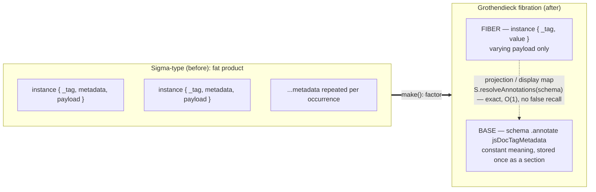
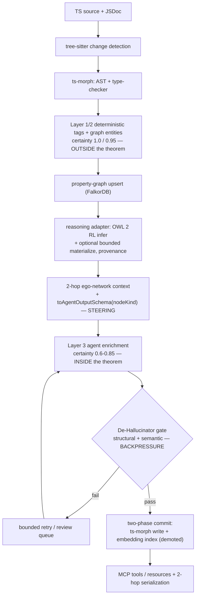

# Context as Topology: Escaping the Price of Meaning

### A fibrational, reasoner-verified substrate for steering coding agents outside the No-Escape Theorem

**White paper — draft for internal review.**

---

## Abstract

Coding agents are bottlenecked by context, and the dominant remedy — retrieve
relevant code and documentation from a semantic index — rests on an assumption a
recent result renders untenable. *The Price of Meaning* [1] proves that any
memory system retrieving by semantic proximity must, as it scales, both **forget**
(interference-driven power-law decay) and **fabricate** (associative false
recall), as geometric consequences of embedding-space representation rather than
as tunable defects. Every commercial and academic code-knowledge-graph,
agent-memory, and "context engine" we survey operates *inside* this theorem
class. This paper presents an architecture designed to operate *outside* it. The
central observation is that source code carries a kind of meaning unstructured
text does not: **topological** meaning — the exact position of a symbol within
the abstract syntax tree, the type lattice, the module graph, and the schema —
recovered by navigation rather than nearest-neighbor, and therefore immune to the
representational crowding the theorem describes. We show how to (i) **represent**
this meaning as a Grothendieck fibration in which constant documentation metadata
is a recoverable *section of a schema base* rather than embedded payload; (ii)
**amplify** it with bounded OWL 2 RL forward-chaining reasoning that derives
further deterministic facts with provenance; (iii) **deliver** it as minimal,
exact context selected by structural adjacency; (iv) **compile** it at runtime
into narrowed structured-output schemas that constrain agent generation by
construction; and (v) **verify** agent output against the deterministic substrate
in a closed loop that supplies backpressure before any write commits. We position
the work against the documentation-tooling and code-knowledge-graph literature and
find that no prior system combines fibrational representation, provenance-bearing
reasoning, topological context delivery, runtime output narrowing, and
closed-loop symbolic verification. We are explicit about the approach's boundary:
the semantic residual that genuinely requires language understanding remains
inside the theorem class and is **fenced and gated, not eliminated.** The
contribution is therefore not "deterministic agents" but a method for converting
agentic work into the largest possible exact core plus the smallest possible
verified-probabilistic residual, using a codebase's own topology as the engine
that performs the conversion.

---

## 1. Introduction

### 1.1 The documentation crisis is real but undermeasured

Software documentation is in chronic deficit. Developers spend up to **70% of
their time understanding existing code** rather than writing new features, and
industry surveys attribute large fractions of lost productivity to inadequate
documentation and technical debt: Stripe estimated **$85 billion/year** in lost
developer productivity [23]; the Atlassian/DX Developer Experience Report (2,100+
developers) found **69% of developers lose 8+ hours per week** to inefficiencies
[24]. The TypeScript ecosystem — ~115M weekly npm downloads, 85% of the top 1,000
packages shipping types — has outgrown its documentation tooling, yet, to our
knowledge, no published study systematically measures JSDoc/TSDoc coverage across
the ecosystem. The deficit is large enough to be unmeasured.

### 1.2 LLM documentation generation fails in characterizable ways

Naive "LLM-in, documentation-out" tooling inherits the well-catalogued failure
modes of code generation. *CodeHalu* (8,883 samples, 17 models) establishes four
independent hallucination categories — mapping, naming, resource, and logic [15].
Package-hallucination affects all 16 tested models at a **19.6%** average rate,
with models unable to detect their own fabrications [19]. Repository-level
generation fails specifically on **project-context conflicts**: cross-file
dependencies and structural facts the model cannot see. These map directly onto
documentation: structural claims (parameter names, types, return types) are
*approximated* when they could be *derived*, and behavioral claims are
hallucinated for lack of call-graph context.

The corrective the literature converges on is **deterministic grounding**. The
Entity Tracing Framework (ETF) raises hallucination-detection F1 from **0.28 to
0.73** by extracting entities via static analysis and verifying generated
summaries against them [13]. FORGE achieves **100% detection precision** and 77%
fix accuracy on structural claims using deterministic AST analysis [14]. The
principle is unambiguous: *structural facts should never be left to probabilistic
generation.*

### 1.3 The deeper problem: the remedy itself is theorem-bound

The standard escalation from naive generation is retrieval-augmentation: index the
repository (embeddings, a semantic knowledge graph) and retrieve relevant context
per query. This paper's point of departure is that this escalation does not escape
the failure; it relocates it. *The Price of Meaning* [1] proves that the entire
class of memory systems retrieving by semantic proximity degrades with scale — the
very regime in which a large codebase needs them. Section 2 states the result; the
rest of the paper develops an architecture that does not belong to the doomed
class.

### 1.4 Contributions

1. A **reframing** of code context representation from *geometric* (embedding
   proximity) to *topological* (exact position in AST/type/module/schema
   structure), and an argument that the latter lies outside the No-Escape Theorem
   (§4).
2. A **fibrational substrate** (§5) that stores documentation meaning as a
   recoverable section of a schema base — implemented today in a production
   TypeScript monorepo — giving a single schema three drift-free roles: agent
   context, output validation, and code-write target.
3. A **bounded reasoning layer** (§6) that amplifies the deterministic substrate
   with provenance-bearing OWL 2 RL entailment without admitting probabilistic
   fact.
4. A **runtime steering mechanism** (§§7–8): topological context selection plus
   dynamically narrowed structured-output schemas that constrain generation by
   construction.
5. A **closed verification loop** (§9) that supplies deterministic backpressure
   before commit, and a demonstration (§3, §11) that no existing system unifies
   these elements.

---

## 2. The No-Escape Theorem

We restate the result this architecture is built to evade, following [1] and its
in-repository codification.

**Setup.** A memory system has the *Semantic Proximity Property* (SPP) if it
stores semantically related items closer together and retrieves by neighborhood.
Vector databases, graph-memory systems, and embedding-based RAG all have SPP.

**Theorem (informal) [1].** Any SPP system, as it scales, exhibits both:

- **Interference-driven forgetting** — retention follows a power law (decay
  exponent b ≈ 0.44 for vector stores, 0.48 for graph memory); for any fixed item,
  retention → 0 as the store grows.
- **Associative false recall** — fabrication of never-stored items via lures (DRM
  false-alarm rate 0.58 vector, 0.21 graph), which cannot be thresholded away
  without also rejecting true items.

The mechanism is geometric: rate-distortion optimality forces the *effective*
dimensionality of the representation to ≈10–15 regardless of nominal dimension
(4096-dim embeddings included), guaranteeing that retrieval neighborhoods carry
competitor mass. False recall is the more fundamental mode: it requires no
boundary conditions and persists even in noiseless, competitor-free settings.

**Reasoning overlays do not rescue the class.** Adding an LLM that can list-check
eliminates false recall but converts graceful degradation into a **phase
transition**: near-perfect accuracy up to ~100–120 competitors, then collapse (a
7B model falls from 1.000 to 0.113 accuracy as competitor density rises) [1].

**The three escapes.** [1] identifies exactly three routes outside the theorem
class: **(E1)** exact episodic records (verbatim, no semantic proximity); **(E2)**
external symbolic verifiers (check retrieved content against non-semantic ground
truth); **(E3)** hybrid routing between a generalizing-but-forgetting system and a
rigid-but-exact one. The architecture below instantiates all three
simultaneously, exploiting the fact that code — unlike prose — comes with exact
structure for free.

**Corollary for the field.** A three-tier certainty model partitions a code
intelligence system by theorem membership: Layer 1 (AST-derived, certainty 1.0)
and Layer 2 (type-checker-derived, 0.85–0.95) are *outside* the theorem class
(exact symbolic records); Layer 3 (LLM-inferred, 0.6–0.85) is *inside*. The design
imperative follows directly: **maximize L1/L2 coverage; fence and gate L3 behind
it.**

---

## 3. Related Work and the Competitive Vacuum

The field divides into camps that each hold one or two of the necessary
properties and, structurally, cannot hold the rest.

**Commercial documentation generators** (Mintlify, JetBrains AI, GitHub Copilot)
follow "code in → LLM → text out." None uses a knowledge graph; none performs
deterministic extraction before enrichment; none validates output against the
codebase. Copilot exhibits the canonical failure — suggesting *synonym* parameter
names rather than actual ones (GitHub Discussion #13636) — precisely the mode
deterministic extraction prevents.

**Academic code-knowledge-graph systems** demonstrate graph power but target
navigation/generation, not verified documentation. *CodexGraph* couples an LLM to
a Neo4j code graph (36.02% pass@1 on EvoCodeBench) [8]; *GraphGen4Code* scales to
2B triples but predates LLMs [9]; *GraphCodeAgent* adds dual graphs (+43.81% on
DevEval) [17]; *RepoAgent* is closest to documentation — AST analysis + call-graph
context + pre-commit hooks, beating human docs in blind tests — but uses
topological sorting rather than graph reasoning, has no structured-output schema,
and **no hallucination verification** [16]. Critically, every system in this camp
that *retrieves by embedding* is SPP and therefore theorem-bound.

**Deterministic verification systems** — ETF [13], FORGE [14] — prove the
deterministic-grounding principle but are post-hoc detectors, not generative
substrates: no fibrational representation, no reasoning overlay, no runtime output
narrowing, no closed loop.

We extend the competitive matrix of the research foundations with two rows that
isolate this paper's novel axes — representation *outside* the embedding, and
provenance-bearing inference:

| Capability | Mintlify | JetBrains AI | Copilot | CodexGraph | RepoAgent | ETF | FORGE | **This work** |
|---|---|---|---|---|---|---|---|---|
| Knowledge-graph reasoning | ✗ | ✗ | ✗ | ✓ | ✗ | ✗ | ✗ | **✓** |
| Structured-output schemas | ✗ | ✗ | ✗ | ✓ | ✓ | partial | ✓ | **✓** |
| Deterministic-first extraction | ✗ | partial | ✗ | ✓ | ✓ | ✓ | ✓✓ | **✓** |
| Closed-loop hallucination verification | ✗ | ✗ | ✗ | ✗ | ✗ | ✓ | ✓ | **✓** |
| **Meaning represented outside the embedding** | ✗ | ✗ | ✗ | ✗ | ✗ | ✗ | ✗ | **✓** |
| **Provenance-bearing inference** | ✗ | ✗ | ✗ | ✗ | ✗ | ✗ | ✗ | **✓** |
| **All combined** | ✗ | ✗ | ✗ | ✗ | ✗ | ✗ | ✗ | **✓** |

***Figure 1. Competitive landscape.*** *The first four rows reproduce the
capability axes established in prior surveys; the last three isolate this work's
novel axes. No surveyed system represents meaning outside the embedding space or
carries inference provenance — the two properties §2 shows are necessary to
operate outside the No-Escape Theorem.*

The vacuum is not a market accident; §2 explains it. Systems that represent meaning
geometrically cannot escape the theorem, and systems that stop at deterministic
detection never close the generative loop. The contribution of this work is the
recognition that *the same exact structure* can serve as representation,
retriever, prompt-compiler, and verifier at once.

---

## 4. Reframe: Geometric versus Topological Meaning

The theorem is a statement about **geometry** — meaning as continuous proximity in
ℝᵈ, which crowds. Source code, however, carries meaning of a second kind:

| | **Geometric meaning** | **Topological meaning** |
|---|---|---|
| Encoded as | position in ℝᵈ (embedding) | position in graph / type lattice / schema |
| Retrieved by | nearest-neighbor (approximate) | navigation / projection (exact) |
| Question answered | "what is this *near*?" | "what is this *connected to*?" |
| Failure mode | crowding, decay, false recall | none — adjacency is discrete |
| Behavior at scale | degrades *by theorem* [1] | exact *by construction* |

This is not merely a notational preference; it is the design's load-bearing
commitment. The architecture relocates as much meaning as possible **out of the
embedding and into the topology**, demoting embeddings to a retrieval of last
resort routed beneath deterministic discovery. The slogan has independent
provenance in the host repository's architecture constitution, whose §6 is titled
*"Topology Is Compressed Context"*: readers recover intent from package paths and
role suffixes without prose. This paper radicalizes that maxim from a documentation
convenience into the central data-structural decision, and Sections 5–9 give it
mechanism.

---

## 5. The Fibrational Substrate

### 5.1 Construction

A documentation tag has **constant** metadata (its meaning: name, description,
applicability, derivability, specifications, related tags) and **varying** payload
(a particular occurrence's name/type/description). A naive model is a *dependent
sum* (Σ-type) in which every occurrence redundantly carries metadata that is a
definitional function of its discriminant.

We factor this Σ-type into an **indexed family over a singleton base** — a
**Grothendieck fibration** [25–28]. Formally, a fibration is a functor p : E → B in
which Cartesian lifts exist for every base morphism; the *fiber* E_b over base
object b collects the objects projecting to b, and a *section* s : B → E assigns to
each base object one of its fiber objects. In Homotopy Type Theory a type family
P : A → Type corresponds to a fibration with total space Σ(x:A).P(x); when P is
constant the Σ-type degenerates to a product [26]. Documentation tags are the
*non-degenerate* case: different tags carry differently-typed payloads.

In the host implementation (Effect/Schema v4) the factoring is a single operation.
`JSDocTagDefinition.make(tag, meta)`:

1. **validates** the full metadata payload (`S.decodeSync`);
2. **strips** the instance to the lean fiber `{ _tag, value }` via `mapFields`,
   where `value = TagValue.cases[tag]` is the tag-specific occurrence schema; and
3. **attaches** the validated metadata to the schema as an annotation —
   `.annotate({ jsDocTagMetadata: def })` — i.e. as a *section of the base*.

The corresponding **projection functor** ("display map") recovers meaning from any
such schema: `getJSDocTagMetadata(schema) = S.resolveAnnotations(schema)?.jsDocTagMetadata`.

***Figure 2. The fibrational factoring.*** *`make()` strips each occurrence to a
lean fiber `{ _tag, value }` and lifts the constant per-tag metadata into the
schema base as an annotation (a* section*). The display map `S.resolveAnnotations`
recovers meaning by exact O(1) lookup over a finite index — not nearest-neighbor in
ℝᵈ — which is why the construction lies outside the No-Escape Theorem (§5.2).*

| Category-theoretic concept | Effect/Schema realization |
|---|---|
| Dependent sum (Σ-type) | `JSDocTagDefinition` with all fields inline |
| Section of the base | `.annotate({ jsDocTagMetadata: def })` |
| Fiber | `TagValue.cases[_tag]` (e.g. `ParamValue`) |
| Display map / projection | `S.resolveAnnotations(schema)?.jsDocTagMetadata` |
| Indexed inductive family | `S.tag()` narrowing + `TagValue.cases` lookup |

### 5.2 Why this is an escape route, not an encoding trick

The decisive property: **the display map is exact lookup over a finite index, not
nearest-neighbor in ℝᵈ.** A 113-member tagged union is a finite, discrete index;
recovery is O(1) and lossless, with **zero false recall by construction** — there
is no competitor mass because there are no competitors, only the exact fiber the
discriminant names. The dimensionality collapse that dooms embeddings (§2) is
absent because nothing is embedded. This realizes escape route **E1** (exact
episodic record) as type-level structure. *The schema is the lookup table* — no
parallel registry, no vector index, no decay.

### 5.3 One schema, three roles, zero drift

Because meaning is a recoverable section rather than payload, the same schema
projects into three roles that cannot fall out of sync:

1. **Agent context** — annotations rendered as markdown field descriptions.
2. **Output validation** — the fiber payload *is* the decode contract.
3. **Write target** — a validated fiber maps directly to a `ts-morph`
   `JSDocStructure`.

### 5.4 Generalization beyond documentation

The same construction applies to the architecture's own topology. A sibling model
(`TSCategory`) fibrates code-element classification, attaching to each category an
exact section recording its `effectAnalog`, `architecturalLayers`, `purity`,
`dependencyProfile`, and `astSignals`. The step from "ontology of JSDoc tags" to
"ontology of the architecture" is the same construction at a higher altitude: the
repository's own doctrine becomes a queryable, machine-checkable section of the
base.

---

## 6. Ontological Amplification

A fibration stores exact meaning; a reasoner grows it **without leaving the exact
class.** The property graph is projected into RDF/OWL and subjected to bounded
**OWL 2 RL** forward chaining.

### 6.1 Why OWL 2 RL

OWL 2 RL is designed for rule-based forward-chaining implementation and is
**PTime-complete in data complexity** for consistency, classification, and
conjunctive query answering [2]; it translates to Datalog, inheriting termination
and optimization guarantees. The foundational complexity result is ter Horst's:
RDFS entailment is decidable and **in P for blank-node-free graphs**, with
OWL-vocabulary extensions (functional properties, `sameAs`, `inverseOf`) remaining
in P [3]. The core entailment rules carry direct code semantics:

| Rule | Code application |
|---|---|
| rdfs9 / rdfs11 | type & subclass propagation through inheritance hierarchies |
| rdfs7 | `imports ⊑ dependsOn`, `calls ⊑ dependsOn` — abstract dependency |
| rdfs2 / rdfs3 | infer `Callable`/`Interface` typing from usage |
| `owl:sameAs` | re-export / barrel / alias identity |
| `owl:inverseOf` | `calls/calledBy`, `imports/importedBy` bidirectional edges |
| `owl:TransitiveProperty` | containment and dependency closures |

A documentation-specific rule set follows the same pattern, e.g. **`@throws`
propagation**: if F calls G, G throws E, and F does not catch E, infer that F may
throw E (confidence 0.85, degrading with chain length); **`@deprecated`
cascading**; **`@inheritDoc` resolution**.

### 6.2 Bounding, provenance, and precedence

Inference is guard-railed (`maxDepth ≤ 3`, `maxInferences ≤ 1000`), evaluated
incrementally (seminaive; the B/F algorithm for deletions, orders of magnitude
faster than DRed and realized in RDFox at 6.1M triples/s [3,20]), and canonicalized
for `owl:sameAs` via union-find to avoid the O(k²) blow-up on cliques of equal
resources — **7.8× fewer materialized triples, 31.1× faster** [11]. Every inferred
fact carries PROV-O provenance (`wasGeneratedBy` rule, `wasDerivedFrom`
antecedents) and a confidence derived as `min(antecedents) × rule_factor`;
JTMS-style justification supports retraction [21]. The binding constraint from §2
holds operationally: **inference never overwrites Tier-1; precedence is L1 > L2 >
L3/inferred.** The reasoner is thus a deterministic amplifier and an external
symbolic verifier (escape route **E2**) — never a source of truth that can drift.

---

## 7. Projective Context Delivery ("Context as Topology")

Because meaning is navigable structure, context is **projected, not dumped.** For a
target symbol, the relevant context is its **2-hop ego network** — callers,
callees, types, imports, container — narrowed further to the tags the node kind
admits (`applicableTo` as dispatch table). Retrieval is by **structural adjacency**
(exact) rather than **semantic proximity** (theorem-bound): the system asks "what
is this attached to?", never "what embeds near this?". The prompt is a minimal
exact projection of the graph.

This is the information-compaction primitive the architecture rests on, and it has
an executable first proof in the host repository: a generated public export catalog
(`repo-exports.catalog.jsonc/.md`) lets an agent discover an existing symbol, its
legal import specifier, and its source location *before* inventing a duplicate —
deterministic facts to cite rather than a longer prompt. Embedding retrieval (e.g.
Voyage Code 3 [12]) is retained but **demoted** to a last-resort fuzzy index routed
beneath deterministic discovery, consistent with the constraint that semantic
retrieval is a suggestion engine, not a fact store.

---

## 8. Runtime Output Narrowing (Steering by Construction)

The stored exactness is then spent on the agent. A function
`toAgentOutputSchema(nodeKind)` compiles, **at request time**, the precise JSON
Schema the target node requires:

1. For each tag schema, recover `applicableTo` via the display map; keep only tags
   applicable to `nodeKind` (the **schema-size budget**: never emit the full
   113-tag surface).
2. Project each surviving fiber payload into a property of an output struct.
3. Render each property's `description` from the tag's base annotations.

Two design choices make this *steering* rather than mere validation:

- **Product-of-optionals, not array-of-coproducts.** Because the applicable index
  set is known at construction time, output is shaped as `{ param?: P[], returns?:
  R, throws?: T[], … }` — *the key is the discriminant.* This sidesteps the
  documented unreliability of discriminated unions under provider structured-output
  constraints (OpenAI's all-fields-required and root-`anyOf` limits; Anthropic's
  grammar-size and 24-optional-parameter ceilings). Structurally invalid output is
  made *unrepresentable*.
- **Deterministic anchoring.** Layer-1 facts (parameter names, types, optionality)
  are pre-filled and passed as context; the agent authors only the irreducibly
  semantic field (intent, behavior, example) and echoes anchors for matching. It
  cannot hallucinate structure because structure is not a generation target — the
  empirical lesson of FORGE [14] and ETF [13], enforced *a priori* rather than
  detected post hoc.

The agent is therefore constrained three ways at once: in what it *can* emit (the
narrowed shape), what it *should* emit (annotation-projected descriptions), and
what it *must not* re-derive (pre-filled anchors). An open-ended generative task
becomes a bounded, anchored fill-in-the-blanks.

---

## 9. Closed-Loop Verification and Backpressure

A bounded problem can be checked, and unchecked output never commits.

1. **Structural gate.** Decode output against the fiber schema; malformed output is
   rejected immediately, at no model cost.
2. **Semantic gate (De-Hallucinator).** Decompose claims into atomic,
   verifiability-tiered statements, adapting the factuality-evaluation lineage —
   FActScore [5], SAFE [6], VeriScore [7] (verifiable-only), Claimify [18] (99%
   entailment) — to code. Each claim is routed: **AST-verifiable** (checked against
   the graph at certainty 1.0), **semantically verifiable** (checked against
   call/throws/dataflow edges and the §6 reasoner), or **unverifiable** (human
   review).
3. **Bounded fixpoint.** Failures re-enter a retry loop with progressively
   tightened constraints (full context → + error message → + in-scope symbol list →
   degraded fallback), then drop to a provenance-tagged review queue ordered by
   confidence. Batched writes use **two-phase commit** (compute against a frozen
   snapshot; apply with conflict detection) to prevent races.

This is the **backpressure** mechanism: a hook that gates agent output against
deterministic ground truth before commit. It is structurally identical to the host
repository's governance enforcement contract (command gates + adversarial auditors
+ manifest/handoff evidence; no work claims completion without a Verification
Report) and its agent-effectiveness trust gate. Backpressure is not a bolted-on
feature; it is the §6 verifier turned to face the agent's output.

---

## 10. System Architecture

The reference pipeline (CI / pre-commit) composes the layers above. Deterministic
extraction and reasoning (outside the theorem) carry representation; the Layer-3
agent (inside the theorem) is fenced between topological context delivery + runtime
output narrowing (steering) and the De-Hallucinator gate (backpressure). Only
verified output commits.

***Figure 3. The reference pipeline.*** *The deterministic layers (L1/L2 +
reasoner) sit outside the theorem and do the representational work; the L3 agent is
the only theorem-bound component, fenced upstream by steering (context + narrowed
schema) and downstream by backpressure (the De-Hallucinator gate and its bounded
retry). The embedding index is present but demoted.*

Component choices, with rationale: **ts-morph + tree-sitter** for full-type and
incremental extraction; **FalkorDB** (GraphBLAS sparse-matrix execution) as the
property-graph store, with reasoning implemented in the application layer because
FalkorDB has no native RDFS/OWL engine; **Voyage Code 3** (32K context, Matryoshka
dimensions, +13.80% over OpenAI-v3-large on code retrieval [12]) for the demoted
embedding index; **scoped ts-morph projects** driven by TypeScript project
references and Turborepo `--affected` for incremental, file-level recompute; and an
**MCP server** (self-describing JSON-RPC) exposing the tag database as a resource,
validation/write as tools, and annotation-derived prompt templates. The host
language is Effect-TS: `Context.Service` for service identity, `Layer` for
dependency injection, `Schema.Class`/`TaggedClass` for the fibration. cAST-style AST
chunking improves retrieval (+5.5 points RepoEval [25]) where embeddings are used.

---

## 11. The Through-Line: One Architecture, Many Facets

The approach is realized across a constellation of initiatives that are facets of a
single design rather than independent projects:

| Facet | Role |
|---|---|
| deterministic code graph | the L1/L2 substrate (AST + type graph) |
| JSDoc fibration | §5 representation + the enrichment loop (flagship proof case) |
| context topology | §7 projection as compaction |
| trust/doc ontology | §6 reasoning + provenance |
| agent governance control plane | §9 backpressure as enforcement |
| agent-effectiveness loop | measurement & self-healing (observability/evals) |

We define an **agent-native codebase** as one whose deterministic structure is rich
enough to (a) store meaning topologically, (b) amplify it by reasoning, (c) project
it as minimal context, (d) constrain generation by construction, and (e) verify
generation by symbol-checking — closing a self-healing loop whose every edge is
either exact or provenance-tagged. The fibration is the keystone: it is what lets a
single schema serve all five roles without drift.

---

## 12. Limitations and Threats to Validity

A credible account must mark its own boundary.

- **The semantic residual remains theorem-bound.** Behavioral and intent
  documentation — the actual purpose — requires Layer 3, which is inside the theorem
  class. The architecture *fences and gates* it; it does not eliminate it. The
  defensible claim is "*more* deterministic," obtained by minimizing and verifying
  the semantic surface, not by abolishing it.
- **Determinism is a property of the harness, not the model.** We do not make the
  model deterministic; we make the **envelope** deterministic — context selection,
  output shape, pre-filled anchors, verification gate — and permit creativity only
  in the small, checked residual.
- **The reasoner knows only its rules.** OWL 2 RL derives type propagation,
  identity, and dependency — not understanding; its value is exact amplification
  plus provenance.
- **Embeddings are demoted, not deleted.** Vector retrieval remains SPP and is used
  only as a last-resort suggestion beneath deterministic discovery.
- **Implementation status.** The fibrational substrate (§5) is implemented and in
  use; the reasoning layer (§6), the runtime narrowing at full generality (§8), and
  the closed loop (§9) are specified and partially greenfield. The quantitative
  claims in this paper are *cited from prior work* or *projected*, not measured on
  this system; an empirical evaluation (documentation coverage/freshness,
  hallucination rate, agent token cost, reasoning latency/precision) is future work.
- **Engineering risk.** A custom forward-chaining engine over a non-reasoning graph
  store, and provider-specific structured-output limits, are the principal
  implementation hazards; `toAgentOutputSchema`'s union-to-product narrowing is the
  critical mitigation for the latter.
- **Architectural placement.** The steering loop must live as tooling/governance
  operating *on* agent output, never as a runtime "God Layer" owning cross-slice
  policy — a constraint the host architecture independently enforces and which
  aligns with the candidates-only treatment of all LLM output.

---

## 13. Conclusion

Semantic memory systems forget and fabricate as a matter of geometry, not
engineering. A codebase, uniquely, offers an exit: it carries exact topological
meaning that can be represented as a fibration, amplified by bounded reasoning,
projected as minimal context, compiled into constraining output schemas, and
verified in a closed loop. The strongest honest statement of the result is not
"deterministic agents" but a method for converting agentic work into the largest
possible exact core plus the smallest possible verified-probabilistic residual —
with the codebase's own topology as the engine that performs the conversion. Where
prior systems either generate without verification, or build semantic indices the
theorem condemns, or detect errors without closing the loop, this architecture
relocates meaning out of the embedding entirely and spends the recovered exactness
twice: to deliver context, and to police generation.

---

## References

[1] Barman, S. R., Starenky, A., Bodnar, S., Narasimhan, N., & Gopinath, A. *The
Price of Meaning: Why Every Semantic Memory System Forgets.* arXiv:2603.27116
(2026), Sentra & MIT.
[2] Motik, B., et al. *OWL 2 Web Ontology Language Profiles (2nd ed.).* W3C
Recommendation (2012).
[3] ter Horst, H. J. *Completeness, Decidability and Complexity of Entailment for
RDF Schema and a Semantic Extension Involving the OWL Vocabulary.* J. Web Semantics
3(2–3): 79–115 (2005).
[4] Gupta, A., Mumick, I. S., & Subrahmanian, V. S. *Maintaining Views Incrementally
(DRed).* SIGMOD (1993).
[5] Min, S., et al. *FActScore.* EMNLP (2023).
[6] Wei, J., et al. *Long-form Factuality in LLMs (SAFE).* NeurIPS (2024).
[7] Song, Y., Kim, H., & Iyyer, M. *VeriScore.* Findings of EMNLP (2024).
[8] Liu, X., et al. *CodexGraph.* NAACL (2025).
[9] Abdelaziz, I., et al. *A Toolkit for Generating Code Knowledge Graphs
(GraphGen4Code).* K-CAP (2021).
[10] Atzeni, M., & Atzori, M. *CodeOntology: RDF-ization of Source Code.* ISWC
(2017).
[11] Motik, B., et al. *Handling owl:sameAs via Rewriting.* AAAI (2015).
[12] Voyage AI. *voyage-code-3.* (Dec 2024).
[13] Maharaj, K., et al. *ETF: An Entity Tracing Framework for Hallucination
Detection in Code Summaries.* ACL (2025).
[14] Khati, P., et al. *Detecting and Correcting Hallucinations in LLM-Generated
Code via Deterministic AST Analysis (FORGE).* arXiv:2601.19106 (2026).
[15] Tian, Y., et al. *CodeHalu.* AAAI (2025).
[16] Luo, Q., et al. *RepoAgent.* EMNLP (2024).
[17] Li, B., et al. *GraphCodeAgent.* arXiv:2504.10046 (2025).
[18] Metropolitansky, D., & Larson, J. *Towards Effective Extraction and Evaluation
of Factual Claims (Claimify).* arXiv:2502.10855 (2025).
[19] Spracklen, J., et al. *Package Hallucinations in Coding Models.* USENIX
Security (2025).
[20] Nenov, Y., et al. *RDFox: A Highly-Scalable RDF Store.* ISWC (2015); Motik, B.,
et al. *Incremental Update of Datalog Materialisation (B/F).* AAAI (2015).
[21] Doyle, J. *A Truth Maintenance System.* Artificial Intelligence 12 (1979).
[22] Ruy, F. B., et al. *SEON: A Software Engineering Ontology Network.* EKAW
(2016).
[23] Stripe. *The Developer Coefficient.* (2018).
[24] Atlassian / DX. *Developer Experience Report.* (2024).
[25] Zhang, Y., et al. *Enhancing Code RAG with Structural Chunking via AST (cAST).*
arXiv (2025).
[26] The Univalent Foundations Program. *Homotopy Type Theory*, §2.7 (2013).
[27] Jacobs, B. *Categorical Logic and Type Theory.* (1998).
[28] Capriotti, P. *Families and Fibrations* (2013); Milewski, B. *Fibrations,
Cleavages, and Lenses* (2019).
