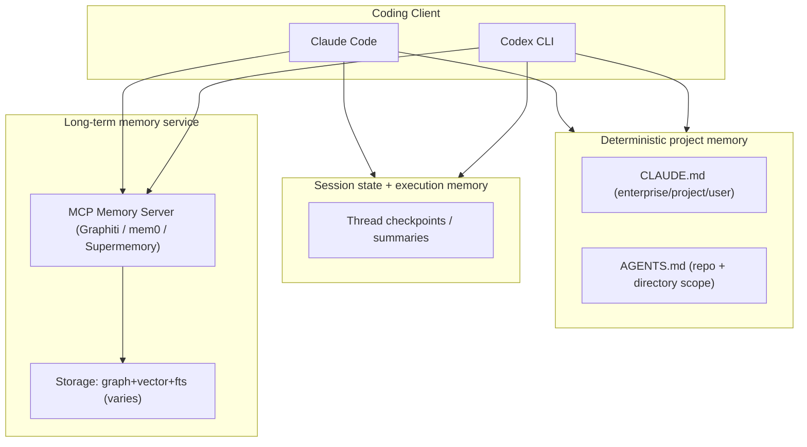
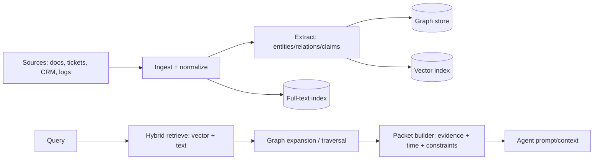
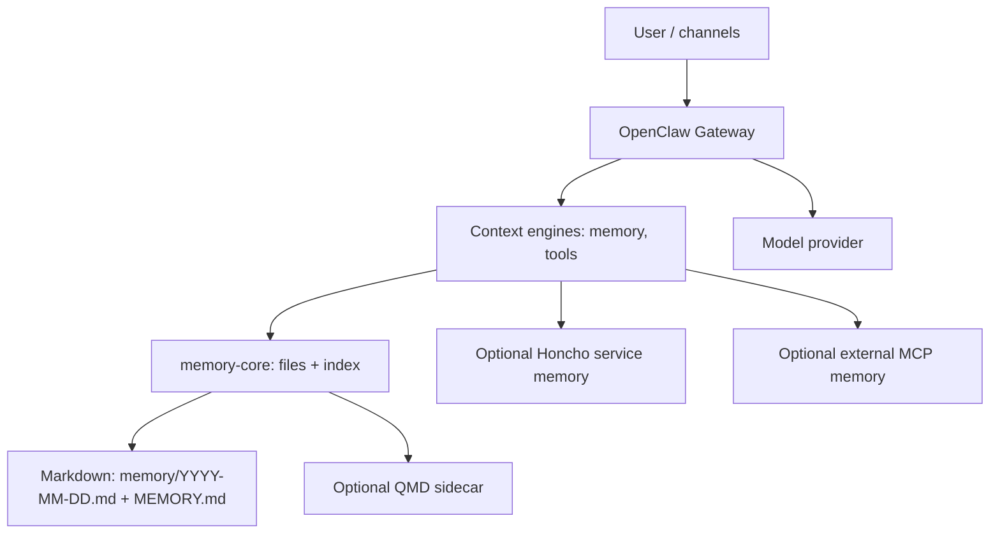

# Agent Memory, Context Graph, and Knowledge Graph Platforms

## Executive summary

This research compares “agent memory” systems (session + long-term), “context graphs” (graph-shaped, retrieval-oriented context layers), and knowledge graph repositories/services/platforms, focusing on three concrete integration targets: Claude Code / Codex memory, domain-specific agent knowledge bases, and OpenClaw. It synthesizes: (a) direct inspection of the connected `kriegcloud/beep-effect` repository (via the GitHub connector), (b) the user-provided sources (Zep llms.txt, mem0 llms.txt, TrustGraph repo, Supermemory llms.txt), and (c) primary/official documentation and original papers.

Across the landscape, the strongest “best-in-class” pattern is **hybrid retrieval + structured memory + operational guardrails**: store durable memory in a system that supports **(1) semantic + lexical retrieval**, **(2) explicit entities/relations**, **(3) provenance and time**, **(4) multi-tenant isolation**, and **(5) a control plane** (versioning, idempotent ingest/update, audit/observability). Zep and Graphiti (temporal graphs), TrustGraph (context cores + platform), and the OpenClaw memory stack (Markdown source-of-truth, hybrid search, promotion/dreaming) collectively illustrate that direction. citeturn19view0turn10search8turn31search1turn31search0

**Top picks (overall shortlist, 8–12) and when to use them:**

- **Graphiti + Graphiti MCP Server (local temporal graph memory)**: strongest open-source “graph memory via MCP” option; temporal-aware, multi-tenant group isolation, hybrid search, and graph-native inspection/debugging. Best for Claude/Codex memory when you want “inspectable, relationship-aware” memory, and for a domain context graph when the domain is time-sensitive. citeturn2search0turn2search8turn0search0turn0search1  
- **Zep (managed context engineering platform, built on Graphiti)**: best “enterprise-ready” managed path when you want a full context layer (memory + GraphRAG + context assembly), plus published latency/benchmark claims and multi-language SDKs. Best for domain KBs and agent fleets; also usable behind Claude/Codex via tooling, but is more “platform” than “simple memory.” citeturn27search1turn27search6turn19view0turn17search7  
- **TrustGraph (open-source context backend + Context Cores)**: best “platformized” open-source context backend—ships a full distributed stack (APIs, storage, observability), supports “portable context cores,” and has a clearly defined API gateway + REST/WebSocket/Python model. Best for building and versioning *domain* KBs and deploying them consistently. citeturn9view0turn9view1turn10search0turn10search4  
- **mem0 (open-source + hosted memory layer, with MCP server)**: best “developer-friendly” memory layer with broad vector DB support and published benchmark claims (LOCOMO). Strong for Claude/Codex memory when you want simple APIs and fast iteration; can scale to multi-app memory via MCP. Its “graph memory” variant exists, but is less transparently inspectable than graph-native engines. citeturn8view0turn19view1turn29search0turn29search3turn29search2  
- **Supermemory (API + MCP Server)**: best “universal memory across many clients” via MCP with an explicit architecture on Cloudflare Workers + Durable Objects; strong choice for quick Claude/Codex memory when OAuth-based cross-client sharing matters more than deep graph semantics. citeturn28search1turn28search6turn28search0turn28search3  
- **entity["company","Letta","agent memory platform"] (MemGPT-style memory hierarchy)**: best “agent-native memory management” (core vs recall vs archival) for building stateful agents; strongest when you want agents to *self-edit* memory blocks + use tools for recall/archival search. Great for domain agents; less “drop-in” as a shared memory bus across many external clients compared to MCP-first products. citeturn16search0turn16search3turn22view0  
- **entity["company","LangChain","langchain ai"] LangGraph persistence + stores (framework)**: best “workflow-native persistence and replay” for agents you own/control (threads, checkpoints, time-travel debugging). Use it as the *session memory + execution state* layer, paired with a long-term memory/graph store for durable knowledge. citeturn14search0turn14search5turn14search3  
- **entity["company","LlamaIndex","llamaindex ai"] knowledge graph & graph-store integrations (framework)**: best “framework glue” for building domain KBs that can sit on multiple graph backends (Neo4j, NebulaGraph, etc.) and support knowledge-graph indexing; often paired with Neo4j/GPU inference stacks. citeturn15search0turn15search3turn15search2  
- **entity["organization","Microsoft Research","research org"] GraphRAG (research system + OSS pipeline)**: best “GraphRAG for static corpora” with strong conceptual grounding and published materials; excellent for domain KBs that are mostly documents/policies. Not a temporal memory system by default; ingestion can be costly. citeturn23search2turn23search4turn23search5  
- **entity["company","Neo4j","graph database"] GraphRAG tooling + vector indexing (graph DB platform)**: best “production graph database backbone” for GraphRAG and structured retrieval; strong ecosystem integrations, including GraphRAG libraries and LlamaIndex integrations. citeturn14search4turn23search1turn15search2  
- **OpenClaw’s built-in memory stack + Honcho plugin**: best “agent runtime memory” *inside* OpenClaw—Markdown source-of-truth with daily + long-term files, hybrid memory search, and automated consolidation (“dreaming”), plus optional cross-session service memory via Honcho. Use it when OpenClaw is the deployment target and you want minimal glue. citeturn31search1turn31search3turn31search0turn31search2turn31search4  

Notes on the user-provided links:  
- Zep llms.txt is a high-level index pointing to versioned docs; the versioned llms files were not fetchable from this environment (“cache miss”), but the official docs + GitHub + paper cover the substantive details. citeturn6view0turn27search0turn27search1turn19view0  
- Supermemory llms.txt was not fetchable from this environment (“cache miss”), so this report relies on Supermemory’s own documentation pages and GitHub org repos for architecture/API details. citeturn5view0turn28search1turn28search6turn28search3  
- TrustGraph and mem0 llms.txt were accessible and are incorporated, but key claims are cross-validated against their primary docs and repositories. citeturn0view3turn9view1turn8view0turn19view1  

## What the kriegcloud/beep-effect repo implies about your requirements

Direct inspection of `kriegcloud/beep-effect` shows it is not just an application repo—it acts as a **proving ground** for a broader “expert-memory” worldview: deterministic extraction first, then a semantic overlay, with explicit emphasis on **claims/evidence, provenance, temporal lifecycle, bounded retrieval packets, and an operational control plane** (run identity, idempotency, budgets, audit). This aligns tightly with the user request to move beyond “vector memory” toward a “context graph” and a practical KG-backed agent memory.

Two especially relevant implications for the three use cases:

- For **Claude Code / Codex memory**, the repo contains patterns that emphasize *tooling surfaces and local-first flows*, consistent with MCP-based memory servers and file-based memory overlays used by modern coding agents (AGENTS/CLAUDE instructions + tool-driven retrieval). This matches how Codex and Claude Code are designed to be guided (via AGENTS.md / CLAUDE.md) and extended (via MCP / memory tool). citeturn13search2turn11search0turn13search1  
- For **OpenClaw**, the repo includes OpenClaw’s memory design and several advanced memory concepts: Markdown as source-of-truth, hybrid retrieval, deep configuration (providers, hybrid weights, temporal decay), plus consolidation/promotion (dreaming) and optional service-backed “user modeling” memory. Those features are now documented directly in OpenClaw’s official docs as well. citeturn31search1turn31search4turn31search0turn31search2  

The repo’s “expert-memory” framing also strongly suggests you should evaluate candidates not only on retrieval quality, but on **trust and operability**: provenance, conflict handling, temporal truth, and the ability to produce bounded “retrieval packets” that are auditable and safe to inject into an agent context.

## Landscape taxonomy and design axes

Modern agent memory systems cluster into five overlapping layers. The key to choosing “best-in-class” is to decide what you need the system to *guarantee*.

**File-based “project memory” overlays (coding agents):**
- Claude Code loads hierarchical `CLAUDE.md` files (enterprise/project/user scope, imports, recursion rules). This is deterministic, cheap, and easy to version-control, but it’s not semantic recall by itself. citeturn11search0  
- Codex uses `AGENTS.md` as a primary “project docs / memory” mechanism and can merge layered instructions; OpenAI also explicitly frames AGENTS.md as a way to guide Codex agents. citeturn13search2turn13search0  

**Tool-based memory (LLM calls file/DB operations):**
- Claude’s Memory Tool (API beta) is explicitly client-side: the developer implements the persistence backend while Claude can create/read/update/delete “memories” via tools. This makes architecture flexible, but pushes security and correctness onto your implementation. citeturn11search1  

**Vector memory services (semantic recall, often hybrid lexical+vector):**
- These optimize for speed and simplicity: extract “memories,” store embeddings, do semantic search, and inject results. They tend to struggle with multi-hop reasoning, contradictions, and temporal truth unless layered with additional structure. (mem0 and Supermemory are strong examples in this category, with MCP servers for client compatibility.) citeturn19view1turn28search0turn29search3  

**Context graphs / knowledge graphs (structured, relationship-aware recall):**
- Graph-first memory systems store entities + relations + episodes, often with temporal metadata, and retrieve subgraphs or graph-derived summaries instead of isolated snippets. Graphiti and Zep (Graphiti-powered) represent this “temporal graph memory” direction, explicitly contrasting with static-document GraphRAG. citeturn2search0turn17search7turn19view0  

**GraphRAG pipelines for domain KBs (primarily document corpora):**
- Microsoft’s GraphRAG is explicitly a pipeline for extracting structured data from unstructured text and using it to improve retrieval and summarization; it is not positioned as a continuously updated temporal memory system, and the repo warns indexing can be expensive. citeturn23search2turn23search5  

Across these layers, the main **design axes** you should use for selection and ranking are:

- **Data model:** vector-only vs graph-only vs hybrid (graph + vectors + full-text).  
- **Time:** does the system support “point-in-time truth” (validity intervals, updates, superseded facts) vs “latest summary wins”? Zep/Graphiti emphasize temporal handling; LongMemEval shows temporal reasoning is a core long-term memory ability to evaluate. citeturn19view0turn20view0  
- **Evidence and provenance:** can the system attach sources/spans and support “citation validation” / inspectable retrieval? This becomes central in high-stakes or conflict-heavy domains. citeturn23search1turn9view0  
- **Integration portability:** MCP vs SDK vs database drivers; MCP is a major portability layer across coding clients. citeturn13search1turn0search0turn28search1turn29search3  
- **Operational control plane:** versioning, promotion workflows, idempotent ingest, audit logs, SLOs, and risk controls. TrustGraph and OpenClaw both explicitly emphasize operable workflows (cores, flows, dreaming/promotion). citeturn10search0turn10search8turn31search0  

## Ranked shortlist with tradeoffs and fit analysis

The ranking below is *overall* for your three use cases together (not “best at only one thing”). A solution can rank lower overall but still be the best choice for a specific use case—those cases are called out.

### Ranked top candidates

**Top rank: Graphiti + Graphiti MCP Server (open-source temporal graph memory, local)**  
- **Short description:** Temporal knowledge graph framework + MCP server for persistent agent memory, designed for dynamic environments and multi-tenant agent deployments. citeturn2search0turn0search0turn2search8  
- **Architecture:** Episodes ingested → entity/relationship extraction → stored in graph DB (default FalkorDB) → query via hybrid+semantic+graph search; MCP tools include adding episodes and searching nodes/facts. citeturn0search0turn0search1  
- **Data model:** Hybrid graph + semantic search; explicit nodes/edges/episodes + temporal relationships. citeturn0search0turn2search0  
- **Supported LLMs/embeddings:** MCP server docs list multi-provider LLM support (OpenAI, Anthropic, Gemini, Groq, Azure OpenAI) and multiple embedding providers (OpenAI, Voyage, Sentence Transformers, Gemini). citeturn0search0  
  - Uses upstream LLM APIs; your privacy boundary depends on whether you run local models or remote APIs.  
- **APIs/SDKs:** MCP (HTTP endpoint at `/mcp/` by default); direct DB access possible by querying FalkorDB. citeturn0search0  
- **Scalability/latency:** FalkorDB + Graphiti MCP positioning emphasizes low-latency retrieval and group_id-based isolation; Zep documentation claims Graphiti is designed for real-time dynamic updates and high scalability. citeturn0search1turn2search0  
- **Cost model:** OSS + self-host. Main costs are storage + compute for ingest/extraction (LLM calls) and embeddings. citeturn0search0  
- **Security/privacy:** Local Docker deployment supports “local and private” posture; multi-tenancy via group_id helps reduce cross-project leakage risk. citeturn0search1turn2search10  
- **Maturity/community:** Graphiti repo has strong adoption and active ecosystem signals; MCP server is highlighted prominently. citeturn2search8turn0search0  
- **Fit**
  - (1) Claude Code / Codex memory: **Excellent** when you want shared graph memory across MCP clients. citeturn0search0turn13search1  
  - (2) Domain KBs: **Excellent** for dynamic domains; good for provenance/time-first KBs. citeturn2search0turn19view0  
  - (3) OpenClaw: **Good** if used as an external memory backend or via a plugin; OpenClaw already supports rich memory plugins and could integrate via a context engine/tool bridge. citeturn31search1turn31search4  
- **Main tradeoff:** More complex than “vector memory”; requires careful schema/entity type design and operational policies to prevent graph bloat.

**Second rank: Zep (managed context engineering platform, Graphiti-powered)**  
- **Short description:** “End-to-end context engineering” platform (memory + GraphRAG + context assembly). Publishes sub-200ms latency positioning and provides SDKs; research paper describes a temporal KG architecture for agent memory. citeturn27search1turn19view0turn17search7  
- **Architecture:** Ingest chat/events/business data → temporal KG maintenance via Graphiti → retrieve & assemble pre-formatted context blocks. citeturn27search1turn19view0turn2search2  
- **Data model:** Temporal knowledge graph (entities/edges/episodes) + hybrid retrieval; paper emphasizes temporal validity, outperforming MemGPT on DMR and improving on LongMemEval. citeturn19view0turn20view0  
- **Supported LLMs/embeddings:** Platform is LLM-agnostic at the “context layer,” but semantics depend on embedding/LLM choices; Graphiti MCP server docs enumerate supported providers. citeturn0search0turn27search1  
- **APIs/SDKs:** SDKs in Python/TypeScript/Go are explicitly documented. citeturn27search6turn27search1  
- **Scalability/latency:** Zep positions <200ms latency for retrieval and enterprise-grade scale; paper emphasizes latency and scalability as design goals. citeturn27search1turn19view0  
- **Cost model:** Managed service (plus OSS components). Cost depends on plan and data volume; strongest when you want a managed context layer rather than maintaining a full graph pipeline. citeturn27search1  
- **Security/privacy:** Zep repo claims SOC2 Type 2 / HIPAA compliance for the managed service; you still must examine deployment and data-handling requirements for your org. citeturn27search1  
- **Maturity/community:** Strong research + community footprint; Graphiti is open-source and actively used. citeturn19view0turn2search8  
- **Fit**
  - (1) Claude Code / Codex memory: **Very good**, especially as “org-grade shared memory,” but likely more overhead than needed for small standalone coding memory.  
  - (2) Domain KBs: **Excellent** if you want temporal + relationship-aware context assembly as a managed layer.  
  - (3) OpenClaw: **Good**, but integration is “platform integration” rather than “native plugin,” so implementation work is expected.

**Third rank: TrustGraph (open-source context backend with Context Cores)**  
- **Short description:** Open-source “agent intelligence platform” that combines knowledge graphs + embeddings and introduces “Context Cores” (portable, versioned context bundles). citeturn10search2turn9view0turn10search8  
- **Architecture:** Containerized platform with API gateway and flows; supports ingest, extraction, storage, GraphRAG, and context core packaging; explicitly API-centric with REST and WebSocket plus Python API. citeturn10search9turn10search0turn10search4  
- **Data model:** Hybrid “context graph + embeddings + provenance/policies” bundled into context cores; underlying “vector embedding storage” uses Qdrant and “multi-model storage” uses Cassandra in the default stack. citeturn9view0turn9view1  
- **Supported LLMs/embeddings:** TrustGraph lists broad API support (Anthropic/OpenAI/etc.) and supports multiple inference backends (vLLM, Ollama, TGI, etc.) as part of its stack philosophy. citeturn9view0turn9view1  
- **APIs/SDKs:** REST + WebSocket + Python client; exposes an OpenAPI spec download and documents service boundaries (global vs flow-hosted). citeturn10search0turn10search4turn10search7  
- **Scalability/latency:** Designed as a multi-service distribution (queues, storage, telemetry); suited to larger deployments more than local-only tooling. citeturn9view1turn10search9  
- **Cost model:** OSS + self-host. Costs are infra (containers) + LLM/embedding calls.  
- **Security/privacy:** Supports an API gateway token model (bearer auth) and emphasizes “no keys required” beyond LLM/OCR and the platform gateway key; still requires a full threat model and hardening when deployed. citeturn9view1turn10search0  
- **Maturity/community:** Public docs and significant scope; best for teams wanting a full context platform rather than a library. citeturn0search2turn10search1  
- **Fit**
  - (1) Claude Code / Codex memory: **Medium** (possible via MCP connections, but heavier than needed). citeturn9view0turn13search1  
  - (2) Domain KBs: **Excellent**—context cores map directly to “per-domain KBs with versioning.” citeturn10search8turn9view0  
  - (3) OpenClaw: **Medium**—integration is feasible via a plugin/bridge, but OpenClaw already has a strong memory system.

**Fourth rank: mem0 (memory layer; includes MCP server and broad vector DB support)**  
- **Short description:** Universal memory layer with OSS and hosted options; paper reports LOCOMO gains and large reductions in token cost/latency; includes MCP server for use across MCP clients. citeturn19view1turn29search3turn8view0  
- **Architecture:** Extract/consolidate memories → store in vector DBs (user-supplied or defaults) → retrieve by semantic/hybrid search; paper describes an enhanced graph-based variant for relational structure. citeturn19view1turn29search0  
- **Data model:** Primarily vector DB backed; “graph memory” exists as a variant, but the primary integration surface is memory API + vector DB configuration. citeturn8view0turn19view1turn29search0  
- **Supported LLMs/embeddings:** Many vector DB backends supported; MCP server uses the Mem0 Memory API; typical embeddings depend on your configured provider/model. citeturn29search3turn29search0  
- **APIs/SDKs:** Python/JS SDKs; MCP server wraps the API and exposes add/search/update/delete tools. citeturn29search3turn1search1  
- **Scalability/latency:** Paper claims significant p95 latency reduction vs full-context. citeturn19view1  
- **Cost model:** Pricing page provides tiers (including “Graph Memory” on Pro); OSS can be self-hosted. citeturn29search2turn1search1  
- **Security/privacy:** Security page claims SOC 2 Type I and HIPAA-ready positioning plus BYOK; verify compliance scope for your environment. citeturn29search1  
- **Maturity/community:** Very large OSS adoption signals (stars, updates) and published paper. citeturn1search1turn19view1  
- **Fit**
  - (1) Claude Code / Codex memory: **Excellent** if you want a straightforward “memory API + MCP server.” citeturn29search3turn13search1  
  - (2) Domain KBs: **Good** for “memory as facts + retrieval,” but less native for multi-hop graph reasoning than graph-first engines.  
  - (3) OpenClaw: **Good** as an external memory source via MCP or as a service used by a custom plugin.

**Fifth rank: Supermemory (API + MCP server; Cloudflare Durable Objects architecture)**  
- **Short description:** “Universal memory-powered MCP” offering persistent memory across multiple AI clients; provides an API for search and memory/document ingestion; positions an OAuth-first MCP experience. citeturn28search1turn28search8turn28search0  
- **Architecture:** MCP server runs on Cloudflare Workers + Durable Objects, uses SSE transport and per-user isolation via unique URLs; backs onto Supermemory API. citeturn28search1turn28search6  
- **Data model:** Hybrid “memories + document chunks” searchable via recommended hybrid mode; containerTag for scoping suggests a multi-tenant partitioning model. citeturn28search0  
- **Supported LLMs/embeddings:** Works at the MCP/client layer (Claude/Cursor/etc.); embedding specifics are abstracted behind API. citeturn28search5turn28search3  
- **APIs/SDKs:** Python/TypeScript client examples for search endpoints; MCP config uses a URL and OAuth discovery. citeturn28search1turn28search0  
- **Scalability/latency:** Cloudflare Durable Objects design is explicitly described as efficient for long-lived connections. citeturn28search6  
- **Cost model:** Not fully analyzed here due to focus on technical selection; treat as managed API product with usage-based considerations.  
- **Security/privacy:** OAuth by default, API key alternative; still requires review of data retention and governance for sensitive domains. citeturn28search1  
- **Maturity/community:** GitHub org shows active OSS repos including a dedicated MCP server and a benchmarking repo (“memorybench”). citeturn28search3  
- **Fit**
  - (1) Claude Code / Codex memory: **Excellent** for “universal memory across clients quickly.”  
  - (2) Domain KBs: **Medium** unless paired with a stronger schema/graph layer.  
  - (3) OpenClaw: **Good**—there is an OpenClaw plugin repo indicating integration patterns exist, but this report does not rely on plugin internals. citeturn26search5turn28search1  

**Sixth rank: Letta (MemGPT lineage; agent-native memory control)**  
- **Short description:** Agent platform implementing MemGPT-style memory hierarchy (core/in-context + recall + archival) and memory editing tools; designed for stateful agents rather than “memory as a shared service bus.” citeturn16search0turn16search1turn22view0  
- **Architecture:** Context window contains system + memory blocks + recent messages; overflow goes to recall/archival and is searchable via tools; agent can self-edit memory blocks. citeturn16search0turn16search3  
- **Data model:** Hybrid: structured in-context blocks + external searchable stores (semantic/FTS); specific store backend varies by deployment. citeturn16search2turn16search3  
- **Supported LLMs/embeddings:** Docs position compatibility across models and note support for major providers; embeddings configurable per agent create call. citeturn16search0turn16search3  
- **APIs/SDKs:** REST + SDKs; docs demonstrate creating agents and inserting/searching archival memory. citeturn16search0turn16search1  
- **Scalability/latency:** Strong for “agent sessions” and persisted memory; but cross-client MCP-first sharing is not its core story.  
- **Cost model:** OSS + optional hosted platform. citeturn16search1  
- **Security/privacy:** Depends on deployment; strong for self-host, but memory tool surfaces still need governance.  
- **Fit**
  - (1) Claude Code / Codex memory: **Medium** unless you route coding agent interactions through Letta as the agent runtime.  
  - (2) Domain KBs: **Very good** for building domain agents with explicit memory management.  
  - (3) OpenClaw: **Medium**—OpenClaw already implements strong memory; Letta would be an alternative agent runtime.

**Seventh rank: LangGraph (session persistence + long-term store patterns)**  
- **Short description:** Provides “persistence as a first-class feature” for agent graphs: checkpoints per step, threads, replay/time-travel debugging; supports stores (in-memory, SQLite, Postgres, Redis, MongoDB). citeturn14search0turn14search5  
- **Architecture:** Compile agent graph with a checkpointer (thread_id → checkpoint history) and optionally a store for cross-thread memories; integrates with persistent backends. citeturn14search0turn14search1  
- **Data model:** Not a standalone memory DB; it’s an agent execution framework that can host memory patterns.  
- **Fit**
  - (1) Claude Code / Codex memory: **Low/medium** unless you are building your own wrapper agent around them.  
  - (2) Domain KBs: **Good** as orchestration, paired with a KG/context platform.  
  - (3) OpenClaw: **Low** (OpenClaw already provides the runtime).

**Eighth rank: LlamaIndex (KG indexing + graph store integrations)**  
- **Short description:** Orchestration framework with explicit knowledge-graph indexing and multiple graph-store integrations (Neo4j, NebulaGraph, etc.). citeturn15search0turn15search3  
- **Architecture/Data model:** Extract triplets into a KG index; persist to a graph store; query via specialized KG query engines. citeturn15search3turn15search2  
- **Fit**
  - (1) Claude Code / Codex memory: **Low** (not a direct MCP memory layer).  
  - (2) Domain KBs: **Very good** when you want flexible backends and iterate on RAG patterns quickly.  
  - (3) OpenClaw: **Medium** only if used as a backend service.

**Ninth rank: Microsoft GraphRAG (research system; modular pipeline)**  
- **Short description:** Modular pipeline for extracting structured representations from unstructured text and using graph-based retrieval/summarization to answer complex queries over private corpora; not an officially supported Microsoft offering and warns about indexing cost. citeturn23search2turn23search5  
- **Architecture/Data model:** Pipeline-driven GraphRAG; best for relatively static document corpora, not continuous agent memory. citeturn23search4turn23search2  
- **Fit**
  - (1) Claude Code / Codex memory: **Low**  
  - (2) Domain KBs: **Excellent** for policy/docs-driven KBs; pair with a graph DB for production.  
  - (3) OpenClaw: **Low/medium** (would be a separate service).

**Tenth rank: Neo4j GraphRAG ecosystem (graph DB backbone + GraphRAG libraries)**  
- **Short description:** Production graph DB used as a backbone for GraphRAG and hybrid retrieval; has a dedicated “neo4j-graphrag-python” library showing vector index creation and KG pipelines. citeturn23search1turn14search4  
- **Architecture/Data model:** Property graph + vector index + retrieval components; integrates with LlamaIndex. citeturn14search4turn15search2  
- **Fit**
  - (1) Claude Code / Codex memory: **Medium** (needs a service layer/MCP to expose it).  
  - (2) Domain KBs: **Excellent** for graph-native KBs with production DB semantics.  
  - (3) OpenClaw: **Medium** (again needs a plugin/service bridge).

**Eleventh rank: OpenClaw built-in memory + plugins (the “native” OpenClaw option)**  
- **Short description:** Markdown source-of-truth memory files + memory plugins, including default memory-core; supports semantic indexing/search, promotion/consolidation (“dreaming”), and a service-backed option (Honcho) for cross-session user modeling. citeturn31search1turn31search3turn31search0turn31search2  
- **Data model:** Files + indices; plugin ecosystem includes graph/vector backends (e.g., LanceDB memory plugin). citeturn31search5turn31search4  
- **Fit**
  - (1) Claude Code / Codex memory: **Not applicable** (OpenClaw is separate runtime)  
  - (2) Domain KBs: **Medium** (via extraPaths/QMD or plugins)  
  - (3) OpenClaw: **Excellent** (native)

**Twelfth rank: OmniMem (self-hosted Claude Code memory MCP server; Valkey vector search)**  
- **Short description:** Self-hosted MCP server aimed at Claude Code persistent memory, backed by Valkey with vector search; includes a web UI and a recall pipeline with lifecycle/recency weighting. citeturn30search0turn11search3  
- **Architecture:** Four containers (MCP server, web UI, Valkey vector search, RSS worker) and a retrieval pipeline that combines keyword + vector search and decay/weights; positioned as local-first. citeturn30search0  
- **Fit:** Strong for (1) specifically; limited evidence for (2)/(3) compared with larger platforms.

### Comparison table (key attributes)

The table is intentionally “decision-oriented” (what matters for selection), not exhaustive.

| Candidate | Primary role | Data model | Main interface | Multi-tenant isolation | Temporal semantics | Best fit (1/2/3) | Core tradeoff |
|---|---|---|---|---|---|---|---|
| Graphiti + MCP | Graph memory for agents | Graph + hybrid | MCP (HTTP) + DB | group_id | Strong | 1/2/3 | More modeling + ops than vector memory citeturn0search0turn0search1turn2search0 |
| Zep | Managed context layer | Temporal KG + hybrid | SDKs (Py/TS/Go) | Per-user graphs | Strong | 2/1/3 | Platform adoption + cost vs DIY citeturn27search6turn19view0turn17search7 |
| TrustGraph | Context backend platform | Context graph + embeddings | REST/WebSocket/Py | Collections/cores | Medium | 2/3/1 | Heavy stack for small teams citeturn9view0turn10search0turn10search4 |
| mem0 | Memory API layer | Vector-first (+ graph variant) | SDK + MCP server | user/app/run scoping | Medium | 1/2/3 | Less inspectable structure than graph-native citeturn19view1turn29search3turn29search0 |
| Supermemory | Universal MCP memory | Memories + chunks (hybrid search) | MCP + API | container tags / per-user URLs | Medium | 1/2/3 | More “memory bus” than deep KG reasoning citeturn28search0turn28search6turn28search1 |
| Letta | Stateful agent runtime | Memory hierarchy | REST/SDK | Agent-scoped | Medium | 2/3/1 | Strong as agent OS; less “drop-in shared memory” citeturn16search0turn22view0 |
| LangGraph | Workflow persistence | Checkpoints + store | SDK | Thread namespaces | Medium | 2/3/1 | Not a memory DB; needs backing store citeturn14search0turn14search5 |
| LlamaIndex | KB framework | Triplets + graph stores | SDK | Depends on backend | Medium | 2/3/1 | Great glue; you still own the store/ops citeturn15search0turn15search3 |
| Microsoft GraphRAG | GraphRAG pipeline | LLM-derived graph summaries | CLI/SDK | Depends on deployment | Low | 2/—/— | Great for corpora; expensive indexing citeturn23search2turn23search5 |
| Neo4j backbone | Graph DB platform | Property graph + vectors | DB driver + libs | DB-level | Medium | 2/3/1 | Needs service/MCP wrapper for coding clients citeturn14search4turn23search1 |
| OpenClaw memory stack | OpenClaw-native memory | Markdown + hybrid indices | Plugins + CLI | Workspace/session policies | Medium | —/—/3 | Best inside OpenClaw; not general-purpose citeturn31search1turn31search3turn31search0 |
| OmniMem | Claude Code MCP memory | Valkey vector + recall rules | MCP (SSE) | Namespaces | Medium | 1/—/— | Newer; narrower ecosystem evidence citeturn30search0 |

## Integration notes and example architectures

### Claude Code / Codex memory (session + long-term)

Two realities shape this architecture:

1) **Both Claude Code and Codex already have “persistent guidance files.”**  
- Claude Code memory is explicitly hierarchical `CLAUDE.md` with enterprise/project/user scopes and an import mechanism. citeturn11search0  
- Codex is guided by `AGENTS.md`, and OpenAI explicitly recommends those files to instruct Codex how to navigate, test, and follow project practices. citeturn13search2turn13search0  

2) **Both can connect to MCP servers, but Codex MCP process semantics matter.**  
Codex users have reported failures when the MCP server is re-spawned in a fresh sandbox per invocation (e.g., embedding model not cached), while Claude Code keeps a process alive more reliably. That implies you should prefer a **separate long-lived memory server** accessible via URL/streamable HTTP for Codex. citeturn12search7turn13search1  

A practical “best-in-class” architecture therefore layers:

- **Layer 0 (deterministic guidance):** `CLAUDE.md` / `AGENTS.md` for stable rules, commands, architecture notes.  
- **Layer 1 (session memory):** per-session thread store (checkpointing + summaries) to keep multi-step work reliable.  
- **Layer 2 (long-term memory):** an MCP memory service (Graphiti MCP, mem0 MCP, Supermemory MCP, etc.) for durable recall and cross-session retrieval.

Mermaid reference architecture:

**Concrete integration tips by candidate:**
- Graphiti MCP: best when you want “relationship + time” memory and inspectability; also good when multi-tenant separation matters (group_id). citeturn0search1turn0search0  
- mem0 MCP: best when you want a simple memory API surface + broad backend support, and you accept vector-first semantics. citeturn29search3turn29search0  
- Supermemory MCP: best when OAuth-based “memory across many clients” matters and you prefer a managed API posture. citeturn28search1turn28search6  

**When to “stop at files”**  
If your memory needs are mostly: conventions, build/test commands, architecture rules, and style guides, then `CLAUDE.md`/`AGENTS.md` may be sufficient and safer (no semantic extraction, lower privacy risk). citeturn11search0turn13search0  

### Domain-specific agent knowledge bases

A domain KB is where context graphs shine, because you typically need:

- multi-hop links (“policy → exception → owner → date changed”),
- provenance (“where did this claim come from?”),
- temporal truth (“what was true last quarter?”), and
- modularity (swap “domain cores” in/out).

TrustGraph’s “Context Cores” are explicitly designed for this: each core bundles ontology/schema, context graph, embeddings, provenance, and retrieval policies. citeturn9view0turn10search8  

Graphiti/Zep are best when “dynamic + temporal” is primary; Microsoft GraphRAG is best for “static narrative corpora” (policies, wikis) where global-local summarization across communities improves retrieval. citeturn2search0turn19view0turn23search2turn23search4  

Mermaid “domain KB” pipeline:

For “best-in-class” domain KBs, adopt the **LongMemEval** lens: evaluate not only “retrieves the right chunk,” but the five memory abilities (extraction, multi-session reasoning, temporal reasoning, knowledge updates, abstention). citeturn20view0  

### OpenClaw integration

OpenClaw already provides a strong memory substrate:

- **Memory is Markdown** in the agent workspace; daily and long-term layers are explicit. citeturn31search1  
- **Memory search** is provided by the active memory plugin, and the CLI supports indexing/searching/promoting. citeturn31search3  
- **Dreaming** is an explicit background consolidation pass that tracks recall events and promotes qualified items into long-term memory. citeturn31search0  
- **QMD backend** exists as an opt-in local-first sidecar with reranking/query expansion, managed by the gateway. citeturn31search4  
- **Honcho plugin** adds service-backed cross-session memory with user modeling and injects context in a `before_prompt_build` phase. citeturn31search2  

That means “best integration” is usually:

- keep OpenClaw’s memory files as the **human-auditable source of truth**, and  
- add external services only when you need cross-session user modeling, continuous background enrichment, or graph-level domain reasoning beyond file search.

When you need a different storage engine, OpenClaw supports memory plugins such as a LanceDB-backed memory plugin (vector store) with auto-recall/auto-capture. citeturn31search5  

Mermaid “OpenClaw memory architecture”:

## Migration checklist and evaluation plan

### Migration checklist: vector memory → context graph

A safe migration is incremental (avoid “big bang graph rewrite”). The goal is to preserve what works about vector retrieval while progressively adding structure, time, and trust.

1) **Stabilize identifiers and metadata**
- Add stable IDs for memories/doc chunks (doc_id, chunk_id, user_id/project_id, timestamps).
- Introduce versioning and “supersedes” semantics (so you can update/retire memories cleanly).  
This mirrors the “knowledge updates” and “abstention” requirements emphasized in LongMemEval. citeturn20view0  

2) **Move from vector-only to hybrid retrieval**
- Add lexical index (BM25/FTS) and weighted merge with embeddings.
- Add MMR for diversity and recency/temporal decay where relevant.  
This is consistent with OpenClaw’s hybrid memory search pattern and configuration knobs (hybrid weights, temporal decay, MMR). citeturn31search4turn31search1  

3) **Introduce extraction into a minimal graph**
- Start with conservative entity types and relations (e.g., Person, Project, System, Decision, Requirement).
- Store only high-confidence edges; keep raw “episodes” linked for provenance.

4) **Add temporal validity**
- Represent `valid_at` / `invalid_at` (or “effective_from/to”), plus “observed_at” for ingestion time.
Zep/Graphiti explicitly frame temporal edge lifecycles as a core differentiator. citeturn2search0turn19view0  

5) **Attach evidence and provenance**
- For each claim/edge, store pointers to source spans (doc + range) and extraction provenance (model/rule version).
GraphRAG emphasizes explainability and structured retrieval; production systems should treat “why do we believe this?” as first-class. citeturn23search1turn9view0  

6) **Implement retrieval packets**
- Convert raw retrieval results (graph neighborhood + snippets) into bounded “packets” with:
  - maximum tokens,
  - explicit citations/evidence,
  - temporal scope (“current” vs “as-of date”), and
  - policy filters (what is allowed to be shown).

7) **Add a control plane**
- Idempotent ingest workflows, backfill jobs, budget controls, audit logs, replayable runs, and quality gates.

### Recommended evaluation metrics and benchmark tests

Use a blend of **(a) public benchmarks**, **(b) domain-specific test suites**, and **(c) operational metrics**.

**Public benchmarks (memory-focused):**
- **LongMemEval** (ICLR 2025): evaluates five long-term memory abilities and highlights accuracy drops for long contexts; provides a framework of indexing/retrieval/reading and design optimizations (session decomposition, time-aware query expansion). citeturn20view0turn19view0  
- **MemGPT paper tasks / DMR lineage:** MemGPT introduced hierarchical memory concepts and tool-driven recall/archival memory; Zep positions improvements over MemGPT on DMR in its paper. citeturn22view0turn19view0  
- **LOCOMO** (as used by mem0): mem0 reports improvements on LOCOMO and provides a paper describing evaluation setup. citeturn19view1turn1search1  

**Retrieval quality metrics (system-level):**
- Recall@k / Precision@k for gold-labeled memory items.
- nDCG@k on ranked retrieval lists.
- Redundancy rate (near-duplicate rate in top-k; measures diversification effectiveness).
- Freshness/temporal correctness rate (answers consistent with “as-of” date).

**Answer grounding / trust metrics (agent-level):**
- Citation coverage: % of answer sentences traceable to retrieved packet evidence.
- Citation validity: do citations actually support the claim?
- Abstention correctness: when evidence is missing, does the agent abstain and ask for clarification? (explicitly evaluated in LongMemEval). citeturn20view0  

**Operational metrics (production):**
- p50/p95 end-to-end latency, with breakdown: retrieval, reranking, LLM synthesis.
- Token cost per query (and memory overhead cost).
- Indexing throughput and backfill time.
- Memory growth rate, retention effectiveness, and deletion SLAs.
OpenClaw’s dreaming and CLI promotion model can serve as a reference pattern for “consolidation with thresholds,” and mem0/Zep papers emphasize latency and cost improvements as key outcomes. citeturn31search0turn19view1turn19view0  

### Experimental plan (steps, datasets, queries, success criteria)

A practical evaluation plan that maps directly to your three use cases:

**Phase: Harness + baselines**
- Implement a shared harness that can call:
  - a vector baseline (chunks + embeddings),
  - a hybrid baseline (BM25+vector),
  - a context graph candidate (Graphiti/Zep/TrustGraph-style),
  - and an “agent memory hierarchy” candidate (Letta-style). citeturn14search0turn2search0turn10search0turn16search0  
- Define a single “retrieval packet schema” (fields: query, retrieved items, sources, timestamps, token_budget, etc.).

**Phase: Datasets**
- Use at least one public memory benchmark dataset (LongMemEval). citeturn20view0  
- Use one “coding project memory” dataset:
  - Real repo traces: decisions, errors, “what failed last week,” plus AGENTS.md/CLAUDE.md guidance tests (Codex/Claude file layers). citeturn11search0turn13search2  
- Use one domain KB dataset:
  - A policy corpus + change history (to test temporal updates), plus a graph-structured Q/A set (multi-hop). GraphRAG is a good reference for building this style of evaluation. citeturn23search4turn23search2  

**Phase: Query suites**
- For each dataset, build query groups:
  - “single-hop fact recall,”
  - “temporal update” (what changed, what was true at time T),
  - “multi-hop relation” (entity → policy → exception → owner),
  - “contradiction” (two conflicting memories; should pick current or abstain),
  - “privacy boundaries” (ensure tenant isolation or scope gating works).  
Graphiti/Zep emphasize temporal validity and multi-tenant isolation; TrustGraph emphasizes reusable cores and retrieval policies. citeturn0search1turn19view0turn9view0  

**Phase: Success criteria (concrete)**
- Retrieval: ≥X% Recall@k on gold memory items for each query class.
- Temporal: ≥X% correctness on “as-of” questions.
- Agent grounding: ≥X% citation validity; hallucination rate below threshold.
- Performance: p95 latency below target (define separately for local vs cloud).
- Operational: index rebuild within budget; deletion propagation within SLA.

**Phase: Claude/Codex and OpenClaw integration trials**
- Claude Code: validate memory behavior with CLAUDE.md + MCP memory server; verify loaded memory files and retrieval correctness. citeturn11search0turn0search0  
- Codex: validate MCP connections via Codex MCP configs; avoid per-call sandbox respawn pitfalls by using persistent/remote MCP endpoints when needed. citeturn13search1turn12search7  
- OpenClaw: validate with built-in memory-core/QMD, plus optional Honcho; measure dreaming/promotion quality drift over weeks. citeturn31search1turn31search4turn31search0turn31search2