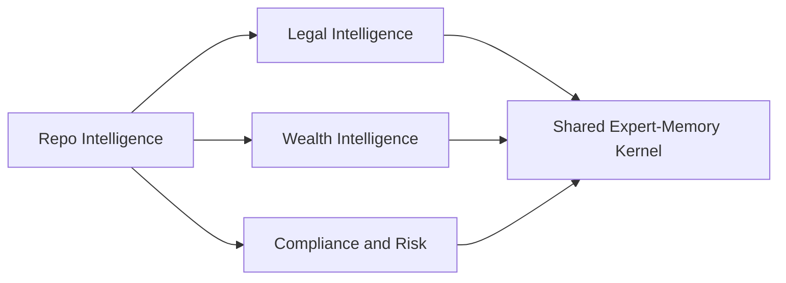

# Domain Transfer Map

## Thesis
The repo-codegraph work transfers well into law and wealth, but not because those domains also want ASTs. It transfers because they all need a trustworthy way to move from raw sources to claims, evidence, time, contradiction handling, and bounded retrieval.

## Current Repo Reality
The current repo pressure is strongest in the code domain:
- codegraph documents provide the clearest deterministic substrate
- semantic integration documents already generalize toward ontology, provenance, and temporal modeling
- the IP-law spec proves that transfer into a legal domain is already a live thread in this repository

## Strongly Supported Pattern
The generalizable pattern is:
- find the best deterministic substrate available in the domain
- turn extracted structure into normalized claims with evidence
- interpret those claims through controlled semantics
- preserve provenance and time
- build retrieval packets for actual expert tasks

## Exploratory Direction
The next meaningful leap is to think in terms of `domain adapters` over a shared expert-memory kernel.

A domain adapter would define:
- primary source systems
- deterministic extractors
- domain ontology or vocabulary
- validation policies
- contradiction and supersession rules
- retrieval packet templates for user workflows

## Comparison Table
| Dimension | Code | Law | Wealth | Compliance / Risk |
|---|---|---|---|---|
| Deterministic substrate | AST, types, symbols, imports, tests | citations, sections, filings, judgment metadata | transactions, positions, instruments, mandates, events | controls, incidents, policies, audit logs |
| Identity problem | medium | high | very high | high |
| Time pressure | medium | very high | very high | very high |
| Normativity | medium | extreme | high | extreme |
| Contradiction handling | medium | high | high | very high |
| Evidence granularity | lines and symbols | sections, holdings, citations, clauses | records, calculations, docs, events | control evidence, tickets, approvals |
| Feedback loop quality | strong compiler/test feedback | weak to moderate | moderate | moderate |
| Ambiguity level | relatively low | high | high | high |
| Safe reasoning potential | relatively high | medium | medium | medium |
| Retrieval consumers | developers, agents | attorneys, analysts, agents | advisors, analysts, agents | auditors, risk teams, agents |

## What Transfers Cleanly
These things transfer with relatively little conceptual change:
- certainty tiers
- claim plus evidence structure
- provenance requirements
- temporal lifecycle modeling
- bounded reasoning profiles
- retrieval packet construction
- domain-specific validation gates

## What Gets Harder Outside Code
### Identity
Code often has globally meaningful identifiers.

Law and wealth do not.

You will face:
- aliases
- renamed entities
- merged entities
- jurisdiction-specific identity boundaries
- document references that only make sense within a source system

### Time
Code often tolerates simple revision semantics.

Law and wealth demand finer distinctions:
- asserted time
- observed time
- effective time
- settlement time
- publication time
- superseded time

### Normativity
Code has architecture rules and design intent, but law and compliance are saturated with normative structure.

That means systems must represent:
- obligations
- permissions
- prohibitions
- duties
- exceptions
- governing scope

### Contradiction
In code, a contradiction often resolves to a broken reference or stale docstring.

In law or wealth, contradictory claims may both be real and still need to coexist until scope, time, or authority resolves them.

## What Code Teaches Before Entering Law Or Wealth
Code is still the right learning environment because it lets you practice:
- evidence attachment discipline
- semantic layering without total ambiguity
- temporal correction chains
- bounded inference with provenance
- retrieval packet design

In other words, code teaches the `operating system` of expert memory before you enter domains where every answer is more contested.

## Migration Pressure By Domain

The arrow is not really `code becomes law`. The arrow is `code validates the kernel`, then the same kernel is adapted to more ambiguous domains.

## Suggested Adapter Shapes
| Domain | Adapter responsibility |
|---|---|
| Code | AST extraction, symbol resolution, JSDoc semantics, build-aware freshness |
| Law | citation parsing, document segmentation, authority hierarchy, effective-date modeling |
| Wealth | position and transaction normalization, entity resolution, policy linkage, event-time handling |
| Compliance / Risk | control graphing, obligation tracking, evidence capture, exception lifecycle |

## Credible Product Shapes
| Shape | Core question |
|---|---|
| Repo intelligence tool | `What does this system do, what depends on it, and what changed?` |
| Legal memory tool | `What is the current position, what authority supports it, and what changed over time?` |
| Wealth intelligence tool | `What do we hold, what rules apply, what changed, and why did this alert fire?` |

## Questions Worth Keeping Open
- Which domain after code offers the best balance of value and tractability: law, wealth, or compliance?
- How much identity resolution should be generic infrastructure versus domain-specific logic?
- Which temporal distinctions should be mandatory across all adapters?
- What is the first non-code domain where the kernel can be tested without overwhelming ambiguity?
