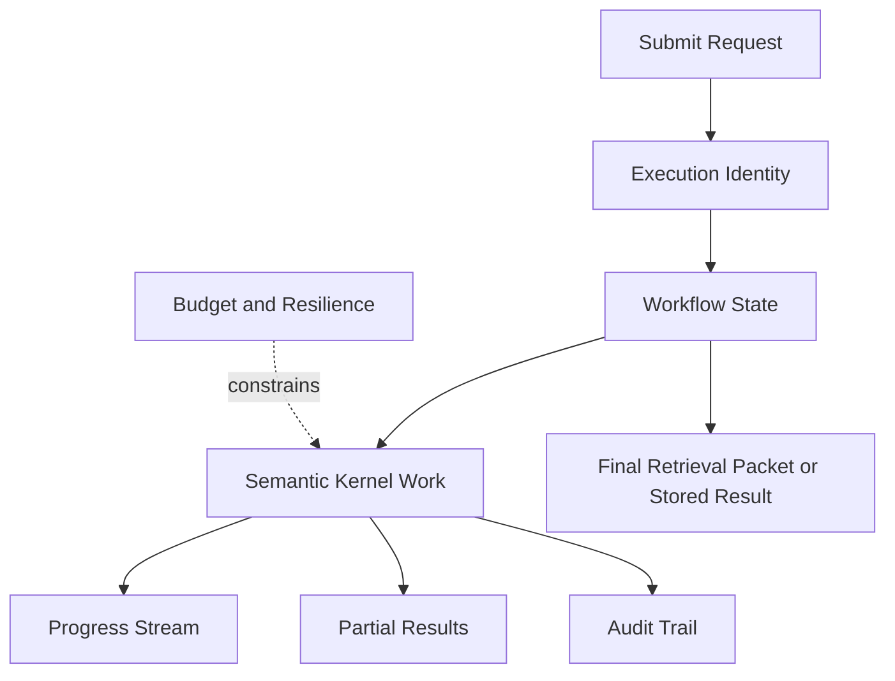

# Expert Memory Control Plane

## Thesis
A semantic kernel without a control plane will eventually fail in practice. Expert-memory systems are long-running, expensive, partially asynchronous, and often AI-assisted. That means identity, workflow state, progress, budgets, retries, cancellation, and auditability are not implementation details. They are part of the architecture.

## Current Repo Reality
The older `knowledge` slice is the strongest signal here:
- `./.repos/beep-effect/packages/knowledge/_docs/README-IDEMPOTENCY.md` (historical archive path, not checked into this checkout)
- `./.repos/beep-effect/packages/knowledge/_docs/PERSISTENCE_SUMMARY.md` (historical archive path, not checked into this checkout)
- `./.repos/beep-effect/packages/knowledge/_docs/PROGRESS_STREAMING_SUMMARY.md` (historical archive path, not checked into this checkout)
- `./.repos/beep-effect/packages/knowledge/_docs/LLM_CONTROL_STRATEGY_SUMMARY.md` (historical archive path, not checked into this checkout)
- `./.repos/beep-effect/packages/knowledge/_docs/architecture/workflow-state-patterns.md` (historical archive path, not checked into this checkout)
- `./.repos/beep-effect/packages/knowledge/server/src/Workflow/WorkflowPersistence.ts` (historical archive path, not checked into this checkout)
- `./.repos/beep-effect/packages/knowledge/server/src/Workflow/ProgressStream.ts` (historical archive path, not checked into this checkout)

These materials show that the system had already discovered several hard truths:
- repeated submissions need stable execution identity
- progress needs explicit contracts and backpressure policy
- workflow state can race or drift if modeled carelessly
- LLM cost and reliability need formal controls, not just a global timeout
- partial results and audit trails are product concerns, not debug leftovers

## Strongly Supported Pattern
A useful control plane covers at least these concerns:
- execution identity and idempotency
- durable workflow state
- progress and partial-result streaming
- budget, timeout, and resilience policy
- audit trail and replay surfaces

## Exploratory Direction
The future architecture should be described as:
- `semantic kernel`
- `control plane`
- `domain adapters`

The semantic kernel decides what the system can know.
The control plane decides whether the system can be trusted to keep knowing it under real execution.

## Why The Control Plane Matters
Without it, expert-memory systems suffer from:
- duplicated work
- silent drift between status and reality
- non-reproducible AI outputs
- hidden partial failures
- runaway cost
- weak observability
- poor user trust in long-running operations

## Core Control Plane Components
| Component | What it controls |
|---|---|
| `Execution identity` | whether the same request is recognized as the same work |
| `Workflow state` | whether the system knows what stage a run is in and can recover cleanly |
| `Progress stream` | whether clients can observe work without polling blind |
| `Partial-result policy` | whether the system can degrade gracefully instead of pretending everything is all-or-nothing |
| `Budget and resilience` | whether model calls stay within cost and latency bounds |
| `Audit surface` | whether a run can be inspected, replayed, or debugged later |

## Control Plane Diagram

## Authoritative Surfaces
One of the most useful old lessons is that the system should not pretend one persistence surface owns everything.

| Surface | What it owns | Why it should stay explicit |
|---|---|---|
| `Semantic state` | claims, evidence, provenance, retrieval inputs | supports durable domain truth and queryability |
| `Workflow state` | run stage, checkpoint, cancellation, terminal result | avoids race-prone status drift and enables resume behavior |
| `Artifacts and audit` | event timelines, debug bundles, generated outputs, serialized packets | preserves what happened during a run without polluting the semantic layer |

This split makes the control plane easier to reason about and keeps semantic storage from becoming a dumping ground for operational residue.

## 1. Execution Identity And Idempotency
A serious system needs a durable notion of `this is the same work`.

This matters for:
- deduplicating retries
- avoiding repeated model spend
- consistent cache reuse
- safe resume behavior

The old slice was already moving toward unified idempotency keys that incorporate:
- normalized input
- ontology or semantic version
- extraction parameters

That pattern should survive into the larger vision.

## 2. Durable Workflow State
Workflow state should be treated as its own concern.

It needs to model:
- current stage
- last successful checkpoint or activity
- terminal outcome
- cancellation
- retry ownership
- external visibility for status APIs

The old workflow-state notes are especially useful because they show how easy it is to create race conditions by publishing state outside the durable workflow boundary.

The practical lesson is straightforward:
- state should flow through durable workflow boundaries first
- external publishing should happen from committed state, not speculative side effects
- status APIs should reflect authoritative workflow state, not whatever a client last observed

## 3. Progress, Streaming, And Backpressure
Progress is not just a UX enhancement. It is part of trust.

Users and clients need to know:
- what is happening now
- what stage is slow
- whether the system is degraded but still useful
- whether cancellation is possible
- whether the client is falling behind the stream

The old slice treated progress as a typed event contract with backpressure semantics. That is the right direction.

It also made a stronger point that many systems skip:
- progress needs a schema, not ad hoc log strings
- backpressure needs a policy, not wishful thinking
- cancellation and resume behavior need to be disclosed at the protocol level

## 4. Partial-Result Semantics
Expert-memory systems should not collapse into all-or-nothing behavior.

Examples:
- entities extracted, relations still pending
- graph retrieved, citation validation incomplete
- legal memo skeleton generated, conflict checks still running
- wealth alert explanation available, some external references timed out

Partial results should be explicit, typed, and disclosed rather than implicit failure states.

## 5. Budget, Timeout, And Resilience Policy
Model-assisted systems need a control plane for spend and failure.

The old slice had explicit thinking around:
- per-stage timeouts
- token budgets
- central rate limiting
- circuit breakers
- fallback and retry policy
- graceful degradation and partial-result return rules

That is exactly right. The future system should not treat cost and latency as after-the-fact tuning.

## 6. Audit Surface
An expert-memory system should preserve what happened during a run, not just the final graph.

The audit surface should ideally support:
- event timeline
- major stage transitions
- failure records
- retry records
- artifacts produced
- configuration and model metadata

That makes post-hoc debugging and trust review possible.

## Why This Matters Across Domains
### Code
- long-running indexing needs resumability, status, and deduplication
- retrieval pipelines need budget-aware enrichment
- interactive tools benefit from partial results and progress streams

### Law
- extraction and verification steps may be expensive and multi-stage
- auditability is often a first-class requirement
- answer trust depends on showing which checks ran and which are still pending

### Wealth
- event ingestion and policy evaluation can be ongoing and incremental
- alerting systems need explicit partial-result and retry semantics
- operational traceability is often as important as semantic correctness

## Minimal Control Plane Contract
At minimum, an expert-memory system should have typed support for:
- `executionId`
- `idempotencyKey`
- `workflowState`
- `progressEvent`
- `partialResultPolicy`
- `budgetPolicy`
- `auditEvent`

That is a better baseline than thinking only in terms of request handlers and database writes.

## Questions Worth Keeping Open
- What is the smallest useful control plane for a local-first expert-memory product?
- Which control-plane concerns should live inside the main runtime versus separate infra services?
- How much progress granularity is valuable before the stream becomes noise?
- Which partial-result semantics should be standardized across all domain adapters?
