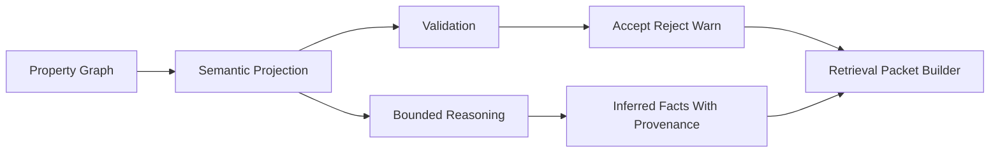

# Ontology and Reasoning Pragmatics

## Thesis
Ontology and reasoning are valuable in an expert-memory system when they operate as disciplined control surfaces, not as ideology. The right posture is pragmatic: property graph primary, semantic projection as overlay, validation explicit, reasoning bounded, provenance always attached.

## Current Repo Reality
The current semantic integration work in this repository already points in this direction:
- ontology is treated as a vocabulary and contract source
- RDFS and selected OWL behavior are discussed as bounded inference tools
- SHACL is framed as a quality gate
- PROV-O is treated as a provenance model rather than academic garnish

The strongest current references are still the repo-codegraph semantic documents and the legal KG direction, not a live product package.

## Strongly Supported Pattern
A useful stack looks like this:
- property graph for primary persistence and operational querying
- RDF or quad projection when semantic validation or reasoning needs it
- RDFS for lightweight closure and vocabulary consistency
- selected OWL rules for narrowly useful semantics
- SHACL for validation and policy gating
- SPARQL for diagnostics and verification workflows
- PROV-O style semantics for provenance and derivation tracking

## Exploratory Direction
The likely best long-term architecture is not `semantic web everywhere`. It is `semantic tools at the right seams`.

That means:
- not every request should invoke a reasoner
- not every entity needs full ontology treatment
- not every graph edge should become a semantic assertion
- not every inferred fact should be materialized

## Semantic Stack In Engineering Terms
| Tool | Pragmatic role |
|---|---|
| `RDFS` | lightweight subclass and property closure |
| `Selected OWL` | a small set of useful property semantics such as inverse or carefully bounded equivalence |
| `SHACL` | validation and admissibility policy |
| `SPARQL` | verification, diagnostics, and explicit semantic queries |
| `PROV-O` | provenance vocabulary for activities, entities, agents, and derivations |

## Property Graph First
The repo direction is right to keep the property graph primary.

Why:
- operational graph queries remain simpler
- application code stays closer to the domain model
- graph stores like FalkorDB and Neo4j are comfortable here
- retrieval packet generation usually wants entity and relation structure first

Why add a semantic projection at all:
- to validate claims against formal expectations
- to reason over vocabularies and subclass/property relations
- to express provenance and contradiction patterns more explicitly
- to support diagnostic queries that are awkward in the main operational shape

## Bounded Reasoning Profiles
A practical system should define reasoning profiles instead of a global `reasoning on/off` switch.

Suggested profile progression:

| Profile | What it allows | Why it is safe |
|---|---|---|
| `none` | no inference | best default for sensitive write paths |
| `rdfs-light` | subclass, subproperty, domain, range | low-cost and interpretable |
| `owl-property` | inverse, symmetric, transitive on explicitly approved properties | useful without full ontology explosion |
| `identity-guarded` | constrained alias or equivalence propagation | only when provenance and scope are strict |

## Where Semantic Tools Actually Help
### Code
- normalize architecture vocabulary
- infer safe category membership
- validate that certain documentation or design claims are coherent
- keep retrieval packets semantically consistent across packages

### Law
- express class and role hierarchies cleanly
- model jurisdictional or authority scopes
- validate that claims about provisions, rights, and judgments obey the chosen ontology
- support traceable reasoning about derived legal positions

### Wealth
- align instruments, accounts, entities, policies, and obligations under shared vocabulary
- validate policy applicability and relation shapes
- make explainability stronger for alerts, mandates, and derived risk posture

## Where Semantic Tools Hurt
They become dangerous when they:
- flatten domain ambiguity into false certainty
- overuse `sameAs`
- materialize low-quality inference into the main truth surface
- turn validation errors into silent graph drift
- introduce opaque reasoning that users cannot inspect

## Recommended Semantic Discipline
1. Keep asserted and inferred facts distinct.
2. Require provenance on every inferred fact.
3. Prefer lightweight RDFS closure before richer OWL behavior.
4. Treat SHACL as a gate, not a reporting afterthought.
5. Use SPARQL for verification and audit workflows, not as the universal product interface.
6. Keep a kill-switch for every reasoning profile.

## A Simple Working Posture

## Semantic Maturity Ladder
| Stage | Description |
|---|---|
| `Vocabulary only` | shared labels and relation names, no reasoning |
| `Validation aware` | ontology informs SHACL or equivalent constraints |
| `Reasoning assisted` | bounded profiles derive helpful context |
| `Lifecycle aware` | inferred facts participate in provenance and temporal policy |

That ladder is more useful than jumping directly to maximal semantic machinery.

## Questions Worth Keeping Open
- Which reasoning profiles would actually improve retrieval quality enough to justify operational complexity?
- Where should SHACL-style validation happen: write path, batch audits, or both?
- How much semantic projection should be precomputed versus created on demand?
- Which domains need true semantic rigor first: legal, compliance, or internal knowledge quality tooling?
