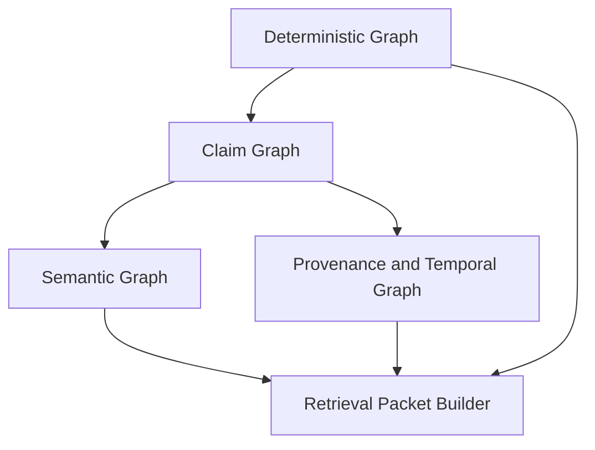

# Representation Layers

## Thesis
A useful expert-memory system needs more than one graph. The fastest way to make the system noisy is to collapse deterministic structure, semantic interpretation, claims, provenance, and temporal lifecycle into one undifferentiated edge soup.

## Current Repo Reality
The repo-codegraph materials already imply several distinct layers:
- deterministic extraction and certainty tiers in the main overview
- semantic projection, reasoning, validation, and provenance in the semantic integration document
- JSDoc fibration as a concrete example of separating stable meaning from occurrence payload

## Strongly Supported Pattern
Keep at least four logical layers distinct even if they share the same storage engine:
- deterministic graph
- semantic graph
- claim graph
- provenance and temporal graph

## Exploratory Direction
The likely durable architecture is a `layered property graph` with explicit projection rules between layers, and optional RDF or quad views for reasoning and validation.

## Layer Model

## Layer 1: Deterministic Graph
This layer stores the most mechanically grounded relationships available from the source.

Examples:
- code: `CONTAINS`, `IMPORTS`, `CALLS`, `EXPORTS`
- law: `CITES`, `ISSUED_BY`, `FILED_IN`, `MENTIONS_PROVISION`
- wealth: `HOLDS`, `SETTLED_AS`, `RECORDED_BY`, `TRIGGERED_EVENT`

This layer should be optimized for:
- traceability back to raw source
- cheap recomputation
- minimal interpretive risk

## Layer 2: Claim Graph
This layer turns raw structure into explicit assertions.

Examples:
- `service A depends on payment provider B`
- `judgment J narrows interpretation of provision P`
- `account K breached policy threshold T`

Why this layer matters:
- it gives the system a normalized unit for evidence and confidence
- it supports contradiction tracking
- it lets you carry multiple interpretations without overwriting the substrate

## Layer 3: Semantic Graph
This layer carries the ontology-driven meaning of the system.

Examples:
- class hierarchies
- role hierarchies
- property semantics
- normative categories
- semantic aliases or mapped terms

This is the layer that makes cross-source interpretation coherent, but it should not replace the deterministic layer.

## Layer 4: Provenance and Temporal Graph
This layer records:
- who or what created a claim
- which sources or prior claims were used
- when the claim was observed, asserted, derived, effective, or superseded
- how contradictions and corrections were resolved

Without this layer, the system will eventually answer questions confidently without being able to explain itself.

## Why Not One Graph?
If everything is stored as one flat node-edge soup, you get these failure modes:
- deterministic facts and soft interpretations become indistinguishable
- temporal transitions become destructive overwrites
- provenance becomes an afterthought instead of a queryable structure
- retrieval cannot reliably prefer stronger evidence over weaker inference
- ontology changes risk corrupting the apparent truth of raw extracted data

## Projection Discipline
A good layered system uses explicit projections:

| From | To | Purpose |
|---|---|---|
| Deterministic graph | Claim graph | turn raw structure into asserted propositions |
| Claim graph | Semantic graph | classify and interpret claims consistently |
| Claim graph | Provenance/temporal graph | preserve lineage and lifecycle |
| Deterministic + semantic + temporal | Retrieval packets | provide bounded context for real tasks |

## Running Example: One Repository Fact Across Layers
| Layer | Example |
|---|---|
| Deterministic | `Route /checkout HANDLES function checkoutHandler` |
| Claim | `checkout flow depends on payment orchestration` |
| Semantic | `payment orchestration` is classified as `CriticalDependency` |
| Provenance / Temporal | claim was inferred from file X, accepted on date Y, superseded after refactor Z |

The system gets stronger as it climbs layers, but only if each layer can still point back downward.

## Read Path Versus Write Path
Write path:
- source enters deterministic layer first
- claims are created or updated next
- semantic interpretation and validation follow
- provenance and temporal lifecycle are written alongside, not later

Read path:
- retrieval starts from the user task
- packet builder selects the right layer mix
- deterministic evidence is always preferred when available
- semantic or inferred context is included only when it improves the answer and can be explained

## Where JSDoc Fibration Fits
JSDoc fibration is a concrete example of representation layering inside a single schema shape:
- stable tag metadata lives in annotations
- occurrence payload lives in the instance fiber

That same design instinct generalizes to the broader graph system:
- keep stable semantic meaning separate from occurrence-specific claims
- make projection explicit rather than implicit

## Control Plane Is Cross-Cutting, Not Another Meaning Layer
The control plane should not be confused with a fifth semantic graph.

Its job is different:
- it governs how work is executed, resumed, streamed, retried, and audited
- it constrains write and read paths across every representation layer
- it preserves run identity and answer provenance without redefining domain meaning

That is why the control plane belongs alongside the layer model, but not inside the meaning hierarchy itself.

## Questions Worth Keeping Open
- Should claim records be modeled as explicit first-class nodes, edges, or a hybrid?
- Which layer boundaries should be physically distinct in storage and which can remain logical?
- How much provenance should be attached directly to claims versus stored in a separate lineage graph?
- What query API shape makes the layer boundaries visible without making the system cumbersome?
