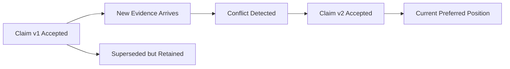

# Trust, Time, and Conflict

## Thesis
Time and contradiction are not edge cases in an expert-memory system. They are the center of the problem. A graph without temporal lifecycle and conflict handling eventually turns into a confidence theater where the system can state what it believes but cannot say what changed, when it changed, or why one claim currently outranks another.

## Current Repo Reality
The strongest current signals in this repository already point here:
- the semantic integration docs explicitly call out provenance and temporal dimensions
- the current thinking distinguishes deterministic facts from derived or enriched claims
- the legal direction naturally forces effective dates, authority changes, and supersession modeling

The older `knowledge` slice makes the lesson sharper:
- `./.repos/beep-effect/packages/knowledge/_docs/audits/AUDIT_SUMMARY.md` (historical archive path, not checked into this checkout)
- `./.repos/beep-effect/packages/knowledge/_docs/audits/2025-12-18-medium-severity-modeling-audit.md` (historical archive path, not checked into this checkout)

Those audits explicitly concluded that missing bitemporal fields were MVP blockers for timeline queries and for answering `what did we know when?`

## Strongly Supported Pattern
A trustworthy system should be able to answer all of these:
- what do we currently believe?
- what did we believe at a prior time?
- when did a claim enter the system?
- when did it become effective in the domain?
- when was it superseded, corrected, or deprecated?
- what evidence supported each stage?

## Exploratory Direction
The likely durable direction is a `claim lifecycle model` with explicit temporal fields and explicit contradiction states rather than destructive overwrite behavior.

## Why This Was Already A Blocker In Practice
The older slice is useful because it already learned the expensive lesson.

The audits found that without fields such as:
- `publishedAt`
- `ingestedAt`
- `assertedAt`
- `derivedAt`
- `eventTime`

several important workflows break down:
- timeline sorting by different meanings of time
- querying which facts were derived today
- reconstructing historical knowledge posture
- debugging why the system believed something at a certain point

That is strong evidence that time should be designed in up front.

## Time Is Not One Thing
A common failure is storing one timestamp and pretending the problem is solved.

A healthier model separates multiple times:

| Field | Meaning |
|---|---|
| `observedAt` | when the system saw source evidence |
| `publishedAt` | when a source document or event was published |
| `ingestedAt` | when the source entered the system |
| `assertedAt` | when the claim was entered or accepted into the graph |
| `derivedAt` | when an inference or enrichment produced the claim |
| `eventTime` | when the real-world event occurred, if known |
| `effectiveAt` | when the claim became true or operative in the domain |
| `supersededAt` | when the claim stopped being the current preferred position |

Not every domain needs every field, but a single `updatedAt` is not enough.

## Claim Lifecycle
A simple lifecycle can carry a lot of value.

| State | Meaning |
|---|---|
| `candidate` | extracted or proposed but not yet accepted |
| `accepted` | currently usable under the active policy |
| `contested` | conflicts with another viable claim or authority |
| `superseded` | replaced by a newer preferred claim |
| `deprecated` | retained for history but no longer preferred |
| `rejected` | explicitly excluded from current use |

## Correction Chain

The important point is that older claims are not deleted. They are reclassified in history.

## Why This Matters In Code
Code is often treated as if it only needs freshness, but even code benefits from temporal modeling:
- a JSDoc claim may be stale but historically explain why an API looks the way it does
- an architecture rule may have been correct before a refactor
- an inferred dependency may be valid only for a revision window
- retrieval for debugging or blame-style workflows may need historical context

## Why This Matters Even More In Law
Law makes the temporal problem obvious:
- a provision may be published before it becomes effective
- a judgment can supersede an earlier interpretation
- jurisdiction scope can change which claim is currently preferred
- two claims can both be valid but in different temporal or authority contexts

## Why This Matters In Wealth
Wealth and financial systems often have several competing clocks:
- transaction time
- settlement time
- valuation time
- ingestion time
- policy evaluation time
- alert creation time

A system that collapses those into one timestamp will eventually lie to users.

## Conflict Is Not Always Error
Contradiction handling should not assume that conflict means bad data.

Conflicts can arise because of:
- different authorities
- different times
- different scopes
- revised evidence
- model-generated overreach

The system should preserve this distinction:
- `incoherent` means the graph is broken
- `contested` means more than one claim is still live under different conditions or evidence

## The Real Modeling Burden
This is the key point for database selection debates:

Temporality is mostly a modeling problem.

A graph store can help, but it will not decide:
- which timestamps matter
- which lifecycle states matter
- how contradictions are represented
- what counts as supersession
- what history should remain queryable

That logic belongs in the expert-memory model, not in marketing claims about a store.

## Retrieval Implications
Retrieval packets should declare their temporal posture.

Examples:
- `current best-supported position`
- `state as of date X`
- `historical correction chain`
- `current position plus competing prior claims`

If temporal posture is not explicit, the same graph can produce correct-seeming but contextually wrong answers.

## Minimal Trust Contract
At minimum, any claim the system surfaces to an AI workflow should be able to reveal:
- current lifecycle state
- key timestamps
- evidence summary
- provenance summary
- why it outranks competing claims, if it does

## Questions Worth Keeping Open
- Which temporal fields should be mandatory across all domains and which should be adapter-specific?
- When should a claim move from `contested` to `superseded` versus staying live under scope conditions?
- How much historical state should retrieval packets expose by default?
- What is the simplest correction-chain model that still prevents destructive overwrite thinking?
