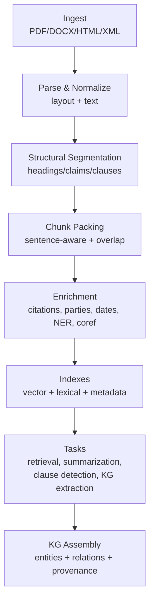
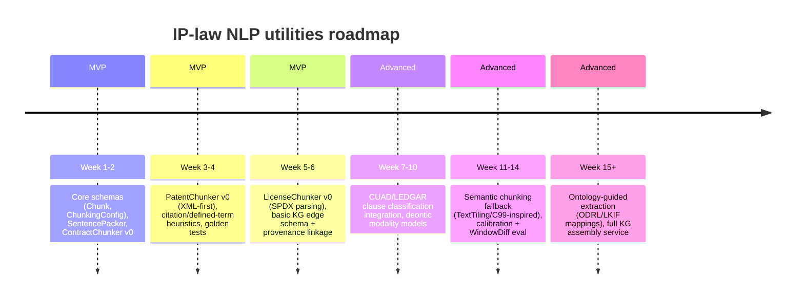

# Building an IP-Law NLP Utilities Package for Chunking and Knowledge Graph Extraction

## Executive summary

You already have the beginnings of a consistent, “Effect-first” NLP foundation in `packages/common/nlp`, but it is currently limited to deterministic normalization/variant helpers (query strings, identifiers, paths). fileciteturn14file0L1-L1 fileciteturn15file0L1-L1 fileciteturn16file0L1-L1 fileciteturn17file0L1-L1 fileciteturn18file0L1-L1 This is an excellent seed: legal/IP chunking benefits disproportionately from deterministic normalization (headers, clause numbering, citation tokens, “defined terms,” etc.), and the repo already demonstrates how to implement this style with Effect/Schema and strong unit tests. fileciteturn19file0L1-L1

The repository contains two especially relevant “north star” references you can align with immediately:

- A `TextChunk` + `ChunkingConfig` schema (with offsets and overlaps) already exists in the knowledge server subtree, including defaults like `maxChunkSize: 2000`, sentence-boundary preservation, and sentence overlap. fileciteturn20file0L1-L1  
- A completed “knowledge graph integration” handoff document lays out a streaming, staged extraction pipeline: `Document → Chunking → Mention Detection → Entity Extraction → Relation Extraction → Graph Assembly → Persist`, implemented as Effect Streams with structured output schemas. fileciteturn28file0L1-L1

This report proposes: (a) a robust chunking subsystem specialized for IP-law document families (patents, contracts, licenses, copyright-related docs), (b) schemas for chunk artifacts and an IP-law knowledge graph (with provenance + confidence), (c) concrete pipelines and tool choices, (d) evaluation strategy and datasets, and (e) an incremental implementation roadmap that can ship an MVP quickly while keeping a clean path to advanced semantic chunking and ontology-guided extraction.

**Enabled connector used:** GitHub (to inspect `kriegcloud/beep-effect`).  
**Assumptions used:** English-only, no strict compute limits, no fixed deployment environment (you can choose local, remote services, or hybrid).

## Findings from the `kriegcloud/beep-effect` repository

### Current `packages/common/nlp` package scope and patterns

`packages/common/nlp` is already packaged as an Effect/TypeScript module with documentation generation and tests wired in. fileciteturn8file0L1-L1 fileciteturn9file0L1-L1 The public exports are currently:

- `QueryText`: deterministic whitespace/punctuation normalization and backtick capture extraction. fileciteturn14file0L1-L1 fileciteturn16file0L1-L1  
- `IdentifierText`: tokenization + variant generation across camelCase/snake_case/kebab-case/spaced forms. fileciteturn15file0L1-L1  
- `PathText`: deterministic path normalization and module/file path variants (drop `./`, drop `.ts`, basename extraction). fileciteturn17file0L1-L1  
- `VariantText`: ordered dedupe (preserve first occurrence). fileciteturn18file0L1-L1

The unit tests demonstrate the repository’s “expected style”: deterministic transforms, explicit edge cases, and output stability. fileciteturn19file0L1-L1 This same style is ideal for *legal chunking heuristics*, where “it’s predictable and explainable” is often more important than “it’s clever,” especially for compliance and auditability.

### Existing chunk schema and pipeline design you can reuse

A `TextChunk` schema exists (index, text, start/end offsets, optional metadata) plus `ChunkingConfig` (max size, sentence preservation, overlap sentences, min chunk size) and defaults. fileciteturn20file0L1-L1 This is already close to what you want for IP-law documents; the main gap is **domain metadata** (section hierarchy, clause numbers, claim numbers, citations, parties, jurisdiction) and **provenance** (how the chunk was created, from what source, with what confidence).

The knowledge-graph integration handoff describes a staged, streaming extraction architecture and explicitly calls out sentence-aware chunking with overlap as Stage 1, followed by mention/entity/relation extraction with structured schemas. fileciteturn28file0L1-L1 This aligns strongly with how you should process IP documents at scale (especially patents and large contract suites): chunking must be deterministic and streaming-friendly; downstream extraction stages can be more probabilistic/ML-driven.

### Existing NLP ecosystem inside the repo

The repo vendors an “effect-nlp” toolkit that integrates `wink-nlp` with Effect and emphasizes tokenization with offsets, sentence/document modeling, and dependency injection via Effect Layers. fileciteturn26file0L1-L1 It defines “AI-facing” schemas for tokens, sentences, sentence-chunks, and entities with explicit offset metadata. fileciteturn24file0L1-L1 This is valuable because:

- IP-law chunking and knowledge graph extraction require **stable boundaries** (offsets) for downstream highlighting, audit trails, and re-scoring.  
- “AI-facing schemas” are useful if you use LLMs for mention/relation extraction but still want typed, validated outputs.

## Literature survey on legal chunking, citation extraction, clause detection, and semantic segmentation

Legal/IP document “chunking” is best understood as a **segmentation** problem with multiple levels:

- **Layout-level segmentation**: pages, headings, sections, numbered items, tables/figures
- **Rhetorical/functional segmentation**: purpose, definitions, grant, obligations, prohibitions, exceptions, remedies
- **Topic/semantic segmentation**: boundaries where the meaning or subject changes materially

A robust system typically combines rule-based + statistical/ML methods.

### Rule-based and structure-first segmentation

Rule-based chunkers leverage patterns that are unusually stable in legal drafting: numbering (e.g., “1.2”, “(a)”), headings (“Governing Law”), defined terms (“‘Confidential Information’ means…”), and citations (“35 U.S.C. § 102”, “26 CFR 31.3121”, “655 F.3d 1013”). LexNLP’s documentation and feature list explicitly highlight legal-aware sentence parsing, segmentation models for “pages or sections,” and extraction of courts/regulations/citations/jurisdictions—confirming that practical legal NLP tools treat segmentation + structured extraction as foundational. citeturn4search0turn0search18turn0search10

Rule-based segmentation is especially strong when the source is a structured format (XML/HTML) rather than OCR’d PDF. For patents, standards like WIPO’s ST.96 define explicit document components and elements such as bibliographic data, description, claims, abstract, drawings, etc., which are *ideal* chunk boundaries if your source is ST.96 XML. citeturn0search45turn0search0turn5search11

### Classic statistical segmentation and evaluation

Before transformers, segmentation was often done via lexical cohesion and topic shift detection:

- **TextTiling** (Hearst) partitions documents into multi-paragraph subtopic units using lexical patterns (TF/IDF-like signals). citeturn1search6  
- **C99** (Choi) is a domain-independent linear segmentation method inspired by image segmentation on sentence similarity matrices. citeturn1search20  

These approaches remain relevant as *unsupervised baselines* and as building blocks for hybrid systems (e.g., “use headings when present; otherwise fall back to cohesion-based breaks”).

Evaluation metrics for segmentation include **Pk** (introduced in segmentation literature) and **WindowDiff**, with WindowDiff proposed specifically to address shortcomings in Pk. citeturn6search5turn6search0

### Transformer-based and hybrid legal extraction

Modern legal NLP typically uses transformers (domain-adapted models) for:

- **Clause classification / clause span detection** (contracts)  
- **NER and entity linking** (parties, courts, regulations, dates, monetary amounts)  
- **Semantic retrieval** (embeddings over chunks)

Key datasets enabling supervised clause/spans:

- **CUAD**: 510 contracts with 13,000+ expert labels across 41 clause types, intended for highlighting salient portions for contract review. citeturn0search5turn0search11  
- **LEDGAR**: large-scale corpus of contract provisions from SEC filings (EDGAR) with many labels, intended for legal provision classification. citeturn0search19turn0search14  
- **ContractNLI**: document-level NLI over contracts (NDAs) with evidence identification defined at sentence/list-item granularity. citeturn4search2turn4search11  
- **ACORD**: clause retrieval dataset with expert-rated query–clause pairs for contract drafting/retrieval. citeturn0search7  
- Benchmarks like **LexGLUE** and **LegalBench** aggregate multiple legal tasks and are useful for broader model selection and regression testing. citeturn4search4turn1search3  

Domain-adapted transformer families (e.g., **LEGAL-BERT**) show that in-domain pretraining and careful fine-tuning can materially improve performance on legal tasks compared to “generic BERT out of the box.” citeturn7search1

### Citation extraction and “legal references” as first-class objects

In IP-law workflows, citations are often *the* key bridge from free-text to a knowledge graph:

- Patents cite other patents, publications, and standards; they also contain structured identifiers (application numbers, CPC classes).
- Contracts cite statutes, regulations, internal policies, exhibits, schedules, and defined terms.
- Licenses cite other licenses (SPDX expressions), and policy languages can express permissions/obligations in a structured way (ODRL).

LexNLP explicitly calls out extraction of “references to citations or regulations,” jurisdictions/controlling law, and IP-related symbols like copyrights and trademarks. citeturn0search10turn4search0  

For open source software licenses and many commercial license schedules, SPDX provides a standardized **license expression grammar** with `AND`/`OR`/`WITH` operators and a canonical license list—very useful for parsing and normalizing license clauses. citeturn2search3turn2search4  

For rights/permissions/obligations modeling beyond software licensing, W3C ODRL defines a policy information model and vocabulary for representing permissions, prohibitions, obligations, constraints, and parties—directly applicable to license/grant clauses and some contract obligations. citeturn3search3turn3search6  

## Chunking strategies by IP document type

This section is deliberately “implementation-oriented”: it proposes concrete chunk units, sizes, overlaps, and metadata fields to capture. A key design principle: **choose chunk boundaries that correspond to how lawyers reason** (claims, sections, definitions, obligations), not just fixed token windows.

### Cross-cutting heuristics

A robust IP-law chunker should support a multi-pass approach:

1. **Structural segmentation pass (highest priority):** Use explicit structure if available (XML tags, heading hierarchy, numbered clauses, claim numbers).  
2. **Sentence-aware packing:** Pack structural units into chunks near a target size, preserving sentence boundaries where possible (mirroring existing `ChunkingConfig` intent). fileciteturn20file0L1-L1  
3. **Overlap strategy:** Overlap across boundaries that frequently carry dependencies in law (definitions → operative clauses; exceptions → obligations; dependent claims → independent claims).  
4. **Fallback segmentation:** If structure is damaged (OCR) or absent, fall back to cohesion/topic-based segmentation (TextTiling/C99 style) and then pack. citeturn1search6turn1search20  

**Recommended default sizing (tokens):**
- **Embedding/RAG chunks:** ~300–800 tokens (overlap 50–150 tokens) is a common sweet spot for retrieval quality and manageable context construction; but in legal docs, “one clause” often matters more than raw size, so treat those numbers as *packing targets*, not mandatory.  
- **LLM extraction chunks:** often 800–2,000 tokens depending on LLM context and prompt design; your existing configs are character-based (~2000 chars), which is a reasonable conservative baseline, but for legal you’ll likely want both **token-based** and **character-based** options. fileciteturn20file0L1-L1  

**Recommended default overlap rules:**
- Always overlap **definitions** into subsequent substantive clauses if a defined term appears near the boundary.
- For enumerations/lists: overlap the **list header** and **last list item** into neighboring chunks (lists are frequent evidence spans in ContractNLI-like tasks). citeturn4search2turn4search11  

### Patents

**Best-case (structured source):** Use IPC/WIPO/USPTO XML to segment by authoritative components.

- WIPO ST.96 defines a `PatentPublication` element with children like bibliographic data, description, claims, abstract, drawings, etc. Those child nodes are natural top-level segments. citeturn5search11turn0search45  
- The entity["organization","United States Patent and Trademark Office","federal agency us"] provides patent grant and application full text datasets in XML (ICE DTD), which are parseable into consistent sections. citeturn5search0turn5search1  
- The USPTO also publishes a Patent Claims Research Dataset with parsed individual claims and dependency relationships (independent/dependent), which is extremely valuable for building “claim graph” chunks and evaluation. citeturn5search6  

**Recommended chunk units:**
- **Chunk type: `patent.biblio`**: bibliographic metadata (inventors, assignees, CPC, dates).  
- **Chunk type: `patent.abstract`**: whole abstract (usually short).  
- **Chunk type: `patent.claim`**: one claim per chunk by default; include dependency links (claim `n` depends on claim `m`).  
- **Chunk type: `patent.description.section`**: section-based (e.g., “BACKGROUND,” “SUMMARY,” “DETAILED DESCRIPTION”), then pack paragraphs.  
- **Chunk type: `patent.figure`**: figure captions/descriptions as separate chunks, but link to referenced figure IDs.  

**Heuristics & overlaps:**
- For **dependent claims**, overlap the **referenced independent claim** (or at least its preamble + key limitations) into the dependent claim chunk when possible. USPTO’s claim dependency data makes this systematic. citeturn5search6  
- For long single claims: apply sub-chunking at semantically meaningful delimiters:
  - claim preamble vs. transition phrase (“comprising”) vs. limitations list
  - “wherein” clauses as candidate sub-clauses

**Metadata to capture (patents):**
- `patent_number`, `application_number`, `publication_date`, `filing_date`
- `jurisdiction` (e.g., US, WO), `kind_code`
- claim structure: `claim_number`, `depends_on`, `is_independent`
- CPC/IPC classes (for retrieval facets)
- citations (US patents, applications, foreign patents, non-patent literature). PatentsView exposes fields for citations count and many bibliographic features to join against. citeturn5search14turn5search8  

### Contracts

Contracts are typically semi-structured: headings + numbering + exhibits. The key is to treat **clauses and their subclauses as first-class chunks**, not sliding windows.

**Recommended chunk units:**
- **Chunk type: `contract.article`**: top-level “ARTICLE X – …” sections.
- **Chunk type: `contract.section` / `contract.clause`**: numbered section and sub-section, generally the best unit for retrieval and clause classification.
- **Chunk type: `contract.definition`**: each definition as a separate chunk, plus a packed “definitions section” chunk for retrieval.
- **Chunk type: `contract.exhibit`**: each exhibit/schedule as its own document subtree; treat it like its own doc type.

**Heuristics & overlaps:**
- Overlap **definitions** forward: when a clause uses a defined term introduced earlier, include the definition chunk ID(s) as `related_chunks` rather than duplicating text, unless you’re doing LLM extraction (where duplication may be worth the cost).
- For indemnity/limitation-of-liability clauses, overlap:
  - the **cap definition** (e.g., “aggregate liability shall not exceed…”) and  
  - any **exceptions** (e.g., willful misconduct, IP infringement)  
  because exceptions reverse meaning and are frequent failure modes in contract analytics. (This is the same “negation by exception” difficulty ContractNLI flags as important.) citeturn4search11turn4search2  

**Chunk sizing:**
- Clause-level chunks often land between 150–600 tokens; pack multiple short clauses only if they share the same heading and are semantically linked.
- If chunking for CUAD-style span labeling, preserve the original clause boundaries as close as possible because annotation is span-oriented. citeturn0search5turn0search8  

**Metadata to capture (contracts):**
- Parties (names, roles: disclosing/receiving party, licensor/licensee)
- Effective dates, termination dates, renewal triggers
- Governing law and jurisdiction; LexNLP explicitly targets governing law/jurisdiction extraction. citeturn0search10turn4search0  
- Clause type labels (CUAD/LEDGAR-style)
- Deontic modality: obligation/permission/prohibition/entitlement (useful for knowledge graphs and policy reasoning; the recent survey excerpt highlights deontic modality datasets derived from LEDGAR). citeturn0search17turn0search19  

### Licenses

Licenses split into two major families you should treat differently:

- **Software/open source licenses** (often parseable via SPDX IDs / standardized texts)
- **Commercial/content licenses** (rights grants, fields of use, territories, sublicenses, royalties)

**Recommended chunk units:**
- **Chunk type: `license.section`**: numbered sections (“Grant,” “Restrictions,” “Termination,” “Disclaimer,” “Limitation of Liability”).  
- **Chunk type: `license.grant` / `license.restriction` / `license.obligation`**: functional decomposition for KG extraction.  
- For software license headers: parse SPDX license identifiers/expressions as atomic objects. SPDX provides an ABNF grammar and canonical list. citeturn2search3turn2search4  

**Heuristics & overlaps:**
- Overlap across:
  - grant ↔ conditions (“subject to…”)
  - termination ↔ cure/notice provisions
  - license compatibility clauses referencing other licenses (via SPDX expressions where applicable)

**Metadata to capture (licenses):**
- parties (licensor/licensee), assets (software, content), territories, term
- rights (reproduce/distribute/modify/etc.), constraints (time/geo/field-of-use), obligations (payment, attribution)
- SPDX license expression (if present), license IDs (normalize case-insensitively per SPDX guidance). citeturn2search3turn2search1  
- Optional policy representation in ODRL-compatible structures when you want machine reasoning about permissions/obligations. citeturn3search3turn3search6  

### Copyright-related documents

“Copyright documents” may mean: copyright registration records, notices, assignments, work-for-hire clauses, content license terms (including Creative Commons), and infringement-related filings. Their structure varies; the safest approach is **structure-first, then function-first**.

**Recommended chunk units:**
- **Chunk type: `copyright.notice`**: copyright notice blocks (© YEAR OWNER).
- **Chunk type: `copyright.assignment`**: grant/assignment clause, with any carve-outs.
- **Chunk type: `copyright.workforhire`**: work-made-for-hire / assignment fallback language.
- **Chunk type: `copyright.license`**: permission/prohibition/obligation statements—often modelable with ODRL-style concepts. citeturn3search3turn3search6  

If you ingest copyright records via patent/IP exchange formats, note that WIPO ST.96 explicitly covers multiple IP types (including copyright) via categorized XML schemas, which can offer structure-first chunking when available. citeturn0search45turn0search0  

## Schemas for chunks and an IP-law knowledge graph

The core requirement is **auditability**: every extracted entity/relation must trace back to chunk(s) with offsets and provenance. This is where a schema-first approach (Effect Schema / JSON Schema) pays off.

### Chunk schema design

You already have a `TextChunk` concept with offsets and metadata. fileciteturn20file0L1-L1 Expand it into a *domain-aware* chunk schema that still supports generic tooling.

**Recommended fields (conceptual model):**
- Identity: `chunk_id`, `document_id`, `chunk_index`
- Text: `text`, `normalized_text` (optional)
- Location: `start_offset`, `end_offset`, `page_start`, `page_end` (optional), `bbox` (optional for PDF layout)
- Structure path:
  - `doc_type` (`patent`, `contract`, `license`, `copyright`, `unknown`)
  - `section_path` (e.g., `["ARTICLE 9", "9.2", "(b)"]`)
  - `heading` (nearest heading), `list_item_path` (if inside list)
- Signals:
  - `token_count_est`, `char_count`
  - `contains_definitions`, `contains_citations`, `contains_tables`
- Links:
  - `related_chunk_ids` (definitions, referenced claims, cross-references)
- Provenance & scoring:
  - `created_by` (algorithm name + version), `created_at`
  - `confidence` (0–1) for “boundary quality” if using ML/semantic chunking
  - `source` (file, OCR engine, parser), plus checksums/hashes
- Extraction attachments (optional, computed later):
  - `entities[]`, `citations[]`, `clause_labels[]`

### Knowledge graph schema design

An IP-law KG usually needs both **document-structure entities** (Claim, Clause, Definition) and **substantive legal entities** (Party, Right, Obligation, Patent, Jurisdiction).

Two practical design options:

1. **Property graph (Neo4j-style)**: easier incremental evolution, flexible attributes, fast traversal.
2. **RDF/OWL graph**: interoperable with legal ontologies; good if you have formal semantics and want reasoning.

Your repo’s ontology parsing/service patterns suggest you’re already thinking in ontology terms and structured type constraints. fileciteturn28file0L1-L1 For provenance, align with the W3C PROV-O model (Entity/Activity/Agent + derivation links). citeturn2search0

**Core node types (suggested):**
- `Document` (with subtype `PatentDocument`, `ContractDocument`, `LicenseDocument`)
- `Segment` (maps to chunk; maintain offsets and source links)
- `Party` (person/org), `Role` (licensor/licensee, disclosing party)
- `Jurisdiction`
- Patent-specific: `Patent`, `Claim`, `CPCClass`, `Citation`
- Contract/license-specific: `Clause`, `Definition`, `Obligation`, `Permission`, `Prohibition`, `Condition`, `Exception`, `Remedy`
- IP assets: `Work`, `Software`, `Trademark`, `TradeSecret` (as needed)

**Core edge types (suggested):**
- `HAS_SEGMENT` (Document → Segment)
- `MENTIONS` (Segment → Entity)
- `ASSERTS` (Segment → Obligation/Permission/etc.)
- `GOVERNS` (Jurisdiction → Document/Clause)
- Patent edges: `HAS_CLAIM` (Patent → Claim), `DEPENDS_ON` (Claim → Claim), `CITES` (Patent → Patent/Publication)
- Contract/license edges: `DEFINES` (Definition → Term), `APPLIES_TO` (Clause/Obligation → Party/Asset), `EXCEPTS` (Exception → Obligation)

**Provenance fields (recommended everywhere):**
- `provenance.activity_id`, `provenance.agent` (system vs human), `provenance.model` (if ML/LLM), `provenance.prompt_hash` (if relevant), `source_chunk_ids`
- `confidence.score` + `confidence.calibration` metadata

## Pipeline architectures and tool choices

This section describes a concrete, modular pipeline consistent with the repo’s Effect/Schema style and its staged extraction plan. fileciteturn28file0L1-L1

### Reference pipeline



### Preprocessing and ingestion

**Patents (preferred):** ingest XML directly rather than PDF whenever possible.

- USPTO provides patent grant and application full text in XML (ICE DTD) at large scale. citeturn5search0turn5search1  
- WIPO ST.96 provides standardized schema components for IP exchange and explicitly enumerates patent components and document-level components. citeturn0search45turn0search0turn5search11  

**Contracts/licenses (common):** PDFs and DOCX are typical; chunking quality depends on how well you preserve numbering and headings.

A practical approach is to support three ingestion tiers:

- **Tier 1:** structured HTML/XML → high-fidelity structure extraction  
- **Tier 2:** DOCX → parse headings, numbering, lists  
- **Tier 3:** PDF → extract text + layout; if scanned, OCR then rebuild structure heuristically

### Chunking engine design

Implement chunking as **composable strategies**:

- `StructureFirstChunker` (per doc type)
- `SentencePacker` (packs units into target size, with overlap)
- `FallbackSemanticChunker` (TextTiling/C99-inspired, optional) citeturn1search6turn1search20  

Your existing `ChunkingConfig` concepts (size, sentence boundary, overlap) map naturally to the `SentencePacker` stage. fileciteturn20file0L1-L1

### Entity extraction, citation parsing, and embeddings

A pragmatic split:

- **Deterministic extraction:**  
  - citations (statutes, CFR/USC patterns, patent numbers, docket/case citations where relevant)  
  - dates/amounts/percentages (regex + normalization)  
  - section/claim numbering

- **ML/LLM extraction:**  
  - clause classification (CUAD/LEDGAR tasks) citeturn0search5turn0search19  
  - deontic modality and role labeling citeturn0search17  
  - entity linking to ontology types (if you maintain an IP-law ontology)

For legal-domain transformers, **LEGAL-BERT** provides a strong family of in-domain models and studies adaptation strategies. citeturn7search1 For patent-specific embeddings/classification, patent-claim-focused models show that claims-only representations can be sufficient for downstream tasks and retrieval/classification. citeturn7search15turn5search6

### Tools and libraries comparison

A compact “decision table” for core components (not exhaustive):

| Need | Rule-based / deterministic | ML / model-based | Notes |
|---|---|---|---|
| Sentence splitting (legal-aware) | LexNLP legal-aware sentence parser citeturn4search0 | spaCy pipeline customization; domain models like Blackstone | Sentence splitting must respect abbreviations (“LLC.”, “F.3d”) and section numbering; LexNLP explicitly targets this. citeturn4search0 |
| Contract clause span labeling | Regex + numbering heuristics | CUAD-trained span models; Legal-BERT fine-tunes | CUAD is expert-annotated for clause spans. citeturn0search5turn0search8 |
| Clause/provision classification | Keyword rules + section titles | LEDGAR-style multi-label classifiers; Legal-BERT family | LEDGAR provides a large corpus for provision classification. citeturn0search19turn7search1 |
| Patent claim parsing / dependency | XML tags; claim numbering rules | USPTO Claims Research Dataset parsing/validation | USPTO publishes parsed claims and dependencies as a dataset. citeturn5search6turn5search0 |
| License normalization | SPDX expression parser (ABNF) citeturn2search3 | LLM classification for custom/proprietary licenses | SPDX gives canonical IDs and grammar. citeturn2search4 |
| Rights/obligations modeling | ODRL vocabulary mapping citeturn3search3turn3search6 | LLM extraction to ODRL-like JSON | ODRL is a W3C Recommendation for policy/rights modeling. citeturn3search3turn3search6 |
| Provenance | PROV-O mapping citeturn2search0 | — | Strongly recommended for auditability and KG traceability. citeturn2search0 |

## Evaluation, datasets, and testing strategy

### What to measure

A mature IP-law chunker should be evaluated at three layers:

1. **Segmentation quality:** Are boundaries correct and stable?  
   - Metrics: WindowDiff / Pk on boundary sequences. citeturn6search0turn6search5  
2. **Downstream task lift:** Does chunking improve retrieval, clause detection, KG extraction?  
   - Retrieval metrics: MRR / nDCG / Recall@K on clause retrieval tasks (ACORD). citeturn0search7  
   - Clause detection: span F1 and exact-match for CUAD. citeturn0search5turn0search8  
3. **Auditability & reproducibility:**  
   - Stability tests: same input → same chunks (deterministic), or bounded variance if semantic chunking is enabled.  
   - Provenance completeness: every extracted fact must link to chunk IDs and offsets.

### Public datasets you can use immediately

- Contracts:
  - CUAD (clause span labels) citeturn0search5turn0search8  
  - LEDGAR (provisions classification) citeturn0search19  
  - ContractNLI (evidence spans at sentence/list-item level) citeturn4search2turn4search11  
  - ACORD (retrieval task) citeturn0search7  

- Broader benchmarks:
  - LexGLUE (multi-task legal NLU) citeturn4search4  
  - LegalBench (many legal reasoning task formats) citeturn1search3turn1search2  

- Patents:
  - USPTO patent grant/application XML corpora (for structural parsing regression tests). citeturn5search0turn5search1  
  - USPTO Patent Claims Research Dataset (claim parsing + dependencies + document/claim statistics). citeturn5search6  

### Suggested annotation guidelines for your own IP-law chunking eval set

Even with public datasets, you’ll want a small internal “gold” set focused on your use cases (e.g., software licenses and patent claims for product domains you care about). The CUAD Labeling Handbook is a strong example of how to define clause categories and span boundaries with legal disclaimers and consistency rules. citeturn0search8

For your annotation rubric:

- Define document type first (patent/contract/license/copyright).
- Define allowable chunk boundaries:
  - **hard boundaries**: claim boundary, numbered clause boundary, section heading boundary, exhibit boundary
  - **soft boundaries**: paragraph boundary, sentence boundary, topic-shift boundary
- Require annotators to mark:
  - boundary location
  - rationale (“new obligation starts,” “exception begins,” “claim dependency begins”)
  - whether neighboring overlap is required (Y/N)
- Require evidence linkage rules:
  - every extracted entity/relation must cite at least one chunk ID + offsets

## Security, privacy, and implementation roadmap

### Security, privacy, and legal handling considerations

IP-law documents often contain trade secrets, privileged communications, personal data, and contractual confidentiality obligations. A chunking pipeline increases risk because it creates many derivative artifacts (chunks, embeddings, indexes, logs).

Minimum controls to design in from day one:

- **Data minimization:** store only what you need; consider hashing/redacting PII in logs.
- **Access control:** chunk stores and vector indexes should inherit document ACLs (never “public index” a private contract).
- **Provenance for audits:** record parser/OCR versions, chunking config, and hashes; PROV-O provides a standard vocabulary for provenance exchange. citeturn2search0  
- **Prompt/LLM hygiene:** if you use LLMs, treat prompts and outputs as sensitive derived data; store prompt templates by hash; restrict retention.

### `packages/common/nlp` API and code patterns

The repo’s existing style suggests:

- Use **Effect Schema** for all externally visible artifacts (chunks, configs, extracted entities). fileciteturn20file0L1-L1  
- Prefer deterministic transformations with explicit tests (as the current `TextVariants.test.ts` illustrates). fileciteturn19file0L1-L1  
- Compose services using Effect Layers when you move from “pure function chunkers” to “pipeline services” (mirroring the staged extraction handoff). fileciteturn28file0L1-L1  

A suggested module layout:

- `src/`
  - `chunking/`
    - `Chunk.ts` (schemas)
    - `ChunkingConfig.ts`
    - `Chunker.ts` (interfaces)
    - `packers/SentencePacker.ts`
    - `strategies/PatentChunker.ts`
    - `strategies/ContractChunker.ts`
    - `strategies/LicenseChunker.ts`
    - `strategies/CopyrightChunker.ts`
  - `legal/`
    - `Citations.ts` (regex + parsers)
    - `DefinedTerms.ts`
    - `Deontic.ts`
  - `provenance/`
    - `Provenance.ts` (PROV-inspired schema mapping) citeturn2search0  
  - `index.ts`

#### Example JSON Schema snippets

Below are **illustrative JSON Schemas** you can use for interchange (store, queue, API). In your codebase, mirror these with Effect `S.Class`/`Schema.Struct` definitions to match current patterns. fileciteturn20file0L1-L1

```json
{
  "$schema": "https://json-schema.org/draft/2020-12/schema",
  "$id": "https://example.org/schemas/ipnlp/chunk.schema.json",
  "title": "DocumentChunk",
  "type": "object",
  "required": ["chunk_id", "document_id", "chunk_index", "doc_type", "text", "start_offset", "end_offset", "created_by"],
  "properties": {
    "chunk_id": { "type": "string" },
    "document_id": { "type": "string" },
    "chunk_index": { "type": "integer", "minimum": 0 },
    "doc_type": { "type": "string", "enum": ["patent", "contract", "license", "copyright", "unknown"] },
    "chunk_type": { "type": "string" },
    "text": { "type": "string" },
    "start_offset": { "type": "integer", "minimum": 0 },
    "end_offset": { "type": "integer", "minimum": 0 },
    "page_start": { "type": ["integer", "null"], "minimum": 1 },
    "page_end": { "type": ["integer", "null"], "minimum": 1 },
    "structure": {
      "type": "object",
      "properties": {
        "heading": { "type": ["string", "null"] },
        "section_path": { "type": "array", "items": { "type": "string" } },
        "list_path": { "type": "array", "items": { "type": "string" } }
      }
    },
    "links": {
      "type": "object",
      "properties": {
        "related_chunk_ids": { "type": "array", "items": { "type": "string" } },
        "cross_references": { "type": "array", "items": { "type": "string" } }
      }
    },
    "signals": {
      "type": "object",
      "properties": {
        "char_count": { "type": "integer", "minimum": 0 },
        "token_count_est": { "type": ["integer", "null"], "minimum": 0 },
        "contains_definitions": { "type": "boolean" },
        "contains_citations": { "type": "boolean" }
      }
    },
    "created_by": {
      "type": "object",
      "required": ["algorithm", "version", "created_at"],
      "properties": {
        "algorithm": { "type": "string" },
        "version": { "type": "string" },
        "created_at": { "type": "string", "format": "date-time" }
      }
    },
    "confidence": {
      "type": ["object", "null"],
      "properties": {
        "boundary_score": { "type": "number", "minimum": 0, "maximum": 1 },
        "notes": { "type": "string" }
      }
    },
    "metadata": { "type": "object", "additionalProperties": true }
  }
}
```

A minimal KG edge schema (again illustrative):

```json
{
  "$schema": "https://json-schema.org/draft/2020-12/schema",
  "$id": "https://example.org/schemas/ipnlp/kg-edge.schema.json",
  "title": "KnowledgeGraphEdge",
  "type": "object",
  "required": ["edge_id", "type", "from_id", "to_id", "source_chunk_ids", "confidence"],
  "properties": {
    "edge_id": { "type": "string" },
    "type": { "type": "string" },
    "from_id": { "type": "string" },
    "to_id": { "type": "string" },
    "source_chunk_ids": { "type": "array", "items": { "type": "string" } },
    "confidence": { "type": "number", "minimum": 0, "maximum": 1 },
    "provenance": {
      "type": "object",
      "properties": {
        "activity": { "type": "string" },
        "agent": { "type": "string" },
        "model": { "type": ["string", "null"] }
      }
    }
  }
}
```

### Sample chunk outputs by document type

Patent claim chunk (uses structured metadata; claims are natural boundaries, and dependencies should be captured when available via USPTO claim datasets). citeturn5search6turn5search0

```json
{
  "chunk_id": "chunk_pat_000123_claim_001",
  "document_id": "patent_us_1234567",
  "chunk_index": 7,
  "doc_type": "patent",
  "chunk_type": "patent.claim",
  "text": "1. A method comprising: receiving ... wherein ...",
  "start_offset": 18234,
  "end_offset": 19510,
  "structure": {
    "heading": "Claims",
    "section_path": ["Claims", "Claim 1"],
    "list_path": []
  },
  "links": {
    "related_chunk_ids": [],
    "cross_references": ["Fig. 2", "paragraph [0045]"]
  },
  "signals": {
    "char_count": 1276,
    "token_count_est": 260,
    "contains_definitions": false,
    "contains_citations": true
  },
  "created_by": {
    "algorithm": "PatentChunker+SentencePacker",
    "version": "0.1.0",
    "created_at": "2026-03-21T12:00:00Z"
  },
  "metadata": {
    "claim_number": 1,
    "is_independent": true,
    "depends_on": [],
    "jurisdiction": "US",
    "patent_number": "1234567"
  }
}
```

Contract clause chunk (align clause boundaries; CUAD-like workflows depend on stable spans). citeturn0search5turn0search8

```json
{
  "chunk_id": "chunk_ct_009_liability_002",
  "document_id": "contract_nda_2026_001",
  "chunk_index": 31,
  "doc_type": "contract",
  "chunk_type": "contract.clause",
  "text": "9.2 Limitation of Liability. Except for ... neither party shall be liable for ...",
  "start_offset": 9041,
  "end_offset": 10220,
  "structure": {
    "heading": "Limitation of Liability",
    "section_path": ["9", "9.2"],
    "list_path": []
  },
  "links": {
    "related_chunk_ids": ["chunk_ct_definitions_confidential_information"],
    "cross_references": ["Section 10", "Exhibit A"]
  },
  "signals": {
    "char_count": 1179,
    "token_count_est": 240,
    "contains_definitions": false,
    "contains_citations": false
  },
  "created_by": {
    "algorithm": "ContractChunker+SentencePacker",
    "version": "0.1.0",
    "created_at": "2026-03-21T12:00:00Z"
  },
  "metadata": {
    "parties": ["Disclosing Party", "Receiving Party"],
    "potential_clause_labels": ["limitation_of_liability", "carveouts"],
    "governing_law_hint": "Delaware"
  }
}
```

License clause chunk (capture SPDX and/or ODRL-style rights modeling where present). citeturn2search3turn3search3turn3search6

```json
{
  "chunk_id": "chunk_lic_001_grant_001",
  "document_id": "license_enterprise_2025_07",
  "chunk_index": 4,
  "doc_type": "license",
  "chunk_type": "license.grant",
  "text": "Subject to the terms of this Agreement, Licensor grants Licensee a non-exclusive, non-transferable license to ...",
  "start_offset": 2100,
  "end_offset": 2950,
  "structure": {
    "heading": "Grant of License",
    "section_path": ["2", "2.1"],
    "list_path": []
  },
  "links": {
    "related_chunk_ids": ["chunk_lic_001_definitions_software"],
    "cross_references": []
  },
  "signals": {
    "char_count": 850,
    "token_count_est": 170,
    "contains_definitions": false,
    "contains_citations": false
  },
  "created_by": {
    "algorithm": "LicenseChunker+SentencePacker",
    "version": "0.1.0",
    "created_at": "2026-03-21T12:00:00Z"
  },
  "metadata": {
    "spdx_expression": null,
    "odrl_candidate": {
      "permission": [{ "action": "use", "target": "Software", "assignee": "Licensee" }]
    }
  }
}
```

Copyright assignment chunk (treat assignment/work-for-hire language as primary evidence for KG facts).

```json
{
  "chunk_id": "chunk_cr_001_assignment_001",
  "document_id": "copyright_assignment_2024_11",
  "chunk_index": 12,
  "doc_type": "copyright",
  "chunk_type": "copyright.assignment",
  "text": "Assignor hereby assigns to Assignee all right, title, and interest in and to the Work, including all copyrights...",
  "start_offset": 4550,
  "end_offset": 5200,
  "structure": {
    "heading": "Assignment",
    "section_path": ["4"],
    "list_path": []
  },
  "links": {
    "related_chunk_ids": ["chunk_cr_def_work"],
    "cross_references": []
  },
  "signals": {
    "char_count": 650,
    "token_count_est": 130,
    "contains_definitions": false,
    "contains_citations": false
  },
  "created_by": {
    "algorithm": "CopyrightChunker+SentencePacker",
    "version": "0.1.0",
    "created_at": "2026-03-21T12:00:00Z"
  },
  "metadata": {
    "assignor": "Alice Example",
    "assignee": "Example Studios LLC",
    "work_title_hint": "Project Phoenix"
  }
}
```

### Unit and integration test ideas aligned to your repo patterns

**Unit tests (deterministic):**
- Header parsing: “ARTICLE IV”, “4.2(a)”, roman numerals, nested lists.
- Defined term extraction and linking (“‘Confidential Information’ means …”).
- Patent claim splitting and dependency mapping (when dependency inputs provided).
- SPDX expression parsing (AND/OR/WITH) and normalization. citeturn2search3turn2search4  
- Stable offsets: ensure `start_offset/end_offset` correspond to slices of the original normalized text.

**Integration tests (pipeline):**
- “Document → chunks → citations/entities → KG edges,” verifying that every edge points to at least one chunk ID.
- Regression test on a small set of USPTO XML patents and contract PDFs ensuring structure-first segmentation remains stable across releases. citeturn5search0turn5search1  
- Retrieval harness: ACORD-style query→clause ranking evaluation to measure chunking choices impact retrieval. citeturn0search7  

### Prioritized implementation roadmap with effort estimates

A realistic roadmap that matches the repo’s existing streaming extraction design. fileciteturn28file0L1-L1



**MVP scope (roughly 4–6 weeks total, 1–2 engineers):**
- Implement domain-aware chunkers with deterministic structure extraction.
- Produce chunk artifacts with offsets + metadata + provenance.
- Add SPDX expression parsing support (licenses).
- Add a minimal KG extraction interface that emits typed edges grounded to chunk IDs.

**Advanced scope (additional 8–12+ weeks, depending on ML depth):**
- Train/fine-tune clause/modality models (CUAD/LEDGAR/ContractNLI tasks). citeturn0search5turn0search19turn4search2  
- Implement semantic chunking fallback and evaluate with WindowDiff/Pk. citeturn6search0turn6search5  
- Add ontology/rights modeling: ODRL alignment for license-like rights and PROV-O provenance alignment for KG auditability. citeturn3search3turn2search0  
- Extend patent support with claim dependency graph and citation joins (USPTO patent claims dataset + PatentsView). citeturn5search6turn5search14  

### References

- entity["people","Marti A. Hearst","nlp researcher"]. “TextTiling: Segmenting Text into Multi-paragraph Subtopic Passages.” citeturn1search6  
- entity["people","Freddy Y. Y. Choi","nlp researcher"]. “Advances in domain independent linear text segmentation.” citeturn1search20  
- entity["people","Lev Pevzner","computer scientist"] and Hearst. “A Critique and Improvement of an Evaluation Metric for Text Segmentation.” citeturn6search0  
- CUAD dataset and labeling handbook (Atticus Project). citeturn0search5turn0search8  
- LEDGAR dataset (ACL Anthology). citeturn0search19  
- ContractNLI dataset (Stanford NLP). citeturn4search2turn4search11  
- ACORD dataset (Atticus Project). citeturn0search7  
- LexGLUE benchmark (ACL Anthology). citeturn4search4  
- LegalBench benchmark. citeturn1search3turn1search2  
- LEGAL-BERT (ACL Anthology). citeturn7search1  
- WIPO ST.96 handbook and schema annex pages. citeturn0search45turn0search0turn5search11  
- USPTO patent full text XML datasets and Patent Claims Research Dataset. citeturn5search0turn5search1turn5search6  
- PatentsView API endpoints. citeturn5search14  
- SPDX specification (license expressions; license list). citeturn2search3turn2search4  
- entity["organization","World Wide Web Consortium","web standards body"] PROV-O provenance ontology. citeturn2search0  
- W3C ODRL Information Model and Vocabulary. citeturn3search3turn3search6  
- Repo internal references: existing `TextChunk`/`ChunkingConfig` schema and staged extraction pipeline handoff. fileciteturn20file0L1-L1 fileciteturn28file0L1-L1